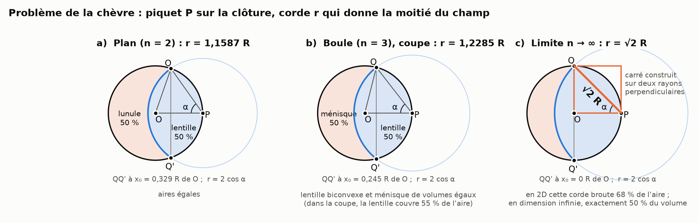
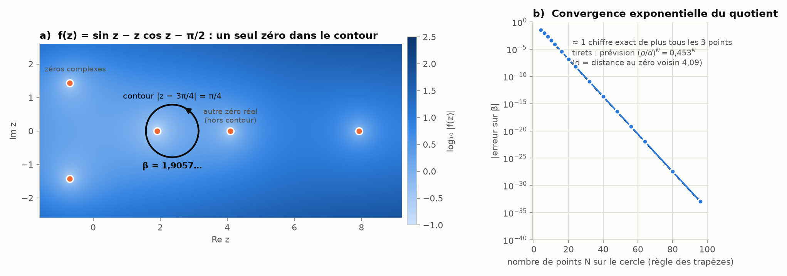
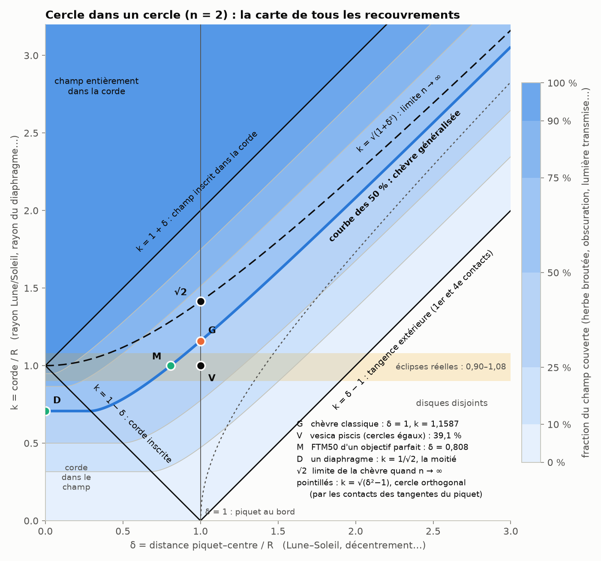
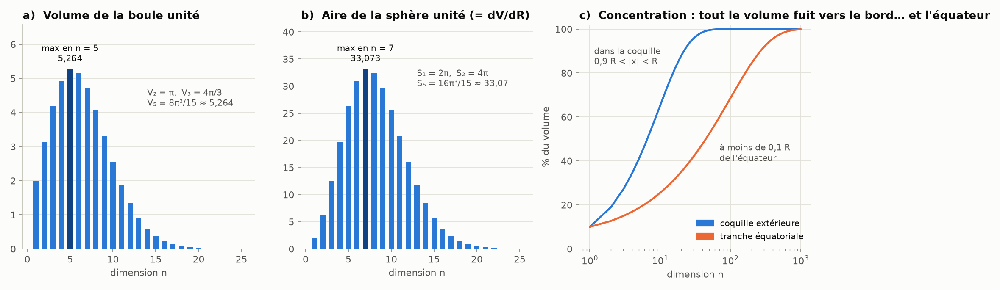
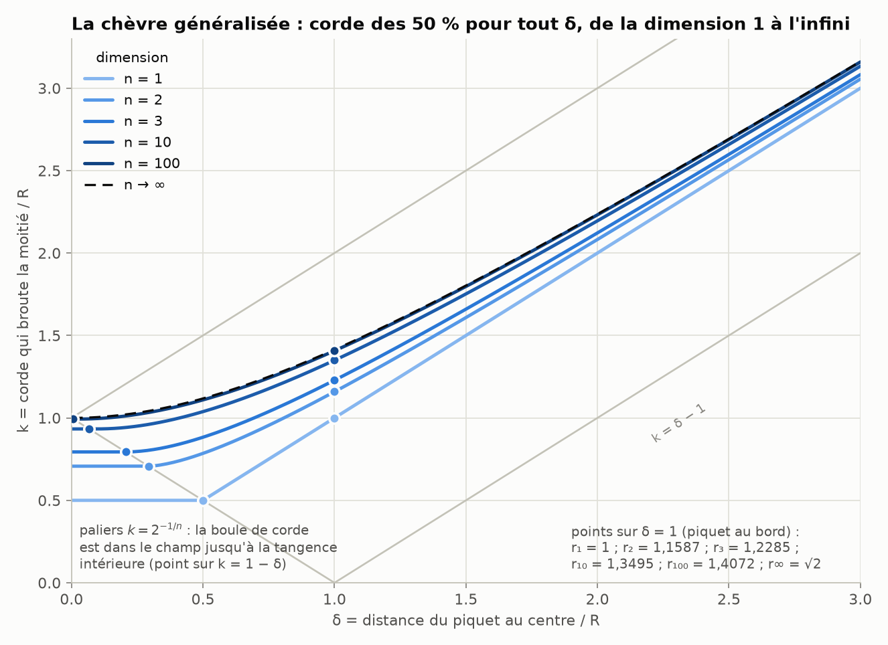
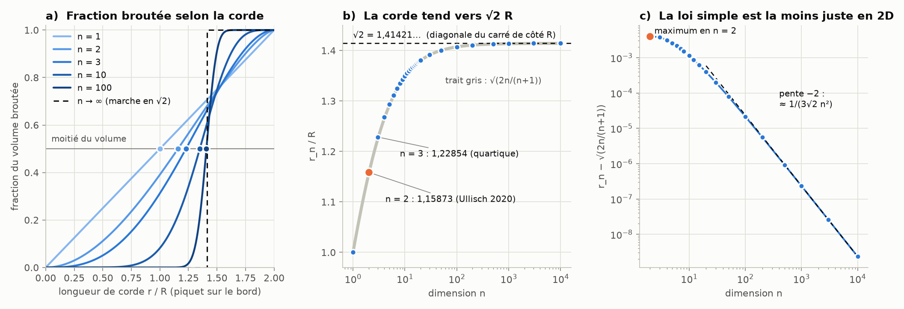
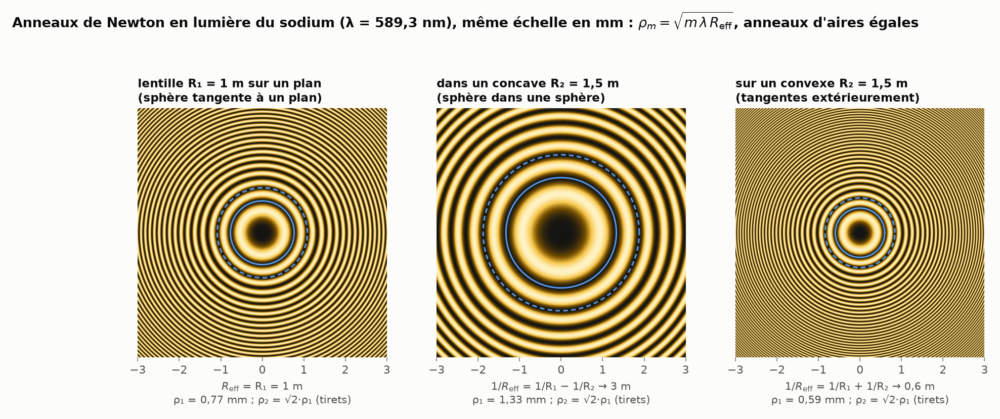
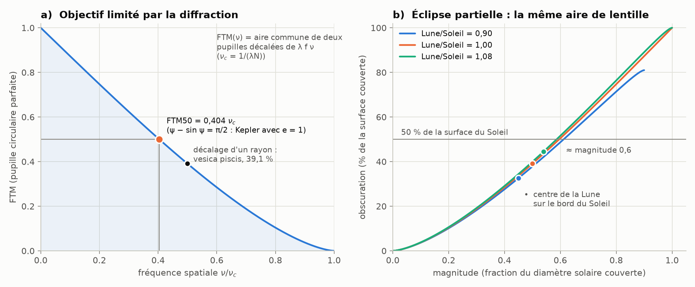
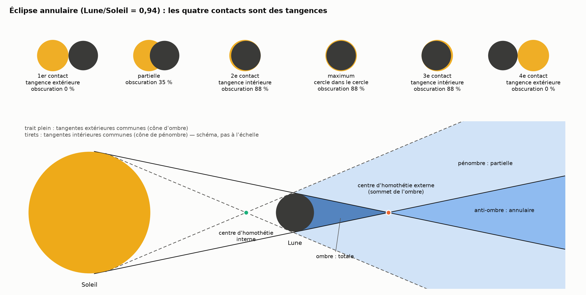

# La chèvre, les cercles et la lumière

> Le **problème de la chèvre** analysé de bout en bout. On part de sa solution exacte par une *division de deux intégrales complexes* (Ullisch, 2020). On le généralise ensuite à tous les placements « cercle dans un cercle / sphère dans une sphère », de l'intérieur jusqu'à la tangence extérieure. On le monte en dimension (la corde tend vers $\sqrt2\,R$, la diagonale du carré). Et on regarde ce que la même géométrie raconte en **optique** : anneaux de Newton, ménisques, éclipses, objectifs photo.

Chaque chiffre de ce document est recalculé par les scripts de [`scripts/`](scripts/) (voir [§ 8](#8-reproduire-les-calculs)). Les tableaux complets sont dans [`resultats/resultats.md`](resultats/resultats.md).

**Sommaire**
1. [En bref](#1-en-bref)
2. [Le problème, et pourquoi il résiste en 2D](#2-le-problème-et-pourquoi-il-résiste-en-2d)
3. [La « division d'intégrales complexes » d'Ullisch](#3-la--division-dintégrales-complexes--dullisch)
4. [Tous les paramètres : un cercle dans un cercle](#4-tous-les-paramètres--un-cercle-dans-un-cercle)
5. [Sphère dans une sphère, puis n dimensions](#5-sphère-dans-une-sphère-puis-n-dimensions)
6. [Optique : la même géométrie partout](#6-optique--la-même-géométrie-partout)
7. [Ce qui est solide, ce qui l'est moins](#7-ce-qui-est-solide-ce-qui-lest-moins)
8. [Reproduire les calculs](#8-reproduire-les-calculs)
9. [Sources](#9-sources)

---

## 1. En bref

| Question | Résultat | Statut |
|---|---|---|
| Chèvre dans un disque (2D) | $r = 1{,}158\,728\,473\,018\ldots\,R$ | exact ; forme close = quotient de deux intégrales de contour (Ullisch 2020) |
| Chèvre dans une boule (3D) | $r = 1{,}228\,544\,863\,735\ldots\,R$, racine de $3r^4-8r^3+8=0$ | exact, s'écrit avec des radicaux (on y voit apparaître $\sqrt[3]{1+\sqrt2}$) |
| Dimension $n$ | $r_n^2 \approx \frac{2n}{n+1} + \frac{2}{3n^2}$, donc $r_n \to \sqrt2\,R$ | développement établi ici, vérifié numériquement jusqu'à $n = 10\,000$ |
| Pourquoi $\sqrt2$ | en grande dimension, presque tout le volume est « à angle droit » du piquet : triangle rectangle isocèle, la corde est la diagonale du carré de côté $R$ | concentration de la mesure + calcul |
| Piquet à une distance $d$ quelconque | corde des 50 % : $k^2 \approx d^2 + \frac{n-1}{n+1}R^2$, limite $\sqrt{R^2+d^2}$ (diagonale du rectangle) | approximation + courbes exactes |
| Nature du nombre | dimension paire : **transcendant** ; impaire : algébrique ; par radicaux seulement pour $n = 1$ et $n = 3$ ($n = 5, 7, 9$ : groupes de Galois $S_8$, $S_{12}$, $S_{16}$) | preuves esquissées ici (Baker, Galois) |
| Optique | une seule fonction, « l'aire de la lentille », donne l'obscuration d'une éclipse, le vignettage mécanique et la FTM d'un objectif ; FTM50 $= 0{,}404\,\nu_c$, etc. | classique + calculs |

Le fil rouge, c'est **l'aire commune de deux disques** (ou le volume commun de deux boules). Selon ce qu'on met dedans (de l'herbe, le Soleil et la Lune, une pupille et un diaphragme), on obtient la chèvre, une éclipse ou une photo.

---

## 2. Le problème, et pourquoi il résiste en 2D

### 2.1 L'énoncé

Un champ circulaire de rayon $R$. Une chèvre est attachée par une corde de longueur $r$ à un piquet $P$ planté **sur la clôture**. Quelle longueur de corde pour qu'elle broute exactement la moitié du champ ?



La zone broutée est l'intersection de deux disques. C'est une **lentille** : le mot vient de la graine, justement à cause de cette forme. Ce qui reste est un croissant, une **lunule**. Le problème revient donc à demander *quand la lentille et la lunule ont la même aire*.

### 2.2 L'équation

Soit $Q$ un point où la corde tendue touche la clôture, et $\alpha = \widehat{OPQ}$ l'angle au piquet. Le triangle $OPQ$ est isocèle ($OP = OQ = R$), donc

```math
r = 2R\cos\alpha .
```

L'aire broutée se compose d'un secteur du disque de la corde (angle $2\alpha$, rayon $r$) et de deux segments du champ, chacun découpé par une corde $PQ$ vue du centre sous l'angle $\pi-2\alpha$. Avec $R=1$ et $\beta = 2\alpha$, tout se simplifie en

```math
A(\beta) = \pi - (\sin\beta - \beta\cos\beta)
\qquad\text{donc}\qquad
A = \frac{\pi}{2} \iff \sin\beta - \beta\cos\beta = \frac{\pi}{2}.
```

On trouve $\beta = 1{,}905\,695\,729\,309\,88\ldots$ rad ($109{,}19°$), puis $r = 2\cos(\beta/2) = 1{,}158\,728\,473\,018\,12\ldots$ La corde commune $QQ'$ passe à $0{,}3287\,R$ du centre.

### 2.3 Pourquoi c'est coriace

L'inconnue $\beta$ apparaît **dans** un cosinus et **devant** lui. Ce mélange d'algèbre et de trigonométrie est une équation dite *transcendante*, de la même famille que l'équation de Kepler $E - e\sin E = M$. Les opérations usuelles (racines, fractions) ne permettent pas de la résoudre. Pendant plus d'un siècle, la réponse officielle a donc été : on résout numériquement. Au § 5.5, on montre même que $r$ est un **nombre transcendant** : aucune formule algébrique, si compliquée soit-elle, ne peut le donner.

**Un peu d'histoire.** Le problème apparaît en 1748 dans le *Ladies' Diary* (question CCCIII, signée « Upnorensis »), mais dans sa version **extérieure** : un cheval est attaché à la grille circulaire d'un étang. La version **intérieure**, celle qui nous occupe, est proposée en 1894 dans le premier volume de l'*American Mathematical Monthly*, sans animal.

### 2.4 Bonus : dehors, la corde suit la tangente

Mettons le piquet contre un silo, chèvre dehors. La corde s'enroule sur le silo et le quitte **tangentiellement** : sa partie libre est un segment tangent qui pivote. Pour une corde $L \le \pi R$ (Hoffman 1998) :

```math
A(L) = \frac{\pi L^2}{2} + \frac{L^3}{3R},
\qquad\text{par exemple}\qquad
A(\pi R) = \frac{5}{6}\pi^3R^2 .
```

Le premier terme est un demi-disque. Le second vient des deux zones balayées par la tangente, chacune d'aire $\tfrac12\int_0^{L/R}(L-R\theta)^2\,d\theta$. Dans cette version « tangente partagée », tout est polynomial, alors que la version intérieure ne l'est pas : la difficulté vient bien du **recoupement** de deux cercles.

---

## 3. La « division d'intégrales complexes » d'Ullisch

### 3.1 La formule

En 2020, Ingo Ullisch publie une **forme close** exacte (Mathematical Intelligencer) :

```math
r = 2R\cos\!\left(\frac12\;
\frac{\displaystyle\oint_{C}\frac{z\,dz}{\sin z - z\cos z - \pi/2}}
     {\displaystyle\oint_{C}\frac{dz}{\sin z - z\cos z - \pi/2}}\right),
\qquad C : \;|z - 3\pi/4| = \pi/4 .
```

Le contour imprimé en 2020 était $|z - 3\pi/8| = \pi/4$. Un erratum publié en 2023 l'a corrigé en $3\pi/4$. Petit détail vérifié ici : les deux cercles contiennent le même zéro, et lui seul, donc les deux donnent le bon $\beta$.

### 3.2 Pourquoi diviser marche

C'est le cœur de l'affaire. Le théorème des résidus dit que si $f$ a un zéro simple $\beta$ à l'intérieur de $C$, et aucun autre, alors pour toute fonction $g$ analytique :

```math
\oint_C \frac{g(z)}{f(z)}\,dz = 2\pi i\,\frac{g(\beta)}{f'(\beta)} .
```

On ne connaît ni $\beta$ ni $f'(\beta)$. Mais prenons $g(z)=z$, puis $g(z)=1$, et **divisons**. Le facteur inconnu $2\pi i/f'(\beta)$ disparaît :

```math
\frac{\oint_C z/f}{\oint_C 1/f} = \frac{2\pi i\,\beta/f'(\beta)}{2\pi i/f'(\beta)} = \beta .
```

Il reste à choisir un contour qui entoure **exactement un** zéro. Le principe de l'argument le vérifie : on compte combien de fois $f(z)$ tourne autour de 0 quand $z$ parcourt $C$. Ici, une fois.



Les autres zéros de $f$ ($4{,}090$ ; $7{,}926$ ; $-0{,}706 \pm 1{,}427\,i$ ; …) restent bien dehors.

### 3.3 Le calculer pour de vrai, et pourquoi la division est encore plus maligne qu'elle n'en a l'air

On place $N$ points régulièrement espacés sur le cercle et on applique la règle des trapèzes. Pour un intégrande analytique et périodique, elle converge **exponentiellement** (Trefethen & Weideman 2014) :

| points $N$ | 8 | 16 | 32 | 64 | 96 |
|---|---|---|---|---|---|
| erreur sur $\beta$ | $2\cdot10^{-3}$ | $4\cdot10^{-6}$ | $1\cdot10^{-11}$ | $1\cdot10^{-22}$ | $1\cdot10^{-33}$ |

Cette vitesse cache un petit miracle. En échantillonnant, chaque intégrale commet une erreur due au pôle $\beta$ lui-même. Cette erreur multiplie le résultat par le **même** facteur $1/(1-u^N)$ en haut et en bas, avec $u = (\beta-c)/\rho$ (centre $c$, rayon $\rho$). La division l'élimine donc exactement. Il ne reste que l'erreur due au zéro le plus proche **hors** du contour, en $(\rho/d)^N = 0{,}453^N$ avec $d = 4{,}0903 - 3\pi/4$, soit à peu près un chiffre exact de plus tous les 3 points. Les tirets de la figure 2b tracent cette prédiction, et elle colle aux points.

<details>
<summary>D'où vient le facteur 1/(1 − u<sup>N</sup>)</summary>

Pour la partie polaire $h(z) = A/(z-\beta)$ et les points $z_j = c + \rho\,\omega^j$ ($\omega = e^{2i\pi/N}$), on développe en série géométrique ($|u|<1$) :

```math
\frac{2\pi\rho}{N}\sum_{j=0}^{N-1}\frac{i\,\omega^j A}{\rho(\omega^j-u)}
= \frac{2\pi i A}{N}\sum_{j}\sum_{m\ge0}u^m\omega^{-jm}
= \frac{2\pi i A}{1-u^N}.
```

Pour $g = z$, on a $A = \beta/f'(\beta)$, et pour $g = 1$, $A = 1/f'(\beta)$ : le facteur $1/(1-u^N)$ est commun aux deux et se simplifie. Le reste de l'intégrande est analytique jusqu'au zéro suivant, d'où l'erreur en $(\rho/d)^N$.
</details>

### 3.4 Est-ce « vraiment » une forme close ?

Le débat est légitime ; l'article de *Quanta* en parle. La formule est exacte, mais pour en tirer des chiffres il faut évaluer des intégrales… tout comme il faut une série pour évaluer $\pi$ ou $\arccos$. Ce qu'on gagne, c'est une **expression** qu'on peut manipuler (la dériver par rapport aux paramètres, par exemple) et un **algorithme garanti** : la convergence se démontre, et la vitesse se prédit (ci-dessus).

### 3.5 Une machine universelle

Le même quotient résout n'importe quelle équation analytique dont on sait isoler une racine. Delves & Lyness (1967) ont systématisé l'idée : avec $\oint z^k f'/f$, on récupère toutes les racines d'une région. On la retrouve dans plusieurs équations-clés de l'optique et de l'astronomie (§ 6) :

- l'équation de **Kepler**, résolue « à la manière de la chèvre » par Philcox, Goodman & Slepian (2021), dans un article titré *Kepler's Goat Herd* ;
- la **FTM50** d'un objectif ;
- la tache d'**Airy** ;
- les maxima de la **diffraction** par une fente.

Les calculs du § 6 utilisent tous ce quotient.

---

## 4. Tous les paramètres : un cercle dans un cercle

### 4.1 Deux nombres suffisent

On normalise par $R$ :

- un disque de rayon $1$ : le champ, le Soleil, la pupille ;
- un disque de rayon $k$ : la corde, la Lune, le diaphragme ;
- leurs centres sont à distance $\delta$.

Dans la zone de recouvrement partiel, la fraction du premier disque couverte par le second vaut

```math
F(\delta,k) = \frac1\pi\left[\arccos\frac{\delta^2+1-k^2}{2\delta} + k^2\arccos\frac{\delta^2+k^2-1}{2\delta k} - \frac12\sqrt{(k+1-\delta)(\delta+k-1)(\delta+1-k)(\delta+k+1)}\right].
```

Voici la carte complète :



Toutes les frontières sont des **tangences** ou des **inclusions** :

- $k = \delta-1$ : **tangence extérieure**. Les cercles se touchent dos à dos et partagent une tangente (1er et 4e contacts d'une éclipse).
- $k = 1-\delta$ : **cercle de corde inscrit**. Il touche la clôture de l'intérieur.
- $k = 1+\delta$ : **champ inscrit** dans le cercle de corde (2e et 3e contacts d'une éclipse totale).
- $\delta = 0$ : cercles **concentriques** (milieu d'une éclipse annulaire centrale, anneaux de Newton, diaphragme).

### 4.2 La chèvre généralisée : la courbe des 50 %

Fixons $F = 1/2$ et faisons glisser le piquet du centre vers la clôture, puis au-delà. C'est la courbe bleue épaisse.

- **Piquet au centre** ($\delta = 0$) : $k = 1/\sqrt2 = 0{,}7071$. C'est le diaphragme qui laisse passer la moitié de la lumière, soit exactement **un cran** (§ 6.4).
- **Approche de l'intérieur** : tant que $\delta \le 1 - 1/\sqrt2 = 0{,}293$, le disque de corde tient dans le champ, donc $k$ ne bouge pas. Le palier se termine pile à la **tangence intérieure**, quand le cercle de corde devient inscrit.
- **Piquet sur la clôture** ($\delta = 1$) : la chèvre classique, $k = 1{,}1587$.
- **Approche de l'extérieur** : $k \approx \delta + \frac{1}{6\delta}$. Le cercle de corde doit dépasser un peu le centre, parce que sa courbure lui fait perdre de la surface sur les bords. Il n'est jamais tangent à la clôture : une tangence, c'est 0 % de recouvrement.

### 4.3 Les cercles remarquables centrés sur le piquet

Pour un piquet extérieur ($\delta>1$), trois cercles centrés sur $P$ jouent un rôle particulier. Tous sont de la forme $k^2 = \delta^2 + c$ :

| $c$ | cercle | sa corde commune avec le champ passe à |
|---|---|---|
| $-1$ | **orthogonal** au champ : il passe par les points de contact des deux tangentes issues du piquet (la « tangente partagée ») | $x_0 = 1/\delta$ (la *polaire* de $P$) |
| $0$ | passe par le centre $O$ | $x_0 = 1/(2\delta)$ |
| $+1$ | coupe le champ selon un **diamètre** | $x_0 = 0$ |

La courbe des 50 % se range dans cette famille. En dimension $n$, elle vérifie à très peu près $c = \frac{n-1}{n+1}$, donc sa corde commune passe à $x_0 \approx \frac{1}{(n+1)\delta}$ (§ 5.4). En dimension 1, c'est le cercle qui passe par le centre (exact dès que $\delta\ge\tfrac12$). Quand $n\to\infty$, c'est celui qui coupe un diamètre. *Curiosité formelle, sans portée physique :* en prolongeant la formule à $n = 0$, on tombe sur $c=-1$, le cercle orthogonal des tangentes.

---

## 5. Sphère dans une sphère, puis n dimensions

### 5.1 Une seule équation pour toutes les dimensions

Une calotte de la boule unité de $\mathbb R^n$, d'angle au centre $\theta$, occupe la fraction

```math
c_n(\theta) = \frac{W_n(\theta)}{W_n(\pi)},\qquad W_n(\theta) = \int_0^\theta \sin^n\varphi\,d\varphi ,
```

car la tranche à la hauteur $\cos\varphi$ est une boule de dimension $n-1$ et de rayon $\sin\varphi$. La zone broutée se décompose en deux morceaux : une calotte du champ (angle $\pi-2\alpha$) et une calotte de la boule de corde (angle $\alpha$, à multiplier par $r^n$). D'où **l'équation de la chèvre en dimension $n$** :

```math
W_n(2\alpha) - (2\cos\alpha)^n\,W_n(\alpha) = \tfrac12\,W_n(\pi),\qquad r = 2R\cos\alpha .
```

- $n=1$ : $r = R$.
- $n=2$ : on retombe exactement sur l'équation d'Ullisch.
- $n=3$ : on obtient $3r^4 - 8r^3 + 8 = 0$.

Comme $W_n$ est une fonction entière, **le quotient d'Ullisch marche dans toutes les dimensions**. Le script le vérifie pour $n = 2$ à $8$, avec un accord à 30 chiffres près.

### 5.2 Volume et aire : ce qui change quand on monte

```math
V_n = \frac{\pi^{n/2}}{\Gamma(n/2+1)}\,R^n ,\qquad S_{n-1} = \frac{dV_n}{dR} = \frac{n}{R}\,V_n .
```



- Le volume de la boule unité est maximal en dimension 5, l'aire de sa sphère en dimension 7, puis les deux s'effondrent vers 0.
- Le rapport $S/V = n/R$ grandit avec $n$ : le volume devient de la « peau ». La coquille extérieure d'épaisseur $0{,}1\,R$ contient $1-0{,}9^n$ du volume, soit 65 % en dimension 10 et 99,997 % en dimension 100.
- Le volume se concentre aussi autour de **n'importe quel équateur**. La tranche $|x_1| < 0{,}1\,R$ contient 25 % du volume en dimension 10, 69 % en dimension 100 et 99,8 % en dimension 1000.

La relation volume ↔ aire vaut aussi pour la chèvre elle-même. La dérivée du volume brouté par rapport à la corde, c'est l'**aire du « front »**, la partie de la sphère de corde qui est dans le champ :

```math
\frac{dV_\text{brouté}}{dr} = \operatorname{aire}\big(\text{sphère}(P,r)\cap\text{champ}\big)
\qquad\text{(en 2D : } \tfrac{dA}{dr} = 2\alpha r\text{, la longueur de l'arc)} .
```

L'équation de la chèvre se lit donc aussi « intégrale de l'aire du front de $0$ à $r$ = moitié du volume ».

### 5.3 Pourquoi √2 : la diagonale du carré

Voici la lecture probabiliste qui rend tout limpide. Si $X$ est un point tiré au hasard uniformément dans la boule, la fraction broutée vaut $\mathbb P(|X-P|\le r)$. **La corde de la chèvre est donc la distance médiane** entre le piquet et un point du champ.

Or $|X-P|^2 = |X|^2 + R^2 - 2\,X\cdot P$. En grande dimension :

- $|X| \approx R$, parce que le volume est dans la peau ;
- $X\cdot P\approx 0$, parce que le volume est sur l'équateur vu depuis $P$.

Donc $|X-P|^2 \approx 2R^2$. Le point typique $Q$ est à distance $R$ du centre, **à angle droit** de $OP$. Le triangle $OPQ$ est rectangle isocèle : c'est un demi-carré de côté $R$, et la corde $PQ$ en est la diagonale, $\sqrt2\,R$ (figure 1c).

C'est le point qui fait écho à l'idée de « redescendre vers les dimensions inférieures » : **la limite en dimension infinie se lit dans un plan**, le plan $(O,P,Q)$. Les dimensions supplémentaires ne servent qu'à pousser presque tout le volume sur cet angle droit.

Avec un piquet à distance $d$ quelconque, le même raisonnement donne $k\to\sqrt{R^2+d^2}$ : la **diagonale du rectangle** $R\times d$.



À l'inverse, en 2D, la corde $\sqrt2\,R$ broute $(\pi-1)/\pi = 68{,}2\,\%$ du champ (l'équateur vu de $P$ n'y compte que 2 points). En 3D, elle en broute $\sqrt2 - \tfrac34 = 66{,}4\,\%$, et en dimension $n$ environ $\tfrac12 + 1/\sqrt{2\pi n}$. La fraction converge vers ½ lentement ; la corde, elle, converge vite (en $1/n$).

### 5.4 À quelle vitesse ?

```math
r_n^2 = \frac{2n}{n+1} + \frac{2}{3n^2} + O(n^{-3})
\qquad\Longrightarrow\qquad
r_n \approx \sqrt2 - \frac{1}{\sqrt2\,n}.
```

Une façon parlante de le dire : le plan qui contient l'intersection des deux sphères est à $x_0 = R - r^2/(2R) \approx R/(n+1)$ du centre, soit ½, ⅓, ¼, ⅕… Ce plan glisse vers le centre, et quand il l'atteint, la corde vaut $\sqrt2\,R$.

| $n$ | $r_n/R$ | $\sqrt{2n/(n+1)}$ | plan $x_0/R$ | $1/(n+1)$ |
|---:|:---|:---|:---|:---|
| 1 | 1 | 1 | 0,5 | 0,5 |
| 2 | 1,158 728 | 1,154 701 | 0,328 7 | 0,333 3 |
| 3 | 1,228 545 | 1,224 745 | 0,245 3 | 0,25 |
| 4 | 1,268 079 | 1,264 911 | 0,196 0 | 0,2 |
| 5 | 1,293 598 | 1,290 994 | 0,163 3 | 0,166 7 |
| 10 | 1,349 535 | 1,348 400 | 0,089 4 | 0,090 9 |
| 100 | 1,407 217 | 1,407 195 | 0,009 87 | 0,009 90 |
| 1 000 | 1,413 507 | 1,413 507 | 0,000 999 | 0,000 999 |
| ∞ | $\sqrt2 = 1{,}414\,214$ | | 0 | 0 |



<details>
<summary>Esquisse de la dérivation</summary>

On écrit $X = \rho\,U$ avec $U$ uniforme sur la sphère. Alors $\rho^n$ est uniforme sur $[0,1]$ (donc $\mathbb E\rho = \frac{n}{n+1}$ et $\mathbb E\rho^{-1} = \frac{n}{n-1}$), et $U_1$ a une densité proportionnelle à $(1-t^2)^{(n-3)/2}$. La condition $|X-P|^2\le m$ s'écrit $U_1 \ge \tau(\rho) = \frac{\rho^2+1-m}{2\rho}$.

- Au premier ordre, la loi de $U_1$ est symétrique autour de 0, donc la médiane impose $\mathbb E\,\tau = 0$, ce qui donne exactement $m = \frac{2n}{n+1}$.
- Le terme suivant vient de la courbure de la densité de $U_1$ (terme en $\tau^3$). On utilise que $E = n(1-\rho)$ suit asymptotiquement une loi exponentielle, pour laquelle $\mathbb E\,(1-E)^3 = -2$. On obtient $+\frac{2}{3n^2}$.

Numériquement, $(r_n^2 - \frac{2n}{n+1})\,n^2$ vaut 0,606, 0,660 et 0,666 pour $n = 10^2, 10^3, 10^4$. Le même calcul avec un piquet à distance $\delta$ donne $k^2 \approx \delta^2 + \frac{n-1}{n+1}$, valable tant que $\delta \gg 1/\sqrt n$.
</details>

### 5.5 Pair, impair : pourquoi la 2D est la plus « compliquée »

En dimension impaire, $W_n$ est un polynôme en $\cos\theta$, donc l'équation devient **polynomiale** en $r$. En dimension paire, $W_n(\theta)$ contient un terme en $\theta$ seul, donc l'équation reste **transcendante**.

| $n$ | équation pour $r$ ($R=1$) | nature de $r_n$ | forme close |
|---:|---|---|---|
| 1 | $r = 1$ | rationnel | évidente |
| **2** | $\sin\beta-\beta\cos\beta=\pi/2$ | **transcendant** | intégrales de contour (Ullisch) |
| 3 | $3r^4-8r^3+8=0$ | algébrique, degré 4, Galois $S_4$ | **radicaux** (Ferrari) |
| 4, 6, 8… | mélange de $\alpha$ et de $\cos\alpha$, $\sin\alpha$ | transcendant | intégrales de contour |
| 5 | $5r^8-80r^6+128r^5-128=0$ | algébrique, degré 8, Galois $S_8$ | pas de radicaux |
| 7 | $7r^{12}-112r^{10}+840r^8-1024r^7+1024=0$ | degré 12, Galois $S_{12}$ | pas de radicaux |
| 9 | $45r^{16}-864r^{14}+6720r^{12}-32256r^{10}+32768r^9-32768=0$ | degré 16, Galois $S_{16}$ | pas de radicaux |

- **La 3D se résout par radicaux.** Avec $s = 1/r$, on obtient $8s^4-8s+3=0$. La méthode de Ferrari donne alors, avec $u=\sqrt[3]{1+\sqrt2}$ et $w = (u+u^{-1})/\sqrt2$ :
  ```math
  r_3 = \frac{2}{\sqrt w + \sqrt{2/\sqrt w - w}} = 1{,}228\,544\,863\,735\,220\,903\ldots
  ```
  On y voit $1+\sqrt2$, le « nombre d'argent ». C'est l'algèbre qui le fait sortir, et il serait abusif d'y voir un lien profond avec la limite $\sqrt2$.
- **Les dimensions impaires suivantes, non.** Les réductions modulo $p$ du polynôme (types de cycles de Frobenius) exhibent un $d$-cycle, un $(d-1)$-cycle et un élément dont une puissance est une transposition. Le critère de Jordan donne alors un groupe de Galois $S_d$, qui n'est pas résoluble pour $d\ge5$. C'est vérifié pour $n = 5, 7, 9$, et c'est très probablement vrai au-delà (non démontré ici).
- **Les dimensions paires donnent des nombres transcendants.** On écrit $W_n(\theta) = c_n\theta + P_n(\theta)$, avec $c_n$ rationnel et $P_n$ trigonométrique. L'équation devient $c_n(2-r^n)\,\alpha + T = c_n\pi/2$, avec $T = P_n(2\alpha) - r^nP_n(\alpha)$. Si $r$ était algébrique, $\cos\alpha$, $\sin\alpha$, $e^{i\alpha}$ et $T$ le seraient aussi. On aurait alors une relation linéaire $T + a\log e^{i\alpha} + b\log(-1) = 0$ à coefficients algébriques et terme constant $T\neq0$. Le **théorème de Baker** (1966) l'interdit. Numériquement, $T = 0{,}472$ pour $n=2$, et $T\ne0$ pour tous les $n$ pairs testés jusqu'à 20.

**Bilan.** La 2D est bien la plus « compliquée », et voici en quel sens précis :

- c'est la **première dimension où la réponse échappe à l'algèbre** (la 1D est triviale, la 3D se résout par radicaux) ;
- c'est là que la loi des grandes dimensions $\sqrt{2n/(n+1)}$ est **la moins juste** (écart maximal en $n=2$, figure 3c) ;
- c'est celle qui a attendu **2020** pour avoir une forme close.

Une nuance : les dimensions paires 4, 6, … sont tout aussi transcendantes. La 2D est la première des dimensions difficiles, pas la seule.

---

## 6. Optique : la même géométrie partout

### 6.1 Anneaux de Newton : une sphère posée sur, ou dans, une autre

On pose une lentille convexe (rayon $R_1$) sur une autre surface. Elles se touchent en un point où elles **partagent leur plan tangent**. À la distance $\rho$ de ce point, chaque surface s'écarte de ce plan de sa **flèche** :

```math
s(\rho) = R - \sqrt{R^2-\rho^2} \approx \frac{\rho^2}{2R}.
```

La lame d'air vaut donc $t(\rho) \approx \frac{\rho^2}{2}\left(\frac1{R_1} - \kappa_2\right)$, où $\kappa_2$ est la courbure *signée* de la seconde surface :

- **sur un plan** : $\kappa_2 = 0$ ;
- **dans un concave** (une sphère dans une sphère, contact intérieur) : $\kappa_2 = +1/R_2$ ;
- **sur un convexe** (dos à dos, contact extérieur) : $\kappa_2 = -1/R_2$.

Intérieur et extérieur tiennent dans une seule formule, en changeant un signe. C'est la même convention que dans le théorème des cercles de Descartes, où un cercle qui en contient un autre reçoit une courbure négative.

En réflexion, les anneaux sombres sont là où $2t = m\lambda$ :

```math
\rho_m = \sqrt{m\,\lambda\,R_\text{eff}},\qquad \frac{1}{R_\text{eff}} = \frac1{R_1} - \kappa_2 .
```



- **Des anneaux d'aires égales.** $\pi(\rho_{m+1}^2-\rho_m^2) = \pi\lambda R_\text{eff}$, soit 1,85 mm² pour $R = 1$ m en lumière du sodium. Ce sont les mêmes zones que celles d'une **plaque zonée de Fresnel** (rayons $\sqrt{m\lambda f}$), utilisée en photo comme objectif « zone plate ».
- **√2, encore.** Le 2e anneau a un rayon $\sqrt2$ fois celui du 1er, et l'anneau $2^j$ a un rayon $(\sqrt2)^j$ fois celui du 1er. La suite des diaphragmes photo correspond aux anneaux 1, 2, 4, 8…
- **Le calibre d'opticien.** Si la surface du dessous a presque la même courbure, on a deux sphères emboîtées : $R_\text{eff}$ devient énorme et les anneaux s'élargissent jusqu'à disparaître. C'est le principe du contrôle des surfaces optiques au **calibre** : on compte les franges. Pour une pièce de Ø 50 mm et de rayon 100 mm, une erreur de rayon de 10 µm donne environ 1,1 frange. Les éditions 1996 et 2007 de la norme ISO 10110-5 exprimaient d'ailleurs les tolérances de forme en franges (1 frange = λ/2 d'écart de flèche) ; les éditions récentes préfèrent les nanomètres.

### 6.2 Ménisques et lentilles

- **En 3D, la chèvre est un problème de lentille.** La zone broutée est une **lentille biconvexe** (intersection de deux boules). Le reste est un **ménisque** : il est borné par deux surfaces sphériques bombées du même côté. La chèvre 3D demande donc *quand la lentille et le ménisque taillés dans la même boule ont le même volume*. Réponse : $r = 1{,}2285\,R$, ce qui donne une lentille très bombée (épaisseur $1{,}23\,R$, diamètre $1{,}94\,R$).
- **Pourquoi la coupe trompe.** Dans la coupe (figure 1b), la lentille couvre **55 %** de l'aire, mais seulement 50 % du volume. Le théorème de Pappus–Guldin explique l'écart : un volume de révolution pèse la distance à l'axe, et le ménisque est plus loin de l'axe $OP$.
- **Les objectifs « sphère dans une sphère ».** Ils ont la symétrie parfaite des sphères concentriques : chaque direction voit le même système, donc pas de coma ni d'astigmatisme, et l'image se forme sur une sphère.
  - Une boule de verre d'indice $n$ a une focale $\frac{nR}{2(n-1)}$ comptée depuis son centre. Pour $n=2$, le foyer tombe **sur sa propre surface**, en tangence intérieure.
  - **Panoramique de Sutton (1859)** : de l'eau entre deux coquilles hémisphériques, un champ d'environ 120° et des plaques courbes.
  - **Hypergon de Goerz (1900)** : deux ménisques minces presque concentriques, qui forment presque une sphère, pour un champ d'environ 135°. Au bord du champ, la loi en $\cos^4$ coûte $\cos^4 67{,}5° = 0{,}021$, soit 5,5 crans de lumière. D'où une étoile tournante, soufflée à la poire, qui masquait le centre une partie de la pose.
  - **AWARE-2 (2012)** : un objectif monocentrique partagé par 98 micro-caméras, pour environ un gigapixel.

### 6.3 Éclipses : la chèvre dans le ciel

L'**obscuration** (fraction de la *surface* du Soleil cachée) est exactement $F(\delta,k)$. La **magnitude** (fraction du *diamètre* caché) vaut $(1+k-\delta)/2$ en phase partielle.



- **Une règle pratique.** La moitié de la surface solaire est cachée vers une magnitude de 0,6 (0,59 à 0,61 selon le rapport des tailles).
- **Les quatre contacts sont des tangences** (figure 9) : extérieures pour le 1er et le 4e, intérieures pour le 2e et le 3e. Au maximum d'une éclipse annulaire, on a littéralement un cercle dans un cercle.
- **La configuration de la chèvre n'arrive jamais.** Il faudrait le centre de la Lune sur le bord du Soleil *et* 50 % d'obscuration, donc une Lune 1,1587 fois plus grande que le Soleil. Or le rapport des tailles apparentes ne dépasse pas ≈ 1,08 (de 0,90 à 1,08 vu de la surface de la Terre, ≈ 1,06 au maximum vu de son centre). Avec le centre lunaire sur le bord solaire, l'obscuration réelle se situe entre 33 et 45 %.
- **L'ombre et la pénombre sont des tangentes communes.** Les tangentes **extérieures** communes au Soleil et à la Lune dessinent le cône d'ombre. Son sommet est le centre d'homothétie externe, à environ 374 500 km derrière la Lune. Or la Lune est à 356 400–406 700 km de la Terre : selon sa distance, le cône atteint le sol (éclipse totale) ou s'arrête avant (éclipse annulaire, on est alors dans l'anti-ombre). C'est pour cela que les annulaires sont un peu plus fréquentes que les totales. Les tangentes **intérieures** communes, qui se croisent au centre d'homothétie interne, bornent la pénombre.



- **Kepler et le même quotient.** Pour savoir *où* sont le Soleil et la Lune, la mécanique céleste passe par l'équation de Kepler $E - e\sin E = M$. Le quotient d'Ullisch la résout directement : par exemple $E = 1{,}04755\ldots$ pour l'orbite lunaire ($e = 0{,}0549$, $M = 1$). Siewert & Burniston en avaient déjà donné une solution exacte par analyse complexe en 1972. Les prédictions réelles d'éclipses utilisent cependant des théories lunaires bien plus fines qu'une simple ellipse képlérienne.

### 6.4 Photographie

- **Les crans de diaphragme et √2.** La lumière est proportionnelle à l'aire de la pupille, donc au carré de son diamètre. Doubler la lumière, c'est multiplier le diamètre par $\sqrt2$, d'où la suite f/1 ; 1,4 ; 2 ; 2,8 ; 4 ; 5,6… Géométriquement, c'est le rapport entre les cercles **inscrit** et **circonscrit** à un carré : ils sont dans un rapport $\sqrt2$, donc d'aires dans un rapport 2. Un cran sépare le cercle tangent aux côtés et le cercle qui passe par les coins. La chèvre au centre du champ ($k = 1/\sqrt2$) est exactement le diaphragme d'un cran.
- **Le vignettage mécanique et le bokeh « œil de chat ».** Hors de l'axe, la monture d'une lentille avant ou arrière rogne la pupille. La lumière transmise vaut $F(\delta,k)$, et la forme de la tache floue est… une lentille, comme sur la figure 1. **La courbe des 50 % (figure 5) est la courbe du vignettage d'un cran pile.** Le point de la chèvre correspond à un cache de rayon $1{,}1587$ fois la pupille, centré sur son bord : il coûte exactement 1 IL.
- **La FTM d'un objectif parfait est une aire de lentille.** La fonction de transfert de modulation d'un objectif limité par la diffraction est l'aire commune de deux pupilles décalées, normalisée. C'est notre $F(\delta,1)$, le long de la droite $k=1$ de la figure 5. Elle tombe à 50 % quand $\psi - \sin\psi = \pi/2$, avec $\psi = 2\arccos(\nu/\nu_c)$ : **c'est l'équation de Kepler avec $e=1$**. On obtient
  ```math
  \text{FTM50} = 0{,}404\,\nu_c = \frac{0{,}404}{\lambda N}.
  ```
  À f/8 en lumière verte (550 nm), la coupure est à 227 cycles/mm et la FTM50 à 92 cycles/mm. À f/16, on tombe à 46 cycles/mm : c'est la diffraction qui fait perdre du piqué quand on ferme trop.
- **La tache d'Airy.** 50 % de l'énergie tombe dans un rayon de $0{,}535\,\lambda N$, solution de $J_0^2+J_1^2=\tfrac12$, encore obtenue par le quotient. Le premier anneau noir est à $1{,}22\,\lambda N$ et contient 83,8 % de l'énergie.
- **La « fonction de la chèvre » en diffraction.** $g(x) = \sin x - x\cos x$ se retrouve à plusieurs endroits :
  - c'est $x^2 j_1(x)$, où $j_1$ est une fonction de Bessel sphérique ;
  - c'est aussi $-x^2\,\frac{d}{dx}\frac{\sin x}{x}$ ;
  - ses zéros ($\tan x = x$, soit $x = 4{,}493$) donnent les maxima secondaires de la diffraction par une fente ;
  - $3g(x)/x^3$ est le facteur de forme d'une sphère homogène en diffusion de la lumière.

  La chèvre plane, c'est la même fonction prise au niveau $\pi/2$ au lieu de 0. C'est une identité mathématique (on intègre $t\sin t$ dans les deux cas) et non une équivalence physique, mais elle explique pourquoi les mêmes outils marchent des deux côtés.

---

## 7. Ce qui est solide, ce qui l'est moins

- **Établi (littérature)** : la formule d'Ullisch et son erratum, la valeur 2D, la quartique 3D, la limite $\sqrt2$ (Fraser 1984, corrigé par Meyerson 1984), les formules de calottes, d'anneaux de Newton, de FTM et d'Airy, et les définitions NASA de la magnitude et de l'obscuration.
- **Calculé et recoupé ici** : toutes les valeurs numériques. Chacune est obtenue par au moins deux méthodes indépendantes (quotient de contour contre recherche directe de racine, formule close contre polynôme).
- **Dérivé ici, à faire relire par un spécialiste** :
  - le développement $r_n^2 = \frac{2n}{n+1} + \frac{2}{3n^2}+\dots$ (très bien vérifié numériquement) ;
  - la loi $k^2\approx\delta^2+\frac{n-1}{n+1}$ ;
  - l'annulation exacte de l'erreur du pôle par la division ;
  - l'argument de transcendance par le théorème de Baker en dimension paire ;
  - les groupes de Galois en dimension impaire (calcul rigoureux, mais fait ici, je ne l'ai pas trouvé publié).
- **Analogies, pas équivalences** : le cas « $n = 0$ », la fonction de la chèvre en diffraction, le nombre d'argent dans $r_3$. Elles sont utiles pour l'intuition, mais ne prouvent rien.

---

## 8. Reproduire les calculs

```bash
cd chevre-optique
pip install -r requirements.txt
python3 scripts/calculs.py    # ≈ 5 s : tous les nombres -> resultats/resultats.md et resultats.json
python3 scripts/figures.py    # ≈ 10 s : les 9 figures -> figures/
```

- [`scripts/chevre.py`](scripts/chevre.py) : la bibliothèque (quotient de contour, principe de l'argument, calottes en dimension $n$, aire de lentille, FTM).
- [`scripts/calculs.py`](scripts/calculs.py) : tous les calculs et contrôles (résidus, nombre de zéros, groupes de Galois, constante de Baker…).
- [`scripts/figures.py`](scripts/figures.py) : les figures.

---

## 9. Sources

**Le problème de la chèvre**
- I. Ullisch, « A Closed-Form Solution to the Geometric Goat Problem », *The Mathematical Intelligencer* 42(3), 12–16 (2020). [doi:10.1007/s00283-020-09966-0](https://doi.org/10.1007/s00283-020-09966-0) ; erratum (contour $3\pi/4$) : [doi:10.1007/s00283-023-10299-x](https://doi.org/10.1007/s00283-023-10299-x)
- S. Nadis, « After Centuries, a Seemingly Simple Math Problem Gets an Exact Solution », *Quanta Magazine*, 9 déc. 2020. [lien](https://www.quantamagazine.org/after-centuries-a-seemingly-simple-math-problem-gets-an-exact-solution-20201209/)
- M. Fraser, « A Tale of Two Goats », *Mathematics Magazine* 55(4), 221–227 (1982).
- M. Fraser, « The Grazing Goat in n Dimensions », *The College Mathematics Journal* 15(2), 126–134 (1984). [doi:10.2307/2686517](https://doi.org/10.2307/2686517)
- M. D. Meyerson, « Return of the Grazing Goat in n Dimensions », *The College Mathematics Journal* 15(5), 430–432 (1984), qui corrige une faille de l'argument de Fraser. [doi:10.2307/2686558](https://doi.org/10.2307/2686558)
- G. & N. Jameson, « Goats and birds », *The Mathematical Gazette* 101(551), 296–300 (2017) : la quartique 3D. [doi:10.1017/mag.2017.71](https://doi.org/10.1017/mag.2017.71)
- M. E. Hoffman, « The Bull and the Silo: An Application of Curvature », *American Mathematical Monthly* 105(1), 55–58 (1998) : la chèvre extérieure. [doi:10.1080/00029890.1998.12004849](https://doi.org/10.1080/00029890.1998.12004849)
- Wikipédia : [Problème de la chèvre](https://fr.wikipedia.org/wiki/Probl%C3%A8me_de_la_ch%C3%A8vre) ; [Goat grazing problem](https://en.wikipedia.org/wiki/Goat_grazing_problem).

**Analyse complexe, nombres, dimensions**
- L. M. Delves & J. N. Lyness, « A Numerical Method for Locating the Zeros of an Analytic Function », *Math. Comp.* 21, 543–560 (1967). [doi:10.1090/S0025-5718-1967-0228165-4](https://doi.org/10.1090/S0025-5718-1967-0228165-4)
- L. N. Trefethen & J. A. C. Weideman, « The Exponentially Convergent Trapezoidal Rule », *SIAM Review* 56(3), 385–458 (2014). [doi:10.1137/130932132](https://doi.org/10.1137/130932132)
- A. Baker, « Linear forms in the logarithms of algebraic numbers I », *Mathematika* 13, 204–216 (1966).
- S. Li, « Concise Formulas for the Area and Volume of a Hyperspherical Cap », *Asian J. Math. Stat.* 4(1), 66–70 (2011). [doi:10.3923/ajms.2011.66.70](https://doi.org/10.3923/ajms.2011.66.70)
- A. Blum, J. Hopcroft, R. Kannan, *Foundations of Data Science*, Cambridge UP (2020), ch. 2 « High-Dimensional Space » : la concentration de la mesure, expliquée simplement.
- J. C. Lagarias, C. L. Mallows, A. R. Wilks, « Beyond the Descartes Circle Theorem », *Amer. Math. Monthly* 109(4), 338–361 (2002) : cercles tangents, courbures signées, généralisation en dimension $n$. [arXiv:math/0101066](https://arxiv.org/abs/math/0101066)

**Optique, astronomie, photographie**
- J. W. Goodman, *Introduction to Fourier Optics*, 4e éd. (2017) : FTM d'une pupille circulaire.
- E. Hecht, *Optics*, 5e éd. (2017) : anneaux de Newton, plaques zonées de Fresnel.
- Imatest, « Diffraction and optimum aperture » : FTM50 ≈ 0,404/(λN). [lien](https://www.imatest.com/imaging/diffraction-and-optimum-aperture/)
- NASA/GSFC (F. Espenak), glossaire des éclipses : magnitude et obscuration. [lien](https://eclipse.gsfc.nasa.gov/SEhelp/SEglossary.html)
- C. E. Siewert & E. E. Burniston, « An exact analytical solution of Kepler's equation », *Celestial Mechanics* 6, 294–304 (1972). [doi:10.1007/BF01231473](https://doi.org/10.1007/BF01231473)
- O. H. E. Philcox, J. Goodman, Z. Slepian, « Kepler's Goat Herd: An exact solution to Kepler's equation for elliptical orbits », *MNRAS* 506(4), 6111–6116 (2021). [doi:10.1093/mnras/stab1296](https://doi.org/10.1093/mnras/stab1296)
- D. J. Brady *et al.*, « Multiscale gigapixel photography », *Nature* 486, 386–389 (2012). [doi:10.1038/nature11150](https://doi.org/10.1038/nature11150)
- R. Kingslake, *A History of the Photographic Lens*, Academic Press (1989) : Sutton, Hypergon, ménisques.
- ISO 10110-5 (tolérances de forme des surfaces optiques). [iso.org](https://www.iso.org/standard/57566.html)
