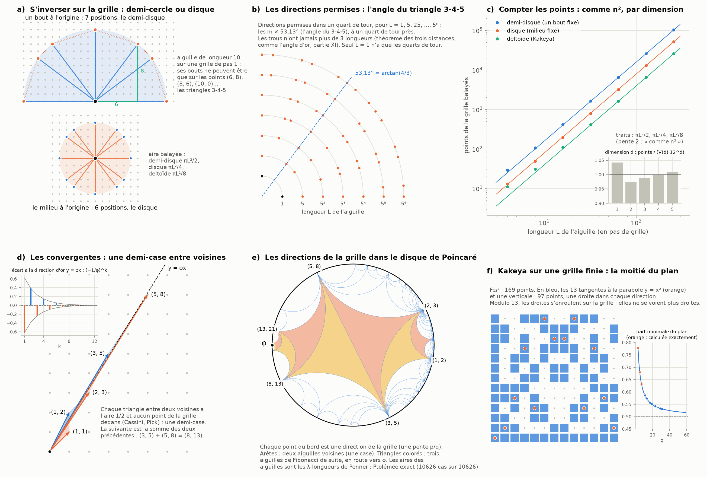
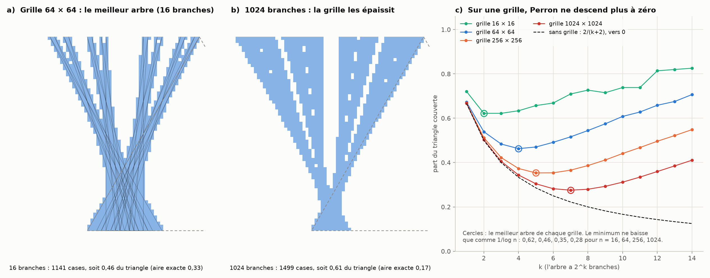

# Partie XIV : l'aiguille sur une grille

> Ta réponse à la partie XIII : rejoindre nos recherches des images précédentes (les trois façons de retourner l'aiguille, le foyer, les centres fantômes, le carré des pixels, Ptolémée, le plan hyperbolique) et les croisements de convergences et leurs foyers, pour mieux comprendre l'aiguille et ses mouvements. Pour cela, on restreint ses déplacements à une grille de points séparés exactement de la même distance, qui grossit comme n² par dimension en commençant par 1. L'aiguille doit alors tracer un demi-cercle pour s'inverser si une de ses extrémités est à l'origine, et un disque si l'origine est en son milieu.
>
> Suite de la [partie XIII](perron-dephasage.md).

Tout est recalculé par [`scripts/aiguille_grille.py`](scripts/aiguille_grille.py) (≈ 20 s). Les tableaux complets sont dans [`resultats/aiguille_grille.md`](resultats/aiguille_grille.md).

**Suite : [Partie XV — la grille décalée, où la chèvre retrouve son simplexe](grille-decalee.md).**

## Ce que je fais de ta consigne

- **La grille :** les points à coordonnées entières, espacés de 1. Une fenêtre de n points de côté en contient n² dans le plan, n^d en dimension d, en commençant par n = 1.
- **L'aiguille :** un segment de longueur fixe L dont les deux bouts sont des points de la grille.
- **S'inverser,** c'est la retourner de 180° :
  - un bout fixé à l'origine : l'autre bout fait un demi-cercle, et l'aiguille balaie un demi-disque ;
  - le milieu fixé : les deux bouts font le tour complet, et l'aiguille balaie un disque.

C'est le panneau a de la partie VIII (pivoter au milieu, π/4 ; le deltoïde, π/8), avec en plus ton pivot au bout (π/2).

## En bref

- **Sur la grille, l'aiguille ne tourne pas librement.**
  - Une aiguille de longueur L n'a que les directions des points de la grille sur le cercle de rayon L.
  - Il y en a 4 pour L = 1 (les quarts de tour seulement), 12 pour L = 5, 20 pour 25, et 108 pour 1105.
  - Ce sont les triangles rectangles à côtés entiers (3-4-5, 5-12-13…), comptés exactement par la formule de Jacobi.
- **L'angle du triangle 3-4-5 y joue le rôle de l'angle d'or.**
  - Pour L = 5^k, les directions permises sont les multiples de 53,13°. Leurs trous n'ont jamais plus de trois longueurs : c'est le théorème des trois distances de la partie XI.
  - En dehors des quarts de tour, aucune rotation de la grille ne fait un nombre rationnel de degrés (théorème de Niven).
- **Ton demi-cercle et ton disque, comptés en points.**
  - Pour s'inverser, l'aiguille de longueur 10 passe par 7 positions (un bout fixe) ou 6 positions (milieu fixe).
  - Les points balayés grandissent exactement comme L² : πL²/2 pour le demi-disque, πL²/4 pour le disque, πL²/8 pour le deltoïde de Kakeya.
  - En dimension d, ils grandissent comme V(d)·L^d, avec le volume V(d) de la boule, celui de la chèvre.
- **Chaque pas de rotation coûte au moins une demi-case, et les aiguilles de Fibonacci atteignent ce minimum.**
  - Deux voisines (F(k), F(k+1)) et (F(k+1), F(k+2)) enferment une seule case : le triangle entre elles a l'aire 1/2 (Cassini, Pick).
  - Elles passent d'un côté à l'autre de la direction d'or, à la distance exacte (−1/φ)^k : ce sont tes « croisements de convergences ».
  - La suivante est la somme des deux précédentes. C'est la même somme qui donne le battement d'un nœud (partie XIII) et le nombre d'anneaux à partir des deux foyers (partie IX).
  - *Voir la [partie XXVII](carte-connexions.md), § 7 : les aiguilles de Pell font de même vers 67,5°, et ce sont les nombres de la récursion d'argent de la partie XVII.*
- **Les directions de la grille forment le bord du plan hyperbolique de la partie X.** Les aiguilles voisines y dessinent le pavage de Farey. Les aires entre aiguilles sont les longueurs λ de Penner, et elles suivent Ptolémée exactement.
- **Sur une grille, l'aiguille de Kakeya ne peut plus se faire toute petite.**
  - *Grille finie* (q × q points, calculs modulo q) : le plus petit ensemble qui contient une droite dans chaque direction occupe la moitié du plan, soit q(q+1)/2 + (q−1)/2 points (Blokhuis et Mazzocca). Je l'ai recalculé exactement pour q = 3, 5 et 7. Il est fait des tangentes d'une parabole, la courbe des foyers.
  - *Grille ouverte* n × n : l'arbre de Perron a un nombre optimal de branches ; au-delà, l'aire remonte. Le minimum ne baisse que comme 1/log n : 0,62, 0,46, 0,35 et 0,28 du triangle pour n = 16, 64, 256 et 1024.

---

## 1. Les directions permises : les triangles pythagoriciens

Si les deux bouts de l'aiguille sont sur la grille, l'aiguille va de (0, 0) à un point (a, b) avec a² + b² = L². Ses directions possibles sont donc les points de la grille sur le cercle de rayon L :

| longueur L | points sur le cercle | directions par quart de tour | plus grand trou |
|---:|---:|---:|---|
| 1, 2, 3 | 4 | 1 | 90° |
| 5 (ou 10) | 12 | 3 | 36,87° |
| 13 | 12 | 3 | 44,76° |
| 25 | 20 | 5 | 20,61° |
| 65 = 5 × 13 | 36 | 9 | 16,26° |
| 1105 = 5 × 13 × 17 | 108 | 27 | 8,37° |
| 5525 = 5² × 13 × 17 | 180 | 45 | 5,45° |

**Le compte est exact** (formule de Jacobi, vérifiée par le comptage) : 4 × ∏(2e + 1), sur les nombres premiers de la forme 4k + 1 qui divisent L, chacun avec son exposant e.
- Seuls ces nombres premiers (5, 13, 17, 29…) ouvrent de nouvelles directions. Ce sont les nombres premiers qui sont eux-mêmes une somme de deux carrés (théorème de Fermat : 5 = 1 + 4, 13 = 4 + 9).
- Les autres, 2, 3, 7, 11…, n'en ouvrent aucune. Une aiguille de longueur 1, 2, 3, 7 ou 11 ne peut que faire des quarts de tour.
- Plus L contient de ces nombres premiers, plus l'aiguille tourne finement.

**L'angle du 3-4-5 joue le rôle de l'angle d'or** (panneau b).
- Pour L = 5, 25, 125…, les directions permises sont les multiples de arctan(4/3) = 53,13°, à un quart de tour près.
- Leurs trous suivent le théorème des trois distances de la partie XI : jamais plus de trois longueurs. Chacune est la différence de deux plus grandes : 90 − 53,13 = 36,87 ; 53,13 − 36,87 = 16,26 ; 36,87 − 16,26 = 20,61 ; 20,61 − 16,26 = 4,35…
- C'est exactement l'escalier des trous de l'angle d'or, avec un autre angle de départ.

**La grille et les degrés ne se rencontrent qu'aux angles droits.**
- Théorème de Niven : si un angle est un nombre rationnel de degrés, et que son cosinus et son sinus sont tous deux rationnels, c'est un multiple de 90°.
- Toutes les autres rotations de la grille (53,13°, 36,87°, 22,62° pour le 5-12-13…) ont donc un nombre irrationnel de degrés.
- C'est la même rencontre manquée que dans la partie XII : les fractions de Fibonacci ne tombaient plus juste en degrés après 144.

## 2. S'inverser : ton demi-cercle et ton disque

**Un bout fixé à l'origine** (aiguille de longueur 10, panneau a).
- L'autre bout passe par 7 points : (10, 0) → (8, 6) → (6, 8) → (0, 10) → (−6, 8) → (−8, 6) → (−10, 0).
- Les pas sont de 36,87°, 16,26°, 36,87°, 36,87°, 16,26° et 36,87° : les angles du triangle 6-8-10, c'est-à-dire du 3-4-5 agrandi deux fois.
- Les triangles balayés entre deux positions font 148 cases, contre π·10²/2 = 157,1 pour le demi-disque.

**Le milieu fixé à l'origine.**
- Les deux bouts sont en ±w, avec w sur le cercle de rayon 5. L'aiguille prend 6 positions, et les deux bouts font le tour complet.
- Elle balaie le disque de rayon L/2, deux fois moins que le demi-disque de rayon L.

**Le quantum de la grille : une demi-case par pas.**
- Quand l'aiguille tourne autour d'un bout fixe, de v à w, elle balaie au moins le triangle (0, v, w), d'aire |det(v, w)|/2.
- Sur la grille, ce déterminant est un entier non nul : il vaut au moins 1. Chaque pas de rotation coûte donc au moins une demi-case.
- La grille interdit à l'aiguille de tourner gratuitement, si peu que ce soit.

**Les points balayés grandissent comme L²** (panneau c). On compte les points de la grille dans chaque région :

| L | demi-disque | πL²/2 | disque | πL²/4 | deltoïde | πL²/8 |
|---:|---:|---|---:|---|---:|---|
| 16 | 415 | 402,1 | 197 | 201,1 | 109 | 100,5 |
| 64 | 6 491 | 6 434,0 | 3 209 | 3 217,0 | 1 625 | 1 608,5 |
| 256 | 103 187 | 102 943,7 | 51 433 | 51 471,9 | 25 761 | 25 735,9 |

- Le nombre de points suit l'aire, à un écart près de l'ordre du périmètre : c'est le problème du cercle de Gauss. Les trois comptes sont dans le rapport 4 : 2 : 1.
- **En dimension d,** le nombre de points dans la boule de rayon r suit V(d)·r^d (rapports 0,97 à 1,04 pour r = 12 et d = 1 à 5). V(d) est le volume de la boule unité, celui qui fixe la corde de la chèvre en dimension d (parties I à VI).
- C'est ton « n² par dimension » : n² points dans une fenêtre du plan, n^d en dimension d, et une boule qui en contient V(d)·n^d.

**Le foyer, la quatrième façon.**
- La partie VIII retournait aussi l'aiguille par un foyer : chaque point x va en −x, en passant par une longueur nulle.
- La grille est exactement symétrique par x → −x, donc ce retournement envoie la grille sur elle-même sans rien balayer.
- Mais l'aiguille perd sa longueur en chemin, ce que le problème de Kakeya interdit.

## 3. Les convergentes : une demi-case entre voisines

La direction d'or (1, φ) ne passe par aucun point de la grille, puisque φ est irrationnel. Les aiguilles de Fibonacci l'approchent (panneau d) :

| aiguille | écart à la droite y = φx | déterminant avec la suivante | angle × longueur² |
|---|---|---|---|
| (1, 1) | −0,618 | +1 | 0,4636 |
| (1, 2) | +0,382 | −1 | 0,4496 |
| (2, 3) | −0,236 | +1 | 0,4476 |
| (3, 5) | +0,146 | −1 | 0,4473 |
| (5, 8) | −0,090 | +1 | 0,4472 |
| (8, 13) | +0,056 | −1 | 0,4472 |

- **Les croisements.** L'écart vaut exactement (−1/φ)^k : chaque aiguille passe de l'autre côté de la direction d'or, φ fois plus près que la précédente.
- **Hurwitz.** L'angle multiplié par la longueur au carré tend vers 1/√5 = 0,4472. C'est la constante de Hurwitz de la partie IX : rien ne s'approche plus mal d'une direction de la grille que le nombre d'or.
- **Une demi-case.**
  - Le déterminant de deux voisines vaut ±1 (identité de Cassini) : elles enferment exactement une case.
  - Le triangle entre elles a donc l'aire 1/2, sans aucun point de la grille dedans (théorème de Pick).
  - Les aiguilles de Fibonacci tournent vers la direction d'or au coût minimal de la grille, une demi-case par pas, et elles changent de côté à chaque pas.
- **La somme qui donne la suivante.** (8, 13) = (3, 5) + (5, 8) : l'aiguille suivante est la diagonale du parallélogramme des deux précédentes. On retrouve cette somme partout :
  - dans le spectre de la partie XIII, le nœud miroir de deux composantes u et v bat à u + v, et tombe sur le centre fantôme de u + v ;
  - dans la lentille de la partie IX, les deux foyers u₁ et u₂ vérifient u₁ + u₂ = N, le nombre d'anneaux.

| nœud de deux composantes | position x/a (R = 60) | fréquence | la somme |
|---|---|---|---|
| 8 × 13 | 1,43 (hors du disque) | 8/21 | 21 |
| 13 × 21 | 0,88 | 13/34 | 34 |
| 21 × 34 | 0,55 | 21/55 | 55, le nombre d'anneaux |

Le croisement de deux convergentes est le foyer fantôme de la suivante. Dans la lentille à 55 anneaux, la chaîne s'arrête là : la composante 55 est nulle (partie XI), elle ne fait pas d'aiguille.

## 4. Le plan hyperbolique : le pavage de Farey

Le plan hyperbolique de la partie X (le disque de Poincaré) contient exactement la géométrie des directions de la grille (panneau e).
- **Les directions sont le bord.** Chaque direction de la grille, une pente p/q, est un point du bord du disque.
- **Les voisines sont les arêtes.** Deux aiguilles voisines (déterminant ±1, une case entre elles) sont reliées par une géodésique. Toutes ces géodésiques forment le pavage de Farey, fait de triangles idéaux.
- **Le troisième sommet est la somme.** Le troisième sommet d'un triangle est la somme des deux autres : la médiante (a+c)/(b+d), la même somme qu'au § 3.
- **Le chemin de Fibonacci.** Les aiguilles de Fibonacci forment une chaîne de triangles qui marche vers φ. Sur la figure, la vue est recentrée sur cette chaîne par une isométrie du plan hyperbolique, qui garde le pavage.

**Ptolémée, exact.**
- Penner (1987) mesure les « longueurs λ » entre des horocycles placés aux sommets à l'infini (partie X). Avec les cercles de Ford comme horocycles, la longueur λ entre p/q et r/s est exactement |ps − qr|, l'aire du parallélogramme des deux aiguilles (vérifié : 1/2 et 2/3 donnent 1, 1/3 et 2/3 donnent 3, 2/5 et 3/4 donnent 7).
- La relation de Ptolémée de Penner, λ₁₃·λ₂₄ = λ₁₂·λ₃₄ + λ₁₄·λ₂₃, devient une identité sur les aires de quatre aiguilles rangées par direction. Elle est vraie pour les 10 626 quadruplets testés (24 directions).
- C'est l'identité de Plücker des déterminants 2 × 2. Le théorème de Ptolémée des quadrilatères inscrits (partie X) mesure donc aussi les aires entre aiguilles de la grille.

## 5. Kakeya sur une grille finie : la moitié du plan

**Le cadre.** On prend une grille de q × q points (q premier) et on calcule modulo q : une droite qui sort d'un côté rentre de l'autre (panneau f).
- Il y a q + 1 directions, et q droites de q points dans chaque direction.
- Un ensemble de Kakeya y contient une droite entière dans chaque direction : c'est l'aiguille de Kakeya sur une grille finie.

**La construction : les tangentes d'une parabole.**
- On prend les q tangentes à la parabole y = x² (une pour chaque pente), plus une droite verticale.
- Cela fait q(q+1)/2 + (q−1)/2 points :

| q | points | part du plan |
|---:|---:|---|
| 3 | 7 | 0,778 |
| 5 | 17 | 0,680 |
| 7 | 31 | 0,633 |
| 13 | 97 | 0,574 |
| 31 | 511 | 0,532 |

**C'est le minimum.**
- Blokhuis et Mazzocca (2008) l'ont démontré pour tout q impair.
- Je l'ai recalculé exactement par optimisation en nombres entiers pour q = 3, 5 et 7. Les symétries du plan permettent d'imposer trois des droites, ce qui rend le calcul rapide.
- La part du plan tend vers 1/2.

**Pourquoi la moitié.**
- Un point (x, y) est sur la tangente de pente a si a² − 4ax + 4y = 0, c'est-à-dire si x² − y est un carré modulo q.
- Or les carrés non nuls sont exactement la moitié des nombres non nuls modulo q. Chaque colonne a donc (q+1)/2 points couverts.
- *Correction de la révision 001 (test T5, fiche 019).* Ce décompte explique la construction par les tangentes, pour q impair. Il n'explique pas la moitié elle-même. Les q + 1 droites se coupent deux à deux en un seul point, d'où exactement q(q + 1)/2 + Σ C(m_P − 1, 2) points (m_P droites passent par P) : la borne q(q + 1)/2 vient de l'inclusion–exclusion (Bonferroni à l'ordre 2) et vaut dans toutes les caractéristiques. Pour q = 2, 4, 8, où l'involution x ↦ −x est l'identité, le minimum calculé vaut exactement q(q + 1)/2 ; pour q impair, l'involution ne compte que l'excès (q − 1)/2.

**La parabole, la courbe des foyers.**
- Dans le plan réel, une parabole renvoie tous les rayons parallèles à son axe vers un seul point, son foyer. Ses tangentes l'enveloppent.
- De même, les positions de l'aiguille de Kakeya enveloppent le deltoïde, leur caustique (partie VIII).
- Sur la grille finie, l'ensemble le plus économe est fait des tangentes d'une conique : la grille remplace la caustique du deltoïde par celle d'une parabole.

**En dimension d.**
- Dvir (2009) a montré qu'un ensemble de Kakeya de la grille finie à q^d points en contient toujours une part fixe.
- Dvir, Kopparty, Saraf et Sudan ont précisé : au moins (q/2)^d points, une moitié par dimension. Les meilleures constructions en sont à un facteur 2 près.
- Sur une grille finie, l'aiguille ne se fait jamais petite, alors que dans le plan continu Besicovitch rend l'aire aussi petite qu'on veut.

## 6. L'arbre de Perron sur une grille

On dessine l'arbre de Perron de la partie V sur une grille de n × n cases et on compte les cases touchées (figure 2). Sans grille, son aire est exactement 2/(k + 2) du triangle avec 2^k branches, et elle descend vers 0.

| grille | meilleur arbre | part minimale du triangle | × log₂ n |
|---:|---|---|---|
| 16 × 16 | 4 branches | 0,62 | 2,49 |
| 64 × 64 | 16 branches | 0,46 | 2,78 |
| 256 × 256 | 32 branches | 0,35 | 2,83 |
| 1024 × 1024 | 128 branches | 0,28 | 2,75 |

- **Au-delà du meilleur arbre, l'aire remonte.** Une branche plus fine qu'une case occupe quand même une case par rangée. Avec 1024 branches sur la grille 64 × 64, l'arbre couvre 0,61 du triangle, contre 0,17 sans grille.
- **Le minimum ne baisse que comme 1/log n** : son produit par log₂ n reste presque constant, vers 2,8.
- **C'est l'ordre exact.** Córdoba (1977) a montré qu'on ne peut pas descendre plus vite, et Keich (1999) que cet ordre est atteint.
- **Comparaison.** Sur une grille ouverte, Kakeya descend lentement, en 1/log n. Sur une grille finie, il s'arrête à la moitié. Il ne descend à zéro que dans le continu.

## 7. Le tri

**Établi (calculé ici) :**
- les directions de l'aiguille sur la grille : les triangles pythagoriciens, comptés par la formule de Jacobi ;
- pour L = 5^k, les multiples de 53,13° et leurs trous de trois longueurs au plus ;
- ton demi-cercle (7 positions pour L = 10) et ton disque (6 positions), et les points balayés qui grandissent comme πL²/2, πL²/4, πL²/8, et comme V(d)·L^d en dimension d ;
- au moins une demi-case par pas de rotation ; les aiguilles de Fibonacci atteignent ce minimum et croisent la direction d'or à la distance (−1/φ)^k ;
- la relation de Ptolémée de Penner sur les aires des aiguilles (10 626 cas sur 10 626) ;
- le minimum de Kakeya sur la grille finie pour q = 3, 5 et 7, la construction par la parabole jusqu'à q = 31 ;
- Perron sur la grille : un nombre optimal de branches, et un minimum en 1/log n.

**Connu, avec sources :** la formule de Jacobi, les théorèmes de Fermat, de Niven, de Pick et de Hurwitz, l'identité de Cassini, les longueurs λ de Penner et les cercles de Ford, le minimum de Blokhuis et Mazzocca, les bornes de Dvir et de Dvir, Kopparty, Saraf et Sudan, et les résultats de Córdoba et de Keich.

**Pas établi :**
- un sens commun à toutes les « moitiés » rencontrées (la chèvre, le deltoïde, la demi-case de Pick, le plan fini de Kakeya) : chacune a sa propre raison, une aire calculée, une constante, un déterminant entier, les carrés modulo q ;
- un lien direct entre la grille et la corde de la chèvre : la grille compte les points avec le même V(d), mais elle ne fixe pas la corde.

## Sources

- G. H. Hardy et E. M. Wright, *An Introduction to the Theory of Numbers*, chapitres XVI et XX : la formule de Jacobi et le théorème de Fermat sur les sommes de deux carrés.
- I. Niven, *Irrational Numbers*, Carus Mathematical Monographs 11 (1956) : le théorème de Niven.
- G. Pick, « Geometrisches zur Zahlenlehre », *Sitzungsberichte des deutschen naturwissenschaftlich-medicinischen Vereines für Böhmen « Lotos » in Prag* 19, 311–319 (1899).
- L. R. Ford, « Fractions », *The American Mathematical Monthly* 45(9), 586–601 (1938) : les cercles de Ford.
- R. C. Penner (1987), déjà dans la [partie X](carre-ptolemee.md).
- A. Blokhuis et F. Mazzocca, [« The finite field Kakeya problem »](https://arxiv.org/abs/0911.4370), dans *Building Bridges*, Bolyai Society Mathematical Studies 19, 205–218 (2008) ; X. W. C. Faber, [« On the finite field Kakeya problem in two dimensions »](https://arxiv.org/abs/math/0510356) (2005), qui avait conjecturé ce minimum.
- G. Mockenhaupt et T. Tao, [« Restriction and Kakeya phenomena for finite fields »](https://arxiv.org/abs/math/0204234), *Duke Mathematical Journal* 121(1), 35–74 (2004) : le problème de Kakeya sur les corps finis.
- Z. Dvir, [« On the size of Kakeya sets in finite fields »](https://www.cs.princeton.edu/~zdvir/papers/Dvir09.pdf), *Journal of the AMS* 22, 1093–1097 (2009).
- Z. Dvir, S. Kopparty, S. Saraf et M. Sudan, [« Extensions to the method of multiplicities, with applications to Kakeya sets and mergers »](https://www.cs.princeton.edu/~zdvir/papers/DKSS09.pdf), *SIAM Journal on Computing* 42(6) (2013).
- A. Córdoba (1977), déjà dans les parties [V](aiguille-kakeya.md) et [X](carre-ptolemee.md) ; U. Keich, [« On L^p bounds for Kakeya maximal functions and the Minkowski dimension in ℝ² »](https://authors.library.caltech.edu/records/js5yc-8gw95), *Bulletin of the London Mathematical Society* 31, 213–221 (1999).
- Parties [V](aiguille-kakeya.md) (Kakeya, Perron), [VI](zone-confusion.md) (dimension réelle), [VIII](foyer-fibonacci.md) (trois façons de retourner l'aiguille, le foyer), [IX](moire-fibonacci.md) (Hurwitz, les foyers conjugués), [X](carre-ptolemee.md) (Ptolémée, le plan hyperbolique), [XI](angle-or-aiguilles.md) (trois distances), [XII](lentille-144.md) (les degrés et Fibonacci) et [XIII](perron-dephasage.md) (les nœuds).
