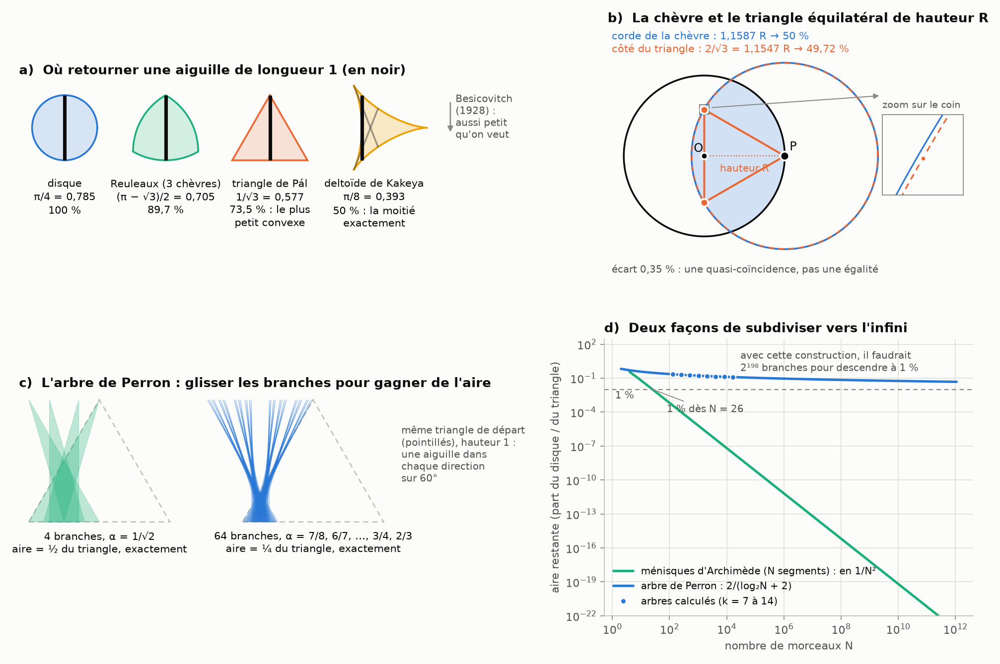

# Partie V : l'aiguille de Kakeya, l'arbre de Perron et la chèvre

> L'idée proposée, en résumé :
> - le schéma b de la [partie IV](trois-solides.md) serait le problème de l'aiguille, avec un arbre de Perron « étalé qui diminue » ;
> - la chèvre serait le triangle équilatéral de la hauteur de l'aiguille, qui donne la moitié de l'aire du disque pour retourner l'aiguille ;
> - le triangle convexe réduirait ensuite l'aire ;
> - la solution de Hong Wang en dimension 3 serait exactement notre chèvre ;
> - les subdivisions augmenteraient vers l'infini à la circonférence, là où le ménisque se forme.
>
> Suite des parties [I](README.md), [II](archimede.md), [III](pi-dimensions.md) et [IV](trois-solides.md).

Tout est recalculé par [`scripts/aiguille.py`](scripts/aiguille.py) (≈ 10 s). Les tableaux complets sont dans [`resultats/aiguille.md`](resultats/aiguille.md).

## En bref

- **Ton intuition contient bien une moitié exacte, mais pas là où tu la places.**
  - Le triangle équilatéral de hauteur 1 est bien le plus petit convexe où l'on peut retourner l'aiguille (Pál, 1920). Mais il couvre 73,5 % du disque, pas la moitié.
  - La moitié exacte, c'est le deltoïde de Kakeya : π/8, exactement la moitié du disque de diamètre 1.
- **La chèvre frôle le triangle sans le rejoindre.** Le côté du triangle équilatéral de hauteur R vaut 2/√3 = 1,1547 R, à 0,35 % de la corde de la chèvre (1,1587 R). Avec cette corde, la chèvre broute 49,72 % du pré. C'est une quasi-coïncidence, pas une égalité.
- **L'arbre de Perron cache, lui, une vraie moitié.**
  - Avec 4 branches, le meilleur arbre couvre exactement la moitié du triangle, pour un rapport de rétrécissement de 1/√2.
  - Avec 2^k branches et les rapports 2/3, 3/4, 4/5…, il en couvre exactement 2/(k + 2).
- **C'est la convergence la plus lente de tout le projet**, en 1/log N. Les ménisques d'Archimède, eux, disparaissent en 1/N².
- **Hong Wang et Joshua Zahl n'ont pas résolu la chèvre.** Ils ont démontré en 2025 la conjecture de Kakeya en dimension 3, et Hong Wang a reçu la médaille Fields en 2026. Le point commun avec la chèvre existe, mais il est lâche : dans les deux cas, on mesure des recouvrements.
- **Le schéma b n'est pas un arbre de Perron** : c'est une courbe de nombres. Mais les deux racontent une histoire voisine : on subdivise, on recolle, et on regarde ce qui reste.

---

## 1. Le problème de l'aiguille (Kakeya, 1917)

La question est simple : quelle est la plus petite surface dans laquelle on peut retourner complètement une aiguille de longueur 1, c'est-à-dire la faire tourner de 180° en la déplaçant sans la soulever ?

| ensemble | aire | part du disque | ce qu'il faut savoir |
|---|---|---|---|
| disque de diamètre 1 | π/4 = 0,785 | 100 % | on tourne autour du centre |
| triangle de Reuleaux de largeur 1 | (π − √3)/2 = 0,705 | 89,7 % | trois chèvres (§ 2) |
| triangle équilatéral de hauteur 1 | 1/√3 = 0,577 | 73,5 % | le plus petit **convexe** (Pál, 1920) |
| deltoïde | π/8 = 0,393 | **50 %** | la proposition de Kakeya |
| ensembles étoilés | au moins π/108 = 0,029 | au moins 3,7 % | Cunningham (1971), amélioré en π/98 (2025) |
| sans contrainte | aussi petite qu'on veut | → 0 | Besicovitch et Perron (1928) |

- **Le deltoïde** est la courbe tracée par un point d'un cercle de rayon 1/4 qui roule à l'intérieur d'un cercle de rayon 3/4.
  - Chaque segment tangent qui le traverse mesure exactement 1 (le script le vérifie). L'aiguille tourne donc en glissant contre les bords : sur la figure a, elle est en noir, et deux autres positions sont en gris.
  - Son aire, π/8, vaut exactement la moitié de π/4. **C'est là qu'est ta « moitié du disque pour retourner l'aiguille ».**
- **Kakeya pensait que le deltoïde était le minimum.** Besicovitch a montré en 1928 qu'il n'y a pas de minimum : on peut descendre aussi bas qu'on veut (§ 3).

## 2. La chèvre et le triangle équilatéral

**Ce qui est vrai.** Plante le piquet en P, sur le bord du pré de rayon R. Trace le triangle équilatéral de sommet P et de hauteur PO = R (figure b).
- Son côté vaut 2R/√3 = 1,1547 R, et la corde de la chèvre 1,1587 R : l'écart n'est que de 0,35 %.
- Avec une corde égale au côté du triangle, la chèvre broute 49,72 % du pré au lieu de 50 %. Le zoom de la figure b montre les deux cercles, presque confondus.

**Ce qui ne l'est pas.** Ce n'est pas une égalité.
- La chèvre est fixée par sin β − β cos β = π/2 (partie I), qui donne β = 1,9057.
- Le triangle donnerait β = 2·arccos(1/√3) = 1,9106.
- Et le triangle de Pál ne prend pas la moitié du disque de l'aiguille : il en prend 73,5 %.

**Le vrai lien entre la chèvre et l'aiguille : le triangle de Reuleaux.** Attache trois chèvres aux sommets d'un triangle équilatéral de côté 1, avec une corde égale au côté.
- Chaque chèvre broute un disque centré sur le bord des deux autres. C'est exactement la configuration de la chèvre, avec une corde égale au rayon.
- La zone que les trois chèvres atteignent toutes est le triangle de Reuleaux. Sa largeur vaut 1 dans toutes les directions, donc l'aiguille peut y tourner.
- Son aire, 0,705, est la plus petite de toutes les formes de largeur constante (théorème de Blaschke–Lebesgue). Elle reste pourtant plus grande que celle du triangle de Pál.

## 3. L'arbre de Perron : la vraie moitié

**La construction** (Perron 1928, dans la version de Schoenberg 1962) :
1. On part du triangle équilatéral de hauteur 1. Il contient une aiguille dans chaque direction sur 60°.
2. On coupe sa base en 2^k morceaux égaux, ce qui donne 2^k triangles fins : les « branches ».
3. On fait glisser les branches le long de la base pour qu'elles se recouvrent. Chacune garde ses directions, donc l'ensemble contient toujours une aiguille dans chaque direction.
4. À chaque étage, on recolle deux blocs voisins puis on les rapproche : leur triangle principal rétrécit d'un rapport α.

Le résultat ressemble à un arbre, avec un petit tronc et une gerbe de branches (figure c). Trois arbres tournés de 60° couvrent toutes les directions. On les relie ensuite par des « jonctions de Pál » d'aire aussi petite qu'on veut, ce qui donne un ensemble où l'aiguille se retourne.

**Les résultats exacts** (aire calculée exactement, à 30 chiffres) :

| branches | rapports α, du plus fin au plus gros | aire, en part du triangle |
|---:|---|---|
| 2 | 2/3 | 2/3 |
| 4 | 1/√2 puis 1/√2 (ou 3/4 puis 2/3) | **½, exactement** |
| 8 | 4/5, 3/4, 2/3 | 2/5 |
| 16 | 5/6, 4/5, 3/4, 2/3 | 1/3 |
| 64 | 7/8, 6/7, …, 3/4, 2/3 | 1/4 |
| 2^k | (k+1)/(k+2), …, 3/4, 2/3 | **2/(k + 2)** |

- **Avec 4 branches, l'aire vaut exactement ½ + 2(α² − ½)² près de l'optimum.**
  - Le minimum est donc en α = 1/√2, et il vaut ½.
  - À cet optimum, le tronc et les branches se partagent la moitié du triangle, un quart chacun.
  - Voilà une vraie moitié, avec le √2 de la diagonale du carré.
- **La formule 2/(k + 2)** est vérifiée exactement jusqu'à 64 branches, et à 10⁻⁵ près jusqu'à 16 384. Je n'en ai pas écrit de preuve générale.
- **Ce n'est plus tout à fait l'optimum au-delà de 4 branches.** En réglant les rapports autrement, on gagne un peu : 0,3981 au lieu de 0,4 avec 8 branches, 0,2838 au lieu de 0,2857 avec 32. L'ordre de grandeur, lui, ne change pas.
- **Les rapports 2/3, 3/4, 4/5…** sont les mêmes fractions (n − 1)/n que l'anneau d'Archimède de la partie IV. Attention : ces fractions apparaissent partout où un produit se simplifie en cascade (2/3 × 3/4 × 4/5 = 2/5). Ici, elles sortent d'une optimisation sur des triangles, pas de la géométrie en dimension n.

**C'est la convergence la plus lente de tout le projet.**
- Avec N = 2^k branches, l'aire vaut 2/(log₂ N + 2) : doubler le nombre de branches ne fait gagner qu'un tout petit peu.
- Pour descendre à 1 % du triangle, cette construction demanderait 2^198 ≈ 4·10⁵⁹ branches.
- Et on ne peut pas faire beaucoup mieux. Córdoba (1977) a montré que N aiguilles épaissies en tubes de largeur 1/N, pointant dans N directions bien séparées, couvrent toujours une aire d'au moins c/log N. Keich (1999) a montré que cet ordre est atteint.

## 4. Les subdivisions à l'infini et le ménisque

Ton image des « subdivisions qui augmentent vers l'infini à la circonférence, là où le ménisque se forme » décrit très bien Archimède, beaucoup moins Perron (figure d).
- **Chez Archimède**, l'erreur du polygone à N côtés est exactement la somme de N petits ménisques : les segments de disque entre chaque corde et son arc. Leur aire totale vaut 1 − (N/2π)·sin(2π/N) du disque, soit environ (2π²/3)/N². Elle passe sous 1 % dès N = 26.
- **Les sphères géodésiques de la partie II** font la même chose en 3D : chaque face laisse une petite calotte, un ménisque de l'espace, et l'erreur baisse comme 1/(nombre de faces).
- **Chez Perron**, ce qui reste n'est pas au bord d'un disque. Ce sont les pointes des branches qui dépassent du tronc, et elles ne disparaissent qu'en 1/log N.

| N morceaux | ménisques d'Archimède | arbre de Perron |
|---:|---|---|
| 4 | 36 % | 50 % |
| 16 | 2,6 % | 33 % |
| 64 | 0,16 % | 25 % |
| 1 024 | 6·10⁻⁶ | 17 % |
| 16 384 | 2·10⁻⁸ | 12,5 % |

Ce sont deux façons de subdiviser vers l'infini, avec deux vitesses très différentes. Les ménisques suivent 1/N², comme l'erreur des polygones (partie II). Perron suit 1/log N, plus lentement que tout ce qu'on a rencontré, y compris les 1/n de Wallis et des cordes de la chèvre (partie IV).

## 5. Hong Wang, Joshua Zahl et la dimension 3

**Ce qu'ils ont démontré** (prépublication arXiv de février 2025) :
- Tout ensemble de l'espace qui contient un segment de longueur 1 dans chaque direction (un « ensemble de Kakeya ») est de dimension 3, au sens de Hausdorff comme de Minkowski.
- Un tel ensemble peut avoir un volume nul (Besicovitch), mais il ne peut pas être plus « mince » qu'un vrai volume.
- En dimension 2, c'était connu depuis Davies (1971). En dimension 4 et plus, la question reste ouverte.
- Hong Wang a reçu la médaille Fields en juillet 2026, en partie pour ce travail.

**Pourquoi ce n'est pas notre chèvre.**
- La chèvre cherche un rayon précis pour que deux boules se recouvrent à moitié. La réponse est un nombre : 1,2285 R en 3D.
- Kakeya en 3D est un énoncé de dimension sur des ensembles fractals faits de tubes très fins. Il n'y a ni corde, ni moitié.

**Ce qu'ils ont en commun.**
- Les deux parlent de recouvrements. La chèvre règle le recouvrement de deux boules pour qu'il vaille exactement la moitié. Kakeya montre que des tubes pointant dans toutes les directions ne peuvent pas trop se recouvrir.
- Le titre de l'article de Wang et Zahl le dit : « estimations de volume pour des unions d'ensembles convexes ». Les lentilles de la chèvre sont, elles aussi, des convexes (des intersections de boules).
- Mais les questions et les outils sont différents. Dire que l'un « est exactement » l'autre serait trompeur.

## 6. Et le schéma b ?

Le schéma b de la partie IV est une courbe de nombres : les sommes partielles de la suite des trois solides, qui encadrent π par en dessous et par au-dessus. Ce n'est pas un arbre de Perron.

Ta lecture a pourtant un fond juste :
- les deux procédés subdivisent puis recollent : des retenues d'un côté, des branches de l'autre ;
- la suite converge géométriquement (½ ou ¼ par étage), parce qu'elle évalue loin de toute singularité (partie IV, § 5) ;
- l'arbre de Perron ne descend qu'en 1/log N, et c'est le prix à payer pour garder une aiguille dans chaque direction (Córdoba).

## 7. Le tri : exact, à nuancer, inexact

- **Exact** :
  - les aires du tableau du § 1 (contrôlées numériquement), dont le deltoïde à exactement la moitié du disque ;
  - le triangle de Pál, le plus petit convexe ;
  - l'arbre de Perron à 4 branches, à exactement ½ (formule ½ + 2(α² − ½)², vérifiée à 30 chiffres) ;
  - la famille 2/(k + 2), vérifiée exactement jusqu'à 64 branches et numériquement jusqu'à 16 384 ;
  - le théorème de Wang et Zahl (prépublication de 2025, médaille Fields 2026).
- **À nuancer** :
  - la formule 2/(k + 2) n'est plus optimale au-delà de 4 branches (moins de 1 % d'écart), et je n'en ai pas de preuve générale ;
  - le lien entre Reuleaux et la chèvre est exact, mais le triangle de Reuleaux n'est pas l'ensemble minimal pour l'aiguille.
- **Inexact** :
  - « le triangle équilatéral donne la moitié du disque » : il en donne 73,5 %, et c'est le deltoïde qui donne la moitié ;
  - « la solution de Hong Wang en dimension 3 est exactement notre chèvre » : ce sont deux problèmes différents, qui ne se rejoignent que par l'idée de recouvrement ;
  - « le schéma b est un arbre de Perron » : c'est une image, pas une identité.
- **Coïncidence** : 2/√3 tombe à 0,35 % de la corde de la chèvre.

## Sources

- S. Kakeya, « Some problems on maxima and minima regarding ovals », *Tôhoku Science Reports* 6, 71–88 (1917).
- J. Pál, « Ueber ein elementares Variationsproblem », *Kgl. Danske Videnskabernes Selskab, Math.-fys. Meddelelser* 3(2) (1920) : le triangle équilatéral, minimum convexe.
- A. S. Besicovitch, « On Kakeya's problem and a similar one », *Mathematische Zeitschrift* 27, 312–320 (1928) ; O. Perron, « Über einen Satz von Besicovitch », *Mathematische Zeitschrift* 28, 383–386 (1928).
- I. J. Schoenberg, « On the Besicovitch–Perron solution of the Kakeya problem », dans *Studies in Mathematical Analysis and Related Topics*, Stanford University Press (1962) ; K. J. Falconer, *The Geometry of Fractal Sets*, Cambridge (1985), chapitre 7.
- F. Cunningham, « The Kakeya problem for simply connected and for star-shaped sets », *American Mathematical Monthly* 78(2), 114–129 (1971) ; [l'amélioration en π/98 (2025)](https://arxiv.org/abs/2509.05711).
- R. O. Davies, « Some remarks on the Kakeya problem », *Proceedings of the Cambridge Philosophical Society* 69, 417–421 (1971).
- A. Córdoba, « The Kakeya maximal function and the spherical summation multipliers », *American Journal of Mathematics* 99(1), 1–22 (1977) ; U. Keich, « On L^p bounds for Kakeya maximal functions and the Minkowski dimension in R² », *Bulletin of the London Mathematical Society* 31(2), 213–221 (1999).
- H. Wang et J. Zahl, « Volume estimates for unions of convex sets, and the Kakeya set conjecture in three dimensions », [arXiv:2502.17655](https://arxiv.org/abs/2502.17655) (2025).
- [Annonce des médailles Fields 2026](https://euromathsoc.org/news/2026-fields-medallists-and-imu-prize-winners-announced-222) (Société mathématique européenne, 23 juillet 2026).
