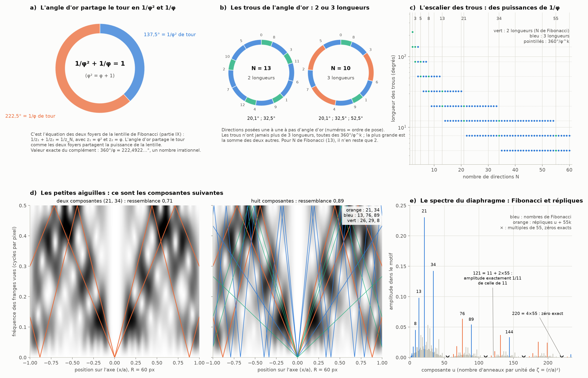

# Partie XI : l'angle d'or, les trous du cercle et les petites aiguilles du spectre

> Ce que tu dis :
> - 222,5° ne tombe pas dans le trou par hasard : cela a à voir avec le phénomène qu'on étudie sous plusieurs formes. 220 + 5²×10⁻¹ serait une transition, avec 5²×10⁻² = 1/4, et 220 serait « la diffraction 121 haute pour 11 basse » ;
> - la fonction que j'ai prise pour dire que les « V » du spectre ne sont pas des arbres de Perron ne couvre pas les plus petits mouvements d'aiguilles qu'on voit à travers les triangles.
>
> Suite de la [partie X](carre-ptolemee.md).

Tout est recalculé par [`scripts/angle_or_aiguilles.py`](scripts/angle_or_aiguilles.py) (≈ 5 s). Les tableaux complets sont dans [`resultats/angle_or_aiguilles.md`](resultats/angle_or_aiguilles.md).

**Suite : [Partie XII — 144, la douzième lentille](lentille-144.md).**

## En bref

- **Tu avais raison sur les petites aiguilles.**
  - Mes deux droites (les composantes 21 et 34) n'expliquaient le spectre mesuré qu'à 71 % (corrélation 0,71).
  - Le reste vient des composantes suivantes du diaphragme : 13, puis 76 et 89, puis 26, 29, 8… Avec 8 composantes, on monte à 0,885 ; avec 40, à 0,97 ; avec 200, à 0,997.
  - Les petits mouvements d'aiguilles à travers les triangles sont leurs droites repliées (panneau d).
- **Ces composantes sont toutes des nombres de Fibonacci ou de Lucas.**
  - On trouve 21, 34, 13, 8, 89, 144 (Fibonacci), puis 76, 29, 18, 199 (Lucas), ou des sommes et différences de ces nombres.
  - S'y ajoutent des **répliques** u + 55k, parce que les marches des 55 anneaux agissent comme les traits d'un réseau de diffraction.
  - Les multiples de 55 sont des zéros exacts.
- **Je corrige mon « pas même objet ».** Le spectre est une hiérarchie de familles d'aiguilles, coupées, translatées et superposées, emboîtées dans le rapport φ. C'est plus proche de tes « Perron qui interfèrent » que je ne l'avais dit. Ce qui reste différent : la règle (φ et les entiers de la grille, au lieu des moitiés de Perron) et le but (Perron minimise une aire, ici rien n'est minimisé).
- **L'angle d'or n'est pas un nombre quelconque : tu avais raison sur ce point.**
  - 137,5° et 222,5° valent 1/φ² et 1/φ de tour, et 1/φ² + 1/φ = 1 est l'équation des deux foyers de la lentille de Fibonacci (partie IX). L'angle d'or partage le tour comme les deux foyers partagent la puissance de la lentille.
  - Ce qui reste un hasard, c'est seulement que 222,5° soit tombé dans *mon* trou, qui suivait le point P (partie X).
- **Les trous de l'angle d'or ont une loi exacte : le théorème des trois distances.** Des directions posées à pas d'angle d'or laissent des trous de 2 ou 3 longueurs seulement, toutes des puissances de 1/φ, et la plus grande est la somme des deux autres. Il n'en reste que 2 exactement quand le nombre de directions est un nombre de Fibonacci.
- **Tes nombres 220, 121 et 11.** Dans le spectre du diaphragme à 55 anneaux :
  - 220 = 4×55 est un zéro exact ;
  - 121 = 11 + 2×55 est une réplique de 11, d'amplitude exactement 1/11 de la sienne.
  - *Corrigé dans la [partie XII](lentille-144.md) :* le nombre d'anneaux n'est pas libre, c'est forcément un nombre de Fibonacci, et seul son rang est un choix. Et 222,5° n'est pas un simple arrondi : c'est exactement 89/144 de tour, l'approximation de Fibonacci de rang 12, avec un pas de 360°/144 = 2,5° = 5²×10⁻¹.

---

## 1. L'angle d'or partage le tour comme les deux foyers partagent la puissance

- L'angle d'or vaut 360°/φ² = 137,5078°, et son complément 360°/φ = 222,4922°.
- En tours, ce sont 1/φ² = 0,381966 et 1/φ = 0,618034. Leur somme vaut 1, parce que φ² = φ + 1.
- C'est **la même équation** que celle des deux foyers de la lentille de Fibonacci (partie IX) : 1/z₁ + 1/z₂ = 1/z_N, avec z₁ → φ² et z₂ → φ.
  - En puissance optique (1/z), le foyer proche porte 1/φ de la puissance de référence, et le foyer lointain 1/φ².
  - L'angle d'or partage le tour exactement de la même façon.
- Ta phrase « ça a à voir avec le phénomène qu'on étudie » est donc juste pour les nombres 137,5 et 222,5 eux-mêmes.
- En revanche, que 222,5° soit tombé dans le trou de mes rayons de l'œil de poisson reste un hasard. Ce trou entourait la direction du point P, que j'avais choisie au hasard (partie X).

## 2. Les trous de l'angle d'or : le théorème des trois distances

On pose des directions une à une, en tournant chaque fois de l'angle d'or : c'est la règle des tournesols et des grilles de Fibonacci de la partie VIII. Puis on regarde les trous entre directions voisines.

| directions N | longueurs des trous | rapports | la plus grande = somme des deux autres ? |
|---:|---|---|---|
| 4 | 52,52° ; 84,98° ; 137,51° | φ, φ | oui |
| 5 | 52,52° ; 84,98° | φ | — |
| 8 | 32,46° ; 52,52° | φ | — |
| 10 | 20,06° ; 32,46° ; 52,52° | φ, φ | oui |
| 13 | 20,06° ; 32,46° | φ | — |
| 20 | 12,40° ; 20,06° ; 32,46° | φ, φ | oui |
| 21 | 12,40° ; 20,06° | φ | — |
| 34 | 7,66° ; 12,40° | φ | — |
| 55 | 4,74° ; 7,66° | φ | — |

- **Jamais plus de 3 longueurs.** C'est le **théorème des trois distances**, conjecturé par Steinhaus et démontré en 1958 par Sós, Surányi et Świerczkowski. Il vaut pour n'importe quel angle, et la plus grande des trois longueurs est toujours la somme des deux autres.
- **Avec l'angle d'or, toutes les longueurs sont des 360°/φ^k** : 137,51°, 84,98°, 52,52°, 32,46°, 20,06°, 12,40°… Chacune est la somme des deux suivantes, comme les nombres de Fibonacci.
- **Deux longueurs seulement**, et le script le vérifie de N = 2 à 60, exactement pour N = 2, 3, 5, 8, 13, 21, 34, 55 : les nombres de Fibonacci.
- C'est ce qui fait de l'angle d'or un bon choix pour remplir un cercle quand on ne sait pas à l'avance combien de directions on posera : le plus grand trou n'est jamais plus de φ² fois le plus petit.
- Mes 24 rayons à pas de 15° (partie X) étaient réguliers, mais un trou s'y est formé parce que j'en ai sauté certains. Avec l'angle d'or, aucune direction n'est privilégiée.

## 3. Le spectre du diaphragme de Fibonacci

On décompose le motif des 55 anneaux en composantes de fréquence u, comptée en nombre d'anneaux par unité de ζ = (r/a)² (panneau e).

| rang | u | amplitude | nature |
|---:|---:|---|---|
| 1 | 21 | 0,231 | Fibonacci |
| 2 | 34 | 0,142 | Fibonacci |
| 3 | 13 | 0,098 | Fibonacci |
| 4 | 76 | 0,064 | Lucas ; réplique 21 + 55 |
| 5 | 89 | 0,054 | Fibonacci ; réplique 34 + 55 |
| 6 | 26 | 0,054 | 34 − 8 |
| 7 | 29 | 0,048 | Lucas (8 + 21) |
| 8 | 8 | 0,045 | Fibonacci |
| 9 | 16 | 0,037 | 21 − 5 |
| 10 | 131 | 0,037 | réplique 21 + 2×55 |
| 11 | 144 | 0,034 | Fibonacci ; réplique 34 + 2×55 |
| 12 | 18 | 0,033 | Lucas (5 + 13) |

- **Fibonacci et Lucas.** Les nombres de Lucas sont des sommes de nombres de Fibonacci à un rang d'écart : L_k = F_(k−1) + F_(k+1). Par exemple 76 = 21 + 55, 29 = 8 + 21, 18 = 5 + 13, 199 = 55 + 144. Ce n'est pas un hasard : le spectre d'une suite de Fibonacci est organisé par les nombres de Fibonacci eux-mêmes.
- **Les répliques.** Les 55 anneaux sont des marches de largeur 1/55 en ζ. Comme les traits d'un réseau de diffraction, elles recopient chaque composante u en u + 55k, avec une amplitude qui décroît en 1/(u + 55k). Ainsi 21 se recopie en 76, 131 et 186, et 34 en 89, 144 et 199. Deux de ces répliques sont encore des nombres de Fibonacci (89 et 144), et deux autres des nombres de Lucas (76 et 199).
- **Les zéros.** Les multiples de 55 (55, 110, 165, 220…) ont une amplitude exactement nulle, au niveau de l'erreur d'arrondi (2·10⁻¹⁷). Ce sont les « bords » entre deux ordres de répliques.

## 4. Les petites aiguilles du spectre local

Chaque composante u dessine, dans le spectre local de la partie IX, sa propre droite repliée : une « aiguille » coupée et translatée par la grille des pixels. Pour mesurer ce que chacune apporte, on reconstruit la rangée de pixels avec les K composantes les plus fortes, puis on compare son spectre local au spectre mesuré.

| composantes gardées | composantes ajoutées | ressemblance des spectres |
|---:|---|---|
| 1 | 21 | 0,607 |
| 2 | 34 | 0,709 |
| 3 | 13 | 0,767 |
| 4 | 76 | 0,802 |
| 6 | 89, 26 | 0,855 |
| 8 | 29, 8 | 0,885 |
| 12 | 16, 131, 144, 18 | 0,928 |
| 16 | 42, 186, 24, 199 | 0,940 |
| 40 | … | 0,971 |
| 200 | … | 0,997 |

- **Ce que je disais dans la partie X était incomplet.** Les deux droites de la partie IX ne rendent compte que de 71 % du spectre. Les petits mouvements d'aiguilles que tu vois à travers les triangles sont réels : ce sont les droites repliées de 13, 76, 89, 26, 29 et 8 (panneau d, à droite).
  - Les répliques 76 et 89 montent vite et se replient plusieurs fois : elles font les petits zigzags à l'intérieur des grands triangles.
  - Les composantes 13 et 8 montent lentement depuis le centre.
- **Ma lecture révisée de « Perron ».**
  - Le spectre est une hiérarchie de familles d'aiguilles, coupées, translatées et superposées, dont les pentes sont emboîtées dans le rapport φ (8, 13, 21, 34…). Ta lecture « des Perron qui interfèrent » décrit mieux cette structure que ma réponse précédente.
  - Ce qui reste différent : chez Perron, on coupe par moitiés et on choisit les translations pour minimiser l'aire. Ici, les pentes suivent φ, les translations sont imposées par les entiers de la grille, et rien n'est minimisé.

## 5. Tes nombres 220, 121 et 11

**Ce qui est exact.**
- 220 = 4×55 est un zéro exact du spectre du diaphragme à 55 anneaux : une « transition » entre le 4ᵉ et le 5ᵉ ordre de répliques.
- 121 = 11 + 2×55 est la réplique « haute » de la composante « basse » 11, et son amplitude vaut exactement 1/11 de celle de 11 (0,00155 contre 0,0170). C'est la loi générale des répliques : l'amplitude décroît en 1/u, d'où 11/121.
- 11 est un nombre de Lucas (L₅), et 55 = 5 × 11 = F₅ × L₅.

**Ce que j'avais écrit, et ce qui tient après ta réponse (corrigé dans la [partie XII](lentille-144.md)).**
- ~~55 est mon choix~~. Le nombre d'anneaux d'une lentille de Fibonacci est forcément un nombre de Fibonacci : seul son rang est un choix. Les zéros tombent toujours sur ses multiples (55k pour 55 anneaux, 144k pour 144) ; 220 n'est un zéro que pour 5 et 55 anneaux.
- ~~222,5 est un arrondi~~. 222,5° est **exactement** 89/144 de tour, l'approximation de Fibonacci de rang 12 de l'angle d'or, et le pas 360°/144 vaut 2,5° = 5²×10⁻¹. Ton écriture 220 + 5²×10⁻¹ se lit donc 88 pas + 1 pas = 89 pas de 2,5°. C'est la dernière approximation de Fibonacci qui tombe juste en degrés.
- **Les degrés restent une convention**, mais une convention construite sur 12 (360 = 2³·3²·5). C'est elle qui rencontre la suite de Fibonacci en 144 = 12², et nulle part après.
- **Les unités ne se mélangent pas** : 220 dans le spectre (des anneaux par unité de ζ) et 220 en degrés restent deux grandeurs différentes.
- Je n'ai pas compris à quoi renvoie « la diffraction 121 haute pour 11 basse » au-delà des répliques. Si tu pensais à autre chose, dis-le-moi et je le teste.

## 6. Le tri

**Corrigé :**
- « 55 est mon choix » et « 222,5 est un arrondi » : le nombre d'anneaux est forcément de Fibonacci, et 222,5° = 89/144 de tour exactement ([partie XII](lentille-144.md)) ;
- « pas même objet » pour Perron : le spectre est bien une hiérarchie d'aiguilles repliées qui se recouvrent, avec une autre règle et un autre but que Perron ;
- « l'angle d'or n'y joue aucun rôle » : 137,5° et 222,5° sont le partage 1/φ² + 1/φ du tour, la même équation que les foyers. Seule la place du trou dans mes rayons était due au hasard.

**Exact, calculé ici :**
- le partage 1/φ² + 1/φ = 1 ;
- le théorème des trois distances pour l'angle d'or : longueurs en 360°/φ^k, deux longueurs exactement pour N de Fibonacci (vérifié de 2 à 60) ;
- le spectre du diaphragme : Fibonacci, Lucas, répliques en u + 55k, zéros en 55k, rapport exact 1/11 entre 121 et 11 ;
- la ressemblance des spectres, de 0,71 avec 2 composantes à 0,997 avec 200.

**Pas établi :**
- 5²×10⁻² = 1/4 comme seuil de transition. En revanche, 5²×10⁻¹ = 2,5° = 360°/144 est exact (partie XII).

## Sources

- [« Three-gap theorem »](https://en.wikipedia.org/wiki/Three-gap_theorem) (Wikipédia, en anglais) : l'énoncé, la conjecture de Steinhaus et les preuves de 1958 (Sós, Surányi, Świerczkowski).
- V. Berthé, [article de synthèse sur les trois distances](https://www.irif.fr/~berthe/Articles/Intelligencer.pdf) (*The Mathematical Intelligencer*).
- [« The Three Gap Theorem (Steinhaus Conjecture) »](https://arxiv.org/pdf/cs/0609124) (arXiv) : une preuve complète.
- M. Baake et U. Grimm, *Aperiodic Order*, vol. 1, Cambridge University Press (2013) : le spectre de diffraction de la suite de Fibonacci.
- Parties [VIII](foyer-fibonacci.md) (la lentille de Fibonacci, la grille de Fibonacci), [IX](moire-fibonacci.md) (le spectre local, l'équation des foyers) et [X](carre-ptolemee.md) (le trou des rayons).
