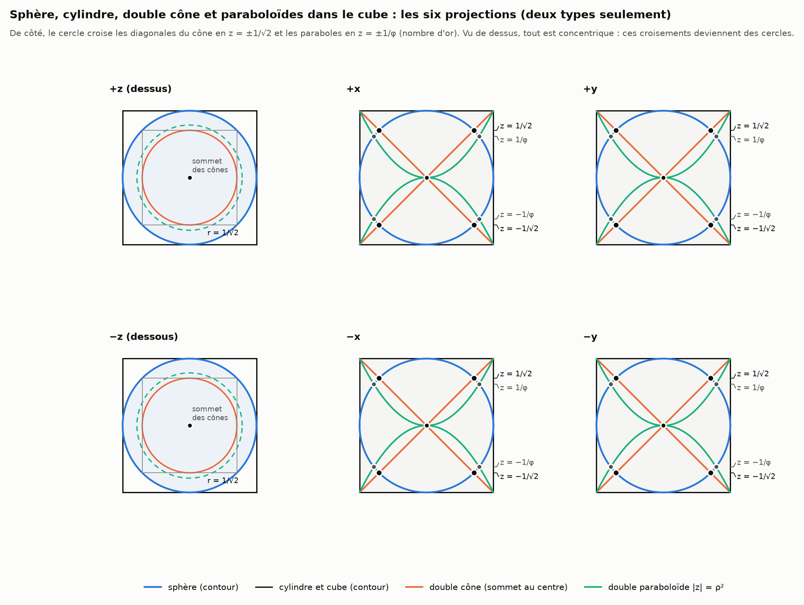
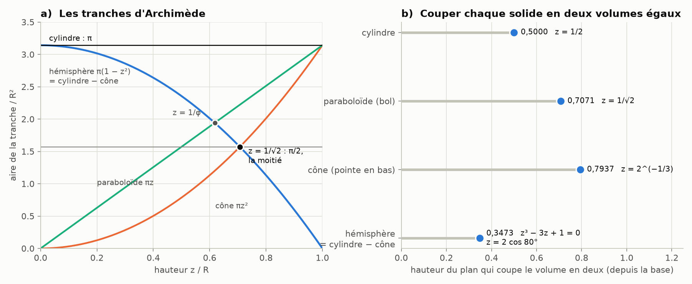
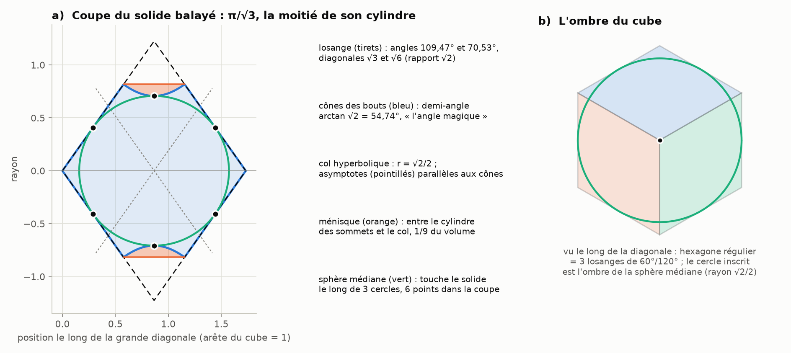
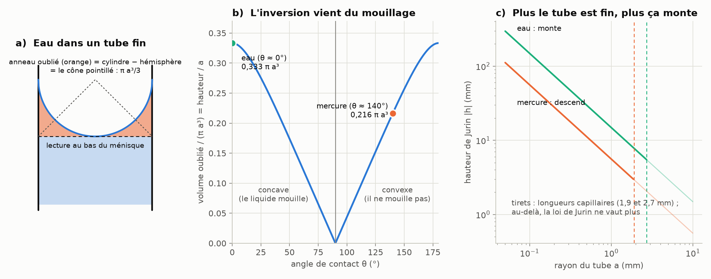
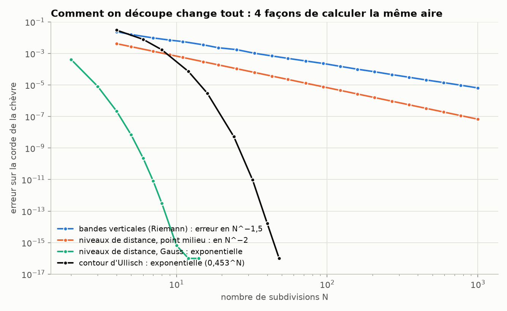
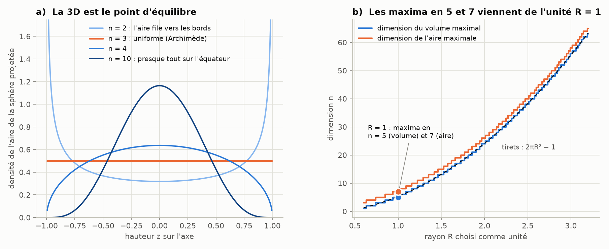
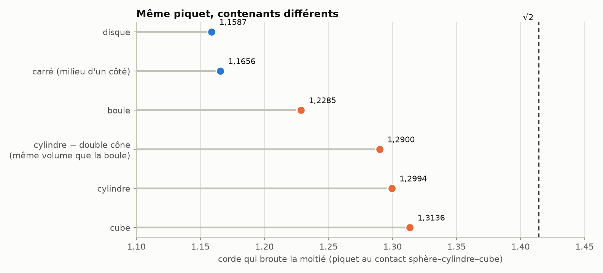
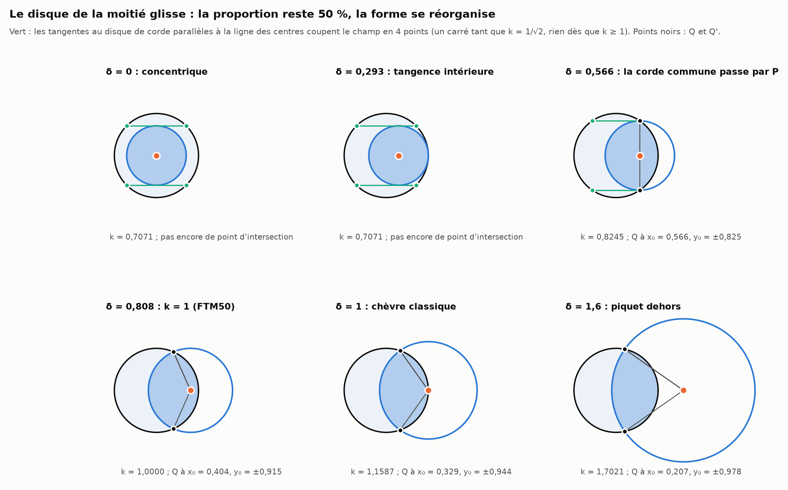
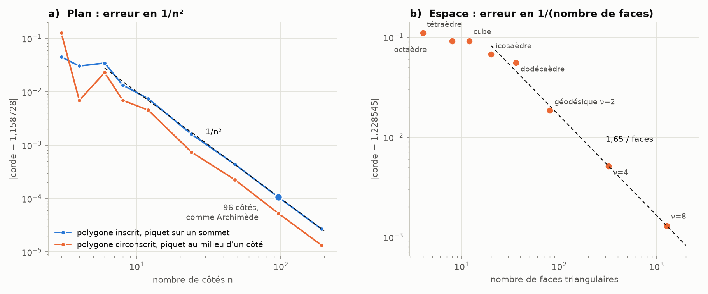

# Partie II : Archimède, le cube qui tourne et le ménisque

> Suite de [la partie I](README.md). On reprend la même démarche (recouvrements, moitiés, tangences, dimensions) avec les solides d'Archimède : sphère, cylindre, cône, hémisphère, paraboloïde, tous rangés dans un cube. On y ajoute le ménisque qui manque à l'affiche du bicône : celui qui apparaît au milieu quand un cube tourne. Les reconfigurations (tangences, naissances de points, inversions) sont relevées au fil du texte et regroupées au [§ 10](#10-tableau-des-reconfigurations).

Les nombres viennent de [`scripts/calculs_archimede.py`](scripts/calculs_archimede.py) (≈ 45 s) et les figures de [`scripts/figures_archimede.py`](scripts/figures_archimede.py). Les tableaux complets sont dans [`resultats/archimede.md`](resultats/archimede.md).

**Comment j'ai lu la demande.** Elle mêle des constructions précises et des intuitions plus libres. Les deux sont traitées, mais pas de la même façon : ce qui se calcule est calculé, et ce qui relève de la coïncidence ou de l'image est signalé comme tel (§ 0). Quand une phrase admettait plusieurs lectures, j'ai choisi celle qui donne un objet mathématique précis, et je le dis à l'endroit concerné.

**Sommaire**
0. [Le tri : exact, à nuancer, inexact](#0-le-tri--exact-à-nuancer-inexact)
1. [La superposition dans le cube : six projections et leurs croisements](#1-la-superposition-dans-le-cube--six-projections-et-leurs-croisements)
2. [Le cube qui tourne : le losange et son ménisque](#2-le-cube-qui-tourne--le-losange-et-son-ménisque)
3. [Le vrai ménisque : Archimède dans une éprouvette](#3-le-vrai-ménisque--archimède-dans-une-éprouvette)
4. [Contacts, tangentes et points comptés deux fois](#4-contacts-tangentes-et-points-comptés-deux-fois)
5. [Riemann, Lebesgue et la chèvre](#5-riemann-lebesgue-et-la-chèvre)
6. [Dimensions 5 et 7 : ce qui dépend de l'unité, ce qui n'en dépend pas](#6-dimensions-5-et-7--ce-qui-dépend-de-lunité-ce-qui-nen-dépend-pas)
7. [Entre la 2D et la 3D : des chèvres dans les solides d'Archimède](#7-entre-la-2d-et-la-3d--des-chèvres-dans-les-solides-darchimède)
8. [Le disque de la moitié glisse](#8-le-disque-de-la-moitié-glisse)
9. [L'erreur des polygones et des polyèdres](#9-lerreur-des-polygones-et-des-polyèdres)
10. [Tableau des reconfigurations](#10-tableau-des-reconfigurations)
11. [Reproduire, sources](#11-reproduire-sources)

---

## 0. Le tri : exact, à nuancer, inexact

| Ce qui a été avancé | Verdict | Ce qui est vrai exactement |
|---|---|---|
| Hémisphère = cylindre − cône ; paraboloïde = ½ cylindre | **exact** | Archimède, tranche par tranche : $\pi(R^2-z^2) = \pi R^2 - \pi z^2$. Pour le paraboloïde, la tranche $\pi R z$ croît linéairement avec la hauteur, d'où la moitié. |
| $4\pi r^2 = \pi(2r)^2$, « le 2 est une approximation, Archimède mesurait par déplacement d'eau » | **inexact** | Le 2 est exact. Archimède le démontre géométriquement (*De la sphère et du cylindre*, I) : l'aire d'une calotte vaut celle du disque dont le rayon est la corde pôle–bord, et pour la sphère entière cette corde est le diamètre $2r$. L'histoire de l'eau (rapportée par Vitruve) concerne la couronne et la densité, pas la sphère. |
| Le triangle du cône dans le rectangle « à presque 90° » | **à préciser** | C'est exactement 90° dans la figure d'Archimède, parce que la hauteur du cône égale son rayon : c'est ce qui donne une tranche de rayon $z$ à la hauteur $z$. |
| Un « jeu » au croisement des lignes au centre | **à préciser** | En géométrie exacte, le croisement est un point. Avec des traits réels d'épaisseur $w$ qui se coupent sous l'angle $\theta$, la zone commune est un losange d'aire $w^2/\sin\theta$, minimale justement à 90°. |
| Un cylindre ne devient jamais un point ; 6 points dont 2 superposés donnent 5 points pour tracer une tangente | **juste, une fois précisé** | Sphère–sphère : contact en un point. Sphère–cylindre ou sphère–cône : contact le long d'un cercle. Cinq points déterminent une conique, et la tangente en l'un d'eux se construit avec le théorème de Pascal en comptant ce point deux fois (6 → 5). Voir § 4. |
| Les dimensions 5 et 7 sont celles des sphères maximales | **exact pour R = 1, mais dépend de l'unité** | Avec $R = 2$, les maxima passent en dimensions 24 et 26. La règle est $n \approx 2\pi R^2 - 1$. Voir § 6. |
| La 3D comme « puits entropique » | **pas de sens physique établi** | En revanche, la 3D est vraiment spéciale : c'est la seule dimension où l'aire de la sphère se répartit uniformément le long d'un axe (théorème du « chapeau » d'Archimède). Elle sert de point d'équilibre entre la 2D et les grandes dimensions. Voir § 6. |
| $\pi - 3 = 0{,}14159\ldots$ et $\sqrt2/10 = 0{,}14142\ldots$ | **coïncidence** | Ils diffèrent de $1{,}7\cdot10^{-4}$, et aucune égalité n'est possible ($\pi$ est transcendant, $\sqrt2$ algébrique). Les deux tombent dans l'encadrement d'Archimède $10/71 < \pi - 3 < 1/7$. |
| La 3D est plus proche de √2 que la 2D | **exact** | 1,2285 contre 1,1587 : la corde croît avec la dimension. |
| $2^2-2 = 2$, $3^3-3 = 4!$, $2^3-2 = 3!$, $3^2-3 = 3!$ | **exact, et explicable** | $n^3-n = (n-1)n(n+1)$ et $n^2-n = (n-1)n$ sont des factorielles seulement quand $(n-2)! = 1$, c'est-à-dire pour $n = 2$ ou $3$. Le cube a $2n = 6$ faces, et $2n = n!$ seulement en dimension 3. Son groupe de symétries a $2^3\cdot 3! = 48$ éléments. |
| Le ménisque s'inverse quand le tube devient assez petit | **inexact** | Le sens du ménisque vient du **mouillage**, c'est-à-dire de l'angle de contact. L'eau mouille le verre (ménisque creux), le mercure non (ménisque bombé), quelle que soit la taille du tube. La taille change la hauteur (loi de Jurin) et la forme : une calotte quand le tube est plus fin que la longueur capillaire, soit environ 2 mm. Voir § 3. |
| La lumière décroît en $1/d^2$ | **exact** | Elle se répartit sur une sphère d'aire $4\pi d^2$, exactement. |
| Des géodésiques qui se projettent en demi-ellipses | **exact** | Un grand cercle vu en projection orthographique est une ellipse ; la moitié visible en est une demi-ellipse. |

---

## 1. La superposition dans le cube : six projections et leurs croisements

**La figure.** On range tout dans un cube de côté $2R$ :
- la sphère de rayon $R$ ;
- le cylindre de rayon $R$ et de hauteur $2R$, qui est la figure gravée sur la tombe d'Archimède ;
- le double cône, avec son sommet au centre et ses bases sur le haut et le bas du cylindre (demi-angle 45°) ;
- le double paraboloïde $|z| = \rho^2/R$.



**Six projections, deux dessins.** Par symétrie autour de l'axe, les vues $\pm x$ et $\pm y$ sont identiques, et $\pm z$ aussi.
- **De côté** : un carré (le cylindre et le cube), son cercle inscrit (la sphère), ses deux diagonales (le cône) et deux paraboles.
- **De dessus** : tout est concentrique, avec $\delta = 0$ dans le vocabulaire de la partie I.

**Les croisements, au-dessus et au-dessous de l'origine** (vue de côté) :
- **cercle ∩ diagonales** en $z = \pm R/\sqrt2$, quatre points. En 3D, ce sont deux cercles de rayon $R/\sqrt2$.
- **cercle ∩ paraboles** en $z = \pm R/\varphi$, où $\varphi$ est le **nombre d'or**, car $z^2 + Rz - R^2 = 0$. Le rayon y vaut $R/\sqrt\varphi = 0{,}786\,R$.
- **diagonales ∩ paraboles** seulement au centre et aux coins.

**Le cercle de rayon $R/\sqrt2$ est un vieux connu.** C'est le cercle qui contient la moitié de l'aire, le diaphragme d'un cran de la partie I. C'est aussi le cercle inscrit dans le carré inscrit au grand cercle (le carré gris de la vue de dessus). À cette hauteur, la tranche de la sphère, celle du cône et l'anneau « cylindre − cône » valent toutes trois $\pi R^2/2$, la moitié de la tranche du cylindre.



**Couper chaque solide en deux volumes égaux par un plan** (figure 2b, hauteur comptée depuis la base) :

| solide | hauteur du plan |
|---|---|
| cylindre | $R/2$ |
| bol paraboloïde | $R/\sqrt2$ |
| cône pointe en bas | $2^{-1/3}R$ |
| hémisphère (et donc aussi cylindre − cône) | racine de $z^3 - 3z + 1 = 0$ : $z = 2\cos 80° = 0{,}347\,R$ |

Ce dernier cas est le **cas irréductible** de Cardan : trois racines réelles, mais la formule par radicaux oblige à passer par la racine carrée de nombres négatifs. C'est historiquement ainsi que les nombres complexes sont entrés dans les mathématiques (Bombelli, 1572). C'est la même leçon que la chèvre : une réponse réelle qu'on n'atteint qu'en traversant $\mathbb C$.

**Le cube et ses trois sphères.**

| sphère | rayon | contacts | volume / volume du cube |
|---|---|---|---|
| inscrite | $R$ | 6 (centres des faces) | $\pi/6$ |
| médiane | $\sqrt2\,R$ | 12 (milieux des arêtes) | $\pi\sqrt2/3$ |
| circonscrite | $\sqrt3\,R$ | 8 (sommets) | $\pi\sqrt3/2$ |

On y retrouve la diagonale d'une face ($\sqrt2$) et la grande diagonale ($\sqrt3$). En dimension $n$, la demi-diagonale vaut $\sqrt n$ et la boule inscrite remplit une part $V_n/2^n$ du cube qui ne fait que **décroître** : 1 ; 0,785 ; 0,524 ; 0,308 ; 0,164 ; …

Il y a même une chèvre « discrète ». Piquet au centre d'une face, les $2n-2$ centres de faces voisines sont tous à $\sqrt2\,R$, et seule la face opposée est à $2R$. Presque tout est à $\sqrt2$ : c'est la version en points de la concentration de la partie I.

---

## 2. Le cube qui tourne : le losange et son ménisque

**Ce que montre l'affiche.** Karwowski et Nielsen étudient le bicône des matrices symétriques $\{0 \prec X \prec I\}$, qui paramètre les gaussiennes « étendues ». Pour des matrices $2\times2$, on écrit les valeurs propres $t \pm \rho$, et la condition devient $\rho < \min(t, 1-t)$ : deux cônes à 45° collés par leur base. Leur coupe est un carré posé sur la pointe, un losange. L'isométrie $X \mapsto I - X$ échange les deux cônes : c'est l'« inversion de la hauteur », comme le cône renversé dans le cylindre.

**Ce qui manque.** Quand le bicône vient d'un **cube qui tourne autour de sa grande diagonale**, son milieu n'est pas une arête vive : il est creusé par un hyperboloïde. C'est ce ménisque central qu'on ajoute ici, avec tous ses paramètres (arête $a = 1$).



**Profil du solide balayé**, avec $s$ la position le long de la diagonale ($0 \le s \le \sqrt3$) :

```math
r^2(s) = \begin{cases} 2s^2 & s \le 1/\sqrt3 \quad\text{(cône, demi-angle } \arctan\sqrt2 = 54{,}74°)\\[2pt]
\tfrac12 + 2\left(s-\tfrac{\sqrt3}{2}\right)^2 & 1/\sqrt3 \le s \le 2/\sqrt3 \quad\text{(hyperboloïde)}\\[2pt]
2(\sqrt3-s)^2 & s \ge 2/\sqrt3 \end{cases}
```

Le script compare ce profil au calcul direct sur les arêtes du cube : l'écart est de $10^{-16}$.

**Les paramètres :**

| paramètre | valeur | ce que c'est |
|---|---|---|
| demi-angle des cônes | $\arctan\sqrt2 = 54{,}7356°$ ($\cos = 1/\sqrt3$) | l'« angle magique », le même qu'en RMN (rotation à l'angle magique) |
| losange (cônes prolongés) | angles 109,47° et 70,53°, diagonales $\sqrt3$ et $\sqrt6$ (rapport $\sqrt2$), côté $3/2$ | exactement une face du **dodécaèdre rhombique** ; 109,47° est l'angle du tétraèdre (celui du méthane) |
| col | rayon $\sqrt2/2$ au centre | la sphère médiane du cube passe là |
| asymptotes de l'hyperboloïde | $r = \pm\sqrt2\,(s - \sqrt3/2)$ | parallèles aux cônes des bouts : le losange réapparaît au milieu, en asymptote |
| volume balayé | $\pi/\sqrt3 = 1{,}8138$ | **exactement la moitié** du cylindre circonscrit (rayon $\sqrt{2/3}$, longueur $\sqrt3$), comme le paraboloïde d'Archimède |
| volume du losange (bicône) | $\pi\sqrt3/2$ | **égal à la sphère circonscrite au cube**, parce qu'un cône de rayon $\sqrt2R$ et de hauteur $R$ vaut un hémisphère de rayon $R$ ; le solide en occupe les 2/3 |
| ménisque central (entre le cylindre des sommets et le col) | $\pi/(9\sqrt3) = 0{,}2015$ | **1/9 du solide** ; épaisseur $\sqrt{2/3}-\sqrt{1/2} = 0{,}109$, longueur $1/\sqrt3$ |
| sphère médiane (rayon $\sqrt2/2$) | tangente le long de **3 cercles** | deux sur les cônes ($s = \sqrt3/6$ et $5\sqrt3/6$, rayon $1/\sqrt6$), un au col ; donc **6 points** dans la coupe ; son volume vaut $\sqrt{2/3}$ de celui du solide |
| vide entre col et sphère médiane | $\pi/(12\sqrt3)$ | |
| ombre le long de la diagonale | hexagone régulier = 3 losanges de 60°/120° | son cercle inscrit (rayon $\sqrt2/2$) est l'ombre de la sphère médiane |

*Voir la [partie XXVII](carte-connexions.md), § 2 : ce cercle inscrit est aussi le cercle arctique des cubes empilés au hasard dans une boîte.*

Le contact par **trois cercles** est la version exacte de l'intuition « au moins trois points de contact sur deux cercles, donc 6 ». Une sphère et un cylindre ne se touchent jamais en un point, et une sphère logée dans ce solide le touche le long de trois cercles, soit six points dans toute coupe par l'axe.

---

## 3. Le vrai ménisque : Archimède dans une éprouvette



**L'anneau oublié est un cône.** Dans un tube fin, l'eau mouille le verre et sa surface est une demi-sphère de rayon $a$, le rayon du tube. Si on lit le volume au bas du ménisque (la convention), on oublie le liquide qui remonte le long des parois. Cet « anneau » vaut cylindre − hémisphère, c'est-à-dire le **cône** d'Archimède :

```math
V_\text{oublié} = \pi a^3 - \tfrac23\pi a^3 = \tfrac13\pi a^3 \qquad\Longrightarrow\qquad \Delta h = a/3 .
```

Tranche par tranche, l'anneau à la hauteur $z$ au-dessus du bas a une aire $\pi(a-z)^2$, exactement celle d'un cône. Pour un angle de contact $\theta$ quelconque (ménisque en calotte, avec $S = \sin\theta$ et $C = |\cos\theta|$) :

```math
\frac{V_\text{oublié}}{\pi a^3} = \frac{(1-S)(1+2S)}{3C(1+S)} .
```

Pour le mercure ($\theta \approx 140°$, ménisque bombé lu par le haut), on trouve $0{,}216\,\pi a^3$.

**Ce qui inverse le ménisque.** C'est le signe de $\cos\theta$, donc le mouillage (loi de Young), et pas la taille du tube. Eau sur verre : $\theta \approx 0°$, creux. Mercure : $\theta \approx 140°$ (les mesures vont de 130° à 150°), bombé.

**Ce que change la taille.** Elle se mesure par la **longueur capillaire** $\ell_c = \sqrt{\gamma/(\rho g)}$, qui vaut 2,7 mm pour l'eau et 1,9 mm pour le mercure.
- Si le tube est plus fin que $\ell_c$, le ménisque est une calotte et le liquide monte (ou descend) de $h = 2\gamma\cos\theta/(\rho g a)$ (loi de Jurin). Pour un tube de rayon 0,5 mm : +30 mm pour l'eau, −11 mm pour le mercure.
- Si le récipient est large, le centre est plat et le ménisque ne vit qu'à moins de $\ell_c$ du bord.

L'échelle moléculaire (0,3 nm) est six ordres de grandeur plus bas. À l'échelle du nanomètre la description continue cesse de valoir, mais ce n'est pas là que le ménisque s'inverse.

**Le seau de Newton et le miroir liquide.** Un liquide qui tourne dans un cylindre prend la forme d'un paraboloïde $z = \omega^2\rho^2/(2g)$. Comme un paraboloïde fait la moitié de son cylindre, la surface **pivote autour du niveau de repos** : le centre descend d'autant que le bord monte, de $\omega^2a^2/(4g)$. Avec du mercure, c'est un miroir parfaitement parabolique de focale $f = g/(2\omega^2)$ ; par exemple $f = 9$ m demande un tour toutes les 8,5 s. Le *Large Zenith Telescope* (6 m, Colombie-Britannique) fonctionnait sur ce principe (Hickson et al., 2007).

**Le diaphragme.** En optique, le diaphragme est un trou et n'a pas de ménisque. Sa forme, en revanche, compte :
- **la lumière** : $N$ lames dessinent un polygone régulier qui laisse passer $\frac{N}{2\pi}\sin\frac{2\pi}{N}$ de la lumière du cercle de même rayon ;
- **les aigrettes de diffraction** : on en voit $N$ si $N$ est pair, $2N$ si $N$ est impair ;
- **la focale** : elle est fixée par les lentilles, pas par le diaphragme.

---

## 4. Contacts, tangentes et points comptés deux fois

| contact | forme |
|---|---|
| sphère–sphère, sphère–plan | un point (de multiplicité 2) |
| sphère–cylindre, sphère–cône | un cercle |
| cube–sphère inscrite / médiane / circonscrite | 6 / 12 / 8 points |
| solide du cube tournant–sphère médiane | 3 cercles |

- **Deux coniques se coupent en 4 points**, comptés avec multiplicité (Bézout). Deux cercles passent toujours par les deux « points cycliques » à l'infini, $(1 : \pm i : 0)$, d'où au plus 2 points finis. Quand ils sont tangents, ces 2 points fusionnent : un point compté deux fois.
- **Cinq points déterminent une conique.** Le **théorème de Pascal** dit que, pour 6 points d'une conique, les intersections des côtés opposés de l'hexagone sont alignées. Si deux des 6 points fusionnent, le côté qui les joint devient la **tangente**, ce qui permet de la construire à la règle à partir de 5 points.

C'est le sens précis de « 6 points, dont deux superposés, donnent 5 points pour tracer une tangente ».

---

## 5. Riemann, Lebesgue et la chèvre

On calcule la même aire (la lentille de la chèvre) de quatre façons et on regarde l'erreur sur la corde selon le nombre de subdivisions $N$ :



| N | bandes verticales (Riemann) | niveaux de distance, point milieu | niveaux de distance, Gauss | contour d'Ullisch |
|---:|---:|---:|---:|---:|
| 8 | $10^{-2}$ | $10^{-3}$ | $3\cdot10^{-13}$ | $2\cdot10^{-3}$ |
| 64 | $4\cdot10^{-4}$ | $2\cdot10^{-5}$ | $< 10^{-15}$ | $< 10^{-16}$ |
| 1024 | $6\cdot10^{-6}$ | $6\cdot10^{-8}$ | | |

- **Riemann découpe le terrain** en bandes verticales. Les bords du disque ont un profil en racine carrée qui freine tout : erreur en $N^{-1{,}5}$.
- **Lebesgue découpe les valeurs.** Ici, on range les points du champ par leur distance au piquet (formule de la coaire) :
  ```math
  A(r) = \int_0^r 2\rho\,\arccos\frac{\rho}{2R}\,d\rho .
  ```
  L'intégrande devient lisse, et Gauss donne 16 chiffres avec une douzaine de points. La chèvre est naturellement un problème « à la Lebesgue » : on mesure des ensembles de niveau de la distance.
- **Le contour d'Ullisch** converge aussi exponentiellement (partie I).

**Pourquoi la 3D est algébrique et la 2D non.** La tranche d'une boule de dimension $n$ à la hauteur $z$ mesure une quantité proportionnelle à $(R^2-z^2)^{(n-1)/2}$. C'est un **polynôme seulement si $n$ est impair**.
- En 3D, c'est $\pi(R^2-z^2)$ : exactement la relation hémisphère = cylindre − cône d'Archimède. Toutes les calottes et toutes les lentilles sont alors polynomiales.
- En 2D, la tranche vaut $2\sqrt{R^2-z^2}$, son intégrale fait apparaître un arcsinus, et l'équation devient transcendante.

C'est la racine du résultat de parité de la partie I : les dimensions impaires sont algébriques, les paires transcendantes.

---

## 6. Dimensions 5 et 7 : ce qui dépend de l'unité, ce qui n'en dépend pas



**Les maxima en 5 et 7 viennent du choix $R = 1$.** Comparer le volume d'une boule de dimension 3 à celui d'une boule de dimension 5, c'est comparer des m³ à des m⁵ : le résultat dépend de l'unité.

| rayon R | volume maximal en dimension | aire maximale en dimension |
|---:|---:|---:|
| 0,5 | 1 | 3 |
| 1 | **5** | **7** |
| 1,5 | 13 | 15 |
| 2 | 24 | 26 |
| 3 | 56 | 58 |

La règle approchée est $n \approx 2\pi R^2 - 1$.

**Ce qui ne dépend pas de l'unité :**
- **Le rapport boule/cube** décroît toujours (§ 1).
- **La projection de la sphère sur un axe.** L'aire de la sphère $S^{n-1}$ se répartit le long d'un axe avec une densité proportionnelle à $(1-z^2)^{(n-3)/2}$ :
  - en 2D, elle s'accumule **aux bords** ;
  - en 3D, elle est **uniforme**, et c'est le seul cas : c'est le théorème du chapeau d'Archimède, d'où l'aire d'une calotte $2\pi Rh$ ;
  - dès la dimension 4, elle s'accumule **à l'équateur**, ce qui donne la concentration et la limite $\sqrt2$ de la partie I.

La 3D n'est donc pas un « puits » au sens physique, mais elle est vraiment le **point d'équilibre** entre le bord (2D) et l'équateur (grandes dimensions).

**Une conséquence pour la chèvre en boule.** La partie de la clôture sphérique qu'elle atteint est une calotte dont le pôle est le piquet et dont le bord est à la distance $r$ (la corde). Par le théorème d'Archimède sur les calottes, son aire vaut **exactement $\pi r^2$**, comme si la clôture était plate.

---

## 7. Entre la 2D et la 3D : des chèvres dans les solides d'Archimède

On garde le même piquet T, le point où la sphère, le cylindre et le cube se touchent (le centre d'une face du cube). On cherche la corde qui broute la moitié de chaque forme.



| forme | dim. | volume | corde de la moitié |
|---|---:|---:|---:|
| disque | 2 | π | 1,158728 |
| carré (piquet au milieu d'un côté) | 2 | 4 | 1,165644 |
| boule | 3 | 4π/3 | 1,228545 |
| cylindre − double cône | 3 | **4π/3** | 1,289987 |
| cylindre (hauteur 2) | 3 | 2π | 1,299443 |
| cube | 3 | 8 | 1,313563 |

- **Même volume, chèvres différentes.** « Cylindre − double cône » a exactement le volume de la boule (Archimède), mais il faut une corde de 1,2900 au lieu de 1,2285. L'équivalence d'Archimède porte sur les tranches horizontales. La chèvre, elle, mesure la répartition des distances au piquet, qui n'est pas la même.
- **Une intégrale double.** Dès que le piquet n'est pas sur l'axe, chaque tranche horizontale est une chèvre plane (piquet au bord, corde $\sqrt{r^2-z^2}$). Le volume brouté est l'intégrale de ces lentilles : une intégrale double prend la place de l'équation « sphère dans une sphère ». Piquet sur l'axe, au contraire, les tranches sont concentriques et tout redevient polynomial.
- **Quart, moitié, trois quarts** (piquet sur le bord) : 0,7748 / 1,1587 / 1,5121 dans le plan, contre 0,9126 / 1,2285 / 1,5140 dans la boule. Vers 75 %, les réponses 2D et 3D se rejoignent presque.

---

## 8. Le disque de la moitié glisse

On part du disque de la moitié, centré, et on le fait glisser vers la clôture en gardant toujours 50 % de recouvrement : c'est la courbe des 50 % de la partie I.



| δ | k | corde commune $x_0$ | demi-corde $y_0$ | arc de corde dans le champ (vu de P) | rectangle des tangentes $y = \pm k$ |
|---:|---:|---:|---:|---:|---|
| 0 → 0,2929 | 0,7071 | — | — | — | 1,4142 × 1,4142 (**carré**) |
| 0,5 | 0,7849 | 0,6340 | 0,7734 | 199,6° | 1,2393 × 1,5698 |
| **0,5658** | 0,8245 | 0,5658 | 0,8245 | **180°** | 1,1316 × 1,6491 |
| 0,7 | 0,9173 | 0,4633 | 0,8862 | 150,1° | 0,7965 × 1,8346 |
| **0,8079** | **1** | 0,4040 | 0,9148 | 132,4° | disparaît |
| **1** | 1,1587 | 0,3287 | 0,9444 | 109,2° | — |
| 2 | 2,0822 | 0,1661 | 0,9861 | 56,5° | — |

**Les événements :**
- **Plateau jusqu'à δ = 1 − 1/√2 = 0,2929.** Le disque glisse sans changer de taille. Les tangentes parallèles à la ligne des centres coupent le champ aux sommets d'un **carré** de côté √2.
- **δ = 0,2929 : tangence intérieure.** Les points Q et Q' naissent ensemble en (1, 0), d'abord confondus, puis se séparent.
- **δ = 0,5658 : la corde commune passe par le piquet.** L'arc de corde dans le champ est un demi-cercle exact. C'est encore une équation transcendante de la famille de Kepler, $\psi - \sin\psi = \frac\pi2(1+\cos\psi)$ avec $\delta = \cos(\psi/2)$.
- **δ = 0,8079 : k = 1.** Les deux disques sont égaux et **chacun couvre la moitié de l'autre**. C'est la configuration de la FTM50 de la partie I, et le rectangle des tangentes disparaît.
- **δ = 1 :** la chèvre classique.
- **Au-delà :** la corde commune tend vers un diamètre ($x_0 \approx 1/(3\delta)$).

Deux de ces constructions sont mes interprétations de la demande. Le « triangle rond » est ici le secteur PQQ'. Le « troisième foyer » est lu comme le réglage où chaque disque couvre la moitié de l'autre.

---

## 9. L'erreur des polygones et des polyèdres

On remplace le cercle par des polygones et la sphère par des polyèdres. On mesure de combien la corde de la moitié s'écarte de la vraie réponse.



**Dans le plan** (piquet sur un sommet du polygone inscrit, ou au milieu d'un côté du polygone circonscrit) :

```math
r_n^\text{inscrit} \approx 1{,}158728 - \frac{0{,}99}{n^2}, \qquad r_n^\text{circonscrit} \approx 1{,}158728 + \frac{0{,}49}{n^2}.
```

Avec les 96 côtés d'Archimède, l'erreur est de $10^{-4}$. Une coïncidence exacte au passage : les polygones circonscrits à 4 et à 8 côtés donnent **la même corde** (1,165644). Les coins qu'on retire au carré pour faire l'octogone sont entièrement dans le disque de corde du côté du piquet et entièrement dehors de l'autre côté : les deux formes perdent la même moitié.

**Dans l'espace** (piquet sur un sommet) :

| polyèdre | faces (triangles) | volume / boule | corde | écart |
|---|---:|---:|---:|---:|
| tétraèdre | 4 | 0,12 | 1,1177 | −0,111 |
| octaèdre | 8 | 0,32 | 1,1374 | −0,091 |
| cube | 12 | 0,37 | 1,1371 | −0,091 |
| icosaèdre | 20 | 0,61 | 1,1611 | −0,067 |
| dodécaèdre | 36 | 0,66 | 1,1731 | −0,055 |
| géodésique ν = 2 | 80 | 0,87 | 1,2100 | −0,019 |
| géodésique ν = 4 | 320 | 0,97 | 1,2234 | −0,005 |
| géodésique ν = 8 | 1280 | 0,99 | 1,2273 | −0,0013 |

Pour les sphères géodésiques, l'écart suit $-1{,}65/(\text{nombre de faces})$. Comme les faces sont de taille $h \propto 1/\sqrt{\text{faces}}$, c'est une erreur en $h^2$, la même loi que dans le plan ($1/n^2$ avec un côté de taille $1/n$).

---

## 10. Tableau des reconfigurations

| Où | Paramètre | Ce qui change |
|---|---|---|
| Deux disques (plan) | $\delta = 1+k$ | tangence extérieure (1er et 4e contacts d'éclipse) ; la lentille naît |
| | $\delta = \lvert 1-k\rvert$ | tangence intérieure (2e et 3e contacts) ; un disque entre dans l'autre |
| Courbe des 50 % | $\delta = 0{,}2929$ | fin du plateau ; Q = Q' naissent en (1, 0) |
| | $\delta = 0{,}5658$ | la corde commune passe par le piquet ; arc de 180° |
| | $\delta = 0{,}8079$ | k = 1 ; moitiés mutuelles (FTM50) ; le rectangle des tangentes disparaît |
| | $\delta = 1$ | le piquet devient un point de la clôture |
| Tranches d'Archimède | $z = R/\sqrt2$ | tranches de la sphère et du cône égales ($\pi R^2/2$) |
| | $z = R/\varphi$ | tranches de la sphère et du paraboloïde égales |
| | $z = 2\cos 80°\,R$ | l'hémisphère est coupé en deux (cas irréductible) |
| Cube qui tourne | $s = 1/\sqrt3,\ 2/\sqrt3$ | cône → hyperboloïde (6 sommets sur le cylindre circonscrit) |
| | $s = \sqrt3/6,\ \sqrt3/2,\ 5\sqrt3/6$ | cercles de contact avec la sphère médiane |
| Ménisque | $\theta = 90°$ | creux ↔ bombé (mouillage) |
| | $a \approx \ell_c$ (2,7 mm eau, 1,9 mm mercure) | calotte ↔ centre plat |
| Dimensions | $n = 3$ | projection uniforme de la sphère (seul cas) |
| | $n$ pair / impair | corde transcendante / algébrique |
| | $n \approx 2\pi R^2 - 1$ | volume maximal (dépend de l'unité) |
| Polygones | $n = 4$ et $n = 8$ (circonscrits) | même corde, coïncidence exacte |

---

## 11. Reproduire, sources

```bash
python3 scripts/calculs_archimede.py    # tableaux -> resultats/archimede.md et .json
python3 scripts/figures_archimede.py    # figures b1 à b9
```

**Sources**
- Archimède, *De la sphère et du cylindre*, livre I (aire de la sphère, volume, calottes), trad. anglaise de T. L. Heath, *The Works of Archimedes*, Cambridge (1897). Présentation : [On the Sphere and Cylinder](https://en.wikipedia.org/wiki/On_the_Sphere_and_Cylinder) ; [Feature Column de l'AMS](https://www.ams.org/publicoutreach/feature-column/fcarc-archimedes3).
- J. Karwowski et F. Nielsen, « Hilbert geometry of the symmetric positive-definite bicone: Application to the geometry of the extended Gaussian family », [arXiv:2508.14369](https://arxiv.org/abs/2508.14369) (2025), l'affiche. Voir aussi la [page de F. Nielsen](https://franknielsen.github.io/ExtendedGaussianGeometry/).
- P.-G. de Gennes, F. Brochard-Wyart, D. Quéré, *Gouttes, bulles, perles et ondes*, Belin (2002) : longueur capillaire, loi de Jurin, mouillage.
- P. Hickson et al., « The Large Zenith Telescope: A 6 m Liquid-Mirror Telescope », *PASP* 119, 444–455 (2007). [doi:10.1086/517621](https://doi.org/10.1086/517621)
- H. S. M. Coxeter et S. L. Greitzer, *Geometry Revisited*, MAA (1967) : théorème de Pascal.
- L. C. Evans et R. F. Gariepy, *Measure Theory and Fine Properties of Functions*, CRC (1992) : formule de la coaire.
- E. R. Andrew, A. Bradbury, R. G. Eades, *Nature* 182, 1659 (1958) : rotation à l'angle magique en RMN.
- Les captures de la vidéo (hémisphère = cylindre − cône, paraboloïde = ½ cylindre, $4\pi r^2$) ressemblent à la chaîne Mathologer ; je n'ai pas retrouvé la vidéo exacte.
