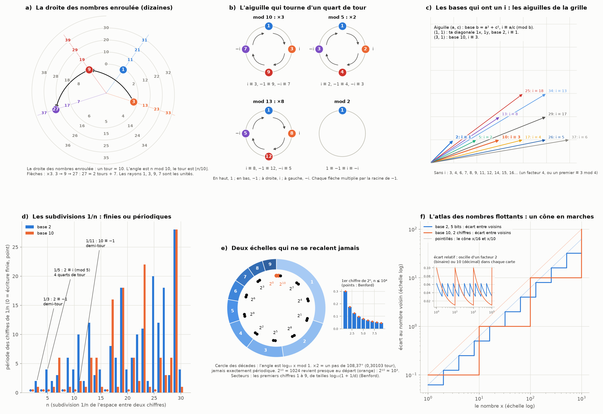
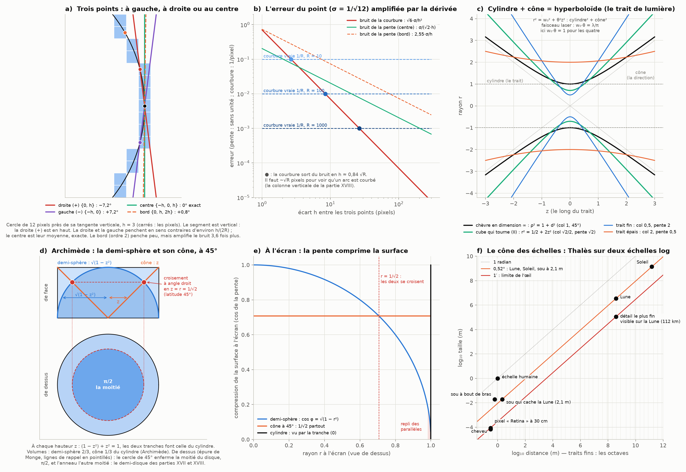

# Partie XIX : les bases 2 et 10 sont deux objets — i modulo 10, l'aiguille qui tourne, le trait, le cône et Thalès

> Ta réponse à la partie XVIII.
> - Ta phrase « la base (2 ou 10) choisit seulement la taille du grain grossier » ne tient pas. La base 2 et la base 10 sont des objets physiques différents. 1, 2, 3, 4, 5, 6 est un compte naïf ; un compte jumelé avec des données est une séquence d'épreuves qui forme un atlas.
> - Ce qu'on répertorie :
>   - la nature géométrique des subdivisions harmoniques de l'espace entre deux chiffres ;
>   - la différence entre le côté droit et le côté gauche des segments à trois points {1, 2, 3}, {0, 1, 2} et {−1, 0, 1}.
> - Il faut y incorporer :
>   - l'erreur de placement du point (une sphère en dimension n) ;
>   - l'épaisseur du trait, qui devient un cylindre ;
>   - l'inversion de la demi-sphère en son conjugué 3D, un cône inscrit dans un cylindre, qui cause les distorsions qu'on voit à l'écran.
> - Le modèle naïf des mathématiques est comme le modèle de Thomson de l'atome : plus simple, et c'est pour ça qu'on le garde pour compter.
>   - On part de l'échelle humaine.
>   - On monte ou on descend ensuite sur un cône à deux échelles logarithmiques (−zⁿ, +zⁿ).
>   - Il faut Thalès pour comparer à un objet que les humains connaissent, comme un sou.
> - Les nombres passent du linéaire (1 au début, x à la fin) au modulaire.
>   - En base 2, 1 ≡ −1, donc aussi i et −i.
>   - En base 10, 9 ≡ −1, donc 3 est i. Et 9^(3/2) = 27 ≡ 7 est −i : il arrive dans le troisième segment de 10, après deux tours complets de l'aiguille.
>   - Cette aiguille tourne autour d'un cylindre central microscopique : l'épaisseur du trait. C'est le problème de ta deuxième image (le contact apparent de la partie XVIII).
>
> Suite de la [partie XVIII](pixels-longitudes.md).

Tout est recalculé par [`scripts/bases_objets.py`](scripts/bases_objets.py) (≈ 10 s). Les tableaux complets sont dans [`resultats/bases_objets.md`](resultats/bases_objets.md).

## En bref

- **Tu as raison, et je corrige ma phrase.**
  - La valeur d'un nombre ne dépend pas de la base. Mais la grille qui découpe l'espace entre les nombres, elle, en dépend : quelles fractions tombent juste, quelle horloge tourne sur les derniers chiffres, s'il existe un i. La base 2 et la base 10 sont bien deux objets.
  - Ce qui reste vrai : je ne connais aucune loi des chiffres de la corde de la chèvre propre au binaire ou au décimal.
- **Ton i modulo 10 est exact.**
  - 3² = 9 ≡ −1, donc 3 ≡ i. Puis 3³ = 27 ≡ 7 ≡ −i et 3⁴ = 81 ≡ 1.
  - Les quatre chiffres 1, 3, 9, 7 sont les quatre quarts de tour de l'aiguille. Et 27 est bien sur le troisième tour de l'hélice des dizaines.
- **Une base a un i exactement quand elle est le carré de la longueur d'une aiguille « propre » de la grille**, une aiguille qui ne touche aucun autre point de la grille entre ses deux bouts.
  - b = a² + c², avec a et c premiers entre eux. Alors i ≡ a/c (mod b) : la pente de l'aiguille.
  - 10 = 3² + 1² : l'aiguille (3, 1), i ≡ 3. Plier la grille sur le carré construit sur cette aiguille laisse 10 cases, et tourner d'un quart de tour, c'est multiplier par 3 modulo 10 (ou par 7 dans l'autre sens).
  - 2 = 1² + 1² : ta diagonale 1x, 1y. Là, i ≡ −i ≡ 1 ≡ −1 : l'aiguille ne tourne pas.
- **Les subdivisions harmoniques 1/n sont finies ou périodiques selon la base.**
  - 1/5 = 0,2 en décimal, mais 0,0011 0011… en binaire. La période est 4 parce que 2 ≡ i (mod 5) : quatre quarts de tour.
  - C'est pour ça qu'un ordinateur trouve 0,1 + 0,2 = 0,30000000000000004.
- **Les deux échelles ne se recalent jamais**, parce que log₁₀ 2 est irrationnel.
  - C'est ce qui donne la loi de Benford des premiers chiffres des puissances de 2.
  - Elles se recalent presque en 2¹⁰ ≈ 10³ : d'où les « 3 dB », et les préfixes kilo et kibi qui ne tombent pas d'accord (le disque « 1 To » qui s'affiche 931 Go).
  - Furstenberg l'a rendu rigoureux : × 2 et × 10 sont deux dynamiques indépendantes sur le cercle.
- **Gauche, droite, centre.**
  - Avec deux points, l'erreur à gauche et à droite est opposée ; le centre en est la moyenne, et elle s'y annule.
  - Pour tes trois segments {−1, 0, 1}, {0, 1, 2} et {1, 2, 3} mesurés en 0, les erreurs sont dans le rapport 1 : 2 : 11 et le bruit dans le rapport 1 : √13 : 7.
- **Le point, le trait, le cône.**
  - En dimension n, l'erreur d'un point arrondi vit sur une sphère mince de rayon √(n/12) : c'est ta n-sphère.
  - Le trait est un cylindre, sa direction un cône ; ensemble, ils font un hyperboloïde. C'est exactement ce que balaie une aiguille qui tourne autour d'un axe sans le toucher.
  - Le faisceau laser gaussien a cette forme (w₀·θ = λ/π). Le cube qui tourne (partie II) et la chèvre de dimension infinie (partie XVI) aussi, avec w₀·θ = 1.
  - C'est le même procédé : un cône dont le sommet est déplacé dans l'imaginaire. Pour la chèvre, ρ = |d + i|.
- **Archimède.**
  - Demi-sphère + cône = cylindre, tranche par tranche.
  - Les deux surfaces se croisent à angle droit sur le cercle de rayon 1/√2, qui enferme la moitié du disque.
  - Le cône se déroule à plat, la demi-sphère non (Gauss) : c'est la source exacte d'une partie des distorsions à l'écran.
- **Les deux couches.**
  - Les bases du cercle et de l'heure (12, 24, 60, 360) sont faites surtout de 2 et de 3 (60 et 360 y ajoutent un 5), et aucune n'a de i.
  - En base 12 et 24, chaque nombre premier avec la base est son propre inverse : l'horloge n'a que des reflets.
  - La base 10 porte le quart de tour, et log₁₀ transforme les produits en pentes de pixels.
- **Thalès.** Un sou cache la Lune à 2,11 m. Une minute d'arc, c'est 87 µm à 30 cm (un pixel) et 112 km sur la Lune.
- **Thomson.** D'accord sur l'idée : un modèle simple qu'on garde parce qu'il suffit. Une nuance : Thomson a été réfuté, et Bohr serait un meilleur parallèle.

---

## 1. Ce que je corrige

**Ma phrase mélangeait deux choses.**
- **Le nombre lui-même.** Le point 0,1 est le même point, qu'on l'écrive 0,1 en décimal ou 0,000110011… en binaire. Sa valeur ne dépend pas de la base.
- **La grille qui sert à l'écrire.** Elle dépend complètement de la base, et c'est elle que tu appelles l'objet. On le voit dans toute la suite :
  - les fractions qui tombent juste (§ 3) ;
  - l'horloge des derniers chiffres et l'existence d'un i (§ 2) ;
  - la façon dont les deux échelles logarithmiques s'entrelacent (§ 4) ;
  - la régularité des nombres flottants d'un ordinateur (§ 4).

**Le compte naïf et l'atlas.** Ton image se formalise bien.
- Écrire un chiffre de plus, c'est passer une épreuve : dans laquelle des b cases plus petites le nombre est-il ? Le nombre est la suite emboîtée de ces cases. C'est exactement l'encadrement certain des parties XVII et XVIII (un chiffre décimal ou un bit par niveau).
- Les nombres flottants d'un ordinateur sont un atlas au sens géométrique. Chaque exposant est une carte (une décade, ou une « binade » de 1 à 2), et chaque carte est découpée en un nombre fixe de pas (panneau f).

**Ce qui reste vrai.**
- Je n'ai trouvé aucune loi des chiffres de la corde de la chèvre propre à la base 2 ou à la base 10.
- C'est ce qu'on attend d'un nombre « quelconque ». Borel a montré en 1909 que presque tout nombre réel est normal dans toutes les bases : ses chiffres y sont aussi bien mélangés que des tirages au hasard.
- Mais personne ne sait le démontrer pour un nombre donné comme √2 ou π, et a fortiori pour la corde. Je ne peux donc rien affirmer de plus.

## 2. i modulo 10 : ton calcul, et pourquoi il marche

**Ton calcul est juste, mot pour mot** (panneaux a et b).
- 9 ≡ −1 (mod 10), et 3² = 9 : donc 3 est une racine carrée de −1, un i.
- 3³ = 27 ≡ 7, et 7 = −3 (mod 10) : donc 7 ≡ −i. Puis 3⁴ = 81 ≡ 1, et on recommence.
- Les derniers chiffres des puissances de 3 tournent sans fin : 3, 9, 27, 81, 243, 729, 2187, 6561… finissent par 3, 9, 7, 1, 3, 9, 7, 1.
- Les chiffres premiers avec 10 sont exactement {1, 3, 7, 9}, et multiplier par 3 les parcourt comme 1 → i → −1 → −i → 1.

**Le choix de i est une convention.**
- 7 est l'autre racine : 7² = 49 ≡ −1. Les nombres 3 et 7 sont conjugués, comme i et −i dans les complexes, et choisir lequel s'appelle i est une convention.
- Ton 9^(3/2) = 27 marche dans les deux cas : 3³ = 27 ≡ 7 = −3, et 7³ = 343 ≡ 3 = −7. Le cube de i donne toujours −i.

**Deux horloges à la fois.**
- **L'horloge additive** (panneau a) est la droite des nombres enroulée en hélice, dix par tour. 27 = 2 × 10 + 7 est sur le troisième tour, après deux révolutions complètes : c'est ta description.
- **L'horloge multiplicative** (panneau b) est l'aiguille qui tourne d'un quart de tour à chaque multiplication par 3. 27 = 3³ est à trois quarts de tour, en −i.
- Les deux lisent le même 27 : le chiffre des dizaines compte les tours, et le chiffre des unités donne la position de l'aiguille.

**La base 2.** 1 ≡ −1 (mod 2), et 1² = 1 ≡ −1 : donc i ≡ −i ≡ 1 ≡ −1. Il n'y a que deux restes, pas de place pour un quart de tour : l'aiguille ne tourne pas.

**Le théorème derrière** (panneau c).
- L'équation x² ≡ −1 (mod b) a une solution exactement quand b est une somme de deux carrés premiers entre eux, b = a² + c². « Premiers entre eux » veut dire que l'aiguille (a, c) ne touche aucun autre point de la grille entre ses deux bouts. De façon équivalente : b n'est pas divisible par 4 et n'a aucun facteur premier de la forme 4k + 3 ([OEIS A008784](https://oeis.org/A008784)).
- Dans ce cas, a² + c² ≡ 0 donne (a/c)² ≡ −1 : **i ≡ a/c (mod b)**, la pente de l'aiguille (a, c) de la grille de la partie XIV. Son inverse c/a donne −i.

| base | aiguille (a, c) | i ≡ a/c | vérification |
|---:|---|---:|---|
| 2 | (1, 1) : ta diagonale 1x, 1y | 1 | 1² = 1 ≡ −1 |
| 5 | (2, 1) | 2 | 2² = 4 ≡ −1 |
| 10 | (3, 1) | 3 | 3² = 9 ≡ −1 |
| 13 | (3, 2) | 8 | 8² = 64 ≡ −1 |
| 25 | (4, 3) | 18 | 18² = 324 ≡ −1 |

- Les bases sans i jusqu'à 40 : 3, 4, 6, 7, 8, 9, 11, 12, 14, 15, 16… Le théorème est vérifié par le script pour toutes les bases de 2 à 40.

**Pourquoi c'est géométrique : la grille pliée.**
- Prends les points de la grille et plie-les modulo l'aiguille (3, −1) et sa perpendiculaire (1, 3). Il reste exactement 10 classes : l'aire du carré construit sur l'aiguille, 3² + 1² = 10.
- Numérote la classe du point (x, y) par x + 3y (mod 10). Tourner le point d'un quart de tour donne (−y, x), numéroté −y + 3x. Or 3 × (x + 3y) = 3x + 9y ≡ 3x − y (mod 10).
- **Tourner la grille d'un quart de tour, c'est multiplier par 3 modulo 10.** Ton « 3 est i » est littéralement la rotation de 90° de la grille, repliée sur le carré de côté √10.
- Dans l'autre sens, ou avec l'aiguille miroir (3, 1), le quart de tour devient × 7 = × (−3), c'est-à-dire −i. Les deux sens de rotation sont les deux racines conjuguées.
- C'est un cas de l'isomorphisme classique entre les entiers de Gauss modulo a + ci et les entiers modulo a² + c², quand a et c sont premiers entre eux ([entiers de Gauss](https://en.wikipedia.org/wiki/Gaussian_integer)).
- En base 2, le carré construit sur la diagonale 1x, 1y a une aire de 2 : deux cases seulement, et le quart de tour les laisse en place.

**La base 10 = 2 × 5.** Par les restes chinois, le dernier chiffre décimal porte deux informations : sa parité (son reste mod 2) et son reste mod 5.
- Le i de la base 10 se lit donc en deux morceaux : 3 = (1 mod 2, 3 mod 5).
- Côté binaire, c'est le i trivial de la base 2 (1 ≡ −1). Côté base 5, c'est un vrai quart de tour (3² = 9 ≡ −1 mod 5).
- Le quart de tour de la base 10 vient entièrement de son facteur 5.

## 3. Les subdivisions harmoniques entre deux chiffres

**La règle.** On découpe l'espace entre deux chiffres en n parts : 1/n.
- 1/n s'écrit avec un nombre fini de chiffres en base b quand tous les facteurs premiers de n divisent b.
- Sinon, l'écriture est périodique. La période est le nombre de pas de l'aiguille « × b » sur le cercle des restes modulo n avant qu'elle revienne à son départ.
- En base 10 = 2 × 5, 1/2, 1/4, 1/5, 1/8, 1/10, 1/16, 1/20, 1/25… tombent juste. En base 2, seulement les puissances de 2.

| n | période en base 2 | période en base 10 | l'aiguille |
|---:|---|---|---|
| 3 | 2 | 1 | 2 ≡ −1 (mod 3) : un demi-tour |
| 5 | 4 | finie | 2 ≡ i (mod 5) : quatre quarts de tour |
| 7 | 3 | 6 | |
| 9 | 6 | 1 | |
| 11 | 10 | 2 | 10 ≡ −1 (mod 11) : un demi-tour |
| 13 | 12 | 6 | |
| 17 | 8 | 16 | |
| 101 | 100 | 4 | 10 ≡ i (mod 101), car 101 = 10² + 1 |

(Panneau d : les barres de 2 à 30.)

**Ce que ça veut dire.**
- 1/101 = 0,(0099) a une période de 4 parce que 101 = 10² + 1 : l'aiguille (10, 1) fait de 10 un i modulo 101. C'est le même mécanisme que ton 3 ≡ i modulo 10.
- 1/5 n'a pas d'écriture finie en binaire. Donc 1/10 non plus, et 0,1, 0,2 et 0,3 sont tous arrondis dans un ordinateur. L'addition 0,1 + 0,2 donne 0,30000000000000004, alors que 0,1 + 0,2 = 0,3 est exact en décimal.

**L'épaisseur des frontières.**
- Un nombre à écriture finie est sur une frontière entre deux cases, et il a deux écritures : 0,4999… = 0,5 en décimal, 0,0111…₂ = 0,1₂ (= 1/2) en binaire. Ce point appartient aux deux cases voisines, comme la colonne de pixels partagée par deux disques (partie XVIII).
- Les frontières de la base 2 et celles de la base 10 ne sont pas les mêmes. 0,1 est une frontière en décimal et un point intérieur (périodique) en binaire. C'est une différence physique entre les deux grilles, pas une question d'écriture.

## 4. Deux échelles qui ne se recalent jamais

**log₁₀ 2 est irrationnel.** Si log₁₀ 2 valait p/q, on aurait 2^q = 10^p = 2^p·5^p, impossible puisque 5^p ne divise aucune puissance de 2.
- Sur le cercle des décades (l'angle est log₁₀ x mod 1), multiplier par 2 fait tourner l'aiguille de 0,30103 tour, soit 108,37° (panneau e).
- Elle ne retombe jamais exactement au même endroit.

**Les quasi-retours.** Les réduites de la fraction continue log₁₀ 2 = [0 ; 3, 3, 9, 2, 2, 4, 6, 2, 1, 1, …] donnent les meilleurs presque-retours :

| p/q | 2^q / 10^p | écart |
|---|---|---|
| 3/10 | 1,024000 | +2,4 % |
| 28/93 | 0,990352 | −0,97 % |
| 59/196 | 1,004336 | +0,43 % |
| 146/485 | 0,998960 | −0,10 % |
| 643/2136 | 1,000163 | +0,016 % |
| 4004/13301 | 0,999936 | −0,006 % |

**Le quasi-retour 2¹⁰ ≈ 10³ dans la vie de tous les jours.**
- **Les décibels.** Doubler une puissance ajoute 10·log₁₀ 2 = 3,0103 dB. On dit « 3 dB » parce que 2¹⁰ ≈ 10³.
- **Les octets.** Le kilo vaut 10³, le kibi 2¹⁰, et l'écart se cumule à chaque palier : +2,4 % au kilo, +7,4 % au giga, +9,95 % au téra.
  - Un disque vendu « 1 To » (10¹² octets, compté en base 10) contient 931,3 Gio.
  - C'est le « 931 Go » qu'affiche un système qui compte en base 2 en gardant les noms décimaux. Les deux bases mesurent le même disque et ne tombent pas d'accord.

**La loi de Benford** (panneau e, encart).
- Le premier chiffre de 2ⁿ est d quand l'aiguille tombe dans le secteur [log₁₀ d, log₁₀(d + 1)[, de taille log₁₀(1 + 1/d).
- Comme la rotation est irrationnelle, l'aiguille remplit le cercle uniformément (Weyl), et les fréquences tendent vers la loi de Benford.

| d | 1 | 2 | 3 | 4 | 5 | 6 | 7 | 8 | 9 |
|---|---|---|---|---|---|---|---|---|---|
| 2ⁿ, n ≤ 10 000 | 0,3010 | 0,1761 | 0,1249 | 0,0970 | 0,0791 | 0,0670 | 0,0579 | 0,0512 | 0,0458 |
| Benford | 0,3010 | 0,1761 | 0,1249 | 0,0969 | 0,0792 | 0,0669 | 0,0580 | 0,0512 | 0,0458 |

- En base 2, la loi est vide : le premier chiffre d'un nombre non nul est toujours 1.
- Les trous entre les points n·log₁₀ 2 obéissent au théorème des trois distances (partie XI) : 2 ou 3 longueurs seulement, et 2 aux dénominateurs des réduites (10 et 93 points).

**Furstenberg : deux dynamiques indépendantes.**
- Sur le cercle [0, 1[, « × 2 » décale l'écriture binaire d'un chiffre et « × 10 » l'écriture décimale.
- Furstenberg a démontré en 1967 qu'un ensemble fermé stable à la fois par × 2 et par × 10 est soit fini (des rationnels), soit le cercle entier.
- Une structure simple en base 2 ne peut donc pas l'être aussi en base 10, à moins d'être finie ou de tout remplir. Exemple : les nombres dont l'écriture binaire n'a jamais deux 1 de suite.
- C'est la version rigoureuse de ta phrase : la base 2 et la base 10 sont deux objets. (La version pour les mesures, la conjecture « × 2, × 3 », est encore ouverte.)

**L'atlas des flottants** (panneau f).
- L'écart entre deux nombres flottants voisins grandit avec le nombre : en échelle log-log, c'est un cône en marches.
- Dans chaque carte, l'écart relatif oscille d'un facteur égal à la base : 2 en binaire, 10 en décimal. Goldberg appelle ça le *wobble*.
- La petite oscillation du binaire est une des raisons pour lesquelles les ordinateurs calculent en base 2 : la précision relative y est plus régulière.

## 5. Trois points : à gauche, à droite ou au centre

**Tes trois segments.** On mesure la pente en 0 avec des points espacés de h (panneau a). Tes segments {−1, 0, 1}, {0, 1, 2} et {1, 2, 3} mettent 0 au centre, au bord, ou dehors. Chacun donne une formule : la dérivée en 0 du polynôme qui passe par les trois points.

| points (en h) | où est 0 | poids | erreur de troncature | bruit (× σ/h) |
|---|---|---|---|---|
| {−1, 0} | points à gauche | −1, 1 | −h·f″/2 | 1,414 |
| {0, 1} | points à droite | −1, 1 | +h·f″/2 | 1,414 |
| {−1, 0, 1} | au centre | −1/2, 0, 1/2 | +h²·f‴/6 | 0,707 |
| {0, 1, 2} | au bord | −3/2, 2, −1/2 | −h²·f‴/3 | 2,550 |
| {1, 2, 3} | dehors | −5/2, 4, −3/2 | −11h²·f‴/6 | 4,950 |

**La gauche et la droite.**
- Avec deux points, les erreurs à gauche et à droite sont exactement opposées : ±h·f″/2. C'est, je crois, la différence entre les deux côtés dont tu parlais.
- Le pochoir centré est la moyenne des deux, et l'erreur s'y annule : il ne reste que h²·f‴/6, beaucoup plus petit.
- Pour tes trois segments de trois points, les erreurs sont dans le rapport 1 : 2 : 11 et le bruit dans le rapport 1 : √13 : 7. Le centre gagne sur les deux tableaux.

**Sur le cercle de pixels,** près de sa tangente verticale (la vraie pente est 0), la tangente mesurée penche de (en degrés) :

| R | h | droite {0, h} | gauche {−h, 0} | centre | bord {0, h, 2h} | dehors {h, 2h, 3h} |
|---:|---:|---|---|---|---|---|
| 10 | 1 | −2,87 | +2,87 | 0 (exact) | +0,04 | +0,46 |
| 12 | 3 | −7,24 | +7,24 | 0 (exact) | +0,80 | +11,60 |
| 50 | 3 | −1,72 | +1,72 | 0 (exact) | +0,009 | +0,10 |

- La droite et la gauche penchent d'environ h/(2R) radian, en sens contraires. Le centre est exact par symétrie : c'est pour ça que trois points centrés tracent la tangente verticale de la partie XVIII.

**La figure en nombres exacts** (R = 12, h = 3 ; c'est ta lecture du panneau a).
- La colonne de la tangente compte 7 pixels : 4 en haut et 4 en bas, le pixel du centre compté dans les deux. Elle s'arrête à |y| = √(R − 1/4) = 3,43, juste sous √12.
- Le point du centre est au centre de sa case. Les points en ±3 sont en x = √135 = 11,619 : à −0,381 du centre de leur case, donc à 0,119 de sa face gauche (la face est à −1/2).
- √12 y apparaît deux fois. C'est la demi-longueur de la colonne (√R pour R = 12) et l'inverse du bruit d'un point arrondi (σ = 1/√12) : pour R = 12, √R·σ = 1 exactement.
- Le seuil du bruit, 0,84·√R = 2,91, tombe juste sous h = 3 : les deux points sont les derniers de la colonne, au bord de ce qu'on peut mesurer.

**L'erreur du point** (panneau b).
- Un pixel arrondit la position du point. Si on traite cette erreur comme un bruit uniforme, son écart-type vaut σ = 1/√12 = 0,289 pixel.
- La courbure mesurée sur trois points a alors un bruit √6·σ/h². Elle ne sort du bruit que pour h > 0,84·√R : il faut environ √R pixels de chaque côté pour voir qu'un arc est courbé.

| R | écart minimal h | √R |
|---:|---|---|
| 10 | 2,66 | 3,16 |
| 100 | 8,41 | 10,00 |
| 1000 | 26,59 | 31,62 |

- **Prudence : ce modèle suppose des erreurs indépendantes.** Près de la tangente, elles ne le sont pas. Le calcul exact de la partie XVIII le dit plus nettement : sur ±√R pixels, la colonne est parfaitement droite, et aucun pochoir ne peut y voir la courbure. Les deux approches donnent la même loi en √R.

## 6. Le point, le trait, le cône

**Le point : ta sphère en dimension n.**
- Arrondir un point à la grille, c'est le ramener au centre de sa case. L'erreur est uniforme dans le cube [−1/2, 1/2]^n, et sa longueur moyenne quadratique vaut √(n/12).
- En grande dimension, cette longueur se concentre autour de √(n/12), et la boule inscrite (rayon 1/2) ne contient presque plus rien.
- L'erreur vit alors sur une sphère mince, dans les coins du cube. C'est comme ça que je lis ta « n-sphère ».

| n | √(n/12) | part du cube dans la boule inscrite | dispersion relative de la longueur |
|---:|---|---|---|
| 1 | 0,289 | 1 | 0,58 |
| 2 | 0,408 | 0,785 (π/4) | 0,37 |
| 3 | 0,500 | 0,524 (π/6) | 0,29 |
| 10 | 0,913 | 0,0025 | 0,15 |
| 100 | 2,887 | 1,9 × 10⁻⁷⁰ | 0,045 |

- En dimension 3, l'erreur moyenne quadratique vaut exactement un demi-voxel.

**Le trait : cylindre + cône = hyperboloïde** (panneau c).
- Un point d'incertitude w₀ qu'on étire en trait donne un cylindre de rayon w₀. Une direction d'incertitude θ donne un cône.
- Ensemble, ils donnent r² = w₀² + θ²z² : un hyperboloïde, dont le col est le cylindre et dont l'asymptote est le cône.
- **C'est ton aiguille qui tourne autour d'un cylindre central.** Une droite qui tourne autour d'un axe balaie :
  - un cylindre si elle lui est parallèle ;
  - un cône si elle le coupe ;
  - un hyperboloïde si elle passe à côté sans le toucher ([hyperboloïde](https://en.wikipedia.org/wiki/Hyperboloid)).
- Le col de l'hyperboloïde est la distance entre l'aiguille et l'axe : ton « cylindre central microscopique », l'épaisseur du trait.

**Trois hyperboloïdes de même forme.**
- **Le cube qui tourne** (partie II) autour de sa grande diagonale. Ses six arêtes obliques passent à 1/√2 de l'axe, avec une pente √2 : r² = 1/2 + 2z².
- **La chèvre de dimension infinie** (partie XVI) : ρ² = 1 + d², un col de 1 et une pente de 1. C'est une droite à 45° qui passe à distance 1 de l'axe. En d = 1, elle donne ρ = √2 : la diagonale 1x, 1y.
- **Le faisceau laser gaussien.** La lumière impose w₀·θ = λ/π : plus le trait est fin, plus le cône s'ouvre. C'est la diffraction. En lumière verte (λ = 550 nm) :
  - w₀ = 1 mm : θ = 0,175 mrad, et le trait reste fin sur z_R = 5,71 m ;
  - w₀ = 85 µm (un trait de 0,17 mm, environ deux pixels « Retina ») : θ = 2,06 mrad, z_R = 41 mm ;
  - w₀ = 5 µm : θ = 35 mrad, z_R = 0,14 mm.
- Le cube et la chèvre ont le même produit col × pente : (1/√2)·√2 = 1·1 = 1. Ce sont deux faisceaux de même « longueur d'onde » λ = π (en unités du rayon), l'un plus serré que l'autre.

**Le même procédé : un cône dont le sommet est déplacé dans l'imaginaire.**
- r² = w₀² + θ²z² s'écrit r = θ·|z + i·z_R|, avec z_R = w₀/θ : c'est le cône r = θ·|z| dont on a poussé le sommet d'une distance z_R dans la direction imaginaire.
- Pour le faisceau laser, c'est la construction de Deschamps (1971) : un faisceau gaussien est l'onde d'une source ponctuelle placée en un point complexe.

| hyperboloïde | col w₀ | pente θ | z_R = w₀/θ | forme |
|---|---|---|---|---|
| chèvre de dimension infinie | 1 | 1 | 1 | ρ = \|d + i\| |
| cube qui tourne | 1/√2 | √2 | 1/2 | r = √2·\|z + i/2\| |
| faisceau laser | w₀ | λ/(πw₀) | πw₀²/λ | source en z = −i·z_R |

- **Ce que ça transporte.** À la distance z_R, un faisceau est √2 fois plus large qu'à son col, et sa phase de Gouy vaut 45°. Pour la chèvre, z_R = 1 : c'est exactement le piquet sur la clôture (d = 1), où ρ = |1 + i| = √2, la diagonale 1x, 1y.
- La chèvre classique est donc à la distance de Rayleigh de son propre faisceau. C'est une identité de structure : le même calcul, pas seulement la même allure.

**Le lien avec ta deuxième image.**
- Près de son col, l'hyperboloïde s'écarte du cylindre comme θ²z²/(2w₀) : un écart quadratique. Deux cercles tangents s'écartent de la même façon, comme κs²/2.
- Toute zone où un écart quadratique reste caché sous une épaisseur suit donc une loi en racine carrée. On en a rencontré trois :
  - le contact apparent de ta deuxième image, de demi-longueur √(2w/κ) (partie XVIII) ;
  - la colonne droite de pixels à la tangente, ±√R (partie XVIII) ;
  - le trait de lumière le plus fin qui reste fin sur une longueur L (sans s'élargir de plus de √2), de rayon √(λL/(2π)). Sur 1 m en lumière verte, il fait environ 0,3 mm.
- C'est le même mécanisme : l'épaisseur du trait cache le début de la courbure.

**Archimède : la demi-sphère et son cône conjugué** (panneau d).
- Dans le cylindre de rayon 1 et de hauteur 1, à la hauteur z, la demi-sphère a pour rayon √(1 − z²) et le cône (sommet au centre) a pour rayon z. Comme (1 − z²) + z² = 1, les deux tranches font ensemble celle du cylindre : 2/3 + 1/3 du volume.
- Les deux surfaces se croisent sur le cercle z = r = 1/√2, à la latitude 45°. Elles s'y croisent **à angle droit**, parce que chaque génératrice du cône est un rayon de la sphère.
- Vu de dessus, ce cercle enferme exactement la moitié du disque (π/2). C'est le demi-disque des parties XVII et XVIII, et le plateau de la chèvre en dimension 2 (partie XVI).

**Les distorsions à l'écran** (panneau e).
- Un écran est une projection vue de dessus. Une surface de pente φ y est comprimée d'un facteur cos φ.
  - Le cône est comprimé uniformément, de 1/√2.
  - La demi-sphère est comprimée de √(1 − r²), qui tend vers 0 au bord : les parallèles du globe s'y serrent et s'y replient (partie XVIII).
  - Le cylindre est vu par la tranche et disparaît.
- **Ce qui est exact.** Le cône et le cylindre se déroulent à plat sans aucune déformation : leur courbure de Gauss est nulle. La demi-sphère ne le peut pas (theorema egregium de Gauss). Aucune carte plate d'une sphère ne garde à la fois les angles et les aires.
- **Le cylindre garde les aires.** Projeter la sphère horizontalement sur le cylindre conserve les aires (la boîte à chapeau d'Archimède, la projection de Lambert), mais déforme les formes. Projeter verticalement sur l'écran comprime par cos φ.
- Le cône conjugué est donc bien la version « plate » de la demi-sphère, et c'est la courbure de la sphère qui oblige l'écran à déformer.

## 7. Le cône des échelles : Thalès et le sou

**Thalès** (panneau f). Un objet de taille L à la distance D se voit sous l'angle L/D. Deux objets dans le même rapport L/D se cachent exactement l'un l'autre.
- La Lune : 3474,8 km à 384 400 km, soit 0,518°, un rapport D/L de 110,6. Le Soleil a presque le même angle (0,53°), d'où les éclipses totales tout juste possibles.
- **Un sou** (la pièce d'un cent, 19,05 mm) cache exactement la Lune à 2,11 m de l'œil. À bout de bras (≈ 65 cm), il en cache plus de trois.
- **Une minute d'arc**, la limite de l'œil, c'est 87 µm à 30 cm : la taille d'un pixel « Retina ». Sur la Lune, c'est 112 km : à peu près le plus petit détail qu'on y distingue à l'œil nu.

**Les deux échelles logarithmiques.**
- En coordonnées log-log (log distance, log taille), chaque cône de Thalès (un angle fixé) devient une droite de pente 1.
- L'échelle humaine (1 m à 1 m) est l'origine. Le microscopique (−zⁿ) et le macroscopique (+zⁿ) s'étendent de part et d'autre, comme tu le décrivais.
- Sur le même axe, les octaves (× 2) et les décades (× 10) ne se recalent jamais : une décade vaut log₂ 10 = 3,32 octaves. On retrouve le § 4 : les graduations ne tombent presque ensemble qu'à 2¹⁰ ≈ 10³.

## 8. Thomson et le compte naïf

**D'accord sur l'idée.**
- Un modèle simple qu'on garde parce qu'il suffit : 1, 2, 3… est exact pour compter des objets séparés (des chèvres, des pixels).
- C'est pour mesurer (le continu) qu'il faut l'atlas. Chaque chiffre est une épreuve, et le nombre est la suite emboîtée des cases (§ 1).

**Une nuance sur Thomson.**
- Le modèle du « plum-pudding » de Thomson (1904) a été réfuté par l'expérience de Geiger et Marsden (1909), et Rutherford l'a remplacé par le noyau (1911). On ne l'utilise plus que pour raconter l'histoire.
- Le modèle de Bohr (1913) serait un meilleur parallèle. Son image est fausse (des orbites), mais ses nombres sont justes pour l'hydrogène (les niveaux en −13,6 eV/n²), et on l'enseigne toujours parce qu'il suffit.
- C'est exactement le statut des décimales naïves : les bonnes valeurs, avec une image sans grain et sans atlas.

## 9. Les deux couches : 2 et 3 (12, 24, 60, 360), puis 10

**Ce que tu décris.** Une première couche, géométrique, faite des bases 2 et 3, qui se rejoignent en 12 (puis en 24, et en 60 et 360 avec un 5 en plus). Une deuxième couche, conceptuelle, où la base 10 linéarise tout par log₁₀. Les calculs vont dans ton sens (détails au § 6 de [`resultats/bases_objets.md`](resultats/bases_objets.md)).

| base | facteurs | racine de −1 (un i) | horloge des nombres premiers avec la base |
|---:|---|---|---|
| 10 | 2 × 5 | 3 et 7 | un vrai tour en quatre quarts : 1, 3, 9, 7 |
| 12 | 2² × 3 | aucune | que des reflets : 5² ≡ 7² ≡ 11² ≡ 1 |
| 24 | 2³ × 3 | aucune | que des reflets |
| 60 | 2² × 3 × 5 | aucune | des quarts de tour, mais aucun ne donne −1 |
| 360 | 2³ × 3² × 5 | aucune | jusqu'à 12 pas, sans i |

- **Les bases du cercle et de l'heure n'ont pas de i.** Elles sont divisibles par 4, donc −1 n'y a pas de racine carrée. Elles sont faites pour couper en 2, 3, 4, 6 : la géométrie qu'on voit.
- **12 et 24 sont des horloges de reflets.** Tout nombre premier avec la base y est son propre inverse (x² ≡ 1). Les seules bases qui ont cette propriété sont les diviseurs de 24 : 2, 3, 4, 6, 8, 12, 24.
- **La base 10 porte le quart de tour.** Son horloge 1 → 3 → 9 → 7 est exactement celle de i : la rotation que les nombres complexes rendent algébrique.

**Les retenues de bⁿ.** Le dernier chiffre des puissances, en base 10 et en base 12 :
- 0 et 1 restent statiques dans toute base, comme tu le dis. Le dernier chiffre a aussi deux autres points fixes : 5 et 6 en base 10, 4 et 9 en base 12. Ce sont les « interrupteurs » des deux couches : 5 ≡ (1 mod 2, 0 mod 5) et 6 ≡ (0 mod 2, 1 mod 5).
- En base 10, 2, 3, 7 et 8 tournent par quarts de tour (2, 4, 8, 6…), 4 et 9 par demi-tours.
- En base 12, rien ne tourne plus vite qu'un demi-tour.

**L'escalier des chiffres.**
- En base 10, bⁿ s'écrit avec ⌊n·log₁₀ b⌋ + 1 chiffres. Le bord droit d'une table des puissances est donc une droite tracée en pixels, de pente log₁₀ b.
- Pour 2ⁿ, les marches font 3, 3, 4, 3, 3, 4… : 3 chiffres tous les 10 rangs, parce que 2¹⁰ ≈ 10³. Le petit écart de 2,4 % finit par décaler le motif (la réduite suivante, 28/93).
- C'est la même mécanique que la droite en pixels de la partie XVIII.
- Et 12 = 2² × 3 donne log₁₀ 12 = 2·log₁₀ 2 + log₁₀ 3 : la base 10 transforme les produits de la première couche en sommes de pentes.

**Une nuance historique.** Ces bases ont souvent coexisté plutôt que de se succéder. L'Égypte comptait déjà en base 10 quand la Mésopotamie calculait en base 60. Ce qui change d'une époque à l'autre, c'est la base qui sert de standard, selon le besoin d'organisation : le ciel et les angles (60, 360), les heures et le commerce (12, 24), l'écriture des calculs (10).

## 10. Le tri

**Exact (démontré ici ou classique) :**
- i ≡ 3 et −i ≡ 7 modulo 10, l'horloge 1, 3, 9, 7, et le fait que 9^(3/2) = 27 donne −i pour les deux choix de i ;
- le théorème « b a un i ⇔ b = a² + c² premiers entre eux », avec i ≡ a/c ;
- la grille pliée sur le carré de l'aiguille (3, 1), où un quart de tour est × 3 modulo 10 (× 7 dans l'autre sens) ;
- les périodes des 1/n (l'ordre de b modulo n) ;
- l'irrationalité de log₁₀ 2, ses réduites, la limite de Benford, les trois distances et le théorème de Furstenberg ;
- les poids, erreurs et bruits des pochoirs à deux et trois points ;
- la longueur √(n/12) de l'erreur d'arrondi et sa concentration ;
- l'hyperboloïde balayé par une droite, le faisceau gaussien w₀·θ = λ/π, et le cône à sommet imaginaire r = θ·|z + i·z_R| ;
- les bases sans i (12, 24, 60, 360), les horloges de reflets (les diviseurs de 24), les points fixes et les cycles du dernier chiffre de bⁿ, et l'escalier ⌊n·log₁₀ b⌋ + 1 ;
- les tranches d'Archimède et le croisement à angle droit ;
- le theorema egregium et les nombres de Thalès.

**Calculé :** les tableaux des périodes, de Benford, des pentes sur le cercle de pixels, et les dispersions (par tirage au hasard, graine fixée).

**Mes lectures (corrige-moi si je t'ai mal compris) :**
- **l'atlas** : les cases emboîtées des chiffres, et les cartes des nombres flottants ;
- **ta deuxième image** : le panneau a de la figure r1 (le contact apparent créé par l'épaisseur du trait) ;
- **le cylindre central microscopique** : le col de l'hyperboloïde balayé par l'aiguille.

**Seulement en partie établi : « le cône inscrit dans le cylindre cause exactement les distorsions à l'écran ».**
- Ce qui est exact : la compression cos φ de toute projection, et l'impossibilité d'aplatir la sphère sans la déformer.
- Mais les défauts des pixels (partie XVIII) viennent d'un autre mécanisme, l'échantillonnage. Les deux s'additionnent.

**Analogie de structure (même procédé), donc un résultat :** le cube, la chèvre de dimension infinie et le faisceau laser sont le même cône à sommet imaginaire. Le cube et la chèvre y ont w₀·θ = 1 (λ = π), et la chèvre classique est à la distance de Rayleigh de son faisceau. Ce qui reste ouvert, c'est un mécanisme physique commun.

**Ta thèse sur les bases** (12 et 60 pour la géométrie qu'on voit, 10 pour l'analyse par les nombres complexes) : les faits exacts du § 9 vont dans son sens.

**Pas établi :** une loi des chiffres de la corde de la chèvre en base 2 ou 10. On ne sait même pas si elle est normale (on ne le sait pas non plus pour √2 ou π).

## Sources

**Arithmétique modulaire**
- [OEIS A008784](https://oeis.org/A008784) : les n pour lesquels −1 a une racine carrée modulo n, c'est-à-dire les sommes de deux carrés premiers entre eux.
- Wikipédia : [Gaussian integer](https://en.wikipedia.org/wiki/Gaussian_integer) (les classes de restes modulo un entier de Gauss).

**Deux échelles**
- [« Irrational rotations of the circle and Benford's law »](https://divisbyzero.com/2010/09/08/irrational-rotations-of-the-circle-and-benfords-law/) (Division by Zero, 2010).
- J. D. Cook, [« Leading digits of powers of 2 »](https://www.johndcook.com/blog/2017/06/20/leading-digits-of-powers-of-2/).
- Wikipédia : [Three-gap theorem](https://en.wikipedia.org/wiki/Three-gap_theorem) ; [Binary prefix](https://en.wikipedia.org/wiki/Binary_prefix) (kibi contre kilo) ; [Normal number](https://en.wikipedia.org/wiki/Normal_number) (Borel).
- [« Furstenberg's Times 2, Times 3 Conjecture (a Short Survey) »](https://arxiv.org/abs/2110.05989) (arXiv:2110.05989).

**Nombres flottants**
- D. Goldberg, [« What Every Computer Scientist Should Know About Floating-Point Arithmetic »](https://docs.oracle.com/cd/E19957-01/816-2464/ncg_goldberg.html), *ACM Computing Surveys* 23(1), 1991 (le *wobble*).

**Pochoirs, trait et lumière**
- Wikipédia : [Finite difference coefficient](https://en.wikipedia.org/wiki/Finite_difference_coefficient) (les poids centrés et décentrés).
- G. A. Deschamps, « Gaussian beam as a bundle of complex rays », *Electronics Letters* 7, 684–685 (1971) : la source ponctuelle complexe ([sa page](https://en.wikipedia.org/wiki/Georges_A._Deschamps)).
- Wikipédia : [Gaussian beam](https://en.wikipedia.org/wiki/Gaussian_beam) ; SPIE Optipedia, [« Gaussian beams »](https://spie.org/publications/fg12_p18-19_gaussian_beams) (le produit w₀·θ = λ/π).
- Wikipédia : [Hyperboloid](https://en.wikipedia.org/wiki/Hyperboloid) et [Skew lines](https://en.wikipedia.org/wiki/Skew_lines) (la droite qui tourne autour d'un axe sans le couper).
- Wikipédia : [Theorema Egregium](https://en.wikipedia.org/wiki/Theorema_Egregium) ; [Lambert cylindrical equal-area projection](https://en.wikipedia.org/wiki/Lambert_cylindrical_equal-area_projection) (la boîte à chapeau d'Archimède).

**Les bases 12, 24, 60 et 360**
- [« What is special about the divisors of 24? »](https://arxiv.org/abs/1104.5052) : les seules bases où x² ≡ 1 pour tout x premier avec la base ; [OEIS A018253](https://oeis.org/A018253).
- D. Jeffery (UNLV), [« Ancient Babylonian astronomers and why we have 360° in the circle »](https://www.physics.unlv.edu/~jeffery/astro/babylon/babylonian_360_degrees.html).

**Thalès et l'atome**
- National Academies, *One Universe*, [exercice 4 sur le mouvement](https://nap.nationalacademies.org/resource/oneuniverse/motion_exercise_4.html) : cacher la Lune avec un objet tenu à bout de bras pour mesurer son angle.
- Wikipédia : [Plum pudding model](https://en.wikipedia.org/wiki/Plum_pudding_model) ; [Rutherford model](https://en.wikipedia.org/wiki/Rutherford_model) ; [Bohr model](https://en.wikipedia.org/wiki/Bohr_model).

**Les parties précédentes :** [II](archimede.md) (le cube qui tourne, les tranches d'Archimède), [XI](angle-or-aiguilles.md) (les trois distances), [XIV](aiguille-grille.md) (les aiguilles de la grille), [XVI](menisque-projection.md) (la chèvre de dimension n et la diagonale 1x, 1y), [XVII](recursion-argent.md) (l'encadrement certain), [XVIII](pixels-longitudes.md) (les pixels, le contact apparent, la colonne en √R).
