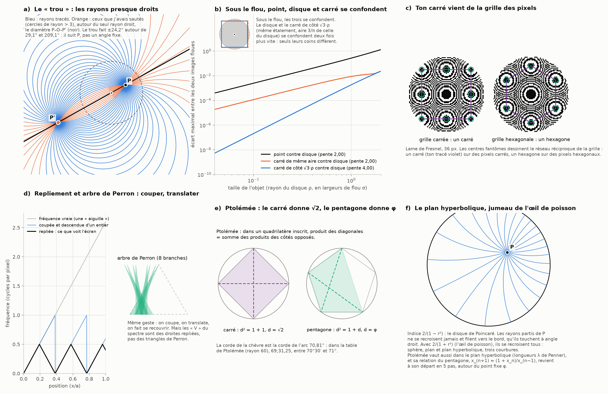

# Partie X : le trou du rayon droit, le point et le carré, Ptolémée et le plan hyperbolique

> Ce que tu proposes :
> - les « V » du spectre de la partie IX seraient des arbres de Perron qui interfèrent ;
> - ce qu'on vient d'étudier serait le phénomène qui rend un point indiscernable d'un disque rapetissé, et même d'un carré formé par les points (ton tracé violet) ;
> - cela rejoindrait l'espace hyperbolique, Ptolémée, les polygones dans un cercle et les angles ;
> - le « trou » entre 180° et 225° dans mes rayons de l'œil de poisson serait celui de la première dimension, avec l'angle d'or 137,5° et son complément 222,5°.
>
> Suite de la [partie IX](moire-fibonacci.md).

Tout est recalculé par [`scripts/carre_ptolemee.py`](scripts/carre_ptolemee.py) (≈ 5 s). Les tableaux complets sont dans [`resultats/carre_ptolemee.md`](resultats/carre_ptolemee.md).

**Suite : [Partie XI — l'angle d'or, les trous du cercle et les petites aiguilles du spectre](angle-or-aiguilles.md).**

## En bref

- **Le trou est réel, et c'est bien celui de la « première dimension ».**
  - Ce sont les rayons que j'avais sautés en traçant l'œil de poisson (partie VIII). Ils entourent le **seul rayon qui reste droit**, le diamètre qui passe par P, le centre et P′.
  - Sa largeur (±24,2°) vient de mon seuil arbitraire : j'avais sauté les cercles de rayon supérieur à 3.
  - Son centre (29,05° et 209,05°) vient de la direction du point P, choisie au hasard. Le trou suit le point.
  - 222,5° y tombe par hasard, puisque le trou couvre 184,9° à 233,2°.
  - *Précisé dans la [partie XI](angle-or-aiguilles.md) :* seule la place de 222,5° dans ce trou est un hasard. Les nombres eux-mêmes ne le sont pas : 137,5° et 222,5° valent 1/φ² et 1/φ de tour, le même partage que les deux foyers de Fibonacci.
- **Un point, un disque et un carré rapetissés se confondent, et la loi est exacte.** Sous le flou, l'écart entre leurs images décroît comme le carré de la taille.
  - Un carré de côté √3·ρ s'étale exactement comme un disque de rayon ρ, avec une aire de 3/π celle du disque. Les deux se confondent alors deux fois plus vite, en taille⁴ : seuls leurs coins diffèrent.
  - À aire égale, le carré est π/3 = 1,047 fois plus étalé que le disque.
- **Ton carré vient de la grille des pixels.** Les centres fantômes dessinent le réseau réciproque de la grille. Des pixels carrés donnent 8 centres sur un carré : c'est ton tracé, avec les 4 coins sur les diagonales et les 4 milieux de côtés aux points cardinaux. Des pixels hexagonaux donnent 6 centres sur un hexagone. C'est calculé et dessiné (panneau c).
- **Les « V » et Perron : même geste, pas même objet.**
  - Le repliement coupe la droite des fréquences en morceaux et les translate d'un entier. Perron coupe un triangle en triangles fins et les translate.
  - Mais les V sont des droites repliées, pas des arbres de Perron.
  - *Corrigé dans la [partie XI](angle-or-aiguilles.md) :* mes deux droites n'expliquaient que 71 % du spectre. Les petites aiguilles qu'on voit à travers les triangles sont les composantes suivantes du diaphragme, et l'ensemble forme bien une hiérarchie d'aiguilles repliées qui se recouvrent.
  - Le lien profond existe ailleurs, et il est démontré : **le diaphragme circulaire, vu comme filtre de Fourier, et l'aiguille de Kakeya sont liés par un théorème** (Fefferman, 1971).
- **Ptolémée.**
  - Son théorème sur les quadrilatères inscrits donne √2 pour le carré, c'est-à-dire la limite de la chèvre en dimension infinie, et φ pour le pentagone.
  - Sa table des cordes commence justement par le décagone et le pentagone : la corde de 36° y vaut 60/φ.
  - La corde de la chèvre y serait la corde de l'arc de 70,81°.
- **Le plan hyperbolique est le jumeau de l'œil de poisson.**
  - Avec l'indice 2/(1 − r²), les rayons partis d'un point ne se recroisent jamais et filent vers le bord. Avec 2/(1 + r²), ils se recroisent tous. On a donc la sphère, le plan et le plan hyperbolique : trois courbures.
  - Ptolémée vaut aussi dans le plan hyperbolique (Penner, 1987).
  - Sa relation du pentagone revient à son départ en 5 pas, autour de φ.

---

## 1. Le trou : le rayon droit, la première dimension

Dans l'œil de poisson de Maxwell (partie VIII), le rayon lancé de P avec un angle θ par rapport à la droite PP′ est un cercle de rayon

|PP′| / (2 |sin θ|).

- **Pour θ = 0, ce rayon est infini : le rayon est une droite**, le diamètre qui passe par P, par le centre O et par P′. C'est le seul rayon droit.
- Sur la sphère dont l'œil de poisson est la projection, c'est le grand cercle qui passe par le pôle : il part à l'infini et revient de l'autre côté jusqu'à P′.
- Ta lecture « c'est le trou de la première dimension » est donc juste en ce sens précis : le trou entoure la droite, l'objet à une dimension du problème.

**Ce qui vient de moi, pas de la géométrie.**
- J'avais sauté les rayons dont le cercle dépasse un rayon de 3, simplement parce qu'ils partent loin.
- Avec P = (0,45 ; 0,25) et |PP′| = 2,457, cela fait deux secteurs de ±24,18° autour de 29,05° et 209,05° : de 4,9° à 53,2°, et de 184,9° à 233,2°. Mon pas de 15° les a fait voir comme « 15, 30, 45 » et « 195, 210, 225 ».
- **222,5° est dedans par hasard** : son cercle a un rayon de 5,28. 137,5° n'est dans aucun trou (cercle de rayon 1,30).
- Avec un autre point, par exemple Q = (−0,3 ; 0,4), le trou serait centré sur 126,9° et 306,9°. Il suit la direction du point, pas un angle fixe.
- L'angle d'or n'y est pour rien. Dans le panneau a, ces rayons « sautés » sont tracés en orange : ce sont des cercles tout à fait ordinaires, simplement très grands.

## 2. Un point, un disque et un carré rapetissés

Tu dis que ce qu'on étudie est ce qui rend un point indiscernable d'un disque rapetissé, et même d'un carré. C'est exact, et c'est l'**autre face de la même grille**.
- Au-dessus de la fréquence des pixels, les fréquences se replient : c'est le moiré de la partie IX.
- En dessous de la taille d'un pixel, ou de la tache de flou, la forme se perd : c'est le passe-bas.
- Le même pas d'échantillonnage produit les deux effets.

**La loi exacte.** Une petite forme floutée par une tache de largeur σ ne laisse voir, dans l'ordre :
1. sa quantité de lumière ;
2. son étalement, c'est-à-dire son moment d'ordre 2 : ρ²/4 par axe pour un disque de rayon ρ, s²/12 pour un carré de côté s ;
3. sa forme, au moment d'ordre 4 : ce sont les coins du carré, avec ⟨x⁴⟩ − 3⟨x²y²⟩ = −s⁴/120, alors que le disque donne 0.

| rayon du disque ρ/σ | point contre disque | carré de même aire (côté √π·ρ) | carré de côté √3·ρ |
|---:|---|---|---|
| 0,05 | 6,3·10⁻⁴ | 2,9·10⁻⁵ | 1,3·10⁻⁸ |
| 0,10 | 2,5·10⁻³ | 1,2·10⁻⁴ | 2,1·10⁻⁷ |
| 0,20 | 1,0·10⁻² | 4,7·10⁻⁴ | 3,3·10⁻⁶ |
| 0,40 | 4,1·10⁻² | 1,8·10⁻³ | 5,2·10⁻⁵ |
| 0,80 | 0,17 | 6,3·10⁻³ | 7,8·10⁻⁴ |

(écart maximal entre les deux images floues, rapporté au maximum de l'image du disque)

- **Point et disque** : l'écart décroît comme ρ² (pente 2,00). Le disque ne diffère du point que par son étalement.
- **Carré de même aire et disque** : pente 2,00 aussi. Le carré est π/3 = 1,047 fois plus étalé.
- **Carré de côté √3·ρ et disque** : pente 4,00. Ils ont exactement le même étalement, et l'aire du carré vaut 3/π = 0,955 fois celle du disque. Rapetissés, ils se confondent deux fois plus vite, car seuls leurs coins les distinguent.
- C'est la version exacte de la règle de résolution qu'on enseigne en optique : un objet plus petit que la tache de flou donne l'image de la tache elle-même, quelle que soit sa forme.

## 3. Ton carré : le réseau réciproque de la grille

Les nouveaux centres de la partie IX ne sont pas n'importe où. Pour une grille de pixels quelconque, ils sont aux points g·R²/(2u), où g parcourt le **réseau réciproque** de la grille : l'ensemble des fréquences qui valent un nombre entier de tours à chaque pixel.

- **Pixels carrés.** Le réseau réciproque est lui aussi carré. Les 8 centres les plus proches sont sur un carré : 4 aux milieux des côtés (les points cardinaux) et 4 aux coins (les diagonales, √2 fois plus loin). C'est exactement ton tracé violet. C'est le « cercle » de la grille, celui où tous les voisins sont à un pas.
- **Pixels hexagonaux.** Le réseau réciproque est hexagonal. Les 6 centres les plus proches sont sur un hexagone, 2/√3 = 1,1547 fois plus loin. Le script le vérifie sur la grille hexagonale : à chaque point, les deux phases diffèrent d'un entier, à 4·10⁻¹⁴ près. Sur l'image (panneau c, à droite), les yeux fantômes tombent bien sur les sommets prévus.
- Petite remarque : 2/√3 est le côté du triangle de hauteur 1, celui de l'aiguille dans la partie V. Ce n'est pas la chèvre, mais c'est la même géométrie, puisque la grille hexagonale est faite de ces triangles.

## 4. Les « V » du spectre et l'arbre de Perron

**Ce qui est commun : le geste.**
- Le repliement prend la droite des fréquences vraies, une « aiguille » dans le plan position–fréquence. Il la coupe en morceaux d'un tour de hauteur, puis descend chaque morceau d'un nombre entier pour le ramener dans la bande visible.
- L'arbre de Perron coupe un triangle en triangles fins et les translate pour qu'ils se recouvrent.
- Couper, translater, faire se recouvrir : c'est le même geste (panneau d).

**Ce qui diffère.** Les « V » sont des droites repliées, le graphe de la distance à l'entier le plus proche. Ce ne sont pas des triangles de Perron, et rien n'y est minimisé.

**Le vrai lien, démontré.** Il passe par le diaphragme lui-même.
- En imagerie, une pupille circulaire agit comme un filtre de Fourier : elle coupe net toutes les fréquences hors d'un disque.
- En 1971, Fefferman a démontré que ce filtre « disque » n'est borné dans aucun espace L^p avec p ≠ 2. Sa preuve utilise précisément les ensembles de Besicovitch, ceux de l'aiguille de Kakeya : des paquets d'ondes alignés sur des tubes fins, dans toutes les directions, peuvent s'empiler.
- Depuis, Kakeya et les phases quadratiques, celles de Fresnel, sont liés par une série de théorèmes : Córdoba en 1977 (cité dans la partie V), puis Bourgain en 1991.
- Une précision honnête : pour l'énergie lumineuse, qui correspond à p = 2, le diaphragme se comporte très bien. Ce n'est donc pas un effet qu'on voit sur l'écran, c'est une propriété mathématique du filtre.

## 5. Ptolémée : les polygones dans le cercle et les angles

**Le théorème.** Dans un quadrilatère inscrit dans un cercle, le produit des diagonales est égal à la somme des produits des côtés opposés : AC·BD = AB·CD + AD·BC. Le script le vérifie sur 1000 quadrilatères inscrits tirés au hasard, à 1,3·10⁻¹⁵ près.

- **Le carré** de côté 1 donne d² = 1 + 1, soit d = √2 : la diagonale du carré, la limite de la chèvre en dimension infinie (partie I).
- **Le pentagone** régulier de côté 1, pris sur quatre sommets consécutifs, donne d² = 1 + d, soit d = φ. Le nombre d'or sort de Ptolémée en une ligne.

**Les angles : la table des cordes.**
- La table de Ptolémée donne la corde de chaque arc dans un cercle de rayon 60 : c'est l'ancêtre du sinus, puisque crd θ = 120 sin(θ/2).
- Il la commence par le décagone et le pentagone, construits à la manière d'Euclide.
  - La corde de 36°, côté du décagone, vaut 60/φ = 37;4,55 en notation sexagésimale.
  - La corde de 72°, côté du pentagone, vaut 70;32,3.
- **La corde de la chèvre** est la corde de l'arc 180° − β = 70,81°. Dans la table de Ptolémée, elle vaudrait 69;31,25, entre les cordes de 70°30′ (69,257) et de 71° (69,684), calculées ici avec les valeurs modernes.

## 6. Le plan hyperbolique, jumeau de l'œil de poisson

**L'indice 2/(1 − r²).** Dans le disque unité, ce milieu optique est le disque de Poincaré, un modèle du plan hyperbolique. Ses rayons sont les géodésiques hyperboliques.

- **Le calcul.** On a tracé 24 rayons partis de P = (0,3 ; 0,2) (panneau f).
  - Tous atteignent le bord, et ils l'atteignent à angle droit (à 0,2° près).
  - Deux rayons ne se recroisent jamais : la distance minimale entre deux rayons, hors du départ, vaut 0,047.
- **Trois courbures.**
  - Avec 2/(1 + r²), l'œil de poisson, tous les rayons se recroisent en −P/|P|² : c'est la sphère, de courbure positive.
  - Sans indice variable, les rayons sont des droites : c'est le plan, de courbure nulle.
  - Avec 2/(1 − r²), les rayons s'écartent sans retour : c'est le plan hyperbolique, de courbure négative.
- **Ptolémée hyperbolique.** Penner (1987) a montré que Ptolémée reste exact dans le plan hyperbolique. Il suffit de remplacer les longueurs par ses « longueurs λ », mesurées entre des horocycles placés aux sommets à l'infini d'un quadrilatère idéal.
- **La relation du pentagone.**
  - Prenons un pentagone idéal du plan hyperbolique dont les côtés ont des longueurs λ égales à 1. En basculant une diagonale après l'autre, les relations de Ptolémée de Penner enchaînent les diagonales par x_(n+1) = (1 + x_n)/x_(n−1).
  - Cette suite revient à son départ en exactement 5 pas, quel que soit le départ. Partie de (1 ; 2), elle donne 1, 2, 3, 2, 1, 1, 2, 3… Le script le vérifie sur 200 départs au hasard, à 3·10⁻¹⁶ près.
  - Son point fixe est x² = 1 + x, c'est-à-dire φ. Dans le cercle euclidien, un pentagone inscrit de côtés 1 est forcément régulier : toutes ses diagonales valent φ, et on est directement au point fixe.
  - Cette suite est connue sous le nom de récurrence de Lyness. C'est l'exemple le plus simple des frises de Conway et Coxeter.

## 7. Le tri

**Exact, démontré ou calculé ici :**
- la géométrie du trou : le rayon droit P–O–P′ au centre, une largeur fixée par mon seuil, un centre fixé par le point ;
- les lois du point, du disque et du carré : écarts en ρ² et ρ⁴, rapports π/3 et 3/π, carré de côté √3·ρ, terme des coins −s⁴/120 ;
- le réseau réciproque, carré ou hexagonal (identité vérifiée à 4·10⁻¹⁴) ;
- Ptolémée : √2, φ, la table des cordes ;
- les rayons du disque de Poincaré, et la récurrence du pentagone, de période 5 et de point fixe φ.

**Théorèmes cités, non refaits ici :**
- Fefferman (1971) : le filtre disque et les ensembles de Kakeya ;
- Penner (1987) : Ptolémée en géométrie hyperbolique.

**Pas établi, ou à corriger :**
- l'angle d'or dans le trou : le trou suit le point P, mais 137,5° et 222,5° sont bien le partage 1/φ² + 1/φ du tour ([partie XI](angle-or-aiguilles.md)) ;
- des arbres de Perron dans le spectre : c'est bien une hiérarchie d'aiguilles repliées qui se recouvrent, avec une autre règle et un autre but que Perron ([partie XI](angle-or-aiguilles.md)) ;
- l'espace hyperbolique dans le moiré lui-même : non. Le réseau des centres fantômes est plat (euclidien). Le plan hyperbolique apparaît comme le jumeau de l'œil de poisson, et à travers Ptolémée.

## Sources

- C. Fefferman, « The multiplier problem for the ball », *Annals of Mathematics* 94(2), 330–336 (1971) : [texte (PDF)](https://eclass-b.uoa.gr/modules/document/file.php/MATH886/Feffermal%20-%20the%20ball%20multiplier.pdf) ; voir aussi [la notice Wikipédia de Charles Fefferman](https://en.wikipedia.org/wiki/Charles_Fefferman) et [« The Kakeya Problem »](https://homepage.univie.ac.at/florian.fuernsinn/wp-content/uploads/2024/01/The-Kakeya-Problem.pdf) (notes de cours).
- A. Córdoba, *American Journal of Mathematics* 99(1), 1–22 (1977), déjà dans la [partie V](aiguille-kakeya.md) ; J. Bourgain, « Besicovitch type maximal operators and applications to Fourier analysis », *Geometric and Functional Analysis* 1, 147–187 (1991).
- R. C. Penner, « The decorated Teichmüller space of punctured surfaces », *Communications in Mathematical Physics* 113, 299–339 (1987) ; [cours sur les longueurs λ et la relation de Ptolémée](https://www.math.ust.hk/~ivanip/teaching/cluster/Lecture10.1-LambdaLength.pdf).
- J. H. Conway et H. S. M. Coxeter, « Triangulated polygons and frieze patterns », *The Mathematical Gazette* 57, 87–94 et 175–183 (1973).
- Ptolémée, *Almageste*, livre I, chapitres 10 et 11 (table des cordes) ; traduction anglaise de G. J. Toomer, *Ptolemy's Almagest*, Princeton University Press (1998).
- Parties [V](aiguille-kakeya.md) (Kakeya, Perron, le triangle de l'aiguille), [VIII](foyer-fibonacci.md) (l'œil de poisson) et [IX](moire-fibonacci.md) (le moiré).
