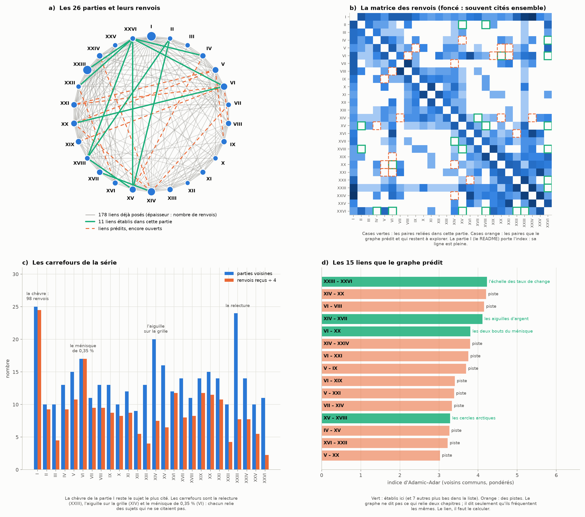
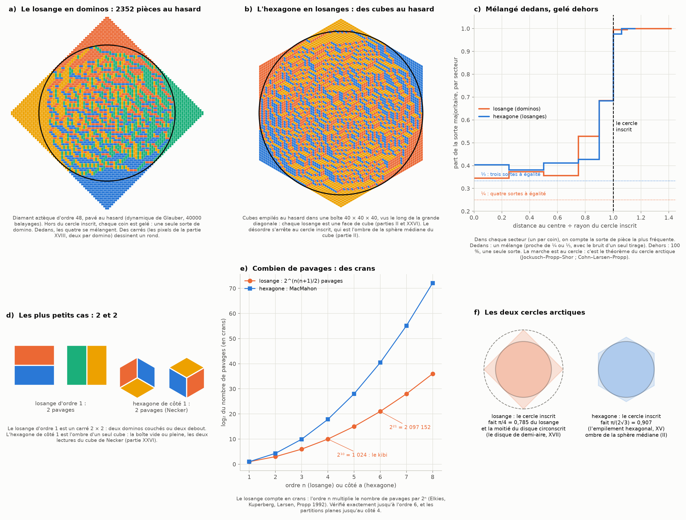
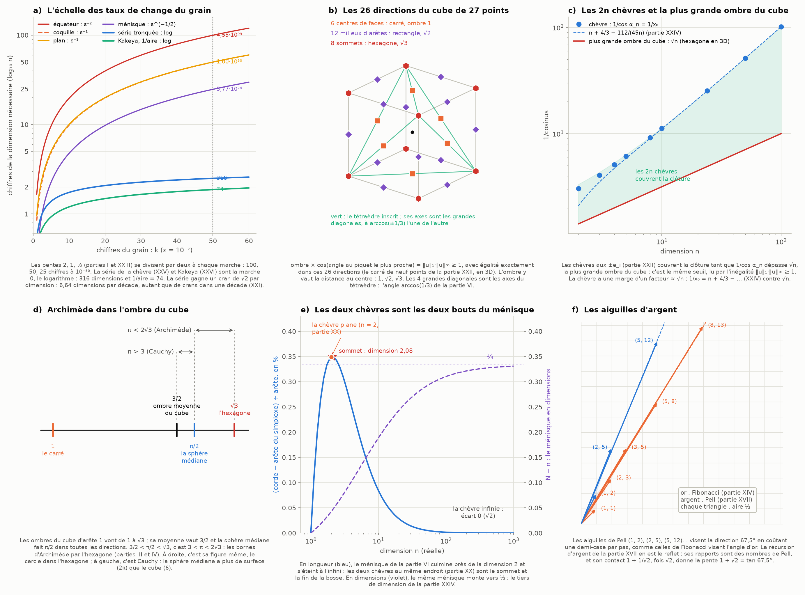

# Partie XXVII : la carte des connexions — le graphe de nos chapitres et les liens qu'il prédit

> Ta demande : continuer les connexions entre nos chapitres, et trouver les prochaines.
>
> Suite de la [partie XXVI](kakeya-miroir.md).

Tout est recalculé par [`scripts/carte_connexions.py`](scripts/carte_connexions.py) (≈ 20 s). Les tableaux complets sont dans [`resultats/carte_connexions.md`](resultats/carte_connexions.md).

**Suite : [Partie XXVIII — l'hexagone rejoint l'octaèdre, le théorème de Perron développé, et le Venn à 17](octaedre-perron-venn.md).**

## En bref

- **D'abord, la carte.** Le script lit les 26 parties et relève chaque renvoi : « partie XIX », « parties V et XIV », ou un lien vers un fichier.
  - 178 paires de chapitres se citent déjà, sur 325 possibles. 147 ne se sont encore jamais parlé.
  - Les carrefours sont la relecture (XXIII, 24 voisins), l'aiguille sur la grille (XIV, 20) et le ménisque de 0,35 % (VI, 17). La chèvre de la partie I reste la plus citée, avec 98 renvois.
- **Ensuite, le graphe désigne où chercher.**
  - Deux chapitres qui fréquentent les mêmes chapitres devraient se parler : c'est l'indice d'Adamic–Adar, l'outil classique de prédiction de liens dans un réseau.
  - En tête de la liste : XXIII–XXVI, XIV–XX, VI–VIII, XIV–XVII, VI–XX…
- **Enfin, les liens se calculent.** Le graphe ne dit pas *ce qui* relie deux chapitres. J'ai établi 11 liens, dont 4 des 15 premiers prédits :
  1. **Les cercles arctiques** (XV–XVIII, avec II, XX et XXVI).
     - Des dominos posés au hasard dans un losange, ou des cubes empilés au hasard vus comme un hexagone : le désordre s'arrête exactement au cercle inscrit.
     - Pour l'hexagone, ce cercle est l'ombre de la sphère médiane du cube (partie II). Des carrés font un rond (partie XVIII).
  2. **L'échelle des taux de change du grain** (XXIII–XXVI).
     - Les lectures de la chèvre demandent ε⁻², ε⁻¹, puis ε^(−1/2) dimensions. Vient ensuite la marche 0, le logarithme : la série de la chèvre (316 dimensions à 10⁻⁵⁰) et Kakeya (1/aire = 74).
  3. **Les aiguilles d'argent** (XIV–XVII). La récursion d'argent est la suite des aiguilles de Pell sur la grille. Elles visent 67,5° en gagnant une demi-case par pas, comme celles de Fibonacci visent l'angle d'or.
  4. **Les deux bouts du ménisque** (VI–XX). Les deux chèvres au même endroit sont le sommet (n ≈ 2) et la fin (n = ∞) de la bosse du ménisque. En dimensions, ce même ménisque monte à ⅓ (partie XXIV).
  5. **Les 26 directions du cube de 27 points** (XXII–XXVI).
     - On a toujours ombre du cube × cos(angle au piquet le plus proche) ≥ 1, avec égalité exactement dans les 26 directions de {−1, 0, 1}³.
     - Le seuil des 2n chèvres est la plus grande ombre du cube, √n.
  6. **arccos(1/3)** (VI–XXVI). L'angle de la zone de confusion est l'écart entre deux hexagones du cube qui tourne : c'est le tétraèdre inscrit dans le cube.
  7. **Archimède dans l'ombre du cube** (III, IV–XXVI) : 3/2 < π/2 < √3, c'est-à-dire 3 < π < 2√3.
- **Il reste des pistes** : XIV–XX, VI–VIII, XIV–XXIV, VI–XXI, V–IX… Le graphe les désigne, mais je ne les ai pas encore établies.

---

## 1. La carte des connexions

### 1.1 Comment elle est faite

- Chaque partie est un nœud.
- Deux parties sont reliées quand l'une cite l'autre. Le poids du lien est le nombre de renvois.
- On compte les mentions (« partie XIX », « parties XVII et XVIII », « parties XX à XXV ») et les liens vers les fichiers.
- La partie I, c'est-à-dire le README, porte l'index de la série : elle est reliée à toutes les autres, et on ne prédit pas de liens avec elle.
- Les lignes ajoutées plus tard pour renvoyer à cette partie sont ignorées : la carte est celle des parties I à XXVI.
- Avec cette partie comptée, la carte passe à 207 paires reliées sur 351 (59 %, contre 54,8 % avant) : `python3 scripts/carte_connexions.py 27` le recalcule sans rien réécrire.

### 1.2 Les carrefours (figure 1, panneau c)

| partie | sujet | voisins | renvois reçus |
|---|---|---:|---:|
| I | la chèvre | 25 | 98 |
| XXIII | la relecture : lentilles, boules, grain | 24 | 31 |
| XIV | l'aiguille sur une grille | 20 | 30 |
| VI | le ménisque de 0,35 % | 17 | 68 |
| XV | la grille décalée | 16 | 26 |

- La relecture (XXIII) est un carrefour par construction : elle a été écrite pour ça.
- L'aiguille sur la grille (XIV) et le ménisque de 0,35 % (VI) le sont devenus d'eux-mêmes.
  - Le premier mêle aiguilles, grilles, Fibonacci, Kakeya et nombres.
  - Le second relie la chèvre, le simplexe, les dimensions et √2.

### 1.3 Les liens que le graphe prédit (panneau d)

- **La règle.** Pour deux parties qui ne se citent pas, on additionne 1/ln(degré) sur leurs voisins communs. Un voisin commun rare compte plus qu'un carrefour que tout le monde cite.
- **Pourquoi c'est raisonnable.** Cet indice d'Adamic–Adar est l'un des meilleurs prédicteurs simples des liens futurs dans les réseaux de coauteurs (Liben-Nowell et Kleinberg).

| rang | paire | voisins communs | dans cette partie |
|---:|---|---:|---|
| 1 | XXIII – XXVI | 11 | § 3 : l'échelle des taux de change |
| 2 | XIV – XX | 11 | piste |
| 3 | VI – VIII | 11 | piste |
| 4 | XIV – XVII | 11 | § 7 : les aiguilles d'argent |
| 5 | VI – XX | 10 | § 6 : les deux bouts du ménisque |
| 6 | XIV – XXIV | 10 | piste |
| 7 | VI – XXI | 10 | piste |
| 8 | V – IX | 10 | piste |
| 9 | VI – XIX | 9 | piste |
| 10 | V – XXI | 9 | piste |
| 11 | VII – XIV | 9 | piste |
| 12 | XV – XVIII | 9 | § 2 : les cercles arctiques |
| 13 | IV – XV | 9 | piste |
| 14 | XVI – XXII | 9 | piste |
| 15 | V – XX | 8 | piste |

Les autres paires établies ici sont plus bas dans la liste :

| paire | rang | où |
|---|---:|---|
| IV – XXVI | 17 | § 5 |
| XV – XXVI | 56 | § 2 |
| II – XV | 41 | § 2 |
| VI – XXVI | 54 | § 8 |
| XXII – XXVI | 60 | § 4 |
| XVIII – XXVI | 102 | § 2 |
| II – XVIII | 123 | § 2 |

---

## 2. Les cercles arctiques (XV – XVIII, avec II, XX et XXVI)

### 2.1 Le losange en dominos (figure 2, panneau a)

**La pièce.**
- Le diamant aztèque d'ordre n est le losange de la partie XX, découpé en carrés : les cases (pixels) de centre (x, y) avec |x| + |y| ≤ n.
- On le pave par des dominos, chacun fait de deux carrés.

**Combien de pavages.**
- Il y en a exactement 2^(n(n+1)/2) (Elkies, Kuperberg, Larsen, Propp, 1992). Le script les compte un par un jusqu'à l'ordre 6.
- **Le losange compte en crans** : passer de l'ordre n − 1 à l'ordre n multiplie le nombre de pavages par 2ⁿ.
- À l'ordre 4, il y a 2¹⁰ = 1 024 pavages, le kibi de la partie XXVI. À l'ordre 6, il y en a 2²¹ = 2 097 152, les chiffres du 9,72. Ce ne sont que des puissances de 2 : je les note pour le plaisir, sans y voir plus.

**Un pavage au hasard.**
- J'ai tiré un pavage de l'ordre 48 (2 352 dominos) par la dynamique de Glauber : on retourne au hasard les paires de dominos parallèles, 40 000 fois sur tout le losange.
- **Le désordre ne vit que dans le cercle inscrit.**
  - Dehors, chaque coin est gelé : une seule sorte de domino.
  - Dedans, les quatre sortes se mélangent.
- C'est le théorème du cercle arctique (Jockusch, Propp et Shor) : le cercle a pour rayon n/√2.

### 2.2 L'hexagone en losanges : des cubes empilés (panneau b)

**La pièce.**
- Des cubes empilés dans un coin de boîte, vus le long de la grande diagonale : chaque face visible est un losange de 60°/120°. Ce sont exactement les losanges de l'hexagone de la partie XXVI.
- C'est aussi la grille cubique coupée en diagonale de la partie XV, et « le cube comme grille cubique en 2D » de ta lecture.

**Combien de pavages.** Le nombre de pavages de l'hexagone de côté a est donné par la formule de MacMahon : 2, 20, 980, 232 848… Le script le recompte jusqu'à a = 4.

**L'hexagone de côté 1 a 2 pavages** (panneau d) : la boîte vide ou pleine. Ce sont les deux lectures du cube de Necker de la partie XXVI.

**Un empilement au hasard.**
- J'ai tiré un empilement au hasard dans une boîte 40 × 40 × 40 (4 800 losanges, 24 000 balayages).
- Le désordre s'arrête au cercle inscrit (Cohn, Larsen et Propp, 1998).
- **Ce cercle est l'ombre de la sphère médiane du cube** (partie II : « son cercle inscrit, de rayon √2/2, est l'ombre de la sphère médiane »).

### 2.3 Gelé dehors, mélangé dedans (panneau c)

Dans chaque secteur (un par coin), on compte la sorte de pièce la plus fréquente :

| distance au centre (÷ rayon du cercle) | losange | hexagone |
|---|---|---|
| 0 – 0,25 | 0,35 | 0,40 |
| 0,25 – 0,75 | 0,36 – 0,37 | 0,38 – 0,41 |
| 0,90 – 1,00 | 0,69 | 0,68 |
| 1,00 – 1,10 | 1,00 | 0,98 – 1,00 |
| au-delà | 1,00 | 1,00 |

- Dedans, on est près d'un mélange égal (¼ pour quatre sortes, ⅓ pour trois), avec le bruit d'un seul tirage. Dehors, une seule sorte. La marche est au cercle.
- Les vérifications : la part des dominos verticaux reste près de ½, et la hauteur moyenne des cubes près de la moitié de la boîte (les valeurs attendues par symétrie).

### 2.4 Ce que ça relie (panneau f)

- **XVIII, « faire des ronds avec des carrés ».** Des carrés posés au hasard, deux par deux, dessinent un rond, et un rond exact.
- **XX et XVII, le losange et le disque de demi-aire.**
  - Le cercle arctique du losange est son cercle inscrit, de rayon 1/√2 quand les sommets sont à 1.
  - Son aire est la moitié de celle du disque circonscrit : c'est le disque de demi-aire 1/√2 de la partie XVII, et le rapport ½ des deux cercles du losange de la partie XX.
  - Il couvre π/4 = 0,785 du losange.
- **II, XV et XXVI, l'hexagone.**
  - Le cercle arctique de l'hexagone est l'ombre de la sphère médiane.
  - Il couvre π/(2√3) = 0,907 de l'hexagone : c'est la densité de l'empilement hexagonal des disques, celui de la grille de la partie XV.

**Analogie de structure (même procédé).**
- **Ce qui est partagé.** Les deux pavages au hasard ont la même loi : le désordre est borné par la courbe inscrite. Pour les cubes, la borne est ce que la partie II avait trouvé par l'ombre.
- **Ce que ça transporte.** Une ombre de la géométrie (la sphère médiane) devient la frontière d'un phénomène statistique.
- **Ce qui reste ouvert.** Pourquoi la frontière tombe exactement sur l'ombre de la sphère médiane. Pour le cube, je ne connais pas d'argument direct entre les deux.

---

## 3. L'échelle des taux de change du grain (XXIII – XXVI, avec XXI et XXV)

La partie XXIII donnait quatre taux de change entre le grain ε et la dimension. Les parties XXV et XXVI en ajoutent deux, d'une autre nature :

| lecture | loi | à 10⁻⁵⁰ | par décade de grain |
|---|---|---|---|
| l'équateur (partie I) | ε⁻² | 4,55·10⁹⁹ dimensions | × 100 |
| la coquille | ε⁻¹ | 6,93·10⁴⁹ | × 10 |
| le plan de la lentille | ε⁻¹ | 1,00·10⁵⁰ | × 10 |
| le ménisque | ε^(−1/2) | 5,77·10²⁴ | × 3,16 |
| la série en 1/n, tronquée au mieux (XXV) | ≈ 2·log₂(1/ε) | 316 dimensions | + 6,6 |
| Kakeya : l'inverse de l'aire minimale (XXVI) | ≈ (2/π)·ln(1/ε) | 74 | + 1,47 |

**Les exposants se divisent par deux** : 2, 1, ½. À 10⁻⁵⁰, cela fait 100, 50 et 25 chiffres : le carré, le nombre et la racine (partie XXIII).

**Le logarithme est la marche 0.**
- On a exactement ln(1/ε) = lim (ε^(−s) − 1)/s quand s → 0.
- À 10⁻⁵⁰, ce rapport vaut 10⁵⁰ pour s = 1, 2·10²⁵ pour s = ½, 216 pour s = 0,01, et tend vers 115,1.
- La série de la chèvre et Kakeya ne lisent plus le grain, mais son nombre de chiffres.

**La série gagne un cran par dimension.**
- Sa meilleure précision est 2^(−n/2)/n (partie XXV) : chaque dimension gagne un facteur √2, un cran de diaphragme.
- Une décade de grain coûte donc 2·log₂ 10 = 6,644 dimensions, exactement le nombre de crans dans une décade (partie XXI : « une décade vaut 6,644 diaphragmes »).

**Analogie de structure (même procédé).**
- **Ce qui est partagé.** Le facteur √2 par pas : par dimension pour la série, par diaphragme pour l'aire.
- **D'où il vient.** C'est la singularité en −ln √2 de la partie XXV, l'écart entre le bord de la lentille (45°) et le sommet du sinus (90°).

---

## 4. Les 26 directions du cube de 27 points (XXII – XXVI)

**L'inégalité.**
- Pour une direction u, l'ombre du cube vaut ‖u‖₁ = |u₁| + |u₂| + |u₃| (partie XXVI).
- Le cosinus de l'angle au piquet le plus proche (±e_i, les chèvres de la partie XXII) vaut ‖u‖∞ = max |u_i|.
- Leur produit vérifie toujours ‖u‖₁·‖u‖∞ ≥ ‖u‖₂² = 1.

**L'égalité.** Elle a lieu exactement quand toutes les composantes non nulles ont la même taille, c'est-à-dire dans les 26 directions du cube de 27 points {−1, 0, 1}³ (figure 3, panneau b). C'est le carré de neuf points de la partie XXII, en 3D :
- 6 centres de faces : le carré, ombre 1 ;
- 12 milieux d'arêtes : le rectangle, ombre √2 ;
- 8 sommets : l'hexagone, ombre √3.

L'ombre y vaut la distance du point au centre.

**Le seuil des chèvres.**
- Les 2n chèvres de la partie XXII couvrent la clôture quand cos α_n < 1/√n.
- Par l'inégalité, c'est exactement quand 1/cos α_n dépasse √n, la plus grande ombre du cube de dimension n. En 3D, c'est l'hexagone.

| n | α_n | 1/cos α_n = 1/x₀ | n + 4/3 − 112/(45n) (XXIV) | plus grande ombre √n |
|---:|---|---|---|---|
| 2 | 70,81° | 3,04 | 2,09 | 1,41 |
| 3 | 75,80° | 4,08 | 3,50 | 1,73 |
| 10 | 84,87° | 11,19 | 11,08 | 3,16 |
| 24 | 87,73° | 25,25 | 25,23 | 4,90 |
| 100 | 89,43° | 101,31 | 101,31 | 10,00 |

- **La marge.** 1/x₀ vaut une dimension et un tiers de plus que n (le ménisque de la partie XXIV), quand la plus grande ombre ne vaut que √n. Les chèvres couvrent donc avec une marge qui grandit comme √n.
- **L'infini.** À l'infini, c'est l'autre condition (α_n < 90°) qui casse, comme l'avait vu la partie XXII.

---

## 5. Archimède dans l'ombre du cube (III, IV – XXVI)

- **Les ombres.** Celles du cube d'arête 1 vont de 1 (le carré) à √3 (l'hexagone). Leur moyenne vaut 3/2 : c'est la formule de Cauchy, la surface 6 divisée par 4.
- **La sphère médiane** (rayon √2/2, elle passe par les milieux des arêtes) a la même ombre dans toutes les directions : π/2.
- **D'où 3/2 < π/2 < √3**, c'est-à-dire **3 < π < 2√3** : les premières bornes d'Archimède, celles de l'hexagone (parties III et IV).
  - À droite, c'est la figure même d'Archimède : le cercle inscrit dans l'hexagone circonscrit. Le cercle est l'ombre de la sphère médiane, l'hexagone est l'ombre du cube (partie II).
  - À gauche, c'est Cauchy : la sphère médiane a plus de surface (2π) que le cube (6). Cette inégalité ne vient pas d'une inclusion, puisque les coins du cube dépassent de la sphère médiane.
- **L'écart** π/2 − 3/2 = (π − 3)/2 = 0,0708 est la moitié des « retenues de l'hexagone » 1/8 + 9/640 + … de la partie IV.

---

## 6. Les deux bouts du ménisque (VI – XX, avec XXIV)

**Ce que la partie VI avait vu.** Prolongé aux dimensions réelles, l'écart entre la chèvre et son simplexe est nul en dimension 1, culmine près de 2 et s'éteint à l'infini.

**Les deux sommets** (figure 3, panneau e) :
- l'écart relatif (corde − arête du simplexe) ÷ arête culmine à 0,3495 % en dimension 2,083 ;
- l'écart absolu culmine en dimension 2,244 (le « n ≈ 2,24 » de la partie VI).

**Les deux chèvres de la partie XX sont les deux bouts de cette bosse.**
- La chèvre plane (n = 2) est à 0,3488 %, à 0,2 % près du sommet.
- La chèvre de dimension infinie (corde √2) est au bout, où l'écart s'annule.
- Elles sont séparées par une infinité de dimensions, et c'est tout le ménisque qui les sépare.

**En dimensions, le même ménisque monte au lieu de retomber.**
- On cherche le simplexe de même corde, de dimension N.
- On trouve N − n = 0,043 en dimension 2, 0,189 en 10, 0,310 en 100 et 0,331 en 1 000 : vers ⅓, le tiers de dimension de la partie XXIV.
- En longueur, il s'éteint ; en dimensions, il tend vers un tiers.

---

## 7. Les aiguilles d'argent (XIV – XVII)

**Les aiguilles de Fibonacci (partie XIV).**
- Sur la grille, les aiguilles (F_k, F_(k+1)) visent la direction d'or (58,28°).
- Deux voisines enferment un triangle d'aire ½, la demi-case minimale (Cassini, Pick).
- Elles passent d'un côté à l'autre à chaque pas, à une distance divisée par φ.

**Le même procédé en argent.**
- Les aiguilles de Pell (1, 2), (2, 5), (5, 12), (12, 29), (29, 70)… visent la direction d'argent, arctan(1 + √2) = 67,5° exactement.
- Leurs voisines ont aussi un déterminant ±1 : la demi-case minimale, à chaque pas.
- L'écart change de signe à chaque pas et se divise par 1 + √2 : P_(k+1) − (1 + √2)·P_k = (1 − √2)^k exactement.

| k | Pell | angle | écart à 67,5° |
|---:|---|---|---|
| 1 | (1, 2) | 63,435° | −0,159 |
| 2 | (2, 5) | 68,199° | +0,066 |
| 3 | (5, 12) | 67,380° | −0,027 |
| 4 | (12, 29) | 67,521° | +0,011 |
| 5 | (29, 70) | 67,496° | −0,005 |
| 8 | (408, 985) | 67,500° | +0,0003 |

**C'est la récursion d'argent de la partie XVII.**
- En partant de 1, T(d) = 2 − 1/(2d) donne 1, 3/2, 5/3, 17/10, 29/17, 99/58, 169/99… : des rapports de nombres de Pell. Elle tend vers le contact d = 1 + 1/√2.
- Ce contact, multiplié par √2, est la pente d'argent : (1 + 1/√2)·√2 = 1 + √2 = tan 67,5°. C'est la tangente du contact extérieur (CLAUDE.md, § 5).
- Au contact, T′ = (√2 − 1)² : chaque pas de la récursion saute deux aiguilles de Pell.

**Analogie de structure (même procédé).**
- **Ce qui est partagé.** Une fraction continue à quotients constants : [1; 1, 1, …] pour l'or, [2; 2, 2, …] pour l'argent. Les réduites successives sont des aiguilles voisines de la grille.
- **Ce que ça transporte.** Le « croisement de convergences » de la partie XIV vaut aussi pour les contacts de la partie XVII.

---

## 8. arccos(1/3) : la zone de confusion et le tétraèdre dans le cube (VI – XXVI)

- **Dans la partie VI**, la corde du triangle (2/√3) coupe la clôture à x = 1/3, donc sous l'angle arccos(1/3) = 70,53°. C'est l'angle qui entre dans l'aire exacte de la zone de confusion. La partie VI le reconnaissait déjà : « l'angle du tétraèdre régulier, le triangle de la dimension suivante ».
- **Dans la partie XXVI**, les hexagones du mouvement complet sont séparés de 70,53° et 109,47°.
  - Les quatre grandes diagonales du cube sont les axes du tétraèdre inscrit, un sommet sur deux (figure 3, panneau b, en vert).
  - Deux d'entre elles font l'angle arccos(±1/3).
- **En dimension n**, le plan de la lentille du simplexe est à 1/(n + 1) du centre (partie I). Or −1/(n + 1) est le cosinus de l'angle au centre du simplexe régulier de dimension n + 1. La vraie chèvre a cos α_n = x₀, un peu moins, et l'écart d'angle est le ménisque :

| n | arccos(1/(n + 1)) | α_n de la chèvre | écart |
|---:|---|---|---|
| 2 | 70,529° | 70,812° | 0,283° |
| 3 | 75,522° | 75,798° | 0,276° |
| 5 | 80,406° | 80,601° | 0,195° |
| 10 | 84,784° | 84,872° | 0,088° |

---

## 9. Les pistes suivantes

Le graphe désigne encore ces paires. Je donne leurs voisins communs, c'est-à-dire les chapitres où chercher le lien :

| paire | voisins communs |
|---|---|
| XIV – XX (aiguille sur la grille, deux chèvres) | I, IV, XI, XV, XVI, XVIII, XIX, XXI, XXIII, XXV, XXVI |
| VI – VIII (ménisque de 0,35 %, foyer et diaphragme) | I, II, V, VII, IX, XII, XIII, XIV, XV, XVII, XXIII |
| XIV – XXIV (aiguille sur la grille, tiers de dimension) | I, IV, VI, XVI, XVIII, XIX, XXI, XXIII, XXV, XXVI |
| VI – XXI (ménisque, les trois 24) | I, IV, VII, XIII, XIV, XVI, XVII, XXII, XXIII, XXIV |
| V – IX (Kakeya, moiré de Fibonacci) | I, IV, VI, VII, VIII, X, XIII, XIV, XV, XXIII |

**Une hypothèse pour la première** (à vérifier, pas un résultat).
- La partie XIV trouve que Kakeya sur une grille finie occupe la moitié du plan, parce que les carrés modulo q sont la moitié des nombres.
- La partie XX coupe chaque sphère en deux hémisphères d'aire ½.
- Les deux moitiés viennent-elles d'un même procédé ? Je ne le sais pas encore.

---

## 10. Le tri

**Exact (démontré ici ou classique) :**
- les comptes 2^(n(n+1)/2) (losange, recomptés jusqu'à l'ordre 6) et MacMahon (hexagone, recomptés jusqu'au côté 4) ;
- les théorèmes des cercles arctiques (Jockusch–Propp–Shor ; Cohn–Larsen–Propp) ;
- les rapports π/4 et π/(2√3) ;
- ‖u‖₁·‖u‖∞ ≥ 1 avec égalité sur les 26 directions, et le seuil des chèvres comme plus grande ombre ;
- 3/2 < π/2 < √3 ⟺ 3 < π < 2√3 ;
- les identités de Pell et de Fibonacci, la récursion d'argent, T′ = (√2 − 1)² ;
- les angles des diagonales du cube, arccos(±1/3), et cos = −1/(n + 1) pour le simplexe régulier ;
- la limite ln(1/ε) = lim (ε^(−s) − 1)/s.

**Calculé :**
- le graphe des renvois et les prédictions (sur l'état du dépôt avant cette partie) ;
- les tirages au hasard (losange d'ordre 48, boîte 40 × 40 × 40) et leurs profils ;
- les sommets de la bosse du ménisque (2,083 et 2,244) et N − n ;
- la série tronquée à 10⁻⁵⁰ (316 dimensions).

**Analogie de structure (même procédé), donc un résultat :**
- **les cercles arctiques et les ombres** : la borne du désordre est le cercle inscrit, qui est l'ombre de la sphère médiane (II) et le disque de demi-aire (XVII) ;
- **le cran de √2** : par dimension pour la série (XXV), par diaphragme pour l'aire (XXI) ;
- **l'or et l'argent** : les aiguilles de la grille (XIV) et la récursion des contacts (XVII) sont la même fraction continue ;
- **arccos(1/3)** : la zone de confusion (VI) et l'écart entre les hexagones (XXVI), par le tétraèdre.

**Mes lectures (corrige-moi si je t'ai mal compris) :**
- **« Les prochaines connexions ».** Je l'ai lu au sens propre : laisser la structure de nos chapitres désigner où chercher, puis calculer ce qu'elle désigne. Si tu avais en tête des liens précis, dis-les-moi : ils passent avant le graphe.
- **Les puissances de 2 du losange.** 1 024 et 2 097 152 rappellent le kibi et le 9,72, mais je n'y vois que des puissances de 2, pas un mécanisme commun.

**Ouvert :**
- pourquoi le cercle arctique de l'hexagone est exactement l'ombre de la sphère médiane (un argument direct) ;
- les pistes du § 9, en commençant par XIV–XX et VI–VIII ;
- la constante de Kakeya au grain δ et la formule 2/(k + 2), toujours ouvertes depuis la partie XXVI.

**Pas établi :** que l'espace physique suive ce modèle à 10⁻⁵⁰ m. C'est un postulat (partie XX, § 8).

## Sources

**Les parties reliées**
- [II](archimede.md) : l'hexagone, ombre du cube, et la sphère médiane ;
- [III](pi-dimensions.md) et [IV](trois-solides.md) : Archimède, les retenues de l'hexagone ;
- [VI](zone-confusion.md) : le ménisque de 0,35 %, arccos(1/3), la bosse ;
- [XIV](aiguille-grille.md) : les aiguilles de Fibonacci, la demi-case, Kakeya sur la grille ;
- [XV](grille-decalee.md) : la grille décalée, l'empilement hexagonal ;
- [XVII](recursion-argent.md) : la récursion d'argent, le disque de demi-aire ;
- [XVIII](pixels-longitudes.md) : faire des ronds avec des carrés ;
- [XX](sphere-faisceaux.md) : les deux chèvres, le losange ;
- [XXI](vingt-quatre-miroir.md) : les crans par décade ;
- [XXII](carre-neuf-points.md) : le carré de neuf points, les 2n chèvres ;
- [XXIII](lentilles-boules-grain.md) : les taux de change ;
- [XXIV](tiers-dimension.md) : le tiers de dimension, 1/x₀ = n + 4/3 − … ;
- [XXV](tranche-aiguilles.md) : la série et sa meilleure précision ;
- [XXVI](kakeya-miroir.md) : Kakeya au grain δ, l'ombre du cube, l'hexagone.

**Littérature**
- L. A. Adamic, E. Adar, « Friends and neighbors on the Web », *Social Networks* 25, 211–230 (2003) : l'indice de voisins communs pondérés.
- D. Liben-Nowell, J. Kleinberg, [« The link prediction problem for social networks »](https://people.csail.mit.edu/dln/papers/link/paper.pdf) (CIKM 2003 ; *JASIST* 58, 2007).
- N. Elkies, G. Kuperberg, M. Larsen, J. Propp, « Alternating-sign matrices and domino tilings », *Journal of Algebraic Combinatorics* 1, 111–132 et 219–234 (1992) : les 2^(n(n+1)/2) pavages du diamant aztèque.
- W. Jockusch, J. Propp, P. Shor, [« Random domino tilings and the arctic circle theorem »](https://arxiv.org/abs/math/9801068) (1998).
- H. Cohn, M. Larsen, J. Propp, [« The shape of a typical boxed plane partition »](https://arxiv.org/abs/math/9801059), *New York Journal of Mathematics* 4, 137–165 (1998) : le cercle (l'ellipse) inscrit de l'hexagone.
- P. A. MacMahon, *Combinatory Analysis* (1916) : les partitions planes dans une boîte ; [OEIS A008793](https://oeis.org/A008793).
- Wikipédia : [Aztec diamond](https://en.wikipedia.org/wiki/Aztec_diamond), [Plane partition](https://en.wikipedia.org/wiki/Plane_partition), [Pell number](https://en.wikipedia.org/wiki/Pell_number), [Silver ratio](https://en.wikipedia.org/wiki/Silver_ratio), [Pick's theorem](https://en.wikipedia.org/wiki/Pick%27s_theorem).
