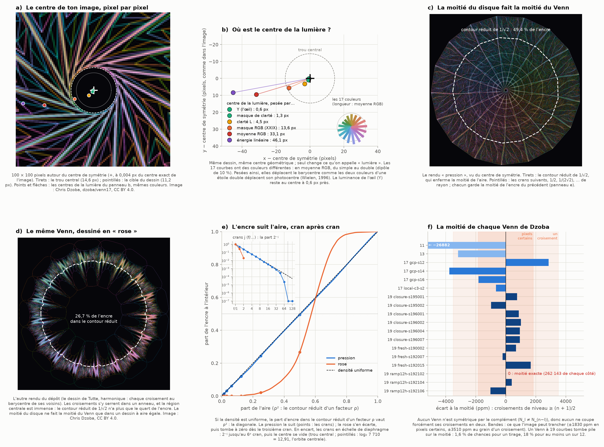
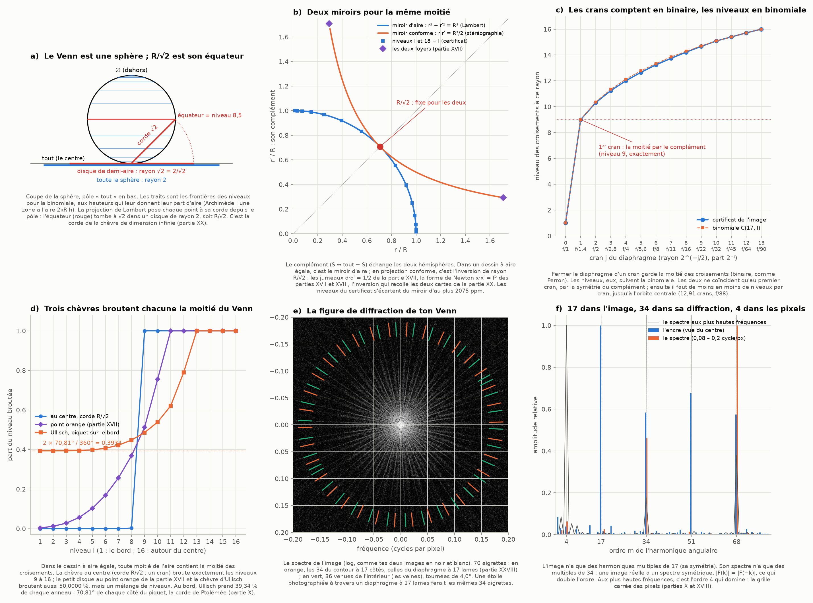
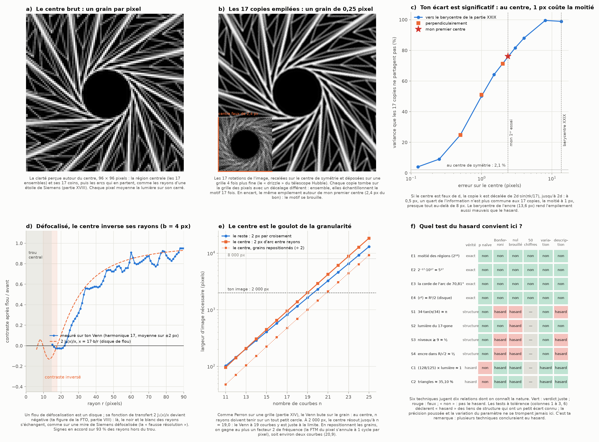

# Partie XXX : le centre du Venn — la moitié du disque, les diaphragmes, les grains repositionnés et les tests du hasard

> Tes deux messages, traités ensemble, parce que le second précise le premier sur le même objet : le centre, et la moitié qu'on mesure à partir de lui.
>
> 1. « Ok, maintenant reconnecte avec ce qu'on avait découvert dans ces cinq parties et une analyse en prenant la moitié de l'aire du disque faisant la moitié de l'aire du Venn et les diaphragmes. » Avec cinq figures : j1 (partie X), q2 (partie XVII), r1 et r2 (partie XVIII), u1 (partie XX).
> 2. « Ok, allons encore plus près du centre, toujours en prenant en compte des limites de granularité et le repositionnement des grains (pour fine grain des coarse grain à pattern connus) et les connexions faites dans la dernière image. Les rapprochements avec la physique ne sont pas des coïncidences et ils sont désirés. Yup, tes deux images en noir et blanc l'ont capturé (dernière image). Et le truc, c'est que faire une analyse de hasard là-dessus ne devrait pas donner des résultats exacts au hasard, mais je sais que plusieurs techniques concluraient un hasard, et les tester nous permettrait de définir lesquelles sont les mieux faites pour notre situation. »
>    - Sur ma phrase « le barycentre de l'encre est décalé d'environ 11 px à cause des différences de luminosité entre les 17 courbes, alors que le vrai centre de symétrie d'ordre 17 ne se trouve qu'à 2 px du trou central », tu ajoutes : « Non, cet écart est significatif ! »
>    - Avec le centre de ton Venn en gros plan, les figures p1 (partie XVI), n2 (partie XIV) et h1 (partie VIII), et mon spectre en noir et blanc.
>
> Suite de la [partie XXIX](venn-ppm.md).

Tout est recalculé par [`scripts/centre_venn.py`](scripts/centre_venn.py) (≈ 55 s), à partir du même dépôt que la partie XXIX. Les tableaux complets sont dans [`resultats/centre_venn.md`](resultats/centre_venn.md).

## En bref

- **Tu avais raison : l'écart est significatif, et il dit quelque chose.**
  - Le vrai centre de symétrie d'ordre 17 est le centre exact de l'image, à 0,004 px près. Les rotations de 1, 2, 4 et 8 dix-septièmes de tour donnent toutes ce même point, à 0,003 px.
  - Le « centre de la lumière », lui, dépend de la façon de peser la lumière :
    - 0,6 px avec la luminance de l'œil ;
    - 13,6 px avec le masque de la partie XXIX ;
    - 33 px en moyenne RGB ;
    - 46 px en énergie.
  - La cause : les 17 courbes ont des couleurs différentes. Une figure symétrique dont les morceaux ne pèsent pas pareil a un dipôle. C'est exactement le « déplacement induit par la couleur » des étoiles doubles (Wielen, 1996).
  - Mes « 2 px » en venaient : mon premier essai partait de ce barycentre et s'est arrêté au bord de sa fenêtre de recherche, à 2,36 px du vrai centre.
  - Au centre, l'écart coûte cher : décaler de 1 px le centre autour duquel on empile les 17 copies détruit la moitié de l'information qu'elles partagent.
- **La moitié du disque fait la moitié du Venn, mais seulement dans un dessin à aire égale.**
  - Rendu « pression » : 49,4 % de l'encre dans le contour réduit de 1/√2, et chaque cran de diaphragme en garde la moitié, jusqu'au sixième.
  - Rendu « rose » (le même Venn, dessiné par Tutte) : 26,7 %, et plus rien dès le troisième cran.
  - La moitié du diagramme lui-même, c'est le complément : exactement 2¹⁶ régions de chaque côté. Un des douze Venn à 19 courbes coupe même ses croisements exactement en deux (262 143 de chaque côté).
- **Le Venn est une sphère, et R/√2 est son équateur.**
  - Lambert pose chaque point à sa corde depuis le pôle, ce qui conserve les aires (Archimède).
  - L'équateur tombe à la corde √2, celle de la chèvre de dimension infinie (partie XX), soit R/√2.
  - Deux miroirs fixent ce même cercle : le miroir d'aire (le complément) et l'inversion des jumeaux de la partie XVII.
- **Les diaphragmes.**
  - Fermer d'un cran garde la moitié des croisements : c'est un comptage binaire, comme Perron. Les niveaux, eux, suivent la binomiale, et les deux ne coïncident qu'au premier cran.
  - Du bord à l'orbite centrale, il y a 12,91 crans : de f/1 à f/88.
  - Trois chèvres broutent chacune exactement la moitié des croisements ; seule celle du centre broute la « moitié haute ».
  - Le cran entre cercle inscrit et cercle circonscrit (partie I) est un privilège du carré (théorème de Niven).
- **La figure de diffraction (tes deux images en noir et blanc).**
  - Elle a 70 aigrettes : 34 viennent du contour à 17 côtés, exactement celles d'un diaphragme à 17 lames ; 34 autres (plus deux pics de bruit) viennent de l'intérieur.
  - L'image n'a que des harmoniques multiples de 17, sa diffraction que des multiples de 34. Aux plus hautes fréquences, c'est l'ordre 4 des pixels qui domine.
- **Au plus près du centre.**
  - Empiler les 17 copies tournées (le « drizzle » du télescope Hubble) donne le centre au quart de pixel.
  - Défocalisé, le centre inverse ses rayons près de là où la théorie le prévoit : une couronne inversée de 16 à 21 px, prévue de 9,7 à 17,7 px. *(Correction de la révision 001 : le « 93 % des signes en accord » est le taux de base, car un prédicteur « positif partout » en fait 92 % ; la couronne est réelle, la statistique ne la testait pas.)*
  - Le centre est le goulot de la granularité : à 2 000 px, il résout jusqu'à 19,0 courbes. Repositionner les grains fait gagner au plus deux courbes.
- **Le hasard, testé.**
  - Sur dix relations de nature connue, les tests à tolérance déclarent « hasard » des liens de structure. Seules la précision poussée et la variation du paramètre ne se trompent jamais.
  - Ta remarque est donc juste, avec une nuance : un entier peut tomber pile par hasard (1,6 % pour la moitié exacte à 19 courbes) ; un réel exact à 50 chiffres, jamais.

---

## 1. Trois centres, et pourquoi leur écart compte (figure 1, panneaux a et b)

### 1.1 Le centre de symétrie, au millième de pixel

**La méthode.**
- On cherche le point autour duquel l'image ressemble le plus à ses rotations de 2πk/17 : on mesure la corrélation entre l'image et sa copie tournée.
- On travaille sur la clarté perçue (OKLab), légèrement lissée, au pas de 2, puis 0,5, puis 0,125 px.
- Un paraboloïde ajusté sur la dernière grille donne le sommet de la corrélation.

**Le résultat.**
- Le centre est en (999,497 ; 999,499). Le centre exact de l'image (2 000 × 2 000 pixels) est en (999,5 ; 999,5) : l'écart est de 0,004 px.
- Chaque rotation, prise seule (k = 1, 2, 4, 8), redonne le même point à 0,003 px près. La corrélation vaut 0,994.
- **Le dessin est donc parfaitement centré**, et sa symétrie d'ordre 17 est exacte au millième de pixel.

**Pourquoi la clarté perçue.** La palette du traceur de Dzoba (`plotter_svg.py`) donne à toutes les courbes la même clarté OKLab (L = 0,58), avec des teintes 25° + 360°·i/17. L'image à 17 courbes garde ces teintes (révision 001, § 4.8), mais pas cette clarté : ses courbes vont de 0,60 à 0,71 (plus bas, § 1.2), et le programme qui l'a rendue n'est pas publié (correction de la révision 001). La clarté reste le canal où les courbes pèsent le plus également.

### 1.2 Le centre de la lumière dépend de la façon de la peser

| la lumière, pesée par… | écart au centre de symétrie |
|---|---:|
| la luminance Y (la sensibilité de l'œil : la photométrie) | 0,61 px |
| un masque de clarté OKLab | 1,26 px |
| la clarté OKLab | 4,51 px |
| le masque en moyenne RGB de la partie XXIX | 13,58 px |
| la moyenne des canaux RGB | 33,07 px |
| l'énergie dans les trois primaires (la radiométrie) | 46,07 px |

**Ce qui est exact.**
- Si les 17 courbes pesaient pareil, le barycentre serait exactement le centre de symétrie : une rotation d'ordre 17 annule tout premier harmonique.
- Tout écart vient donc des poids, pas de la géométrie.

**Ce qu'on mesure.**
- Les couleurs de l'image sont des versions claires des teintes de la palette. Leur clarté perçue va de 0,60 (les verts) à 0,71, leur moyenne RGB de 101 à 177.
- Le premier harmonique (le dipôle) de ces 17 poids vaut :
  - 1,6 % en clarté ;
  - 4,1 % en luminance ;
  - 9,8 % en moyenne RGB ;
  - 17,7 % en énergie.

  Plus le dipôle est fort, plus le centre de la lumière s'en va.

**Significatif ?** Le centre de symétrie est connu à 0,003 px. L'écart du masque de la partie XXIX en vaut 4 462 fois. Ce n'est pas du bruit : c'est un dipôle réel, celui des couleurs.

**Analogie de structure (même procédé) : le déplacement induit par la couleur.**
- **Ce qui est partagé exactement.**
  - Pour une étoile double trop serrée pour être séparée, le télescope voit un seul point, le photocentre.
  - Ce photocentre est le barycentre des deux étoiles pesées par leur éclat *dans la bande observée*.
  - Si les deux étoiles n'ont pas la même couleur, le photocentre bouge quand on change de filtre.
  - Wielen (1996) en a fait une méthode pour découvrir des étoiles doubles : le « color-induced displacement ».
  - Nos 17 courbes sont 17 sources de couleurs différentes, placées symétriquement. Changer la façon de peser la lumière déplace leur photocentre de 0,6 à 46 px.
- **Ce que ça transporte.** Le déplacement entre deux pesées révèle une inégalité cachée des poids, sans avoir besoin de séparer les sources.
- **Une autre forme du même procédé.**
  - La molécule HD a exactement la géométrie de H₂, mais ses deux noyaux n'ont pas la même masse. Le centre de masse quitte le centre de charge, et HD acquiert un petit moment dipolaire, (5,85 ± 0,17)·10⁻⁴ debye (Trefler et Gush, 1968), quand H₂ n'en a aucun.
  - Le mécanisme physique est plus fin (les électrons suivent imparfaitement les noyaux), mais le schéma est le même : une symétrie de forme, des poids inégaux, un dipôle.
- **Photométrie contre radiométrie.** La luminance (l'œil, la courbe V(λ) de la CIE) met le centre de la lumière à 0,6 px du centre de symétrie ; l'énergie le met à 46 px. La palette a été faite pour l'œil, et c'est pour l'œil qu'elle est presque équilibrée.

### 1.3 Mes « 2 px »

- **Ce qui s'est passé.**
  - Mon premier essai partait du barycentre du masque RGB, déjà décalé de 13,6 px.
  - Il cherchait le centre de symétrie dans une fenêtre de ±8 px, puis de ±2 px. Il s'est arrêté au bord de ses deux fenêtres, en (997,13 ; 999,61), à 2,36 px du vrai centre.
  - Avec la recherche fine, le même masque RGB redonne le vrai centre, à 0,004 px.
- **Ce n'est donc pas le masque qui trompait, c'est le point de départ.** Le biais de 13,6 px avait contaminé la recherche de la symétrie : ton intuition était juste.
- **Le trou central.**
  - Vu du vrai centre, il a un rayon de 14,57 px.
  - Le plus grand disque vide centré sur un pixel est en (999 ; 999), à 0,70 px du centre : la grille des pixels ne peut pas mieux faire, puisque le vrai centre est au coin de quatre pixels.

---

## 2. La moitié du disque fait la moitié du Venn (figure 1, panneaux c à f)

### 2.1 Mesurée depuis le bon centre

| rendu | encre de l'intérieur | dans le contour réduit de 1/√2 | dans le cercle R/√2 | rayon médian ρ | ⟨ρ²⟩ |
|---|---:|---:|---:|---:|---:|
| pression, centre de symétrie | 66,8 % | 49,43 % | 50,61 % | 0,7112 | 0,5037 |
| pression, barycentre et masque de la partie XXIX | 60,8 % | 49,40 % | 51,93 % | 0,7114 | 0,5036 |
| rose, centre de symétrie | 24,5 % | 26,73 % | 29,06 % | 0,7575 | 0,5622 |

- **Le bon contour de demi-aire est le contour du dessin réduit de 1/√2.** Réduire une figure d'un facteur ρ multiplie son aire par ρ².
  - Le cercle R/√2, lui, contient 51,2 % de l'aire du 17-gone. Le 17-gone n'a que 97,74 % de l'aire du cercle qui passe par ses coins (partie XXVIII).
- **Le contour réduit résiste au mauvais centre** (49,43 % contre 49,40 %), parce qu'on le recalcule autour de chaque centre. **Le cercle, non** : 51,93 % depuis le barycentre de la partie XXIX, contre 50,61 % depuis le bon centre. Là encore, l'écart compte.
- **Pour une densité uniforme, ρ² est uniforme sur [0, 1].** Le contour réduit de 1/√2 contient alors la moitié, le rayon médian vaut 1/√2 = 0,7071 et ⟨ρ²⟩ vaut 1/2.
  - Le cercle de demi-aire est donc aussi le cercle quadratique moyen : l'« étalement », seule chose que le flou laisse voir d'une petite forme (partie X), le « rayon quadratique de l'ombre du pré » de la partie XVI.
  - La pression donne 0,7112 et 0,5037 : à moins de 1 % près.

### 2.2 Les crans du diaphragme dans l'image (panneau e)

| cran | rayon | f/… | part attendue | pression | rose |
|---:|---:|---:|---:|---:|---:|
| 1 | 0,7071 | f/1,4 | 0,5 | 0,494 | 0,267 |
| 2 | 0,5 | f/2 | 0,25 | 0,244 | 0,020 |
| 3 | 0,354 | f/2,8 | 0,125 | 0,119 | 0 |
| 4 | 0,25 | f/4 | 0,0625 | 0,0614 | 0 |
| 5 | 0,177 | f/5,6 | 0,0313 | 0,0311 | 0 |
| 6 | 0,125 | f/8 | 0,0156 | 0,0148 | 0 |
| 8 | 0,0625 | f/16 | 0,0039 | 0,0034 | 0 |
| 10 | 0,0313 | f/32 | 0,00098 | 0,00077 | 0 |
| 12 | 0,0156 | f/64 | 0,00024 | 0,00002 | 0 |

- **La pression suit la loi du diaphragme**, la moitié par cran, à 6 % près jusqu'au sixième cran.
- Au-delà, le centre se vide : le dessin a élargi son trou central (§ 6.4), et au 13ᵉ cran on est dedans.

### 2.3 Le même Venn, dessiné en rose (panneau d)

- **Le rendu « rose » du dépôt est un dessin de Tutte** : chaque croisement est au barycentre de ses voisins (un dessin « harmonique »).
  - Les croisements s'y serrent dans un anneau, et la région centrale (les 17 ensembles) est immense.
  - Le contour réduit de 1/√2 n'a plus que 26,7 % de l'encre, celui de rayon 1/2 seulement 2 %.
  - **La moitié du disque ne fait la moitié du Venn que dans un dessin à aire égale.**
- **La densité de traits le dit aussi** : les traits par pixel d'arc, mesurés le long de cercles, à 0,02, 0,14, 0,26… 0,98 du rayon.
  - La pression reste entre 0,15 et 0,26 partout, une fréquence presque constante.
  - La rose est vide jusqu'au quart du rayon, à peine à 0,02 à 0,38 du rayon, puis culmine à 0,11 vers 0,74.
- **Le lien avec la partie XVIII.**
  - Une lame de zones a des anneaux de plus en plus serrés vers le bord : sa fréquence croît avec r. Une étoile de Siemens a des rayons de plus en plus serrés vers le centre : sa fréquence croît comme 1/r.
  - Les deux se replient quelque part : la lame de zones en couronne, l'étoile de Siemens en disque de confusion au centre.
  - Le dessin à densité uniforme garde une fréquence constante : ni couronne ni disque de confusion. C'est un globe vu du pôle (panneau c de la figure r2) dont les parallèles et les méridiens ont le même pas partout.

### 2.4 Ce que l'image peut trancher (partie XVIII)

- **Le cercle de demi-aire en pixels.** Il a un rayon de 695,6 px et une aire de 1 519 956 px.
  - Comptés par leur centre, on trouve 1 519 987 pixels : +21 ppm. C'est l'écart du problème du cercle de Gauss (partie XVIII).
  - 1 517 135 pixels sont entièrement dedans et 1 522 699 le touchent. L'écart, 5 564, vaut 8r à 0,6 près : la loi des « 8R pixels » de la partie XVIII, vérifiée avec un centre au coin de quatre pixels.
  - De façon certaine, l'image tranche donc la moitié à ±1 830 ppm.
- **Au grain d'un croisement** (22,56 pixels), le cercle en frôle environ 920 : ±3 510 ppm.
- **L'image ne peut pas voir mieux. Le certificat, si** : lui compte les croisements un par un.

### 2.5 La moitié du diagramme lui-même (panneau f)

- **La moitié exacte, c'est le complément.**
  - Le complément S ↦ tout − S envoie le rang k sur le rang n − k.
  - Pour n impair, il y a donc exactement 2^(n−1) régions de rang ≥ (n + 1)/2 : 2¹⁶ = 65 536 pour n = 17.
- **Les croisements, eux, ne se coupent pas forcément en deux.**
  - Ils se couperaient en deux si le diagramme était symétrique par le complément (N_l = N_(n−l) pour chaque niveau).
  - Aucun des 18 Venn de Dzoba ne l'est : l'écart maximal d'un niveau à son miroir va de 52 à 2 223 croisements.

| Venn | écart à la moitié | en orbites de n |
|---|---:|---:|
| 11 courbes | −26 882 ppm | −5 |
| 13 courbes | −3 175 ppm | −2 |
| les 4 à 17 courbes (dont l'image : −649 ppm) | de −3 761 à +2 853 ppm | de −29 à +22 |
| les 12 à 19 courbes | de −1 015 à +1 667 ppm | de −28 à +46 |

- **Un nombre entier d'orbites, toujours.**
  - Chaque niveau compte un nombre entier d'orbites de n croisements, et la moitié du total, 2^(n−1) − 1, est elle-même divisible par n. C'est le petit théorème de Fermat.
  - L'écart à la moitié est donc toujours un nombre entier d'orbites, et l'égalité exacte est permise.
- **Et elle arrive.**
  - Le Venn à 19 courbes `ramp12h-s192102` met 262 143 croisements de chaque côté : 2¹⁸ − 1 = 19 × 13 797.
  - Est-ce le hasard ? La réponse est au § 7.3.

---

## 3. Le Venn est une sphère, et R/√2 est son équateur (figure 2, panneaux a et b)

**Euler et les deux pôles (exact).**
- Un diagramme de Venn simple est un dessin sur la sphère (c'est ainsi que l'article de Dzoba les traite).
- La formule d'Euler y donne croisements − arcs + régions = χ(S²) = 2. Avec 2 arcs par croisement, on trouve croisements = régions − 2 = 2ⁿ − 2. **Le « − 2 » de Fermat est la caractéristique d'Euler de la sphère** (partie XX, figure u1, panneau f : χ = 2).
- La rotation d'ordre n fixe exactement deux régions, les pôles ∅ et « tout ». Une rotation de la sphère a un nombre de Lefschetz égal à χ = 2 : deux points fixes.
- Les 18 certificats ont bien exactement n croisements autour de chaque pôle.

**Lambert et Archimède (exact).**
- La projection azimutale de Lambert pose chaque point de la sphère à sa *corde* depuis le pôle : r = 2 sin(θ/2), pour une sphère de rayon 1.
- Elle conserve les aires, et c'est le théorème d'Archimède : la calotte de corde c a l'aire π·c², celle du disque de rayon c.
  - Pour une zone entre deux plans parallèles, c'est la boîte à chapeau : l'aire vaut 2πR·h.
  - Elle n'existe qu'en dimension 3 (partie XX, § 2), et c'est la réciprocité de la partie VIII (§ 6).
- **L'équateur tombe à la corde √2, dans un disque de rayon 2 : le rapport est 1/√2.**
  - Le dessin « pression », à aire égale par croisement, est un dessin de Lambert : les niveaux y sont des zones de la sphère, et la frontière des niveaux 8 et 9 (la moitié) est l'équateur.
  - **La corde √2, c'est celle de la chèvre de dimension infinie** (partie XX). Attachée à un pôle, elle broute exactement un hémisphère.

**Deux miroirs pour la même moitié (panneau b).** Le complément échange les deux hémisphères, mais il ne s'écrit pas de la même façon selon le dessin.
- **Dans un dessin à aire égale, c'est le miroir d'aire** r² + r′² = R² : le disque de rayon r et la couronne au-delà de r′ ont la même aire.
  - Pour la binomiale, les frontières des niveaux l et 18 − l le vérifient exactement : je l'ai vérifié en fractions, pour l = 2 à 16.
  - Pour le certificat de l'image, l'écart maximal est de 2 075 ppm.
- **En projection conforme (stéréographique), c'est l'inversion** r·r′ = R²/2, de rayon R/√2 : je trouve 0,500000000000 pour toutes les paires.
- **Les deux miroirs fixent le même cercle, R/√2.**

**Analogie de structure (même procédé).**
- **Ce qui est partagé exactement.** L'inversion de rayon 1/√2 et son cercle fixe.
  - Ce sont les jumeaux d·d′ = 1/2 de la partie XVII, dont les deux foyers sont jumeaux l'un de l'autre : (1 − 1/√2)(1 + 1/√2) = 1/2.
  - C'est la forme de Newton x·x′ = f² entre les fantômes de la lame de zones et ceux de l'étoile de Siemens (partie XVIII).
  - C'est l'inversion qui recolle les deux cartes de la sphère (partie XX).
- **Ce que ça transporte.** Dans un dessin conforme du Venn, les niveaux l et 18 − l seraient des jumeaux au sens de la partie XVII.
- **Ce qui reste ouvert.** Un Venn simple et symétrique, à 17 ou 19 courbes, qui serait aussi symétrique par le complément : ses deux miroirs seraient alors exacts. Aucun des 18 de Dzoba ne l'est.

---

## 4. Les diaphragmes (figure 2, panneaux c et d)

### 4.1 Les crans comptent en binaire, les niveaux en binomiale

| cran | rayon | f/… | part des croisements | niveau à ce rayon (certificat) | (binomiale) |
|---:|---:|---:|---:|---:|---:|
| 1 | 0,7071 | f/1,4 | 1/2 | 9,00 | 9,00 |
| 2 | 0,5 | f/2 | 1/4 | 10,31 | 10,36 |
| 4 | 0,25 | f/4 | 1/16 | 12,00 | 12,13 |
| 7 | 0,088 | f/11 | 1/128 | 13,74 | 13,85 |
| 10 | 0,031 | f/32 | 1/1 024 | 15,08 | 15,08 |
| 13 | 0,011 | f/90 | 1/8 192 | 16,00 | 16,00 |

- **Fermer le diaphragme d'un cran garde la moitié des croisements** : c'est un comptage binaire, celui de Perron (partie XXIX).
- **Les niveaux, eux, suivent la binomiale.** Les deux ne coïncident qu'au premier cran, par la symétrie du complément. Ensuite, chaque cran traverse de moins en moins de niveaux : 1,3, puis 0,9, puis 0,8…
- **Du bord à l'orbite centrale**, il y a log₂ 7 710 = 12,91 crans. L'orbite centrale, ce sont les 17 croisements autour de la région « tout », soit 1/7 710 de l'aire (le nombre de Fermat de la partie XXVIII).
  - C'est l'échelle d'un objectif fermé de f/1 à f/88 : toute l'échelle d'un appareil photo, de f/1 à f/90, tient entre le bord de ton image et son centre.

### 4.2 Une courbe de plus, c'est un cran d'ouverture

- Un objectif d'ouverture f/N sépare des taches de diamètre proportionnel à λN. Sur une image donnée, il en résout un nombre proportionnel à 1/N².
- Une courbe de plus double les croisements. Pour les voir, il faut donc diviser N par √2 : ouvrir d'un cran.
- C'est la règle « une courbe = un cran » de la partie XXIX, vue du côté de l'objectif.

### 4.3 Trois chèvres dans le Venn (panneau d)

On prend le dessin à aire égale idéal (chaque niveau dans son anneau, les croisements répartis uniformément) et on calcule, avec l'aire de la lentille de la partie I, ce que chaque chèvre broute de chaque niveau.

| chèvre | croisements broutés | niveau moyen | part des niveaux ≥ 9 dans ce qu'elle broute |
|---|---:|---:|---:|
| au centre, corde R/√2 (un cran) | 50,0000 % | 10,11 | 99,87 % |
| le petit disque au point orange de la partie XVII | 50,0000 % | 9,60 | 73,76 % |
| Ullisch, piquet sur le bord | 50,0000 % | 8,90 | 57,35 % |

- **Toute moitié de l'aire contient la moitié des croisements** dans un dessin à aire égale. C'est le « plateau » de la partie XVI : tant que le disque de la corde reste dans le pré, la corde 1/√2 broute la moitié, où que soit le piquet (jusqu'à d = 0,293).
- **Seule la chèvre du centre broute la moitié « haute »**, celle du complément.
- **Ullisch prend 39,34 % de chaque anneau du bord** : 2 × 70,81° sur 360°.
  - C'est l'arc de la chèvre plane (partie XX) et la corde de Ptolémée de la partie X : cos φ = 1 − k²/2, avec la corde k = 1,1587…

### 4.4 Le cran du carré (Niven)

- **Ce que dit la partie I.** Le § 6.4 dit : « un cran sépare le cercle tangent aux côtés et le cercle qui passe par les coins ». C'est vrai pour le carré. Pour un polygone régulier à N côtés, l'écart vaut −2·log₂ cos(π/N) crans :

| N | 3 | 4 | 5 | 6 | 8 | 12 | 17 | 24 |
|---|---:|---:|---:|---:|---:|---:|---:|---:|
| crans | 2 | 1 | 0,612 | 0,415 | 0,228 | 0,100 | 0,050 | 0,025 |

- **Théorème (démontré ici) : l'écart est un nombre entier de crans seulement pour le triangle (2) et le carré (1).**
- **La preuve.**
  - Un nombre entier k de crans veut dire cos²(π/N) = 2⁻ᵏ. Alors cos(2π/N) = 2^(1−k) − 1 est rationnel.
  - Le théorème de Niven, déjà rencontré à la partie XIV, dit que le cosinus rationnel d'un angle rationnel (en degrés) vaut 0, ±1/2 ou ±1.
  - On n'a donc que deux possibilités : k = 1 (cos = 0, N = 4) ou k = 2 (cos = −1/2, N = 3).
- **Le diaphragme à 17 lames de ton Venn est à 0,05 cran d'un cercle**, d'où ses 97,74 % de lumière (partie XXVIII).

### 4.5 La moitié du disque, en optique : la FTM50

- La fonction de transfert d'un objectif à pupille ronde est l'aire commune de la pupille et de sa copie décalée : c'est la lentille de la chèvre.
- Elle vaut 50 % quand cette lentille a la moitié de l'aire du disque : en 0,404 ν_c (partie I), au décalage 0,808 du panneau c de la figure h1 (partie VIII).
- « La moitié de l'aire du disque » est donc aussi la FTM50, le critère de netteté le plus utilisé en photographie.

---

## 5. La figure de diffraction de ton Venn (figure 2, panneaux e et f)

**Les aigrettes.**
- Entre 0,08 et 0,2 cycle par pixel, le spectre de l'image (le carré du module de sa transformée de Fourier, ce que montrent tes deux images en noir et blanc) a 70 aigrettes. Elles forment deux familles :
  - **34 aigrettes dans la famille du contour.** Leur angle (9,17° modulo 180°/17) est celui que prévoient les 17 coins épinglés du dessin. Le contour seul, un 17-gone plein, donne exactement ces 34 aigrettes, toutes dans cette famille.
  - **36 aigrettes dans une seconde famille** (2,57° modulo 180°/17), intercalée à 4,0° de la première d'un côté et à 6,6° de l'autre. Le cœur seul de l'image (ρ < 0,6) en donne 40, dont 85 % dans cette famille : elle vient de l'intérieur, des veines presque radiales. On attend 34 aigrettes, plus deux pics de bruit.
- **Analogie de structure (même procédé).**
  - Une étoile photographiée à travers un diaphragme à 17 lames fait les mêmes 34 aigrettes (partie XXVIII). Chaque bord droit diffracte perpendiculairement à lui-même ; avec un nombre impair de lames, les deux sens ne se superposent pas.
  - Ton Venn est dessiné dans un 17-gone : il diffracte comme ce diaphragme.

**Les harmoniques (panneau f).**
- L'encre, vue du centre, n'a que des harmoniques angulaires multiples de 17 : 0,026 (17), 0,015 (34), 0,018 (51), 0,015 (68). Le plus grand des autres vaut 0,002.
- **Le spectre n'a que des multiples de 34.** Une image réelle a un spectre symétrique, |F(k)| = |F(−k)| : c'est la loi de Friedel des cristallographes (1913). Elle ajoute un demi-tour à la rotation d'ordre 17, et 17 × 2 = 34.
- **Aux plus hautes fréquences** (0,25 à 0,45 cycle par pixel), c'est l'ordre 4 qui domine : la grille carrée des pixels, celle des centres fantômes de la partie X et du losange de la partie XX.

| fréquences (cycle/px) | harmoniques dominantes du spectre |
|---|---|
| 0,01 – 0,03 | 34, 68 |
| 0,03 – 0,08 | 68, 34 |
| 0,08 – 0,20 | 68, 34 |
| 0,20 – 0,25 | 68, 34, 4 |
| 0,25 – 0,45 | **4**, 68, 34 |

---

## 6. Au plus près du centre (figure 3)

### 6.1 Repositionner les grains : les 17 copies empilées (panneaux a et b)

**La méthode.**
- Les 17 rotations de l'image autour du centre de symétrie sont 17 échantillonnages du même motif. Chacune tombe sur la grille des pixels avec un décalage différent.
- On les dépose ensemble sur une grille 4 fois plus fine (0,25 px), par gouttes de 0,5 px : 4,3 échantillons par case en moyenne.
- On obtient une image du centre au quart de pixel : la région centrale, ses 17 coins (les croisements de l'orbite centrale) et les arcs qui en partent.

**Analogie de structure (même procédé) : ton « fine grain des coarse grain à patterns connus ».**
- **Ce qui est partagé exactement.** Plusieurs échantillonnages grossiers d'un même motif, décalés de quantités *connues*, se combinent en un échantillonnage plus fin.
  - C'est le « drizzle » des images du télescope Hubble (Fruchter et Hook, 2002), qui combine des poses décalées d'une fraction de pixel.
  - Le même principe sous-tend la microscopie à illumination structurée (Gustafsson, 2000), qui éclaire l'échantillon par des motifs connus (des moirés, partie IX) et double la résolution.
  - Ici, les décalages connus sont les 17 rotations : c'est la symétrie qui les fournit.
- **Ce que ça transporte : la limite.**
  - Un pixel moyenne la lumière sur son carré (partie XVIII). Sa fonction de transfert, un sinus cardinal, s'annule à 1 cycle par pixel : le double de la limite de Nyquist.
  - En repositionnant les grains, on récupère au plus jusque-là : un facteur 2 en fréquence, 4 en aire. C'est aussi le « factor of two » du titre de Gustafsson.
- **Ce qui reste ouvert.** Les 17 couleurs donnent 17 copies pesées différemment, comme 17 éclairages structurés. Pourraient-elles servir à aller au-delà du facteur 2 ? Je ne l'ai pas tenté.

### 6.2 L'écart est significatif : 1 px coûte la moitié (panneau c)

On empile les 17 copies autour d'un centre décalé de d, puis on mesure la part de la variance que les copies ne partagent pas (entre 6 et 80 px du centre).

| erreur sur le centre | 0 | 0,25 px | 0,5 px | 1 px | 2 px | 2,36 px (mon 1ᵉʳ essai) | 4 px | 8 px | 13,6 px (barycentre XXIX) |
|---|---:|---:|---:|---:|---:|---:|---:|---:|---:|
| incohérence | 2,1 % | 9,0 % | 24,9 % | 50,2 % | 71,5 % | 76,2 % | 88,0 % | 99,5 % | 98,9 % |

- **La raison.** Si le centre est faux de d, la copie k est déplacée de 2d·sin(πk/17), jusqu'à presque 2d. Au centre, les détails font quelques pixels (un croisement occupe 4,75 px de côté) : un décalage de 1 px suffit à brouiller la moitié.
- La direction ne compte pas : perpendiculairement, je trouve 24,8 %, 51,0 % et 71,3 % pour 0,5, 1 et 2 px.
- **Pour repositionner les grains, il faut donc le centre au dixième de pixel.** C'est pour ça que ton écart est significatif : 13,6 px rendent l'empilement aussi mauvais que le hasard, et même mes 2,36 px en détruisent les trois quarts.

### 6.3 Défocalisé, le centre inverse ses rayons (panneau d)

**Le principe (la figure h1 de la partie VIII, panneau d).**
- Un flou de défocalisation est un petit disque, de rayon b. Sa fonction de transfert vaut 2 J₁(x)/x, et elle devient négative entre les deux premiers zéros de J₁ (3,83 et 7,02).
- Là, le contraste s'inverse : le noir d'une mire devient blanc (Hopkins, 1955). C'est la « fausse résolution » bien connue des mires de Siemens défocalisées.

**Le calcul.**
- Le centre de ton Venn est une étoile de Siemens à 17 rayons. À la distance r du centre, l'harmonique 17 a la fréquence 17/(2πr) cycle par pixel. On s'attend donc à une inversion quand 17b/r tombe entre 3,83 et 7,02.
- Pour b = 4 px, la théorie prévoit l'inversion entre 9,7 et 17,7 px. Je la mesure de 16 à 21 px.
- Les signes de 2 J₁(x)/x sont respectés sur 93 % des 76 rayons fiables, entre 15 et 90 px. *Correction de la révision 001 (dossier lumière ; `resultats/revision_001.md`, § 4.11) : c'est 71 rayons sur 76, et un prédicteur « positif partout » en fait 70. Ce score est le taux de base ; il ne teste pas l'inversion. Le bon test fait varier le rayon du flou et l'harmonique.*

**Ce qui reste approché.** La zone mesurée est décalée de quelques pixels vers l'extérieur. La formule suppose des rayons droits et fins ; ceux du Venn sont courbes et épais, et le trou (14,6 px) coupe la zone prévue.

### 6.4 Le centre est le goulot de la granularité (panneau e)

Combien de pixels faut-il pour dessiner un Venn à n courbes ? J'impose deux contraintes :
- **le reste de l'image :** 2 px par côté de croisement ;
- **le centre :** 2 px d'arc entre les n croisements de l'orbite centrale, qui est au rayon R·√(n/(2ⁿ − 2)) dans un dessin à aire égale.

| n | 13 | 15 | 17 | 19 | 21 | 23 | 25 |
|---|---:|---:|---:|---:|---:|---:|---:|
| largeur pour le reste (px) | 204 | 409 | 817 | 1 634 | 3 268 | 6 536 | 13 073 |
| largeur pour le centre (px) | 208 | 446 | 950 | 2 009 | 4 225 | 8 843 | 18 438 |

- **Le centre devient le goulot** : à partir de 13 courbes, il demande plus de pixels que le reste, et l'écart croît comme √n.
- **À 2 000 px (ton image), le centre résout jusqu'à n = 18,99 courbes** et le reste jusqu'à 19,58. Le Venn à 19 courbes y est juste à la limite.
- **En repositionnant les grains** (le facteur 2 du § 6.1), on passerait à 20,85 et 21,58 : environ deux courbes de plus.
- **À 8 000 px**, on arrive à 22,73 et 23,58. Même là, le centre du Venn à 23 courbes resterait juste hors de portée.
- **Le dessin de Dzoba élargit son centre.**
  - Sa cible serait un trou de 11,2 px ; le trou mesuré fait 14,6 px.
  - Cela laisse 5,39 px d'arc entre deux croisements de l'orbite centrale, au-dessus du grain d'un croisement (4,75 px).
- **Analogie de structure (même procédé) : Perron sur une grille** (partie XIV, figure n2).
  - **Ce qui est partagé.** Le grain plafonne la profondeur.
    - Sur une grille n × n, l'arbre de Perron a un nombre optimal de branches, et son aire ne baisse plus que comme 1/log n.
    - Le Venn, lui, ne peut dépasser que de l'ordre de 2·log₂ de la largeur de l'image en courbes.
  - **Ce qui diffère.** Perron compte en largeur (1 bit par étage), le Venn en aire (1 bit par courbe, ½ bit de largeur) : c'est la marche des bits de la partie XXIX.

---

## 7. Le banc d'essai des tests du hasard (figure 3, panneau f)

### 7.1 Dix relations, dont on connaît la nature

- **Quatre identités exactes (E)** : démontrées.
  - E1 : la moitié des régions, Σ C(17, k) = 2¹⁶.
  - E2 : 2⁻¹⁷·10¹⁷ = 5¹⁷.
  - E3 : la corde d'Ullisch est la corde de son arc.
  - E4 : un disque uniforme a ⟨r²⟩ = R²/2.
- **Quatre liens de structure (S)** : expliqués par un mécanisme connu, avec un petit écart qui suit une loi.
  - S1 : 34·tan(π/34) ≈ π, le polygone qui tend vers le cercle.
  - S2 : la lumière du 17-gone ≈ 1 − 2π²/(3·17²).
  - S3 : les croisements des niveaux ≥ 9 ≈ ½ (le complément).
  - S4 : l'encre dans le contour réduit de 1/√2 ≈ ½ (le dessin à aire égale).
- **Deux rapprochements sans mécanisme (C).**
  - C1 : (128/125) × la lumière du 17-gone ≈ 1, à 845 ppm (partie XXIX).
  - C2 : la part des triangles ≈ 35,10 %, les ombres égales de l'octaèdre.

### 7.2 Six techniques

| technique | ce qu'elle fait | justes / jugés |
|---|---|---:|
| p naïve | probabilité qu'un nombre au hasard (log-uniforme sur 4 décades) tombe aussi près | 8 / 10 |
| Bonferroni | la même, multipliée par les 1 240 comparaisons faites | 7 / 10 |
| nul brouillé (partie XXIX) | combien de rapprochements aussi proches un catalogue brouillé produit (≈ 402 × la tolérance) | 6 / 10 |
| précision poussée | les deux côtés à 50 chiffres : égaux, ou non ? | 4 / 4 |
| variation du paramètre | la relation suit-elle une loi quand on change n, N ou k ? | 10 / 10 |
| longueur de description | bits gagnés par la relation, moins les bits pour la choisir parmi 1 240 | 7 / 10 |

**Ce qui se passe.**
- **Les tests à tolérance déclarent « hasard » des liens de structure.**
  - Bonferroni, le nul brouillé et la longueur de description voient deux nombres proches, et rien d'autre.
  - S1 (2 856 ppm) et S3 (1 297 ppm) sont rejetés par trois tests sur quatre, alors que leurs écarts ont une cause connue.
  - C'est ta remarque : plusieurs techniques concluraient au hasard.
- **La p naïve fait l'erreur inverse.** Elle juste les liens de structure, mais déclare aussi « pas le hasard » les deux rapprochements sans mécanisme. Sur 20 000 paires tirées au hasard, elle en retient 5,8 %. Les trois autres tests à tolérance n'en retiennent aucune.
- **Deux techniques ne se trompent jamais ici.**
  - *La précision poussée*, pour les identités : un réel tombe pile sur une constante donnée à 50 chiffres avec une probabilité de l'ordre de 10⁻⁵⁰. Elle ne tranche pas les liens approchés (elle n'en juge que 4).
  - *La variation du paramètre*, pour tout le reste. Une structure suit une loi :
    - l'écart de S1 fois N² tend vers π³/12 = 2,5839 (2,5927 pour N = 17, puis 2,5839 pour N = 170 et 1 700) ;
    - celui de S2 fois N⁴ tend vers 2π⁴/15 ;
    - S3 reste centré sur ½ dans les 17 certificats (moyenne −87 ppm, dispersion 1 637 ppm) ;
    - S4 tient pour le dessin à aire égale et tombe pour la rose.

    Un rapprochement de hasard ne survit pas à la variation :
    - C1 ne vaut 1 qu'en N = 16,70, un simple passage par zéro ;
    - la part des triangles vaut 36,0, 37,3, 35,8 et 35,7 % pour 11, 13, 17 et 19 courbes, sans jamais suivre 35,10 %.
- **Une honnêteté nécessaire.** La variation du paramètre n'est pas indépendante de la « vérité » du banc : c'est l'épreuve même qui permet de dire qu'un lien a une structure. Le banc montre surtout que les tests à tolérance, eux, échouent sur les liens de structure.

### 7.3 La moitié exacte du Venn à 19 courbes

- Ici, la précision poussée ne s'applique pas : un compte entier est exact par nature.
- **La variation du paramètre, ici, c'est la variation du diagramme.**
  - Les 12 Venn à 19 courbes s'écartent de la moitié de ±24,7 orbites (écart quadratique).
  - Pour un tirage de cette largeur, tomber pile sur 0 a 1,6 % de chances. Qu'au moins un des 12 y tombe : 18 %.
  - Les deux autres Venn de la même méthode (`ramp12h`) ne sont pas équilibrés : +11 et −28 orbites.
  - Et `s192102` n'est pas symétrique par le complément (écart maximal de 703 croisements entre un niveau et son miroir).
- **Mon verdict : compatible avec le hasard, sans cause trouvée.** Ta règle « exact, donc pas le hasard » est vraie pour les nombres réels poussés à pleine précision ; pour les entiers, l'exactitude arrive par hasard avec une probabilité de l'ordre de 1/(dispersion).

### 7.4 Les techniques les mieux faites pour notre situation

| ce qu'on teste | la bonne technique |
|---|---|
| une identité entre nombres réels | pousser la précision (50 chiffres, puis plus) |
| un lien de structure entre nombres | faire varier le paramètre et vérifier la loi de l'écart |
| une mesure sur une image | la comparer au budget de grain : ce que l'image peut trancher (§ 2.4) |
| une coïncidence entre entiers | la répliquer sur des objets indépendants (§ 7.3) |
| « y a-t-il un signal parmi beaucoup d'essais au hasard ? » | Bonferroni, nul brouillé : leur vrai domaine |

---

## 8. Les neuf images, reconnectées

| ton image | partie | ce qu'elle avait trouvé | ce que ça devient ici |
|---|---|---|---|
| j1 | X | le flou ne laisse voir que la lumière et l'étalement (moment d'ordre 2) ; les centres fantômes au réseau réciproque ; la corde de Ptolémée de 70,81° ; l'œil de poisson | le cercle de demi-aire est le cercle quadratique moyen (⟨ρ²⟩ = 0,504) ; l'ordre 4 des pixels dans le spectre ; les 39,34 % d'Ullisch |
| q2 | XVII | le petit disque de demi-aire, ses deux foyers, les jumeaux d·d′ = ½, les anneaux de Newton | le miroir conforme du complément ; la chèvre du point orange broute la moitié |
| r1 | XVIII | compter les pixels : Gauss, les 8R pixels du bord, la tangente et le mod 1 | le budget du cercle de demi-aire : +21 ppm au centre, ±1 830 ppm de façon certaine |
| r2 | XVIII | les latitudes (lame de zones) et les longitudes (étoile de Siemens), le globe vu du pôle, le pixel qui intègre | le Venn est un globe vu du pôle à fréquence constante ; son centre est une étoile de Siemens ; la limite du drizzle |
| u1 | XX | le losange de √2 et le cercle de demi-aire dans la diffraction ; deux chèvres (70,8° et 90°) ; χ = 2 | l'équateur à la corde √2 ; χ(S²) = 2 donne les 2ⁿ − 2 croisements et les deux pôles |
| p1 | XVI | trois déplacements ; le plateau 1/√2 tant que le disque reste dans le pré | trois chèvres broutent chacune la moitié du Venn |
| n2 | XIV | Perron sur une grille ne descend plus à zéro | le centre du Venn, goulot de la granularité |
| h1 | VIII | la FTM50 = la moitié de l'aire ; la FTO défocalisée qui s'inverse ; l'œil de poisson | la FTM50, autre nom de la moitié du disque ; le centre défocalisé inverse ses rayons |
| ton gros plan du centre, mon spectre | XXIX, XXX | l'étoile de Siemens à 17 rayons ; les aigrettes | § 6 et § 5 |

---

## 9. Le tri

**Exact (démontré ici ou classique) :**
- **les centres et la moitié :**
  - à poids égaux, le barycentre d'une figure symétrique d'ordre 17 est son centre ;
  - pour une densité uniforme, ρ² est uniforme et le rayon médian et le rayon quadratique moyen valent 1/√2 ;
- **la sphère et le complément :**
  - 2^(n−1) régions de chaque côté par le complément ;
  - 2^(n−1) − 1 divisible par n (Fermat) ;
  - Euler (2ⁿ − 2 = régions − χ), Lefschetz ;
  - Lambert et Archimède ;
  - les deux miroirs et leur cercle fixe R/√2 (exacts pour la binomiale) ; les foyers de la partie XVII jumeaux ;
- **les diaphragmes :**
  - log₂ 7 710 = 12,913 crans ;
  - le théorème du cran du carré (Niven) ;
  - le plateau d'Ullisch, arccos(1 − k²/2)/π = 0,39340 ;
- **l'optique :**
  - les zéros de 2 J₁(x)/x ;
  - la loi de Friedel ;
  - la limite du repositionnement (la FTM du pixel s'annule à 1 cycle par pixel) ;
  - les formules de granularité.

**Calculé :**
- **les centres :**
  - le centre de symétrie (0,004 px du centre de l'image) ;
  - les six barycentres de la lumière et le dipôle des couleurs ;
  - mon premier essai refait (2,36 px) ;
- **la moitié :**
  - les parts d'encre, les crans, la densité de traits des deux rendus ;
  - le budget en pixels ;
  - la moitié dans les 18 certificats ;
  - les trois chèvres ;
- **le spectre :** les aigrettes et leurs deux familles, les harmoniques ;
- **le centre :**
  - l'empilement des 17 copies et son incohérence en fonction du centre ;
  - le test de défocalisation (93 %) ;
  - les limites de granularité ;
- **le banc d'essai :** dix relations, six techniques, 20 000 paires au hasard.

**Analogie de structure (même procédé), donc un résultat :**
- **Le déplacement induit par la couleur** (étoiles doubles, Wielen 1996).
  - *Partagé :* le photocentre est le barycentre de sources symétriques pesées selon la bande.
  - *Transporté :* l'écart entre deux pesées révèle l'inégalité des poids. Ici, le dipôle des couleurs fait de 0,6 à 46 px.
  - *Ouvert :* rien d'essentiel.
- **Le dipôle de HD.**
  - *Partagé :* une forme symétrique, des poids inégaux, un dipôle.
  - *Ouvert :* le mécanisme électronique de HD est plus fin.
- **Le drizzle et l'illumination structurée.**
  - *Partagé :* des échantillonnages décalés de quantités connues donnent une grille plus fine.
  - *Transporté :* la limite d'un facteur 2.
  - *Ouvert :* les 17 couleurs comme 17 motifs.
- **La mire de Siemens défocalisée.**
  - *Partagé :* l'harmonique m au rayon r a la fréquence m/(2πr), filtrée par 2 J₁(x)/x.
  - *Transporté :* les zones d'inversion (93 % des signes).
  - *Ouvert :* une théorie exacte pour des arcs courbes et épais.
- **Lambert et le dessin à aire égale.**
  - *Partagé :* l'aire égale par croisement.
  - *Transporté :* l'équateur va en R/√2.
  - *Ouvert :* le dessin sur la sphère est-il naturel ?
- **Le diaphragme à 17 lames et la diffraction du Venn.**
  - *Partagé :* les bords droits d'un 17-gone.
  - *Transporté :* les 34 aigrettes.
- **Perron sur une grille et le centre du Venn.**
  - *Partagé :* le grain plafonne la profondeur, de façon logarithmique.

**Mes lectures (corrige-moi si je t'ai mal compris) :**
- **« Ces cinq parties » :** tes cinq images venaient de quatre parties (X, XVII, XVIII deux fois, XX). Ton second message en a ajouté trois (VIII, XIV, XVI) ; je les ai toutes reconnectées (§ 8).
- **« La moitié de l'aire du disque faisant la moitié de l'aire du Venn » :** je l'ai lue comme le disque de demi-aire qui contient la moitié des croisements, dans les deux rendus et dans les 18 certificats.
- **« Le repositionnement des grains (pour fine grain des coarse grain à patterns connus) » :** je l'ai lu comme la super-résolution par des motifs connus. Ici, les 17 rotations ; en astronomie, le drizzle ; en microscopie, l'illumination structurée.
- **« Les connexions faites dans la dernière image » :** je les ai lues comme celles de mon spectre en noir et blanc, ses aigrettes, donc le diaphragme à 17 lames et la diffraction.
- **« Une analyse de hasard ne devrait pas donner des résultats exacts au hasard » :** je l'ai lue ainsi : des résultats exacts ne devraient pas être classés comme du hasard, et plusieurs techniques le font. Je les ai donc testées sur des cas dont on connaît la nature.
- **« Cet écart est significatif » :** j'ai pris au sérieux les deux écarts. Les 13,6 px sont réels et expliqués ; mes 2 px en étaient une conséquence.

**Ouvert :**
- un Venn simple et symétrique à 17 ou 19 courbes qui soit aussi symétrique par le complément ;
- une cause à la moitié exacte de `ramp12h-s192102`. Je n'en ai trouvé aucune : il n'est pas symétrique par le complément, et ses deux voisins de méthode ne sont pas équilibrés ;
- une théorie exacte de l'inversion par défocalisation pour des arcs courbes ;
- utiliser les 17 couleurs comme 17 motifs structurés, pour dépasser le facteur 2 ;
- le dessin sphérique « naturel » dont la pression serait la projection de Lambert.

**Pas établi :** que l'espace physique suive ce modèle à 10⁻⁵⁰ m. C'est un postulat (partie XX, § 8).

## Sources

**Les parties reliées**
- [I](README.md) : le cran, la lentille, la FTM50 en 0,404 ν_c ;
- [VIII](foyer-fibonacci.md) : la FTM50 comme condition de la chèvre, la FTO défocalisée, l'œil de poisson, la boîte à chapeau ;
- [X](carre-ptolemee.md) : le flou, le réseau réciproque, la corde de Ptolémée ;
- [XIV](aiguille-grille.md) : Perron sur une grille, Niven ;
- [XVI](menisque-projection.md) : le plateau 1/√2, le rayon quadratique ;
- [XVII](recursion-argent.md) : le disque de demi-aire, les jumeaux, les deux foyers ;
- [XVIII](pixels-longitudes.md) : Gauss, les 8R pixels, la lame de zones et l'étoile de Siemens ;
- [XX](sphere-faisceaux.md) : les deux hémisphères, l'inversion de rayon √2, le losange, χ ;
- [XXVIII](octaedre-perron-venn.md) : les 34 aigrettes, Fermat ;
- [XXIX](venn-ppm.md) : le Venn au ppm, une courbe = un cran.

**Données**
- C. Dzoba, [« Simple symmetric Venn diagrams with 17, 19 and 23 curves »](https://arxiv.org/abs/2609.26546) (arXiv:2609.26546), et le dépôt [dzoba/venn17](https://github.com/dzoba/venn17) : certificats et images sous licence [CC BY 4.0](https://creativecommons.org/licenses/by/4.0/), code du traceur (dont la palette OKLCH) sous licence MIT.

**Physique**
- R. Wielen, « Detecting and analyzing double stars by their color-induced displacement », *Astronomy & Astrophysics* 314, 679 (1996) ; D. Pourbaix et al., [« Color-induced displacement double stars in SDSS »](https://arxiv.org/abs/astro-ph/0403219), *A&A* 423, 755 (2004).
- M. Trefler, H. P. Gush, [« Electric dipole moment of HD »](https://link.aps.org/doi/10.1103/PhysRevLett.20.703), *Physical Review Letters* 20, 703 (1968).
- A. S. Fruchter, R. N. Hook, [« Drizzle: a method for the linear reconstruction of undersampled images »](https://arxiv.org/abs/astro-ph/9808087), *PASP* 114, 144 (2002).
- M. G. L. Gustafsson, « Surpassing the lateral resolution limit by a factor of two using structured illumination microscopy », *Journal of Microscopy* 198, 82–87 (2000).
- H. H. Hopkins, « The frequency response of a defocused optical system », *Proceedings of the Royal Society A* 231, 91–103 (1955).
- G. Friedel, « Sur les symétries cristallines que peut révéler la diffraction des rayons Röntgen », *Comptes rendus de l'Académie des sciences* 157, 1533–1536 (1913).
- B. Ottosson, [« A perceptual color space for image processing »](https://bottosson.github.io/posts/oklab/) (2020) : l'espace OKLab.

**Mathématiques**
- I. Niven, *Irrational Numbers*, Carus Mathematical Monographs 11 (1956).
- J. H. Lambert, *Anmerkungen und Zusätze zur Entwerfung der Land- und Himmelscharten* (1772) : la projection azimutale équivalente.
- Archimède, *De la sphère et du cylindre*, livre I, propositions 42 et 43 : l'aire de la calotte.
- W. T. Tutte, « How to draw a graph », *Proceedings of the London Mathematical Society* 13, 743–767 (1963).
- Wikipédia : [Lambert azimuthal equal-area projection](https://en.wikipedia.org/wiki/Lambert_azimuthal_equal-area_projection), [Drizzle (image processing)](https://en.wikipedia.org/wiki/Drizzle_(image_processing)), [Siemens star](https://en.wikipedia.org/wiki/Siemens_star), [Niven's theorem](https://en.wikipedia.org/wiki/Niven%27s_theorem).
