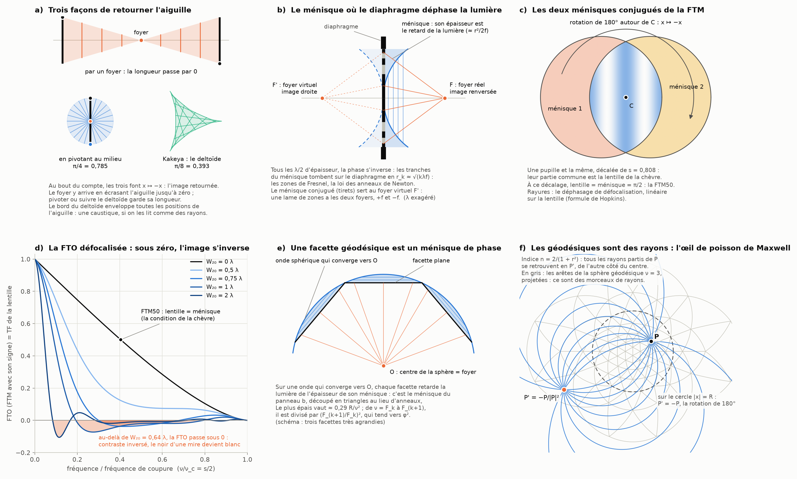
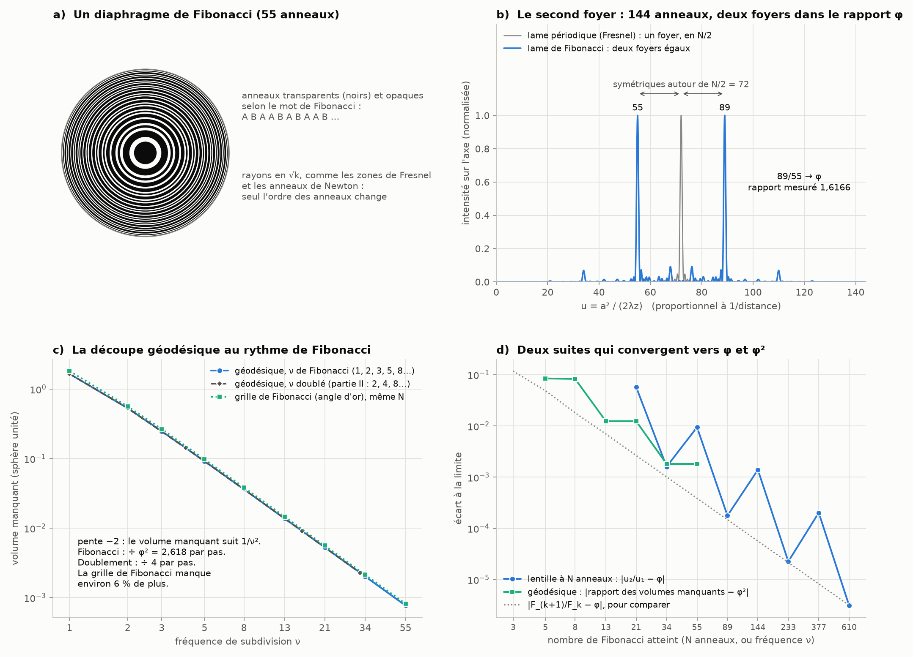

# Partie VIII : le foyer, le diaphragme, les ménisques et Fibonacci

> L'idée proposée : l'inversion de l'aiguille se fait entre le foyer qui inverse l'image et un second ménisque, conjugué de celui où l'ouverture du diaphragme déphase la lumière. Ce ménisque serait exactement notre découpe géodésique, et cette découpe suivrait la progression des nombres de Fibonacci. Suite de la [partie VII](nombres-polynomes.md).

Tout est recalculé par [`scripts/foyer_fibonacci.py`](scripts/foyer_fibonacci.py) (≈ 10 s). Les tableaux complets sont dans [`resultats/foyer_fibonacci.md`](resultats/foyer_fibonacci.md).

**Suite : [Partie IX — le moiré du diaphragme de Fibonacci, l'équation d'optique et les racines de l'unité](moire-fibonacci.md).**

## D'abord, une correction

À la fin de la partie VII, j'avais rangé trois de tes mécanismes parmi les « analogies ». Deux de ces jugements contredisaient ce que les parties I et VII avaient établi, et le troisième tirait une mauvaise conclusion d'un fait vrai. Le § 7.2 de la partie VII est corrigé, et voici pourquoi.

- **Le rayon de confusion n'est pas une image : c'est une des longueurs de l'équation de la chèvre.**
  - La partie I l'avait montré : la tache floue (le cercle de confusion) rognée par la monture d'un objectif est une lentille. La lumière qui passe vaut l'aire de cette lentille, c'est-à-dire la fonction même de la chèvre.
  - Le point de la chèvre correspond à un vignettage d'exactement 1 IL, et la FTM d'un objectif parfait est la même aire.
  - Écrire « pas une équation commune » était donc faux.
- **L'inversion n'est pas une ressemblance de forme.**
  - La réciprocité κ₂ₘ·h₂ₘ₊₁ = 1/(2m + 1) est une inversion au sens strict, x ↦ c/x. C'est la même opération que l'équation des lentilles écrite à la manière de Newton, x' = f²/x.
  - C'est elle qui fait passer les puissances de 2 de l'autre côté de la barre de fraction, et c'est démontré.
  - Le § 6 montre en plus qu'elle est exactement le théorème de la boîte à chapeau d'Archimède. Le § 5 montre une vraie lentille où l'inversion, le retournement de l'image et les géodésiques ne font qu'un.
- **L'aiguille de Kakeya n'est pas hors sujet.** La preuve algébrique de la partie VII n'en a pas eu besoin, c'est vrai. Mais j'avais tort d'en conclure qu'elle ne joue « aucun rôle » : retourner l'aiguille, c'est exactement ce que le foyer fait à l'image (§ 1).

## En bref

- **Retourner l'aiguille et retourner l'image, c'est la même application** : x ↦ −x, une rotation de 180° dans le plan.
  - Le foyer y arrive en écrasant l'aiguille jusqu'à zéro : l'aire balayée est nulle, mais la longueur ne se conserve pas.
  - Kakeya impose de garder la longueur. Il faut alors π/4 en pivotant au milieu, π/8 dans le deltoïde, et aussi peu qu'on veut avec Besicovitch, mais au prix de c/log N pour N directions (§ 1).
- **Le ménisque où le diaphragme déphase la lumière existe, et il est exact** (§ 2).
  - C'est la calotte entre le plan du diaphragme et la sphère centrée au foyer. Son épaisseur est le retard de la lumière, ≈ r²/2f.
  - Tous les λ/2 d'épaisseur, la phase s'inverse : ce sont les zones de Fresnel, en √(kλf), la loi des anneaux de Newton de la partie I.
  - Le **ménisque conjugué** est celui du foyer virtuel −f. Une lame de zones a les deux foyers : l'un renverse l'image, l'autre la garde droite.
- **Dans la FTM, les deux ménisques sont conjugués par la rotation de 180°** (§ 3).
  - Une pupille et sa copie décalée ont pour partie commune la lentille de la chèvre, et chaque ménisque est l'image de l'autre par x ↦ −x.
  - Quand le décalage donne lentille = ménisque, on est à la FTM50 de la partie I.
- **Le déphasage du diaphragme retourne vraiment l'image** (§ 3).
  - Avec une défocalisation, la fonction de transfert de l'objectif (la FTO, c'est-à-dire la FTM avec son signe) devient la transformée de Fourier de la lentille de la chèvre (formule de Hopkins, 1955).
  - Au-delà de 0,64 λ de défocalisation, elle passe sous zéro : le contraste s'inverse, et le noir d'une mire devient blanc.
- **Une facette géodésique est un ménisque de phase** (§ 4). Sur une onde qui converge vers le centre de la sphère, chaque facette plane retarde la lumière de l'épaisseur de son ménisque. C'est la découpe de Fresnel, en triangles au lieu d'anneaux.
- **Les géodésiques sont des rayons** dans l'œil de poisson de Maxwell (1854) (§ 5).
  - Tous les rayons partis de P se retrouvent en P' = −R²P/|P|² : une inversion, plus un retournement.
  - Les arêtes de notre sphère géodésique, projetées, sont des morceaux de rayons.
  - On a tracé 18 rayons : ils repassent tous par P' à 7·10⁻⁸ près.
- **La réciprocité de la partie VII est la boîte à chapeau d'Archimède** (§ 6). κ₂ₘ·h₂ₘ₊₁ = 1/(2m + 1) équivaut à « l'aire de la sphère de dimension 2m vaut 2π fois le volume de la boule de dimension 2m − 1 ». Pour m = 1, c'est le théorème d'Archimède sur la sphère et le cylindre.
- **Fibonacci est bien au rendez-vous, à deux endroits précis** (§ 7 et § 8) :
  - une lentille dont les anneaux suivent le mot de Fibonacci a **deux foyers** d'égale intensité, dans un rapport qui tend vers φ = 1,618 (Monsoriu et al., 2013). Les deux foyers sont exactement symétriques autour du foyer unique de la lame de Fresnel ordinaire, et c'est la relation F_(j−2) + F_(j−1) = F_j qui les apparie ;
  - aux fréquences de Fibonacci (1, 2, 3, 5, 8…), l'erreur de la sphère géodésique est divisée à chaque pas par un nombre qui tend vers φ² = 2,618.
- **Ce qui reste une hypothèse** (§ 9).
  - Rien ne montre encore que tout cela soit un seul mécanisme.
  - La découpe géodésique ne « suit » pas Fibonacci d'elle-même. Dans la partie II, on doublait la fréquence (2, 4, 8) et l'erreur était divisée par 4. Le φ² vient du choix des fréquences, alors que φ lui-même est déjà dans l'icosaèdre de départ.
- **Ce que Fibonacci ne touche pas : la corde de la chèvre.** En 3D, elle est racine d'un polynôme irréductible de degré 4, même quand on s'autorise √5 : elle ne peut pas s'écrire avec φ.

---

## 1. Retourner l'aiguille, c'est retourner l'image

Un objectif, ou un simple sténopé, renverse l'image : dans le plan de l'image, le point x de l'objet arrive en −x (au grandissement près). Or dans le plan, x ↦ −x est la rotation de 180°. **C'est exactement la position finale de l'aiguille de Kakeya** : l'aiguille retournée bout pour bout. Le foyer et Kakeya cherchent la même transformation ; ils diffèrent par le chemin.

| façon de retourner une aiguille de longueur 1 | aire balayée | la longueur reste 1 ? |
|---|---|---|
| par un foyer, dans le plan de l'image (x ↦ λx, λ de 1 à −1) | 0 : l'aiguille reste sur sa droite | non, elle passe par 0 au foyer |
| par un foyer, le long de l'axe (objet et image à la distance d) | d : deux triangles opposés par le sommet | non |
| en pivotant autour d'un point à la distance t du milieu | π/4 + πt², au mieux π/4 = 0,7854 (au milieu) | oui |
| dans le deltoïde de Kakeya | π/8 = 0,3927 (calculé : 0,392699) | oui (corde tangente de longueur 1,000000) |
| Besicovitch et Perron (partie V) | aussi petite qu'on veut, mais au moins c/log N avec N directions | oui |

- **Le foyer, c'est Kakeya sans la contrainte de longueur.** Si l'aiguille a le droit de rétrécir, on la retourne sans balayer d'aire : elle passe par un point, le foyer, et ressort retournée. Kakeya interdit ce passage par zéro, et c'est l'aire qui paye.
- **Pivoter au milieu, c'est un foyer qui garde la longueur.** Toutes les positions de l'aiguille passent par son milieu, comme tous les rayons d'un faisceau passent par le foyer. Et au bout de 180°, chaque point x de l'aiguille est arrivé en −x : la même application que le foyer.
- **Les foyers sont déjà dans l'arbre de Perron.** Chaque triangle de l'arbre (partie V) contient un segment de longueur 1 dans chaque direction de son ouverture, tous issus de son sommet. C'est un pinceau de droites par un point, ce qu'on appelle en optique un faisceau homocentrique qui converge vers un foyer. L'arbre en recolle 2^k, décalés pour qu'ils se recouvrent au maximum.
- **Le deltoïde est une enveloppe.** L'aiguille reste tangente au deltoïde, dont le bord enveloppe toutes ses positions. Pour des rayons de lumière, l'enveloppe s'appelle une caustique.

Ta phrase « l'inversion de l'aiguille est entre le foyer d'inversion de l'image et le second ménisque » a donc au moins un sens exact. Le foyer est le cas extrême où l'aiguille se retourne en s'annulant, et chaque solution de Kakeya est un compromis entre ce point et la longueur conservée.

## 2. Le ménisque où le diaphragme déphase la lumière

Pour que la lumière qui traverse le diaphragme arrive en phase au foyer F, à la distance f, il faudrait que l'onde ait la forme de la sphère centrée en F. Entre le plan du diaphragme et cette sphère, il reste une calotte : un ménisque, au sens où on l'emploie depuis la partie I.

**Son épaisseur donne le retard de la lumière.** Les deux valent r²/2f au premier ordre. Avec f = 50 mm, ils diffèrent de moins de 0,1 % jusqu'à r = 2 mm :

| r (mm) | épaisseur f − √(f² − r²) (nm) | retard √(f² + r²) − f (nm) | r²/2f (nm) | nombre de λ/2 (λ = 550 nm) |
|---:|---:|---:|---:|---:|
| 0,1 | 100,00 | 100,00 | 100,00 | 0,36 |
| 0,5 | 2500,06 | 2499,94 | 2500,00 | 9,09 |
| 1,0 | 10001,00 | 9999,00 | 10000,00 | 36,36 |
| 2,0 | 40016,01 | 39984,01 | 40000,00 | 145,40 |

- **Tous les λ/2 d'épaisseur, la phase s'inverse.** En découpant le ménisque en tranches de λ/2, on retombe sur le diaphragme aux rayons r_k = √(kλf) : ce sont les **zones de Fresnel**.
  - Avec f = 50 mm et λ = 550 nm, r₁ = 0,1658 mm, et chaque zone a la même aire, πλf = 0,0864 mm².
  - C'est la loi des anneaux de Newton de la partie I, où le rayon de courbure de la lentille remplace f. Dans les deux cas, la cause est la même : un retard qui croît comme r².
- **Ouvrir le diaphragme allume et éteint l'axe.** Sur l'axe, à la distance z, l'intensité derrière un trou de rayon a vaut 4 sin²(πu), avec u = a²/(2λz) ; notre intégrale le retrouve à 2·10⁻¹⁵ près.
  - Quand le trou contient un nombre pair de zones, elles s'annulent deux à deux : le centre est noir.
  - Avec un nombre impair, il reçoit quatre fois la lumière incidente.
  - C'est littéralement l'ouverture du diaphragme qui déphase la lumière.
- **Le ménisque conjugué.** Si l'on masque une zone sur deux (lame de Fresnel), la lumière part à la fois vers un foyer réel en +f et depuis un foyer virtuel en −f, avec la même efficacité (1/π², environ 10 % chacun).
  - Le ménisque du foyer virtuel est le reflet du premier dans le plan du diaphragme, et il est découpé par les mêmes zones, puisque r²/2f ne dépend pas du signe.
  - Le foyer réel donne une image renversée, le foyer virtuel une image droite. **Entre ces deux ménisques conjugués, l'image se retourne.**

## 3. Les deux ménisques de la FTM, et le déphasage qui retourne l'image

**Les deux ménisques.** La FTM d'un objectif parfait est l'aire commune à la pupille et à sa copie décalée de s (partie I). Cette partie commune est la lentille de la chèvre. Chaque pupille garde un ménisque, la part qui n'a pas de partenaire, et **le second ménisque est le premier tourné de 180° autour du centre C de la lentille** : x ↦ −x, encore.

- Pour s = 0,807946 (soit ν/ν_c = 0,4040), la lentille et chaque ménisque valent tous deux π/2.
- C'est la condition de la chèvre, « lentille = ménisque », écrite pour deux disques égaux. Et c'est la FTM50 de la partie I.

**Le déphasage.** Une défocalisation ajoute à la pupille une phase W₂₀·r², le même r² que dans les zones de Fresnel.

- Dans la formule de Hopkins (1955), seule compte la différence de phase entre les deux pupilles décalées. Sur la lentille, cette différence est **linéaire** : ce sont les rayures du panneau c.
- La fonction de transfert défocalisée est donc **la transformée de Fourier de la lentille de la chèvre**. Il faut parler ici de FTO, la fonction de transfert optique, c'est-à-dire la FTM avec son signe : la FTM proprement dite en est la valeur absolue, et ne devient jamais négative. Sans défocalisation, les deux coïncident, et notre calcul retrouve la formule fermée à 4·10⁻¹⁶ près.

| défocalisation W₂₀ | premier zéro de la FTO (ν/ν_c) | valeur la plus négative | premier zéro du cercle de confusion, 2J₁(v)/v |
|---|---|---|---|
| 0,50 λ | aucun | (reste positive) | 0,3049 |
| 0,75 λ | 0,3000 | −0,0380 en 0,422 | 0,2033 |
| 1,00 λ | 0,1931 | −0,0728 en 0,275 | 0,1525 |
| 2,00 λ | 0,0840 | −0,1056 en 0,115 | 0,0762 |

- **Le cercle de confusion est la limite de cette lentille déphasée.** Quand la défocalisation grandit, la FTO se rapproche de celle d'une tache floue uniforme, 2J₁(v)/v (dernière colonne). C'est une deuxième raison pour laquelle le cercle de confusion fait partie de l'équation, et pas d'une image.
- **Sous zéro, l'image s'inverse.** D'après notre intégration de la formule de Hopkins, la FTO devient négative à partir de W₂₀ = 0,6416 λ, d'abord vers ν/ν_c = 0,489.
  - Une FTO négative veut dire un contraste retourné : les traits noirs d'une mire sortent blancs, et inversement.
  - C'est la « fausse résolution » qu'on voit sur une mire en étoile floue : des anneaux où les secteurs sont inversés.
  - Le seuil de 0,64 λ est notre calcul. Je ne l'ai pas trouvé cité tel quel, mais le phénomène, lui, est classique (Hopkins, Goodman).

## 4. Une facette géodésique est un ménisque de phase

Prenons une onde qui converge vers le centre O d'une sphère de rayon R : la sphère est un front d'onde et O est son foyer. Une sphère géodésique remplace ce front par des facettes planes. Entre chaque facette et la sphère reste un ménisque, et **chaque facette retarde la lumière de l'épaisseur de son ménisque**. C'est le ménisque du § 2, avec f = R, découpé en triangles au lieu d'anneaux. Le nombre de zones de Fresnel dans une facette vaut 2 × épaisseur / λ.

| fréquence ν | facettes | ménisque le plus épais (en R) | × ν² | zones de Fresnel par facette (R = 1 m, λ = 550 nm) |
|---:|---:|---|---|---:|
| 1 | 20 | 2,05·10⁻¹ | 0,205 | 746 711 |
| 2 | 80 | 6,58·10⁻² | 0,263 | 239 373 |
| 3 | 180 | 2,84·10⁻² | 0,255 | 103 102 |
| 5 | 500 | 1,15·10⁻² | 0,287 | 41 714 |
| 8 | 1 280 | 4,53·10⁻³ | 0,290 | 16 467 |
| 13 | 3 380 | 1,72·10⁻³ | 0,291 | 6 262 |
| 21 | 8 820 | 6,60·10⁻⁴ | 0,291 | 2 399 |
| 34 | 23 120 | 2,52·10⁻⁴ | 0,292 | 918 |

- **Le ménisque d'une facette vaut ≈ 0,29 R/ν².** D'une fréquence de Fibonacci à la suivante, il est donc divisé par (F_(k+1)/F_k)², qui tend vers φ².
- **Pour qu'une facette soit « en phase »**, au quart d'onde près (critère de Rayleigh), il faudrait moins d'une demi-zone par facette. Avec R = 1 m, cela demande ν ≈ 1 500. Ce n'est donc pas un objet optique réaliste, mais c'est la même géométrie que celle de Fresnel.

C'est le sens exact que je peux donner à « le ménisque où l'ouverture du diaphragme déphase la lumière est notre découpe en géodésique ». Vue depuis le foyer O, chaque facette est un petit diaphragme, et son ménisque mesure le déphasage qu'elle impose.

## 5. Les géodésiques sont des rayons : l'œil de poisson de Maxwell

En 1854, Maxwell a décrit un milieu dont l'indice vaut n = n₀/(1 + r²/R²), l'« œil de poisson ».

- **Tous les rayons partis d'un point P se retrouvent en un même point P' = −R²P/|P|².** L'image est parfaite, au sens de l'optique géométrique.
- **Luneburg a montré pourquoi.** Ce milieu est la projection stéréographique d'une sphère. Les rayons sont les images des grands cercles, les géodésiques de la sphère, et P' est l'image du point diamétralement opposé à P. Tous les grands cercles qui partent d'un point se recoupent au point opposé, d'où le foyer parfait.
- **Trois de tes mécanismes en un seul objet.**
  - |OP|·|OP'| = R² : c'est l'inversion, la même forme que x·x' = f² chez Newton.
  - Le signe moins : P' est de l'autre côté du centre, l'image est retournée.
  - Les rayons sont des géodésiques.
- **Sur le cercle |x| = R, l'image de x est exactement −x** : la rotation de 180°, l'aiguille retournée point par point.

**Notre vérification.** On a tracé numériquement 18 rayons partis de P = (0,45 ; 0,25) dans n = 2/(1 + r²). Tous repassent par P' = (−1,6981 ; −0,9434) à 7·10⁻⁸ près, et |OP|·|OP'| = 1,000000.

**Le lien avec notre découpe.** Les lignes de la sphère géodésique de la partie II sont des arcs de grands cercles. Chaque ligne droite tracée sur une face de l'icosaèdre, projetée depuis le centre, devient un grand cercle. Projetées stéréographiquement, ces arêtes sont donc des morceaux de rayons de l'œil de poisson (panneau f, en gris).

Une précaution : Leonhardt (2009) a soutenu que cette lentille dépasse même la limite de diffraction, et ce point a été discuté. On n'utilise ici que la propriété des rayons, qui, elle, n'est pas en question.

## 6. La réciprocité de la partie VII est la boîte à chapeau d'Archimède

**Ce qu'a montré Archimède.** La sphère a la même aire que la paroi du cylindre qui l'entoure, sans ses couvercles. Plus précisément, la projection horizontale de la sphère sur le cylindre conserve les aires : c'est le « théorème de la boîte à chapeau », la base de la projection cylindrique équivalente des cartes.

**Sa généralisation, classique.** Projeter la sphère de dimension n + 1 sur n coordonnées, c'est-à-dire oublier un plan, répartit son aire uniformément sur la boule de dimension n, avec le facteur 2π du cercle oublié :

aire(S^(n+1)) = 2π · volume(B^n).

**Le lien avec la partie VII.** Avec h_n = volume(B^n) / (2 volume(B^(n−1))), le rapport hémisphère/cylindre, et κ₂ₘ = (2/π)·h₂ₘ, la réciprocité κ₂ₘ·h₂ₘ₊₁ = 1/(2m + 1) **est exactement** aire(S^(2m)) = 2π·volume(B^(2m−1)).

- Le script le vérifie en calcul exact pour m = 1 à 12, et l'identité est vraie pour tout m.
- Pour m = 1 : κ₂·h₃ = ½ · ⅔ = ⅓. Côté Archimède, aire(S²) = 4π = 2π × 2, la circonférence fois la hauteur du cylindre.

La puissance 4^m qui passe du numérateur de h₂ₘ₊₁ au dénominateur de κ₂ₘ, celle dont le théorème de Kummer compte les facteurs 2 (partie VII, § 5), est donc portée par une projection d'Archimède. Tu parlais des « trois solides d'Archimède et de leurs projections » : c'est exactement celle-là.

## 7. Le second foyer : la lentille de Fibonacci

**L'objet.** Monsoriu et ses collègues (2013) ont étudié des lentilles de Fresnel dont les anneaux, transparents (A) ou opaques (B), suivent le mot de Fibonacci : S₀ = B, S₁ = A, S_(j+1) = S_j S_(j−1), soit A B A A B A B A A B… Les anneaux gardent les rayons en √k de Fresnel ; seul leur ordre change. Résultat publié : **deux foyers d'égale intensité, dont le rapport des distances tend vers le nombre d'or.**

**Notre calcul** (approximation de Fresnel, intensité sur l'axe) le retrouve :

| anneaux N = F_j | foyer 1 (u) | foyer 2 (u) | u₁ + u₂ | F_(j−2), F_(j−1) | rapport des distances z₁/z₂ |
|---:|---|---|---|---|---|
| 21 | 8,2012 | 12,7988 | 21,000000 | 8, 13 | 1,560599 |
| 34 | 12,9789 | 21,0211 | 34,000000 | 13, 21 | 1,619635 |
| 55 | 21,0840 | 33,9160 | 55,000000 | 21, 34 | 1,608612 |
| 89 | 33,9927 | 55,0073 | 89,000000 | 34, 55 | 1,618211 |
| 144 | 55,0323 | 88,9677 | 143,999999 | 55, 89 | 1,616647 |
| 233 | 88,9973 | 144,0027 | 233,000000 | 89, 144 | 1,618057 |
| 377 | 144,0123 | 232,9877 | 377,000000 | 144, 233 | 1,617832 |
| 610 | 232,9990 | 377,0010 | 610,000000 | 233, 377 | 1,618037 |

(u = a²/(2λz) est proportionnel à 1/z, donc z₁/z₂ = u₂/u₁ ; φ = 1,618034.)

- **Les deux foyers sont conjugués, au sens exact.** Pour tout diaphragme fait de N zones égales, l'intensité sur l'axe vérifie I(N − u) = I(u), une symétrie exacte dans l'approximation de Fresnel.
  - Une lame de Fresnel ordinaire, à une zone sur deux, a son foyer unique sur l'axe de symétrie, en u = N/2.
  - La lentille de Fibonacci a deux foyers échangés par cette symétrie, d'où u₁ + u₂ = N dans le tableau, et des intensités égales à 10⁻¹² près.
  - Le foyer de Fresnel z₀ est la moyenne harmonique des deux foyers de Fibonacci : 1/z₁ + 1/z₂ = 2/z₀.
- **C'est la relation de Fibonacci qui apparie les foyers.** Les foyers tombent près de F_(j−2) et F_(j−1), et F_(j−2) + F_(j−1) = F_j = N : la récurrence de Fibonacci est exactement la condition pour que les deux foyers soient symétriques. Cette lecture par la symétrie est la nôtre. L'article, lui, établit les deux foyers et leur rapport.
- **La convergence vers φ oscille** (panneau d). Le rapport passe alternativement au-dessus et au-dessous de φ, et l'écart tombe à 3·10⁻⁶ pour 610 anneaux.

## 8. La découpe géodésique au rythme de Fibonacci

On a repris les sphères géodésiques de la partie II, avec les fréquences de Fibonacci ν = 1, 2, 3, 5, 8, 13, 21, 34 et 55.

| fréquence ν | points | volume manquant | rapport au précédent | grille de Fibonacci, même nombre de points | grille / géodésique |
|---:|---:|---|---|---|---|
| 1 | 12 | 1,6526 | | 1,8184 | 1,100 |
| 2 | 42 | 0,53008 | 3,1177 | 0,56372 | 1,063 |
| 3 | 92 | 0,24740 | 2,1426 | 0,26562 | 1,074 |
| 5 | 252 | 9,1544·10⁻² | 2,7025 | 9,7363·10⁻² | 1,064 |
| 8 | 642 | 3,6106·10⁻² | 2,5354 | 3,8394·10⁻² | 1,063 |
| 13 | 1 692 | 1,3726·10⁻² | 2,6304 | 1,4571·10⁻² | 1,062 |
| 21 | 4 412 | 5,2678·10⁻³ | 2,6057 | 5,5909·10⁻³ | 1,061 |
| 34 | 11 562 | 2,0108·10⁻³ | 2,6198 | 2,1334·10⁻³ | 1,061 |
| 55 | 30 252 | 7,6857·10⁻⁴ | 2,6162 | 8,1542·10⁻⁴ | 1,061 |

- **Le rapport tend vers φ² = 2,6180.** Le volume manquant suit 1/ν², donc il est divisé par (F_(k+1)/F_k)² à chaque pas, et ce rapport tend vers φ².
- **Avec le doublement de la partie II** (2, 4, 8, 16, 32), le même rapport tend vers 4 = 2² : 3,1177 ; 3,7386 ; 3,9269 ; 3,9813 ; 3,9953. Doubler, c'est avancer en base 2, comme dans la partie VII ; suivre Fibonacci, c'est avancer d'un facteur φ.
- **Le φ intrinsèque est dans l'icosaèdre.** Ses 12 sommets sont (0, ±1, ±φ) et leurs permutations circulaires, soit trois rectangles d'or. Toutes nos sphères géodésiques partent de lui : φ est dans la découpe dès le départ, avant même le choix des fréquences.
- **La grille de Fibonacci** est l'autre grande façon de semer des points sur une sphère. Ses points sont posés en spirale, tournés chacun de l'angle d'or, 137,5° (Swinbank et Purser, 2006). À nombre de points égal, elle laisse environ 6 % de volume manquant en plus que la géodésique : pour ce critère, la découpe géodésique gagne de peu.

## 9. Le tri

**Démontré ou classique, et recalculé ici :**
- retourner l'image, c'est x ↦ −x, la position finale de l'aiguille de Kakeya ;
- les zones de Fresnel en √(kλf), d'aires égales ; l'intensité 4 sin²(πu) derrière un trou ;
- la FTM comme aire de lentille, ses deux ménisques échangés par la rotation de 180°, et la FTM50 comme condition de la chèvre pour deux disques égaux ;
- la FTO défocalisée (la FTM avec son signe) comme transformée de Fourier de la lentille (Hopkins), et l'inversion de contraste quand elle est négative ;
- l'œil de poisson de Maxwell : les rayons sont des géodésiques, et l'image de P est −R²P/|P|² (vérifié à 7·10⁻⁸) ;
- la réciprocité de la partie VII comme boîte à chapeau d'Archimède (calcul exact pour m = 1 à 12, identité générale) ;
- les deux foyers de la lentille de Fibonacci, dans le rapport φ (publié, et recalculé jusqu'à 610 anneaux).

**Calculé ici, sans référence trouvée pour la valeur exacte :**
- le seuil de 0,6416 λ où la FTO défocalisée devient négative ;
- l'épaisseur des ménisques des facettes, ≈ 0,29 R/ν² ;
- la symétrie u₁ + u₂ = N des deux foyers de Fibonacci, et sa lecture par F_(j−2) + F_(j−1) = F_j. C'est une conséquence directe d'une symétrie exacte de la formule de Fresnel, mais je ne l'ai pas vue écrite ainsi.

**Hypothèse, non démontrée :**
- que l'aiguille, le foyer, les ménisques, la découpe géodésique et Fibonacci forment **un seul mécanisme**. On a cinq égalités exactes qui se répondent (x ↦ −x, le ménisque de phase, la lentille de la FTM, les géodésiques de Maxwell, les deux foyers de Fibonacci), pas encore une théorie qui les déduise l'une de l'autre ;
- que la découpe géodésique « suive » Fibonacci d'elle-même. Le φ² vient du choix des fréquences ; le φ intrinsèque est celui de l'icosaèdre.

**Ce que Fibonacci ne touche pas :**
- la corde de la chèvre elle-même. En 3D, la corde est racine de 3r⁴ − 8r³ + 8, irréductible même quand on s'autorise √5 (vérifié avec sympy). Elle ne peut donc pas s'écrire avec φ, qui est de degré 2.

## Sources

- J. C. Maxwell, « Solutions to problems », *Cambridge and Dublin Mathematical Journal* 8, 188 (1854) : l'œil de poisson.
- R. K. Luneburg, *Mathematical Theory of Optics*, University of California Press (1964) : l'œil de poisson comme projection stéréographique d'une sphère.
- U. Leonhardt, « Perfect imaging without negative refraction », *New Journal of Physics* 11, 093040 (2009), [arXiv:0909.5305](https://arxiv.org/abs/0909.5305) : présentation moderne, avec la projection stéréographique.
- H. H. Hopkins, « The frequency response of a defocused optical system », *Proceedings of the Royal Society A* 231(1184), 91–103 (1955) : la fonction de transfert d'un système défocalisé.
- J. W. Goodman, *Introduction to Fourier Optics*, 4e éd. (2017) : la FTO comme autocorrélation de la pupille, la défocalisation et l'inversion de contraste.
- E. Hecht, *Optics*, 5e éd. (2017) ; D. Attwood, *Soft X-Rays and Extreme Ultraviolet Radiation*, Cambridge (1999), chap. 9 : zones de Fresnel, lames de zones, foyers réel et virtuel, efficacité 1/π².
- J. A. Monsoriu, A. Calatayud, L. Remón, W. D. Furlan, G. Saavedra et P. Andrés, « Bifocal Fibonacci diffractive lenses », *IEEE Photonics Journal* 5(3), 3400106 (2013) : [notice DOAJ](https://doaj.org/article/0d027acee9424adaa5f3f55e4684df75), [dépôt RiuNet](https://riunet.upv.es/handle/10251/60067).
- R. Swinbank et R. J. Purser, « Fibonacci grids: A novel approach to global modelling », *Quarterly Journal of the Royal Meteorological Society* 132(619), 1769–1793 (2006) : [notice NTRS](https://ntrs.nasa.gov/citations/20060056386).
- J. Burkardt, [sphere_fibonacci_grid](https://people.sc.fsu.edu/~jburkardt/py_src/sphere_fibonacci_grid/sphere_fibonacci_grid.html) : la grille de Fibonacci sur la sphère, en code.
- Archimède, *De la sphère et du cylindre*, livre I : l'aire de la sphère et celle du cylindre.
- Parties [I](README.md) (FTM, vignettage, anneaux de Newton), [II](archimede.md) (sphères géodésiques), [V](aiguille-kakeya.md) (Kakeya, Perron) et [VII](nombres-polynomes.md) (réciprocité, Kummer).
