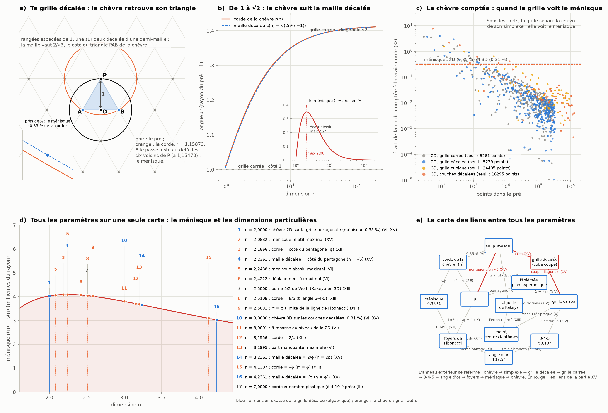

# Partie XV : la grille décalée, où la chèvre retrouve son simplexe

> Ta réponse à la partie XIV : c'est normal, la corde de la chèvre arrive entre la 2e et la 3e dimension, lorsque la grille de points se décale, une ligne sur deux, d'une moitié de la distance entre deux points. C'est à ce moment que le ménisque entre en jeu et que la précision augmente. Tu remarques aussi que j'ai laissé de côté plusieurs paramètres que nous travaillons pour en préciser quelques-uns : c'est bien, mais il faut continuer de tous les travailler ensemble.
>
> Suite de la [partie XIV](aiguille-grille.md).

Tout est recalculé par [`scripts/grille_decalee.py`](scripts/grille_decalee.py) (≈ 20 s). Les tableaux complets sont dans [`resultats/grille_decalee.md`](resultats/grille_decalee.md).

**Suite : [Partie XVI — ménisque et projection, les disques qui se touchent](menisque-projection.md).**

## En bref

- **Tu as raison, et je corrige ma phrase de la partie XIV.** J'avais écrit ne pas trouver de lien direct entre la grille et la corde de la chèvre. Le lien existe : c'est ta grille décalée.
  - On espace les rangées de 1 (la distance du piquet au centre) et on décale une rangée sur deux d'une demi-maille, avec des triangles équilatéraux. La maille vaut alors 2/√3 = 1,15470, exactement le côté du triangle de la chèvre (partie VI).
  - La corde, 1,15873, passe juste au-delà des six voisins du piquet : 0,35 % plus loin. C'est le ménisque.
  - En 3D, les couches décalées (l'empilement le plus dense de l'espace) donnent √(3/2) = 1,22474, à 0,31 % de la corde 3D.
  - La grille carrée, elle, n'offre que 1 et √2, à 14 % et 22 % de la corde : le décalage d'une demi-maille divise l'écart par 40.
- **C'est entre la 2e et la 3e dimension que le ménisque est le plus grand.** L'écart relatif culmine en n = 2,08 et l'écart absolu en n = 2,24. Ensuite la précision augmente : 0,25 % en 4D, 0,08 % en 10D, et la chèvre et la maille tendent ensemble vers √2.
- **La grille décalée est la grille carrée d'une dimension de plus, coupée en diagonale.** Le triangle de la chèvre 2D est un coin du cube 3D, et son tétraèdre 3D un coin de l'hypercube 4D. C'est un sens précis à « entre la 2e et la 3e dimension ».
- **La grille voit le ménisque à partir d'une certaine taille.**
  - Comptée sur une grille, la chèvre se confond avec son simplexe tant que la grille est grossière.
  - En 2D, il faut environ 5 000 points, sur les deux grilles.
  - En 3D, il en faut 16 000 sur la grille décalée, contre 24 000 sur la grille cubique. Celle-ci retombe souvent pile sur l'arête du tétraèdre.
- **Les dimensions d'or de la grille décalée sont exactes.** Sa maille vaut le côté du pentagone en n = √5, 2/φ en n = 2φ, et √φ en n = φ³. La chèvre atteint les mêmes valeurs un peu plus tôt (2,187 ; 3,156 ; 4,131) : le ménisque les décale de 0,05 à 0,1.
- **L'aiguille sur la grille décalée.**
  - Elle a 6 directions dès la longueur 1. Le triangle 5-7-8 (38,21°) y joue le rôle du 3-4-5.
  - Pour échantillonner une image, la grille décalée demande 13,4 % de points en moins (Petersen et Middleton, 1962) : la précision augmente là aussi.
- **Tous les paramètres ensemble.** Une carte réunit les 17 dimensions particulières trouvées depuis la partie III. Une autre relie tous les paramètres : leurs liens forment un anneau qui se referme.

---

## 1. Ta grille décalée est la grille carrée coupée en diagonale

**En 2D** (panneau a).
- On espace les rangées de 1, la distance OP du centre au piquet, et on décale une rangée sur deux d'une demi-maille.
- Avec des triangles équilatéraux, la maille vaut 2/√3 : c'est la grille hexagonale.
- Son triangle est exactement celui de la chèvre de la partie VI : le sommet en P, la base AB sur la rangée qui passe par O.

**En dimension n.**
- La même construction donne le réseau A_n : la grille cubique de dimension n + 1, coupée par le plan x₁ + … + x_{n+1} = 0.
- Pour n = 2, la grille cubique 3D coupée par le plan x + y + z = 0 donne exactement la grille hexagonale, aux rangées décalées d'une demi-maille.
- Son simplexe a pour sommets e₁, …, e_{n+1}, les points à distance 1 de l'origine sur chaque axe. Son arête vaut √2, la diagonale d'une face du cube, et sa hauteur √((n+1)/n).
- Ramenée à la hauteur 1, son arête vaut s(n) = √(2n/(n+1)) : 1 ; 2/√3 ; √(3/2) ; … ; vers √2. C'est le simplexe de la chèvre (partie VI).

| n | hauteur du simplexe e₁…e_{n+1} | arête ramenée à la hauteur 1 |
|---:|---|---|
| 1 | √2 = 1,4142 | 1 |
| 2 | 1,2247 | 2/√3 = 1,1547 |
| 3 | 1,1547 | √(3/2) = 1,2247 |
| 6 | 1,0801 | 1,3093 |

- **En 3D**, ce réseau est l'empilement des couches hexagonales décalées : la grille cubique à faces centrées. Les deux ont les mêmes nombres de points à chaque distance (12, 6, 24, 12 pour les distances² 2, 4, 6, 8).
- C'est l'empilement le plus dense de l'espace : la conjecture de Kepler, démontrée par Hales.

**C'est un sens précis à « entre la 2e et la 3e dimension ».** Le triangle de la chèvre 2D est un coin du cube 3D : les points (1, 0, 0), (0, 1, 0), (0, 0, 1). La grille de la chèvre plane est la grille de l'espace, vue le long de sa grande diagonale.

**Une variante qui rejoint la partie XIV.**
- Si l'on décale une rangée sur deux d'une grille carrée en gardant les rangées espacées de 1, on obtient une grille en « briques ».
- Sa diagonale vaut √5/2 = φ − 1/2 : c'est la construction d'Euclide du nombre d'or.
- Son triangle a l'angle au sommet 2·arctan(1/2) = 53,13°, l'angle du 3-4-5 de la grille carrée (partie XIV).

## 2. La corde et la maille : le ménisque

| n | corde r(n) | maille s(n) | écart | écart relatif |
|---:|---|---|---|---|
| 1,5 | 1,098684 | 1,095445 | 0,003239 | 0,30 % |
| 2 | 1,158728 | 1,154701 | 0,004028 | 0,35 % |
| 2,5 | 1,199270 | 1,195229 | 0,004042 | 0,34 % |
| 3 | 1,228545 | 1,224745 | 0,003800 | 0,31 % |
| 4 | 1,268079 | 1,264911 | 0,003168 | 0,25 % |
| 10 | 1,349535 | 1,348400 | 0,001136 | 0,08 % |
| 100 | 1,407217 | 1,407195 | 0,000022 | 0,0015 % |

**Le ménisque entre en jeu entre 2D et 3D** (panneau b).
- L'écart relatif culmine en n = 2,08 (0,3495 %) et l'écart absolu en n = 2,24 (partie VI).
- Ensuite, la précision augmente : la maille décalée suit la chèvre de plus en plus près.
- Toutes deux vont de 1, le côté du carré, à √2, sa diagonale.

**La précision de chaque grille.** Rangées ou couches espacées de 1 ; meilleure distance offerte, comparée à la corde :

| grille | distance | écart à la corde |
|---|---|---|
| carrée (2D), côté | 1 | −13,7 % |
| carrée (2D), diagonale | √2 | +22,0 % |
| brique (2D), diagonale | √5/2 | −3,5 % |
| **décalée (2D), maille** | **2/√3** | **−0,35 %** |
| cubique (3D), côté | 1 | −18,6 % |
| **couches décalées (3D), maille** | **√(3/2)** | **−0,31 %** |

Sur la grille décalée, les six voisins du piquet sont tous à la distance 2/√3. La corde de la chèvre passe juste au-delà d'eux, d'un ménisque de 0,004 (zoom du panneau a).

## 3. La chèvre comptée : quand la grille voit le ménisque

**Le test** (panneau c).
- On pose la chèvre sur la grille elle-même : un pré de rayon N mailles, le piquet sur un point de la grille.
- On compte les points du pré. La corde est la distance au piquet du point qui laisse la moitié des points derrière lui.
- La grille « voit » le ménisque quand cette corde comptée est plus près de la vraie corde de la chèvre que de l'arête du simplexe.

| grille | voit le ménisque | toujours à partir de | points du pré | retombe pile sur le simplexe |
|---|---|---|---|---|
| carrée (2D) | 95 % des tailles | N = 41 | 5 261 | jamais |
| décalée (2D) | 98 % des tailles | N = 38 | 5 239 | jamais |
| cubique (3D) | 83 % des tailles | N = 18 | 24 405 | N = 2, 4, 6, 12, 14 |
| couches décalées (3D) | 97 % des tailles | N = 14 | 16 295 | jamais |

**Ce qu'on voit.**
- En dessous de quelques milliers de points, la chèvre comptée se confond avec son simplexe : le ménisque n'existe pas encore pour la grille.
- Au-delà, il « entre en jeu ».
- En 3D, la grille décalée le voit plus tôt et plus souvent. La grille cubique contient les couches décalées (ses points de somme paire), et quand elle est grossière, elle retombe pile sur l'arête du tétraèdre √(3/2).
- Je nuance : à nombre de points égal, la chèvre comptée n'est pas plus précise en moyenne sur la grille décalée. En 2D, les deux grilles se valent. Le gain net est celui de la distance offerte (§ 2), pas celui du comptage.

## 4. Les dimensions d'or de la grille décalée

**La maille de la grille décalée suit une formule simple :** s(n)² = 2n/(n+1). Elle atteint donc une valeur v à la dimension n = v²/(2 − v²), qui est un nombre algébrique. Pour les valeurs d'or, ce sont des dimensions d'or :

| maille | dimension exacte de la grille décalée | dimension où la chèvre l'atteint | décalage |
|---|---|---|---|
| 2/√3 (hexagonale) | 2 | 1,9590 | 0,041 |
| 2 sin 36°, côté du pentagone | **√5** = 2,2361 | 2,1866 | 0,049 |
| 6/5 (triangle 3-4-5) | 18/7 = 2,5714 | 2,5108 | 0,061 |
| √(3/2) (couches décalées) | 3 | 2,9262 | 0,074 |
| 2/φ | **2φ** = 3,2361 | 3,1556 | 0,081 |
| √φ | **φ³** = 4,2361 | 4,1307 | 0,105 |

- La grille décalée de dimension √5 a exactement la maille du pentagone. Or φ = (1 + √5)/2 : la dimension elle-même porte le nombre d'or.
- La chèvre atteint chaque valeur un peu plus tôt. Le ménisque la décale d'une quantité qui grandit avec la dimension, de 0,04 à 0,1.
- Les valeurs φ trouvées pour la chèvre dans les parties XII et XIII (2,187 ; 3,156 ; 4,131) sont les copies, décalées par le ménisque, de dimensions exactes de la grille.

## 5. L'aiguille sur la grille décalée

**Les directions** (entiers d'Eisenstein).
- Une aiguille de longueur L, ses bouts sur la grille décalée de maille 1, a autant de directions que de points de la grille sur le cercle de rayon L. On les compte par la formule 6·Σ χ(d) sur les diviseurs d de L², avec χ(d) = 0, 1 ou −1 selon que d vaut 0, 1 ou 2 modulo 3.

| L | grille décalée | grille carrée (partie XIV) |
|---:|---:|---:|
| 1 | 6 | 4 |
| 5 | 6 | 12 |
| 7 | 18 | 4 |
| 13 | 18 | 12 |
| 91 = 7 × 13 | 54 | 12 |

- Sur la grille décalée, ce sont les nombres premiers de la forme 3k + 1 (7, 13, 19…) qui ouvrent des directions. Le 5 du triangle 3-4-5 n'en ouvre plus.
- C'est le triangle 5-7-8 (5² + 8² − 5·8 = 7², un angle de 60°) qui prend la place du 3-4-5. Son angle de rotation, arccos(11/14) = 38,21°, donne pour L = 7^k des directions dont les trous n'ont jamais plus de trois longueurs. C'est encore le théorème des trois distances.

**S'inverser.**
- Un bout fixé : 4 positions (0°, 60°, 120°, 180°) au lieu de 3 sur la grille carrée. Les triangles entre positions font 3√3/4 = 1,299, contre π/2 = 1,571 pour le demi-disque.
- Le milieu fixé : 3 positions, et l'hexagone de 3√3/2 = 2,598, contre π pour le disque.
- Chaque pas de rotation coûte au moins un triangle de la grille, la demi-maille.

**L'échantillonnage.**
- Pour une image dont les détails sont limités de la même façon dans toutes les directions, la grille décalée demande 13,4 % de points en moins que la grille carrée (Petersen et Middleton, 1962).
- À nombre de points égal, elle voit des détails 7,5 % plus fins.
- C'est pour cela que les centres fantômes du moiré dessinent un hexagone sur des pixels hexagonaux (partie X) : le réseau réciproque d'une grille décalée est une grille décalée.

## 6. Tous les paramètres ensemble

**La carte des dimensions** (panneau d). Toutes les dimensions particulières trouvées depuis la partie III, sur la courbe du ménisque :

| n | ce qui s'y passe | partie |
|---:|---|---|
| 2 | la chèvre 2D sur la grille hexagonale (0,35 %) | VI, XV |
| 2,083 | ménisque relatif maximal | XV |
| 2,187 | corde = côté du pentagone | XII |
| 2,236 = √5 | maille décalée = côté du pentagone | XV |
| 2,244 | ménisque absolu maximal | VI |
| 2,422 | déplacement δ maximal | VI |
| 2,5 | borne 5/2 de Wolff (Kakeya en 3D) | XIII |
| 2,511 | corde = 6/5 (triangle 3-4-5) | XIII |
| 2,583 | rⁿ = φ (ligne de Fibonacci) | XIII |
| 3 | la chèvre 3D sur les couches décalées (0,31 %) | VI, XV |
| 3,0000853 | δ repasse au niveau de la 2D | VI |
| 3,156 | corde = 2/φ | XIII |
| 3,200 | part manquante maximale | VI |
| 3,236 = 2φ | maille décalée = 2/φ | XV |
| 4,131 | corde = √φ | XIII |
| 4,236 = φ³ | maille décalée = √φ | XV |
| 7 | corde ≈ nombre plastique (coïncidence prouvée) | III |

**La carte des liens** (panneau e).
- Chaque paramètre est relié aux autres par au moins une relation exacte, établie dans une partie. L'anneau extérieur se referme :
  - la chèvre et le simplexe, par le ménisque de 0,35 % (VI) ;
  - le simplexe et la grille décalée, par la maille (XV) ;
  - la grille décalée et la grille carrée, par la coupe en diagonale (XV) ;
  - la grille carrée et le 3-4-5, par l'angle 2·arctan ½ (XIV) ;
  - le 3-4-5 et l'angle d'or, par les trois distances (XI, XIV) ;
  - l'angle d'or et les foyers de Fibonacci, par le même partage 1/φ² + 1/φ = 1 (IX, XI) ;
  - les foyers et le ménisque, par la FTM50 : la lentille de la chèvre dans la pupille (VIII) ;
  - le ménisque et la chèvre (VI).
- À l'intérieur, φ, l'aiguille de Kakeya, le moiré et Ptolémée relient les nœuds de l'anneau :
  - φ, par le pentagone en √5, rⁿ = φ et les foyers ;
  - l'aiguille, par le triangle 2/√3, ses directions et l'arbre de Perron tourné ;
  - le moiré, par le réseau réciproque et les nœuds ;
  - Ptolémée, par les aires λ et le pentagone.

**Les valeurs, rassemblées :**

| paramètre | valeur | parties |
|---|---|---|
| corde de la chèvre, 2D et 3D | 1,158728 ; 1,228545 | I, VI |
| maille décalée (simplexe), 2D et 3D | 2/√3 = 1,154701 ; √(3/2) = 1,224745 | V, VI, XV |
| ménisque | 0,35 % (2D), 0,31 % (3D), maximum en 2,08 et 2,24 | VI, XV |
| deltoïde de Kakeya / disque | π/8 contre π/4 : la moitié | V, VIII |
| foyers de Fibonacci | φ² et φ, avec 1/φ² + 1/φ = 1 | VIII, IX |
| angle d'or | 137,5078° ; 137,5° = 55/144 de tour | XI, XII |
| nœud 21 × 34 | 21/55 de tour par pixel | XIII |
| triangle 3-4-5 (grille carrée) | 53,13° | XIII, XIV |
| triangle 5-7-8 (grille décalée) | 38,21° | XV |
| FTO défocalisée | s'inverse au-delà de 0,64 λ | VIII |
| aiguilles de Fibonacci | une demi-case entre voisines ; écart × longueur² → 1/√5 | XIV |
| Kakeya sur une grille finie | la moitié du plan | XIV |
| Perron sur une grille | minimum en 1/log n | XIV |
| Kakeya en 3D | borne 5/2 (Wolff), dimension 3 (Wang et Zahl) | V, XIII |

## 7. Le tri

**Corrigé (tu avais raison) :** j'avais écrit, en partie XIV, ne pas trouver de lien direct entre la grille et la corde de la chèvre. Ce lien est ta grille décalée : sa maille est l'arête du simplexe de la chèvre, à un ménisque de 0,35 % près en 2D et de 0,31 % en 3D.

**Établi (calculé ici) :**
- la grille décalée est la grille cubique d'une dimension de plus, coupée en diagonale (A_n), et en 3D, les couches décalées ;
- l'écart de chaque grille à la corde : 14 % à 22 % pour la grille carrée, 0,35 % pour la grille décalée ;
- le ménisque maximal entre 2D et 3D (2,08 et 2,24), puis décroissant ;
- les tailles de grille à partir desquelles la chèvre comptée voit le ménisque ;
- les dimensions d'or exactes de la grille décalée (√5, 2φ, φ³), et leurs copies décalées pour la chèvre ;
- les directions de l'aiguille sur la grille décalée (Eisenstein) et le triangle 5-7-8.

**Nuancé :** « la précision augmente » est vrai de trois façons :
- la distance offerte par la grille : 40 fois plus proche ;
- le ménisque, qui décroît après 2,24 ;
- l'échantillonnage, avec 13,4 % de points en moins.

Ce n'est pas vrai du comptage à nombre de points égal en 2D, où les deux grilles se valent.

**Pas établi :** aucune grille ne rend la corde exacte. Le ménisque reste entre la chèvre et le simplexe dans toutes les dimensions calculées, et ne s'annule qu'à l'infini.

## Sources

- J. H. Conway et N. J. A. Sloane, *Sphere Packings, Lattices and Groups*, Springer, chapitre 4 : les réseaux A_n, la grille hexagonale A₂ et la grille cubique à faces centrées A₃.
- [OEIS A004016](https://oeis.org/A004016) : les points de la grille hexagonale à chaque distance, comptés comme points de Z³ sur le plan x + y + z = 0.
- D. P. Petersen et D. Middleton, « Sampling and reconstruction of wave-number-limited functions in N-dimensional Euclidean spaces », *Information and Control* 5, 279–323 (1962) ; résumé dans [l'article « Multidimensional sampling » de Wikipédia](https://en.wikipedia.org/wiki/Multidimensional_sampling).
- T. C. Hales, « A proof of the Kepler conjecture », *Annals of Mathematics* 162, 1065–1185 (2005).
- G. H. Hardy et E. M. Wright, *An Introduction to the Theory of Numbers* : les entiers de Gauss et d'Eisenstein.
- Parties [III](pi-dimensions.md) (le nombre plastique), [V](aiguille-kakeya.md) (le triangle de l'aiguille), [VI](zone-confusion.md) (le simplexe, le ménisque, la dimension réelle), [VIII](foyer-fibonacci.md) (les foyers, la FTM50), [IX](moire-fibonacci.md), [X](carre-ptolemee.md) (la grille hexagonale du moiré), [XI](angle-or-aiguilles.md), [XII](lentille-144.md), [XIII](perron-dephasage.md) et [XIV](aiguille-grille.md).
