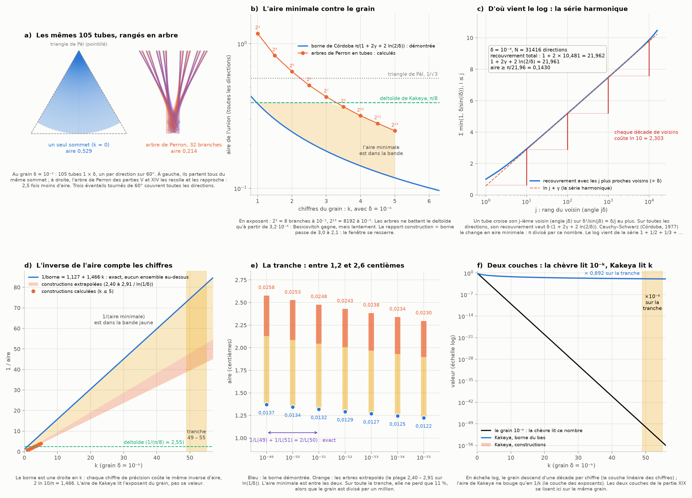
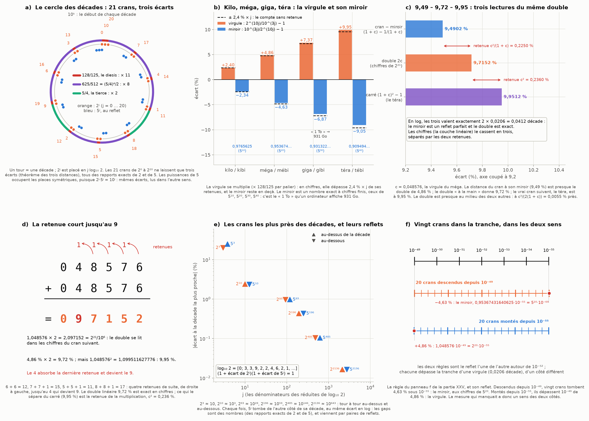
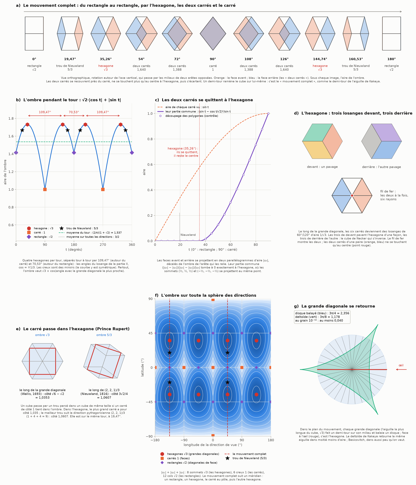

# Partie XXVI : la surface de Kakeya à 10⁻⁵⁰, la virgule du kibi dans son miroir et le cube qui tourne

> Ta demande : essayer « la surface minimale de Kakeya à ces échelles ». Tu vois aussi que les gaps correspondent à des nombres et à des reflets. Quand je dis qu'il manque la virgule entre kilo et kibi, cette mesure a un sens dans son miroir : une distance presque doublée, comme la retenue qui court jusqu'à 9,72. Et, dans un second message : on parlait du cube, du losange et de l'hexagone ; ton image montre la rotation d'un cube, de deux carrés qui s'intersectent jusqu'à l'hexagone, dans le mouvement complet.
>
> Suite de la [partie XXV](tranche-aiguilles.md).

Tout est recalculé par [`scripts/kakeya_miroir.py`](scripts/kakeya_miroir.py) (≈ 45 s). Les tableaux complets sont dans [`resultats/kakeya_miroir.md`](resultats/kakeya_miroir.md).

**Suite : [Partie XXVII — la carte des connexions : le graphe de nos chapitres et les liens qu'il prédit](carte-connexions.md).**

## En bref

- **Kakeya à 10⁻⁵⁰ : entre 0,0134 et 0,025.**
  - Au grain δ, on pose un tube 1 × δ dans chaque direction, et on cherche l'aire minimale de leur union.
  - La borne du bas est démontrée : l'argument de Córdoba, dont je calcule la constante exacte, donne au moins π/(1 + 2γ + 2 ln(2/δ)), soit 0,01344 à 10⁻⁵⁰.
  - Les constructions sont les arbres de Perron des parties V et XIV. Je les ai calculées jusqu'à 10⁻⁵, puis extrapolées : 0,021 à 0,025.
  - C'est 3 à 6 % du deltoïde de Kakeya (π/8).
- **L'inverse de l'aire compte les chiffres.**
  - Pour δ = 10⁻ᵏ, l'inverse de la borne vaut 1,127 + 1,466·k : chaque chiffre de précision coûte la même quantité.
  - De 10⁻⁴⁹ à 10⁻⁵⁵, le grain est divisé par un million, et l'aire ne perd que 11 %.
  - La chèvre lit 10⁻ᵏ, Kakeya lit k : ce sont les deux couches de la partie XIX.
- **La virgule est un diesis, et son miroir est un vrai nombre.**
  - 2¹⁰/10³ = 128/125, c'est le diesis des musiciens (trois tierces justes contre une octave). Il est à 2 et 5 ce que le comma pythagoricien de la partie XX est à 2 et 3.
  - Le miroir de 2²⁰/10⁶ est 10⁶/2²⁰ = 0,95367431640625 : les chiffres de 5²⁰.
  - On le voit sur les disques durs : un disque de « 1 To » s'affiche 931 Go, et 931… sont les chiffres de 5³⁰.
- **9,49 – 9,72 – 9,95 : trois lectures du même double.**
  - Du cran à son miroir, on mesure 9,49 %. Le double « à la main » donne 9,72 %, les chiffres de 2²¹. Le carré, c'est-à-dire le téra, donne 9,95 %.
  - En log, les trois valent exactement 2 × 0,0206 décade. Dans les chiffres, deux retenues exactes les séparent.
  - Ta « retenue jusqu'à 9,72 » est littérale : en doublant 048576, quatre retenues de suite courent jusqu'au 4, qui devient 9.
- **Les gaps sont des nombres et des reflets.**
  - Placés sur le cercle des décades, les 21 crans 2⁰ … 2²⁰ ne laissent que trois écarts : 128/125 (onze fois), 625/512 (huit fois) et 5/4 (deux fois).
  - Les puissances de 5 sont le reflet exact des puissances de 2 (2ʲ·5ʲ = 10ʲ). Quand 2ʲ tombe au-dessus d'une décade, 5ʲ tombe au-dessous, du même écart en log.
- **Le cube : de deux carrés à l'hexagone.**
  - L'ombre du cube vaut |u₁| + |u₂| + |u₃| : 1 pour le carré, √2 pour le rectangle, √3 pour l'hexagone.
  - Le mouvement complet de ton image est un demi-tour autour d'un axe qui joint les milieux de deux arêtes opposées.
  - Les deux carrés se quittent exactement à l'hexagone, où il ne leur reste que le centre en commun.
  - Entre deux hexagones, il y a 109,47° ou 70,53° : les angles du losange de la partie II.
- **Le carré passe dans l'hexagone (le cube du prince Rupert).**
  - Wallis (1693) fait passer un cube par un trou percé le long de la grande diagonale, dans l'hexagone.
  - Le meilleur trou suit la direction pythagoricienne (2, 2, 1)/3. Elle est sur ton mouvement complet, 15,8° avant l'hexagone.







---

## 1. La surface minimale de Kakeya à ces échelles

### 1.1 Ce qu'on mesure

- **Le problème sans grain n'a pas de minimum.** Kakeya (1917) demandait la plus petite aire où l'on peut retourner une aiguille. Besicovitch (1928) a montré qu'on descend aussi bas qu'on veut (partie V).
- **À un grain δ, la question a une vraie réponse.**
  - On prend N directions espacées de δ (N ≈ π/δ).
  - Dans chacune, on pose un tube 1 × δ : un parallélogramme d'aire δ et de largeur δ.
  - On place les tubes pour que leur union ait l'aire la plus petite possible.
- C'est l'ensemble de Kakeya « au grain δ » : une aiguille dans chaque direction, à δ près. Retourner l'aiguille demande au moins autant de place, donc la borne du bas vaut pour les deux problèmes.

### 1.2 La borne du bas : l'argument de Córdoba, avec sa constante

**Le mécanisme** (panneau c).
- Deux tubes dont les directions font l'angle θ se recouvrent au plus de δ²/sin θ. Deux bandes de largeur δ qui se croisent forment en effet un parallélogramme de cette aire.
- Un tube croise donc son j-ième voisin, à l'angle jδ, sur environ δ/j au plus.
- Sommé sur tous les voisins, cela donne la série harmonique 1 + 1/2 + 1/3 + … : chaque décade de voisins coûte ln 10.
- Au total, un tube recouvre tous les autres sur au plus δ·(1 + 2γ + 2 ln(2/δ)), où γ = 0,5772 est la constante d'Euler. Le script recoupe la somme exacte des 1/sin : l'écart à cette formule vaut −π/(36N).

**La borne.**
- Cauchy–Schwarz dit qu'une union est au moins aussi grande que (somme des aires)² ÷ (somme des recouvrements deux à deux). C'est l'argument de Córdoba (1977).
- Ici, la somme des aires vaut Nδ = π. D'où :

```
aire ≥ π / (1 + 2γ + 2 ln(2/δ)),   donc   1/aire ≤ 1,1270 + 1,4659·k   pour δ = 10⁻ᵏ
```

- **C'est une droite en k** (panneau d). Chaque chiffre de précision coûte le même inverse d'aire, 2 ln 10/π = 1,466.
- L'aire de Kakeya ne lit donc pas la valeur du grain, mais son nombre de chiffres.

### 1.3 Les constructions : les arbres de Perron en tubes

- **L'arbre.** On reprend celui des parties V et XIV.
  - On part du triangle équilatéral de hauteur 1, celui de Pál.
  - On le coupe en 2^k branches, recollées et rapprochées avec les rapports télescopiques de la partie V.
  - Sans grain, l'arbre couvre exactement 2/(k + 2) du triangle.
- **Les tubes.** Chaque direction reçoit son tube dans la branche qui la contient (panneau a). Trois éventails tournés de 60° couvrent toutes les directions.
- On calcule l'aire exacte de l'union et on garde le meilleur nombre de branches :

| grain δ | directions | meilleur arbre | aire de l'union | × ln(1/δ) | borne de Córdoba | construction ÷ borne |
|---|---:|---|---|---|---|---|
| 10⁻¹ | 33 | 8 branches | 1,179 | 2,72 | 0,388 | 3,04 |
| 10⁻² | 315 | 32 branches | 0,643 | 2,96 | 0,246 | 2,61 |
| 10⁻³ | 3 144 | 128 branches | 0,430 | 2,97 | 0,181 | 2,37 |
| 10⁻⁴ | 31 416 | 1 024 branches | 0,318 | 2,93 | 0,143 | 2,22 |
| 10⁻⁵ | 314 160 | 8 192 branches | 0,250 | 2,88 | 0,118 | 2,12 |

- **L'aire suit bien 1/ln(1/δ).**
  - Son produit par ln(1/δ) reste vers 2,9 sur quatre décades.
  - Si la formule 2/(k + 2) de la partie V tient pour tout k, ce produit descend lentement vers 2√3·ln 2 = 2,40.
  - Keich (1999) a démontré que cet ordre est le bon, avec une construction de la même famille (celle de Schoenberg).
- **Besicovitch gagne, mais lentement.**
  - Les arbres ne battent le deltoïde de Kakeya (π/8 = 0,393) qu'en dessous de δ ≈ 3·10⁻⁴.
  - À l'échelle d'un millimètre sur un mètre, le deltoïde reste meilleur que ces arbres.
- **La grille de la partie XIV donnait la même loi.** Elle trouvait 0,28 du triangle pour une grille de 1 024 cases ; on trouve ici 0,25 du triangle avec des tubes de 1/1 000.
- **La fenêtre se resserre** : le rapport construction ÷ borne passe de 3,0 à 2,1.

### 1.4 La tranche 10⁻⁴⁹ – 10⁻⁵⁵

| grain | borne (démontrée) | constructions (extrapolées) | part du deltoïde |
|---|---|---|---|
| 10⁻⁴⁹ | 0,01371 | 0,021 – 0,026 | 3,5 – 6,6 % |
| 10⁻⁵⁰ | 0,01344 | 0,021 – 0,025 | 3,4 – 6,4 % |
| 10⁻⁵¹ | 0,01318 | 0,020 – 0,025 | 3,4 – 6,3 % |
| 10⁻⁵² | 0,01293 | 0,020 – 0,024 | 3,3 – 6,2 % |
| 10⁻⁵³ | 0,01269 | 0,020 – 0,024 | 3,2 – 6,1 % |
| 10⁻⁵⁴ | 0,01246 | 0,019 – 0,023 | 3,2 – 6,0 % |
| 10⁻⁵⁵ | 0,01223 | 0,019 – 0,023 | 3,1 – 5,9 % |

- **L'aire minimale est entre les deux colonnes** (panneau e).
  - La borne est un théorème.
  - Les constructions sont extrapolées de 10⁻⁵ à 10⁻⁵⁰ par la loi en 1/ln(1/δ). Pour la constante, j'ai pris entre la valeur mesurée (2,91) et la limite de la famille (2,40).
- **Sur toute la tranche, l'aire ne perd que 10,8 %** (rapport 1,1206), alors que le grain est divisé par un million (panneau f).
- **Le miroir 49-50-51 de la partie XXI devient harmonique.**
  - Comme 1/L est affine en k, on a exactement 1/L(49) + 1/L(51) = 2/L(50).
  - Le grain, lui, a un miroir géométrique : 10⁻⁴⁹ × 10⁻⁵¹ = (10⁻⁵⁰)².
  - Ce sont les deux couches de la partie XIX, sur le même exemple : les produits pour le grain, les inverses pour Kakeya.

### 1.5 En 3D : Wang et Zahl

- **Dans l'espace, une aiguille dans chaque direction ne peut pas tenir dans un ensemble « mince ».** Hong Wang et Joshua Zahl ont démontré en 2025 que tout ensemble de Kakeya de l'espace a la dimension 3. C'était la conjecture de Kakeya en dimension 3.
- **Au grain δ**, leur théorème dit que des tubes de directions séparées occupent au moins c_ε·δ^ε fois leur volume total, pour tout ε > 0. Le volume ne descend donc pas comme une puissance de δ.
- **Mais la constante c_ε n'est pas explicite.** On ne peut pas en tirer un nombre à 10⁻⁵⁰ comme dans le plan.
- Dans le plan, la dimension 2 était connue depuis Davies (1971), et la borne de Córdoba en donne la forme exacte : 1/ln(1/δ).

---

## 2. La virgule du kibi dans son miroir

### 2.1 La virgule est un diesis

- Le kilo vaut 10³ et le kibi 2¹⁰ = 1 024. Leur rapport 1 024/1 000 se simplifie en **128/125**, parce que 10³ = 2³·5³ : il ne reste que des 2 et des 5.
- 128/125, c'est le **diesis** des musiciens.
  - Trois tierces majeures justes donnent (5/4)³ = 125/64.
  - Elles manquent l'octave 2 de 128/125, soit 41 cents.
- **C'est le même procédé que le comma pythagoricien de la partie XX.**
  - Là, on comparait 2 et 3 : douze quintes contre sept octaves, 3¹²/2¹⁹.
  - Ici, on compare 2 et 5 : trois tierces contre une octave, 2⁷/5³.
  - La raison est que la base 10 est faite de 2 et de 5.
- **Le méga double la virgule** : 2²⁰/10⁶ = (128/125)² = 1,048576. Le giga la triple (1,0737…), le téra la quadruple (1,0995…).

### 2.2 Le miroir est un nombre exact : les chiffres de 5ʲ

- **Le miroir de 2²⁰/10⁶** est 10⁶/2²⁰ = 5⁶/2¹⁴ = **0,95367431640625**.
  - Il s'écrit avec un nombre fini de chiffres, parce que son dénominateur est une puissance de 2 (partie XIX : les fractions qui tombent juste en base 10).
  - Ses chiffres sont ceux de 5²⁰ = 95 367 431 640 625.
- **C'est général** : 2⁻ʲ a les chiffres de 5ʲ, puisque 2ʲ·5ʲ = 10ʲ.
- **Ce miroir est sous tes yeux.** Un disque vendu « 1 To » (10¹² octets) s'affiche 931 Go dans un système qui compte en gibi. En effet, 10⁹/2³⁰ = 0,931322574615478515625, les chiffres de 5³⁰.

| palier | virgule | miroir | chiffres de | ce qu'on voit |
|---|---|---|---|---|
| kilo / kibi | +2,4 % | 0,9765625 | 5¹⁰ | 1 ko = 0,977 Kio |
| méga / mébi | +4,8576 % | 0,95367431640625 | 5²⁰ | 1 Mo = 0,954 Mio |
| giga / gibi | +7,3742 % | 0,931322574615478515625 | 5³⁰ | 1 To = 931 Gio |
| téra / tébi | +9,9512 % | 0,9094947017729282379150390625 | 5⁴⁰ | 1 To = 0,909 Tio |

- **La virgule se multiplie** par 128/125 à chaque palier (panneau b).
  - En chiffres, elle dépasse donc 2,4 % × j de ses retenues : 4,8576 au lieu de 4,8.
  - Le miroir, lui, reste en deçà de −2,4 % × j.

### 2.3 9,49 – 9,72 – 9,95 : trois lectures du même double

Avec c = 0,048576 (panneau c) :
- **Du cran (1 + c) à son miroir 1/(1 + c)**, on mesure (1 + c) − 1/(1 + c) = 0,09490168359375, soit **9,49 %**.
- **Le double « à la main »** vaut 2c = 0,097152, soit **9,72 %**. Ce sont les chiffres de 2²¹ = 2 097 152, le cran suivant.
- **Le carré** (1 + c)² − 1 = 0,099511627776 = 2⁴⁰/10¹² − 1 vaut **9,95 %** : c'est le téra (« +9,95 % au téra », partie XIX).

**En log, les trois sont le même nombre.**
- Le miroir est à −0,0206 décade, le cran à +0,0206 : la distance est exactement le double de la virgule.
- Le double et le carré valent aussi 2 × 0,0206 = 0,0412 décade.
- C'est ton « presque doublée ». En log, il n'y a plus de « presque ».

**Dans les chiffres, le double se casse en trois**, séparés par des retenues exactes :
- du miroir au double : c²/(1 + c) = 0,00225031640625 ;
- du double au carré : c² = 0,002359627776.
- Le double est presque au milieu des deux autres, à c³/(2(1 + c)) = 0,0055 % près.

**C'est exactement le procédé à deux couches de la partie XIX** (CLAUDE.md, § 3) :
- dans la couche géométrique (les logs), le miroir est un reflet parfait et le double est exact ;
- dans la couche linéaire (les chiffres), les retenues déplacent les chiffres.

### 2.4 La retenue court jusqu'au 9 (panneau d)

- Le calcul de 2 × 048576, de droite à gauche :
  - 6 + 6 = 12 : on écrit 2, on retient 1 ;
  - 7 + 7 + 1 = 15 ;
  - 5 + 5 + 1 = 11 ;
  - 8 + 8 + 1 = 17 ;
  - 4 + 4 + 1 = 9.
- Quatre retenues de suite, et le 4 les absorbe en devenant 9. Arrondi, 4,86 × 2 = 9,72 : c'est ta « retenue jusqu'à 9,72 ».
- Il manque encore 0,236 % pour arriver au téra (9,95 %). Ce n'est plus une retenue d'addition : c'est celle de la multiplication, c².

### 2.5 Les gaps sont des nombres et des reflets

**Le cercle des décades** (panneau a).
- Un tour vaut une décade. On y place 2ʲ à la position j·log₁₀ 2, la partie après la virgule.
- C'est la règle des crans de la partie XXV, enroulée sur un cercle.

**Trois écarts seulement.**
- Le théorème des trois distances dit qu'il n'y a jamais plus de trois longueurs (partie XI pour l'angle d'or, partie XIX pour log₁₀ 2).
- Pour les 21 crans 2⁰ … 2²⁰, les écarts sont :
  - 11 fois 128/125, le diesis, la virgule du kilo ;
  - 8 fois 625/512 = (5/4)⁴/2 ;
  - 2 fois 5/4, la tierce (10/8 : 2³ contre 10).
- Le grand écart est le produit des deux petits : 5/4 = 128/125 × 625/512.
- **Chaque gap est un nombre exact** : un rapport de puissances de 2 et de 5, jamais un nombre quelconque.

**Et chaque gap a son reflet.**
- log₁₀ 5ʲ = j − log₁₀ 2ʲ : les puissances de 5 occupent sur le cercle les places symétriques de celles de 2 (en bleu).
- On retrouve les mêmes écarts, lus dans l'autre sens.

**Les crans les plus proches des décades** viennent des réduites de log₁₀ 2 = [0; 3, 3, 9, 2, 2, 4, 6, …] (panneau e) :

| j | 2ʲ | écart | 5ʲ | écart du reflet |
|---:|---|---|---|---|
| 3 | 8 ≈ 10¹ | −20 % | 125 ≈ 10² | +25 % |
| 10 | 1 024 ≈ 10³ | +2,4 % | 9 765 625 ≈ 10⁷ | −2,34 % |
| 93 | ≈ 10²⁸ | −0,96 % | ≈ 10⁶⁵ | +0,97 % |
| 196 | ≈ 10⁵⁹ | +0,43 % | ≈ 10¹³⁷ | −0,43 % |
| 485 | ≈ 10¹⁴⁶ | −0,10 % | ≈ 10³³⁹ | +0,10 % |
| 2 136 | ≈ 10⁶⁴³ | +0,016 % | ≈ 10¹⁴⁹³ | −0,016 % |

- Les écarts alternent : au-dessus, au-dessous.
- Le reflet tombe toujours de l'autre côté : (1 + écart)(1 + écart du reflet) = 1 exactement.

### 2.6 La tranche en crans (panneau f)

- C'est la règle du panneau f de la partie XXV, avec son reflet.
- **Descendus depuis 10⁻⁴⁹**, vingt crans tombent 4,63 % sous 10⁻⁵⁵ : c'est le miroir, 0,95367431640625·10⁻⁵⁵, aux chiffres de 5²⁰.
- **Montés depuis 10⁻⁵⁵**, ils dépassent 10⁻⁴⁹ de 4,86 % : c'est la virgule.
- Les deux règles sont le reflet l'une de l'autre autour de 10⁻⁵². D'un côté « il manque la virgule », de l'autre « il y a le miroir » : la mesure a un sens dans les deux sens.
- **Le miroir 49-50-51 passe aux crans.**
  - Les crans les plus proches sont 2⁻¹⁶³ (0,855·10⁻⁴⁹), 2⁻¹⁶⁶ (1,069·10⁻⁵⁰) et 2⁻¹⁶⁹ (1,336·10⁻⁵¹).
  - On a 163 + 169 = 2 × 166, comme 49 + 51 = 2 × 50.

---

## 3. Le cube qui tourne : de deux carrés à l'hexagone

### 3.1 L'ombre du cube

- **La formule.** Vu dans la direction u (un vecteur unité), un cube d'arête 1 a une ombre d'aire **|u₁| + |u₂| + |u₃|**. Le script la vérifie sur 2 000 directions au hasard, à 10⁻¹⁵ près.
- **Pourquoi.** Chaque face se projette avec le facteur |u_i|, le cosinus de son inclinaison, et on voit exactement trois faces, une par paire.
- **Les trois vues spéciales de ton image :**
  - de face, un **carré**, d'aire 1 ;
  - le long d'une diagonale de face, un **rectangle coupé en deux** (1 × √2, avec l'arête du milieu), d'aire √2 ;
  - le long d'une grande diagonale, l'**hexagone**, d'aire √3.
- Ce sont les longueurs de l'arête, de la diagonale de face et de la grande diagonale.
- **L'hexagone gouverne tout.** En général, l'ombre vaut √3 × cos(angle avec la grande diagonale la plus proche).
- **La moyenne.** Sur toutes les directions, l'ombre vaut en moyenne 3/2. Deux façons de le voir :
  - c'est la formule de Cauchy : l'ombre moyenne est le quart de la surface 6 ;
  - c'est la boîte à chapeau d'Archimède de la partie II : en 3D, chaque |u_i| est uniforme entre 0 et 1, de moyenne ½.

### 3.2 Le mouvement complet

**L'axe.**
- Ton image passe par l'hexagone à six rayons, le rectangle coupé en deux et les deux carrés qui se croisent.
- Une rotation autour d'un axe fixe ne passe par ces trois vues que si l'axe joint les milieux de deux arêtes opposées. C'est un axe d'ordre 2 du cube.
- Je ne peux pas reconnaître l'axe exact de ton animation sur sept vignettes. Mais ce mouvement passe par toutes tes images (panneau a).

**L'ombre pendant le tour** (panneau b) : ombre(t) = √2·|cos t| + |sin t|.
- **Il y a quatre hexagones par tour**, à ±35,26° et à 180° ± 35,26°.
- **Les écarts entre deux hexagones** valent tour à tour **109,47°** (en passant par le carré) et **70,53°** (en passant par le rectangle).
  - Ce sont exactement les deux angles du losange de la partie II, le profil du cube qui tourne autour de sa grande diagonale. C'est aussi l'angle du tétraèdre : cos = ∓1/3.
  - Le lien : 109,47° = 2 × 54,74°, et 54,74° est l'angle entre la grande diagonale et une arête. C'est le demi-angle des cônes de la partie II, l'angle magique.
- **Les creux sont des miroirs.**
  - La courbe est symétrique autour du carré et autour du rectangle : ce sont les axes de reflet du mouvement.
  - Les sommets (les hexagones) sont lisses, les creux sont des pointes.
- **La moyenne du tour** vaut (2/π)(1 + √2) = 1,537, un peu plus que la moyenne sur toutes les directions (3/2).
  - Autour d'un axe de face, elle serait 4/π = 1,273.
  - Autour de la grande diagonale, c'est-à-dire le tour de la partie II vu de côté, elle vaut (2/π)√6 = 1,559, le maximum.
- **Un demi-tour ramène le cube sur lui-même.** Le mouvement complet du cube autour de cet axe est donc un demi-tour, comme celui de l'aiguille de Kakeya.

### 3.3 Les deux carrés se quittent à l'hexagone

- **Ce qu'on voit.** Les faces avant et arrière, tes « deux carrés », se projettent en deux parallélogrammes de même aire |u₃|. Ils sont décalés de l'ombre de l'arête qui les relie.
- **La formule.** Leur partie commune vaut exactement (|u₃| − |u₁|)(|u₃| − |u₂|)/|u₃|. Le script la vérifie sur 1 000 directions en découpant les polygones.
- **Sur le mouvement**, elle passe de 1, de face, à 0 **exactement à l'hexagone** (panneau c).
  - Là, les deux carrés ne se touchent plus qu'en un point : le centre.
  - Le coin de devant (½, ½, ½) et le coin de derrière (−½, −½, −½) s'y projettent tous les deux.
- C'est ta phrase mot pour mot : le mouvement va « de deux carrés qui s'intersectent à l'hexagone ».
- **Après l'hexagone**, les deux carrés s'écartent, puis deviennent des traits au rectangle, vus par la tranche. Ce sont alors les deux autres paires de faces qui jouent le rôle des carrés.

### 3.4 L'hexagone : trois losanges devant, trois derrière

- **Six losanges.** Le long de la grande diagonale, les six faces deviennent six losanges de 60°/120°, d'aire 1/√3 chacun (panneau d).
- **Deux pavages.**
  - Les trois losanges de devant pavent l'hexagone d'une façon, les trois de derrière de l'autre.
  - Ce sont les deux lectures du cube de Necker, qui s'inverse sous les yeux. Le reflet du cube par le plan de l'écran échange les deux pavages.
- **Les six rayons.** Le dessin en fil de fer montre les deux pavages à la fois : ce sont les six rayons de la première image de ta séquence.
- **Les trois paires à la fois.** À l'hexagone, chaque paire de carrés donne deux losanges qui ne se touchent qu'au centre. C'est le seul moment du tour où c'est vrai pour les trois paires.
- La partie II avait déjà cet hexagone comme ombre le long de la diagonale. Son cercle inscrit, de rayon √2/2, est l'ombre de la sphère médiane.

### 3.5 Le carré passe dans l'hexagone : le cube du prince Rupert

- **La question.** Le prince Rupert du Rhin a demandé si l'on peut faire passer un cube par un trou percé dans un cube de même taille.
- **La condition.** Il suffit qu'un carré de côté 1 tienne strictement dans une ombre du cube : on perce alors le tunnel le long de cette direction.
- **Wallis perce le trou dans l'hexagone.** John Wallis (1693) a percé le trou le long de la grande diagonale.
  - Le plus grand carré qui tient dans l'hexagone a pour côté √6 − √2 = 1,0353 ; je l'ai recalculé par programme linéaire.
  - C'est le même Wallis que celui du produit de π (partie III) et du postulat des parallèles (partie XXIV).
- **Nieuwland trouve le meilleur trou.** Pieter Nieuwland l'a trouvé (publié en 1816 par van Swinden) : un cube de côté 3√2/4 = 1,0607 peut passer.
  - Le script le retrouve (1,06066), le long de la direction (2, 2, 1)/3.
  - Aucune des 54 directions de la grille ne fait mieux.
- **Deux choses que je n'attendais pas :**
  - (2, 2, 1) est le plus petit quadruplet de Pythagore, 1² + 2² + 2² = 3². Le meilleur tunnel suit donc une aiguille du réseau de longueur entière, comme les rotations pythagoriciennes de la partie XXV.
  - Cette direction est **sur ton mouvement complet**, à t = arcsin(1/3) = 19,47°, entre le rectangle et l'hexagone. L'ombre y vaut 5/3. Le carré passe donc mieux 15,8° avant l'hexagone que dans l'hexagone lui-même.
- **Le sujet est encore vivant.** En 2025, Steininger et Yurkevich ont trouvé le premier polyèdre convexe qui ne peut pas passer à travers lui-même.

### 3.6 Le cube et l'aiguille de Kakeya

- **Un ensemble de Kakeya épais.** Le cube contient une aiguille de longueur au moins 1 dans chaque direction : c'est un ensemble de Kakeya de volume 1. Sa plus longue aiguille est la grande diagonale, √3, celle qu'on voit de face dans l'hexagone.
- **Le retournement.** Pendant le mouvement complet, chaque grande diagonale du plan du mouvement fait un demi-tour sur son milieu (panneau g). Elle balaie un disque d'aire 3π/4 = 2,36.
- **Kakeya ferait mieux :**
  - le deltoïde retourne la même aiguille dans 3π/8 = 1,18, la moitié ;
  - Besicovitch le fait dans aussi peu qu'on veut ;
  - au grain 10⁻⁵⁰, il faut au moins 0,040 : c'est la borne du § 1, multipliée par 3 = (√3)².
- **Le cube est le retournement sans glissement** : il tourne sur place. Kakeya et Besicovitch gagnent de la place en faisant glisser l'aiguille pendant qu'elle tourne.

---

## 4. Les liens avec les parties précédentes

| partie | ce qui était posé | ce que cette partie y ajoute |
|---|---|---|
| [II](archimede.md) | le cube qui tourne autour de sa diagonale, le losange 109,47°/70,53°, l'hexagone comme ombre | les angles du losange sont les écarts entre hexagones ; l'ombre exacte ; les deux carrés |
| [III](pi-dimensions.md), [XXIV](tiers-dimension.md) | Wallis : le produit de π, le postulat des parallèles | Wallis et le cube du prince Rupert |
| [V](aiguille-kakeya.md) | le deltoïde π/8, Pál, l'arbre de Perron et 2/(k + 2) | les arbres en tubes au grain δ, la borne de Córdoba, 10⁻⁵⁰ |
| [XI](angle-or-aiguilles.md) | les trois distances de l'angle d'or | les trois écarts des crans : 128/125, 625/512, 5/4 |
| [XIV](aiguille-grille.md) | l'arbre sur une grille, ≈ 2,8/log₂ n du triangle | la même loi avec des tubes, jusqu'à 10⁻⁵, et sa borne |
| [XIX](bases-objets.md) | kilo contre kibi, +9,95 % au téra, « 1 To » qui s'affiche 931 Go ; les deux couches | le miroir aux chiffres de 5ʲ ; 9,49/9,72/9,95 en log et en chiffres |
| [XX](sphere-faisceaux.md) | le comma pythagoricien (2 et 3) ; le retournement de l'aiguille | le diesis (2 et 5) ; la grande diagonale qui se retourne |
| [XXI](vingt-quatre-miroir.md) | le miroir 49-50-51 | le miroir harmonique de Kakeya : 1/L(49) + 1/L(51) = 2/L(50) |
| [XXV](tranche-aiguilles.md) | six décades, vingt crans ; les aiguilles pythagoriciennes | la règle et son reflet ; (2, 2, 1)/3, le tunnel de Nieuwland |

## 5. Le tri

**Exact (démontré ici ou classique) :**
- la borne de Córdoba avec sa constante, aire ≥ π/(1 + 2γ + 2 ln(2/δ)), son inverse affine en k et le miroir harmonique 49-50-51 ;
- 2¹⁰/10³ = 128/125 (le diesis) ; 10⁶/2²⁰ = 5⁶/2¹⁴ ; 2⁻ʲ a les chiffres de 5ʲ ;
- les écarts 9,49, 9,72 et 9,95 %, leurs retenues c²/(1 + c) et c², et leur égalité en log ;
- le théorème des trois distances et les trois écarts 128/125, 625/512 et 5/4 pour 21 crans ; les réduites de log₁₀ 2 ;
- l'ombre du cube |u₁| + |u₂| + |u₃|, sa moyenne 3/2 (Cauchy, Archimède) ;
- ombre(t) = √2·|cos t| + |sin t|, les écarts 109,47° et 70,53°, la moyenne (2/π)(1 + √2) ;
- la partie commune des deux carrés, nulle exactement à l'hexagone ; les deux pavages de l'hexagone ;
- Wallis (√6 − √2) et Nieuwland (3√2/4), classiques et recalculés ; la direction (2, 2, 1)/3 sur le mouvement complet, à arcsin(1/3).

**Calculé :**
- les arbres de Perron en tubes jusqu'à δ = 10⁻⁵ (aire exacte de l'union, meilleur nombre de branches) ;
- la recherche du meilleur tunnel du prince Rupert (54 directions, puis 6 voisines) ;
- la somme des 1/sin et son terme −π/(36N), vérifié jusqu'à N = 10 000.

**Extrapolé (à prendre comme tel) :** les constructions à 10⁻⁴⁹ – 10⁻⁵⁵.
- La loi en 1/ln(1/δ) est sûre (Keich, 1999).
- Sa constante (2,40 à 2,91) vient de mes calculs jusqu'à 10⁻⁵ et de la formule 2/(k + 2), qui n'est vérifiée que jusqu'à 16 384 branches (partie V).

**Analogie de structure (même procédé), donc un résultat :**
- **Le diesis et le comma pythagoricien.**
  - Ce qui est partagé : comparer les puissances de deux nombres premiers. 2 et 3 donnent les 12 notes et le comma 3¹²/2¹⁹ (partie XX) ; 2 et 5 donnent la base 10 et le diesis 2⁷/5³ = 128/125.
  - Ce que ça transporte : la virgule kilo/kibi est un intervalle musical exact (41 cents). Le cercle des décades est une gamme, dont les trois écarts sont des intervalles de 2 et de 5.
- **Le losange de la partie II et les hexagones du mouvement.**
  - Ce qui est partagé : l'angle de 54,74° entre la grande diagonale et une arête.
  - Ce que ça transporte : les angles du losange (109,47° et 70,53°) sont les écarts entre les hexagones.
- **Le miroir du grain et le miroir de Kakeya.**
  - Ce qui est partagé : la symétrie 49-50-51 autour de 50.
  - Ce que ça transporte : elle est géométrique pour le grain (les produits), harmonique pour Kakeya (les inverses). Ce sont les deux couches de la partie XIX.

**Mes lectures (corrige-moi si je t'ai mal compris) :**
- **« La distance presque doublée ».** Je l'ai lue comme la distance du cran à son miroir (9,49 %), comparée au double de la virgule (9,72 %). En log, elle est exactement double ; le « presque » vient des retenues.
- **« La retenue jusqu'à 9,72 ».** Je l'ai lue comme la chaîne de retenues de 2 × 4,8576 = 9,7152, qui court jusqu'au 9.
- **« Les gaps correspondent à des nombres et des reflets ».** Je l'ai lue sur le cercle des décades : trois écarts, tous des rapports exacts de 2 et de 5, et le reflet 2ʲ ↔ 5ʲ.
- **Ton image.** J'y reconnais l'hexagone à six rayons, le rectangle coupé en deux et les deux carrés qui se croisent. Je l'ai modélisée par un demi-tour autour d'un axe d'ordre 2, en vue orthographique. Ton animation est en perspective, et son axe peut être un autre.
- **Le lien entre le cube et Kakeya.** Je le lis comme le retournement de la grande diagonale. C'est une image qui relie les deux sujets, pas un théorème qui les unit.

**Ouvert :**
- la constante exacte de l'aire minimale de Kakeya au grain δ, entre π/2 = 1,571 et environ 2,4 à 2,9 (en unités de 1/ln(1/δ)) ;
- une démonstration de 2/(k + 2) pour tout k (partie V) ;
- un nombre explicite en 3D : la borne de Wang et Zahl a une constante qui n'est pas calculée ;
- pourquoi le meilleur tunnel du prince Rupert suit une direction pythagoricienne. Je n'en ai pas d'explication au-delà du calcul.

**Pas établi :** que l'espace physique suive ce modèle à 10⁻⁵⁰ m. C'est un postulat (partie XX, § 8).

## Sources

**Les parties reliées**
- [II](archimede.md) : le cube qui tourne, le losange, l'hexagone ;
- [III](pi-dimensions.md) : le produit de Wallis ;
- [V](aiguille-kakeya.md) : Kakeya, Pál, le deltoïde, l'arbre de Perron et 2/(k + 2) ;
- [XI](angle-or-aiguilles.md) : le théorème des trois distances ;
- [XIV](aiguille-grille.md) : l'arbre de Perron sur une grille ;
- [XIX](bases-objets.md) : kilo et kibi, les deux couches, les retenues ;
- [XX](sphere-faisceaux.md) : le comma pythagoricien, le retournement de l'aiguille ;
- [XXI](vingt-quatre-miroir.md) : le miroir 49-50-51 ;
- [XXIV](tiers-dimension.md) : Wallis et le postulat des parallèles ;
- [XXV](tranche-aiguilles.md) : la tranche, six décades et vingt crans.

**Littérature**
- A. Córdoba, « The Kakeya maximal function and the spherical summation multipliers », *American Journal of Mathematics* 99, 1–22 (1977) : l'argument L² qui donne la borne en 1/log(1/δ).
- U. Keich, [« On L^p bounds for Kakeya maximal functions and the Minkowski dimension in R² »](https://authors.library.caltech.edu/records/js5yc-8gw95), *Bulletin of the London Mathematical Society* 31, 213–221 (1999) : la construction, d'après Schoenberg, qui montre que l'ordre 1/log(1/δ) est atteint.
- H. Wang, J. Zahl, [« Volume estimates for unions of convex sets, and the Kakeya set conjecture in three dimensions »](https://arxiv.org/abs/2502.17655) (2025).
- R. O. Davies, « Some remarks on the Kakeya problem », *Proceedings of the Cambridge Philosophical Society* 69, 417–421 (1971) : la dimension 2 dans le plan.
- E. Tsukerman, E. Veomett, [« A Simple Proof of Cauchy's Surface Area Formula »](https://arxiv.org/abs/1604.05815) (arXiv, 2016), et E. W. Weisstein, [« Cauchy's Surface Area Formula »](https://mathworld.wolfram.com/CauchysSurfaceAreaFormula.html) (MathWorld) : l'ombre moyenne d'un convexe et sa surface.
- J. Steininger, S. Yurkevich, [« A convex polyhedron without Rupert's property »](https://arxiv.org/abs/2508.18475) (2025), et l'article de [Quanta Magazine](https://www.quantamagazine.org/first-shape-found-that-cant-pass-through-itself-20251024/) (octobre 2025).
- Wikipédia : [Kakeya set](https://en.wikipedia.org/wiki/Kakeya_set), [Diesis](https://en.wikipedia.org/wiki/Diesis), [Three-gap theorem](https://en.wikipedia.org/wiki/Three-gap_theorem), [Binary prefix](https://en.wikipedia.org/wiki/Binary_prefix), [Prince Rupert's cube](https://en.wikipedia.org/wiki/Prince_Rupert%27s_cube), [Necker cube](https://en.wikipedia.org/wiki/Necker_cube).
