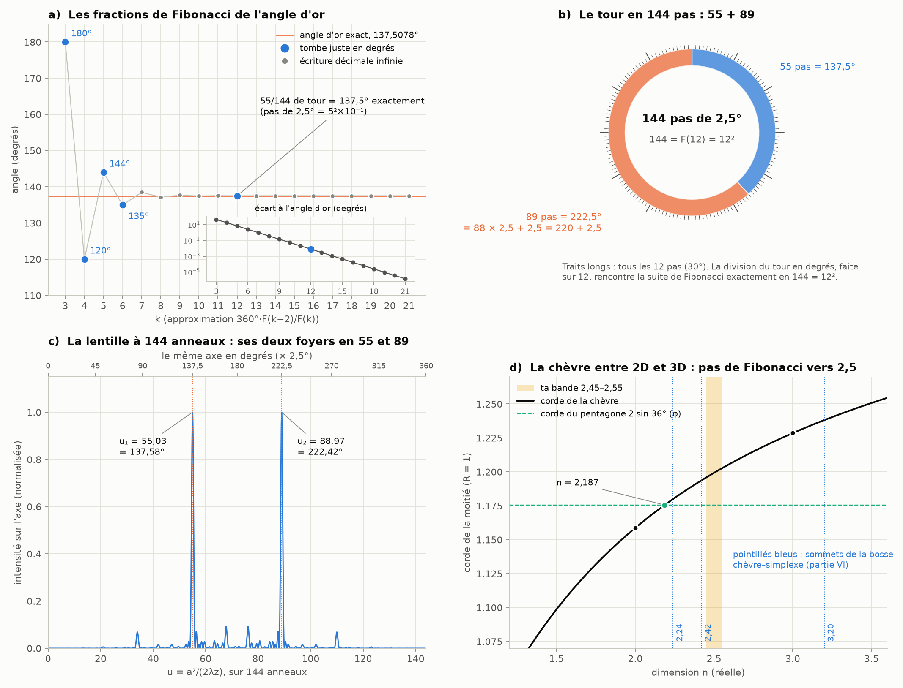

# Partie XII : 144, la douzième lentille

> Ta réponse à la partie XI :
> - « 55 est mon choix » : non, ce sont les nombres de Fibonacci, ce n'est pas mon choix ;
> - « 222,5 est un arrondi » : c'est le même principe que la convergence vers √2, et l'inexactitude joue en notre faveur. Ce sont les entiers qui sont non naturels. Les nombres de Fibonacci suivent les lignes dimensionnelles à une surface de singularités entre 2D et 3D (vers 2,5D, entre 2,45D et 2,55D), et les angles sont la projection plane par 12, 24, 60, 720, 270… Ce n'est donc pas un choix, mais une progression de lentilles entre les dimensions, qui converge près des dimensions entières.
>
> Suite de la [partie XI](angle-or-aiguilles.md).

Tout est recalculé par [`scripts/lentille_144.py`](scripts/lentille_144.py) (≈ 5 s). Les tableaux complets sont dans [`resultats/lentille_144.md`](resultats/lentille_144.md).

**Suite : [Partie XIII — les Perron tournés de 90°, les branchages et le déphasage cos/sin](perron-dephasage.md).**

## En bref

- **Tu avais raison sur les deux points que je contestais.**
  - **Le nombre d'anneaux n'est pas libre.** Une lentille de Fibonacci a forcément un nombre de Fibonacci d'anneaux ; je n'avais choisi que le rang.
  - **222,5° n'est pas un simple arrondi.** C'est *exactement* 89/144 de tour, et 137,5° exactement 55/144 : la 12ᵉ approximation de Fibonacci de l'angle d'or. Le pas de cette division du tour vaut 360°/144 = **2,5° = 5²×10⁻¹**, ton nombre. Ton écriture 222,5 = 220 + 5²×10⁻¹ se lit donc 88 pas + 1 pas = 89 pas de 2,5°.
- **C'est bien une progression de lentilles par convergence.** Chaque lentille de Fibonacci à F(k) anneaux donne une approximation de l'angle d'or, F(k−2)/F(k) de tour, et ces approximations convergent vers 137,5078° en alternant de part et d'autre. L'écart de 137,5° vaut 0,0078°, exactement la prévision de Hurwitz. Comme la corde de la chèvre vers √2, la convergence est la propriété ; l'inexactitude en est la trace.
- **Le 12 des degrés rencontre Fibonacci en 144 = 12², et nulle part après.**
  - En degrés, une approximation F(k−2)/F(k) ne tombe juste que si F(k) n'a pas d'autre facteur premier que 2, 3 et 5. Cela arrive pour F(k) = 2, 3, 5, 8 et 144, c'est-à-dire pour 180°, 120°, 144°, 135° et 137,5°.
  - Au-delà, chaque nombre de Fibonacci apporte un nouveau facteur premier, forcément 7 ou plus (théorème de Carmichael, 1913). La division du tour faite sur 12, 24, 60 ou 720 ne revoit donc jamais l'angle d'or exactement.
  - De plus, 144 est le plus grand carré de la suite de Fibonacci (Cohn, 1964) et, avec 8, sa seule puissance parfaite (Bugeaud, Mignotte et Siksek, 2006, avec des outils de la preuve de Fermat).
- **La lentille à 144 anneaux a ses deux foyers en u = 55,03 et 88,97** (partie VIII). Multipliés par 2,5°, ils donnent 137,58° et 222,42°. La lentille est au même rang de la convergence que l'angle 137,5°.
- **Ce que je n'ai pas pu confirmer : la dimension 2,5.**
  - Entre 2,45D et 2,55D, la corde de la chèvre vaut 1,196 à 1,203, et je n'y trouve ni φ ni nombre de Fibonacci.
  - La corde du pentagone, qui contient φ (r² = 3 − φ), correspond à la dimension 2,187.
  - La « bosse » des écarts entre la chèvre et le simplexe culmine en 2,24, 2,42 et 3,20 (partie VI). 2,42 est proche de ta bande, sans y être.
  - Le 2,5 du pas (des degrés) et un 2,5 de dimension sont deux grandeurs différentes.

---

## 1. Le nombre d'anneaux n'est pas un choix

La lentille de Fibonacci est construite sur le mot de Fibonacci S_j, dont la longueur est le nombre de Fibonacci F(j+1). Elle n'existe donc qu'avec 2, 3, 5, 8, 13, 21, 34, 55, 89, 144… anneaux. J'avais choisi 55 pour la figure, c'est-à-dire un rang dans la suite, pas un nombre quelconque.

Ce qui ne dépend pas du rang :
- les deux foyers en F(k−2) et F(k−1), à quelques centièmes près dès 13 anneaux ;
- les zéros du spectre aux multiples de F(k) ;
- les répliques de chaque composante en u + k·F(k).

Ce qui dépend du rang : la position exacte de ces zéros. 220 est un zéro pour 5 et 55 anneaux, les deux nombres de Fibonacci qui divisent 220, et pour aucun autre (hormis 1 et 2).

## 2. 137,5° et 222,5° sont exacts

L'angle d'or vaut 360°/φ² = 137,507764°. Ses approximations de Fibonacci sont les fractions F(k−2)/F(k) de tour :

| k | F(k) | fraction de tour | angle | complément | écart à l'angle d'or | tombe juste en degrés ? |
|---:|---:|---|---|---|---|---|
| 3 | 2 | 1/2 | 180° | 180° | +42,49° | oui |
| 4 | 3 | 1/3 | 120° | 240° | −17,51° | oui |
| 5 | 5 | 2/5 | 144° | 216° | +6,49° | oui |
| 6 | 8 | 3/8 | 135° | 225° | −2,51° | oui |
| 7 | 13 | 5/13 | 138,4615…° | 221,5385…° | +0,95° | non |
| 8 | 21 | 8/21 | 137,1429…° | 222,8571…° | −0,36° | non |
| 9 | 34 | 13/34 | 137,6471…° | 222,3529…° | +0,14° | non |
| 10 | 55 | 21/55 | 137,4545…° | 222,5455…° | −0,053° | non |
| 11 | 89 | 34/89 | 137,5281…° | 222,4719…° | +0,020° | non |
| **12** | **144** | **55/144** | **137,5°** | **222,5°** | **−0,0078°** | **oui** |
| 13 | 233 | 89/233 | 137,5107…° | 222,4893…° | +0,0030° | non |
| 14 | 377 | 144/377 | 137,5066…° | 222,4934…° | −0,0011° | non |

- **222,5° = 89/144 de tour, exactement.** Le pas 360°/144 vaut 2,5° = 5²×10⁻¹, et 222,5 = 89 × 2,5 = 88 × 2,5 + 2,5 = 220 + 2,5. Ta décomposition compte donc des pas de la division du tour en 144.
- **L'écart est celui que prévoit Hurwitz** (partie IX) : 360°/(√5·144²) = 0,0078°. Les approximations alternent au-dessus et au-dessous de l'angle d'or, et l'écart est divisé par environ φ² = 2,6 à chaque rang (panneau a).
- C'est le même principe que la corde de la chèvre qui tend vers √2 : une suite exacte à chaque pas, qui converge vers un nombre qu'aucun pas n'atteint. Ici, la vitesse est géométrique (÷ φ² par rang) ; pour la chèvre, elle est en 1/n.

## 3. Pourquoi 144 est la dernière

On compte 360° par tour, et 360 = 2³·3²·5 : c'est la division par 12, 24, 60 et 720 dont tu parles. Une fraction F(k−2)/F(k) de tour ne s'écrit avec un nombre fini de décimales en degrés que si F(k) n'a pas d'autre facteur premier que 2, 3 et 5.

| k | F(k) | facteurs premiers | nouveau facteur premier |
|---:|---:|---|---|
| 6 | 8 | 2³ | aucun |
| 7 | 13 | 13 | 13 |
| 8 | 21 | 3 · 7 | 7 |
| 9 | 34 | 2 · 17 | 17 |
| 10 | 55 | 5 · 11 | 11 |
| 11 | 89 | 89 | 89 |
| **12** | **144** | **2⁴ · 3²** | **aucun** |
| 13 | 233 | 233 | 233 |
| 14 | 377 | 13 · 29 | 29 |
| 15 | 610 | 2 · 5 · 61 | 61 |

- **Le théorème de Carmichael (1913)** dit qu'au-delà du rang 12, chaque nombre de Fibonacci a un facteur premier qui n'apparaît dans aucun nombre de Fibonacci précédent. Le script le vérifie jusqu'au rang 60 : seuls les rangs 6 (F = 8) et 12 (F = 144) n'apportent pas de nouveau premier.
- Ce nouveau premier ne peut pas être 2, 3 ou 5, qui sont déjà apparus aux rangs 3, 4 et 5. Après 144, plus aucune approximation de Fibonacci de l'angle d'or ne tombe juste en degrés.
- **144 = 12²** est aussi le plus grand carré de la suite (Cohn, 1964). Avec 8, c'est sa seule puissance parfaite au-delà de 1 (Bugeaud, Mignotte et Siksek, 2006). Leur preuve combine les formes linéaires en logarithmes (Baker, déjà rencontré dans la partie I) et des outils de la preuve de Fermat par Wiles (partie IX).
- **Ce que ça dit de ta phrase** « les angles sont la projection plane par 12, 24, 60, 720 » : la division du tour sur 12 et la suite de Fibonacci ont exactement un point de rencontre au-delà des tout premiers termes, 144 = 12². C'est là que tombe l'angle d'or « arrondi » 137,5°.

## 4. La lentille à 144 anneaux

La lentille de Fibonacci à 144 anneaux (partie VIII) a ses deux foyers en u₁ = 55,03 et u₂ = 88,97.
- Rapportés au nombre d'anneaux, cela fait 0,38217 et 0,61783, contre 55/144 = 0,38194 et 1/φ² = 0,38197.
- Multipliés par le pas de 2,5°, ils donnent 137,58° et 222,42° (panneau c).

| anneaux | foyers (u₁ ; u₂) | rapport | approximation de l'angle d'or |
|---:|---|---|---|
| 13 | 4,935 ; 8,065 | 1,634 | 138,46° |
| 21 | 8,201 ; 12,799 | 1,561 | 137,14° |
| 34 | 12,979 ; 21,021 | 1,620 | 137,65° |
| 55 | 21,084 ; 33,916 | 1,609 | 137,45° |
| 89 | 33,993 ; 55,007 | 1,618 | 137,53° |
| 144 | 55,032 ; 88,968 | 1,617 | 137,50° |
| 233 | 88,997 ; 144,003 | 1,618 | 137,51° |

- **C'est une progression de lentilles qui converge.** Chaque rang de Fibonacci donne à la fois une lentille, dont les deux foyers sont dans le rapport F(k−1)/F(k−2), et une approximation de l'angle d'or, F(k−2)/F(k) de tour. Les deux suites convergent ensemble, vers φ et vers 137,5078°.
- Le rang 12 est celui où l'approximation de l'angle tombe juste en degrés.

## 5. La dimension 2,5 : ce que je n'ai pas pu confirmer

On reprend la corde de la chèvre en dimension réelle (partie VI), avec la fonction bêta incomplète :

| dimension | corde de la chèvre |
|---:|---|
| 2 | 1,158728 |
| 2,187 | 1,175600, la corde du pentagone 2 sin 36° (r² = 3 − φ) |
| 2,24 | 1,179976 (sommet de l'écart des cordes, partie VI) |
| 2,42 | 1,193688 (sommet de l'écart des déplacements, partie VI) |
| 2,45 | 1,195816 |
| 2,5 | 1,199270 |
| 2,55 | 1,202615 |
| 3 | 1,228545 |

- Dans ta bande de 2,45 à 2,55, la corde ne prend aucune valeur liée à φ ou aux nombres de Fibonacci que j'aie pu identifier.
- φ y entre bien, mais en dimension 2,187, là où la corde de la chèvre égale celle du pentagone.
- La « surface de singularités » entre 2D et 3D existe, au sens de la bosse de la partie VI : ses sommets sont en 2,24, 2,42 et 3,20. 2,42 est proche de ta bande, sans y être.
- Le 2,5 qui est exact ici est un pas en degrés, 360°/144. Une dimension 2,5 est une autre grandeur, et je ne vois pas de calcul qui relie les deux. Si tu as une construction précise en tête pour ces « lignes dimensionnelles », dis-la-moi et je la teste.

## 6. Le tri

**Corrigé (tu avais raison) :**
- le nombre d'anneaux est forcément un nombre de Fibonacci, je n'en choisis que le rang ;
- 222,5° et 137,5° sont exacts : 89/144 et 55/144 de tour, avec un pas de 2,5° = 5²×10⁻¹ ;
- la convergence est la bonne lecture : chaque rang donne une lentille et une approximation de l'angle d'or.

**Exact, calculé ici :**
- le tableau des approximations, avec un écart en 360°/(√5·F(k)²) ;
- les approximations qui tombent juste en degrés : k = 3, 4, 5, 6 et 12 (180°, 120°, 144°, 135°, 137,5°), puis plus aucune (Carmichael) ;
- 144 = 12², plus grand carré et dernière puissance parfaite de la suite (Cohn ; Bugeaud, Mignotte et Siksek) ;
- les foyers de la lentille à 144 anneaux en 55,03 et 88,97.

**Pas établi :**
- des « lignes dimensionnelles » de Fibonacci vers 2,5D : rien de tel dans la corde de la chèvre entre 2,45D et 2,55D ;
- 5²×10⁻² = 1/4 comme transition ;
- les entiers comme « non naturels » : c'est un point de vue, pas un résultat. Ce qui est précis, c'est que φ est algébrique et que π est transcendant (partie IX).

## Sources

- R. D. Carmichael, « On the numerical factors of the arithmetic forms αⁿ ± βⁿ », *Annals of Mathematics* 15, 30–70 (1913) : le théorème des facteurs premiers primitifs.
- J. H. E. Cohn, « On square Fibonacci numbers », *Journal of the London Mathematical Society* 39, 537–540 (1964).
- Y. Bugeaud, M. Mignotte et S. Siksek, [« Classical and modular approaches to exponential Diophantine equations I. Fibonacci and Lucas perfect powers »](https://annals.math.princeton.edu/2006/163-3/p05), *Annals of Mathematics* 163(3), 969–1018 (2006) ; [version arXiv](https://arxiv.org/abs/math/0403046).
- A. Hurwitz, *Mathematische Annalen* 39, 279–284 (1891), déjà dans la [partie IX](moire-fibonacci.md).
- Parties [VI](zone-confusion.md) (dimension réelle), [VIII](foyer-fibonacci.md) (lentille de Fibonacci), [IX](moire-fibonacci.md) (Hurwitz, Fermat) et [XI](angle-or-aiguilles.md) (l'angle d'or, le spectre).
