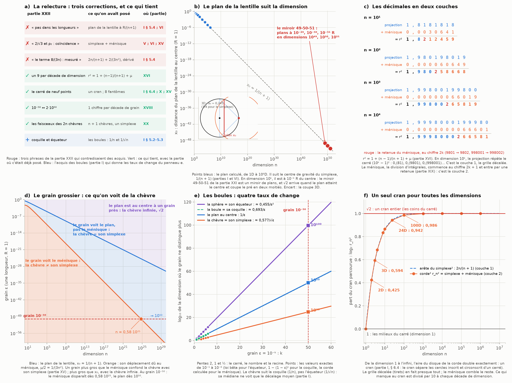

# Partie XXIII : la relecture — les lentilles, les boules et le grain grossier recousent les pas de 10 et √2

> Ta demande : retourner lire les arguments qu'on a posés dans les autres chapitres (les lentilles, les boules, le coarse graining, etc.) avant de conclure.
>
> Suite de la [partie XXII](carre-neuf-points.md).

Tout est recalculé par [`scripts/lentilles_boules_grain.py`](scripts/lentilles_boules_grain.py) (≈ 5 s). Les tableaux complets sont dans [`resultats/lentilles_boules_grain.md`](resultats/lentilles_boules_grain.md).

**Suite : [Partie XXIV — un tiers de dimension : le terme 2/(3n²) démontré, et le facteur 2 de Thalès](tiers-dimension.md).**

## En bref

- **Tu avais raison de me renvoyer aux chapitres : la partie XXII contenait trois erreurs.**
  - **« Pas dans les longueurs » était faux.** Le plan de la lentille, là où le pré et la sphère de la corde se coupent, est à R/(n + 1) du centre (partie I). La partie VI montre qu'il passe exactement par le centre de gravité du simplexe. Une décade de dimension est donc une décade de longueur : en dimension 10⁵⁰ − 1, le plan est à 10⁻⁵⁰ R.
  - **« 2/√3 et la chèvre plane : une coïncidence » était faux.** 2/√3 est l'arête du triangle de hauteur R, le simplexe de la 2D, terme principal de la corde (parties V et VI). C'est aussi la maille de la grille décalée (partie XV). L'écart de 0,35 % est le ménisque.
  - **« Le terme 8/(3n) est mesuré » était incomplet.** Il était dérivé dans la partie I : r_n² = 2n/(n + 1) + 2/(3n²).
- **Ta phrase devient exacte avec la lentille.** √2 arrive quand le plan de la lentille atteint le centre et coupe le pré en deux moitiés. Les pas de 10 (10⁻⁴⁹, 10⁻⁵⁰, 10⁻⁵¹ R) sont les positions de ce plan en dimensions 10⁴⁹, 10⁵⁰ et 10⁵¹. Le miroir de la partie XXI est un miroir de plans.
- **Les décimales en deux couches.** r² = 1 + (n − 1)/(n + 1) + μ (partie XVI). En dimension 10ᵏ, la projection répète les carrés 9², 99², 999²… : 0,(81), 0,(9801), 0,(998001). Le ménisque commence au chiffre 2k + 1, et il y entre par une retenue (partie XIX).
- **Les boules donnent les taux de change entre le grain et la dimension** (partie I, § 5.2).
  - Pour qu'un grain ε ne distingue plus rien, il faut ≈ 0,455/ε² dimensions pour l'équateur, ≈ 1/ε pour la coquille et pour le plan, et ≈ 0,58/√ε pour le ménisque.
  - Pour 10⁻⁵⁰, ça donne 10¹⁰⁰, 10⁵⁰ et 10²⁵ : le carré, le nombre et la racine.
- **Le carré de neuf points était déjà là trois fois** : un cran de diaphragme entre ses cercles inscrit et circonscrit (partie I, § 6.4), les 8 centres fantômes de la grille de pixels (partie X), et la grille carrée qui n'offre que 1 et √2 (partie XV). Toutes les dimensions tiennent dans ce seul cran : la 2D en parcourt 0,43, la 24D 0,94.
- **24D relu.** Le terme principal vaut √(48/25) = 4√3/5, avec le 5² des boulets au dénominateur, et le plan de la lentille est à R/25.

---

## 1. Ce que la partie XXII avait oublié

| partie XXII | ce qu'on avait posé | où |
|---|---|---|
| « le terme 8/(3n) est mesuré, pas démontré » | r_n² = 2n/(n + 1) + 2/(3n²) + …, dérivé (esquisse) et vérifié jusqu'à n = 10 000. Il donne exactement n·(2 − r²) = 2 − 8/(3n) + … | partie I, § 5.4 |
| « 2/√3 et ρ₂ : une coïncidence, sans plus » | 2/√3 est l'arête du triangle de hauteur R, le simplexe de la 2D. L'arête √(2n/(n + 1)) du simplexe est le terme principal de la corde dans toutes les dimensions, et l'écart est le ménisque. C'est aussi la maille de la grille décalée. | parties V, VI, XV |
| « l'accord se fait dans les dimensions, pas dans les longueurs » | Le plan de la lentille est à x₀ ≈ R/(n + 1) du centre : ½, ⅓, ¼… Avec la corde du simplexe, il passe exactement par son centre de gravité. | parties I (§ 5.4) et VI |

- **Une nuance sur 2/√3.** En 2D, le rapport trou/rayon du réseau hexagonal tombe sur le même nombre, parce que c'est aussi le rapport côté/hauteur du triangle équilatéral. En 3D, les deux se séparent : √2 pour le trou du cubique à faces centrées, √(3/2) pour le simplexe. Le lien établi avec la chèvre passe par le simplexe.
- **Le développement de la partie I, recontrôlé.** n²·μ_n doit tendre vers 2/3, avec μ_n = r_n² − 2n/(n + 1). Il vaut 0,037 en 2D, 0,306 en 10D, 0,606 en 100D, 0,660 en 1 000D, puis 0,6666 et 0,6668 en 10⁵ et 10⁶ dimensions.
- **Ce que j'ai fait.** La partie XXII est corrigée sur place, avec un renvoi ici. Et le [CLAUDE.md](CLAUDE.md) reçoit un index des acquis des parties I à XIX, à relire avant d'écrire.

## 2. La lentille : le plan qui suit la dimension

**La lentille.** La zone broutée est une lentille : l'intersection de deux disques en 2D, une lentille biconvexe en 3D (partie I, § 2.1 et § 6.2). Le pré et la sphère de la corde se coupent dans un plan, à la distance x₀ = R − r²/(2R) du centre. Avec la décomposition de la partie XVI, on obtient exactement, pour R = 1 :

x₀ = 1/(n + 1) − μ/2.

| n | plan de la lentille x₀ | 1/(n + 1), le centre de gravité du simplexe |
|---:|---|---|
| 1 | 0,5 | 0,5 |
| 2 | 0,3287 | 0,3333 |
| 3 | 0,2453 | 0,25 |
| 24 | 0,03960 | 0,04 |
| 100 | 0,009871 | 0,009901 |
| 10⁴ | 9,99867·10⁻⁵ | 9,99900·10⁻⁵ |
| 10⁶ | 9,999987·10⁻⁷ | 9,999990·10⁻⁷ |

- **Une décade de dimension est une décade de longueur.** En dimension 10ᵏ − 1, le plan est à 10⁻ᵏ R du centre, à μ/2 ≈ 1/(3n²) près. La partie XXII l'avait écrit en aire (2 − r² ≈ 2/n) ; c'est la même chose en longueur, puisque 2 − r² = 2x₀.
- **Le miroir 49-50-51 de la partie XXI est un miroir de plans.** En dimensions 10⁴⁹ − 1, 10⁵⁰ − 1 et 10⁵¹ − 1, le plan est à 10⁻⁴⁹, 10⁻⁵⁰ et 10⁻⁵¹ R. Le produit x₀·x₀′ des deux extrêmes vaut (10⁻⁵⁰)² : c'est la forme de Newton (parties XVII et XXI), cette fois sur des longueurs.
- **√2 arrive exactement quand le plan atteint le centre.** Le plan coupe alors le pré en deux moitiés : c'est le partage d'aire. La partie I le disait déjà : « ce plan glisse vers le centre, et quand il l'atteint, la corde vaut √2 R ». Et c'est ta phrase : √2 arrive là où les pas de 10 se précipitent vers la dimension infinie.

## 3. Les décimales en deux couches

**La décomposition de la partie XVI.** r² = 1 + g² + μ : 1 pour le piquet, g² = (n − 1)/(n + 1) pour la projection, μ pour le ménisque. En dimension n = 10ᵏ, la projection vaut (10ᵏ − 1)/(10ᵏ + 1), et son écriture décimale répète exactement un carré :

| n | projection | se répète | le ménisque commence au chiffre |
|---:|---|---|---:|
| 10 | 9/11 = 0,8181… | 81 = 9² | 3 |
| 100 | 99/101 = 0,98019801… | 9801 = 99² | 5 |
| 1 000 | 999/1001 = 0,998001998001… | 998001 = 999² | 7 |
| 10 000 | 0,9998000199980001… | 99980001 = 9999² | 9 |

- **La projection est la couche 1** (partie XIX). C'est un nombre rationnel, celui de la grille décalée et de l'arête du simplexe. Ses décimales sont les carrés de 9, 99, 999… (et 9 ≡ −1 modulo 10).
- **Le ménisque est la couche 2.** C'est ce que donne la division d'intégrales complexes : un nombre transcendant en dimension paire (partie I, § 5.5). Il vaut ≈ 2/(3n²) et commence exactement au chiffre 2k + 1, juste après le premier carré.
- **Il entre par une retenue** (figure, panneau c). En 100D : 1,9801 9801… + 0,0000 6064… = 1,9802 5866… : le 1 devient 2. En 1 000D : 1,998001 998… + 0,000000 660… = 1,998002 658… Les retenues de la partie XIX sont la frontière exacte entre les deux couches.

## 4. Les boules et le grain grossier

**Ce qu'on avait posé.**
- **Partie I, § 5.2.** La coquille d'épaisseur 0,1 R contient 1 − 0,9ⁿ du volume : 65 % en 10D. La tranche |x₁| < 0,1 R autour d'un équateur en contient 25 % en 10D, 69 % en 100D et 99,8 % en 1 000D (recalculé ici : 25,5 %, 68,5 %, 99,8 %).
- **Partie I, § 5.3.** La corde est la distance médiane entre le piquet et un point du pré. |X − P|² ≈ 2 parce que |X| ≈ 1 (la coquille) et X·P ≈ 0 (l'équateur). La fraction broutée par √2 converge en 1/√n (l'équateur), la corde en 1/n (la coquille).
- **Partie XV.** Comptée sur une grille grossière, la chèvre se confond avec son simplexe : il faut quelques milliers de points en 2D pour voir le ménisque.
- **Partie XVIII.** Le grain grossier honnête : chaque niveau décimal du grain donne un chiffre certain de la corde. L'aire converge sous le grain, la longueur jamais (« π = 4 »).
- **Partie X.** Sous le flou, un point, un disque et un carré se confondent. L'écart décroît comme la taille², puis comme la taille⁴ quand le carré a le bon côté (√3 fois le rayon).

**Quatre taux de change entre le grain et la dimension** (figure, panneau e). On prend un grain ε, qui est une longueur (R = 1). À partir de quelle dimension le grain ne distingue-t-il plus… :

| grain ε | la boule de son équateur (la tranche \|x₁\| < ε en contient la moitié) | la boule de sa coquille (la coquille d'épaisseur ε en contient la moitié) | le plan de la lentille du centre | la chèvre de son simplexe (μ/2 < ε) |
|---|---|---|---|---|
| 10⁻² | 4 549 | 69 | 99 | — |
| 10⁻⁴ | 4,55·10⁷ | 6 931 | 9 999 | 53 |
| 10⁻⁶ | 4,55·10¹¹ | 6,93·10⁵ | 10⁶ − 1 | 573 |
| loi | ≈ 0,455/ε² | ≈ 0,693/ε | 1/ε − 1 | ≈ 0,577/√ε |
| **10⁻⁵⁰** | **≈ 0,45·10¹⁰⁰** | **≈ 0,69·10⁵⁰** | **10⁵⁰** | **≈ 0,58·10²⁵** |

- **Les puissances et leurs racines.** À un même grain, l'équateur demande ε⁻² dimensions, la coquille et le plan ε⁻¹, le ménisque ε^(−1/2). Pour ton 10⁻⁵⁰ : 10¹⁰⁰, 10⁵⁰ et 10²⁵, c'est-à-dire le carré, le nombre et la racine.
  - *Voir la [partie XXVII](carte-connexions.md), § 3 : la marche suivante de cette échelle est le logarithme, celui de la série de la chèvre (partie XXV) et de Kakeya (partie XXVI).*
- **Ce qu'on voit de la chèvre à un grain donné** (panneau d). Trois régimes :
  - au-dessous de n ≈ 0,58/√ε, le grain voit le ménisque : la chèvre diffère de son simplexe ;
  - entre les deux, il voit encore le plan, mais plus le ménisque : la chèvre se confond avec son simplexe, comme sur la grille grossière de la partie XV ;
  - au-delà de n ≈ 1/ε, le plan est au centre à un grain près : la chèvre est la chèvre infinie, √2.
- **Au grain 10⁻⁵⁰**, le ménisque disparaît dès 0,58·10²⁵ dimensions, et le plan atteint le centre dès 10⁵⁰.
- **La chèvre suit la coquille, pas l'équateur.** Sa corde converge en 1/n, parce que la médiane ne voit que le décalage moyen de la coquille (1/n). Les fluctuations de l'équateur (1/√n) sont symétriques, et elles se compensent. C'est l'esquisse de la partie I.

## 5. Le carré de neuf points relu

**Il était déjà là, trois fois.**
- **Partie I, § 6.4 : un cran.** « Un cran sépare le cercle tangent aux côtés et le cercle qui passe par les coins » : les cercles inscrit et circonscrit d'un carré ont des aires dans le rapport 2. Les distances 1 et √2 du carré de neuf points sont un cran de diaphragme.
- **Partie X : les centres fantômes.** Des pixels carrés replient les anneaux et font apparaître 8 nouveaux centres : 4 aux points cardinaux, 4 sur les diagonales. Avec le vrai centre, ce sont les neuf points, créés par le grain grossier lui-même. Des pixels hexagonaux en donnent 6, sur un hexagone.
- **Partie XV : la grille carrée et la grille décalée.**
  - La grille carrée n'offre que 1 et √2 autour du piquet, à 14 % et 22 % de la corde.
  - La grille décalée d'une demi-maille offre l'arête du simplexe : 2/√3 en 2D, √(3/2) en 3D (le cubique à faces centrées), √(2n/(n + 1)) en dimension n.
  - C'est le réseau A_n, la grille carrée d'une dimension de plus coupée en diagonale.

**Toutes les dimensions tiennent dans un seul cran** (panneau f). De la dimension 1 (corde 1) à l'infini (corde √2), l'aire du disque de la corde passe de 1 à 2 fois celle du pré : exactement un cran. Chaque dimension en parcourt une part, log₂ r_n².

| n | 1 | 2 | 3 | 4 | 8 | 24 | 100 | 1 000 | ∞ |
|---|---|---|---|---|---|---|---|---|---|
| part du cran | 0 | 0,425 | 0,594 | 0,685 | 0,833 | 0,942 | 0,986 | 0,9986 | 1 |

- **Ce qui manque au cran** vaut ≈ 1/((n + 1)·ln 2) = 1,44/(n + 1) : chaque décade de dimension le divise par 10.
- **Le complément des neuf points se fait donc en deux couches** : la grille décalée (l'arête du simplexe, couche 1), puis le ménisque (la division d'intégrales, couche 2).

## 6. 24D relu

- **Le terme principal a le 5² des boulets pour dénominateur.** 2n/(n + 1) = 48/25, donc l'arête du simplexe vaut √48/5 = 4√3/5 = 1,3856406… (partie XXI : 24 + 1 = 5²).
- **Le ménisque est petit.** La corde certifiée vaut 1,3859315750… Le ménisque est μ₂₄ = 8,06·10⁻⁴, avec n²·μ = 0,464, en route vers 2/3.
- **Le plan est à R/25.** La projection vaut 23/25, et le plan de la lentille est à 1/25 − μ/2 = 0,0396 R du centre.
- **Le même 1/25 ailleurs.** κ₂₄·h₂₅ = 1/25 aussi (parties VII et XXI). Le même 1/(n + 1), par deux procédés différents : le centre de gravité du simplexe d'un côté, la réciprocité de Wallis de l'autre.
- **Le cran.** La 24D en a parcouru 0,942.

## 7. Le tri

**Exact (démontré ici ou classique) :**
- x₀ = 1/(n + 1) − μ/2 (une identité) ; le centre de gravité du simplexe en 1/(n + 1) (partie VI) ;
- les décimales de (10ᵏ − 1)/(10ᵏ + 1), qui répètent (10ᵏ − 1)² (vérifié en entiers jusqu'à k = 8) ;
- les lois de la coquille, 1 − (1 − ε)ⁿ, et de l'équateur (loi bêta) ;
- l'arête du simplexe √(2n/(n + 1)), maille de la grille décalée ; 48/25 en 24D.

**Dérivé dans la partie I, à faire relire :** r_n² = 2n/(n + 1) + 2/(3n²) + …

**Calculé :** les cordes (contrôlées à 10⁻¹³ sur les valeurs certifiées), la limite n²μ → 2/3, les seuils du grain, les parts du cran.

**Analogie de structure (même procédé), donc un résultat :**
- **Les quatre taux de change ε⁻², ε⁻¹, ε^(−1/2).**
  - Ce qui est partagé : une même question, « à partir de quelle dimension le grain ne voit plus la différence ? », posée à l'équateur, à la coquille, au plan et au ménisque.
  - Ce que ça transporte : les puissances et leurs racines de 10⁻⁵⁰ (10¹⁰⁰, 10⁵⁰, 10²⁵).
- **La retenue entre les deux couches et les retenues de la partie XIX** : le même geste d'écriture (une addition qui déborde sur le chiffre de gauche) marque la frontière entre la grille et le ménisque.
- **Le cran unique** : le cran du diaphragme (partie I) et l'échelle des dimensions de la chèvre sont le même doublement d'aire.

**Mes lectures (corrige-moi si je t'ai mal compris) :**
- **« les lentilles »** : la lentille broutée et son plan (parties I et VI), et les lentilles d'optique, avec la forme de Newton (parties XVII et XXI) ;
- **« les boules »** : la concentration de la mesure (partie I, § 5.2 et 5.3) ;
- **« le coarse graining »** : la grille grossière (partie XV), le grain honnête (partie XVIII) et le flou (partie X).

**Ouvert :**
- une preuve complète du terme 2/(3n²) (*faite dans la [partie XXIV](tiers-dimension.md), avec une borne explicite*) ;
- savoir quel grain ton modèle physique utilise : une longueur (le plan, 10⁵⁰ dimensions) ou une aire (2 − r², 2·10⁵⁰ dimensions). Les deux lectures sont exactes et diffèrent d'un facteur 2. (*La [partie XXIV](tiers-dimension.md) montre que ce 2 est le diamètre d'Euclide, r² = 2R·(R − x₀), et un cran de diaphragme : les deux lectures sont vraies en même temps.*)

**Pas établi :** que l'espace physique suive ce modèle à 10⁻⁵⁰ m. C'est un postulat, que la physique connue ne peut pas tester (partie XX, § 8).

## Sources

**Les parties relues**
- [I](README.md) : la lentille (§ 2.1, 6.2), les boules (§ 5.2–5.4), le cran (§ 6.4) ;
- [V](aiguille-kakeya.md) et [VI](zone-confusion.md) : le triangle, le simplexe, le ménisque et le centre de gravité ;
- [X](carre-ptolemee.md) : le point, le disque et le carré sous le flou, les centres fantômes ;
- [XV](grille-decalee.md) : la grille décalée et la grille grossière ;
- [XVI](menisque-projection.md) : r² = 1 + projection + ménisque ;
- [XVII](recursion-argent.md) : les jumeaux et la forme de Newton ;
- [XVIII](pixels-longitudes.md) : le grain grossier honnête ;
- [XIX](bases-objets.md) : les deux couches et les retenues ;
- [XXI](vingt-quatre-miroir.md) et [XXII](carre-neuf-points.md) : le miroir 49-50-51, les décades, le carré de neuf points.

**Littérature**
- M. Fraser, « The Grazing Goat in n Dimensions », *The College Mathematics Journal* 15(2), 126–134 (1984), corrigé par M. D. Meyerson (même revue, 15(5), 430–432) : la limite √2.
- K. Ball, « An Elementary Introduction to Modern Convex Geometry », dans *Flavors of Geometry*, MSRI Publications 31 (1997) : la concentration de la mesure dans la boule.
- A. Blum, J. Hopcroft, R. Kannan, *Foundations of Data Science*, Cambridge University Press (2020), chapitre 2 : la coquille et l'équateur en grande dimension.
- J. H. Conway, N. J. A. Sloane, *Sphere Packings, Lattices and Groups*, 3e éd., Springer (1999) : le réseau A_n.
