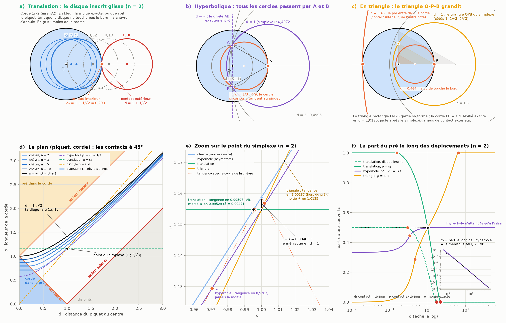
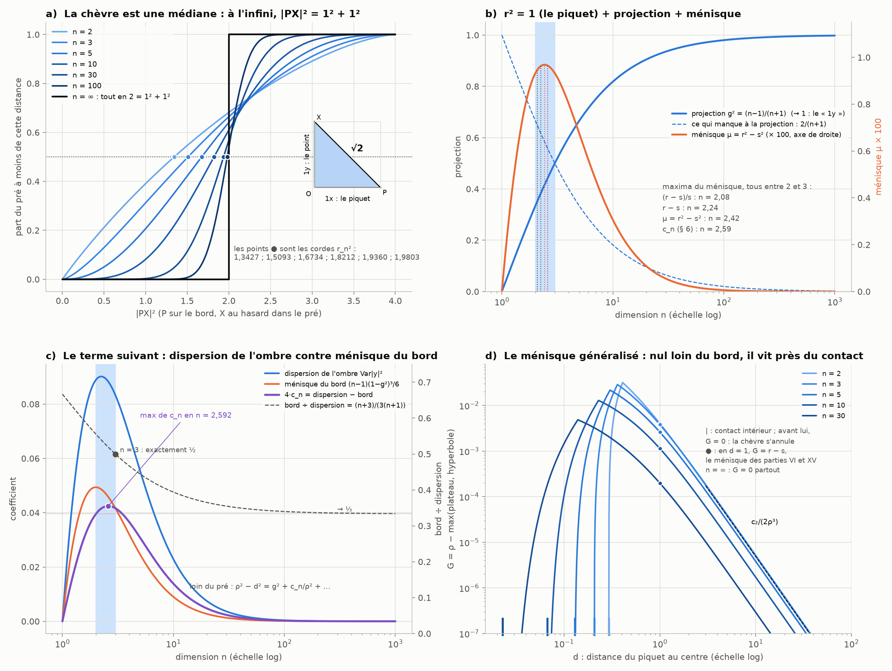

# Partie XVI : ménisque et projection, les disques qui se touchent

> Ta réponse à la partie XV : d'accord, aucune grille ne rend la corde exacte, et le ménisque ne s'annule qu'à l'infini. Mais la diagonale entre deux points séparés de 1x, 1y est exactement la valeur de la dimension infinie. Les dimensions entre 2 et l'infini deviennent des endroits où l'on peut trouver des relations entre ménisque et projection, d'où l'intérêt de la chèvre. Il faut regarder là où les disques se touchent, à l'intérieur et à l'extérieur, en suivant une translation linéaire, un déplacement hyperbolique et un déplacement en triangle. Car la chèvre s'annule aussi quand le disque inscrit n'est pas proche de la circonférence du disque qui le circonscrit.
>
> Suite de la [partie XV](grille-decalee.md).

Tout est recalculé par [`scripts/menisque_projection.py`](scripts/menisque_projection.py) (≈ 5 s). Les tableaux complets sont dans [`resultats/menisque_projection.md`](resultats/menisque_projection.md).

## En bref

- **Ta diagonale 1x, 1y est exactement la chèvre de dimension infinie, et pas seulement pour le piquet sur le bord.**
  - Généralisons la chèvre : le piquet est à la distance d du centre et la corde vaut ρ. Quand la dimension tend vers l'infini, la corde de la moitié vérifie ρ² = d² + 1.
  - Pour d = 1, on trouve √2 : l'hypoténuse d'un triangle rectangle de côtés 1 et 1.
  - La raison : en grande dimension, presque tout le pré est à la distance 1 du centre, et perpendiculaire à la direction du piquet. Le côté « 1x », c'est le piquet ; le côté « 1y », c'est le point typique du pré.
  - Ta grille décalée est faite de ces diagonales. Ses arêtes mesurent √2 dans toutes les dimensions ; seule la hauteur de son simplexe dépend de n.
- **Entre 2 et l'infini : r² = 1 + projection + ménisque.**
  - La décomposition s'écrit r² = 1 + g² + μ :
    - 1 : le piquet ;
    - g² = (n−1)/(n+1) : la projection ;
    - μ : le ménisque.
  - Exemples :
    - en 2D, 1,3427 = 1 + 0,3333 + 0,0093 ;
    - en 3D, 1,5093 = 1 + 0,5 + 0,0093 ;
    - à l'infini, 2 = 1 + 1 + 0.
  - La projection a deux visages qui coïncident exactement :
    - le rayon de la base du simplexe, côté grille ;
    - le rayon quadratique de l'ombre du pré.
  - Archimède et Parseval expliquent cette égalité.
  - Le ménisque culmine entre 2 et 3, de quelque façon qu'on le mesure : en n = 2,08, 2,24, 2,42 ou 2,59 selon la mesure.
- **La chèvre s'annule loin du bord : c'est exact.**
  - Tant que le disque de la corde reste dans le pré, la moitié s'obtient avec la corde 2^(−1/n), où que soit le piquet. En 2D, c'est 1/√2, valable jusqu'à d = 0,293.
  - La chèvre se réveille au contact, doucement, puis s'efface au loin dans la projection.
  - Ce que ni le disque inscrit ni la projection n'expliquent, je l'appelle le ménisque généralisé :
    - il est nul sur le plateau ;
    - il vaut r − s pour d = 1 ;
    - il s'éteint au loin ;
    - en dimension infinie, il est nul partout.
- **Se toucher, c'est une diagonale à 45° dans le plan (piquet, corde).** Deux cercles se touchent quand on passe de l'un à l'autre en bougeant le centre d'autant que le rayon : encore un pas 1x, 1y. C'est le modèle de Laguerre.
- **Les trois déplacements passent par le point du simplexe :**
  - **translation :** contacts en s − 1 et s + 1. La moitié exacte arrive en d = 0,99529, juste après la tangence de la partie VI.
  - **hyperbolique :** tous les cercles passent par la base du triangle.
    - Le seul contact est le cercle circonscrit au triangle, tangent au piquet.
    - La moitié n'arrive qu'à l'infini. Ce déplacement suit exactement l'asymptote de la chèvre : ce qui lui manque pour atteindre la moitié, c'est le ménisque à l'état pur.
  - **triangle :** ses distances de contact sont celles de la translation divisées par la projection. En dimension infinie, les deux déplacements touchent le pré en √2 − 1 et √2 + 1. C'est le nombre d'argent, qui sort de ta diagonale 1x, 1y.
- **Le terme suivant oppose l'ombre et le ménisque.**
  - Loin du pré, ρ² − d² = g² + c_n/ρ², avec 4c_n = dispersion de l'ombre − ménisque du bord.
  - En 3D, le ménisque du bord vaut exactement la moitié de la dispersion.



---

## 1. La diagonale 1x, 1y est la chèvre de dimension infinie

**La chèvre généralisée.**
- On garde le pré : la boule de rayon 1 et de centre O.
- On place le piquet P à une distance d quelconque de O.
- Pour chaque d, une corde ρ_n(d) broute exactement la moitié du pré.
- La chèvre habituelle est le cas d = 1, où ρ = r_n.

**À l'infini, c'est Pythagore** (figure 2, panneau a).
- Prenons un point X au hasard dans le pré de dimension n. On calcule deux moyennes :
  - la moyenne de |OX|² vaut n/(n+2) ;
  - la moyenne du carré de la composante de OX le long de OP vaut 1/(n+2).
- Quand n grandit, la première tend vers 1 et la seconde vers 0. Presque tout le pré est donc à la distance 1 de O, et perpendiculaire à OP. C'est la concentration de la mesure, expliquée simplement par Blum, Hopcroft et Kannan (ch. 2).
- Pour presque tous les points, on a alors PX² = d² + 1.
- La corde de la moitié est la médiane de PX : la moitié du pré est plus proche du piquet qu'elle. Elle tend donc vers √(d² + 1).
- Pour d = 1, c'est ta diagonale : un côté de 1 pour le piquet (1x), un côté de 1 pour le point (1y), et l'hypoténuse √2.

| n | ρ² − d² pour d = 0 | d = 1 | d = 5 |
|---:|---|---|---|
| 2 | 0,5000 | 0,3427 | 0,3337 |
| 3 | 0,6300 | 0,5093 | 0,5004 |
| 10 | 0,8706 | 0,8212 | 0,8183 |
| 100 | 0,9862 | 0,9803 | 0,9802 |
| ∞ | 1 | 1 | 1 |

**La chèvre est une médiane.**
- Le panneau a de la figure 2 trace, pour le piquet sur le bord, la part du pré à moins d'une distance donnée.
- La corde de la chèvre est l'endroit où cette courbe passe par 1/2.
- Quand n grandit, la courbe devient une marche verticale en PX² = 2 = 1² + 1².

**Ta grille décalée est faite de diagonales 1x, 1y.**
- Le réseau A_n est la grille cubique de dimension n + 1, coupée par le plan x₀ + … + x_n = 0 (partie XV).
- Ses arêtes sont les vecteurs e_i − e_j : un pas de +1 sur un axe et de −1 sur un autre.
  - C'est une diagonale 1x, 1y, de longueur √2, dans toutes les dimensions.
- Ce qui dépend de n, c'est la hauteur du simplexe : √((n+1)/n), qui tend vers 1.
- Ramenée à la hauteur 1, le rayon du pré, l'arête devient s_n = √2 / √((n+1)/n) = √(2n/(n+1)).
- Le √2 est donc déjà dans la grille en 2D, et la dimension ne fait que le réduire par la hauteur. À l'infini, la hauteur vaut 1 et l'arête est exactement la corde de la chèvre.

**Le même triangle que dans la partie VI.**
- Dans la partie VI, le rapport « moitié ÷ tangence » tendait vers √2. En grande dimension, l'arc broutable se concentre sur son bord, vu depuis le piquet à 45°.
- Ce 45°, c'est l'angle en P du triangle O-P-X, où X est un point de croisement des deux cercles :
  - en 2D, il vaut 54,74° ;
  - à l'infini, le triangle O-P-X devient rectangle isocèle, de côtés 1 et 1, et l'angle en P vaut 45°.
- Les deux √2 viennent donc du même triangle : ta diagonale.

## 2. Entre 2 et l'infini : r² = 1 + projection + ménisque

**La décomposition.** Pour la chèvre classique (d = 1), on écrit r_n² = 1 + g_n² + μ_n.
- 1, c'est le piquet : d² avec d = 1. C'est ton « 1x ».
- g_n² = (n−1)/(n+1), c'est la projection : ton « 1y », rétréci. Elle vaut 1/3 en 2D et 1/2 en 3D, et tend vers 1.
- μ_n = r_n² − s_n², c'est le ménisque : ce qui reste.

| n | r² | 1 + g² | ménisque μ | écart relatif (r − s)/s |
|---:|---|---|---|---|
| 2 | 1,342652 | 1,333333 | 0,009318 | 0,349 % |
| 3 | 1,509322 | 1,500000 | 0,009322 | 0,310 % |
| 5 | 1,673396 | 1,666667 | 0,006729 | 0,202 % |
| 10 | 1,821246 | 1,818182 | 0,003064 | 0,084 % |
| 100 | 1,980259 | 1,980198 | 0,000061 | 0,002 % |
| ∞ | 2 | 2 | 0 | 0 |

**La projection a deux visages, et ils coïncident exactement.**
- **Côté grille.** La base du simplexe passe par O, perpendiculairement à OP, et ses sommets sont à la distance s_n du piquet. Son rayon vaut g_n, par Pythagore : s² = 1 + g².
- **Côté pré.** Le plan qui passe par O perpendiculairement à OP coupe le pré selon une boule de dimension n − 1 : c'est l'ombre du pré sur ce plan.
  - La moyenne de |y|² sur cette ombre vaut aussi (n−1)/(n+1). C'est son rayon quadratique.
  - Loin du pré, la coupe qui donne la moitié est presque plate. Elle passe exactement à ce rayon (§ 6).
- **Pourquoi le même nombre ?** Deux calculs, tous deux dans R^{n+1}, l'espace où vit la grille A_n :
  - **Archimède.** Son théorème de la boîte à chapeau se généralise ainsi : un point uniforme sur la sphère S^n de R^{n+1}, projeté sur n − 1 axes, tombe uniformément dans la boule de dimension n − 1 (Coll, Dodd et Harrison). Chaque axe porte 1/(n+1) de la moyenne des carrés, donc l'ombre a pour rayon quadratique (n−1)/(n+1).
  - **Parseval.** Les n + 1 sommets e_i du simplexe de la grille forment un repère orthonormé. Or un repère orthonormé « voit » les moyennes de carrés exactement comme la sphère entière. Projetés sur les directions de la base, ses sommets redonnent (n−1)/(n+1).
  - Les deux calculs sont vérifiés numériquement dans les résultats : 400 000 points pour Archimède, la projection exacte pour Parseval.
  - Pour être honnête : ce sont deux calculs justes qui tombent sur la même fraction. Je n'ai pas trouvé de construction qui transforme l'un en l'autre.

**Le ménisque culmine entre 2 et 3, quelle que soit la façon de le mesurer** (figure 2, panneau b).

| mesure du ménisque | maximum en n = |
|---|---|
| écart relatif (r − s)/s | 2,08 |
| écart absolu r − s | 2,24 |
| écart en carrés μ = r² − s² | 2,42 |
| terme suivant c_n (§ 6) | 2,59 (racine de 2n³ − n² − 12n + 3) |

- Les deux premières mesures étaient dans les parties VI et XV.
- En carrés, le ménisque vaut presque la même chose en 2D et en 3D : 0,009318 et 0,009322. C'est la même proximité que celle du déplacement δ de la partie VI (0,0047121 dans les deux cas).

**Ménisque et translation : μ ≈ 2δ.**
- La partie VI avait trouvé la translation δ qui amène le cercle du simplexe à la moitié exacte.
- La bonne coordonnée est ρ² − d². Reculer le piquet de δ y ajoute 2δ, au premier ordre.
- Le ménisque en carrés vaut donc deux fois cette translation : 2δ/μ = 1,011 en 2D, 1,0035 en 10D, et tend vers 1.



## 3. La chèvre s'annule loin du bord : le plateau

**Tu as raison, et c'est exact.**
- Tant que le disque de la corde est entièrement dans le pré, loin de la circonférence, il broute exactement sa propre aire.
- La moitié s'obtient donc avec ρ₀ = 2^(−1/n), où que soit le piquet (figure 1, panneau a).
  - En 2D, ρ₀ = 1/√2 = 0,7071, valable jusqu'à d₀ = 1 − 1/√2 = 0,2929. On retrouve 1/√2 : la moitié de ta diagonale.
  - En 3D : 0,7937 jusqu'à 0,2063.
  - En 10D : 0,9330 jusqu'à 0,0670.
  - En dimension infinie, le plateau se réduit au point d = 0, ρ = 1.
- Sur ce plateau, il n'y a ni lentille, ni équation transcendante, ni ménisque : la chèvre s'annule.

**Le réveil au contact.**
- Le plateau s'arrête au contact intérieur. Ensuite, le disque déborde et la corde doit grandir.
- ρ − ρ₀ croît comme (d − d₀)^((n+1)/2). La lentille qui déborde près d'un point de contact a un volume qui varie avec cet exposant.
- Valeurs mesurées : 1,509 en 2D (attendu 1,5), 1,999 en 3D (attendu 2), 2,993 en 5D (attendu 3).
- Plus la dimension est grande, plus le réveil est doux.

**Le ménisque généralisé** (figure 2, panneau d).
- Deux lois simples encadrent la chèvre :
  - le disque inscrit : ρ = ρ₀, le plateau ;
  - la projection : ρ² = d² + g², l'hyperbole du § 5.
- La chèvre est toujours au-dessus des deux. Je l'ai vérifié sur 400 positions jusqu'à d = 100, pour n = 2, 3, 5 et 10.
- J'appelle ménisque généralisé ce qu'aucune des deux n'explique : G = ρ − max(ρ₀, √(d² + g²)).
  - G = 0 sur le plateau : la chèvre s'annule loin du bord.
  - G culmine là où les deux lois donnent la même corde, en d_b = √(ρ₀² − g²). En 2D, d_b = 1/√6 = 0,408 et G = 0,0318.
  - Pour d = 1, G = r − s : c'est le ménisque des parties VI et XV (0,00403 en 2D).
  - Au loin, G s'éteint comme c_n/(2ρ³).
  - En dimension infinie, G = 0 partout : le plateau se réduit à un point et l'hyperbole devient exacte.
- La chèvre vit donc près du contact, en dimension finie. C'est exactement l'endroit que tu montrais.

| n | plateau ρ₀ | contact d₀ | exposant mesuré (attendu) | d_b | G maximal | G(1) = r − s |
|---:|---|---|---|---|---|---|
| 2 | 0,7071 | 0,2929 | 1,509 (1,5) | 0,4082 | 0,0318 | 0,00403 |
| 3 | 0,7937 | 0,2063 | 1,999 (2) | 0,3605 | 0,0288 | 0,00380 |
| 5 | 0,8706 | 0,1294 | 2,993 (3) | 0,3020 | 0,0217 | 0,00260 |
| 10 | 0,9330 | 0,0670 | trop petit pour être mesuré (5,5) | 0,2288 | 0,0129 | 0,00114 |
| ∞ | 1 | 0 | — | 0 | 0 | 0 |

## 4. Se toucher, c'est une diagonale à 45°

**Le plan (piquet, corde)** (figure 1, panneau d). Chaque position du disque de la corde est un point (d, ρ).
- Deux disques dont les centres sont sur une même droite se touchent :
  - de l'intérieur, quand l'écart des centres égale l'écart des rayons : |Δd| = |Δρ| ;
  - de l'extérieur, quand l'écart des centres égale la somme des rayons.
- Dans le plan (d, ρ), ce sont des droites à 45° : on bouge le centre exactement autant que le rayon. C'est encore une diagonale 1x, 1y.
- C'est le modèle cyclographique de la géométrie de Laguerre :
  - un cercle devient un point (centre, rayon signé) d'un espace de Minkowski ;
  - deux cercles se touchent exactement quand la « distance » entre leurs points est nulle, c'est-à-dire le long d'une ligne de lumière (Bobenko et Suris).

**Les zones.** Avec le pré (centre O, rayon 1), les droites de contact découpent le plan en quatre zones :
- **la corde dans le pré** (ρ < 1 − d) : c'est là que vit le plateau ;
- **le pré dans la corde** (ρ > 1 + d) : tout est brouté ;
- **les disques séparés** (ρ < d − 1) : rien n'est brouté ;
- **la lentille**, au milieu : c'est là que vit la chèvre.

La zone de la lentille est exactement la condition pour qu'existe un triangle O-P-X de côtés 1, d et ρ, où X est un point de croisement des deux cercles. Les contacts sont les triangles aplatis.

**Les courbes de la chèvre.**
- Pour chaque n, la courbe commence par un plateau horizontal, se courbe après le contact intérieur, puis longe une hyperbole.
- Les courbes s'emboîtent : elles montent avec n, jusqu'à l'hyperbole ρ² = d² + 1 de la dimension infinie.
- Les asymptotes de cette hyperbole sont justement les droites à 45°.

## 5. Les trois déplacements, et où les disques se touchent

**Un seul triangle pour les trois.** Prenons le triangle rectangle O-P-B, où B est un sommet de la base du simplexe (figure 1, panneau c). Ses côtés sont :
- OP = d : ton 1x ;
- OB = la projection : ton 1y ;
- PB = la corde ρ.

Tes trois déplacements sont les trois façons naturelles de le déformer :
- **la translation linéaire :** la corde PB reste fixe et le piquet glisse. Dans le plan (d, ρ), c'est une droite horizontale.
- **le déplacement hyperbolique :** le côté OB reste fixe.
  - B reste donc fixe, et tous les cercles passent par la base du simplexe.
  - Dans le plan (d, ρ), ρ² − d² reste constant : c'est une hyperbole.
  - C'est l'analogue d'un « boost » de Lorentz, qui conserve ρ² − d² comme une rotation conserve ρ² + d².
- **le déplacement en triangle :** le triangle garde sa forme et grandit depuis O. C'est la demi-droite ρ = s·d.

J'ai fait passer les trois par le point du simplexe (d = 1, ρ = s), le point que donne ta grille.

**La translation** (panneaux a, e et f).
- Avec la corde du simplexe (s = 1,1547 en 2D) :
  - le pré est dans la corde jusqu'à d = s − 1 = 0,155 : c'est le contact intérieur ;
  - vient ensuite la lentille ;
  - le contact extérieur arrive en d = s + 1 = 2,155.
- Près de d = 1, on retrouve la partie VI :
  - la tangence avec le cercle de la chèvre arrive en 0,99597 ;
  - la moitié exacte arrive en 0,99529, après le croisement (δ = 0,00471).
- Avec le disque inscrit (ρ = 1/√2), la moitié est exacte tout le long du plateau. Le contact intérieur est en 0,293 et le contact extérieur en 1,707.
- C'est aussi l'autre lecture possible de ta phrase. Décalé, le disque du simplexe n'est plus partout proche du cercle de la chèvre, et l'erreur s'annule exactement : ce sont les croissants de la partie VI.

**Le déplacement hyperbolique** (panneau b).
- Tous les cercles passent par A et B, la base du triangle, à ±1/√3 sur la perpendiculaire à OP menée par O.
  - C'est un faisceau de cercles : ils ont tous le même axe radical, la droite AB.
  - Tous ces cercles donnent la même puissance au point O.
- **d = 0 :** le cercle centré en O qui passe par A et B couvre 1/3 du pré.
- **d = 1/3 :** c'est le seul contact.
  - C'est le cercle circonscrit au triangle P-A-B, de rayon 2/3. Il touche le pré exactement au piquet et couvre 4/9.
  - En dimension n, c'est la même chose : le contact a lieu en d = 1/(n+1). C'est la sphère circonscrite au simplexe, de rayon n/(n+1), tangente au piquet, qui couvre (n/(n+1))^n du pré.
- **d = 1 :** le cercle du simplexe couvre 0,49717.
- **Au-delà,** les cercles s'aplatissent vers la droite AB, qui couvre exactement 1/2.
  - Il n'y a jamais de contact extérieur, puisque les cercles passent toujours par A et B, à l'intérieur du pré.
  - La moitié n'arrive qu'à l'infini.
- **Pourquoi ce déplacement est à part.**
  - Il garde la projection fixe, et il suit exactement l'asymptote de la chèvre.
  - Ce qui lui manque pour atteindre la moitié, c'est donc le ménisque à l'état pur :
    - 0,00283 en d = 1, soit 0,566 % de la moitié : c'est la zone de confusion de la partie VI divisée par π ;
    - 0,00038 en d = 2 ;
    - 0,000025 en d = 5.
  - Ce manque décroît comme 1/d³ (encart du panneau f). En 3D, pour d = 1, il vaut exactement (59 − 24√6)/64, la part manquante de la partie VI.
- La tangence avec le cercle de la chèvre arrive en d = 0,9707, bien plus loin que pour la translation (panneau e).
- Une curiosité : en grande dimension, le cercle centré en O et la sphère circonscrite couvrent tous deux 1/e du pré. En effet, g^n et (n/(n+1))^n tendent tous deux vers 1/e.

**Le déplacement en triangle** (panneau c).
- La corde est dans le pré jusqu'à d = 1/(1 + s) = 0,464 : c'est le contact intérieur.
- La moitié exacte arrive en d = 1,0135, juste après le simplexe.
- Le pré entre dans la corde à partir de d = 1/(s − 1) = 6,46 : c'est l'autre contact intérieur, de l'autre côté.
- Il n'y a jamais de contact extérieur.
- **Ses distances de contact sont celles de la translation divisées par la projection** : 1/(1 + s) = (s − 1)/g² et 1/(s − 1) = (s + 1)/g². C'est une relation directe entre déplacement et projection.
- En dimension infinie, g² = 1 : la translation et le triangle touchent le pré aux mêmes distances, √2 − 1 = 0,414 et √2 + 1 = 2,414.
- 1 + √2 est le nombre d'argent. Il sort de ta diagonale 1x, 1y comme le nombre d'or sortait du pentagone.

| n | translation : pré dans la corde jusqu'à | contact extérieur | moitié | hyperbole : contact (sphère circonscrite) | triangle : corde dans le pré jusqu'à | moitié | pré dans la corde dès |
|---:|---|---|---|---|---|---|---|
| 2 | 0,155 | 2,155 | 0,99529 | 1/3 | 0,464 | 1,0135 | 6,46 |
| 3 | 0,225 | 2,225 | 0,99529 | 1/4 | 0,449 | 1,0091 | 4,45 |
| 5 | 0,291 | 2,291 | 0,99661 | 1/6 | 0,436 | 1,0050 | 3,44 |
| 10 | 0,348 | 2,348 | 0,99846 | 1/11 | 0,426 | 1,0019 | 2,87 |
| ∞ | √2 − 1 | √2 + 1 | 1 | 0 | √2 − 1 | 1 | √2 + 1 |

Les 0,99529 identiques en 2D et en 3D, c'est encore la proximité étrange de la partie VI.

## 6. Le terme suivant : l'ombre contre le ménisque

**Le premier ordre.**
- Quand le piquet est loin (d grand), la sphère de la corde est presque un plan.
- La coupe de la moitié passe alors au rayon quadratique de l'ombre : ρ² − d² tend vers g².

**Le second ordre.** Je l'ai calculé ici à la main, puis vérifié numériquement :
```math
\rho^2 - d^2 = g_n^2 + \frac{c_n}{\rho^2} + \cdots, \qquad c_n = \frac{2n(n-1)}{3(n+1)^3(n+3)} .
```
Cela donne c₂ = 4/405 en 2D et c₃ = 1/96 en 3D.

**Deux effets s'opposent** (figure 2, panneau c).
- **La dispersion de l'ombre.** La coupe n'est pas un plan, mais une calotte un peu courbée. Ce qui compte alors, c'est la variance de |y|² sur l'ombre : 4(n−1)/((n+1)²(n+3)).
- **Le ménisque du bord.** Près de la circonférence, la calotte sort du pré, et ce coin est perdu : (n−1)(1 − g²)³/6.
- On obtient 4c_n = dispersion − ménisque du bord.
- Le rapport ménisque du bord ÷ dispersion vaut (n+3)/(3(n+1)) :
  - 5/9 en 2D ;
  - exactement 1/2 en 3D ;
  - 1/3 à l'infini.
- c_n culmine en n = 2,59, encore entre 2 et 3.

**La vérification.**
- (ρ² − d² − g²)·ρ², calculé en d = 100, donne :
  - 0,0098769 en 2D, pour 4/405 = 0,0098765 ;
  - 0,0104171 en 3D, pour 1/96 = 0,0104167.
- Le manque de moitié le long de l'hyperbole suit c_n V_{n−1}/(2V_nρ³), où V_n est le volume de la boule de dimension n. En d = 20 et en 2D : 3,929·10⁻⁷ mesuré, 3,925·10⁻⁷ prédit.
- Je n'ai pas trouvé cette formule dans la littérature. Il faut la prendre comme un calcul fait ici et vérifié numériquement, pas comme un résultat publié.

## 7. Le tri

**Exact (démontré, ou classique) :**
- la limite ρ² = d² + 1 en dimension infinie (concentration de la mesure), vérifiée numériquement jusqu'en n = 300 ;
- les arêtes e_i − e_j de la grille décalée, qui sont des diagonales 1x, 1y de longueur √2 dans toutes les dimensions ;
- le plateau 2^(−1/n) jusqu'au contact intérieur ;
- les contacts à 45° dans le plan (piquet, corde) : le modèle de Laguerre ;
- le faisceau hyperbolique, qui passe par la base du simplexe et dont le seul contact est la sphère circonscrite, tangente au piquet ;
- les distances de contact du triangle, égales à celles de la translation divisées par g², et qui valent √2 ∓ 1 à l'infini ;
- l'égalité entre la base du simplexe et le rayon quadratique de l'ombre, par Archimède et par Parseval.

**Calculé ici (numérique, vérifié) :**
- les maxima en 2,08, 2,24, 2,42 et 2,59 ;
- la relation μ ≈ 2δ ;
- l'exposant (n + 1)/2, mesuré jusqu'en n = 5 ;
- le maximum du ménisque généralisé en d_b ;
- la chèvre toujours au-dessus de son hyperbole.

**Dérivé ici, vérifié numériquement, pas trouvé dans la littérature :**
- le coefficient c_n ;
- sa décomposition en dispersion moins ménisque du bord ;
- la loi en 1/ρ³ du manque le long de l'hyperbole.

**Mes lectures (corrige-moi si je t'ai mal compris) :**
- **« déplacement hyperbolique » :** ρ² − d² constant, c'est-à-dire les cercles qui passent par la base du simplexe ;
- **« déplacement en triangle » :** le triangle O-P-B qui grandit depuis O ;
- **« la chèvre s'annule quand le disque inscrit n'est pas proche de la circonférence » :** le plateau. L'autre lecture marche aussi : le disque du simplexe décalé par rapport au cercle de la chèvre (§ 5 ici, et § 2 de la partie VI) ;
- **les noms :** « projection » pour g² et « ménisque généralisé » pour G.

**Pas établi :** une construction unique qui transformerait la base du simplexe en ombre du pré. J'ai deux calculs qui concordent, pas une seule image.

## Sources

**Le problème de la chèvre**
- I. Ullisch, « A Closed-Form Solution to the Geometric Goat Problem », *The Mathematical Intelligencer* 42(3), 12–16 (2020). [doi:10.1007/s00283-020-09966-0](https://doi.org/10.1007/s00283-020-09966-0)
- M. Fraser, « The Grazing Goat in n Dimensions », *The College Mathematics Journal* 15(2), 126–134 (1984). [doi:10.2307/2686517](https://doi.org/10.2307/2686517) ; et M. D. Meyerson, « Return of the Grazing Goat in n Dimensions », *ibid.* 15(5), 430–432 (1984). [doi:10.2307/2686558](https://doi.org/10.2307/2686558)

**Grande dimension, projection, grille**
- A. Blum, J. Hopcroft, R. Kannan, *Foundations of Data Science*, Cambridge UP (2020), ch. 2 : « la plus grande partie du volume est près de l'équateur » et près du bord. [version en ligne des auteurs](https://www.cs.cornell.edu/jeh/book2016june9.pdf)
- V. Coll, J. Dodd, M. Harrison, « The Archimedean Projection Property », *Advances in Geometry* (2017) : la projection de codimension 2 d'une sphère est uniforme sur la boule. [arXiv:1504.02941](https://arxiv.org/abs/1504.02941)
- J. H. Conway et N. J. A. Sloane, *Sphere Packings, Lattices and Groups*, Springer, chapitre 4 : le réseau A_n et ses vecteurs minimaux e_i − e_j.

**Cercles qui se touchent**
- A. I. Bobenko et Yu. B. Suris, « On organizing principles of discrete differential geometry. Geometry of spheres », *Russian Math. Surveys* 62, 1–43 (2007), avec la géométrie de Laguerre et son modèle dans l'espace de Minkowski. [arXiv:math/0608291](https://arxiv.org/abs/math/0608291)
- Wikipédia : [Laguerre transformations](https://en.wikipedia.org/wiki/Laguerre_transformations) ; [Pencil (geometry)](https://en.wikipedia.org/wiki/Pencil_(geometry)) (faisceaux de cercles) ; [Radical axis](https://en.wikipedia.org/wiki/Radical_axis) (axe radical, puissance d'un point) ; [Silver ratio](https://en.wikipedia.org/wiki/Silver_ratio) (nombre d'argent).

**Les parties précédentes :** [VI](zone-confusion.md) (le ménisque, la translation δ, le rapport qui tend vers √2), [XIV](aiguille-grille.md) et [XV](grille-decalee.md) (la grille décalée, les maxima en 2,08 et 2,24).
