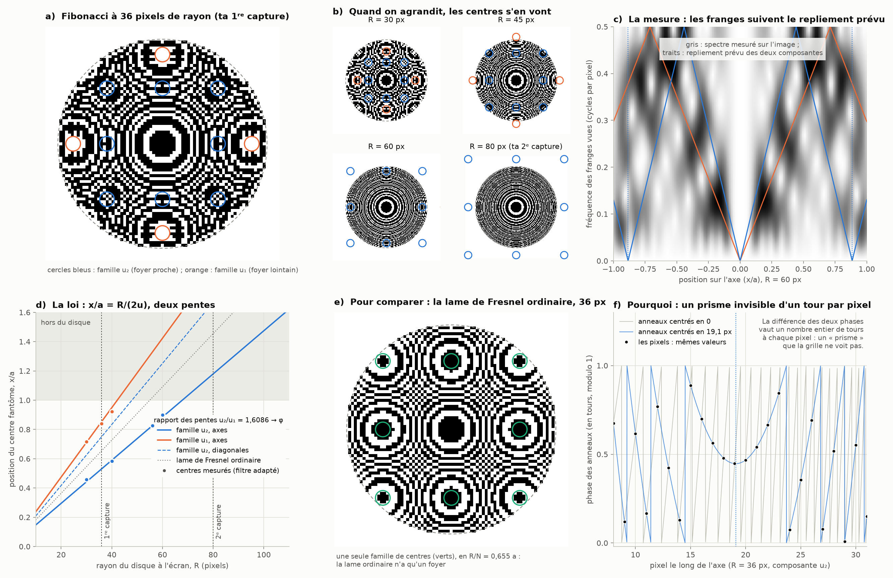
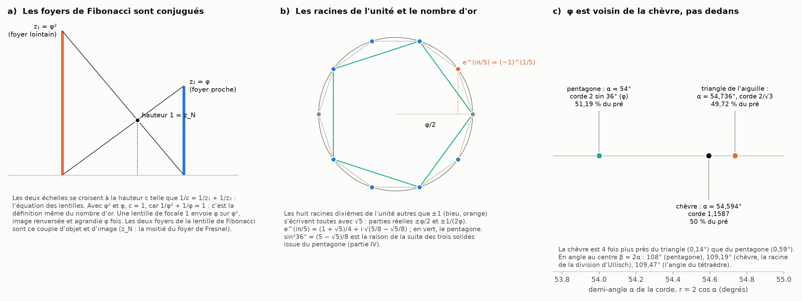

# Partie IX : le moiré du diaphragme de Fibonacci, l'équation d'optique et les racines de l'unité

> Ce que tu as vu : quand l'image du diaphragme de Fibonacci rétrécit, d'autres cercles apparaissent, comme de nouveaux centres qui se repropagent, aux quatre points cardinaux. Ils disparaissent quand on agrandit. Tu y vois un effet de ménisque, qui affecte les dimensions de l'image de façon réciproque. Tu proposes aussi que φ apparaisse au contact entre la chèvre et l'aiguille, tu demandes ce que l'équation d'optique et le dernier théorème de Fermat ont à voir avec tout ça, et tu évoques les racines ^(1/n) et les racines de l'unité. Suite de la [partie VIII](foyer-fibonacci.md).

Tout est recalculé par [`scripts/moire_fibonacci.py`](scripts/moire_fibonacci.py) (≈ 10 s). Les tableaux complets sont dans [`resultats/moire_fibonacci.md`](resultats/moire_fibonacci.md).

**Suite : [Partie X — le trou du rayon droit, le point et le carré, Ptolémée et le plan hyperbolique](carre-ptolemee.md).**

## En bref

- **Ce que tu as vu est un moiré, et il se calcule exactement.**
  - Les anneaux du diaphragme sont de plus en plus fins vers le bord. Quand l'image rétrécit, ils deviennent plus fins qu'un pixel, et l'écran les « replie » sur sa grille : c'est le repliement de spectre.
  - Chaque système d'anneaux réapparaît alors **centré ailleurs**, en des points qui forment un réseau carré, copie de la grille des pixels. Les plus proches sont les **quatre points cardinaux**, puis les quatre diagonales.
  - Quand on agrandit l'image, ces centres s'éloignent proportionnellement à la taille, puis sortent du disque.
  - Tes deux captures font 36 et 80 pixels de rayon. Dans la première, les nouveaux centres sont dans le disque. Dans la seconde, ils sont juste au-delà du bord (1,18 fois le rayon) : on n'en voit que les arcs, aux points cardinaux.
- **φ est bien là.** Le diaphragme de Fibonacci donne **deux familles** de nouveaux centres. Ce sont les deux composantes de ses anneaux, celles qui font ses deux foyers (partie VIII), et leurs distances au centre sont dans le rapport u₂/u₁ → φ. La lame de Fresnel ordinaire n'en donne qu'une. Le moiré dessine sur l'écran, à l'échelle, les deux distances focales.
- **Pourquoi : un prisme invisible.** À chaque pixel, des anneaux centrés en 0 et les mêmes anneaux centrés plus loin ne diffèrent que d'un nombre entier de tours de phase. Le geste est le même que celui de la lentille de Fresnel : ne garder la phase qu'à un tour près. Fresnel replie le ménisque dans l'épaisseur, la grille des pixels replie la phase dans l'espace.
- **C'est mesuré.**
  - Sur un diaphragme à 144 anneaux, les 7 centres prévus sont retrouvés à 0,2 pixel près.
  - Sur celui à 55 anneaux, aux petites tailles, 7 centres sur 11 sont retrouvés à 1 pixel près. Les 4 autres ne sont pas trouvés, car les « yeux » fantômes n'y ont qu'une ou deux franges.
- **L'équation d'optique : oui, et c'est exact.**
  - Les deux foyers de la lentille de Fibonacci vérifient l'équation des lentilles, 1/z₁ + 1/z₂ = 1/f, avec f égal à la moitié du foyer de Fresnel : ce sont un objet et son image.
  - À la limite, z₁ = φ² et z₂ = φ, et 1/φ² + 1/φ = 1 est la définition même du nombre d'or.
  - La même équation à la puissance n est l'équation de Fermat : elle a des solutions entières pour n = 1 et 2, aucune pour n ≥ 3 (Wiles, 1995).
- **Tes racines de l'unité sont exactes**, et elles nous ramènent au pentagone.
  - e^(iπ/5) = (1 + √5)/4 + i·√(5/8 − √5/8).
  - Les huit autres racines dixièmes s'écrivent avec √5.
  - sin²36° = (5 − √5)/8 est la raison de notre suite des trois solides partie du pentagone (partie IV).
- **φ au contact de la chèvre et de l'aiguille : voisin, pas dedans.** La corde « pentagone » ferait brouter 51,19 % du pré, et le triangle de l'aiguille 49,72 %. La chèvre, à 50 %, est quatre fois plus près du triangle. En revanche, φ apparaît exactement là où les anneaux touchent les lignes droites des pixels, dans le moiré.
- **Une correction.** φ et le nombre plastique ρ ne sont pas transcendants : ce sont des racines de polynômes à coefficients entiers (x² = x + 1, x³ = x + 1). π, lui, est transcendant. C'est exactement la frontière entre les dimensions impaires et paires de la chèvre (parties I et VII).

---

## 1. Ce que tu as vu : un moiré, calculable exactement

**D'où vient l'effet.**
- Les anneaux ont des rayons en √k : vers le bord, ils sont de plus en plus serrés. Sur un disque de rayon a, la fréquence des anneaux croît comme r.
- Une image à l'écran n'existe qu'aux pixels. Une fréquence plus grande que celle des pixels ne disparaît pas : elle se replie et réapparaît comme une fréquence plus basse. C'est le repliement de spectre (en anglais *aliasing*).
- La lame de zones est d'ailleurs la mire classique pour tester ce défaut, en vidéo comme en infographie, justement parce qu'elle contient toutes les fréquences à la fois.

**La loi exacte.** Prenons une composante des anneaux, cos(2πu·r²/R²), sur un disque de R pixels de rayon.
- Aux pixels (x entier), les valeurs de u·x²/R² et de u·(x − x_m)²/R² ne diffèrent que d'un nombre entier, plus une constante, dès que x_m = m·R²/(2u). Le script le vérifie sur 801 pixels, à 8·10⁻¹² près.
- La grille ne peut donc pas distinguer les anneaux centrés en 0 de ceux centrés en x_m : l'œil voit un **nouveau centre** en x_m.
- En deux dimensions, ces centres sont aux points (m, n)·R²/(2u) : un réseau carré, copie de la grille des pixels.
  - Les plus proches sont les **quatre points cardinaux**, (±1, 0) et (0, ±1).
  - Viennent ensuite les quatre diagonales, √2 fois plus loin. Ce √2 est celui de la grille carrée, pas celui de la chèvre.
- En unités du rayon a, le centre est en **x_m/a = m·R/(2u)**.

**Pourquoi ils disparaissent quand on agrandit.** x_m/a croît avec R. Agrandir l'image (augmenter R) éloigne donc les centres, qui sortent du disque quand R dépasse 2u. Pour le diaphragme de 55 anneaux :

| rayon à l'écran R | famille u₂ (axes) | famille u₁ (axes) | u₂ (diagonales) | lame de Fresnel (axes) |
|---:|---|---|---|---|
| 30 px | 0,442 a | 0,711 a | 0,625 a | 0,545 a |
| 36 px (ta 1ʳᵉ capture) | 0,531 a | 0,854 a | 0,751 a | 0,655 a |
| 45 px | 0,663 a | dehors (1,067 a) | 0,938 a | 0,818 a |
| 60 px | 0,885 a | dehors | dehors | dehors |
| 80 px (ta 2ᵉ capture) | dehors (1,179 a) | dehors | dehors | dehors |
| 100 px | dehors | dehors | dehors | dehors |

- La famille u₂ quitte le disque à R = 67,8 px, la famille u₁ dès R = 42,2 px. Le rapport de ces deux seuils vaut u₂/u₁, qui tend vers φ.
- Dans ta seconde capture, le centre u₂ est à 1,179 a, juste derrière le bord : on voit ses arcs aux quatre points cardinaux, mais pas son centre.
- À la taille réelle de la figure (R ≈ 200 px dans le fichier), il n'y a plus rien.

**Un prisme invisible.** La différence entre les deux phases, 2π·m·x, est une rampe : en optique, c'est un prisme. Ajouté à une lentille, un prisme déplace son foyer sur le côté. La grille des pixels ne voit pas ce prisme, puisqu'il vaut un nombre entier de tours à chaque pixel. Chaque nouveau centre est donc le foyer de la lame, dévié par un prisme que l'écran ne peut pas voir (panneau f).

**Le lien avec le ménisque.** Tu parles d'un effet de ménisque, et il y a un vrai lien, au sens précis du § 2 de la partie VIII.
- La lentille de Fresnel découpe le ménisque de phase tous les λ/2 : elle ne garde la phase qu'à un tour près, dans l'épaisseur.
- La grille des pixels fait la même opération dans l'espace, une fois par pixel.
- Les deux replient la même phase en r², et ce repliement fait apparaître des foyers (Fresnel) ou des centres (moiré) supplémentaires.

**La réciprocité.** En pixels, x_m × (taille d'un pixel) = a²/(2u) : la position du centre multipliée par la taille du pixel est constante. C'est la réciprocité de Fourier entre l'espace et les fréquences, et elle a encore la forme x ↦ c/x de la lentille et de la partie VII. Sur une grille cubique en dimension n, il y aurait 2n centres « cardinaux », par exemple 6 en 3D, les faces d'un cube. En revanche, je n'ai pas de lien établi entre ce moiré et les dimensions de la chèvre.

## 2. Deux familles de centres, dans le rapport φ

**Pourquoi deux familles.** Le diaphragme de Fibonacci n'est pas une seule lame de Fresnel. Ses anneaux contiennent surtout deux systèmes, de fréquences u₁ = 21,084 et u₂ = 33,916 pour 55 anneaux. Ce sont les deux composantes qui donnent ses deux foyers (partie VIII). Chacune a sa famille de centres :

- x₁/a = R/(2u₁) et x₂/a = R/(2u₂), dans le rapport **u₂/u₁ = 1,6086 → φ** (panneau d) ;
- la lame de Fresnel ordinaire, avec u = N/2, n'a qu'une famille, en x_F/a = R/N (panneau e) ;
- les trois sont liées par 1/x₁ + 1/x₂ = 2/x_F, c'est-à-dire l'équation des foyers (§ 3), puisque chaque position est proportionnelle à la distance focale correspondante.

**Le moiré dessine les deux foyers.** La position de chaque famille est proportionnelle à 1/u, donc à la distance focale z. Sur ton écran, aux quatre points cardinaux, le moiré trace à l'échelle les deux distances focales de la lentille de Fibonacci.

**La mesure.**
- **Le spectre local** (panneau c). Le long de l'axe, à 60 px de rayon, la fréquence des franges réellement présentes dans l'image suit les droites de repliement prévues pour u₁ et u₂, qui touchent zéro aux nouveaux centres.
- **Le filtre adapté.** Il cherche, le long de l'axe, les points autour desquels l'image (adoucie d'un pixel, comme par l'œil) ressemble à des anneaux centrés :

| anneaux | rayon R | famille | centre prévu | centre mesuré | écart |
|---:|---:|---|---:|---:|---:|
| 144 | 90 px | u₂ | 45,5 | 45,6 | +0,1 |
| 144 | 90 px | u₁ | 73,6 | 73,5 | −0,1 |
| 144 | 100 px | u₂ | 56,2 | 56,4 | +0,2 |
| 144 | 100 px | u₁ | 90,9 | 91,1 | +0,2 |
| 144 | 110 px | u₂ | 68,0 | 67,9 | −0,1 |
| 144 | 120 px | u₂ | 80,9 | 80,9 | 0,0 |
| 144 | 130 px | u₂ | 95,0 | 95,0 | 0,0 |
| 55 | 30 px | u₂ / u₁ | 13,3 / 21,3 | 13,7 / 21,5 | +0,4 / +0,2 |
| 55 | 36 px | u₂ / u₁ | 19,1 / 30,7 | non trouvé / 30,2 | — / −0,5 |
| 55 | 40 px | u₂ / u₁ | 23,6 / 37,9 | 23,3 / 36,9 | −0,3 / −1,0 |
| 55 | 44, 50, 64 px | u₂ | 28,5 ; 36,9 ; 60,4 | non trouvés | — |
| 55 | 56 px | u₂ | 46,2 | 46,3 | +0,1 |
| 55 | 60 px | u₂ | 53,1 | 54,0 | +0,9 |

(positions en pixels depuis le centre)

- Avec 144 anneaux, tout est retrouvé à 0,2 pixel près.
- Avec 55 anneaux et moins de 65 pixels de rayon, l'« œil » fantôme ne compte qu'une ou deux franges, et le détecteur en manque 4 sur 11. Sur les images (panneaux a et b), les centres prévus tombent pourtant bien sur les yeux qu'on voit.

## 3. L'équation d'optique et le dernier théorème de Fermat

**Les deux foyers de Fibonacci sont conjugués.** Dans la partie VIII, on a trouvé u₁ + u₂ = N exactement. Comme u = a²/(2λz), cela s'écrit :

1/z₁ + 1/z₂ = 1/z_N, avec z_N = a²/(2λN), la moitié du foyer de la lame de Fresnel ordinaire.

C'est l'**équation des lentilles** : z₁ et z₂ sont un objet et son image pour une lentille de focale z_N. C'est le sens exact de « second foyer conjoint ».

| anneaux N | z₁ / z_N | z₂ / z_N | 1/z₁ + 1/z₂ (en 1/z_N) | grandissement −z₁/z₂ |
|---:|---|---|---|---|
| 55 | 2,608612 | 1,621654 | 1,000000 | −1,608612 |
| 89 | 2,618211 | 1,617966 | 1,000000 | −1,618211 |
| 144 | 2,616647 | 1,618564 | 1,000000 | −1,616647 |
| 233 | 2,618057 | 1,618025 | 1,000000 | −1,618057 |
| 377 | 2,617832 | 1,618111 | 1,000000 | −1,617832 |
| 610 | 2,618037 | 1,618033 | 1,000000 | −1,618037 |

**Le nombre d'or est une équation de lentille.**
- Les deux foyers tendent vers φ² et φ, et 1/φ² + 1/φ = 1 n'est autre que φ² = φ + 1, la définition du nombre d'or.
- Une lentille de focale 1 forme l'image d'un objet placé à la distance φ à la distance φ², **retournée et agrandie φ fois**.
- Dans la forme de Newton, l'objet est à 1/φ du foyer avant, l'image à φ du foyer arrière, et leur produit vaut 1.
- Le panneau a de la seconde figure le montre avec deux échelles croisées.

**L'« équation d'optique » des arithméticiens.** 1/a + 1/b = 1/c en nombres entiers porte justement ce nom. C'est la loi des lentilles, des résistances en parallèle et des échelles croisées.
- La suite de Fibonacci en fournit une famille : a = F_j·F_(j−1), b = F_j·F_(j−2), c = F_(j−1)·F_(j−2). Par exemple 1/15 + 1/10 = 1/6.
- **Le lien avec Fermat.** Si 1/aⁿ + 1/bⁿ = 1/cⁿ, on multiplie par (abc)ⁿ et on obtient (bc)ⁿ + (ac)ⁿ = (ab)ⁿ, l'équation de Fermat. Le script, en cherchant jusqu'à a, b ≤ 300, trouve :
  - n = 1 : 397 solutions, dont 63 primitives, de (2, 2, 1) à (6, 30, 5) pour les premières ;
  - n = 2 : 3 primitives, dont (15, 20, 12), car 1/225 + 1/400 = 1/144. C'est le « théorème de Pythagore inverse » : la hauteur h d'un triangle rectangle de côtés a et b vérifie 1/a² + 1/b² = 1/h² ;
  - n = 3 : aucune, et il n'y en a aucune pour n ≥ 3. C'est le théorème de Wiles (1995).

**Ce que ça dit de mes deux résultats « pas trouvés écrits ».**
- La symétrie des deux foyers *est* l'équation des lentilles : elle est écrite dans la plus vieille loi de l'optique. Seule la façon de la lire sur la lentille de Fibonacci est de nous.
- Le seuil de 0,64 λ est d'une autre nature. C'est la racine d'une équation transcendante, une intégrale de Hopkins. Fermat, qui parle d'équations en nombres entiers, ne le donne pas.

## 4. Les racines de l'unité, le pentagone et la chèvre

**Ta formule est exacte.** (−1)^(1/5) = e^(iπ/5) = cos 36° + i sin 36° = (1 + √5)/4 + i·√(5/8 − √5/8). Le script la retrouve à la précision de la machine.

**« Les huit ».** Je les lis comme les huit racines dixièmes de l'unité autres que ±1 ; dis-moi si tu pensais à autre chose. Elles s'écrivent toutes avec √5 : leurs parties réelles valent ±φ/2 = ±0,809 et ±1/(2φ) = ±0,309.

**Où φ entre dans notre machinerie.** La suite des trois solides partie du pentagone (partie IV) a pour raison sin²36° = (5 − √5)/8 = (3 − φ)/4 : exactement le carré de ta partie imaginaire.

**φ au contact de la chèvre et de l'aiguille ?** On compare trois cordes partant du piquet :

| corde | r | demi-angle α | angle au centre β = 2α | part broutée |
|---|---|---|---|---|
| triangle de l'aiguille (2/√3) | 1,154701 | 54,7356° | 109,4712° (l'angle du tétraèdre) | 49,717 % |
| chèvre | 1,158728 | 54,5942° | 109,1883° | 50,000 % |
| pentagone (2 sin 36°, avec r² = 3 − φ) | 1,175571 | 54,0000° | 108,0000° (l'angle du pentagone) | 51,186 % |

- **φ est voisin, pas dedans.** La chèvre est quatre fois plus près du triangle (0,14°) que du pentagone (0,59°). La corde du pentagone donnerait exactement (13 − 3φ)/10 − sin 72°/π = 51,186 % du pré.
- **La singularité de la chèvre.** β = 1,9057 rad = 109,19° est la racine que calcule la division d'Ullisch (partie IV), là où chacune de ses intégrales a son pôle. Elle tombe à 0,28° de l'angle du tétraèdre, la famille du triangle : c'est l'écart de 0,35 % de la partie VI, vu en angle. Dans ce sens, oui, la singularité est « aux bords du triangle ».
- **Où φ touche vraiment.** φ apparaît exactement au contact entre les cercles et les droites dans le moiré, là où les anneaux deviennent tangents aux lignes de pixels, aux points cardinaux.

**Les racines ^(1/n) : où la spirale s'arrête pour la chèvre.**
- Toutes les racines de l'unité s'écrivent avec des radicaux (Gauss, 1801), comme ta formule pour (−1)^(1/5).
- La corde de la chèvre aussi, mais seulement en dimensions 1 et 3. En dimension 3, c'est une équation de degré 4 (Ferrari).
- À partir de la dimension 5, ses polynômes ont pour groupes de Galois S₈, S₁₂, S₁₆ (partie I). Aucune formule en racines ^(1/n), aussi emboîtées soient-elles, ne peut l'écrire.
- En dimension paire, elle est transcendante (partie I).

## 5. Précision, nombres entiers et nombres « naturels »

**Une correction d'abord.**
- φ et le nombre plastique ρ ne sont pas transcendants. Ils sont **algébriques** : φ est racine de x² = x + 1, ρ de x³ = x + 1. Ce sont, dans tes mots, des « racines d'anomalies entières ».
- π, lui, est transcendant (Lindemann, 1882) : aucun polynôme à coefficients entiers ne l'annule.
- Cette frontière est exactement celle de la chèvre : corde algébrique en dimension impaire, transcendante en dimension paire, où π entre dans l'équation.

**Les « décalages » de précision sur les entiers ont une forme exacte.**
- Le moiré, c'est l'arithmétique des fréquences modulo 1 sur la grille des entiers : une fréquence f se voit comme f − (l'entier le plus proche).
- **Le théorème de Hurwitz (1891)** dit que tout irrationnel x s'approche par une infinité de fractions avec q²·|x − p/q| < 1/√5, et qu'on ne peut pas faire mieux que √5. Le coupable est φ : c'est le nombre que les fractions approchent le plus mal.

| fraction | q²·|x − p/q| |
|---|---|
| φ ≈ 8/5 | 0,4509 |
| φ ≈ 34/21 | 0,4470 |
| φ ≈ 144/89 | 0,44722 |
| φ ≈ 987/610 | 0,447214, soit 1/√5 |
| π ≈ 22/7 | 0,062 |
| π ≈ 355/113 | 0,0034 |

- Les entiers attrapent π très vite (355/113 est juste à 3·10⁻⁷), mais φ le plus lentement possible.
- C'est pour cela que les spirales à angle d'or (tournesols, grilles de Fibonacci de la partie VIII) évitent les alignements : φ est le nombre qui résiste le mieux aux entiers.

## 6. Le tri

**Exact, démontré ou calculé :**
- la loi du moiré, avec les centres en (m, n)·R²/(2u), vérifiée à 8·10⁻¹² ;
- les deux familles de centres du diaphragme de Fibonacci, dans le rapport u₂/u₁ → φ, et la famille unique de la lame de Fresnel ;
- les deux foyers conjugués : 1/z₁ + 1/z₂ = 1/z_N exactement, et 1/φ² + 1/φ = 1 ;
- l'équivalence entre l'équation d'optique à la puissance n et l'équation de Fermat ;
- ta formule de (−1)^(1/5), les huit racines dixièmes, et la raison du pentagone ;
- les radicaux : seulement en dimensions 1 et 3 pour la chèvre (partie I) ;
- Hurwitz : la constante √5, atteinte par φ.

**Mesuré :**
- 7 centres sur 7 à 0,2 pixel près avec 144 anneaux ;
- 7 sur 11 à 1 pixel près avec 55 anneaux aux petites tailles, 4 non trouvés.

**Pas établi :**
- un lien entre ce moiré et les dimensions de la chèvre (3D, 4D…). La réciprocité du moiré est celle de Fourier, entre la taille de l'image et la position des centres ;
- « les entiers comme anomalies de simplicité » : c'est un point de vue, pas un théorème, même si la frontière entre algébrique et transcendant, elle, est précise.

**À corriger :**
- φ et ρ sont algébriques, pas transcendants ;
- φ n'est pas dans la corde de la chèvre. Le pentagone en est un voisin, quatre fois plus loin que le triangle de l'aiguille.

## Sources

- C. S. Kaplan, [« Aliasing artifacts and accidental algorithmic art »](https://cs.uwaterloo.ca/~csk/other/alias/) : la lame de zones comme fonction de test de l'échantillonnage, et ses motifs de repliement.
- [« Zone plate images »](https://satsignal.eu/imaging/frequency_chart.htm) : la lame de zones comme mire de repliement en imagerie.
- [« Optic equation »](https://en.wikipedia.org/wiki/Optic_equation) (Wikipédia, en anglais) : l'équation 1/a + 1/b = 1/c en nombres entiers et son lien avec Fermat.
- A. Wiles, « Modular elliptic curves and Fermat's Last Theorem », *Annals of Mathematics* 141(3), 443–551 (1995) ; R. Taylor et A. Wiles, « Ring-theoretic properties of certain Hecke algebras », *Annals of Mathematics* 141(3), 553–572 (1995).
- A. Hurwitz, « Ueber die angenäherte Darstellung der Irrationalzahlen durch rationale Brüche », *Mathematische Annalen* 39, 279–284 (1891).
- C. F. Gauss, *Disquisitiones arithmeticae* (1801), section VII : les racines de l'unité par radicaux.
- F. Lindemann, « Über die Zahl π », *Mathematische Annalen* 20, 213–225 (1882).
- J. A. Monsoriu et al., « Bifocal Fibonacci diffractive lenses », *IEEE Photonics Journal* 5(3), 3400106 (2013) : [notice DOAJ](https://doaj.org/article/0d027acee9424adaa5f3f55e4684df75).
- Parties [I](README.md) (groupes de Galois, transcendance), [IV](trois-solides.md) (le pentagone, la singularité d'Ullisch), [VI](zone-confusion.md) (l'écart de 0,35 %) et [VIII](foyer-fibonacci.md) (les deux foyers).
