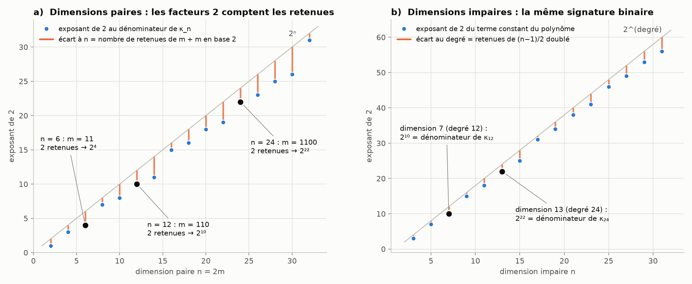
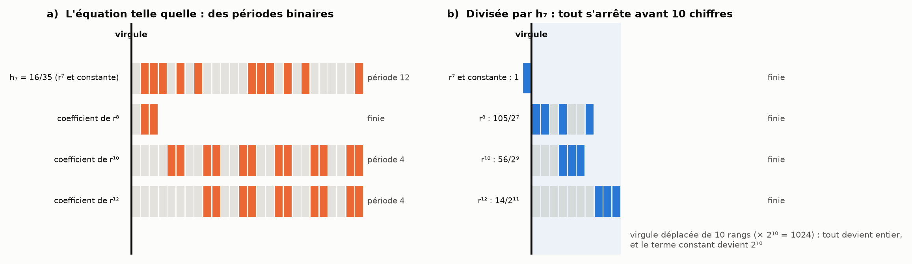

# Partie VII : les nombres des polynômes de la chèvre

> L'idée proposée : comparer les nombres des polynômes des dimensions impaires (3D, 5D, 7D) à ceux des dimensions paires 6, 12 et 24. Elle part d'une remarque : l'écriture des nombres (la base) rendrait visible le lien entre la transcendance de la dimension 2 et le polynôme entier de la dimension 3. Suite de la [partie VI](zone-confusion.md).

Tout est recalculé par [`scripts/polynomes.py`](scripts/polynomes.py) (≈ 5 s). Les tableaux complets sont dans [`resultats/polynomes.md`](resultats/polynomes.md).

## En bref

- **Une seule équation pour toutes les dimensions.** La parité ne change qu'une chose. En dimension impaire, tout est polynôme. En dimension paire, une racine carrée, celle du cercle, fait apparaître un arc : l'angle et π (§ 1).
- **Les dimensions impaires contiennent le rapport d'Archimède.** 3r⁴ − 8r³ + 8 = 0 s'écrit r⁴/4 = (2/3)(r³ − 1), où 2/3 est le rapport hémisphère/cylindre (§ 2).
- **Les dimensions paires 6, 12 et 24 ont une équation commune**, avec un angle et π/2. Leurs nombres clés sont κ₆ = 5/16, κ₁₂ = 231/1024 et κ₂₄ = 676039/4194304 (§ 3).
- **Paires et impaires sont réciproques** : κ₆ × h₇ = 5/16 × 16/35 = 1/7, et de même 12 ↔ 13 et 24 ↔ 25 (§ 4).
- **Ton intuition sur l'écriture a un fond exact : la base 2 compte des retenues** (théorème de Kummer, 1852).
  - Le nombre de facteurs 2 dans ces nombres est le nombre de retenues quand on additionne m + m en binaire.
  - 6, 12 et 24 donnent m = 3, 6, 12, qui s'écrivent 11, 110, 1100 : deux retenues chacun. D'où les dénominateurs 2⁴, 2¹⁰ et 2²² (§ 5).
- **Le terme constant de chaque polynôme impair est exactement le dénominateur de la dimension paire égale à son degré.**
  - 7D, de degré 12 : 1024, le dénominateur de κ₁₂ = 231/1024.
  - 13D, de degré 24 : 2²², le dénominateur de κ₂₄.
  - **C'est maintenant démontré** : après division par le rapport d'Archimède h_n, tous les coefficients ont une écriture binaire finie. La puissance de 2 mesure de combien il faut déplacer la virgule binaire pour les rendre entiers (§ 7).
  - Le 6 est le degré du polynôme qui manque, celui de la dimension 4, qui est paire.
- **Le polynôme de degré 24 a pour groupe de Galois S₂₄**, le groupe le plus général possible. Ce n'est pas la symétrie exceptionnelle du 24 du réseau de Leech.



---

## 1. Une seule équation pour toutes les dimensions

Le pré a pour rayon 1, le piquet est sur le bord, et la corde vaut r = 2 cos α. Dans toutes les dimensions n, la condition « la chèvre broute la moitié » s'écrit :

```math
r^n\,\big[Q_n(1) - Q_n(r/2)\big] = Q_n\!\left(1 - \tfrac{r^2}{2}\right),
\qquad
Q_n(c) = \int_0^c (1-u^2)^{\frac{n-1}{2}}\,du .
```

$Q_n$ est l'intégrale des tranches d'une calotte. $Q_n(1)$ vaut le rapport hémisphère/cylindre $h_n$ de la partie IV, et $r^n$ est l'agrandissement du volume de la boule de rayon r.

**D'où vient la transcendance.** Tout se joue sur l'exposant (n − 1)/2.
- **Dimension impaire** : l'exposant est entier, (1 − u²)^m est un polynôme, et l'équation aussi.
- **Dimension paire** : l'exposant est un demi-entier, et la tranche contient √(1 − u²), la racine carrée du cercle. Son intégrale est un arc (arcsin). C'est ce qui fait entrer l'angle et π, avec le coefficient $\kappa_n = \binom{2m}{m}/4^m$ (la moyenne de sin²ᵐ).

Le lien entre la transcendance de la dimension 2 et le polynôme entier de la dimension 3 est donc précis : c'est la même équation, et seule la racine du cercle les distingue.

## 2. Les dimensions impaires : des polynômes entiers

| n | degré | polynôme | h_n | terme constant |
|---:|---:|---|---|---|
| 3 | 4 | 3r⁴ − 8r³ + 8 | 2/3 | 2³ |
| 5 | 8 | 5r⁸ − 80r⁶ + 128r⁵ − 128 | 8/15 | 2⁷ |
| 7 | 12 | 7r¹² − 112r¹⁰ + 840r⁸ − 1024r⁷ + 1024 | 16/35 | 2¹⁰ |
| 9 | 16 | 45r¹⁶ − 864r¹⁴ + 6720r¹² − 32256r¹⁰ + 32768r⁹ − 32768 | 128/315 | 2¹⁵ |
| 13 | 24 | 273r²⁴ − 7280r²² + … + 2²²r¹³ − 2²² | 1024/3003 | 2²² |

Leurs racines redonnent les cordes de la partie I à 15 chiffres près. Le degré vaut toujours 2(n − 1).

**La forme d'Archimède.** Chaque polynôme s'écrit h_n·(rⁿ − 1) = (polynôme en r²) :
- dimension 3 : (2/3)(r³ − 1) = r⁴/4 ;
- dimension 5 : (8/15)(r⁵ − 1) = r⁶/3 − r⁸/48 ;
- dimension 7 : (16/35)(r⁷ − 1) = 3r⁸/8 − r¹⁰/20 + r¹²/320.

Le 2/3 de la dimension 3 est le rapport hémisphère/cylindre d'Archimède. En multipliant (2/3)(r³ − 1) = r⁴/4 par 12, on obtient 8(r³ − 1) = 3r⁴ : le 8 vaut 12 × 2/3.

**Les groupes de Galois.** La partie I avait trouvé S₄, S₈, S₁₂ et S₁₆ pour les dimensions 3, 5, 7 et 9. Pour la dimension 13 (degré 24), le polynôme est irréductible.
- Modulo 19, il se factorise en degrés 1, 3, 3 et 17. Le groupe contient donc un cycle de longueur 17, et par le théorème de Jordan il contient A₂₄.
- Modulo 5, il reste irréductible, ce qui donne une permutation impaire.
- Le groupe de Galois est donc **S₂₄**.

## 3. Les dimensions paires 2, 6, 12 et 24

Avec α = arccos(r/2), l'équation de la § 1 devient, en dimension paire n = 2m :

```math
\kappa_n\left[\frac{\pi}{2} - (2 - r^n)\,\alpha\right] = \sqrt{4 - r^2}\;\Pi_n(r).
```

| n | κ_n | Π_n |
|---:|---|---|
| 2 | 1/2 | r/4 |
| 6 | 5/16 | 5r/32 + 5r³/192 + r⁵/192 + 13r⁷/128 − r⁹/128 |
| 12 | 231/1024 | polynôme de degré 21 |
| 24 | 676039/4194304 | polynôme de degré 45 |

- En dimension 2, on retrouve exactement l'équation d'Ullisch : (2 − r²)α + (r/2)√(4 − r²) = π/2.
- Pour 6, 12 et 24, le script vérifie que la corde de la partie I satisfait l'équation à 10⁻²⁸ près.
- Le premier terme de Π_n vaut toujours κ_n·r/2.

## 4. Les paires et les impaires sont réciproques

| paire ↔ impaire | κ de la paire | h de l'impaire | produit |
|---|---|---|---|
| 2 ↔ 3 | 1/2 | 2/3 | 1/3 |
| 4 ↔ 5 | 3/8 | 8/15 | 1/5 |
| **6 ↔ 7** | 5/16 | 16/35 | **1/7** |
| **12 ↔ 13** | 231/1024 | 1024/3003 | **1/13** |
| **24 ↔ 25** | 676039/4194304 | 4194304/16900975 | **1/25** |

La puissance de 2 qui est au dénominateur du côté pair (16, 1024, 4194304) passe au numérateur du côté impair. Le produit vaut toujours 1 divisé par la dimension impaire. C'est l'équation $h_{n-1}h_n = \frac{\pi}{2}c_n$ de la partie IV vue d'un autre côté, puisque $h_{2m} = \frac{\pi}{2}\kappa_{2m}$.

## 5. Les facteurs 2 comptent les retenues de la base 2

**Le théorème de Kummer (1852).** Le nombre de facteurs 2 dans $\binom{2m}{m}$ est égal au nombre de **retenues** quand on pose l'addition m + m en binaire, c'est-à-dire au nombre de chiffres 1 dans l'écriture binaire de m. Donc :

```math
\kappa_{2m} = \frac{\binom{2m}{m}}{4^m} \quad\text{a pour dénominateur}\quad 2^{\,2m - (\text{nombre de 1 de } m)} .
```

| n | m en binaire | retenues | dénominateur de κ_n |
|---:|---|---:|---|
| 6 | 11 | 2 | 2⁴ = 2^(6 − 2) |
| 12 | 110 | 2 | 2¹⁰ = 2^(12 − 2) |
| 24 | 1100 | 2 | 2²² = 2^(24 − 2) |
| 8 | 100 | 1 | 2⁷ |
| 14 | 111 | 3 | 2¹¹ |
| 30 | 1111 | 4 | 2²⁶ |

**Pourquoi 6, 12 et 24 se ressemblent.** Doubler n revient à ajouter un 0 à droite de m en binaire (11 → 110 → 1100). Le nombre de 1 ne change pas, donc les retenues restent 2, et le dénominateur reste 2^(n − 2). Ta suite 6, 12, 24 est exactement une suite de même signature binaire.

**Les polynômes impairs portent la signature de leur degré.** Le polynôme de la dimension impaire n a pour degré 2(n − 1). Son terme constant est ±2^e, sans aucun facteur impair, avec e = 2(n − 1) − (nombre de 1 de (n − 1)/2). C'est exactement le dénominateur de κ dans la dimension paire 2(n − 1) :

| dimension impaire | degré | terme constant | dénominateur de κ au degré |
|---:|---:|---|---|
| 3 | 4 | 8 | κ₄ = 3/8 |
| 5 | 8 | 128 | κ₈ = 35/128 |
| **7** | **12** | **1024** | **κ₁₂ = 231/1024** |
| 9 | 16 | 32768 | κ₁₆ = 6435/32768 |
| **13** | **24** | **2²²** | **κ₂₄ = 676039/2²²** |

Le script le vérifie pour toutes les dimensions impaires de 3 à 31. Que le terme constant soit une puissance de 2 pure est démontré au § 7. L'exposant exact est vérifié jusqu'à la dimension 801.

**Et 6 ?** Ce serait le degré du polynôme de la dimension 4, qui n'existe pas, puisque la dimension 4 est paire et donc transcendante. Dans ta suite, 12 et 24 sont les degrés des polynômes des dimensions 7 et 13, et 6 est la place vide entre les deux familles.

## 6. Ce que ça dit de « l'apparence »

**Tu avais raison sur un point précis.** Écrire en base 2 ne change pas la racine, mais rend visible une structure vraie. En binaire, le polynôme de la dimension 7 s'écrit :

> 111·r¹¹⁰⁰ − 1110000·r¹⁰¹⁰ + 1101001000·r¹⁰⁰⁰ − 10000000000·r¹¹¹ + 10000000000

Les puissances de 2 y apparaissent comme des zéros à droite, et leur nombre compte des retenues. C'est une propriété arithmétique réelle, avec un mécanisme démontré (Kummer).

**La limite est tout aussi précise.**
- **Ce qui ne bouge pas** : la valeur de la corde, 1,3247 R en dimension 7, est la même dans toutes les bases.
- **Ce que voit une base** : chaque base première compte ses propres retenues. La base 3 compte les facteurs 3 (par exemple deux retenues pour m + m quand m = 5, et deux facteurs 3 dans C(10, 5)), et ainsi de suite pour 5 et 7.
- **Et la base 10** : 10 = 2 × 5 n'est pas premier, donc ses retenues ne comptent rien de plus que celles des bases 2 et 5.

Les bases qui parlent à la chèvre sont les bases premières jusqu'à la dimension : 2, 3, 5, 7, puis 11 et 13 en dimension 13. Ce sont exactement les nombres premiers qui apparaissent dans ses coefficients (partie VI).

**Sur le 24.** Le 24 de la chèvre est le degré d'un polynôme sans symétrie particulière (groupe S₂₄). Le 24 exceptionnel des empilements de sphères, celui du réseau de Leech (partie III), a une symétrie très spéciale, liée au groupe de Mathieu M₂₄. Les deux 24 ne se rejoignent pas ici.

## 7. La preuve : la virgule binaire, et tes mécanismes



### 7.1 Le théorème

**En dimension impaire, le terme constant du polynôme de la chèvre est toujours ± une puissance de 2.**

**Étape 1 : diviser par le rapport d'Archimède.** En dimension n = 2m + 1, on divise l'équation par h_n, le rapport hémisphère/cylindre. On obtient une formule exacte pour tous les coefficients :

```math
\frac{F}{h_n} = (r^n - 1) - \sum_{k=0}^{m-1} (-1)^k\, \frac{B(m,k)}{2^{2m+2k+1}}\, r^{2(m+1+k)},
\qquad
B(m,k) = \frac{(2m+1)!}{m!\;k!\;(m-1-k)!\;(2k+1)\,(m+k+1)} .
```

D'où vient cette formule : la tranche Q_n(1 − x) a pour dérivée −x^m(2 − x)^m. En recombinant les morceaux, toutes les puissances r¹ à rⁿ⁻¹ s'annulent, ainsi que r²ⁿ. Le script vérifie que la formule redonne exactement les polynômes des dimensions 3 à 31.

**Étape 2 : B(m, k) n'a aucun facteur premier impair au dénominateur.** On le montre avec la formule de Legendre, qui compte les facteurs p dans une factorielle.
- Pour un nombre premier impair p et chacune de ses puissances q, on écrit k = aq + α et m − 1 − k = bq + β.
- La contribution de q au nombre de facteurs p de B(m, k) vaut alors ⌊(2α + 2β + 3)/q⌋ − ⌊(α + β + 1)/q⌋ − [2α + 1 = q] − [q divise 2α + β + 2].
- Quatre cas suffisent à montrer qu'elle n'est jamais négative. Le script vérifie aussi ce point exhaustivement pour tous les q impairs jusqu'à 301.
- Mieux : B(m, k) est même un entier (vérifié jusqu'à m = 400).

**Étape 3 : conclure.** Les coefficients de F/h_n sont donc des fractions dont le dénominateur n'est qu'une puissance de 2. Leur écriture en base 2 est **finie**.
- Multiplier par 2^e revient à déplacer la virgule binaire de e rangs, ce qui rend tous les coefficients entiers.
- Le « −1 » du terme constant devient alors −2^e : c'est le terme constant du polynôme.

**L'exposant.** Le coefficient le plus « profond » est le dernier : B(m, m − 1) = (2m + 1)·Catalan(m − 1). Ce nombre de Catalan contient exactement (nombre de 1 de m) − 1 facteurs 2, d'après Kummer. D'où e ≥ 4m − (nombre de 1 de m) = 2(n − 1) − (nombre de 1 de (n − 1)/2). L'égalité, c'est-à-dire qu'aucun autre coefficient n'est plus profond, est vérifiée jusqu'à la dimension 801.

### 7.2 Tes mécanismes, un par un

**La saturation à √2.** Toutes les puissances de 2 de l'équation viennent de la corde, r = 2 cos α, à travers r/2 = cos α et r²/2 = 2cos²α. À dimension infinie, α tend vers 45° et r²/2 vers 1 : r² = 2. Le 2 de la base et le 2 de √2 sont le même 2 : celui de la diagonale du carré.

**Le passage d'une base à l'autre, les fractions plus petites que 1 et les longueurs de période.** Toutes les périodes binaires des coefficients de l'équation viennent d'un seul nombre : h_n, le rapport hémisphère/cylindre.

| dimension | h_n | période binaire de h_n | périodes des autres coefficients |
|---:|---|---:|---|
| 3 | 2/3 | 2 | aucune |
| 5 | 8/15 | 4 | 2, 2 |
| 7 | 16/35 | 12 | aucune, 4, 4 |
| 9 | 128/315 | 12 | 4, 2, 12, 3 |
| 13 | 1024/3003 | 60 | 3, aucune, 2, 3, 10, 10 |

- Chaque période divise celle de h_n, et diviser par h_n les fait toutes disparaître (figure).
- C'est vrai dans toute base paire. En base 10, les coefficients de F/h_n s'écrivent aussi avec un nombre fini de décimales, puisque 1/2 = 0,5 et que leurs dénominateurs ne sont que des puissances de 2.
- C'est faux en base 3, où 1/2 = 0,111… est périodique.
- Les longueurs de période se rejoignent donc bien dans les solides d'Archimède, comme tu le pressentais. Elles viennent toutes du rapport hémisphère/cylindre. Et par la réciprocité du § 4, ce rapport s'écrit avec le cône (1/n) et le κ de la dimension paire voisine.

**La focale « , ».** La virgule joue bien le rôle d'un foyer. Normaliser le polynôme, c'est déplacer la virgule binaire de e rangs. Le terme constant 2^e est la trace exacte de ce déplacement : 2¹⁰ en dimension 7, 2²² en dimension 13. Il passe ensuite de l'autre côté de la barre de fraction, puisque la même puissance de 2 est le dénominateur du κ de la dimension paire de même degré (§ 5).

**L'inversion.** La réciprocité κ₂ₘ·h₂ₘ₊₁ = 1/(2m + 1) a la même forme algébrique que l'équation des lentilles de Newton, x·x' = f², où un produit constant échange l'objet et l'image. C'est une analogie de forme, pas une identité physique.

**Le rayon de confusion.** L'écart relatif entre la chèvre et le simplexe (partie VI) passe sous 0,1 % dès la dimension 9. Si l'on accepte un cercle de confusion de 0,1 %, comme on accepte un flou en photographie, les deux sont confondus à partir de là. À dimension infinie, comme à la distance hyperfocale, tout est net. Là encore, c'est une image, pas une équation commune.

**L'inversion de l'aiguille de Kakeya** ne joue aucun rôle dans cette preuve.

## 8. Le tri

- **Démontré** :
  - l'équation unique et le rôle de la racine du cercle ;
  - la réciprocité κ₂ₘ·h₂ₘ₊₁ = 1/(2m + 1) ;
  - les dénominateurs des κ par le théorème de Kummer ;
  - le groupe S₂₄ de la dimension 13 (factorisations calculées et théorème de Jordan).
- **Démontré (§ 7)** : le terme constant de tout polynôme impair est ± une puissance de 2, et toutes les périodes binaires de l'équation viennent de h_n.
- **Vérifié par le calcul, pas démontré en général** :
  - l'exposant exact 2(n − 1) − (nombre de 1 de (n − 1)/2), vérifié jusqu'à la dimension 801 (la borne inférieure, elle, est démontrée) ;
  - l'égalité avec le dénominateur de κ au degré (dimensions 3 à 31) ;
  - le fait que B(m, k) soit entier (et pas seulement sans facteur impair au dénominateur), jusqu'à m = 400.
- **À nuancer** : le 24 de la chèvre n'est pas celui de Leech. Et la base 2 révèle une structure arithmétique des coefficients, pas la valeur de la corde.

## Sources

- E. E. Kummer, « Über die Ergänzungssätze zu den allgemeinen Reciprocitätsgesetzen », *Journal für die reine und angewandte Mathematik* 44, 93–146 (1852) : le théorème des retenues.
- A.-M. Legendre, *Essai sur la théorie des nombres*, 2ᵉ éd. (1808) : le nombre de facteurs p dans N! vaut ⌊N/p⌋ + ⌊N/p²⌋ + …
- C. Jordan, « Sur la limite de transitivité des groupes non alternés », *Bulletin de la SMF* 1, 40–71 (1873) : un groupe primitif contenant un cycle de longueur première (assez petite) contient le groupe alterné.
- J. H. Conway et N. J. A. Sloane, *Sphere Packings, Lattices and Groups*, Springer (1988) : le réseau de Leech et le groupe de Mathieu M₂₄.
- Parties I (polynômes et groupes de Galois des dimensions 3 à 9) et IV (rapports h_n et c_n).
