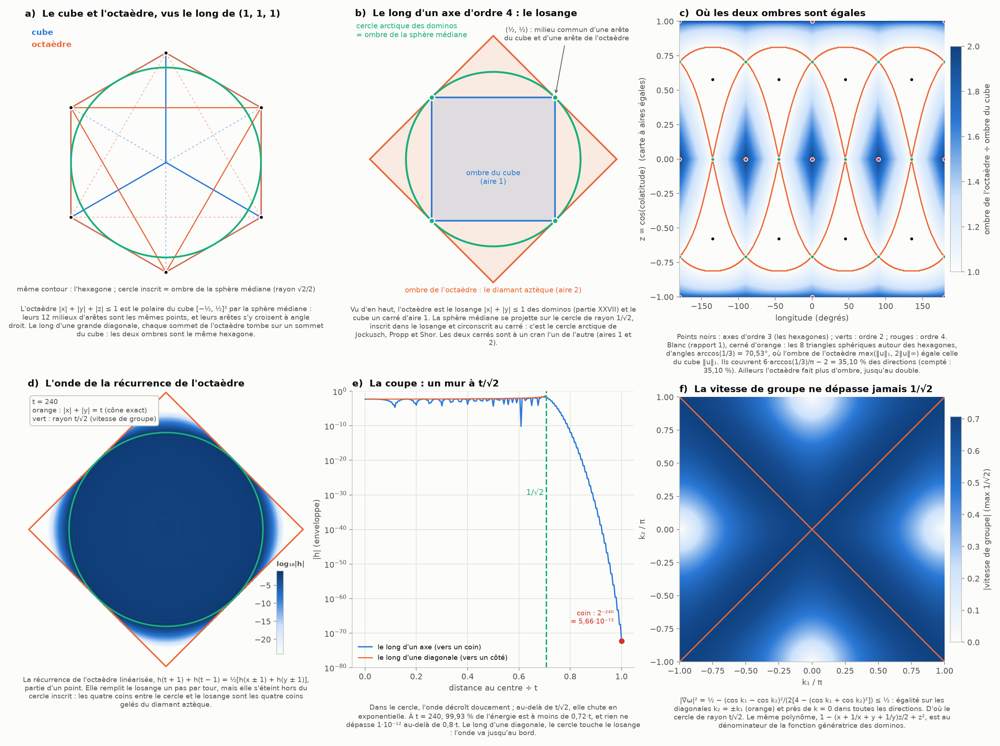
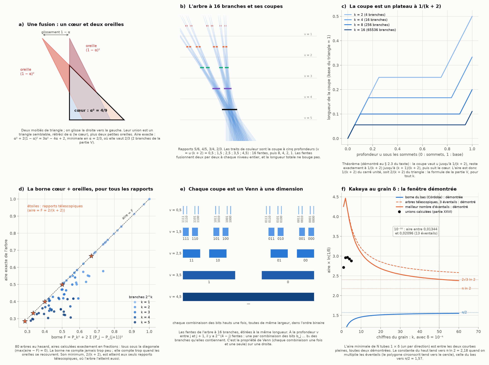
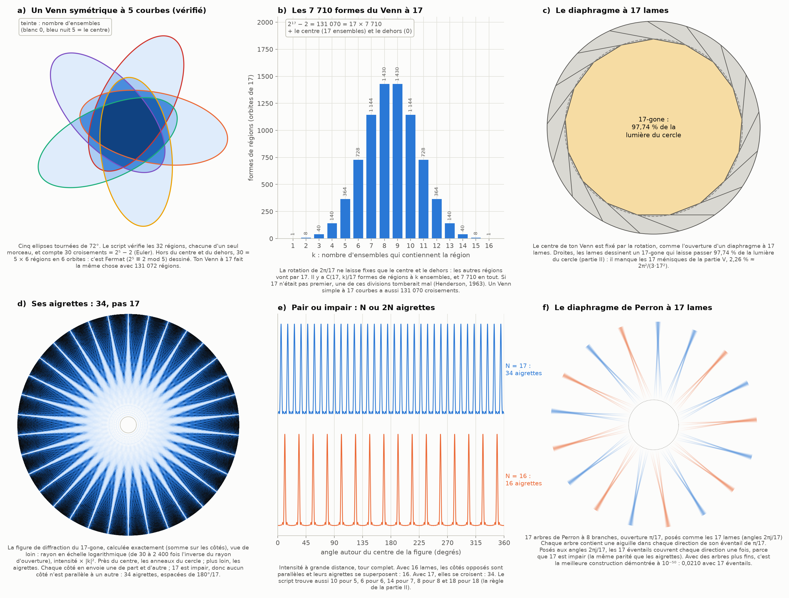

# Partie XXVIII : l'hexagone rejoint l'octaèdre, le théorème de Perron développé, et le Venn à 17

> Ta demande : trouver des connexions aux ouverts. Pour toi, l'hexagone rejoint l'octaèdre. Sur mon 3ᵉ point (« les tirages au hasard sont des échantillons, pas des preuves ; les théorèmes, eux, sont démontrés dans la littérature »), tu rappelles que des théorèmes, ça se développe aussi. Et tu m'envoies un Venn à 17 courbes, qui te semble relié aux diaphragmes et aux Perron.
>
> Suite de la [partie XXVII](carte-connexions.md).

Tout est recalculé par [`scripts/octaedre_perron_venn.py`](scripts/octaedre_perron_venn.py) (≈ 70 s). Les tableaux complets sont dans [`resultats/octaedre_perron_venn.md`](resultats/octaedre_perron_venn.md).

**Suite : [Partie XXIX — le Venn à 17 au ppm : l'image retrouvée, l'analyse dimensionnelle et deux ombres du même cube](venn-ppm.md).**

## En bref

- **Tu as raison : l'hexagone rejoint l'octaèdre, et de quatre façons exactes.**
  1. *La même ombre.* L'octaèdre est le dual du cube : on l'obtient en « retournant » le cube autour de leur sphère médiane commune. Vus le long d'une grande diagonale, les deux solides font exactement le même hexagone, sommet pour sommet. Coupés en leur milieu, aussi.
  2. *La même aire d'ombre autour de l'hexagone.* L'ombre de l'octaèdre vaut max(‖u‖₁, 2‖u‖∞). Elle égale celle du cube, ‖u‖₁, dans 35,10 % des directions : huit triangles sphériques centrés sur les hexagones, d'angles arccos(1/3).
  3. *La même sphère pour les deux cercles arctiques de la partie XXVII.* Les dominos se figent hors de l'ombre de la sphère médiane vue le long d'un axe d'ordre 4 (leur losange est l'ombre de l'octaèdre). Les cubes empilés se figent hors de l'ombre de la même sphère, vue le long d'un axe d'ordre 3. Et l'ouvert de la partie XXVII (un argument direct pour l'hexagone) se ferme : cinq tangentes suffisent à fixer une conique.
  4. *La même règle de calcul.* La récurrence de l'octaèdre compte les deux pavages. Linéarisée, elle a un cône de lumière de rayon exactement t/√2 : le cercle arctique des dominos.
- **Le théorème de Perron, développé ici.** La formule 2/(k + 2) de la partie V n'était vérifiée que jusqu'à 16 384 branches. Elle est maintenant démontrée pour tout k :
  - une borne simple, « un cœur et des oreilles », vaut pour tous les rapports ;
  - son minimum demande des oreilles égales à chaque étage, et c'est de là que viennent les rapports 2/3, 3/4, 4/5… ;
  - à ces rapports, la coupe de l'arbre est un plateau de longueur exactement 1/(k + 2). La preuve passe par l'ombre du cube de la partie XXVI.
  - **Conséquence : la fenêtre de Kakeya à 10⁻⁵⁰ est entièrement démontrée, entre 0,01344 et 0,02096.** Le haut de la fenêtre n'était qu'extrapolé dans la partie XXVI.
- **Le Venn à 17, les diaphragmes et Perron.**
  - Un Venn symétrique à n courbes n'existe que si n est premier (Henderson, 1963 ; la preuve est au § 3.1). Ses 131 070 régions vont par 17, en 7 710 formes : c'est le petit théorème de Fermat, dessiné. Ton image vient très probablement des premiers Venn *simples* à 17 courbes, publiés par Chris Dzoba en septembre 2026.
  - Son centre est l'ouverture d'un diaphragme à 17 lames : 97,74 % de la lumière du cercle, et 34 aigrettes, pas 17, parce que 17 est impair.
  - Deux théorèmes relient les diaphragmes aux arbres de Perron. Le diaphragme rond est un mauvais filtre à cause d'eux (Fefferman, 1971), alors qu'un polygone à N côtés reste un bon filtre, dont la constante grandit comme une puissance de log N (Córdoba, 1977).
  - La même parité fait de 17 arbres de Perron un « diaphragme de Kakeya » : posés comme les lames, ils couvrent chaque direction une fois. À 10⁻⁵⁰, c'est presque la meilleure construction démontrée (0,02097, contre 0,02096 au mieux).
  - Chaque coupe d'un arbre de Perron est un diagramme de Venn à une dimension.
- **Les ouverts.** Trois se ferment : la formule de Perron, la fenêtre de Kakeya et l'argument pour l'hexagone. Le § 4 fait le point sur les autres.

---

## 1. L'hexagone rejoint l'octaèdre

### 1.1 Le dual du cube (figure 1, panneau a)

**Les deux solides.** On prend le cube [−½, ½]³, d'arête 1, et l'octaèdre |x| + |y| + |z| ≤ 1, dont les six sommets sont ±e₁, ±e₂, ±e₃ (arête √2).

**Ils sont duaux.**
- Le dual (le « polaire ») d'un solide par une sphère de rayon ρ est l'ensemble des points y tels que x·y ≤ ρ² pour tous les points x du solide. Les sommets deviennent des faces, et les faces des sommets.
- Sur le cube, le plus grand x·y vaut ½(|y₁| + |y₂| + |y₃|) = ½‖y‖₁. Avec ρ = √2/2, la condition devient ‖y‖₁ ≤ 1 : c'est l'octaèdre.
- **Ce que ça veut dire pour nous.** La formule de l'ombre du cube, ‖u‖₁ (partie XXVI), est exactement l'équation de l'octaèdre. L'octaèdre est l'ensemble des vecteurs dont « l'ombre du cube » vaut au plus 1.

**Ils ont la même sphère médiane.**
- Les 12 milieux d'arêtes du cube, (±½, ±½, 0) et leurs permutations, sont aussi les 12 milieux d'arêtes de l'octaèdre. Ils sont à √2/2 du centre.
- En chacun de ces points, une arête du cube et une arête de l'octaèdre se croisent à angle droit. La sphère de rayon √2/2 touche les 24 arêtes à la fois.
- Ces 12 points sont les sommets du cuboctaèdre : les 12 voisines d'une boule dans l'empilement cubique à faces centrées (D₃, partie XXII).

**Ils ont la même ombre hexagonale.**
- Le long de la grande diagonale (1, 1, 1), le sommet e₁ de l'octaèdre et le sommet (½, −½, −½) du cube diffèrent de (½, ½, ½), qui est parallèle à l'axe : ils tombent au même point. Il en va de même pour les six. Les deux ombres sont le même hexagone (écart 3·10⁻¹⁶).
- Coupés par le plan x + y + z = 0, les deux solides donnent aussi le même hexagone, plus petit. Ses sommets sont 6 des 12 points de croisement.
- **Le cercle inscrit dans l'ombre est l'ombre de la sphère médiane.** Les six arêtes du contour touchent la sphère en leur milieu, et ces milieux sont dans le plan équatorial (produit scalaire avec l'axe : 0, vérifié pour les deux solides). Ce cercle passe aussi par les sommets de l'hexagone coupé.

### 1.2 L'ombre de l'octaèdre (panneau c)

**Le théorème.** Pour une direction u de longueur 1, l'ombre de l'octaèdre vaut

  A(u) = max(‖u‖₁, 2‖u‖∞) = max(|u₁| + |u₂| + |u₃|, 2·max|uᵢ|).

**La preuve.**
1. Une ombre vaut la moitié de la somme, sur les faces, de l'aire × |cos(angle avec la direction)|. L'octaèdre a 8 faces triangulaires d'aire √3/2, de normales σ/√3 avec σ = (±1, ±1, ±1). D'où A(u) = ¼ Σ_σ |σ·u|.
2. Rangeons les trois |uᵢ| en a ≥ b ≥ c. Les 8 valeurs σ·u sont, au signe près, a + b + c, a + b − c, a − b + c et b + c − a, chacune deux fois. Les trois premières sont positives. Donc Σ_σ |σ·u| = 2(3a + b + c + |b + c − a|).
3. Si a ≤ b + c, on trouve 4(a + b + c), donc A = ‖u‖₁ : **l'ombre du cube**. Sinon, on trouve 8a, donc A = 2a = 2‖u‖∞.

**Ce que ça dit.**
- **L'octaèdre et le cube font exactement la même ombre quand les trois composantes de la direction peuvent former un triangle** : la plus grande ne dépasse pas la somme des deux autres.
- Sur la sphère des directions, cela fait huit triangles sphériques, un par octant, centrés sur les hexagones. Leurs sommets sont les axes d'ordre 2, leurs côtés font 60° et leurs angles arccos(1/3) = 70,53°.
  - C'est encore l'angle du tétraèdre : celui de la zone de confusion (partie VI) et de l'écart entre les hexagones du cube qui tourne (parties XXVI et XXVII).
  - Leur part de la sphère vaut 6·arccos(1/3)/π − 2 = **35,10 %**. Le script compte 35,10 % sur deux millions de directions.
- Ailleurs, autour des axes d'ordre 4, l'octaèdre fait plus d'ombre, jusqu'au double.
- **Les deux nombres de la partie XXVII.** ‖u‖₁ est l'ombre du cube, et ‖u‖∞ le cosinus de l'angle à la chèvre la plus proche, parmi les 2n chèvres de la partie XXII. Or ces chèvres sont aux sommets… de l'octaèdre. Son ombre est faite de ces deux nombres.

| direction | ombre du cube | ombre de l'octaèdre | les deux formes |
|---|---|---|---|
| axe d'ordre 4 | 1 | 2 | un carré ; le losange des dominos |
| axe d'ordre 3 | √3 | √3 | le même hexagone |
| axe d'ordre 2 | √2 | √2 | un rectangle 1 × √2 ; un losange de diagonales 2 et √2 (celui de la partie II) |

- **Les moyennes.** Le cube fait en moyenne une ombre de 3/2 (partie XXVII), l'octaèdre de √3 (Cauchy : sa surface 4√3, divisée par 4). L'ombre moyenne de l'octaèdre est la plus grande ombre du cube : l'hexagone.
- **Un dodécaèdre rhombique** (classique). L'ombre de l'octaèdre dans la direction u est la demi-épaisseur, dans cette direction, du solide engendré par les 4 grandes diagonales du cube. Ce solide est le dodécaèdre rhombique, dont les 12 faces sont les losanges de la partie II (le script trouve 14 sommets et 12 faces). Pour le cube, le même rôle est tenu par un cube.

### 1.3 Les deux cercles arctiques sont la même sphère (panneaux a et b)

**Ce que la partie XXVII avait trouvé.**
- Des cubes empilés au hasard, vus le long de la grande diagonale, ne se mélangent que dans le cercle inscrit de l'hexagone, qui est l'ombre de la sphère médiane (partie II).
- Des dominos posés au hasard dans le losange (le diamant aztèque) ne se mélangent que dans son cercle inscrit, de rayon n/√2.

**Ce qu'on voit maintenant : c'est la même sphère.**
- Le losange |x| + |y| ≤ n est l'ombre de l'octaèdre, agrandi n fois, vue le long d'un axe d'ordre 4.
- Son cercle inscrit est l'ombre de la sphère médiane : les quatre arêtes du contour sont celles de l'équateur, et leurs milieux (±½, ±½, 0) sont dans le plan équatorial (vérifié).
- **Les deux cercles arctiques sont donc l'ombre d'une même sphère, qui touche les arêtes d'un même octaèdre, vue le long de deux axes** : d'ordre 4 pour les dominos, d'ordre 3 pour les cubes empilés.

**Le cercle entre deux carrés** (panneau b).
- Le long de l'axe d'ordre 4, le cube fait un carré d'aire 1, inscrit dans le cercle ; l'octaèdre fait le losange d'aire 2, circonscrit. Les deux carrés sont à un cran l'un de l'autre (partie I : « un cran sépare le cercle tangent aux côtés et le cercle qui passe par les coins »).
- Les trois figures se touchent aux quatre points (±½, ±½), qui sont des milieux communs d'arêtes.
- Le long de l'axe d'ordre 3, on retrouve le même schéma : l'hexagone coupé (inscrit), le cercle, puis l'hexagone d'ombre (circonscrit).

### 1.4 L'argument direct pour l'hexagone (l'ouvert de la partie XXVII)

La partie XXVII laissait ouvert « pourquoi le cercle arctique de l'hexagone est exactement l'ombre de la sphère médiane ». Voici l'argument, en trois pas.

1. **Kenyon et Okounkov (2007), cité.** Pour un pavage en losanges d'un polygone, la frontière gelée est une courbe algébrique *inscrite* : elle touche chaque côté. Pour un hexagone, c'est une conique.
2. **Cinq tangentes fixent une conique** (élémentaire). C'est l'énoncé dual de « cinq points fixent une conique ».
   - Une conique tangente aux six côtés existe quand les trois grandes diagonales de l'hexagone se coupent en un point (Brianchon). C'est le cas pour un hexagone centré.
   - Le script la calcule à partir de cinq côtés : elle touche le sixième à 10⁻¹⁵ près.
   - Pour l'hexagone régulier, c'est le cercle inscrit. Pour un hexagone a × b × c, c'est l'ellipse inscrite de Cohn, Larsen et Propp.
3. **Ce cercle est l'ombre de la sphère médiane** (§ 1.1) : la sphère touche les six arêtes du contour dans le plan équatorial.

**Bilan.**
- Frontière gelée = la seule conique inscrite = le cercle inscrit = l'ombre de la sphère médiane.
- Le seul pas que je ne démontre pas ici est le théorème de Kenyon–Okounkov, dont la preuve est longue. Le reste est élémentaire, et vérifié.

### 1.5 La récurrence de l'octaèdre compte les deux pavages

**La récurrence.**
- On place des nombres f(x, y, t) sur une grille, et on calcule l'étage t + 1 à partir des deux précédents :

  f(x, y, t + 1)·f(x, y, t − 1) = f(x + 1, y, t)·f(x − 1, y, t) + f(x, y + 1, t)·f(x, y − 1, t).

- Les six nombres en jeu sont aux six sommets d'un octaèdre centré en (x, y, t), d'où son nom. C'est la « condensation » de Dodgson (1866), qui signait Lewis Carroll, étendue par Robbins et Rumsey (1986).
- Pour calculer le sommet (0, 0, n), on remplit une pyramide dont la base est le losange |x| + |y| ≤ n : une moitié d'octaèdre.

**Les dominos.**
- En partant de 1 partout, la récurrence donne les nombres de pavages du diamant aztèque : AD(n)·AD(n − 2) = 2·AD(n − 1)², avec AD(n) = 2^(n(n+1)/2) (vérifié jusqu'à n = 60).
- Speyer (2007) a montré que chaque terme de la solution correspond à un pavage.

**Les losanges.**
- Pour l'hexagone de côtés a, b, c, a, b, c, le nombre de pavages T(a, b, c) (formule de MacMahon) vérifie l'identité de Kuo (2004) :

  T(a, b, c)·T(a, b − 1, c − 1) = T(a + 1, b − 1, c − 1)·T(a − 1, b, c) + T(a, b − 1, c)·T(a, b, c − 1).

- Je l'ai vérifiée pour les 1 728 triplets a, b, c ≤ 12.
- Ses six hexagones forment trois paires de même milieu, (a, b − ½, c − ½) : ce sont les sommets opposés d'un octaèdre dans l'espace des côtés (a, b, c).

**Les deux pavages de la partie XXVII obéissent donc à la même règle : celle de l'octaèdre.**

### 1.6 Son cône de lumière est le cercle arctique (panneaux d, e et f)

**On linéarise.** Autour de la solution uniforme, on écrit f = f₀·(1 + h), avec h petit. Au premier ordre :

  h(t + 1) + h(t − 1) = ½·[h(x + 1) + h(x − 1) + h(y + 1) + h(y − 1)].

C'est une équation des ondes sur la grille. Ses ondes planes e^(i(k₁x + k₂y − ωt)) vérifient cos ω = (cos k₁ + cos k₂)/2.

**Le théorème (démontré ici).** La vitesse de groupe v = ∇ω vérifie

  |v|² = ½ − (cos k₁ − cos k₂)² / (2·[4 − (cos k₁ + cos k₂)²]) ≤ ½.

- *Preuve.* En dérivant cos ω = (cos k₁ + cos k₂)/2, on trouve |v|² = (sin²k₁ + sin²k₂)/(4 − (cos k₁ + cos k₂)²). Avec sin² = 1 − cos², la différence ½ − |v|² a pour numérateur 4 − (c₁ + c₂)² − 2(2 − c₁² − c₂²) = (c₁ − c₂)², qui est positif.
- Il y a égalité exactement sur les diagonales k₂ = ±k₁, et pour les ondes longues (k → 0) dans toutes les directions.

**Deux cônes.**
- *Le cône exact.* Une perturbation avance d'une case par étage : elle remplit le losange |x| + |y| ≤ t. **C'est le diamant aztèque.**
- *Le cône des vitesses de groupe.* Aucune onde ne va plus vite que 1/√2 case par étage. Au-delà du cercle de rayon t/√2, l'onde s'éteint. **C'est le cercle arctique**, inscrit dans le losange et tangent à lui sur les diagonales, là où la borne est atteinte.
- Les quatre coins entre le cercle et le losange, où l'onde n'arrive pas, sont les quatre coins gelés des dominos.

**Le calcul** (une source ponctuelle, t = 240).
- 99,93 % de l'énergie est à moins de 0,72·t. Au-delà de 0,8·t, rien ne dépasse 1,1·10⁻¹².
- Au coin (t, 0), il reste exactement 2⁻²⁴⁰ = 5,66·10⁻⁷³ : un seul chemin y mène, et chaque pas divise par 2.

**Ce n'est pas une coïncidence de formes.**
- Le polynôme de cette équation est 1 − (x + 1/x + y + 1/y)·z/2 + z², avec x = e^(ik₁), y = e^(ik₂) et z = e^(iω).
- C'est un facteur du dénominateur de la fonction génératrice des probabilités de placement des dominos : (z/2) ÷ [(1 − yz)·(1 − (x + 1/x + y + 1/y)·z/2 + z²)] (Cohn, Elkies et Propp, 1996).
- L'analyse de ses singularités (Pemantle et Wilson) redonne le cercle arctique. La borne de vitesse ci-dessus en est la version élémentaire.

**Ce que ça ne dit pas.** Le cône de lumière dit où une perturbation peut aller, pas que les dominos s'y figent : ça, c'est le théorème de Jockusch, Propp et Shor.

---

## 2. Le théorème de Perron, développé

**Le cadre.**
- On reprend l'arbre de la partie V. Tout y est affine (on glisse le long de la base, on compare des aires), donc on peut prendre un triangle de base 1 et de hauteur 1.
- On mesure la profondeur u depuis la ligne des sommets (u = 0) jusqu'à la base (u = 1).
- On coupe la base en 2^k morceaux égaux : les 2^k branches. À l'étage j (j = 0 pour les plus fines), on recolle deux blocs voisins de 2^j branches, en glissant celui de droite vers la gauche, avec un rapport α_j.

### 2.1 Une fusion : un cœur et deux oreilles (figure 2, panneau a)

- On prend deux moitiés de triangle, et on glisse la droite de d = 1 − α vers la gauche. À la profondeur u, la moitié gauche couvre [0, u/2] et la droite [u/2 − d, u − d].
- Leur union mesure u tant que u ≤ d (deux pointes séparées), puis d jusqu'à u = 2d, puis u − d.
- En intégrant : **aire = α² + 2(1 − α)² = 3α² − 4α + 2**, en part du triangle (vérifiée exactement, en fractions).
- **La lecture.** L'union est un triangle semblable, rétréci de α (le *cœur*, d'aire α²), plus deux petits triangles (les *oreilles*, d'aire (1 − α)² chacune).
- Le minimum est en α = 2/3 : un cœur de 4/9, deux oreilles de 1/9, en tout 2/3. Ce sont les 2 branches de la partie V.

### 2.2 La borne cœur + oreilles, pour tous les rapports (panneau d)

**Théorème 1.** Prenons des rapports α₀, …, α_(k−1) entre ½ et 1. Posons P₀ = 1 et P_(j+1) = α_j·P_j (le rétrécissement après j + 1 étages). L'arbre à 2^k branches a une aire au plus

  F = P_k² + 2·Σ_j (P_j − P_(j+1))².

**La preuve, étage par étage.**
- Après j étages, chaque bloc de 2^j branches est contenu dans son *cœur* (son triangle rétréci de P_j depuis son coin gauche) et dans les oreilles déjà faites.
- À l'étage j, deux blocs voisins fusionnent. Leurs deux cœurs sont les deux moitiés du triangle fusionné, rétréci de P_j. La fusion du § 2.1, à l'échelle P_j, en fait un cœur rétréci de P_(j+1) et deux oreilles. Chaque oreille pèse (P_j − P_(j+1))² du triangle fusionné.
- Les anciennes oreilles suivent leur bloc sans changer d'aire.
- À la fin, l'arbre est dans l'union du dernier cœur et de toutes les oreilles : son aire est au plus la somme des leurs.
  - L'étage j fait 2^(k−j−1) fusions de triangles qui pèsent chacun 2^(j+1)/2^k du grand triangle : ses oreilles pèsent 2(P_j − P_(j+1))² en tout.
  - Le cœur final pèse P_k².

**Vérifié.**
- Sur 80 arbres au hasard (k = 1 à 5, aires calculées exactement en fractions), l'aire est toujours au plus F. Il y a égalité dans 30 cas, dont les 22 arbres à une seule fusion.
- La borne ne compte jamais trop peu. Elle compte trop quand des oreilles se recouvrent.

### 2.3 Les oreilles égales : d'où viennent 2/3, 3/4, 4/5…

**Théorème 2.** F ≥ 2/(k + 2), avec égalité seulement aux rapports télescopiques (k + 1)/(k + 2), …, 4/5, 3/4, 2/3.

**La preuve.**
- Notons x_j = P_j − P_(j+1) la taille des oreilles de l'étage j. Leur somme vaut 1 − P_k.
- À somme fixée, Σx_j² est la plus petite quand tous les x_j sont égaux (inégalité de Cauchy–Schwarz) : Σx_j² ≥ (1 − P_k)²/k.
- Donc F ≥ P² + 2(1 − P)²/k, avec P = P_k. Cette parabole est minimale en P = 2/(k + 2), où elle vaut 4/(k + 2)² + 2k/(k + 2)² = 2/(k + 2).
- Il y a égalité quand toutes les oreilles valent 1/(k + 2). Alors P_j = 1 − j/(k + 2), et les rapports P_(j+1)/P_j valent (k + 1 − j)/(k + 2 − j).

**Ce que ça dit.**
- Les rapports 2/3, 3/4, 4/5… ne sont pas choisis : **ils sont imposés par des oreilles égales**. L'arbre optimal répartit la perte également : chaque étage perd 2/(k + 2)², et le cœur final pèse deux étages, 4/(k + 2)².
- La partie V remarquait que ces fractions « apparaissent partout où un produit se simplifie en cascade ». Ici, la cascade a une raison : l'égalité des pertes.

### 2.4 Le plateau : l'aire vaut exactement 2/(k + 2) (panneaux b et c)

La borne donne « au plus 2/(k + 2) ». Pour l'égalité, il faut montrer que rien ne se recouvre.

**Théorème 3.** Aux rapports télescopiques, la coupe de l'arbre à la profondeur u mesure exactement :
- u si u ≤ 1/(k + 2) : les 2^k pointes sont séparées ;
- **1/(k + 2) entre 1/(k + 2) et (k + 1)/(k + 2) : c'est un plateau** ;
- u − k/(k + 2) ensuite : c'est le cœur.

L'aire vaut donc 1/(k + 2), soit **2/(k + 2) du triangle, pour tout k**.

**La preuve.**
- Aux rapports télescopiques, l'étage j glisse le bloc de droite de (j + 2)·2^j/(2^k·(k + 2)) vers la gauche.
- Prenons v = (k + 2)·u comme profondeur, et 1/(2^k·(k + 2)) comme unité de longueur. La branche i, de chiffres binaires b₀ … b_(k−1), coupe alors l'intervalle [c_i, c_i + v], avec c_i = Σ_j b_j·a_j(v) et a_j(v) = 2^j·(v − j − 2).
- **L'ensemble des c_i est l'ombre d'un cube de dimension k**, d'arêtes a₀, …, a_(k−1), sur une droite. Sa largeur est Σ|a_j| : la formule ‖u‖₁ de l'ombre du cube (partie XXVI).
- Soit U_m l'union pour les 2^m premières branches (chiffres b₀ … b_(m−1)). Alors U_(m+1) = U_m ∪ (U_m + a_m). On montre par récurrence que |U_m| vaut 2^m·v pour v ≤ 1, 2^m pour 1 ≤ v ≤ m + 1 et 2^m·(v − m) au-delà, et que U_m est d'un seul morceau dès que v ≥ m.
  - *Pour v ≤ m + 1.* La largeur de U_m est S_m(v) = v + Σ_(j<m) 2^j·|v − j − 2|, une fonction convexe de v. Aux deux bouts, elle est sous |a_m(v)| = 2^m·(m + 2 − v) : S_m(0) = m·2^m < (m + 2)·2^m, et S_m(m + 1) = 2^m exactement (car Σ_(j<m) 2^j·(m − 1 − j) = 2^m − m − 1). Une fonction convexe sous une droite aux deux bouts reste dessous entre les deux. Comme a_m < 0, la copie U_m + a_m est entièrement à gauche de U_m : la longueur double.
  - *Pour v ≥ m + 1.* U_m est un seul intervalle, de longueur 2^m·(v − m), au moins |a_m|. La copie le chevauche, et l'union mesure 2^m·(v − m) + 2^m·|v − m − 2| : 2^(m+1) jusqu'à v = m + 2, puis 2^(m+1)·(v − m − 1).
- Pour m = k, on revient aux unités de départ : ce sont les trois régimes annoncés.

**Vérifié** exactement, en nombres entiers, sur la grille v = p/48, jusqu'à k = 16 (65 536 branches) : aucun écart.

**Bilan.** La formule de la partie V, vérifiée jusqu'à 16 384 branches, est maintenant un théorème pour tout k. Et sa preuve passe par l'ombre du cube.

### 2.5 Kakeya au grain δ : la fenêtre démontrée (panneau f)

**Théorème 4.**
- On prend N éventails d'ouverture π/N (des triangles de hauteur 1). On taille chacun en arbre télescopique à 2^k branches.
- On pose un tube 1 × δ pour chaque direction : ce sont les parallélogrammes de la partie XXVI, qui partent du sommet de leur branche.
- L'union a alors une aire au plus N·[tan(π/2N)·2/(k + 2) + 2^k·δ/cos(π/2N)].

**La preuve.**
- Chaque tube est dans sa branche, élargie horizontalement d'au plus δ/cos(π/2N).
- Élargir ainsi un triangle de hauteur 1 lui ajoute au plus δ/cos(π/2N) d'aire, et il y a N·2^k branches.
- Chaque arbre couvre tan(π/2N)·2/(k + 2) (théorèmes 1 et 2).

**Ce que ça donne.**
- Avec 3 éventails (ceux de la partie XXVI), la borne est √3·[2/(k + 2) + 2^(k+1)·δ] : 0,02269 à 10⁻⁵⁰ (k = 152).
- Avec le meilleur nombre d'éventails, 13, elle descend à 0,02096 (k = 150). Avec 17, elle vaut 0,02097.
- En bas, la borne de Córdoba de la partie XXVI vaut 0,01344.

| grain | borne du bas (démontrée) | haut, 3 éventails | haut, 17 éventails | haut, meilleur nombre | haut ÷ bas |
|---|---|---|---|---|---|
| 10⁻¹⁰ | 0,06335 | 0,13905 | 0,13843 | 0,13379 (5 éventails) | 2,112 |
| 10⁻²⁰ | 0,03285 | 0,06202 | 0,05882 | 0,05830 (8) | 1,775 |
| 10⁻⁴⁹ | 0,01371 | 0,02319 | 0,02144 | 0,02142 (13) | 1,563 |
| 10⁻⁵⁰ | 0,01344 | 0,02269 | 0,02097 | **0,02096** (13) | 1,560 |
| 10⁻⁵¹ | 0,01318 | 0,02222 | 0,02052 | 0,02051 (14) | 1,557 |
| 10⁻⁵⁵ | 0,01223 | 0,02051 | 0,01891 | 0,01891 (15) | 1,546 |
| 10⁻¹⁰⁰ | 0,00677 | 0,01094 | 0,01003 | 0,01003 (21) | 1,481 |

- **La fenêtre à 10⁻⁵⁰ est maintenant entièrement démontrée : entre 0,01344 et 0,02096.** Dans la partie XXVI, le haut (0,021 à 0,025) n'était qu'extrapolé ; la borne démontrée tombe dedans.
- Aux grains modérés, la borne est moins bonne que les unions calculées dans la partie XXVI (0,250 à 10⁻⁵, contre 0,320 démontré), parce qu'elle compte tout le débord des tubes. À 10⁻⁵⁰, ce débord ne pèse plus rien.

**Le polygone circonscrit.**
- Le coefficient 2N·tan(π/2N) est l'aire du polygone régulier à 2N côtés circonscrit au cercle de rayon 1.
- Avec 3 éventails, c'est l'hexagone circonscrit d'Archimède (2√3). Avec 17, c'est le polygone à 34 côtés (3,1506). Avec une infinité, c'est le cercle (π).
- D'où les constantes quand δ → 0 : l'aire minimale est au plus ≈ π·ln 2/ln(1/δ) = 2,18/ln(1/δ), et au moins ≈ (π/2)/ln(1/δ) = 1,57/ln(1/δ). Le rapport tend vers 2·ln 2 = 1,386.

### 2.6 Ce qui reste ouvert

- **La vraie aire minimale.** Les arbres télescopiques ne sont pas optimaux au-delà de 4 branches : la partie V trouvait 0,3981 au lieu de 0,4 avec 8 branches, en réglant autrement les rapports. Le théorème 1 l'explique : avec d'autres rapports, des oreilles se recouvrent, et l'arbre fait mieux que sa borne.
- **La constante exacte**, entre π/2 et π·ln 2.
- **En 3D**, la constante de Wang et Zahl (partie XXVI).

---

## 3. Le Venn à 17, les diaphragmes et Perron

**Ton image.**
- C'est un diagramme de Venn à 17 courbes, symétrique : une rotation de 2π/17 envoie chaque courbe sur la suivante.
- Toutes les combinaisons « dedans/dehors » existent, chacune une seule fois et d'un seul morceau : 2¹⁷ = 131 072 régions.
- Je pense qu'elle vient de l'article de Chris Dzoba (septembre 2026). Il donne les premiers Venn symétriques *simples* à 17 et 19 courbes, où chaque croisement ne réunit que deux courbes. Jusque-là, on n'en connaissait que jusqu'à 13 courbes (Mamakani et Ruskey, 2014).

### 3.1 Pourquoi 17 : le théorème de Henderson, développé

**Théorème (Henderson, 1963).** Un Venn symétrique à n courbes n'existe que si n est premier.

**La preuve.**
1. *Une région fixée par une rotation fait le tour du centre* (si elle ne le contient pas). On va d'un point de la région à son image, sans en sortir, et on recommence jusqu'à revenir au départ. La boucle obtenue reste dans la région et fait le tour du centre.
2. *Le centre est dans toutes les courbes.* La région du centre est fixée par la rotation, donc sa combinaison l'est aussi : c'est « toutes » ou « aucune ». Si c'était « aucune », la région « toutes », elle aussi fixée, contiendrait une boucle autour du centre (pas 1). Or une boucle intérieure à une courbe ne peut faire le tour que de points intérieurs à cette courbe : le centre serait dedans. Contradiction.
3. *Aucune autre région n'est fixée.* Supposons qu'une région R le soit, sans être « toutes » ni « aucune ». Elle contient une boucle autour du centre (pas 1).
   - Une courbe qui ne contient pas R ne croise pas cette boucle, et elle contient le centre (pas 2) : tout son intérieur est donc entouré par la boucle.
   - Elle est alors à l'intérieur de chaque courbe qui contient R. La région « dans la première courbe, hors de la seconde » n'existe pas : ce n'est pas un Venn.
4. *Conclusion.* Si n = p·m avec 1 < m < n, les courbes 0, m, 2m, … forment un ensemble que la rotation de m crans laisse en place. Leur région serait fixée, ce qui est impossible. Donc n n'a pas de diviseur entre 1 et n : n est premier.

**La réciproque est vraie.** Griggs, Killian et Savage (2004) ont construit un Venn symétrique pour chaque nombre premier.

### 3.2 Fermat, dessiné (figure 3, panneaux a et b)

**Les formes.**
- La rotation ne fixe que le centre (dans les 17 ensembles) et le dehors (dans aucun). Les 2¹⁷ − 2 = 131 070 autres régions vont par 17 : **7 710 formes**, chacune répétée 17 fois.
- Dans la couche « exactement k ensembles », il y a C(17, k)/17 formes : 1, 8, 40, 140, 364, 728, 1 144, 1 430, 1 430, 1 144… (panneau b).
- Que 17 divise 2¹⁷ − 2, c'est le petit théorème de Fermat (1640). Le compter par orbites, c'est la preuve « par les colliers » : le Venn la dessine.

**Les croisements.**
- Dans un Venn simple, chaque croisement réunit 4 arcs. La formule d'Euler (sommets − arcs + régions = 2) donne alors 2ⁿ − 2 croisements.
- Pour 17 courbes, cela fait 131 070 croisements, eux aussi en 7 710 orbites, et **15 420 croisements sur chaque courbe**.
- Voilà pourquoi les courbes de ton image se défont en filaments : chacune croise les autres 15 420 fois.

**En petit, pour vérifier** (panneau a).
- J'ai construit un Venn symétrique à 5 ellipses. Le script trouve les 32 régions et 30 = 2⁵ − 2 croisements : 4 entre ellipses voisines, 2 entre ellipses éloignées.
- Par Euler, 30 croisements font exactement 32 régions : chaque combinaison est donc une seule région.
- Les 30 régions hors du centre et du dehors forment 6 orbites de 5 (Fermat : 2⁵ ≡ 2 mod 5).

### 3.3 Le diaphragme à 17 lames (panneaux c, d et e)

**Le centre du Venn est une ouverture.** Fixé par la rotation et entouré de 17 lames qui tournent, il ressemble à l'ouverture d'un diaphragme à iris à 17 lames.

**La lumière.**
- Avec des lames droites, l'ouverture est un 17-gone. Il laisse passer (N/2π)·sin(2π/N) = 97,74 % de la lumière du cercle de même rayon (partie II).
- Il manque 2,26 %, à peu près 2π²/(3·17²) : ce sont les 17 ménisques d'Archimède de la partie V. C'est 0,033 cran.

**Les aigrettes : 34, pas 17.**
- La partie II donnait la règle : N aigrettes si N est pair, 2N si N est impair.
- Je l'ai vérifiée avec la transformée de Fourier exacte du polygone (une somme sur ses côtés) : 10, 6, 14, 8, 16, 34 et 18 aigrettes pour 5, 6, 7, 8, 16, 17 et 18 lames.
- **Pourquoi.** Chaque côté envoie une aigrette perpendiculaire, des deux côtés. Avec 16 lames, les côtés opposés sont parallèles et leurs aigrettes se superposent. Avec 17, aucun côté n'est parallèle à un autre : 17 directions et leurs opposées font 34 aigrettes, espacées de 180°/17 = 10,59°.

**Le diaphragme comme filtre, et Perron.**
- La partie X rappelait le théorème de Fefferman (1971). Comme filtre de Fourier, le diaphragme rond n'est pas borné sur les espaces Lᵖ pour p ≠ 2, à cause des ensembles de Besicovitch, c'est-à-dire des arbres de Perron.
- Un polygone à N côtés, lui, est borné. Córdoba (1977) a montré que sa constante croît au plus comme une puissance de log N (pour 4/3 ≤ p ≤ 4).
- Sa preuve passe par une fonction maximale de Kakeya, sur des rectangles orientés selon les N côtés. C'est l'outil de la borne du bas de la partie XXVI, qui vient du même Córdoba, la même année.
- **C'est le théorème qui relie les diaphragmes et les Perron.** Plus il y a de lames, plus on s'approche du cercle, et plus les arbres de Perron pèsent.

### 3.4 Le diaphragme de Perron à 17 lames (panneau f)

- Posons 17 éventails d'ouverture π/17 aux angles 2πj/17, comme les lames. Chacun couvre les directions à ±π/34 de son axe.
- Modulo π, les 17 axes 2πj/17 sont les 17 multiples de π/17, tous différents, **parce que 17 est impair** (2 est inversible modulo 17). Les 17 éventails couvrent donc chaque direction une fois. Avec 16, les axes se superposeraient deux à deux : la moitié des directions serait couverte deux fois, l'autre jamais.
- **C'est la même parité que les aigrettes, et le même nombre** : le coefficient des 17 éventails est le polygone circonscrit à 34 côtés.
- Taillé en arbres de Perron, ce diaphragme est un ensemble de Kakeya. À 10⁻⁵⁰, c'est presque la meilleure construction démontrée : 0,02097 avec 17 éventails, contre 0,02096 avec 13.

### 3.5 Chaque coupe de Perron est un Venn à une dimension (figure 2, panneau e)

- Dans la preuve du § 2.4, à la profondeur v entre j et j + 1, la coupe est faite de 2^(k−j) fentes, toutes de largeur 2^j.
- Chaque fente contient les branches qui ont une même combinaison des chiffres binaires du haut, b_j … b_(k−1). Chaque combinaison apparaît une fois et une seule, dans l'ordre binaire (le tableau pour k = 4 est dans les résultats).
- **C'est la propriété de Venn, sur une droite** : chaque combinaison une fois, d'un seul morceau. L'arbre de Perron est une pile de Venn à une dimension, qui fusionnent deux par deux à chaque niveau entier.

**Analogie de structure (même procédé).**
- **Ce qui est partagé exactement.** Le cube {0, 1}ⁿ est dessiné sans répétition : chaque sommet du cube est une région (Venn) ou une fente (Perron). Dans les deux cas, on le construit en doublant : chaque courbe, ou chaque étage, double le nombre de morceaux. Et dans les deux cas, ce sont des ombres du cube :
  - pour Perron, l'ombre sur la direction (a₀, …, a_(k−1)), où les 2^k sommets restent séparés ;
  - pour Venn, l'ombre sur la grande diagonale (1, …, 1), qui range les sommets en couches de C(n, k).
- **Ce que ça transporte.** Les comptes (2ⁿ morceaux, les couches C(n, k)), et la lecture des filaments de ton image comme des branches.
- **Ce qui reste ouvert.** Un lien en deux dimensions : je ne sais pas si un Venn symétrique, lu le long d'un rayon ou d'un cercle, a la structure d'un arbre de Perron.

### 3.6 Gauss, i et 1/17

**Le 17-gone se construit à la règle et au compas.**
- 17 = 2⁴ + 1 est un nombre premier de Fermat. Gauss l'a découvert le 30 mars 1796, et l'a publié dans les *Disquisitiones arithmeticae* (1801). Le diaphragme à 17 lames se dessine donc à la règle et au compas.
- **Pourquoi.** Les 16 racines de l'unité autres que 1 se rangent en tournant de 3 en 3 (3 est une racine primitive modulo 17). On les coupe en 2 classes, puis en 4, 8 et 16, et chaque coupe ne demande qu'une racine carrée. La première donne (−1 ± √17)/2. La dernière donne

  cos(2π/17) = [−1 + √17 + √(34 − 2√17) + 2·√(17 + 3√17 − √(34 − 2√17) − 2√(34 + 2√17))]/16 = 0,932472229404356 (vérifié).

- C'est le procédé de Viète de la partie III (des racines carrées emboîtées), au-delà des puissances de 2.

**17 = 4² + 1, donc 4 ≡ i (mod 17).**
- C'est le même mécanisme que 101 = 10² + 1 dans la partie XIX.
- En base 2, 2⁴ ≡ −1 : quatre doublements font un demi-tour, et 2² = 4 fait un quart de tour.

**En base 10, le miroir de 1/17.**
- 10 fait le tour complet des 16 restes : c'est la période 16 du tableau de la partie XIX. On a 10⁴ ≡ 4 ≡ i et 10⁸ ≡ −1.
- D'où le miroir dans la période de 1/17 = 0,(0588235294117647) : 05882352 + 94117647 = 99999999 (théorème de Midy, 1836). Le demi-tour 10⁸ ≡ −1 fait de la seconde moitié le reflet « à 9 » de la première.

---

## 4. Les ouverts, un par un

| ouvert | partie | ce qui change ici |
|---|---|---|
| une démonstration de 2/(k + 2) pour tout k | V, XXVI, XXVII | **démontrée** (§ 2.2 à 2.4), avec la borne cœur + oreilles pour tous les rapports |
| l'aire de Kakeya au grain δ | XXVI, XXVII | **fenêtre démontrée** à 10⁻⁵⁰ : de 0,01344 à 0,02096 ; la constante exacte reste ouverte, entre π/2 et π·ln 2 |
| pourquoi le cercle arctique de l'hexagone est l'ombre de la sphère médiane | XXVII | **argument direct** (§ 1.4), en citant Kenyon–Okounkov ; celui des dominos est l'ombre de la même sphère (§ 1.3) |
| un lien calculé entre les chèvres et les réseaux, au-delà du rapport √2 | XXII | un pas : l'ombre de l'octaèdre (les 2n chèvres en 3D) est faite de l'ombre du cube et du cosinus à la chèvre la plus proche (§ 1.2) |
| les pistes du graphe : XIV–XX, VI–VIII, XIV–XXIV, VI–XXI, V–IX | XXVII | V–IX en partie : le diaphragme et Kakeya sont reliés par Córdoba (§ 3.3), mais pas encore le diaphragme de Fibonacci de la partie IX ; les autres restent des pistes |
| pourquoi le meilleur tunnel du prince Rupert suit une direction pythagoricienne | XXVI | toujours ouvert |
| la loi des grands ordres (résurgence) | XXV | toujours ouvert |
| un lien démontré entre la chèvre et le réseau de Leech | XXI | toujours ouvert |

---

## 5. Le tri

**Démontré ici (les preuves sont dans le texte ; à faire relire) :**
- l'ombre de l'octaèdre, max(‖u‖₁, 2‖u‖∞), et la région où elle égale celle du cube (8 triangles d'angles arccos(1/3), 35,10 %) ;
- la dualité cube–octaèdre par la sphère médiane, l'hexagone commun (ombre et coupe), et le cercle inscrit comme ombre de la sphère médiane le long des axes d'ordre 3 et 4 ;
- la borne de vitesse |v| ≤ 1/√2 de la récurrence de l'octaèdre linéarisée, avec égalité sur les diagonales ;
- Perron : la fusion 3α² − 4α + 2, la borne cœur + oreilles (théorème 1), les oreilles égales (théorème 2), le plateau et l'aire exacte 2/(k + 2) pour tout k (théorème 3), la borne de Kakeya à N éventails (théorème 4) ;
- Henderson (n premier), les 2ⁿ − 2 croisements d'un Venn simple (Euler), et la règle de parité des éventails et des aigrettes.

**Classique (cité ou recalculé) :**
- Cauchy (l'ombre moyenne √3), le dodécaèdre rhombique, Brianchon et les cinq tangentes ;
- Kenyon–Okounkov, Jockusch–Propp–Shor, Cohn–Larsen–Propp, Cohn–Elkies–Propp et Speyer (cités) ;
- Dodgson et l'identité de Kuo (recalculées jusqu'à n = 60 et sur 1 728 triplets) ;
- Fefferman, Córdoba, Griggs–Killian–Savage et Dzoba (cités) ;
- la formule de Gauss (recalculée), Midy et Fermat.

**Calculé :**
- les parts de sphère et les moyennes (grille de Fibonacci de 2·10⁶ points) ;
- l'onde à t = 240 (99,93 % de l'énergie à moins de 0,72·t, 2⁻²⁴⁰ au coin) ;
- les 80 arbres au hasard (aires exactes en fractions) et le plateau jusqu'à 65 536 branches (en entiers) ;
- le meilleur nombre d'éventails et d'étages au grain δ ;
- les aigrettes de 5 à 18 lames (transformée exacte) ;
- le Venn à 5 ellipses (pixels et Euler).

**Analogie de structure (même procédé), donc un résultat :**
- **Les deux cercles arctiques et l'octaèdre.**
  - Ce qui est partagé : une même sphère (la sphère médiane), tangente aux arêtes d'un même octaèdre, et une même règle de calcul (la récurrence de l'octaèdre).
  - Ce que ça transporte : pour les dominos, le cercle devient un cône de lumière (une vitesse maximale) ; pour les losanges, une conique inscrite.
  - Ce qui reste ouvert : un argument unique qui donne les deux cercles à partir de l'octaèdre.
- **Les aigrettes et le diaphragme de Perron.**
  - Ce qui est partagé : modulo un N impair, 2 est inversible, donc les N directions 2πj/N sont toutes différentes modulo π.
  - Ce que ça transporte : 34 aigrettes pour 17 lames, 17 éventails qui couvrent chaque direction une fois, et le polygone à 34 côtés.
- **La preuve de Perron et l'ombre du cube.**
  - Ce qui est partagé : la largeur de l'ombre d'un cube sur une droite est la somme des |arêtes| (‖a‖₁, partie XXVI).
  - Ce que ça transporte : la séparation des copies, donc l'aire exacte 2/(k + 2).
- **Les coupes de Perron et les Venn** (§ 3.5) : le cube {0, 1}ⁿ dessiné sans répétition, en doublant ; le lien en deux dimensions reste ouvert.

**Mes lectures (corrige-moi si je t'ai mal compris) :**
- **« Des connexions aux ouverts ».** Je l'ai lu comme : reprendre les points « Ouvert » à la fin des parties, et chercher ce qui les relie à tes nouvelles idées. Trois se ferment ; le § 4 donne l'état des autres.
- **« L'hexagone se rejoint à l'octaèdre ».** Je l'ai lu dans quatre sens : l'ombre, l'aire d'ombre, la sphère des cercles arctiques et la récurrence. Si tu pensais à une image précise, dis-la-moi.
- **« Des théorèmes, ça se développe ».** Je l'ai pris comme une demande de preuves plutôt que de citations.
  - J'ai démontré ce qui tenait en une page : Perron, l'ombre de l'octaèdre, la vitesse de groupe et Henderson.
  - Kenyon–Okounkov, Jockusch–Propp–Shor et Córdoba restent cités : leurs preuves sont longues.
  - Les tirages au hasard de la partie XXVII restent des échantillons ; le cône de lumière les remplace en partie par un calcul.
- **Ton image.** Je n'ai pas pu en extraire les régions. Je l'ai lue comme un Venn symétrique simple à 17 courbes, probablement l'un des quatre de Chris Dzoba. Les « Perron » que tu y vois, je les lis comme ses filaments : les régions très fines que font les 15 420 croisements de chaque courbe.
- **L'arbre de Gauss.** Les coupes en 2, 4, 8 et 16 classes du § 3.6 forment un arbre binaire de profondeur 4, comme les étages de Perron pris à l'envers. Je le note comme une image, sans y voir un procédé commun.

**Ouvert :**
- un argument unique qui donne les deux cercles arctiques à partir de l'octaèdre ;
- la constante exacte de Kakeya au grain δ, entre π/2 et π·ln 2 ;
- le lien en deux dimensions entre les Venn symétriques et les arbres de Perron ;
- les ouverts plus anciens du § 4 (le prince Rupert, la résurgence, Leech).

**Pas établi :**
- que ton image soit exactement l'un des diagrammes de Dzoba (à confirmer) ;
- que l'espace physique suive ce modèle à 10⁻⁵⁰ m. C'est un postulat (partie XX, § 8).

## Sources

**Les parties reliées**
- [I](README.md) : le cran entre le cercle tangent aux côtés et le cercle qui passe par les coins ;
- [II](archimede.md) : l'hexagone, la sphère médiane, le losange, la lumière et les aigrettes d'un diaphragme à N lames ;
- [III](pi-dimensions.md) : Viète et les racines carrées emboîtées ;
- [V](aiguille-kakeya.md) : l'arbre de Perron, la formule 2/(k + 2), les ménisques d'Archimède ;
- [VI](zone-confusion.md) : arccos(1/3) ;
- [X](carre-ptolemee.md) : le diaphragme comme filtre et le théorème de Fefferman ;
- [XIX](bases-objets.md) : i modulo une base, 101 = 10² + 1, la période de 1/17 ;
- [XXII](carre-neuf-points.md) : les 2n chèvres du polytope croisé, D₃ ;
- [XXVI](kakeya-miroir.md) : l'ombre du cube ‖u‖₁, la borne de Córdoba, les tubes, l'hexagone ;
- [XXVII](carte-connexions.md) : les cercles arctiques, ‖u‖₁·‖u‖∞ ≥ 1.

**Littérature**
- R. Kenyon, A. Okounkov, [« Limit shapes and the complex Burgers equation »](https://arxiv.org/abs/math-ph/0507007), *Acta Mathematica* 199, 263–302 (2007) : la frontière gelée inscrite.
- W. Jockusch, J. Propp, P. Shor, [« Random domino tilings and the arctic circle theorem »](https://arxiv.org/abs/math/9801068) (1998).
- H. Cohn, M. Larsen, J. Propp, [« The shape of a typical boxed plane partition »](https://arxiv.org/abs/math/9801059), *New York Journal of Mathematics* 4, 137–165 (1998).
- H. Cohn, N. Elkies, J. Propp, [« Local statistics for random domino tilings of the Aztec diamond »](https://arxiv.org/abs/math/0008243), *Duke Mathematical Journal* 85, 117–166 (1996) : la fonction génératrice des probabilités de placement.
- R. Pemantle, M. C. Wilson, [« Twenty combinatorial examples of asymptotics derived from multivariate generating functions »](https://www2.math.upenn.edu/~pemantle/papers/twenty.pdf), *SIAM Review* 50, 199–272 (2008).
- C. L. Dodgson, « Condensation of determinants », *Proceedings of the Royal Society of London* 15, 150–155 (1866) ; D. P. Robbins, H. Rumsey, « Determinants and alternating sign matrices », *Advances in Mathematics* 62, 169–184 (1986).
- E. H. Kuo, [« Applications of graphical condensation for enumerating matchings and tilings »](https://arxiv.org/abs/math/0304090), *Theoretical Computer Science* 319, 29–57 (2004) ; J. Propp, [la récurrence de Kuo pour l'hexagone](https://faculty.uml.edu/jpropp/somos/kuo2.txt).
- D. E. Speyer, [« Perfect matchings and the octahedron recurrence »](https://arxiv.org/abs/math/0402452), *Journal of Algebraic Combinatorics* 25, 309–348 (2007).
- C. Fefferman, « The multiplier problem for the ball », *Annals of Mathematics* 94, 330–336 (1971).
- A. Córdoba, [« The multiplier problem for the polygon »](https://annals.math.princeton.edu/1977/105-3/p09), *Annals of Mathematics* 105, 581–588 (1977).
- D. W. Henderson, « Venn diagrams for more than four classes », *American Mathematical Monthly* 70, 424–426 (1963).
- J. Griggs, C. E. Killian, C. D. Savage, [« Venn diagrams and symmetric chain decompositions in the Boolean lattice »](https://www.combinatorics.org/ojs/index.php/eljc/article/download/v11i1r2/pdf), *Electronic Journal of Combinatorics* 11, R2 (2004).
- K. Mamakani, F. Ruskey, « New roses: simple symmetric Venn diagrams with 11 and 13 curves », *Discrete & Computational Geometry* 52, 71–87 (2014).
- C. Dzoba, [« Simple symmetric Venn diagrams with 17 and 19 curves »](https://arxiv.org/abs/2609.26546) (arXiv, septembre 2026).
- F. Ruskey, M. Weston, [« A Survey of Venn Diagrams »](https://www.combinatorics.org/files/Surveys/ds5/VennSymmEJC.html), *Electronic Journal of Combinatorics*, Dynamic Survey DS5 (les Venn symétriques).
- C. F. Gauss, *Disquisitiones arithmeticae* (1801), section VII : le 17-gone.
- Wikipédia : [Octahedron](https://en.wikipedia.org/wiki/Octahedron), [Rhombic dodecahedron](https://en.wikipedia.org/wiki/Rhombic_dodecahedron), [Arctic circle theorem](https://en.wikipedia.org/wiki/Arctic_circle_theorem), [Dodgson condensation](https://en.wikipedia.org/wiki/Dodgson_condensation), [Venn diagram](https://en.wikipedia.org/wiki/Venn_diagram), [Heptadecagon](https://en.wikipedia.org/wiki/Heptadecagon), [Midy's theorem](https://en.wikipedia.org/wiki/Midy%27s_theorem).
