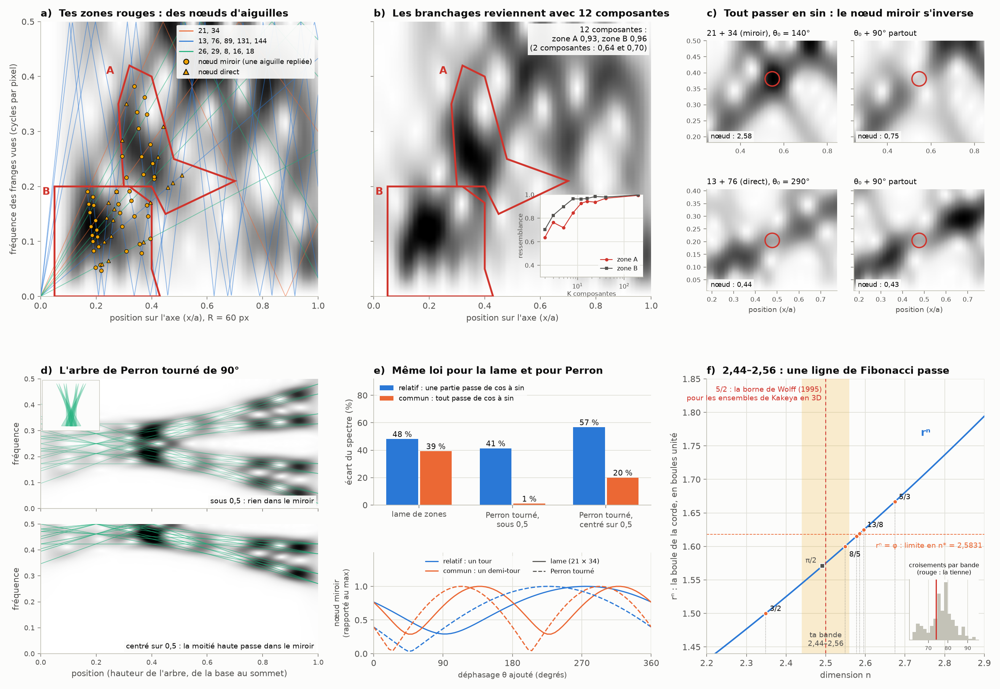

# Partie XIII : les Perron tournés de 90°, les branchages et le déphasage cos/sin

> Ta réponse à la partie XII :
> - 2,45D et 2,55D d'accord ; va jusqu'à 2,44 et 2,56, et ne suis pas seulement Fibonacci, mais aussi les bases et les autres données déjà étudiées ;
> - dans l'image, il manque les branchages que tu as entourés en rouge ;
> - reprends les Perron, tourne-les de 90°, et regarde s'ils produisent la même interférence quand on les déphase, comme cos et sin sont déphasés de 90°.
>
> Suite de la [partie XII](lentille-144.md).

Tout est recalculé par [`scripts/perron_dephasage.py`](scripts/perron_dephasage.py) (≈ 10 s). Les tableaux complets sont dans [`resultats/perron_dephasage.md`](resultats/perron_dephasage.md).

**Suite : [Partie XIV — l'aiguille sur une grille](aiguille-grille.md).**

## En bref

- **Tes branchages rouges sont des nœuds d'aiguilles.**
  - Chaque composante du diaphragme est une aiguille dans le spectre local, qui se replie à 0,5 cycle par pixel. Là où deux aiguilles se croisent, elles interfèrent : c'est un nœud.
  - Tes deux zones en contiennent 21 (en haut) et 41 (en bas). Il faut 12 composantes pour les retrouver, avec une ressemblance de 0,93 et 0,96, contre 0,64 et 0,70 avec les deux du panneau de la partie XI.
  - La position des nœuds est exacte. Le nœud de 21 et 34 est à la fréquence 21/55 cycle par pixel, soit 137,45° par pixel : une approximation de Fibonacci de l'angle d'or.
- **Oui, le Perron tourné de 90° produit la même interférence, avec la même loi.**
  - Un nœud passe de |a − b| (aiguilles en opposition) à a + b (en phase) quand le déphasage relatif fait un tour, dans la lame comme dans l'arbre.
  - Passer *tout* de cos à sin inverse un nœud quand une des deux aiguilles est vue dans le miroir du repliement, et ne change rien sinon.
  - C'est cos θ = (e^{iθ} + e^{−iθ})/2 : l'aiguille repliée est la moitié qui tourne à l'envers.
- **Tourner de 90° et déphaser de 90° sont le même geste.** Tourner le plan position–fréquence de 90°, c'est prendre la transformée de Fourier : je l'ai vérifié à 10⁻¹⁵ près. En optique, c'est ce que fait une lentille entre ses deux foyers, et dans une fibre à gradient d'indice chaque rayon suit x₀ cos + θ₀ sin.
- **La bande 2,44–2,56 n'a rien de spécial, mais une ligne de Fibonacci la traverse.**
  - Avec Fibonacci, les bases 2, 10, 12 et 60 et les constantes déjà rencontrées, la bande est ordinaire. Pour Fibonacci, elle est même plutôt pauvre : deux bandes de même largeur sur trois en contiennent plus.
  - La grandeur rⁿ de la chèvre (sa boule de corde, comptée en boules unité) passe par 3/2, 5/3, 8/5, 13/8… en des dimensions qui convergent vers n* = 2,5831, où rⁿ = φ. Seule 8/5 tombe dans ta bande.
  - Une seule coïncidence a un sens géométrique net : la corde vaut 6/5 en n = 2,5108, et le triangle de la chèvre s'y coupe en deux triangles 3-4-5.
- **Le vrai 2,5D des aiguilles existe : c'est la borne 5/2 de Kakeya en 3D.** Wolff l'a démontrée en 1995. Deux « presque contre-exemples » de dimension exactement 5/2 ont empêché pendant des années de la dépasser, jusqu'à la preuve de Wang et Zahl (dimension 3, en 2025). Ce n'est pas la chèvre, mais ce sont bien des ensembles d'aiguilles à 2,5D, et l'un d'eux est construit avec une écriture des nombres à deux chiffres.

---

## 1. Les branchages rouges : des nœuds d'aiguilles

**Ce qui manquait.** Le panneau d de la partie XI ne traçait que les deux composantes les plus fortes, 21 et 34. On reconstruit la rangée de pixels avec de plus en plus de composantes, et on compare son spectre local au spectre mesuré, zone par zone (panneau b) :

| composantes | ajoutées | zone A (haut) | zone B (bas) |
|---:|---|---|---|
| 2 | 21, 34 | 0,638 | 0,704 |
| 3 | 13 | 0,765 | 0,825 |
| 5 | 76, 89 | 0,720 | 0,899 |
| 8 | 26, 29, 8 | 0,846 | 0,965 |
| 12 | 16, 131, 144, 18 | 0,928 | 0,964 |
| 40 | … | 0,970 | 0,980 |

- **La zone B se remplit avec 13, 76, 89, puis 26, 29 et 8.**
- **La zone A demande en plus 16, 131, 144 et 18**, dont deux répliques : 131 = 21 + 2×55 et 144 = 34 + 2×55.

**Pourquoi ça ressemble à des branchages.** Chaque composante u est une aiguille : sa fréquence vue monte en ligne droite, f = 2u·x/R, et se replie chaque fois qu'elle atteint 0,5 cycle par pixel, la limite de la grille de pixels (partie IX).
- Au-delà de 0,5, on voit l'aiguille dans un miroir : elle redescend.
- Là où deux aiguilles se croisent, leurs franges s'additionnent ou s'annulent : c'est un nœud.
- Tes zones en contiennent beaucoup : 21 nœuds dans A et 41 dans B (panneau a).

**La position des nœuds est exacte.**
- Un nœud entre u et v bat à la fréquence u + v, s'il croise une aiguille vue dans le miroir (« nœud miroir »), ou |u − v| si les deux sont du même côté (« nœud direct »).
- Il tombe exactement sur un centre fantôme de cette fréquence de battement, c'est-à-dire là où 2(u ± v)·x/R est un entier (écart 10⁻¹⁵). Les « nouveaux centres » de la partie IX réapparaissent ici, à l'échelle des interférences.
- Le premier nœud miroir de u et v est en x/a = R/(2(u+v)), à la fréquence f = u/(u+v) :

| paire | position x/a | fréquence | par pixel |
|---|---|---|---|
| 13 et 21 | 0,882 | 13/34 = 0,3824 | 137,65° |
| 21 et 34 | 0,545 | 21/55 = 0,3818 | 137,45° |
| 34 et 89 | 0,244 | 34/123 = 0,2764 | 99,51° |

**Le nœud de 21 et 34 est un angle d'or.**
- À ce nœud, la composante 21 avance de 21/55 de tour par pixel, soit 137,45°. La composante 34 avance de 34/55 de tour, soit 222,55°, et la grille la voit dans le miroir.
- 21/55 + 34/55 = 1 : c'est l'équation des deux foyers (partie IX) et du partage du tour par l'angle d'or (parties XI et XII), à son rang de Fibonacci.
- Le battement de ce nœud est 55. Or la composante 55 est exactement nulle (partie XI) : ce nœud est le centre fantôme d'une composante qui n'existe pas seule, seulement comme battement de 21 et 34.
- Tous les nœuds ne sont pas de Fibonacci : 34 et 89 battent à 123 (un nombre de Lucas), 21 et 89 à 110.

## 2. Le déphasage de 90° : la loi du nœud

**Un nœud suit la loi des interférences.** On garde deux composantes seules et on décale l'une des deux d'une phase θ. Le spectre au nœud va de |a − b| à a + b, où a et b sont les valeurs de chaque composante seule :

| nœud | type | a | b | prévu : \|a − b\| → a + b | mesuré |
|---|---|---|---|---|---|
| 21 × 34 | miroir | 1,66 | 0,97 | 0,69 → 2,63 | 0,75 → 2,57 |
| 13 × 76 | direct | 0,72 | 0,31 | 0,41 → 1,03 | 0,41 → 1,03 |

**Et si tout passe de cos à sin ?**
- Un cos réel est la somme de deux rotations de sens contraires : cos θ = (e^{iθ} + e^{−iθ})/2.
- L'aiguille vue dans le miroir, c'est la moitié e^{−iθ}, celle qui tourne à l'envers.
- Ajouter 90° à tout tourne donc l'aiguille directe de +90° et l'aiguille miroir de −90°. Sur un nœud miroir, leur déphasage relatif change de 180° : le nœud passe à son état opposé. Sur un nœud direct, rien ne change.
- Mesuré (panneau c) :
  - nœud miroir 21 × 34 : de 2,58 (fort, noir sur la figure) à 0,75 (faible). Quand on fait varier le déphasage commun, il repasse par le même état tous les 180°, et non tous les 360°.
  - nœud direct 13 × 76 : de 0,44 à 0,43, constant.
- Un détail honnête : dans la vraie lame, le nœud 21 × 34 part presque en quadrature, à mi-chemin entre fort et faible. Or un nœud à mi-chemin reste à mi-chemin quand on le décale de 180° : passer en sin ne le change presque pas (de 1,97 à 1,83). La figure part donc de la phase où il est le plus fort (θ₀ = 140°) pour montrer l'effet en entier.

**Sur le spectre complet** (40 composantes), avec l'écart rapporté au spectre :

| ce qui passe de cos à sin | tout le spectre | zone A | zone B |
|---|---|---|---|
| 21 et 34 seulement | 37 % | 33 % | 44 % |
| 13 et 8 seulement | 18 % | 12 % | 32 % |
| toutes sauf 21 et 34 (déphasage relatif) | 48 % | 45 % | 43 % |
| toutes (déphasage commun) | 39 % | 23 % | 34 % |
| toutes, changées de signe (180°) | 4 % | | |

Tes branchages dépendent donc des phases, et pas seulement des aiguilles présentes. Le changement de signe (180° partout) ne change presque rien : c'est le contrôle.

**Dans l'image elle-même, le déphasage se fait tout seul.**
- À la hauteur y0, la composante u prend la phase 2πu·y0²/R². Le nœud 21 × 34 tourne donc de 2π·55·y0²/R² : 90° dès y0 = 4 pixels.
- Par rapport à la rangée centrale, le spectre change déjà de 25 % deux pixels plus haut, et de 47 % quatre pixels plus haut.
- Les branchages de l'image en 2D sont la suite de ces nœuds, qui s'allument et s'éteignent quand on monte de rangée en rangée.

## 3. Le Perron tourné de 90°

**La construction** (panneau d).
- On reprend l'arbre de Perron à 8 branches de la partie X. Chaque branche donne 3 aiguilles : ses deux bords et sa médiane.
- Tourner de 90°, c'est échanger les axes : la base du triangle devient l'axe des fréquences, la hauteur devient l'axe des positions.
- Chaque aiguille devient une fréquence qui glisse, de la base (x = 0) au sommet (x = 1). On obtient un signal, dont on calcule le spectre local comme pour la lame.
- Les aiguilles partent avec des phases à pas d'angle d'or (2π·k/φ²). Sans cela, elles partent toutes en phase en x = 0 et s'additionnent en un seul éclair, comme un foyer, qui cache l'arbre (je l'ai vu au premier essai).

**Deux versions.**
- *Sous 0,5 cycle par pixel* : l'arbre entier est vu directement. On voit le sablier de Perron, avec des nœuds là où les branches se croisent.
- *Centré sur 0,5* : la moitié haute de l'arbre passe dans le miroir et redescend, comme les aiguilles de la lame.

**Le déphasage** (panneau e, écart du spectre) :

| | branches alternées cos / sin (relatif) | tout en sin (commun) |
|---|---|---|
| lame de zones | 48 % | 39 % |
| Perron tourné, sous 0,5 | 41 % | **1 %** |
| Perron tourné, centré sur 0,5 | 57 % | 20 % |

**La même loi du nœud.** Dans l'arbre centré sur 0,5, avec deux aiguilles seules de deux branches différentes :
- nœud miroir (branches 1 et 6) : un tour pour le déphasage relatif, un demi-tour pour le déphasage commun ;
- nœud direct (branches 3 et 4) : un tour pour le déphasage relatif, rien pour le déphasage commun.

**Réponse à ta question.**
- Oui, les Perron tournés de 90° produisent la même interférence que les aiguilles de la lame : mêmes nœuds, même loi en |a − b| ↔ a + b, mêmes périodes.
- Ce qui décide si « cos → sin » change l'image, c'est le miroir. Sans aiguille repliée, le spectre ne voit que les phases relatives, et passer tout en sin ne change rien (1 %). Avec le repliement, les nœuds miroirs s'inversent.
- La lame de zones est déjà repliée (ses aiguilles dépassent 0,5 cycle par pixel dès x/a = R/(4u)). C'est pour cela que tes branchages réagissent au cos/sin.

## 4. Tourner de 90°, c'est déphaser de 90°

Ton rapprochement entre « tourner de 90° » et « cos et sin déphasés de 90° » a une forme exacte.

**Dans le plan position–fréquence.**
- Prendre la transformée de Fourier d'un signal fait tourner son plan position–fréquence de 90°.
- Je l'ai vérifié sur le Perron tourné, avec une fenêtre gaussienne qui est sa propre transformée de Fourier. Le spectre local de la transformée est le spectre local tourné de 90°, à 5×10⁻¹⁶ près.
- Deux transformées de suite, c'est 180° : le signal est retourné, s(n) → s(−n), à 2×10⁻¹⁵ près.
- C'est le résultat de Lohmann (1993) et d'Almeida (1994) : la transformée de Fourier « fractionnaire » d'angle α fait tourner la distribution de Wigner de α.

**En optique.**
- Une lentille fait une transformée de Fourier entre ses deux plans focaux (exacte dans l'approximation paraxiale). Deux lentilles de suite retournent l'image : c'est le foyer qui retourne l'aiguille (partie VIII).
- Dans une fibre à gradient d'indice parabolique, chaque rayon suit x(z) = x₀ cos(gz) + (θ₀/g) sin(gz). La position et l'angle du rayon sont le cos et le sin d'une même rotation.
- Après un quart de période (90°), position et angle ont échangé leurs rôles : c'est une transformée de Fourier. Après une demi-période, l'image est retournée (Mendlovic et Ozaktas, 1993). L'œil de poisson de Maxwell de la partie VIII est un autre milieu à gradient d'indice, où les rayons sont des cercles.

**Ce que ça change pour les nœuds.**
- Tourner de 90° (Fourier) fait tourner tout le dessin, nœuds compris, sans les changer.
- Ce qui change les nœuds, c'est un déphasage relatif entre aiguilles, ou un déphasage commun quand certaines aiguilles sont vues dans le miroir.

## 5. La bande 2,44–2,56

**Les grandeurs suivies** (dimension réelle, fonction bêta incomplète, partie VI) :

| grandeur | n = 2,44 | n = 2,50 | n = 2,56 |
|---|---|---|---|
| corde r | 1,19511 | 1,19927 | 1,20327 |
| r² | 1,42829 | 1,43825 | 1,44786 |
| rⁿ (boule de corde, en boules unité) | 1,54481 | 1,57504 | 1,60595 |
| corde du simplexe s | 1,19105 | 1,19523 | 1,19925 |
| volume de la boule V(n) | 3,62779 | 3,69153 | 3,75451 |
| angle au piquet α | 53,30° | 53,16° | 53,01° |
| arc de la corde γ | 73,39° | 73,69° | 73,97° |

S'y ajoutent l'écart r − s, l'aire de la sphère n·V(n) et le rapport hémisphère/cylindre de la partie IV, dans les résultats.

**Les valeurs comparées, en trois familles.**
- *Fibonacci, Lucas et φ* : les puissances de φ, 2 sin 36°, les rapports F(k+1)/F(k) et F(k)/F(k+2), les nombres de Fibonacci et de Lucas ; en angles, 360°/φ^k, 137,5°, 222,5°, 36°, 72°, 108°, 144°.
- *Les bases 2, 10, 12 et 60* : leurs puissances, et les nombres qui s'écrivent avec peu de chiffres dans ces bases (fractions en 1/2, 1/4, 1/8, 1/16, 1/10, 1/12, 1/60) ; en angles, les divisions du tour par 12, 24, 60, 144, 270 et 720.
- *Les constantes déjà rencontrées* : √2, √3, √5, π et ses fractions, π − 3, e, le nombre plastique, 2,5 = 5²×10⁻¹, 1/4 = 5²×10⁻², 1/11, le seuil 0,6416 de la FTO ; en angles, ceux du tétraèdre et du cube (109,47°, 70,53°, 54,74°, 35,26°).

**Ce qui tombe dans la bande** (la grandeur passe par la valeur exacte) :
- Fibonacci : une seule valeur, rⁿ = 8/5 en n = 2,5486.
- Bases : 72 valeurs. La plupart concernent l'aire n·V(n), qui varie vite et croise donc beaucoup de fractions. Les plus simples :
  - la corde r = 6/5 en n = 2,5108 ;
  - le volume V(n) = 11/3, 37/10 et 15/4 en n = 2,4765, 2,5080 et 2,5557 ;
  - l'arc γ = 73,5° en n = 2,4619.
- Constantes : une seule valeur, rⁿ = π/2 en n = 2,4916.

**La seule coïncidence qui ait un sens géométrique net : r = 6/5.**
- Le triangle piquet–centre–bord du pré a deux côtés de longueur 1 et un côté r. Avec r = 6/5, cos α = r/2 = 3/5 et sin α = 4/5.
- Le triangle se coupe donc en deux triangles 3-4-5, le plus simple des triangles rectangles à côtés entiers. Le point où la corde touche le bord du pré a alors des coordonnées rationnelles : (7/25, 24/25), avec le centre du pré à l'origine et le piquet en (1, 0). C'est un autre triangle à côtés entiers, 7-24-25.
- Cela arrive en n = 2,5108, dans ta bande. Je le note comme une coïncidence : rien ne relie ce triangle au reste.

**Le contrôle.** On fait le même compte pour toutes les bandes de largeur 0,12 entre 1,2 et 4,4 :

| famille | dans 2,44–2,56 | moyenne des bandes | plus pauvres | à égalité | plus riches |
|---|---|---|---|---|---|
| Fibonacci, Lucas et φ | 1 | 3,5 | 10 % | 24 % | 67 % |
| bases 2, 10, 12 et 60 | 72 | 72,2 | 35 % | 3 % | 61 % |
| constantes déjà rencontrées | 1 | 0,9 | 44 % | 38 % | 18 % |

La bande est ordinaire pour les bases et les constantes. Pour Fibonacci, elle est même plutôt pauvre : deux bandes sur trois en contiennent plus.

**Mais une ligne de Fibonacci la traverse** (panneau f).
- rⁿ, c'est le volume de la boule de corde de la chèvre, compté en boules unité : le « Bⁿ » de la partie VI.
- rⁿ passe par les fractions de Fibonacci en des dimensions qui convergent en alternant, exactement comme les fractions convergent vers φ :

| rⁿ = | 3/2 | 5/3 | 8/5 | 13/8 | 21/13 | 34/21 | … | φ |
|---|---|---|---|---|---|---|---|---|
| en n = | 2,3485 | 2,6742 | **2,5486** | 2,5964 | 2,5781 | 2,5850 | … | **2,5831** |

- C'est bien une ligne de Fibonacci qui converge vers une dimension entre 2D et 3D. Seule 8/5 tombe dans ta bande. La limite n* = 2,5831 est 0,023 au-dessus de 2,56.
- Pourquoi elle tombe entre 2D et 3D : rⁿ vaut r² = 1,3427 en 2D et r³ = 1,8543 en 3D, et croît avec n. Comme φ = 1,618 est entre les deux, la limite y tombe forcément.
- Ce n'est pas propre à rⁿ. J'ai cherché toutes les dimensions où une grandeur de la chèvre vaut une puissance de φ entre 1,2 et 4,4. Il y en a 18, réparties de 1,54 à 4,24, et aucune dans ta bande (on en attendrait 0,7 au hasard).

## 6. Le 2,5D des aiguilles : la borne de Wolff

Il existe un 2,5D précis qui concerne des aiguilles entre 2D et 3D. Ce n'est pas la chèvre, mais c'est très proche de ce que tu décris.

**Le problème.** Un ensemble de Kakeya de l'espace contient une aiguille de longueur 1 dans chaque direction. Quelle est sa dimension au minimum ?

**L'histoire.**
- Wolff (1995) montre qu'elle vaut au moins 5/2 en 3D, avec l'argument de la « brosse à cheveux » : toutes les aiguilles qui passent par une même aiguille. La borne est marquée en rouge sur le panneau f.
- Il faut cinq ans pour dépasser 5/2 au sens de Minkowski : Katz, Łaba et Tao (2000) obtiennent 5/2 + 10⁻¹⁰.
- Il en faut plus de vingt au sens de Hausdorff : Katz et Zahl (2019) obtiennent 5/2 + ε.
- Wang et Zahl montrent en 2025 que la dimension vaut 3 (partie V).

**Pourquoi 5/2 a tenu si longtemps : deux presque contre-exemples de dimension exactement 5/2.**
- *L'exemple du groupe de Heisenberg* (Katz, Łaba et Tao). Dans l'espace complexe à 3 dimensions, c'est l'hypersurface Im z₃ = Im(z₁ z̄₂). Elle a la dimension complexe 5/2 et contient une famille de droites qui se comporte comme un ensemble de Kakeya. La méthode de Wolff s'y applique aussi bien, donc elle ne peut pas faire mieux que 5/2.
- *L'exemple SL₂* (Katz et Zahl). Il ressemble à un ensemble de Kakeya de dimension de Hausdorff 5/2 mais de dimension de Minkowski 3. Il est construit en écrivant chaque nombre avec deux chiffres, à deux échelles : x = δ^{1/2}·x₁ + δ·x₂. C'est une écriture en base, à deux chiffres.

**Le lien avec ce que tu dis, et ses limites.**
- Des ensembles d'aiguilles de dimension 2,5, entre 2D et 3D, dont l'un est construit avec une écriture des nombres à deux chiffres : ces objets existent, et ils ont joué un rôle central dans le problème de l'aiguille de Kakeya.
- Mais leur 2,5 est exact, 5/2, et pas une bande.
- Dans l'espace réel à 3 dimensions, aucun ne peut être un vrai ensemble de Kakeya : Wang et Zahl ont montré que tout ensemble de Kakeya de l'espace est de dimension 3.
- Je n'ai trouvé aucun lien calculable entre ce 5/2 et la corde de la chèvre.

## 7. Le tri

**Établi (calculé ici) :**
- tes branchages rouges sont des nœuds d'aiguilles : il faut 12 composantes pour les retrouver (0,93 et 0,96) ;
- les nœuds sont aux centres fantômes des battements u ± v, et le nœud 21 × 34 est à 21/55 de tour par pixel, une approximation de l'angle d'or ;
- la loi du nœud, de |a − b| à a + b ;
- passer tout de cos à sin inverse les nœuds miroirs et laisse les nœuds directs, parce que l'aiguille repliée est la moitié e^{−iθ} du cos ;
- le Perron tourné de 90° suit la même loi : 1 % de changement sans miroir, 20 % avec ;
- tourner de 90° le plan position–fréquence est une transformée de Fourier (vérifié à 10⁻¹⁵ près) ;
- dans la bande 2,44–2,56 : r = 6/5 (le triangle 3-4-5) en 2,5108, rⁿ = 8/5 en 2,5486 ; la ligne de Fibonacci de rⁿ converge vers 2,5831.

**Connu, avec sources :**
- la transformée de Fourier fractionnaire comme rotation, et sa réalisation optique (lentilles, gradient d'indice) ;
- la borne 5/2 de Wolff pour Kakeya en 3D, les exemples de Heisenberg et SL₂, et la dimension 3 de Wang et Zahl.

**Pas établi :**
- une bande spéciale entre 2,44 et 2,56 pour la chèvre : elle est ordinaire, et plutôt pauvre en Fibonacci ;
- la limite 2,5831 de la ligne de Fibonacci n'est pas une singularité : c'est l'endroit où rⁿ passe par φ, comme les 17 autres limites du même genre ;
- un lien entre le 5/2 de Kakeya et la chèvre : je n'en ai pas trouvé.

## Sources

- T. Wolff, [« An improved bound for Kakeya type maximal functions »](https://eudml.org/doc/39495), *Revista Matemática Iberoamericana* 11(3), 651–674 (1995).
- N. H. Katz, I. Łaba et T. Tao, [« An improved bound on the Minkowski dimension of Besicovitch sets in ℝ³ »](https://annals.math.princeton.edu/articles/11845), *Annals of Mathematics* 152(2), 383–446 (2000) ; [version arXiv](https://arxiv.org/abs/math/9903166). L'exemple du groupe de Heisenberg y est présenté.
- N. H. Katz et J. Zahl, [« An improved bound on the Hausdorff dimension of Besicovitch sets in ℝ³ »](https://www.ams.org/journals/jams/2019-32-01/S0894-0347-2018-00907-5), *Journal of the AMS* 32(1) (2019) ; [version arXiv](https://arxiv.org/abs/1704.07210). L'exemple SL₂.
- Pour aller plus loin : [« A Survey of the Kakeya conjecture, 2000–2025 »](https://arxiv.org/abs/2512.09397) (arXiv, 2025).
- H. Wang et J. Zahl (2025), déjà dans la [partie V](aiguille-kakeya.md).
- A. W. Lohmann, « Image rotation, Wigner rotation, and the fractional Fourier transform », *Journal of the Optical Society of America A* 10(10), 2181–2186 (1993).
- D. Mendlovic et H. M. Ozaktas, [« Fractional Fourier transforms and their optical implementation: I »](https://repository.bilkent.edu.tr/items/9e36b543-46e9-4749-80e8-859786bde78a), *Journal of the Optical Society of America A* 10(9) (1993) : le gradient d'indice.
- L. B. Almeida, « The fractional Fourier transform and time-frequency representations », *IEEE Transactions on Signal Processing* 42(11), 3084–3091 (1994).
- J. W. Goodman, *Introduction to Fourier Optics* : la lentille comme transformée de Fourier.
- Parties [V](aiguille-kakeya.md) (Kakeya, Perron), [VI](zone-confusion.md) (dimension réelle, rⁿ), [VIII](foyer-fibonacci.md) (le foyer qui retourne l'aiguille, l'œil de poisson), [IX](moire-fibonacci.md) (centres fantômes), [X](carre-ptolemee.md) (l'arbre à 8 branches), [XI](angle-or-aiguilles.md) (le spectre, les petites aiguilles) et [XII](lentille-144.md) (137,5° et 222,5°).
