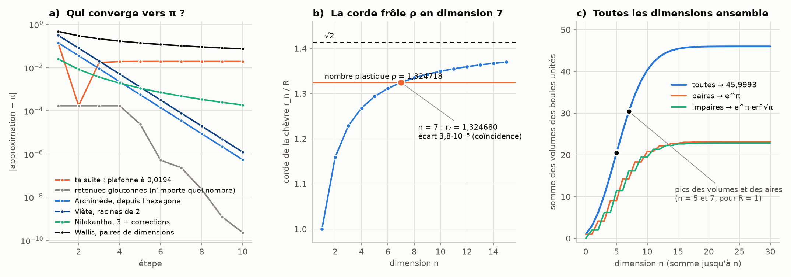

# Partie III : π, √2 et les dimensions

> La question : existe-t-il une « formule de rectification dimensionnelle par retenues » qui part de 3, ajoute √2/10, puis √3/100, et ainsi de suite, et converge vers π ? Avec des retours par 3² et 2³, le nombre plastique, le nombre d'or, et le même principe que pour les disques et les boules ? Suite des [parties I](README.md) et [II](archimede.md).

Tout est recalculé par [`scripts/pi_dimensions.py`](scripts/pi_dimensions.py) ; les tableaux sont dans [`resultats/pi_dimensions.md`](resultats/pi_dimensions.md).

## En bref

- **Ta suite, prise à la lettre, converge vers 3,160993…**, pas vers π. Elle dépasse π dès le 3e terme.
- **Des « retenues » libres atteignent π**, mais elles atteignent aussi n'importe quel autre nombre. Elles écrivent π, elles ne l'expliquent pas.
- **Les formules qui font ce que tu cherches existent.** Archimède part de 3 (l'hexagone, avec √3). Viète avance par racines de 2 imbriquées. Nilakantha écrit 3 plus des corrections. Et Wallis sort π des intégrales mêmes de la chèvre, une paire de dimensions après l'autre.
- **φ apparaît exactement** dans notre géométrie. **ρ frôle la corde de la chèvre en dimension 7** (écart 3,8·10⁻⁵), mais on peut prouver que ce n'est pas une égalité.



---

## 1. Ta suite, calculée

| étape | somme | écart à π |
|---:|---|---:|
| 1 | 3 | −0,14 |
| 2 | 3 + √2/10 = 3,1414214 | −1,7·10⁻⁴ |
| 3 | + √3/100 = 3,1587419 | +0,017 |
| 4 | + √4/1000 = 3,1607419 | +0,019 |
| 10 | 3,1609929 | +0,0194 |

Après l'étape 2, il ne manque que 0,00017 pour atteindre π. Or le terme suivant, √3/100 = 0,0173, est cent fois trop grand. La suite saute par-dessus π et ne revient jamais. Sa limite a même une forme exacte, avec la fonction polylogarithme :

```math
3 + \sum_{k\ge2}\frac{\sqrt k}{10^{\,k-1}} = 3 + 10\left(\mathrm{Li}_{-1/2}\!\left(\tfrac1{10}\right) - \tfrac1{10}\right) = 3{,}160992928\ldots
```

Ce n'est ni π ni √10 (3,16228). Le bon départ 3 + √2/10 est la coïncidence déjà signalée dans la partie II.

## 2. Les retenues : pourquoi « ça marche » ne prouve rien

On peut forcer la convergence. À chaque étape $k$, on prend autant de fois $\sqrt k/10^{k-1}$ qu'il en tient dans l'écart restant. C'est une « retenue ». Pour π, on obtient les nombres de fois suivants :

> 1, 0, 0, 0, 6, 9, 1, 7, 7, 3, 6, 6, 8, 0, 0, 2, 1, 7, 1

Ça converge (environ un chiffre gagné par étape, courbe grise de la figure a). Mais le même procédé marche pour √10 (1, 1, 1, 6, 7, 8, …) ou pour e + 0,42 (0, 7, 8, 4, 5, …), avec des nombres tout aussi désordonnés. C'est comme l'écriture décimale 3,14159… : elle représente π sans rien en dire. Une formule **de** π, au sens où on l'entend, a une règle simple pour fabriquer ses termes. C'est la différence entre écrire un nombre et l'expliquer.

## 3. Les formules qui partent de 3, de √2 et de √3

| étape | Archimède (polygone inscrit) | Viète | Nilakantha | Wallis |
|---:|---|---|---|---|
| 1 | 3 (hexagone) | 2,8284 | 3,1667 | 2,6667 |
| 2 | 3,1058 (12 côtés) | 3,0615 | 3,1333 | 2,8444 |
| 3 | 3,1326 (24) | 3,1214 | 3,1452 | 2,9257 |
| 5 | 3,1410 (96) | 3,1403 | 3,1427 | 3,0022 |
| 8 | 3,14158 (768) | 3,14157 | 3,1413 | 3,0506 |

- **Archimède part de 3.** L'hexagone inscrit dans un cercle a un périmètre de 3 diamètres, d'où π ≥ 3. L'hexagone circonscrit en a 2√3. On double ensuite le nombre de côtés avec une moyenne harmonique puis une moyenne géométrique, sans jamais utiliser π : $a \leftarrow 2ab/(a+b)$, $b \leftarrow \sqrt{ab}$. Avec 96 côtés, 3,14103 < π < 3,14272. Chaque doublement divise l'erreur par 4. Ton 3 et ton √3 sont là, à leur vraie place.
- **Viète (1593) avance par racines de 2 imbriquées**, en doublant les côtés à partir du carré :
  ```math
  \frac2\pi = \frac{\sqrt2}{2}\cdot\frac{\sqrt{2+\sqrt2}}{2}\cdot\frac{\sqrt{2+\sqrt{2+\sqrt2}}}{2}\cdots
  ```
- **Nilakantha (vers 1500, école du Kerala) écrit 3 plus des corrections** de signes alternés :
  ```math
  \pi = 3 + \frac{4}{2\cdot3\cdot4} - \frac{4}{4\cdot5\cdot6} + \frac{4}{6\cdot7\cdot8} - \cdots
  ```
  C'est littéralement « 3 + des retenues », mais avec une règle.
- **Wallis (1656)** donne π comme un produit infini, et c'est celui qui nous ramène à la chèvre.

## 4. La formule dimensionnelle, et elle vient de la chèvre

**Le pas d'une dimension à la suivante.** Dans la partie I, la chèvre en dimension $n$ se calculait avec les intégrales des tranches $W_n = \int_0^\pi \sin^n\varphi\,d\varphi$. Ce sont exactement les pas qui font passer d'une dimension à la suivante :

```math
V_n = W_n\,V_{n-1}, \qquad W_n\,W_{n-1} = \frac{2\pi}{n}, \qquad\text{donc}\qquad V_n = \frac{2\pi}{n}\,V_{n-2}.
```

**π en sort exactement, dans toute dimension.** Monter de deux dimensions multiplie toujours le volume par $2\pi/n$, d'où $\pi = n\,V_n/(2V_{n-2})$ (le script le vérifie pour n = 3, 5, 7).

**La parité de la partie I réapparaît.** Les pas pairs apportent π, les pas impairs des fractions :

| pas | $W_1$ | $W_2$ | $W_3$ | $W_4$ | $W_5$ |
|---|---|---|---|---|---|
| valeur | $2$ | $\pi/2$ | $4/3$ | $3\pi/8$ | $16/15$ |

**Le produit de Wallis.** En grande dimension, un pas pair et le pas impair suivant deviennent presque égaux : c'est la concentration de la mesure de la partie I. Ce « presque » donne :

```math
\frac\pi2 = \frac{2\cdot2}{1\cdot3}\cdot\frac{4\cdot4}{3\cdot5}\cdot\frac{6\cdot6}{5\cdot7}\cdots = \prod_{k\ge1}\left(1 + \frac{1}{4k^2-1}\right).
```

**Voilà la formule « par retenues dimensionnelles » qui existe vraiment.** Chaque paire de dimensions $(2k, 2k+1)$ apporte la correction $1 + 1/(4k^2-1)$. Elle converge lentement (erreur ≈ π/(4k)), au même rythme que la corde de la chèvre vers √2 (en 1/n). Ce n'est pas un hasard : les deux viennent de la même concentration.

**La constante des sphères.** Le même mécanisme donne le √(2π) de la formule de Stirling. Il fixe la constante vers laquelle converge la « taille » des boules : $V_n^{1/n}\sqrt n \to \sqrt{2\pi e} = 4{,}1327$.

## 5. Toutes les dimensions ensemble : une vraie constante

Si on additionne les volumes des boules unités de toutes les dimensions, la somme converge. Les volumes s'effondrent après le pic de la dimension 5 : à la dimension 30, il ne reste que 2·10⁻⁵ à ajouter (figure c).

```math
\sum_{n\ge0} V_n = e^{\pi}\left(1 + \operatorname{erf}\sqrt\pi\right) = 45{,}99932\ldots
```

- **Les dimensions paires** donnent exactement $\sum \pi^k/k! = e^\pi = 23{,}1407$ (la constante de Gelfond, transcendante).
- **Les dimensions impaires** donnent $e^\pi\,\mathrm{erf}\sqrt\pi = 22{,}8586$.

C'est une constante « des sphères » au sens où tu l'entends, mais elle ne converge pas à partir de 5 et 7. Elle converge **parce que** les volumes redescendent après 5. Que le total tombe si près de 46 est une coïncidence.

## 6. φ, ρ, 3² et 2³

**Le nombre d'or φ = 1,618…** apparaît exactement dans notre géométrie :
- la sphère et le paraboloïde se croisent en $z = R/\varphi$ (partie II) ;
- les sommets de l'icosaèdre sont les points $(0, \pm1, \pm\varphi)$, ce qui fait de φ la base des sphères géodésiques de la partie II.

**Le nombre plastique ρ = 1,324718…** (racine de $x^3 = x + 1$) frôle la corde de la chèvre en dimension 7 : $r_7 = 1{,}324680$, à 3,8·10⁻⁵ près (figure b). C'est pourtant une coïncidence, et on peut le prouver. $r_7$ est racine du polynôme $7r^{12} - 112r^{10} + 840r^8 - 1024r^7 + 1024$, qui est irréductible (son groupe de Galois est $S_{12}$, partie I). Si $r_7$ valait ρ, ce polynôme serait divisible par $x^3 - x - 1$. Directement, $r_7^3 - r_7 - 1 = -1{,}6\cdot10^{-4} \ne 0$.

φ et ρ sont les deux seuls « nombres morphiques » : ce sont les seuls $x > 1$ tels que $x + 1$ et $x - 1$ soient tous deux des puissances de $x$ ($\varphi^2 = \varphi + 1$, $\rho^3 = \rho + 1$).

**3² et 2³ :** 9 et 8 sont les deux seules puissances entières consécutives. C'est l'ancienne conjecture de Catalan, démontrée par Mihăilescu en 2002. On retrouve 2 et 3, comme pour les factorielles de la partie II.

## 7. Les dimensions vraiment spéciales pour les sphères

- **5 et 7** sont les pics du volume et de l'aire, mais seulement pour un rayon 1 : ils se déplacent avec l'unité (partie II).
- **3** est la seule dimension où l'aire de la sphère se projette uniformément sur un axe (Archimède, partie II).
- **8 et 24** sont les dimensions où les sphères s'empilent de façon exceptionnelle (réseaux $E_8$ et de Leech). Ce sont les seuls cas, avec 1, 2 et 3, où l'on connaît l'empilement le plus dense, démontré en 2016 par Viazovska (dimension 8) puis avec Cohn, Kumar, Miller et Radchenko (dimension 24). Médaille Fields 2022.

## Sources

- Archimède, *La mesure du cercle* : $3 + 10/71 < \pi < 3 + 1/7$.
- F. Viète, *Variorum de rebus mathematicis responsorum liber VIII* (1593) ; J. Wallis, *Arithmetica Infinitorum* (1656) ; Nilakantha Somayaji, *Tantrasangraha* (vers 1500).
- J. M. Borwein et P. B. Borwein, *Pi and the AGM*, Wiley (1987) : l'algorithme d'Archimède et ses cousins.
- J. Aarts, R. Fokkink, G. Kruijtzer, « Morphic numbers », *Nieuw Archief voor Wiskunde* 5/2, 56–58 (2001).
- P. Mihăilescu, « Primary cyclotomic units and a proof of Catalan's conjecture », *J. reine angew. Math.* 572, 167–195 (2004).
- M. Viazovska, « The sphere packing problem in dimension 8 », *Annals of Mathematics* 185, 991–1015 (2017) ; H. Cohn, A. Kumar, S. D. Miller, D. Radchenko, M. Viazovska, « The sphere packing problem in dimension 24 », même volume, 1017–1033.
