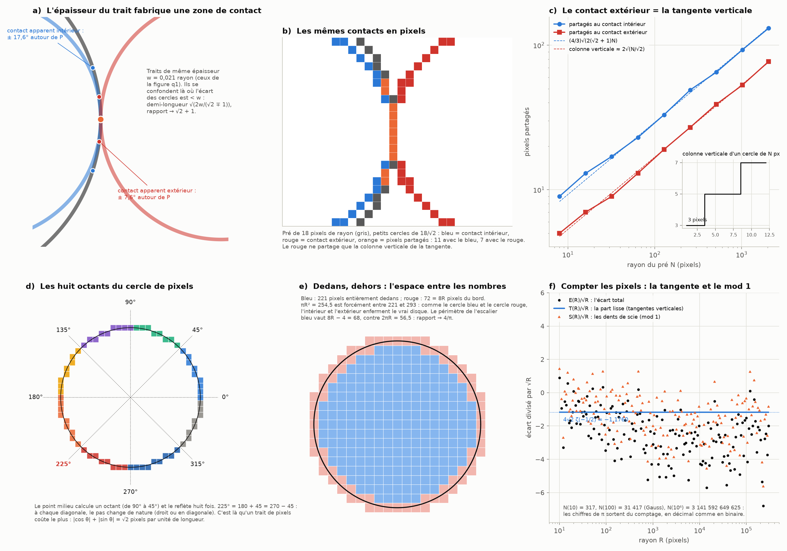
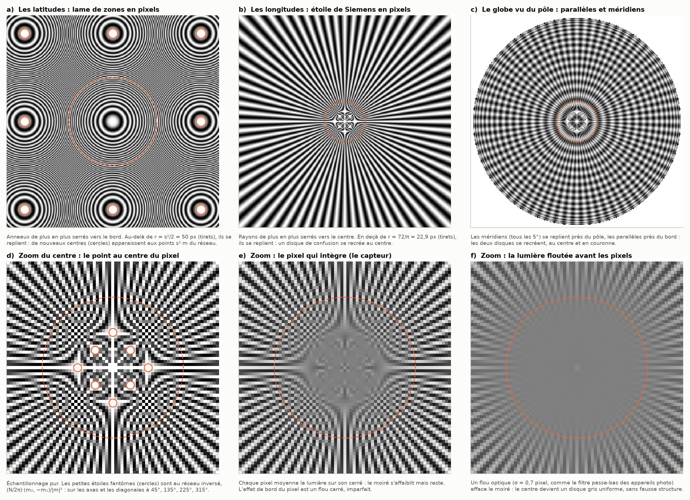

# Partie XVIII : faire des ronds avec des carrés — le mod, les pixels et les longitudes

> Ta réponse à la partie XVII.
> - 225° est le 45° du quart inférieur gauche du cercle (180 + 45 = 270 − 45).
> - La corde de la chèvre est donnée par une division d'intégrales complexes. Notre travail est de voir les liens avec les mathématiques modulaires et la logique du « coarse graining » (le grain grossier) liée à x mod b, surtout en binaire et en décimal, en comprenant l'espace entre les nombres exactement comme le cercle bleu et le cercle rouge.
> - Le cercle rouge touche presque certainement le grand disque en un seul point, avec trois points pour tracer la tangente verticale. Le cercle intérieur, lui, semble partager une grande zone de contact avec le grand disque, à cause de l'épaisseur du trait.
> - L'analyse va jusqu'aux pixels, les plus petites coupures de l'espace plat d'un écran :
>   - faire des ronds avec des pixels carrés ;
>   - des pixels de plus en plus petits qui donnent l'illusion d'un cercle et se confondent avec l'effet de bord de chaque pixel ;
>   - la nature de la lumière ;
>   - les disques qui se recréent par la subdivision en géodésiques concentriques (sur une sphère, à chaque latitude). Il manque les géodésiques à chaque longitude.
>
> Suite de la [partie XVII](recursion-argent.md).

Tout est recalculé par [`scripts/pixels_longitudes.py`](scripts/pixels_longitudes.py) (≈ 15 s). Les tableaux complets sont dans [`resultats/pixels_longitudes.md`](resultats/pixels_longitudes.md).

**Suite : [Partie XIX — les bases 2 et 10 sont deux objets : i modulo 10, l'aiguille qui tourne, le trait, le cône et Thalès](bases-objets.md).**

## En bref

- **225°, c'est exactement là où le cercle de pixels change de pas.**
  - L'algorithme classique du cercle (le « point milieu ») ne calcule qu'un huitième du cercle et le reflète huit fois. Les frontières sont à 45°, 135°, 225° et 315°.
  - Sur ces diagonales, un trait de pixels coûte le plus cher : |cos θ| + |sin θ| = √2 pixels par unité de longueur. Ta diagonale 1x, 1y y coûte 1 + 1 = 2 pixels pour une longueur √2.
- **Ton observation des contacts est juste, et elle se mesure.**
  - Avec l'épaisseur des traits de la figure q1, le contact intérieur semble couvrir un arc de 35°, l'extérieur de 15°. Le rapport tend vers √2 + 1 quand le trait s'affine : ce sont les mêmes √2 ∓ 1 que pour les anneaux de Newton.
  - En pixels, le contact extérieur partage exactement la colonne de la tangente verticale, soit 3 pixels pour les plus petits cercles. Le contact intérieur partage un arc bien plus long.
- **Compter les pixels, c'est le problème du cercle de Gauss.**
  - On trouve N(10) = 317 et N(100) = 31 417, les valeurs de Gauss lui-même, puis N(10⁶) = 3 141 592 649 625. Les chiffres de π sortent du comptage, en décimal comme en binaire.
  - L'écart se coupe exactement en deux. Les tangentes verticales donnent une part lisse, 4√2 ζ(−1/2)·√R = −1,176·√R. Le reste est une somme de dents de scie : le « mod 1 » de chaque colonne.
- **L'espace entre les nombres.**
  - Les pixels entièrement dedans et ceux qui touchent le disque l'enferment, comme le cercle bleu et le cercle rouge.
  - Leur écart vaut exactement 8R pixels. La raison est un argument modulo 4 : le cercle ne passe jamais par un coin de pixel.
  - L'aire converge, mais le périmètre de l'escalier reste 8R − 4 : c'est le paradoxe « π = 4 ». L'illusion du cercle est exacte pour l'aire, jamais pour la longueur.
- **La chèvre en pixels, vite ou sûrement.**
  - Compter par les centres des pixels donne 8 chiffres justes à 100 000 pixels de rayon, mais sans garantie.
  - Compter par les pixels dedans et dehors enferme la corde de façon certaine : un chiffre gagné par niveau décimal, un bit par niveau binaire.
- **Les longitudes qui manquaient.**
  - Les anneaux (les latitudes) se replient hors d'un cercle, les rayons (les longitudes) en dedans.
  - Les centres fantômes des anneaux sont aux points du réseau ; ceux des rayons sont au réseau inversé. Leur produit est constant : c'est encore la forme de Newton x·x' = f².
  - Le globe vu du pôle a les deux.
- **La lumière.**
  - Le pixel intègre la lumière sur son carré, ce qui est un flou imparfait.
  - Un flou optique avant les pixels efface les fausses structures. C'est le rôle du filtre passe-bas des appareils photo.
  - L'œil résout environ une minute d'arc : 300 pixels par pouce vus à 30 cm.



---

## 1. 225° et les huit octants du cercle de pixels

**Les quatre diagonales.** Tu as raison : 225° = 180 + 45 = 270 − 45 est la diagonale du quart inférieur gauche. Avec 45°, 135° et 315°, elle complète les quatre diagonales 1x, 1y du cercle.

**L'algorithme du point milieu** (panneau d). C'est l'algorithme classique pour tracer un cercle en pixels, généralisé par Bresenham à partir de son algorithme de droite.
- Il ne calcule que l'octant de 90° à 45°, puis le reflète huit fois. Les frontières sont aux axes et aux quatre diagonales.
- Dans un octant, une coordonnée avance d'exactement un pixel à chaque pas.
- L'autre avance de 0 ou de 1, selon le signe d'une « variable de décision » : le point milieu entre les deux pixels candidats est-il dedans ou dehors ?
- C'est un arrondi, donc un « mod 1 » : on garde l'entier le plus proche et on jette la fraction.
- Pour R = 100, l'octant compte 71 pixels, dont 29 pas en diagonale, et le cercle entier 564.

**Pourquoi 45° est la frontière.** Un trait de pixels de direction θ coûte |cos θ| + |sin θ| pixels par unité de longueur.
- Le long des axes, il coûte 1.
- Sur les diagonales (45°, 135°, 225°, 315°), il coûte √2 : la diagonale 1x, 1y, longue de √2, se paie 1 + 1 = 2 pixels.
- En moyenne sur le cercle, il coûte 4/π = 1,2732. Ce nombre reviendra au § 4.

## 2. Le contact vu à travers l'épaisseur du trait, puis à travers les pixels

**Ton observation se mesure** (panneau a).
- Deux traits d'épaisseur w se confondent là où les deux cercles sont à moins de w l'un de l'autre.
- Près du point de contact P, l'écart entre les cercles vaut y²(√2 ∓ 1)/2. C'est la même lame que pour les anneaux de Newton (partie XVII).
- La zone de contact apparent a donc pour demi-longueur √(2w/(√2 ∓ 1)).

| épaisseur w (en rayons) | arc apparent, contact intérieur | contact extérieur | rapport |
|---:|---|---|---|
| 0,05 | 51,5° | 23,3° | 2,154 |
| 0,021 (la figure q1) | 35,1° | 15,1° | 2,296 |
| 0,001 | 7,9° | 3,3° | 2,408 |
| → 0 | → 0 | → 0 | → √2 + 1 = 2,414 |

- Le cercle bleu semble donc coller au pré sur 35°, et le rouge sur 15°.
- Plus le trait s'affine, plus les deux zones rétrécissent, mais lentement, comme la racine carrée de l'épaisseur. Pour diviser la zone par deux, il faut un trait quatre fois plus fin.

**En pixels** (panneaux b et c). On prend des cercles d'un pixel d'épaisseur : les pixels dont le centre est à moins d'un demi-pixel du cercle.
- **Au contact extérieur,** les pixels partagés avec le pré sont exactement la colonne verticale du petit cercle au point de tangence, soit 2⌊√(N/√2 + 1/4)⌋ + 1 pixels. C'est vrai pour toutes les tailles testées, de 8 à 2 048 pixels de rayon.
  - C'est ta « tangente verticale » : le rouge ne touche le pré que par elle.
  - Pour un cercle de rayon 1, 2 ou 3 pixels, cette colonne fait exactement 3 pixels : ce sont tes trois points.
- **Au contact intérieur,** les deux anneaux restent ensemble bien au-delà de cette colonne, sur environ (4/3)√(2(√2 + 1)N) pixels. C'est 1,7 fois plus que le contact extérieur.
- La zone partagée grandit comme √N, alors que le cercle grandit comme N. Vue à l'échelle du cercle, elle rétrécit donc comme 1/√N : le contact redevient un point, mais lentement.

## 3. Compter les pixels : Gauss, le décimal, le binaire et le mod 1

**Le cercle de Gauss.** N(R) est le nombre de pixels, c'est-à-dire de points entiers, dans le disque de rayon R.

| R | N(R) | πR² | chiffres justes |
|---:|---|---|---|
| 10 | 317 | 314,159… | 2 |
| 100 | 31 417 | 31 415,926… | 4 |
| 1 000 | 3 141 549 | 3 141 592,65… | 5 |
| 10 000 | 314 159 053 | 314 159 265,36… | 6 |
| 1 000 000 | 3 141 592 649 625 | 3 141 592 653 589,79… | 8 |

- Les deux premières valeurs sont celles que Gauss avait calculées.
- **En binaire**, avec R = 2^k, N(R) écrit en base 2 reproduit les premiers bits de π = 11,00100100001111110110…
- La base ne change pas le fond :
  - quand le rayon gagne un chiffre, l'aire en gagne deux et l'écart en coûte environ un demi ;
  - on gagne donc environ 1,5 chiffre par décade en décimal, et 1,5 bit par doublement en binaire, si la conjecture de Hardy est vraie. On observe ici 1,3 à 1,4 chiffre par décade ;
  - c'est la même conclusion que le test de la base 10 de la partie VI.

**L'écart se coupe exactement en deux.** On écrit ⌊y⌋ = y − ½ − ψ(y), où ψ(y) = (y mod 1) − ½ est la dent de scie. On obtient alors, sans approximation :
```math
N(R) - \pi R^2 \;=\; \underbrace{\Big(\sum_x 2\sqrt{R^2-x^2} - \pi R^2\Big)}_{T(R)\ :\ \text{la part lisse}} \;\underbrace{-\,2\sum_{|x|<R} \psi\big(\sqrt{R^2-x^2}\big)}_{S(R)\ :\ \text{les dents de scie}} \;+\; 2 .
```
- **La part lisse T(R) vient des deux tangentes verticales**, en x = ±R, où la colonne de pixels se termine en racine carrée.
  - Elle vaut 4√2 ζ(−1/2)·√R = −1,1760·√R, où ζ est la fonction zêta de Riemann.
  - Calculée jusqu'à R = 10⁶, elle colle à cette valeur à 10⁻⁵ près (panneau f).
  - Je l'ai obtenue par la formule d'Euler-Maclaurin pour une racine carrée en bout d'intervalle, puis vérifiée numériquement.
- **Les dents de scie S(R) sont le « mod 1 » de chaque colonne** : ce que l'arrondi jette, colonne par colonne. C'est la partie qui fluctue, et c'est elle que les mathématiciens ne savent pas encore borner au mieux.
  - Borne démontrée : l'écart est en O(R^0,6298) (Huxley, 2003), amélioré en O(R^0,6289) (Li et Yang, prépublication de 2023).
  - Une prépublication de Bourgain et Watt (2017) annonce O(R^0,6274).
  - Hardy a conjecturé O(R^(1/2+ε)).

## 4. L'espace entre les nombres : dedans, dehors, et π = 4

**Deux comptages qui enferment le disque** (panneau e).
- On compte les pixels entièrement dans le disque (bleu) et ceux qui le touchent (rouge).
- Le vrai disque est forcément entre les deux, comme le cercle bleu (dedans) et le cercle rouge (dehors) enferment le contact.
- Leur écart vaut exactement 8R pixels : 80 pour R = 10, 8 000 pour R = 1 000.
  - **Pourquoi.** Chaque quart de cercle traverse R lignes verticales et R lignes horizontales de la grille, soit 2R + 1 pixels. Les quatre pixels sur les axes sont comptés deux fois.
  - **Et pourquoi jamais moins.** Le cercle ne passe jamais par un coin de pixel. Un coin a des coordonnées demi-entières, donc (2x)² + (2y)² serait la somme de deux carrés impairs, qui vaut 2 modulo 4. Or 4R² vaut 0 modulo 4.
- On obtient ainsi un encadrement certain : à R = 10 000, π est forcément entre 3,141194 et 3,141994.
- La largeur de l'encadrement est 8/R : exactement un chiffre certain de plus à chaque niveau décimal, un bit de plus à chaque niveau binaire.

**L'aire converge, la longueur jamais.**
- Le bord de l'escalier bleu a pour longueur exactement 8R − 4 (76 pour R = 10, 7 996 pour R = 1 000), alors que le cercle mesure 2πR.
- Le rapport tend vers 4/π = 1,2732, et pas vers 1 : c'est le paradoxe « π = 4 ».
- **Pourquoi.** Chaque petit bout de cercle de direction θ est remplacé par une marche de longueur |cos θ| + |sin θ| (le § 1). Sur les diagonales, la marche 1x + 1y vaut 2 au lieu de √2.
- C'est la réponse précise à « des pixels de plus en plus petits donnent l'illusion d'un cercle » :
  - l'illusion est exacte pour l'aire (l'écart relatif est en 8/(πR)) et pour la position ;
  - elle ne l'est jamais pour la longueur. L'effet de bord des pixels ne disparaît pas, il se cache dans la longueur.
- Pour la chèvre, tout va bien : elle broute une aire, pas une clôture.

## 5. La chèvre en pixels : vite, ou sûrement

On met le pré à R pixels de rayon et on cherche la corde qui broute la moitié des pixels (tableaux complets dans les résultats ; les bornes ci-dessous sont arrondies vers l'extérieur, pour rester certaines).

| R | corde comptée par les centres | écart | encadrement certain (dedans/dehors) |
|---:|---|---|---|
| 100 | 1,15884 | +1,1·10⁻⁴ | [1,13589 ; 1,18164] |
| 1 000 | 1,158734 | +5,3·10⁻⁶ | [1,15644 ; 1,16104] |
| 10 000 | 1,15872832 | −1,5·10⁻⁷ | [1,158499 ; 1,158958] |
| 100 000 | 1,158728480 | +6,9·10⁻⁹ | [1,158705 ; 1,158752] |
| 2¹⁷ = 131 072 | 1,158728470 | −3,0·10⁻⁹ | [1,158711 ; 1,158746] |

- **Par les centres, c'est rapide.** L'écart baisse à peu près comme R^−1,5, et on obtient 8 chiffres justes à 100 000 pixels. Mais rien ne le garantit : c'est le même écart fluctuant que le cercle de Gauss.
- **Dedans et dehors, c'est lent mais certain.**
  - Si même les pixels qui touchent la lentille sont moins de la moitié des pixels sûrement dans le pré, la corde est trop courte.
  - Si même les pixels sûrement dans la lentille sont plus de la moitié des pixels qui touchent le pré, elle est trop longue.
  - La vraie corde, r = 1,15872847301812151782823…, est dans l'intervalle à chaque fois, et la largeur vaut environ 4,6/R.
- C'est le grain grossier honnête : chaque niveau décimal (×10) donne un chiffre certain, chaque niveau binaire (×2) un bit certain.
- La corde s'écrit 1,15872847301812151782823… en décimal et 1,0010100010100010011011011110000010001110… en binaire.

## 6. Les longitudes qui manquaient



**Latitudes et longitudes.** Sur une sphère, les méridiens (les longitudes) sont de vraies géodésiques : ce sont des grands cercles, les chemins les plus courts. Les parallèles (les latitudes) sont des cercles géodésiques : tous leurs points sont à la même distance du pôle, mais ce ne sont pas des géodésiques, sauf l'équateur. Dans le plan, les premières deviennent des rayons, et les secondes des cercles concentriques. Jusqu'ici, nous n'avions mis en pixels que les secondes.

**Les anneaux se replient dehors, les rayons dedans.**
- **La lame de zones, ce sont les latitudes** (panneau a). Ses anneaux sont de plus en plus serrés vers le bord, et la grille ne peut plus les suivre au-delà d'un cercle (r = s²/2). Dehors, de nouveaux centres apparaissent : ce sont les centres fantômes des parties IX et X.
- **L'étoile de Siemens, ce sont les longitudes** (panneau b). Ses rayons sont de plus en plus serrés vers le centre, et la grille ne peut plus les suivre en dedans d'un cercle de rayon N/π (22,9 pixels pour 72 rayons). C'est le disque de confusion qui se recrée au centre. Les photographes s'en servent pour mesurer la netteté : la norme ISO 12233 utilise une étoile de Siemens.
- **Le globe vu du pôle** (panneau c) a les deux : les méridiens se replient près du pôle, les parallèles près du bord.

**Où se recréent les centres : un calcul exact.**
- Aux pixels (points entiers), cos φ(x) = cos(φ(x) − 2π m·x) pour tout vecteur entier m. La grille ne voit la phase qu'à un tour près : c'est le « prisme invisible » de la partie IX.
- Un nouveau centre apparaît donc là où le gradient de la phase vaut 2π m.
- **Pour les anneaux,** φ = πr²/s², les centres fantômes sont aux points s²·m du réseau : à 100, 141 puis 200 pixels (cercles du panneau a).
- **Pour les rayons,** φ = Nθ, ils sont aux points (N/2π)·(m₂, −m₁)/|m|². C'est le réseau inversé (x ↦ x/|x|²) et tourné de 90°, à 11,5 puis 8,1 pixels du centre (cercles du panneau d).
  - Les plus proches sont sur les axes et sur les diagonales, à 45°, 135°, 225° et 315°.
  - Ce sont de petites croix et non des cercles, parce que l'angle θ est une fonction « en selle ».
- Pour un même m, la distance du fantôme des anneaux multipliée par celle du fantôme des rayons vaut s²N/(2π), une constante. C'est la forme de Newton x·x' = f², celle des jumeaux de la partie XVII : les latitudes et les longitudes se replient l'une dans l'autre par inversion.

## 7. La lumière : le pixel qui intègre, le flou qui arrondit

Le zoom sur le centre de l'étoile (panneaux d, e et f) compare trois façons de capter la lumière.
- **Un point au centre de chaque pixel** (d) : le repliement est en plein contraste, avec ses croix fantômes.
- **Le pixel qui intègre la lumière sur son carré, comme un capteur** (e) : le moiré s'affaiblit mais reste. L'effet de bord du pixel est un flou carré, et c'est un mauvais filtre.
- **Un flou optique avant les pixels** (f), d'écart-type σ = 0,7 pixel : le centre devient un disque gris uniforme, sans fausse structure.
  - C'est exactement le rôle du filtre passe-bas optique des appareils photo : une lame biréfringente qui dédouble la lumière pour la flouter juste assez avant le capteur.
  - Quand on l'enlève (le Nikon D800E, par exemple), on gagne en netteté mais on risque le moiré.

**Pourquoi l'illusion du cercle marche.**
- Sous un flou plus large que le pixel, un pixel carré de côté p devient indiscernable d'un disque de rayon p/√3 (même étalement). L'écart décroît comme (p/σ)⁴ (partie X).
- L'œil fait ce flou. Son acuité vaut environ une minute d'arc, et la diffraction d'une pupille de 3 mm en lumière verte vaut déjà 0,77 minute.
- 300 pixels par pouce vus à 30 cm sous-tendent 0,97 minute d'arc : c'est l'argument des écrans « Retina ». Certains spécialistes demandent plutôt 0,6 minute, soit environ 480 pixels par pouce.
- Le cercle de pixels n'existe donc pour nous que parce que la lumière, passée par l'œil, arrondit les carrés.

## 8. Le tri

**Exact (démontré ici ou classique) :**
- les huit octants du point milieu et le coût |cos θ| + |sin θ| ;
- la demi-longueur du contact apparent √(2w/(√2 ∓ 1)) ;
- l'écart de 8R entre dedans et dehors, avec l'argument modulo 4 ;
- l'escalier de longueur 8R − 4 et la limite 4/π ;
- la décomposition E = T + S + 2 ;
- l'encadrement certain de π et de la corde ;
- les centres fantômes au réseau et au réseau inversé, et leur produit constant.

**Calculé et vérifié numériquement :**
- les pixels partagés aux deux contacts : au contact extérieur, exactement la colonne verticale pour tous les N testés ; au contact intérieur, la loi en (4/3)√(2(√2 + 1)N) ;
- la constante 4√2 ζ(−1/2), dérivée ici par Euler-Maclaurin et retrouvée à 10⁻⁵ près ;
- les comptages de Gauss en décimal et en binaire ;
- la chèvre comptée par les centres.

**Classique (littérature) :** le problème du cercle de Gauss et ses bornes, l'algorithme du point milieu, le paradoxe de l'escalier, l'étoile de Siemens, le filtre passe-bas optique et l'acuité visuelle.

**Mes lectures (corrige-moi si je t'ai mal compris) :**
- **l'espace entre les nombres comme le cercle bleu et le cercle rouge** : l'encadrement dedans/dehors ;
- **les trois points de la tangente verticale** : la colonne verticale de pixels ;
- **les géodésiques à chaque longitude** : les méridiens, vus du pôle comme les rayons d'une étoile.

**Pas établi :** une loi qui donnerait les chiffres de la corde par une récursion en base 2 ou 10. La base ne fait que choisir le pas du grain grossier. La géométrie, elle, ne dépend pas de la base.

## Sources

**Pixels et cercles**
- Wikipédia : [Midpoint circle algorithm](https://en.wikipedia.org/wiki/Midpoint_circle_algorithm) (l'octant et ses huit reflets) ; [Staircase paradox](https://en.wikipedia.org/wiki/Staircase_paradox) (« π = 4 »).
- [« Pi Visits Manhattan »](https://arxiv.org/abs/1708.00766) : le π de la distance en taxi.

**Le cercle de Gauss**
- [OEIS A068785](https://oeis.org/A068785) : points entiers dans x² + y² ≤ 10ⁿ ; Gauss avait calculé 317 et 31 417.
- [MathWorld, « Gauss's Circle Problem »](https://mathworld.wolfram.com/GausssCircleProblem.html).
- M. N. Huxley (2003), pour l'exposant 131/208 ; X. Li et X. Yang, « An improvement on Gauss's Circle Problem and Dirichlet's Divisor Problem » (prépublication, 2023), [arXiv:2308.14859](https://arxiv.org/abs/2308.14859) ; J. Bourgain et N. Watt, « Mean square of zeta function, circle problem and divisor problem revisited » (prépublication, 2017), [arXiv:1709.04340](https://arxiv.org/abs/1709.04340).

**Étoile de Siemens et repliement**
- N. Koren, « Slanted-edge versus Siemens Star » (Imatest). [lien](https://www.imatest.com/imaging/slanted-edge-versus-siemens-star/)
- Image Engineering, [« Aliasing » (EIC 2019)](https://www.image-engineering.de/content/library/conference_papers/2019_02_28/EIC2019_Aliasing.pdf).

**La lumière et l'œil**
- [PetaPixel, « What is a Low-Pass Filter and How Does it Work? »](https://petapixel.com/what-is-a-low-pass-filter) ; [falklumo, « Nikon D800 AA filter vs. D800E »](https://falklumo.com/lumolabs/articles/D800AA/D800AAFilter.html).
- Wikipédia : [Retina display](https://en.wikipedia.org/wiki/Retina_display) (300 pixels par pouce à 25–30 cm, et le débat sur 0,6 ou 1 minute d'arc).

**La chèvre**
- I. Ullisch, « A Closed-Form Solution to the Geometric Goat Problem », *The Mathematical Intelligencer* 42(3), 12–16 (2020). [doi:10.1007/s00283-020-09966-0](https://doi.org/10.1007/s00283-020-09966-0)

**Les parties précédentes :** [VI](zone-confusion.md) (le test de la base 10), [IX](moire-fibonacci.md) et [X](carre-ptolemee.md) (centres fantômes, réseau réciproque, point, disque et carré sous le flou), [XIV](aiguille-grille.md) (le cercle de Gauss), [XVI](menisque-projection.md) et [XVII](recursion-argent.md) (les deux contacts, √2 ∓ 1, la forme de Newton).
