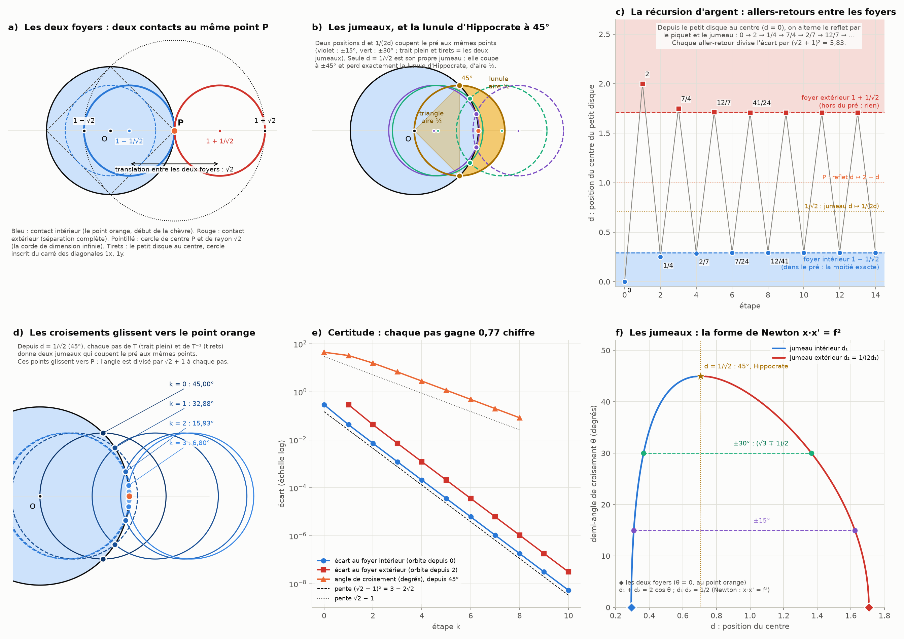
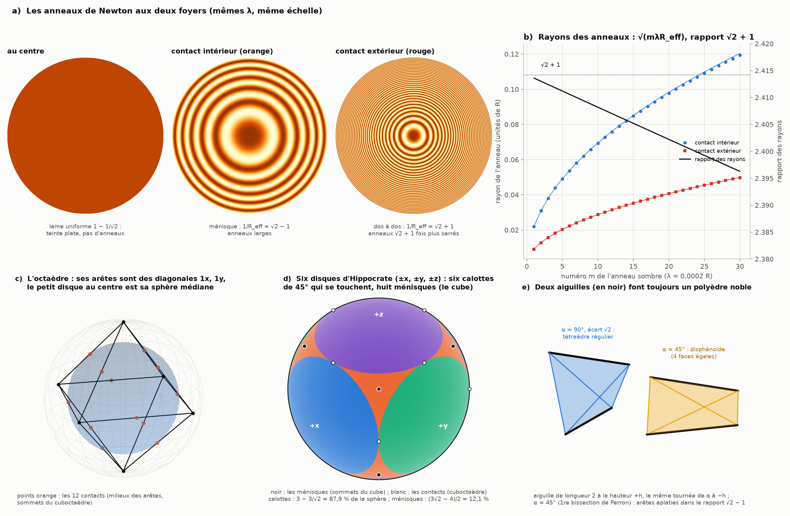

# Partie XVII : les deux foyers du contact, la récursion d'argent et les anneaux de Newton

> Ta réponse à la partie XVI.
> - Prends la position du cercle orange comme le problème de la chèvre, au contact des deux disques, là où la chèvre peut commencer à brouter la moitié de l'aire du grand cercle.
> - Les autres translations du petit disque deviennent deux foyers, aux deux contacts sur la circonférence.
> - Le but est d'obtenir une certitude absolue sur la position du centre des disques, de la translation et des chèvres, par une récursion de √2 − 1 et √2 + 1 sur la circonférence, là où ils se croisent.
> - Il faut aussi construire des polyèdres nobles par l'aiguille et les arbres de Perron, là où un ménisque ou un effet de bord se crée (le disque de Newton), à deux moments :
>   - avant la séparation complète, à la translation suivante vers la droite depuis le disque orange ;
>   - quand le petit disque est au centre du grand.
>
> Suite de la [partie XVI](menisque-projection.md).

Tout est recalculé par [`scripts/recursion_argent.py`](scripts/recursion_argent.py) (≈ 10 s). Les tableaux complets sont dans [`resultats/recursion_argent.md`](resultats/recursion_argent.md).

**Suite : [Partie XVIII — faire des ronds avec des carrés : le mod, les pixels et les longitudes](pixels-longitudes.md).**

## En bref

- **Le point orange, c'est là que la chèvre commence.**
  - Le petit disque de rayon 1/√2 a une aire égale à la moitié du pré.
  - Il broute donc exactement la moitié du pré tant qu'il ne touche pas le bord.
  - Il le touche au point orange P quand son centre est en d = 1 − 1/√2.
  - C'est aussi en P que la chèvre classique est attachée.
- **Deux foyers au même point.** Le contact intérieur (d = 1 − 1/√2) et le contact extérieur (d = 1 + 1/√2, la séparation complète) touchent tous deux le pré en P.
  - Multipliées par √2, ces deux positions valent exactement √2 − 1 et √2 + 1.
  - Leur écart, la translation entre les deux foyers, vaut √2 : c'est le diamètre du petit disque.
- **Les jumeaux.** Chaque position qui coupe le pré a un jumeau qui le coupe aux mêmes points : d et 1/(2d).
  - C'est la forme de Newton de l'équation des lentilles, x·x' = f², avec f = 1/√2.
  - La seule position qui est son propre jumeau est d = 1/√2. Elle coupe le pré à ±45°, sur tes diagonales 1x, 1y.
  - Ce qu'elle laisse hors du pré est exactement la lunule d'Hippocrate, d'aire 1/2, sans π.
- **La récursion d'argent.** On enchaîne deux gestes : prendre le jumeau, puis le reflet par le piquet. Cela donne T(d) = 2 − 1/(2d).
  - Ses deux points fixes sont exactement les deux foyers. L'un repousse avec le facteur (√2 + 1)², l'autre attire avec le facteur (√2 − 1)².
  - En partant du petit disque au centre, on obtient des positions exactes : 0, 1/4, 2/7, 7/24, 12/41, 41/140…
    - Ce sont des nombres de Pell, ceux des fractions qui approchent √2.
    - Elles convergent vers le point orange et gagnent 0,77 chiffre à chaque aller-retour.
  - Entre les deux foyers, les points de croisement glissent sur la circonférence vers P. Leur angle est divisé par √2 + 1 à chaque pas.
  - *Voir la [partie XXVII](carte-connexions.md), § 7 : ses rapports sont les aiguilles de Pell de la grille (partie XIV), qui visent 67,5° à une demi-case par pas.*
- **Les anneaux de Newton aux deux foyers.**
  - Au contact intérieur, la lame d'air est un ménisque de courbure √2 − 1. Au contact extérieur, sa courbure vaut √2 + 1.
  - Les anneaux du contact intérieur sont donc √2 + 1 fois plus larges.
  - Au centre, la lame est d'épaisseur constante : il n'y a pas d'anneaux.
- **Les chèvres, avec certitude.**
  - La corde de la chèvre attachée en P ne s'écrit pas avec √2 ∓ 1.
  - On peut pourtant l'enfermer de façon certaine, par arithmétique d'intervalles : r est compris entre 1,1587284730181215178282334 et 1,1587284730181215178282336.
- **Les polyèdres nobles.**
  - Au centre, le petit disque est la sphère médiane de l'octaèdre dont les arêtes sont les diagonales 1x, 1y.
  - À la position de 45°, six petits disques font six calottes qui se touchent. Elles laissent huit ménisques, aux sommets du cube.
  - Deux aiguilles font toujours un polyèdre noble. Croisées à 90° et séparées d'une hauteur √2, elles font le tétraèdre régulier.

---

## 1. Le point orange : là où commence la chèvre

**Le cadre.**
- Le pré a pour rayon 1 et pour centre O.
- Le point orange est P = (1, 0), sur la clôture.
- Le petit disque a pour rayon 1/√2, donc pour aire π/2 : la moitié du pré. Il glisse le long de l'axe OP.

**Le plateau** (partie XVI).
- Tant que le petit disque reste dans le pré, il broute exactement la moitié.
- La dernière position où c'est vrai est d₀ = 1 − 1/√2 = 0,2929, quand il touche la clôture en P. C'est le cercle orange de ta figure.
- Au-delà, il déborde, perd une partie de la moitié, et la chèvre doit allonger sa corde.
- Le point de contact est justement P, là où l'on attache la chèvre classique, de corde r = 1,1587.

| position | d exact | d | part du pré couverte |
|---|---|---|---|
| au centre | 0 | 0 | 1/2 |
| contact intérieur (le point orange) | 1 − 1/√2 = (√2 − 1)/√2 | 0,2929 | 1/2 |
| jumeau de 30°, intérieur | (√3 − 1)/2 | 0,3660 | 0,4834 |
| jumeau de lui-même (45°) | 1/√2 | 0,7071 | 1/2 − 1/(2π) = 0,3408 |
| jumeau de 30°, extérieur | (√3 + 1)/2 | 1,3660 | 0,0743 |
| centré sur le piquet P | 1 | 1 | 0,2120 |
| contact extérieur (séparation) | 1 + 1/√2 = (√2 + 1)/√2 | 1,7071 | 0 |

## 2. Les deux foyers et la translation

**Deux contacts au même point** (panneau a).
- Le contact intérieur, en d = 1 − 1/√2, et le contact extérieur, en d = 1 + 1/√2, touchent tous les deux la clôture en P.
- Vus depuis le piquet, les deux centres sont à 1/√2 de part et d'autre de P.
- Multipliées par √2, les deux positions valent √2 − 1 et √2 + 1 : ta récursion est déjà là.

**La translation est certaine.**
- De l'un à l'autre, (1 + 1/√2) − (1 − 1/√2) = √2. C'est le diamètre du petit disque : ta diagonale 1x, 1y.
- Le produit des deux positions vaut (1 − 1/√2)(1 + 1/√2) = 1/2, et leur rapport (√2 + 1)² = 3 + 2√2 = 5,83.

**Trois cercles en progression √2.**
- Aux deux contacts, le petit disque atteint l'axe en 1 − √2 et en 1 + √2.
- Les deux disques de contact sont donc inscrits dans le cercle de centre P et de rayon √2, la corde de la chèvre en dimension infinie (partie XVI).
- Les rayons 1/√2, 1 et √2 donnent les aires π/2, π et 2π : un cran de diaphragme entre chaque cercle, comme dans la partie I.

## 3. Les jumeaux et la lunule d'Hippocrate

**Où le petit cercle coupe le pré.** Il coupe la clôture aux angles ±θ, vus du centre, avec cos θ = (d² + 1/2)/(2d) (panneaux b et f).

**Deux positions pour les mêmes points.**
- Pour un même angle θ, deux positions conviennent, d₁ et d₂, avec d₁ + d₂ = 2 cos θ et d₁ · d₂ = 1/2.
- Ce sont des jumeaux : ils coupent la clôture exactement aux mêmes points. Par exemple, à 30°, d = (√3 − 1)/2 et (√3 + 1)/2.
- La relation d₁ · d₂ = f², avec f = 1/√2, est la forme de Newton de l'équation des lentilles, x·x' = f². La partie VIII l'avait reliée à l'inversion : deux positions conjuguées comme un objet et son image.
- Les deux foyers sont eux-mêmes jumeaux (θ = 0) : ils touchent la clôture au même point P.

**Le petit disque ne coupe jamais au-delà de 45°.**
- La seule position qui est son propre jumeau est d = 1/√2.
- Le petit cercle passe alors par O, et coupe la clôture en (1/√2, ±1/√2) : sur tes diagonales 1x, 1y.
- La corde commune est son diamètre, de longueur √2.

**La lunule d'Hippocrate.**
- La partie du petit disque hors du pré est un croissant entre deux cercles :
  - le petit a pour diamètre une corde qui sous-tend un angle droit sur le grand ;
  - c'est exactement la lunule d'Hippocrate de Chios (vers −440).
- Son aire vaut celle du triangle O-X₊-X₋ : exactement 1/2, sans π.
- La part broutée vaut donc π/2 − 1/2, soit 1/2 − 1/(2π) = 0,3408 du pré.
- La partie VI évoquait déjà la lunule d'Hippocrate, entre deux cercles de rapport √2. La voici exactement sur ta translation.

## 4. La récursion d'argent

**Deux gestes.**
- Le jumeau I : d ↦ 1/(2d). Il garde les mêmes points de croisement sur la circonférence.
- Le reflet R par le piquet P : d ↦ 2 − d.
- Les deux contacts sont les seules positions où les deux gestes donnent le même résultat : chacun envoie un contact sur l'autre.

**La récursion T = R ∘ I : d ↦ 2 − 1/(2d).** C'est une transformation de Möbius.
- Ses deux points fixes sont exactement les deux contacts, 1 − 1/√2 et 1 + 1/√2 : ce sont tes deux foyers.
- Au foyer intérieur, elle repousse avec le facteur (√2 + 1)² = 3 + 2√2.
- Au foyer extérieur, elle attire avec le facteur (√2 − 1)² = 3 − 2√2.

**Depuis le petit disque au centre** (panneau c). On alterne le reflet et le jumeau :
- 0 → 2 → 1/4 → 7/4 → 2/7 → 12/7 → 7/24 → 41/24 → 12/41 → 70/41 → 41/140 → …
- Les positions de gauche sont toutes dans le pré : elles broutent exactement la moitié. Celles de droite sont toutes hors du pré : elles ne broutent rien.
- Les deux suites se resserrent sur les deux foyers à la fois.
- Chaque aller-retour divise l'écart par (√2 + 1)² = 5,83, soit 0,77 chiffre gagné (panneau e).
- Les fractions sont faites de nombres de Pell :
  - les nombres de Pell eux-mêmes : 0, 1, 2, 5, 12, 29, 70, 169, 408… ;
  - leurs compagnons : 1, 3, 7, 17, 41, 99, 239, 577, 1393… ;
  - ce sont les mêmes nombres que dans les fractions 3/2, 7/5, 17/12, 41/29, 99/70… qui approchent √2.

**La certitude absolue.**
- Chaque position est une fraction exacte.
- La k-ième position se calcule même directement, sans passer par les précédentes : avec w = (d − foyer intérieur)/(d − foyer extérieur), chaque pas multiplie w par 3 − 2√2.

**Dans la zone de croisement** (panneau d).
- On part du jumeau de lui-même, d = 1/√2, et on applique T dans un sens et dans l'autre.
- À chaque pas, on obtient deux jumeaux (produit 1/2) qui coupent la clôture aux mêmes points.
- Ces points glissent vers P : 45°, puis 32,88°, 15,93°, 6,80°, 2,83°, 1,17°…
- Le rapport d'un angle au suivant tend vers √2 − 1 = 0,4142 : l'angle est divisé par √2 + 1 à chaque pas.
- **Pourquoi.** Près d'un contact, l'angle de croisement croît comme la racine carrée de la distance au contact. Or la distance est multipliée par (√2 − 1)² à chaque pas, donc l'angle par √2 − 1.

## 5. Les anneaux de Newton aux deux foyers

**La loi de la partie I.**
- Deux surfaces qui se touchent laissent entre elles une lame d'air d'épaisseur t ≈ ρ²/(2R_eff), avec 1/R_eff = 1/R₁ − κ₂.
- κ₂ est la courbure signée de la seconde surface. Elle est positive pour un contact intérieur et négative pour un contact extérieur.
- Les anneaux sombres sont aux rayons √(m λ R_eff).

**Avec le petit disque (1/√2) contre le pré (1),** en faisant tourner la figure autour de l'axe pour obtenir deux sphères :
- **au contact intérieur, le point orange :** 1/R_eff = √2 − 1. La lame est un ménisque et les anneaux sont larges (R_eff = √2 + 1) ;
- **au contact extérieur, juste avant la séparation :** 1/R_eff = √2 + 1. Les deux surfaces sont dos à dos et les anneaux sont serrés (R_eff = √2 − 1) ;
- **le rapport des rayons d'anneaux** vaut √((√2 + 1)/(√2 − 1)) = √2 + 1. Celui des aires entre deux anneaux vaut (√2 + 1)² = 5,83 ;
- **avec les flèches exactes** (pas seulement la parabole), le premier anneau est à 0,04907 au contact intérieur et à 0,02035 au contact extérieur, pour λ = 0,001. Le rapport vaut 2,411 et tend vers 2,4142 pour les premiers anneaux ;
- **un exemple concret :** pré de 100 mm de rayon, lumière du sodium. Le premier anneau sombre est à 0,377 mm au contact intérieur et à 0,156 mm au contact extérieur.

**Aux autres positions.**
- **Au centre**, la lame a une épaisseur constante 1 − 1/√2 : une teinte plate, sans anneaux, sans effet de bord.
- **Entre les deux foyers**, les surfaces se coupent : il n'y a plus de lame fermée, seulement des franges de coin près du cercle de croisement.
- L'effet de bord en anneaux n'existe donc qu'aux deux foyers : larges au point orange, serrés juste avant la séparation.

## 6. Les chèvres : positions exactes, corde certifiée

**Les chèvres de corde 1/√2.**
- Attachées aux positions intérieures de la récursion (0, 1/4, 2/7, 7/24, 12/41…), elles broutent toutes exactement la moitié.
- Leurs positions sont des fractions exactes.
- La dernière est au point orange : c'est là que la chèvre commence vraiment.

**La chèvre attachée en P.**
- Sa corde vaut r = 2 cos(α/2), où α vérifie sin α − α cos α = π/2.
- Je ne connais aucune écriture de r avec √2 ∓ 1, ni avec des racines. La formule exacte d'Ullisch passe par des intégrales complexes.
- On peut tout de même obtenir une certitude absolue, au sens d'une preuve :
  - la fonction g(α) = sin α − α cos α − π/2 est croissante ;
  - un calcul par intervalles prouve que g est négative à un point, puis positive à un autre très proche ;
  - la vraie valeur de α est donc entre les deux ;
  - et la corde vérifie 1,1587284730181215178282334 ≤ r ≤ 1,1587284730181215178282336.
- Ce n'est pas une approximation : c'est un encadrement démontré, où chaque arrondi est fait dans le sens sûr.

## 7. Les polyèdres nobles

Un polyèdre est **noble** quand toutes ses faces sont pareilles et tous ses sommets aussi : il est à la fois isoèdre et isogonal.
- On en connaît :
  - les cinq solides de Platon et les quatre de Kepler-Poinsot ;
  - les disphénoïdes : les tétraèdres aux quatre faces égales ;
  - les polyèdres en couronne.
- Le dual d'un polyèdre noble est noble.

**Quand le petit disque est au centre** (panneau c).
- En 2D, le petit cercle est le cercle inscrit du carré dont les côtés sont les quatre diagonales 1x, 1y, de sommets (±1, 0) et (0, ±1).
- En 3D, c'est la sphère médiane de l'octaèdre inscrit dans le pré. Les arêtes de l'octaèdre sont des diagonales 1x, 1y, de longueur √2.
  - La sphère de rayon 1/√2 touche les 12 arêtes en leurs milieux.
  - Ces 12 points de contact sont les sommets du cuboctaèdre.

**À la position de 45°, juste après le point orange** (panneau d).
- On place six petits disques en d = 1/√2, selon ±x, ±y et ±z.
- Chacun coupe la sphère du pré selon une calotte de 45°. Elles se touchent deux à deux, sans se chevaucher.
- Elles couvrent 3 − 3/√2 = 87,9 % de la sphère.
- Il reste huit ménisques triangulaires, centrés sur les sommets du cube :
  - ils occupent (3√2 − 4)/2 = 12,1 % de la sphère ;
  - leur rayon angulaire vaut arccos(1/√3) − 45° = 9,74°. On y retrouve l'angle de 54,74° de la partie VI, moins les 45° de ta diagonale.
- Les centres des calottes forment l'octaèdre, et les ménisques forment le cube : deux polyèdres nobles, duaux l'un de l'autre.
- En 2D, quatre disques suffisent : leurs arcs de 90° pavent exactement la circonférence et se touchent sur les diagonales 1x, 1y. Il n'y a pas de ménisque en 2D. Les ménisques naissent avec la troisième dimension.

**Deux aiguilles font toujours un polyèdre noble** (panneau e).
- On prend une aiguille de longueur 2 à la hauteur h, et la même tournée d'un angle α à la hauteur −h.
- Leurs quatre bouts forment un tétraèdre dont les arêtes opposées sont égales deux à deux. Ses quatre faces sont donc égales : c'est un disphénoïde, un polyèdre noble, quels que soient α et h.
- **Croisées à 90° et séparées d'une hauteur √2** (une diagonale 1x, 1y), elles donnent le tétraèdre régulier d'arête 2. C'est le simplexe de la grille décalée en 3D (parties XV et XVI).
- **Tournée de 45°,** c'est-à-dire de la première bissection de l'arbre de Perron sur l'angle droit, l'aiguille donne des arêtes latérales qui, aplaties, valent 2 sin 22,5° et 2 cos 22,5°. Leur rapport est tan 22,5° = √2 − 1.
- L'arbre de Perron n'intervient ici que par cet angle de bissection. Je n'ai pas trouvé de lien plus profond entre les arbres de Perron et les polyèdres nobles.

## 8. Le tri

**Exact (démontré ici ou classique) :**
- les deux foyers en (√2 ∓ 1)/√2, au même point P, et la translation √2 ;
- les jumeaux d₁ · d₂ = 1/2, sous la forme de Newton x·x' = f² ;
- la lunule d'Hippocrate à 45°, d'aire 1/2 ;
- la récursion T, dont les points fixes sont les foyers, de multiplicateurs (√2 ± 1)² ;
- ses orbites en fractions de Pell, et sa forme close ;
- les courbures √2 ∓ 1 des anneaux de Newton ;
- l'octaèdre et sa sphère médiane de rayon 1/√2 ;
- les six calottes, avec 3 − 3/√2 couvert et 8 ménisques ;
- les disphénoïdes de deux aiguilles.

**Calculé (numérique) :**
- le rapport des angles de croisement, qui tend vers √2 − 1 : vérifié sur 8 pas, et expliqué par la loi en racine carrée ;
- les rayons d'anneaux avec les flèches exactes.

**Certifié (preuve par le calcul) :** l'encadrement de la corde r à 24 décimales.

**Mes lectures (corrige-moi si je t'ai mal compris) :**
- **les deux foyers** : les deux contacts. Ils sont points fixes de la récursion, et ce sont aussi les deux points de croisement que partagent deux jumeaux ;
- **la récursion de √2 ∓ 1** : T, ma construction, qui assemble les croisements sur la circonférence et le reflet par le piquet. Elle n'est pas la seule possible ;
- **le disque de Newton** : les anneaux de Newton de la partie I ;
- **les polyèdres nobles par l'aiguille** : les constructions du § 7.

**Pas établi :** une écriture de la corde r elle-même avec √2 ∓ 1. La récursion donne des positions exactes, pas la corde de la chèvre. Pour r, la certitude vient de l'encadrement, pas d'une formule.

## Sources

**Géométrie**
- Wikipédia : [Lune of Hippocrates](https://en.wikipedia.org/wiki/Lune_of_Hippocrates) (la lunule dont l'aire égale celle d'un triangle) ; [Noble polyhedron](https://en.wikipedia.org/wiki/Noble_polyhedron) (définition, familles, dualité).
- U. Mikloweit, « Exploring Noble Polyhedra With the Program Stella4D », *Bridges 2020 Conference Proceedings*. [lien](https://archive.bridgesmathart.org/2020/bridges2020-257.html)
- Wikipédia : [Pell number](https://en.wikipedia.org/wiki/Pell_number) (nombres de Pell, approximations de √2, triplets presque isocèles) ; J. D. Cook, « Pell is to silver as Fibonacci is to gold » (2024). [lien](https://www.johndcook.com/blog/2024/09/01/pell-numbers/)

**Optique**
- E. Hecht, *Optics*, 5e éd. (2017) : anneaux de Newton ; et la [partie I](README.md), § 6.1.

**Calcul certifié**
- R. E. Moore, *Interval Analysis*, Prentice-Hall (1966) ; W. Tucker, *Validated Numerics*, Princeton UP (2011).
- La bibliothèque [mpmath](https://mpmath.org/) et son contexte `iv` (arithmétique d'intervalles), utilisée ici.

**La chèvre**
- I. Ullisch, « A Closed-Form Solution to the Geometric Goat Problem », *The Mathematical Intelligencer* 42(3), 12–16 (2020). [doi:10.1007/s00283-020-09966-0](https://doi.org/10.1007/s00283-020-09966-0)

**Les parties précédentes :** [I](README.md) (anneaux de Newton, plateau, crans de diaphragme), [V](aiguille-kakeya.md) (Kakeya, Perron), [VI](zone-confusion.md) (l'angle de 54,74°, la lunule), [VIII](foyer-fibonacci.md) (forme de Newton et inversion), [XV](grille-decalee.md) et [XVI](menisque-projection.md).
