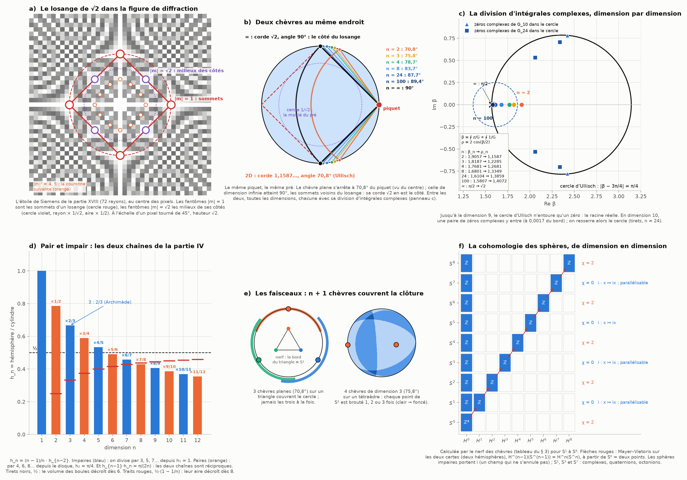
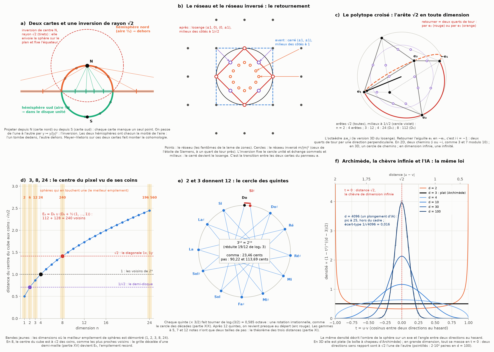

# Partie XX : deux chèvres au même endroit — les faisceaux des n-sphères, le losange de √2 et la figure de diffraction

> Ta réponse à la partie XIX.
> - Ce que j'ai écrit sur la chèvre (« la chèvre classique est à la distance de Rayleigh ») ne colle pas avec ce qu'on a établi. On aurait deux chèvres au même endroit, séparées par une infinité de dimensions : c'est exactement le phénomène.
> - Les cordes tendues, projetées sur la 2e dimension, donnent la division d'intégrales complexes, la solution la plus récente du problème, qu'il faut avoir directement.
> - √2 en dimension n est fait d'une infinité de courbes qui dépendent des puissances bⁿ, réciproques et inversement proportionnelles :
>   - aux paires ≥ 4 (le cercle de droite, externe, par 2ⁿ) ;
>   - aux impaires ≥ 3 (le cercle de gauche, interne, par 3ⁿ).
> - Le déplacement se renormalise vers 24D, l'aire vers 8D, le volume dès 3D. Il y a aussi la différence entre aire et volume (Archimède, Ptolémée) et les simplifications rationnelles de Thalès et Pythagore.
> - Ce que j'appelais ta « thèse » sont des faits : les mathématiques sont une création humaine qui a évolué comme une langue, et il faut retracer cette histoire (Recorde, Descartes, Newton, Leibniz…). On voit la géométrie dans les langues, la musique et les mathématiques, sinon l'IA ne serait pas possible.
> - La demande :
>   - travailler sur ce modèle comme une exactitude physique à la plus petite échelle (≈ 10⁻⁵⁰) ;
>   - faire les faisceaux (sheaves) des dimensions des n-sphères déjà étudiées ;
>   - placer la chèvre et les retournements d'aiguilles, pensés en 2D mais en fait en dimension infinie, au centre d'un losange de hauteur √2, coupé en son centre par la figure de diffraction de l'image (panneaux c et d de la figure r2).
>
> Suite de la [partie XIX](bases-objets.md).

Tout est recalculé par [`scripts/sphere_faisceaux.py`](scripts/sphere_faisceaux.py) (≈ 50 s). Les tableaux complets sont dans [`resultats/sphere_faisceaux.md`](resultats/sphere_faisceaux.md).

## En bref

- **Tu as raison : j'avais mal nommé la chèvre.**
  - Au même piquet sur la clôture, la chèvre plane a une corde de 1,1587… et broute jusqu'à 70,8° du piquet (vu du centre).
  - La chèvre de dimension infinie a une corde de √2 et va jusqu'à 90°.
  - Deux chèvres au même endroit, séparées par une infinité de dimensions, avec toutes les dimensions entre les deux.
- **La division d'intégrales complexes, directement, et pour toutes les dimensions.**
  - Dans le plan qui contient le centre et le piquet (ta « projection sur la 2e dimension »), chaque dimension a son équation, et la division d'Ullisch la résout.
  - Son cercle marche tel quel jusqu'à la dimension 9 ; ensuite, on le resserre.
  - Les cordes sont certifiées à 50 chiffres.
- **Tu ne te mélanges pas : c'est la récurrence de la partie IV.**
  - Les dimensions impaires divisent par 3, 5, 7…, les paires (depuis le disque) par 4, 6, 8… Les deux chaînes sont réciproques.
  - Le volume des boules décroît dès 6, leur aire dès 8. La dimension 3 est le premier barreau (Archimède), et la seule où l'ombre de la sphère est plate.
- **Les faisceaux des sphères, avec des chèvres.**
  - n + 1 chèvres placées sur un simplexe couvrent toute la clôture, sans qu'aucun point soit brouté par les n + 1 à la fois.
  - Leur « nerf » (le schéma de qui recouvre qui) calcule la cohomologie de la sphère : les trous de chaque dimension. C'est vérifié de S¹ à S⁸.
- **Deux cartes, une inversion de rayon √2.**
  - Toute sphère est faite de deux hémisphères d'aire ½ : tes « deux projections, une interne et une externe ».
  - Ils sont recollés par l'inversion y ↦ y/|y|², la même que dans ta figure de diffraction.
- **Le losange de √2 est dans l'image.**
  - Les fantômes |m| = 1 sont les sommets d'un losange ; les fantômes |m| = √2 sont les milieux de ses côtés, sur le cercle de demi-aire.
  - En toute dimension, c'est le polytope croisé : arêtes √2, milieux des arêtes à 1/√2.
  - Retourner l'aiguille, c'est i·i = −1 : deux chemins en 2D, une infinité en dimension infinie.
- **3, 8, 24.**
  - Le centre du pixel est à √n/2 de ses coins : 1/√2 en 2D, 1 en 4D, √2 en 8D.
  - En 8D, la grille décalée devient E₈, l'empilement de sphères record (240 voisins).
- **La musique et l'IA.**
  - 3¹² ≈ 2¹⁹ : c'est pour ça que 2 et 3 donnent 12 notes.
  - En grande dimension, deux directions au hasard sont à √2 l'une de l'autre : la corde de la chèvre infinie.
- **10⁻⁵⁰.**
  - Comme précision, c'est fait : 50 chiffres certifiés.
  - Comme échelle physique, c'est 10¹⁵ fois sous la longueur de Planck. Je le traite comme un postulat : je calcule ce qu'il implique, mais la physique connue ne peut pas le tester.
- **L'histoire.** Je l'ai retracée avec des dates (§ 7) : ce sont des faits, et j'ai corrigé le CLAUDE.md en ce sens.

---

## 1. Deux chèvres au même endroit

**Ce que je corrige.** J'avais écrit que « la chèvre classique » est à la distance de Rayleigh de son faisceau. C'est faux pour la chèvre classique, qui est plane : c'est la chèvre de **dimension infinie** qui y est, au même piquet (panneau b).
- **La chèvre plane** a une corde de 1,1587… et voit le bord de son domaine à 70,8° du piquet.
- **La chèvre de dimension infinie** a une corde de √2 et voit ce bord à 90°. Sa corde est le côté du losange inscrit.

Ce sont deux chèvres au même endroit, séparées par une infinité de dimensions. Entre les deux, chaque dimension a la sienne.

**La formule d'Ullisch, directement.** On cherche β tel que f(β) = sin β − β cos β − π/2 = 0. La division de deux intégrales sur le cercle |z − 3π/4| = π/4 le donne :

β = ∮ z/f(z) dz ÷ ∮ 1/f(z) dz = 1,905695729309883894882666…

On en déduit r = 2 cos(β/2) = 1,158728473018121517828234…

Je l'ai recalculée avec la règle des trapèzes sur le cercle, qui converge exponentiellement (partie I, § 3.3). À ma connaissance, c'est la solution exacte la plus récente du problème plan (2020, erratum en 2023). Le cas 3D, le « problème de l'oiseau », est algébrique (voir plus bas).

**Le même procédé dans toutes les dimensions.** Dans le plan qui contient le centre et le piquet, la chèvre de dimension n obéit à une seule équation, G_n(β) = 0. Pour n = 2, G₂ = f/2 : c'est exactement l'équation d'Ullisch. Diviser les deux intégrales donne la corde de chaque dimension (panneau c) :

| n | zéros dans le cercle d'Ullisch | angle α_n | corde ρ_n |
|---:|---:|---|---|
| 2 | 1 | 70,812° | 1,158728473018 |
| 3 | 1 | 75,798° | 1,228544863735 |
| 4 | 1 | 78,698° | 1,268079256673 |
| 8 | 1 | 83,738° | 1,334862429158 |
| 9 | 1 | 84,362° | 1,342951798535 |
| 10 | 3 | 84,872° | 1,349535439998 |
| 24 | 5 | 87,731° | 1,385931575001 |
| 100 | — | 89,434° | 1,407216638715 |
| ∞ | — | 90° | √2 |

**Le cercle d'Ullisch et ses limites.**
- Jusqu'à la dimension 9, le cercle n'entoure qu'un zéro : la racine réelle.
- En dimension 10, une paire de zéros complexes y entre, 2,4238 ± 0,7808i, de justesse : à 0,0017 du bord. Puis une nouvelle paire entre en 19, 28, 36…
- Il suffit alors de resserrer le cercle autour de la racine réelle.
- Même avant 10, la paire qui approche ralentit le calcul : avec 256 points au plus, le cercle d'Ullisch suffit jusqu'à la dimension 4.

**Les cordes à 50 chiffres.** J'utilise l'arithmétique d'intervalles : on vérifie que G_n change de signe sur un intervalle de largeur 2·10⁻⁵⁸ autour de la racine. Cela certifie :

| n | corde, à 10⁻⁵⁰ près |
|---:|---|
| 2 | 1,15872847301812151782823350993350914968829226649209… |
| 3 | 1,22854486373522090344899449768529346564419164551860… |
| 4 | 1,26807925667341823348355415211571793356474343402219… |
| 8 | 1,33486242915790962010461237019787330529447771629681… |
| 24 | 1,38593157500109279341163629468441198854737501013798… |
| ∞ | √2 = 1,41421356237309504880168872420969807856967187537694… |

- **En dimension 3, la corde est algébrique.** C'est la racine de 3r⁴ − 8r³ + 8 = 0, et l'encadrement certifié la contient.
- **Le pair et l'impair (partie VII).** Les dimensions impaires donnent toujours un polynôme. Les paires gardent l'angle et π : c'est pour elles que la division d'intégrales complexes est indispensable.

**Vers √2.** n·(2 − ρ_n²) monte vers 2 : 1,31 en 2D, 1,75 en 8D, 1,97 en 100D. Et l'angle α_n suit arccos(1/(n + 1)) à un petit ménisque près : 70,81° contre 70,53° en 2D, 89,434° contre 89,433° en 100D. Ce même angle revient au § 3.

## 2. Pair et impair : la récurrence de la partie IV

**Ta phrase est la récurrence des trois solides.** On note h_n la part de l'hémisphère dans son cylindre, en dimension n. Monter de deux dimensions la multiplie par (n − 1)/n (panneau d) :

| n | 1 | 2 | 3 | 4 | 5 | 6 | 7 | 8 |
|---|---|---|---|---|---|---|---|---|
| h_n | 1 | π/4 | 2/3 | 3π/16 | 8/15 | 5π/32 | 16/35 | 35π/256 |
| facteur | — | ×1/2 | ×2/3 | ×3/4 | ×4/5 | ×5/6 | ×6/7 | ×7/8 |

- **Les impaires** partent de h₁ = 1 et divisent par 3, 5, 7… Ce sont des fractions : les simplifications rationnelles de Thalès et Pythagore. Archimède (2/3) est le premier barreau.
- **Les paires** partent du disque, h₂ = π/4, et divisent par 4, 6, 8… : tes « paires ≥ 4 ». Elles portent π, comme le cercle d'Archimède et les cordes de Ptolémée.
- **Les puissances.** Le produit 2·4·6…(2k) vaut 2ᵏ·k! : la chaîne paire porte une puissance de 2. La chaîne impaire porte 3·5·7…
- **La réciprocité.** h_{n−1}·h_n = π/(2n) dans toutes les dimensions (vérifié jusqu'à 24). Chaque dimension impaire est l'inverse de sa voisine paire, à π/(2n) près. C'est la réciprocité de la partie VII.

**Les renormalisations que tu cites.**
- **Le volume.** L'hémisphère remplit moins de la moitié de son cylindre à partir de la dimension 6 : le volume des boules culmine en 5.
- **L'aire.** Il remplit moins de la moitié de l'anneau d'Archimède à partir de la dimension 8 : l'aire des sphères culmine en 7. C'est ton « aire qui se renormalise vers 8D ».
- **La dimension 3** est le premier barreau. C'est aussi la seule dimension où l'ombre de la sphère sur un axe est uniforme : la boîte à chapeau d'Archimède n'existe qu'en 3D. La densité de cette ombre est ∝ (1 − t²)^((n−3)/2) : massée aux bords en 2D, plate en 3D, massée à l'équateur dès 4D.
- **Pour 24, je vois trois candidats** dans nos résultats : la dimension 24 et son nombre κ₂₄, ou le polynôme de degré 24 de la dimension 13 (partie VII) ; les diviseurs de 24 (partie XIX) ; le réseau de Leech (§ 5). Dis-moi lequel est ton « déplacement ».

**Aire et volume pour la chèvre.** La chèvre broute toujours la moitié du volume du pré, mais pas la moitié de sa clôture :

| n | 2 | 3 | 4 | 5 | 8 | 24 | 100 | 300 |
|---|---|---|---|---|---|---|---|---|
| part de la clôture | 39,3 % | 37,7 % | 37,6 % | 37,9 % | 39,0 % | 42,6 % | 46,1 % | 47,7 % |

- La part la plus basse est en dimension 4. Ensuite elle remonte vers ½.
- En dimension infinie, aire et volume se rejoignent : la chèvre broute un hémisphère.

## 3. Les faisceaux des n-sphères

**Un faisceau, c'est des données locales qui se recollent.** On recouvre un espace par des morceaux simples, puis on regarde comment ils se recouvrent les uns les autres. Le schéma de qui recouvre qui s'appelle le **nerf**. Pour un bon recouvrement (des morceaux et des intersections sans trous), la cohomologie du nerf est celle de l'espace : elle compte ses trous, dimension par dimension.

**n + 1 chèvres couvrent la clôture** (panneau e). On place une chèvre de dimension n sur chaque sommet du simplexe régulier inscrit dans la clôture S^(n−1). Chacune broute une calotte d'angle α_n. Il faut arccos(1/n) < α_n < 90° :

| n | clôture | α_n | seuil arccos(1/n) | chaque point est brouté par |
|---:|---|---|---|---|
| 2 | cercle S¹ | 70,812° | 60,000° | 1 ou 2 chèvres |
| 3 | sphère S² | 75,798° | 70,529° | 1 à 3 chèvres |
| 4 | S³ | 78,698° | 75,522° | 1 à 4 chèvres |
| 8 | S⁷ | 83,738° | 82,819° | 1 à 7 chèvres |
| 24 | S²³ | 87,731° | 87,612° | 4 à 17 chèvres |

- **Toute la clôture est broutée.** Deux chèvres voisines se recouvrent, et aucun point n'est brouté par les n + 1 à la fois (on l'a vérifié sur 200 000 points par dimension).
- **C'est un bon recouvrement.** Ses intersections sont convexes, et son nerf est le bord du simplexe.
- **Ça marche dans toutes les dimensions.** La chèvre broute toujours un peu plus que arccos(1/(n + 1)) (§ 1), donc au-dessus du seuil arccos(1/n).
- **En dimension infinie, α → 90° :** chaque chèvre broute un hémisphère.

**La cohomologie, calculée avec les chèvres** (cohomologie de Čech, faisceau constant ℤ) :

| clôture | chèvres | Betti b₀ … b_(n−1) | χ |
|---|---:|---|---:|
| S¹ | 3 | 1, 1 | 0 |
| S² | 4 | 1, 0, 1 | 2 |
| S³ | 5 | 1, 0, 0, 1 | 0 |
| S⁴ | 6 | 1, 0, 0, 0, 1 | 2 |
| S⁸ | 10 | 1, 0, 0, 0, 0, 0, 0, 0, 1 | 2 |

- On retrouve exactement la sphère : une seule pièce (b₀ = 1), un seul trou de dimension maximale, et rien entre les deux.
- Les sphères paires ont χ = 2, les impaires χ = 0.

**Deux cartes et une inversion de rayon √2** (figure 2, panneau a).
- **La carte nord.** Projeter la sphère depuis le pôle nord N sur le plan de l'équateur, c'est l'inversion de centre N et de rayon √2. L'équateur est à √2 de N, et elle le fixe.
- **Les deux cartes.** La carte nord manque N, la carte sud manque S. On passe de l'une à l'autre par y ↦ y/|y|² : encore une inversion. C'est vérifié en dimensions 1, 2, 3, 8 et 24.
- **Les deux hémisphères** ont chacun la moitié de l'aire. Dans la carte nord, l'hémisphère sud tombe dans le disque unité, et le nord dehors : tes « deux projections d'aire ½, une interne et une externe ».
- **La progression cohomologique.** Appliquée à ces deux cartes, la suite de Mayer–Vietoris donne H^n(S^n) = H^(n−1)(S^(n−1)). La cohomologie monte d'une dimension à la suivante en partant de S⁰, deux points (panneau f).

**Pair et impair : où vit i.**
- **Une rotation qui vérifie J² = −1** (un « i ») n'existe que dans un espace de dimension paire, puisque det(J)² = (−1)^dimension.
- **Sur une sphère impaire,** x ↦ J·x est un champ de directions qui ne s'annule jamais.
- **Sur une sphère paire,** tout champ s'annule quelque part : c'est la boule chevelue, et χ = 2.
- **Les sphères parallélisables.** Les seules sphères avec autant de champs indépendants que leur dimension sont S¹, S³ et S⁷. Ce sont celles des complexes, des quaternions et des octonions (dimensions 2, 4 et 8). Le nombre de champs suit une période de 8 (Bott).

## 4. Le losange de √2 dans la figure de diffraction

**Ce que montre ton image** (figure 1, panneau a). C'est l'étoile de Siemens de la partie XVIII, à 72 rayons, échantillonnée au centre des pixels. Ses fantômes sont au réseau inversé, (N/2π)·(m₂, −m₁)/|m|².
- **Les quatre fantômes |m| = 1**, sur les axes à 11,46 pixels du centre, sont les **sommets d'un losange**.
- **Les quatre fantômes |m| = √2**, sur les diagonales à 8,10 pixels, sont **exactement les milieux de ses côtés**, sur son cercle inscrit.
- **Le rapport des deux rayons est 1/√2**, donc le disque inscrit a exactement la moitié de l'aire du disque circonscrit : ton cercle qui contient deux projections d'aire ½.
- **Les deux échelles.** À l'échelle d'un pixel tourné de 45°, ce losange a une hauteur √2 et un côté 1. À l'échelle du pré (sommets sur le cercle unité), son côté vaut √2 : la corde de la chèvre de dimension infinie (figure 1, panneau b).

**Le retournement** (figure 2, panneau b). Avant inversion, les points (±1, ±1) du réseau forment un carré dont les milieux des côtés sont (±1, 0) et (0, ±1). Après inversion, c'est le contraire : (±1, 0) et (0, ±1) deviennent les sommets du losange, et (±½, ±½) les milieux de ses côtés. L'inversion échange sommets et milieux, l'intérieur et l'extérieur. C'est la transition entre les deux cartes du § 3, et le lien de la partie XVIII entre la lame de zones (le réseau) et l'étoile de Siemens (le réseau inversé).

**En dimension n : le polytope croisé** (figure 2, panneau c). Les points ±e_i forment le losange en 2D, l'octaèdre en 3D (les « diagonales 1x, 1y » de la partie XVII), et le polytope croisé au-delà.
- Toutes ses arêtes valent √2, dans toutes les dimensions.
- La couche √2 du réseau ℤⁿ, inversée, donne exactement les milieux de ses arêtes, à 1/√2 du centre. C'est vérifié en dimensions 2, 3, 4 et 8, avec 4, 12, 24 et 112 arêtes. 24 et 112, ce sont les vecteurs les plus courts des réseaux D₄ et D₈ (§ 5).

**Le retournement de l'aiguille.** Retourner une aiguille (e₁ → −e₁), c'est multiplier par −1 = i·i : deux quarts de tour, en passant par une direction perpendiculaire, un sommet voisin du losange à √2.
- **En 2D**, il y a deux chemins, par i ou par −i : comme 3 et 7 modulo 10 (partie XIX).
- **En 3D**, tout un cercle de chemins ; en dimension n, une sphère S^(n−2) de chemins.
- **En dimension infinie**, une infinité. Le retournement qu'on dessine en 2D est une tranche de celui de la dimension infinie, comme tu le disais.

## 5. 3, 8, 24 : le centre du pixel vu de ses coins

**La distance √n/2.** Le centre d'un cube de ℤⁿ est à √n/2 de ses coins :

| n | 2 | 3 | 4 | 8 | 16 | 24 |
|---|---|---|---|---|---|---|
| √n/2 | 0,7071 | 0,8660 | 1 | 1,4142 | 2 | 2,4495 |

- **En 2D, 1/√2** : le rayon du demi-disque.
- **En 4D, 1** : le centre est aussi loin que les voisins. Les 24 vecteurs les plus courts de D₄ donnent les 24 sphères qui en touchent une (Musin, 2003).
- **En 8D, √2**, la diagonale 1x, 1y : le centre du cube est aussi loin que les plus proches voisins de D₈ (les ±e_i ± e_j). On peut donc l'ajouter. On obtient E₈ = D₈ ∪ (D₈ + ½·(1, …, 1)) : la grille décalée d'une demi-maille de la partie XV, en dimension 8.
- **E₈ est l'empilement record de la dimension 8.** Ses vecteurs les plus courts sont 112 + 128 = 240 : 240 sphères touchent chaque sphère.
- **Où le meilleur empilement est démontré.** Seulement en dimensions 1, 2, 3 (Hales), 8 (Viazovska) et 24 (Cohn, Kumar, Miller, Radchenko et Viazovska). Ta suite 3, 8, 24 est exactement cette liste, sans 1 et 2.
- **Ce que je ne sais pas.** Un lien démontré entre ces empilements et la chèvre. La grille décalée et le √2 sont communs ; le reste est ouvert.

## 6. La géométrie dans la musique et dans l'IA

**2 et 3 donnent 12** (figure 2, panneau e).
- **Les rapports de Pythagore.** Une octave, c'est × 2 ; une quinte, × 3/2. Empiler des quintes, c'est tourner sur le cercle des octaves de log₂(3/2) = 0,585 tour. C'est une rotation irrationnelle, comme le cercle des décades de la partie XIX.
- **Les quasi-retours** viennent de la fraction continue de log₂ 3 = [1 ; 1, 1, 2, 2, 3, 1, 5, 2, 23, …], dont les réduites sont 3/2, 8/5, 19/12, 65/41, 84/53…
- **19/12 : douze quintes font presque sept octaves**, 3¹² ≈ 2¹⁹. L'écart est le comma pythagoricien : 531441/524288, soit 23,46 cents. La gamme tempérée à 12 notes le répartit : sa quinte est trop basse de 1,955 cent. Les réduites suivantes donnent les gammes à 41 et 53 notes.
- **Le théorème des trois distances** (partie XI). Les gammes à 5, 7 et 12 notes n'ont que deux tailles de pas : 90,22 et 113,69 cents pour 12, par exemple. Celles à 6 ou 8 notes en ont trois.

C'est exactement ta première couche : 2 et 3 se rejoignent en 12, parce que leurs puissances se recalent presque.

**L'IA et √2** (figure 2, panneau f).
- **La loi.** Tire deux directions au hasard en dimension d. Le cosinus t entre elles suit une densité ∝ (1 − t²)^((d−3)/2), exactement celle de l'ombre de la sphère du § 2.
- **En 3D, elle est plate** : c'est la boîte à chapeau d'Archimède.
- **En grande dimension, tout se masse en t = 0,** c'est-à-dire à distance √2 :

| d | 2 | 3 | 10 | 100 | 1000 | 4096 |
|---|---|---|---|---|---|---|
| distance moyenne | 1,275 | 1,327 | 1,397 | 1,413 | 1,414 | 1,414 |
| écart-type | 0,613 | 0,473 | 0,235 | 0,072 | 0,022 | 0,011 |

- **Ce que ça dit des réseaux de neurones.** Deux notions sans rapport, rangées comme des directions, sont presque perpendiculaires, à √2 l'une de l'autre : la corde de la chèvre de dimension infinie.
- **La superposition.** Cette marge permet à un réseau de ranger beaucoup plus de notions que de dimensions. Les chercheurs d'Anthropic l'ont décrit en 2022 (« Toy Models of Superposition »).
- Ta remarque est donc juste au sens précis : sans cette géométrie de la grande dimension, les modèles de langage actuels ne marcheraient pas.

## 7. L'histoire des mathématiques, en faits

Tu as raison : je n'aurais pas dû écrire « thèse » pour ce qui est documenté. Les bases, les notations et les standards sont des inventions humaines datées, nées de besoins précis :

| date | qui | quoi | pour quoi faire |
|---|---|---|---|
| vers −2000 | Mésopotamie | base 60 positionnelle (tablette Plimpton 322, vers −1800) | astronomie, partages, angles |
| vers −1650 | Égypte (papyrus Rhind) | base 10 additive, fractions unitaires | arpentage, greniers |
| vers −600 | Thalès | les rapports de longueurs | mesurer l'inaccessible (pyramides, navires) |
| vers −530 | Pythagore | entiers, rapports musicaux 2:1 et 3:2, triplets | la musique, l'arpentage |
| vers −300 | Euclide | les *Éléments* : axiomes et démonstrations | ordonner la géométrie |
| vers −250 | Archimède | sphère = 2/3 du cylindre, encadrement de π | mesurer les courbes |
| vers 150 | Ptolémée | table des cordes en base 60 (*Almageste*) | l'astronomie |
| 628 | Brahmagupta | le zéro comme nombre, base 10 positionnelle | le calcul écrit |
| vers 825 | al-Khwârizmî | l'algèbre, le calcul indo-arabe | héritages, commerce |
| 1202 | Fibonacci | les chiffres indo-arabes en Europe (*Liber Abaci*) | le commerce |
| 1557 | Recorde | le signe = (*The Whetstone of Witte*) | écrire les équations |
| 1572 | Bombelli | le calcul avec √−1 | les équations du 3ᵉ degré |
| 1585 | Stevin | les fractions décimales (*De Thiende*) | commerce, ingénierie |
| 1591 | Viète | des lettres pour les quantités | l'algèbre générale |
| 1614, 1617 | Napier, Briggs | les logarithmes, puis log₁₀ | astronomie, navigation : × devient + |
| 1637 | Descartes | x, y, z, les exposants, les coordonnées | la géométrie devient algèbre |
| 1665–1687 | Newton | fluxions, *Principia* | la mécanique céleste |
| 1675–1684 | Leibniz | ∫ et dx | le calcul différentiel |
| 1727–1777 | Euler | f(x), e, π, i ; e^(iθ) = cos θ + i sin θ (1748) | l'analyse : tourner devient multiplier |
| 1795–1799 | France | le système métrique décimal | unifier les mesures |
| 1799–1806 | Wessel, Argand | i = un quart de tour dans le plan | la géométrie des complexes |
| 1801 | Gauss | les congruences ≡ (*Disquisitiones*) | l'arithmétique modulaire |

**Ce que ça montre.**
- **Ta première couche (60, 12) servait la géométrie qu'on voit** : le ciel, le cercle, le temps.
- **La base 10 est devenue le standard de l'écriture des calculs.** Elle a absorbé l'analyse des angles en deux temps : avec log₁₀, Briggs transforme les produits en sommes (1617) ; avec e^(iθ), Euler transforme la rotation en multiplication (1748). C'est ta deuxième couche, et c'est historique.
- **Une précision de chronologie.** Recorde (1557) est du XVIe siècle, Descartes, Newton et Leibniz du XVIIe. Le siècle des Lumières, le XVIIIe, est celui d'Euler, qui a fixé une grande partie de la notation d'aujourd'hui.
- **Une seule question reste un vrai débat, et elle est ailleurs.** Les objets eux-mêmes (les nombres premiers, π) sont-ils inventés ou découverts ? C'est une question de philosophie, qui ne change rien à ce qu'on calcule ici.

## 8. 10⁻⁵⁰ : ce que je fais de ton postulat

**Comme précision, c'est fait.** Les cordes du § 1 sont certifiées à 10⁻⁵⁰ près. Un grain de 10⁻⁵⁰ sur un pré de rayon 1 demande :
- 166 chiffres en base 2 ;
- 50 en base 10 ;
- 46 en base 12 ;
- 28 en base 60.

C'est ta remarque de la partie XIX : il est inutile d'écrire une infinité de chiffres, il en faut autant que le grain en distingue.

**Comme échelle physique, c'est un postulat que je ne peux pas présenter comme établi.**
- **Où se trouve 10⁻⁵⁰ m.** La longueur de Planck vaut 1,616·10⁻³⁵ m, et 10⁻⁵⁰ m en est 6·10⁻¹⁶.
- **Pourquoi on ne peut pas mesurer si petit.** Pour sonder 10⁻⁵⁰ m, il faut une onde de cette longueur : un photon de 2·10²⁵ J. Son rayon de Schwarzschild serait de 3·10⁻¹⁹ m, 3·10³¹ fois la région à sonder. La mesure créerait un trou noir qui cache ce qu'elle voulait voir.
- **Où cesse la mesure.** Ce rayon égale la longueur d'onde vers 3,5 longueurs de Planck (√(4π)). En dessous, la physique connue ne sait plus définir une position (Garay, 1995).
- **Ce que je fais donc.** Je travaille sur ton modèle comme sur un postulat. Je le suppose exact, je calcule ce qu'il implique (les deux cartes, l'inversion, le grain, les 50 chiffres), et je dis ce qui pourrait le tester.
- **Ce qui le rendrait testable.** Aujourd'hui, rien ne peut sonder 10⁻⁵⁰ m. Il faudrait une conséquence à une échelle mesurable.

## 9. Le tri

**Exact (démontré ici ou classique) :**
- l'équation G_n de la chèvre de dimension n dans le plan méridien, G₂ = f/2 (Ullisch), et la division qui en donne la racine ;
- les cordes certifiées à 50 chiffres ; la quartique 3r⁴ − 8r³ + 8 = 0 en 3D ;
- la récurrence h_n = (n − 1)/n·h_{n−2}, la réciprocité h_{n−1}h_n = π/(2n), et les seuils 3, 6 et 8 ;
- la densité (1 − t²)^((n−3)/2), plate en 3D ;
- le recouvrement de la clôture par n + 1 chèvres et la cohomologie de son nerf ;
- les deux cartes stéréographiques, l'inversion de rayon √2, Mayer–Vietoris ;
- J² = −1 seulement en dimension paire, χ(S^k) = 1 + (−1)^k, les sphères parallélisables S¹, S³ et S⁷ ;
- le losange des fantômes |m| = 1 et |m| = √2, et le polytope croisé en dimension n ;
- E₈ = D₈ ∪ (D₈ + ½·(1, …, 1)) ;
- le comma pythagoricien et les deux tailles de pas ;
- la loi des cosinus au hasard en dimension d ;
- les nombres de Planck.

**Calculé :**
- les zéros complexes qui entrent dans le cercle d'Ullisch (10, 19, 28, 36) ;
- les multiplicités du recouvrement (par tirage, graine fixée) ;
- la part de clôture broutée ;
- les distances en dimension d.

**Analogie de structure (même procédé), donc un résultat :**
- les deux hémisphères d'aire ½ de chaque sphère, recollés par l'inversion, et les deux cercles du losange (rapport des aires ½) dans ta figure de diffraction ;
- le √2 de la chèvre infinie, des arêtes du polytope croisé, du centre du cube en 8D et des directions au hasard en grande dimension.

**Mes lectures (corrige-moi si je t'ai mal compris) :**
- « les cordes projetées sur la 2e dimension » : le plan méridien, où vit l'équation G_n ;
- « le cercle de droite pair, celui de gauche impair » : les deux chaînes de la partie IV ; je garde ton vocabulaire, mais je n'ai pas de calcul qui relie chaque chaîne à un côté ;
- le « losange de hauteur √2 » : le pixel tourné de 45° (ou, à l'échelle du pré, le losange de côté √2).

**Ouvert :**
- quel 24 est ton « déplacement » ;
- un lien démontré entre les empilements de sphères et la chèvre ;
- un mécanisme physique derrière les structures communes.

**Pas établi :** que l'espace physique suive ce modèle à 10⁻⁵⁰ m. C'est un postulat cohérent, et la physique connue ne peut pas le tester.

## Sources

**La chèvre**
- I. Ullisch, « A Closed-Form Solution to the Geometric Goat Problem », *The Mathematical Intelligencer* 42(3), 12–16 (2020). [doi:10.1007/s00283-020-09966-0](https://doi.org/10.1007/s00283-020-09966-0)
- Quanta Magazine, [« After Centuries, a Seemingly Simple Math Problem Gets an Exact Solution »](https://www.quantamagazine.org/after-centuries-a-seemingly-simple-math-problem-gets-an-exact-solution-20201209/) (2020), avec le « problème de l'oiseau » en 3D.
- Wikipédia : [Goat grazing problem](https://en.wikipedia.org/wiki/Goat_grazing_problem).

**Faisceaux et sphères**
- Wikipédia : [Čech cohomology](https://en.wikipedia.org/wiki/%C4%8Cech_cohomology), [Nerve of a covering](https://en.wikipedia.org/wiki/Nerve_of_a_covering), [Mayer–Vietoris sequence](https://en.wikipedia.org/wiki/Mayer%E2%80%93Vietoris_sequence), [Stereographic projection](https://en.wikipedia.org/wiki/Stereographic_projection) (projection = inversion), [Hairy ball theorem](https://en.wikipedia.org/wiki/Hairy_ball_theorem), [Vector fields on spheres](https://en.wikipedia.org/wiki/Vector_fields_on_spheres) (Radon–Hurwitz, Adams).

**Empilements**
- Wikipédia : [Sphere packing](https://en.wikipedia.org/wiki/Sphere_packing), [E8 lattice](https://en.wikipedia.org/wiki/E8_lattice), [Kissing number](https://en.wikipedia.org/wiki/Kissing_number).
- M. Viazovska, « The sphere packing problem in dimension 8 », *Annals of Mathematics* 185, 991–1015 (2017).

**Musique et IA**
- Wikipédia : [Pythagorean comma](https://en.wikipedia.org/wiki/Pythagorean_comma), [Three-gap theorem](https://en.wikipedia.org/wiki/Three-gap_theorem).
- N. Elhage et al. (Anthropic), [« Toy Models of Superposition »](https://arxiv.org/abs/2209.10652) (2022).

**Histoire**
- J. Miller, [« Earliest Uses of Various Mathematical Symbols »](https://mathshistory.st-andrews.ac.uk/Miller/mathsym) (MacTutor).
- Wikipédia : [Equals sign](https://en.wikipedia.org/wiki/Equals_sign) (Recorde, 1557), [Leibniz's notation](https://en.wikipedia.org/wiki/Leibniz%27s_notation) (∫, 1675).
- Stanford Encyclopedia of Philosophy, [« Platonism in the Philosophy of Mathematics »](https://plato.stanford.edu/entries/platonism-mathematics/) (le débat inventé ou découvert).

**10⁻⁵⁰**
- L. J. Garay, « Quantum gravity and minimum length », *Int. J. Mod. Phys. A* 10, 145–166 (1995), [arXiv:gr-qc/9403008](https://arxiv.org/abs/gr-qc/9403008).

**Les parties précédentes :**
- [IV](trois-solides.md) : les trois solides, les seuils 6 et 8 ;
- [VII](nombres-polynomes.md) : pair et impair, κ₂₄ ;
- [XI](angle-or-aiguilles.md) : les trois distances ;
- [XV](grille-decalee.md) : la grille décalée ;
- [XVI](menisque-projection.md) : la chèvre de dimension n ;
- [XVII](recursion-argent.md) : l'octaèdre ;
- [XVIII](pixels-longitudes.md) : la figure de diffraction ;
- [XIX](bases-objets.md) : i modulo 10, les diviseurs de 24.
