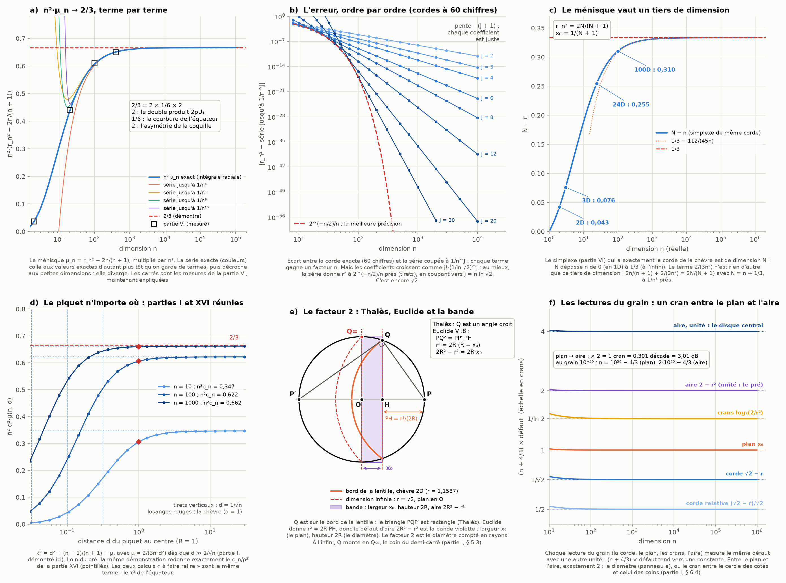

# Partie XXIV : un tiers de dimension — le terme 2/(3n²) démontré, et le facteur 2 de Thalès

> Ta demande : travailler les deux points restés ouverts à la fin de la partie XXIII. Le premier : « le terme en 2/(3n²) est esquissé dans la partie I, pas démontré en entier ». Le second : « le grain de ton modèle peut se lire comme une longueur (le plan : 10⁵⁰ dimensions) ou comme une aire (2 − r² : 2·10⁵⁰ dimensions) ; les deux lectures sont exactes et diffèrent d'un facteur 2 ». Avec des points boni pour les connexions avec les calculs et les démonstrations des autres chapitres.
>
> Suite de la [partie XXIII](lentilles-boules-grain.md).

Tout est recalculé par [`scripts/tiers_dimension.py`](scripts/tiers_dimension.py) (≈ 25 s). Les tableaux complets sont dans [`resultats/tiers_dimension.md`](resultats/tiers_dimension.md).

## En bref

- **Le terme 2/(3n²) est démontré, avec une borne explicite.**
  - Pour tout n ≥ 100, |r_n² − 2n/(n + 1) − 2/(3n²)| < 1 800/n³. La vérification est exacte, faite par ordinateur sur des polynômes à coefficients rationnels.
  - La démonstration tient en quatre pas : la coquille, l'équateur, les moments exacts, l'inversion.
  - Elle donne aussi tous les termes suivants, à coefficients rationnels : r_n² = 2n/(n + 1) + 2/(3n²) − 98/(15n³) + 5966/(105n⁴) − … Ils sont contrôlés sur des cordes calculées à 60 chiffres.
- **D'où vient le 2/3 : 2 × 1/6 × 2.**
  - Le premier 2 vient du double produit de |X − P|² = ρ² + 1 − 2ρU₁.
  - Le 1/6 vient de la courbure de la loi de l'équateur.
  - Le dernier 2 vient de l'asymétrie de la loi de la coquille.
  - Les deux concentrations de la partie I (§ 5.2 et 5.3) se multiplient.
- **Ce que vaut le 2/(3n²) : un tiers de dimension.**
  - La chèvre de dimension n a exactement la corde du simplexe d'une dimension N un peu plus grande.
  - N − n croît de 0 (en 1D) à 1/3 (à l'infini).
  - Le 2/(3n²) n'est rien d'autre que ce tiers de dimension.
- **La série diverge, et c'est encore √2.**
  - Ses coefficients croissent comme j!·(1/ln √2)^j.
  - Au mieux, elle donne la corde à 2^(−n/2)/n près, en s'arrêtant vers le terme n·ln √2.
  - Ça fait 5 chiffres en 24D, 17 en 100D et 1,5·10⁴⁹ en dimension 10⁵⁰.
- **Le facteur 2 entre le plan et l'aire, c'est Thalès et Euclide.**
  - Le triangle piquet–bord de la lentille–antipode est rectangle (Thalès). Euclide donne alors r² = 2R·(R − x₀), donc 2R² − r² = 2R·x₀.
  - Le défaut d'aire est la surface d'une bande de largeur x₀ (le plan) et de hauteur 2R (le diamètre). Le facteur 2 est le diamètre compté en rayons.
  - C'est aussi exactement un cran de diaphragme : le cran entre le cercle des côtés et le cercle des coins (partie I, § 6.4).
  - Les deux lectures sont vraies en même temps. Au grain 10⁻⁵⁰, elles donnent n = 10⁵⁰ − 4/3 et n = 2·10⁵⁰ − 4/3. Le 2 multiplie ; le 4/3 décale (1 pour le simplexe, 1/3 pour le ménisque), et il est le même dans les deux lectures.
- **Points boni.**
  - La loi k² ≈ δ² + (n − 1)/(n + 1) de la partie I est démontrée. Le c_n/ρ² de la partie XVI sort du même calcul : les deux « à faire relire » étaient le même terme.
  - μ ≈ 2δ (parties VI et XVI) reçoit sa correction, 2δ/μ ≈ 1 + 5μ/4.
  - La projection (n − 1)/(n + 1) se retrouve par un troisième calcul.
  - Le reste exponentiel de la zone centrale vaut (√2 − 1)ⁿ, la pente tan 22,5° des parties XVII et XVIII.
  - En dimension 10⁵⁰, les décimales de la corde s'écrivent en blocs de 50 chiffres, un bloc par coefficient.



---

## 1. La démonstration en quatre pas

**Le cadre (partie I, § 5.3–5.4).**
- On pose R = 1 et le piquet P sur la clôture. Un point X tiré au hasard dans le pré s'écrit X = ρU : ρ est sa distance au centre, U une direction uniforme sur la sphère.
- La corde r est la distance médiane : la fraction broutée P(|X − P|² ≤ m) vaut ½ pour m = r².
- Or |X − P|² = ρ² + 1 − 2ρU₁. La condition s'écrit donc U₁ ≥ τ(ρ) = (ρ² + 1 − m)/(2ρ).
- **τ est le plan de la lentille vu depuis chaque coquille.** Sur la coquille extérieure (ρ = 1), τ = 1 − m/2 = x₀, exactement le plan de la partie XXIII. Le facteur 2 du § 5 est déjà là.

**Pas 1 : la coquille est exactement exponentielle.**
- ρⁿ est uniforme sur [0, 1] (partie I). Donc E = −n ln ρ vérifie P(E > t) = P(ρⁿ < e^(−t)) = e^(−t) : c'est **exactement** la loi exponentielle.
- La partie I utilisait n(1 − ρ), qui n'est exponentielle qu'à la limite. Ce changement de variable supprime une approximation.
- Les moments sont exacts : E[ρ^a] = n/(n + a).

**Pas 2 : l'équateur se développe en série.**
- U₁ a la densité w_n·(1 − u²)^k, avec k = (n − 3)/2. La constante w_n est un rapport d'intégrales de Wallis (parties IV, VII et XX).
- La condition de médiane s'écrit E[∫₀^τ (1 − u²)^k du] = 0.
- On développe : ∫₀^τ (1 − u²)^k du = τ − kτ³/3 + R, avec |R| ≤ C(k, 2)·|τ|⁵/5 (reste de Lagrange, valable pour k ≥ 2).
- **La constante de Wallis w_n disparaît**, parce que la condition est « = 0 ». C'est pour ça que tous les coefficients sont rationnels, même dans les dimensions paires où la corde est transcendante (partie I, § 5.5).

**Pas 3 : les moments exacts, et la zone centrale.**
- Avec E[ρ^a] = n/(n + a), chaque E[τ^p] est une fraction rationnelle exacte de n et de m.
- Une seule région échappe au développement : ρ < √m − 1, où τ < −1. Elle est toujours broutée, puisque tout y est à moins de ρ + 1 < √m du piquet. Elle pèse (√m − 1)ⁿ ≈ (√2 − 1)ⁿ, soit 2,8·10⁻⁵ en 10D et 10⁻³⁹ en 100D.
- √2 − 1 = tan 22,5°, la pente d'argent des parties XVII et XVIII.

**Pas 4 : l'inversion, avec une borne.**
- Pour ρ ≥ √m − 1 ≥ 0,4, on a |τ| ≤ (E + a)/(0,4·n), en écrivant m = 2 − 2a/n avec a ≤ 1,1.
- Donc |R| ≤ (n²/8)·(1/5)·(2,5/n)⁵·E[(E + 1,1)⁵] = 879/n³.
- La fraction broutée croît avec m. Il suffit donc de montrer que la condition change de signe entre m± = 2n/(n + 1) + 2/(3n²) ± 1 800/n³.
- Le script le vérifie exactement : avec n = 100 + t, les deux inégalités deviennent des polynômes en t dont tous les coefficients sont positifs.
- **Conclusion : |r_n² − 2n/(n + 1) − 2/(3n²)| < 1 800/n³ pour tout n ≥ 100.**
  - La constante est grossière : la vraie vaut 98/15 = 6,53. Mais une constante, même large, suffit pour une démonstration.
  - En dessous de 100, elle reste vraie sur les cordes calculées, avec une marge d'au moins 300.

**Ordre 1 : la chèvre linéarisée est le simplexe.**
- Au premier ordre, la condition devient E[τ] = ½(E[ρ] + (1 − m)E[ρ⁻¹]) = 0, ce qui donne exactement m = 2n/(n + 1). C'est l'arête² du simplexe de la partie VI.
- Autrement dit, la projection g² = (n − 1)/(n + 1) de la partie XVI vaut E[ρ]/E[ρ⁻¹]. C'est un troisième calcul du même nombre, après Archimède et Parseval.
- Et ce rapport est aussi le rayon quadratique de la boule de dimension n − 1, l'ombre du pré (partie XVI) : E_n[ρ]/E_n[ρ⁻¹] = E_(n−1)[ρ²]. Les deux formules coïncident, mais je n'ai pas de construction qui fasse passer de l'une à l'autre.

**Ordre 2 : 2/(3n²) = 2 × 1/6 × 2.**
- L'ordre suivant s'écrit E[τ] = (k/3)·E[τ³].
- **L'équateur** donne k/3 ≈ n/6. C'est la courbure de la densité de U₁, une cloche de largeur 1/√n.
- **La coquille** donne τ ≈ (1 − E)/n, donc E[τ³] ≈ E[(1 − E)³]/n³ = −2/n³. Ce −2 est l'asymétrie de la loi exponentielle : une coquille a plus de volume juste sous la peau que loin dessous.
- **Le double produit** donne E[τ] = −(μ/2)·n/(n − 1). Le 2 de 2ρU₁ relie le ménisque μ au décalage de τ.
- Ensemble : μ/2 ≈ (n/6)·(2/n³), donc μ ≈ 2/(3n²). C'est l'esquisse de la partie I, maintenant fermée.

## 2. Tous les termes, et pourquoi la série diverge

**Les coefficients exacts.** La même méthode, poussée à l'ordre J, donne μ = Σ μ_j/n^j :

| j | 2 | 3 | 4 | 5 | 6 |
|---|---|---|---|---|---|
| μ_j | 2/3 | −98/15 | 5966/105 | −1698106/2835 | 247172734/31185 |
| valeur | 0,667 | −6,53 | 56,8 | −599 | 7 926 |

- **Les autres écritures, en puissances de 1/n :**
  - r² = 2 − 2/n + 8/(3n²) − 128/(15n³) + 6176/(105n⁴) − … ;
  - n(2 − r²) = 2 − 8/(3n) + 128/(15n²) − … : le 2 − 8/(3n) de la partie XXII, avec la suite ;
  - x₀ = 1/n − 4/(3n²) + 64/(15n³) − … ;
  - 1/x₀ = n + 4/3 − 112/(45n) + 3856/(189n²) − … (§ 3).
- **Les dénominateurs.** 3, 15 = 3·5, 105 = 3·5·7, 2835 = 3⁴·5·7, 31185 = 3⁴·5·7·11 : des produits de nombres impairs, comme le 1/(2j + 1) de l'intégrale de l'équateur.

**Les contrôles.**
- Les cordes certifiées à 50 chiffres de la partie XX (n = 4, 8 et 24) sont retrouvées à 48 chiffres. On les calcule par l'équation de la chèvre de la partie I (§ 5.1), avec la méthode de Newton.
- Ensuite, on calcule des cordes à 60 chiffres de n = 8 à 10 000 et on les compare à la série coupée à 1/n^J (figure, panneau b).
  - Chaque terme ajouté gagne un facteur n : la pente est −(J + 1), donc chaque coefficient est juste.
  - En dimension 10 000, 20 termes donnent la corde à mieux que 10⁻⁵⁰.

**La série diverge, et c'est encore √2.**
- Les coefficients croissent comme des factorielles. Le rapport μ_(j+1)/μ_j vaut environ −A·j.
- L'écart entre deux rapports successifs mesure A. Il vaut 2,861 à j = 10, 2,882 à j = 20 et 2,884 à j = 28 (30 termes calculés à 170 chiffres). Il tend vers **A = 1/ln √2 = 2/ln 2 = 2,885**.
- **Pourquoi ln √2 (une lecture, pas une preuve).**
  - Le bord de la calotte de la corde est à α → 45°.
  - Le développement de W_n(α) = ∫₀^α sinⁿ « sent » le sommet du sinus, à 90°.
  - La distance entre les deux, mesurée en log du sinus, vaut ln(sin 90°/sin 45°) = ln √2. C'est elle qui fixe la vitesse de divergence (lemme de Watson).
- **La meilleure précision.** On coupe la série à son plus petit terme. C'est la troncature optimale, comme pour la série de Stirling.

| n | 10 | 16 | 24 | 32 | 50 | 70 |
|---|---|---|---|---|---|---|
| meilleur nombre de termes j* | 4 | 6 | 9 | 12 | 18 | 25 |
| n·ln √2 | 3,5 | 5,5 | 8,3 | 11,1 | 17,3 | 24,3 |
| erreur optimale | 2,8·10⁻³ | 2,3·10⁻⁴ | 9,9·10⁻⁶ | 4,7·10⁻⁷ | 6,0·10⁻¹⁰ | 4,2·10⁻¹³ |
| 2^(−n/2)/n | 3,1·10⁻³ | 2,4·10⁻⁴ | 1,0·10⁻⁵ | 4,8·10⁻⁷ | 6,0·10⁻¹⁰ | 4,2·10⁻¹³ |

- **La série donne donc la corde à ≈ 2^(−n/2)/n près, soit 0,15 chiffre par dimension (plus log₁₀ n).**
  - En 24D, c'est 5 chiffres : voilà pourquoi la corde certifiée de la partie XX passe par l'équation exacte et pas par la série.
  - En dimension 10⁵⁰, c'est 1,5·10⁴⁹ chiffres : à ton grain, la série est exacte pour toute fin pratique.
- **Le reste de la zone centrale, (√2 − 1)ⁿ, est bien plus petit** : 10⁻³⁹ contre 10⁻¹⁵ en 100D. Les deux restes exponentiels viennent de √2 : (1/√2)ⁿ et (√2 − 1)ⁿ.

**Les décimales en blocs.** En dimension 10ᵏ, chaque terme de la série occupe un bloc de k chiffres. C'est la suite des deux couches de la partie XXIII.

```
dimension 10⁴ (corde à 60 chiffres) :
r² = 1,9998 0002 6658 1392 0923 6218 6251 3948 4217 2108 2519

dimension 10⁵⁰ (série à 14 termes, reste < 10⁻⁷⁰⁰) :
r² = 1,99999999999999999999999999999999999999999999999998
       00000000000000000000000000000000000000000000000002
       66666666666666666666666666666666666666666666666658
       13333333333333333333333333333333333333333333333392
       15238095238095238095238095238095238095238095237494
       25890652557319223985890652557319223985890652565247
```

- **Bloc par bloc, on retrouve les deux couches de la partie XXIII.**
  - Le bloc 1 (99…98) est 2 − 2/n.
  - Le bloc 2 (00…02) porte le 2 de 8/3 = 2 + 2/3. Ce 2 vient du simplexe : 2n/(n + 1) = 2 − 2/n + 2/n² − …
  - Le bloc 3 (66…6658) porte le 2/3 du ménisque, écrit 0,666… : c'est le 2/(3n²) de cette partie, en décimales. Il finit par 58, parce que le terme suivant, 128/15 = 8,53…, y retire 8 : 66 − 8 = 58.
  - Ensuite, chaque bloc porte la partie décimale d'un coefficient, et sa fin reçoit la partie entière du suivant, avec une retenue : …33 + 58,8 = …92 (6176/105 = 58,8…).
- **Les périodes des blocs sont celles des dénominateurs** (partie XIX : 1/n fini ou périodique selon la base) :
  - 3 donne une période de 1 chiffre (666…) ;
  - 15 donne « 3 » après un 1 (1333…) ;
  - 105 donne 6 chiffres (238095…) ;
  - 2835 = 3⁴·5·7 donne 18 chiffres.
- **Les retenues recousent les blocs, comme les deux couches de la partie XXIII.** Et chaque terme de la série ajoute un bloc de k chiffres certains : c'est le grain honnête de la partie XVIII (un chiffre certain par niveau décimal), par paquets de k.

## 3. Un tiers de dimension

**La question.** Quel simplexe a exactement la corde de la chèvre ? On cherche N tel que 2N/(N + 1) = r_n², soit N = r²/(2 − r²) = 1/x₀ − 1.

| n | 1 | 2 | 3 | 4 | 8 | 10 | 24 | 100 | 10³ | 10⁴ | 10⁶ |
|---|---|---|---|---|---|---|---|---|---|---|---|
| N − n | 0 | 0,0425 | 0,0760 | 0,1024 | 0,1683 | 0,1886 | 0,2545 | 0,3103 | 0,3309 | 0,3331 | 0,3333 |

- **N − n croît de 0 à 1/3.** Je l'ai vérifié pour toutes les dimensions entières de 2 à 60 et aux décades. En dimension réelle, comme dans la partie VI (§ 3 bis), la courbe monte aussi sans jamais redescendre (panneau c).
- **Le développement :** N = n + 1/3 − 112/(45n) + … Donc 2n/(n + 1) + 2/(3n²) = 2N/(N + 1) avec N = n + 1/3, à 1/n³ près.
- **Le 2/(3n²) est ce tiers de dimension.** La chèvre de dimension n a la corde du simplexe de dimension n + 1/3, et son plan de lentille est en x₀ = 1/(n + 4/3).
- **Ce qui change par rapport à la partie XXIII.** Le centre de gravité du simplexe est en 1/(n + 1) : c'est le « 1 ». Le ménisque ajoute 1/3 de dimension : c'est le « 1/3 ». En dimension réelle, le plan atteint le grain ε en n = 1/ε − 4/3. Le premier entier reste 1/ε − 1, comme dans la partie XXIII.
- **Le tiers ne dépend pas de la lecture.** En longueur, le ménisque décale le plan de μ/2 ≈ 1/(3n²). En aire, il décale r² de μ ≈ 2/(3n²). En dimension, c'est le même 1/3 dans les deux cas : cette mesure du ménisque ne voit pas le facteur 2 du § 5.

## 4. Le piquet n'importe où : la partie I et la partie XVI sont le même calcul

**La même démonstration, piquet à distance d.** Il suffit de remplacer τ par (ρ² − c)/(2dρ), avec c = k² − d² et D = 1/d². On obtient :

k² = d² + (n − 1)/(n + 1) + 2D/(3n²) − 14D(2D + 5)/(15n³) + 2D(491D² + 1442D + 1050)/(105n⁴) − …

- **C'est la loi k² ≈ δ² + (n − 1)/(n + 1) de la partie I (§ 4.3 et 5.4), démontrée**, avec sa correction 2/(3n²d²).
  - Le développement avance en puissances de 1/(nd²). Il vaut donc tant que d ≫ 1/√n, comme la partie I l'annonçait.
  - Plus près du centre, on retombe sur le plateau 2^(−1/n) de la partie XVI (figure, panneau d).
- **Loin du pré, on retrouve exactement la partie XVI.**
  - Les termes en D (le piquet lointain) donnent c_n/d², avec c_n = 2n(n − 1)/(3(n + 1)³(n + 3)) : c'est la formule de la partie XVI (§ 6).
  - Elle sort ici d'une autre méthode (les moments, au lieu de la dispersion et du ménisque du bord), et le script vérifie l'égalité exacte.
  - De plus, n²c_n → 2/3.
- **Les deux calculs « à faire relire »** (partie I, § 5.4 et partie XVI, § 6) **sont donc le même terme** : le τ³ de l'équateur, vu de près (d = 1, n grand) ou de loin (d grand, n fixé).
- **Une limite.** Pour n = 2 et 3, la formule de la partie XVI reste juste (vérifiée numériquement là-bas). Mais la démonstration par les moments ne s'y applique pas telle quelle, parce que E[ρ⁻³] y est infini. Elle couvre n ≥ 4.

**μ ≈ 2δ (parties VI et XVI).**
- **La question.** On garde la corde du simplexe, et on rapproche le piquet du centre de δ jusqu'à brouter la moitié.
- **La correction.** On a 2δ − δ² = μ(n, 1 − δ) ≈ μ·(1 + 2δ), donc **2δ/μ ≈ 1 + 5μ/4**.
- **Le contrôle.** On retrouve les δ de la partie VI (0,0047121107 en 2D, 0,0047121571 en 3D).

| n | 2 | 10 | 20 | 50 | 100 |
|---|---|---|---|---|---|
| 2δ/μ | 1,01136 | 1,00352 | 1,00128 | 1,000268 | 1,000074 |
| 1 + 5μ/4 | 1,01165 | 1,00383 | 1,00136 | 1,000277 | 1,000076 |

## 5. Le facteur 2 : Thalès, Euclide, la bande et le cran

**L'identité.** Prends Q, un point du bord de la lentille (là où le pré et la sphère de la corde se coupent), et P′, l'antipode du piquet (figure, panneau e).
- **Thalès (Éléments III.31).** Le triangle PQP′ est rectangle en Q, puisque PP′ est un diamètre.
- **Euclide (Éléments VI.8).** La hauteur issue de Q découpe deux triangles semblables au grand. D'où PQ/PP′ = PH/PQ, avec H le pied de la hauteur, sur le plan de la lentille. Ça donne :

  **r² = PP′·PH = 2R·(R − x₀),  donc  2R² − r² = 2R·x₀,**

  exactement, en toute dimension (la figure se passe dans le plan O, P, Q).
- **La bande.** Le défaut d'aire 2R² − r² est l'aire d'une bande de largeur x₀ (le plan) et de hauteur 2R (le diamètre). **Le facteur 2 est le diamètre compté en rayons.**
- **À l'infini.** x₀ = 0 et Q monte au coin du demi-carré, le triangle isocèle de la partie I (§ 5.3).

**Les unités : un cran.**
- x₀ = (2R² − r²)/(2R²) est le défaut rapporté au disque limite de rayon √2 : le cercle qui passe par les coins.
- 2 − r² = (2R² − r²)/R² est le même défaut rapporté au pré : le cercle tangent aux côtés.
- Entre ces deux cercles, il y a exactement **un cran** (partie I, § 6.4). La partie XXIII l'avait vu autrement : toutes les dimensions tiennent dans ce seul cran.

**Les lectures du grain** (figure, panneau f). Chaque lecture mesure le même défaut avec une autre unité. Le produit (n + 4/3) × défaut tend vers une constante :

| lecture | limite de (n + 4/3) × défaut | dimension au grain 10⁻⁵⁰ |
|---|---|---|
| corde relative (√2 − r)/√2 | 1/2 | ≈ 0,5·10⁵⁰ |
| corde √2 − r | 1/√2 | ≈ 0,71·10⁵⁰ |
| **plan x₀** | **1** | **10⁵⁰ − 4/3** |
| crans log₂(2/r²) | 1/ln 2 = 1,443 | ≈ 1,44·10⁵⁰ |
| **aire 2 − r² (unité : le pré)** | **2** | **2·10⁵⁰ − 4/3** |
| aire en unité du disque central (½) | 4 | ≈ 4·10⁵⁰ |

**Ce que ça dit sur ton grain.**
- **Les deux lectures ne s'opposent pas.** Elles sont vraies en même temps, pour la même chèvre, et l'identité d'Euclide les relie exactement. En dimension 10⁵⁰, le plan est à 10⁻⁵⁰ R et la bande a pour aire 2·10⁻⁵⁰ R².
- **Le 2 multiplie, le 4/3 décale.** Le 4/3 (1 pour le simplexe, 1/3 pour le ménisque) est le même dans les deux lectures.
- **En base 2, le facteur 2 est un pas entier ; en base 10, une fraction de pas.** C'est exactement 1 cran (base 2), mais 0,301 décade (base 10). C'est aussi 3,01 dB : la règle des 3 dB de la partie XIX.
  - Un pas de ton échelle (de 10⁻⁴⁹ à 10⁻⁵⁰) divise le défaut par 10, soit log₂ 10 = 3,32 facteurs 2. Le facteur 2 entre le plan et l'aire est plus petit qu'un pas de ton échelle.
  - Le miroir 49-50-51 (parties XXI et XXIII) tient donc dans les deux lectures. En aire, 2·10⁻⁴⁹ × 2·10⁻⁵¹ = (2·10⁻⁵⁰)² : la forme de Newton est conservée, et seul le centre du miroir se déplace d'un cran.
- **Le 2 est un test de platitude.**
  - Il repose sur des triangles semblables (Euclide VI.8). Or l'existence de triangles semblables de tailles différentes équivaut au postulat des parallèles : c'est le postulat de Wallis (1663), le même Wallis que les intégrales des parties IV et VII.
  - Si l'espace était courbé à l'échelle du grain, r² = 2R·(R − x₀) recevrait des corrections de courbure, et le 2 se déformerait.
  - Dans un espace plat, il ne peut pas manquer : c'est de la géométrie.
- **Ce qui départagerait les unités.** Il faudrait compter les dimensions autrement, au même grain : par la coquille ou par l'équateur (partie XXIII). Le plan prédit n + 4/3 = 1/ε, l'aire 2/ε.

## 6. Les connexions avec les autres chapitres

| partie | ce qu'on avait | ce que la partie XXIV ajoute |
|---|---|---|
| [I](README.md), § 5.4 | l'esquisse de 2/(3n²) | la démonstration complète, la borne 1 800/n³, tous les ordres |
| I, § 4.3 et 5.4 | k² ≈ δ² + (n − 1)/(n + 1), « à faire relire » | démontrée, avec + 2/(3n²δ²), valable pour δ ≫ 1/√n |
| I, § 5.2–5.3 | la coquille et l'équateur | 2/3 = 2 (double produit) × 1/6 (équateur) × 2 (coquille) |
| I, § 5.5 | dimensions paires transcendantes, impaires algébriques | une seule série, à coefficients rationnels : Wallis s'en va |
| I, § 6.4 ; [XXI](vingt-quatre-miroir.md) | un cran, le doublement de l'aire | le facteur 2 entre le plan et l'aire |
| [IV](trois-solides.md), [VII](nombres-polynomes.md), [XX](sphere-faisceaux.md) | Wallis, W_n, les cordes certifiées | la constante de Wallis w_n se simplifie ; contrôles à 48 chiffres ; et le postulat de Wallis (1663) derrière le facteur 2 |
| [VI](zone-confusion.md) | le simplexe, n²(r² − a²) = 0,037 … 0,65 | E[τ] = 0 : la chèvre linéarisée ; la limite 2/3 démontrée (panneau a) |
| VI, § 3 bis | les dimensions non entières | la chèvre de dimension n = le simplexe de dimension n + 1/3 |
| [XVI](menisque-projection.md) | g² deux fois ; c_n/ρ² ; μ ≈ 2δ | g² = E[ρ]/E[ρ⁻¹] ; c_n retrouvé exactement ; 2δ/μ ≈ 1 + 5μ/4 |
| [XVII](recursion-argent.md), [XVIII](pixels-longitudes.md) | √2 − 1 = tan 22,5° | la zone centrale (√2 − 1)ⁿ |
| XVIII, [XXII](carre-neuf-points.md), [XXIII](lentilles-boules-grain.md) | un chiffre par niveau, 2 − 8/(3n), les deux couches | les blocs de k chiffres en dimension 10ᵏ, recousus par les retenues |
| [XIX](bases-objets.md) | 1/n fini ou périodique selon la base, les 3 dB | les périodes des blocs (3, 15, 105, 2835) ; 1 cran = 0,301 décade |

## 7. Le tri

**Exact (démontré ici ou classique) :**
- E = −n ln ρ suit exactement la loi exponentielle ; les moments E[ρ^a] = n/(n + a) ;
- l'ordre 1 (le simplexe, E[τ] = 0) et l'ordre 2 (2/(3n²)), avec la borne |r_n² − 2n/(n + 1) − 2/(3n²)| < 1 800/n³ pour n ≥ 100. La vérification finale est exacte et assistée par ordinateur (des polynômes à coefficients rationnels positifs) ;
- les coefficients rationnels jusqu'à l'ordre 14, chacun issu d'un calcul fini exact ;
- la loi du piquet à distance d (ordres 2 à 4), et l'égalité avec le c_n de la partie XVI pour n ≥ 4 ;
- r² = 2R·(R − x₀) (Euclide VI.8, Thalès III.31) ; les triangles semblables de tailles différentes équivalent au postulat des parallèles (Wallis, 1663) ;
- g² = E[ρ]/E[ρ⁻¹] = (n − 1)/(n + 1).

**Calculé :**
- les cordes à 60 chiffres (n = 8 à 10 000), qui recoupent les cordes certifiées de la partie XX ;
- la troncature optimale ≈ 2^(−n/2)/n (rapport 0,89 à 1,01 de n = 10 à 70) ;
- l'écart des rapports des coefficients, qui tend vers 2,885 (2,884 à j = 28) ;
- N − n, croissant de 0 à 1/3 ;
- les δ de la partie VI, et les lectures du grain.

**Analogie de structure (même procédé), donc un résultat :**
- **Le facteur 2 d'Euclide est le cran de la partie I et le doublement de l'aire de la partie XXI.**
  - Ce qui est partagé : r_∞² = 2R², le carré construit sur la diagonale (le Ménon).
  - Ce que ça transporte : changer d'un cran l'unité du grain double la dimension lue.
  - Ce qui reste ouvert : l'unité qu'utilise le grain physique.
- **√2 dans la divergence de la série.**
  - Ce qui est partagé : le bord de la lentille à 45° et le sommet du sinus à 90°.
  - Ce que ça transporte : la meilleure précision, 2^(−n/2)/n, soit 0,15 chiffre par dimension.
- **Les blocs de chiffres et les coefficients** (parties XVIII, XIX, XXIII) : le même geste d'écriture, des retenues entre les blocs.

**Mes lectures (corrige-moi si je t'ai mal compris) :**
- **Le grain physique.** Ton grain de 10⁻⁵⁰ m est une longueur. Je lis donc la lecture du plan (10⁵⁰ dimensions) comme la lecture directe, et celle de l'aire comme la même bande vue par sa surface.
- **« Deux projections d'aire ½, une interne et une externe »** (ta phrase de la partie XX).
  - Je les lis comme les deux unités du grain : le pré est la moitié du disque de rayon √2 (externe), et le disque de la chèvre centrale, de rayon 1/√2, est la moitié du pré (interne).
  - Les lectures correspondantes donnent 10⁵⁰, 2·10⁵⁰ et 4·10⁵⁰ dimensions : un cran entre chacune.
- **Où se cache la parité.** La série ne distingue pas les dimensions paires des impaires. La différence de nature (transcendant ou algébrique) se cache sous la précision maximale de la série, 2^(−n/2)/n.

**Ouvert :**
- une démonstration de la vitesse de divergence 1/ln √2 et du préfacteur 2^(−n/2)/n (mesurés ici, et expliqués par un argument de col) ;
- les bornes explicites des ordres 3 et suivants : même méthode, mais pas écrites ;
- la démonstration du c_n de la partie XVI en dimensions 2 et 3, où la méthode des moments ne s'applique pas telle quelle ;
- l'unité du grain dans ton modèle : la longueur, le pré ou le disque limite.

**Pas établi :** que l'espace physique suive ce modèle à 10⁻⁵⁰ m. C'est un postulat, que la physique connue ne peut pas tester (partie XX, § 8).

## Sources

**Les parties reliées**
- [I](README.md) : la représentation X = ρU et l'esquisse (§ 5.3–5.4), les cercles k² = δ² + c (§ 4.3), la parité (§ 5.5), le cran (§ 6.4) ;
- [IV](trois-solides.md) et [VII](nombres-polynomes.md) : les intégrales de Wallis ;
- [VI](zone-confusion.md) : le simplexe, les déplacements δ, les dimensions non entières ;
- [XVI](menisque-projection.md) : la projection g², le c_n/ρ², μ ≈ 2δ, le plateau ;
- [XVII](recursion-argent.md) et [XVIII](pixels-longitudes.md) : √2 − 1, le grain honnête ;
- [XIX](bases-objets.md) : les bases, les périodes, les 3 dB ;
- [XX](sphere-faisceaux.md) : les cordes certifiées, « deux projections d'aire ½ » ;
- [XXI](vingt-quatre-miroir.md), [XXII](carre-neuf-points.md) et [XXIII](lentilles-boules-grain.md) : le miroir 49-50-51, les décades, le plan de la lentille, les deux couches.

**Littérature**
- M. Fraser, « The Grazing Goat in n Dimensions », *The College Mathematics Journal* 15(2), 126–134 (1984), corrigé par M. D. Meyerson (même revue, 15(5), 430–432) : la limite √2.
- Euclide, *Éléments*, livre VI, [proposition 8](https://mathcs.clarku.edu/~djoyce/elements/bookVI/propVI8.html) (les triangles semblables du triangle rectangle) et livre III, [proposition 31](https://mathcs.clarku.edu/~djoyce/elements/bookIII/propIII31.html) (l'angle dans le demi-cercle), édition commentée de D. E. Joyce (Clark University).
- [« Parallel postulate »](https://en.wikipedia.org/wiki/Parallel_postulate) (Wikipédia) : l'équivalence de Wallis (1663) entre le postulat des parallèles et l'existence de triangles semblables de toutes tailles.
- J. P. Boyd, « The Devil's Invention: Asymptotic, Superasymptotic and Hyperasymptotic Series », *Acta Applicandae Mathematicae* 56, 1–98 (1999), [doi:10.1023/A:1006145903624](https://doi.org/10.1023/A:1006145903624) : les séries divergentes, la troncature au plus petit terme et son erreur exponentiellement petite.
- C. M. Bender, S. A. Orszag, *Advanced Mathematical Methods for Scientists and Engineers*, McGraw-Hill (1978), chapitre 6 : le développement asymptotique des intégrales et le [lemme de Watson](https://en.wikipedia.org/wiki/Watson%27s_lemma).
- K. Ball, « An Elementary Introduction to Modern Convex Geometry », dans *Flavors of Geometry*, MSRI Publications 31 (1997) : la concentration de la mesure dans la boule (la coquille et l'équateur).
