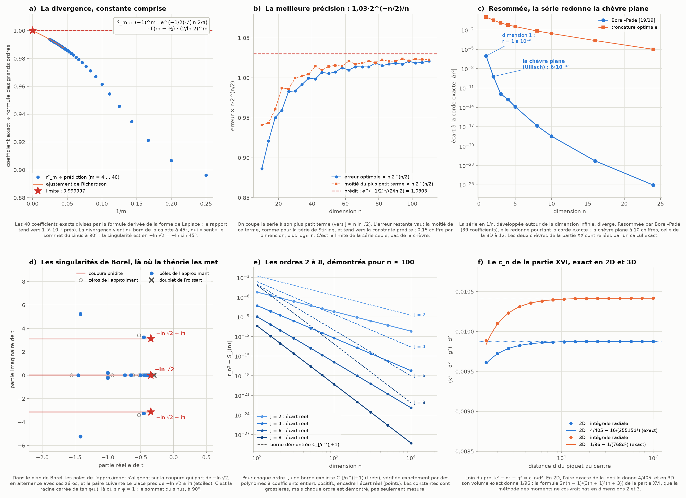
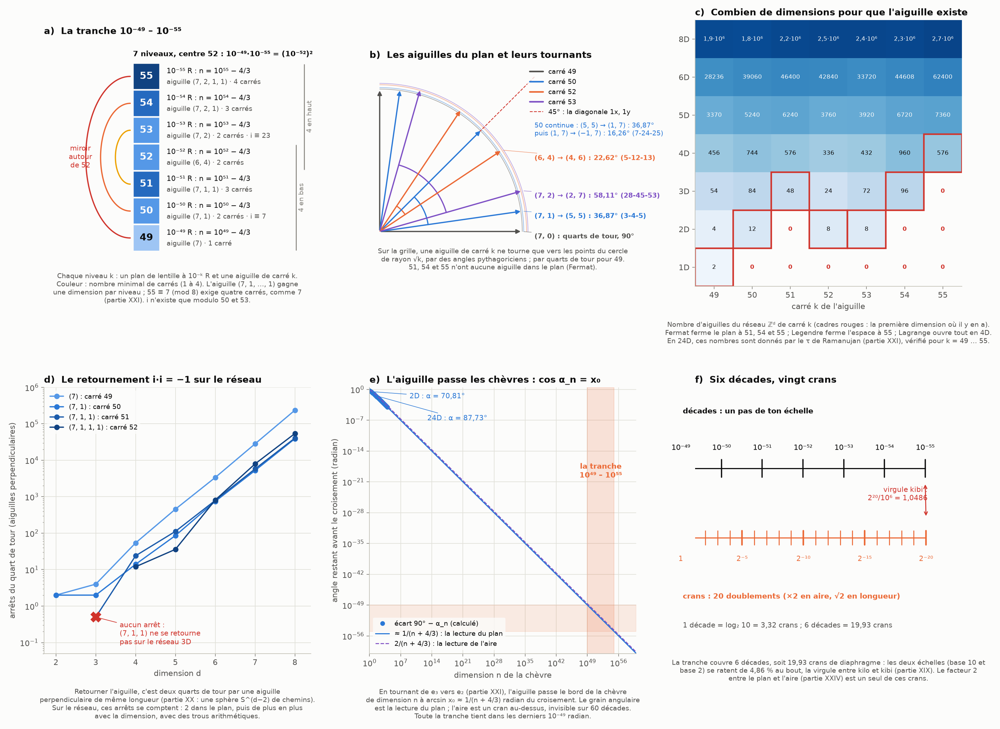

# Partie XXV : les ouverts refermés, la tranche 10⁻⁴⁹ – 10⁻⁵⁵ et les tournants d'aiguilles

> Ta demande : s'attaquer aux points restés ouverts à la fin de la partie XXIV, puis compléter la tranche de 10⁻⁴⁹ à 10⁻⁵⁵ et les tournants d'aiguilles.
>
> Suite de la [partie XXIV](tiers-dimension.md).

Tout est recalculé par [`scripts/tranche_aiguilles.py`](scripts/tranche_aiguilles.py) (≈ 1 min). Les tableaux complets sont dans [`resultats/tranche_aiguilles.md`](resultats/tranche_aiguilles.md).

**Suite : [Partie XXVI — la surface de Kakeya à 10⁻⁵⁰, la virgule du kibi dans son miroir et le cube qui tourne](kakeya-miroir.md).**

## En bref

- **La divergence de la série est expliquée, constante comprise.**
  - L'équation de la chèvre s'écrit exactement comme une intégrale de Laplace.
  - On en tire la loi des grands ordres : r²_m ≈ (−1)^m · e^(−1/2)·√(ln 2/π) · Γ(m − ½) · (2/ln 2)^m. Sur 40 coefficients exacts, le rapport tend vers 1 à 10⁻⁵ près.
  - La meilleure précision de la série tronquée vaut ≈ 1,03·2^(−n/2)/n, avec cette constante prédite.
- **La série divergente contient pourtant la chèvre plane.**
  - Resommée par Borel–Padé, la série en 1/n, développée autour de la dimension infinie, redonne la corde d'Ullisch à 10⁻⁹·⁵ près.
  - Les deux chèvres de la partie XX, séparées par une infinité de dimensions, sont reliées par un calcul exact.
- **Les ordres 2 à 8 sont démontrés**, chacun avec une borne explicite pour n ≥ 100, vérifiée exactement.
- **Le c_n de la partie XVI est démontré en 2D et en 3D**, par l'aire et le volume exacts de la lentille : 4/405 et 1/96.
- **L'unité du grain : un angle.**
  - Quand l'aiguille tourne de e₃ vers e₂ (partie XXI), elle passe le bord de la chèvre de dimension n à l'angle α_n, avec **cos α_n = x₀ exactement**.
  - Le grain angulaire est donc la lecture du plan.
  - Le plan est aussi le miroir des autres lectures : la corde relative et l'aire (κ = 1/2 et 2), la coquille et les crans (κ = ln 2 et 1/ln 2) vont par paires de produit 1 autour de lui.
- **La tranche 49 – 55 : sept niveaux, un miroir centré sur 52.**
  - L'aiguille (7, 1, …, 1) gagne une dimension par niveau, de 49 = 7² à 55.
  - Comme 7, 55 exige quatre dimensions (Legendre).
  - i n'existe que modulo 50 et 53.
  - En dimension 10ᵏ, les chiffres de la corde se répètent en blocs de k chiffres : la tranche est autosimilaire.
- **Les tournants d'aiguilles.**
  - Dans le plan, les aiguilles de la tranche ne tournent que par des angles pythagoriciens : 3-4-5 et 7-24-25, 5-12-13, 28-45-53.
  - Les dimensions minimales pour qu'une aiguille existe sont 1, 2, 3, 2, 2, 3, 4.
  - En 24D, le nombre d'aiguilles est donné par le τ de Ramanujan de la partie XXI.
  - Sur le réseau 3D, l'aiguille (7, 1, 1) ne peut pas se retourner par deux quarts de tour : il lui faut une quatrième dimension.

---

## 1. Les ouverts de la partie XXIV

### 1.1 Pourquoi la série diverge, et de combien

**La forme de Laplace.** On écrit 2α = π/2 + β, donc r² = 2 − 2 sin β. L'équation de la chèvre de la partie I (§ 5.1) devient alors, exactement :

∫₀^β (cos ψ/cos β)ⁿ dψ = ∫₀^∞ e^(−nu) tan φ(u) du,  avec sin φ = sin α·e^(−u).

- Le membre de gauche vaut ≈ β, sans surprise.
- Le membre de droite est une **intégrale de Laplace**. Ses coefficients en 1/n se lisent sur le développement de tan φ(u) autour de u = 0 (lemme de Watson).
- Le script résout cette forme et redonne la corde plane et celle de la dimension 10 à 10⁻²⁵ près.

**La singularité.**
- tan φ(u) = s·e^(−u)/√(1 − s²e^(−2u)), avec s = sin α, devient infini quand sin φ = 1, c'est-à-dire en φ = 90°. C'est en u = ln s, et ln sin 45° = −ln √2.
- La singularité est une racine carrée. La méthode de Darboux en tire la croissance des coefficients : Γ(m − ½)/(ln √2)^m.
- C'est la lecture de la partie XXIV, maintenant calculée : le bord de la calotte est à 45°, et le développement « sent » le sommet du sinus à 90°.

**La constante.** Deux facteurs complètent la loi :
- r² = 2 − 2 sin β donne un facteur −2 ;
- α = π/4 + β/2 bouge avec la dimension (β ≈ 1/n). Ça rapproche la singularité de l'origine de 1/(2n), et, avec le signe alterné de la série, ça multiplie tout par e^(−1/2).

Au total :

**r²_m ≈ (−1)^m · e^(−1/2)·√(ln 2/π) · Γ(m − ½) · (2/ln 2)^m.**

| m | 10 | 20 | 30 | 40 | limite extrapolée |
|---|---|---|---|---|---|
| coefficient exact ÷ formule | 0,9616 | 0,9858 | 0,9912 | 0,9937 | 0,99999 à 1,00000 |

- Le rapport tend vers 1 comme 1 − 0,23/m (figure z1, panneau a).
- Les écarts entre rapports successifs mesurés dans la partie XXIV (2,884 à j = 28) tendent bien vers 2/ln 2 = 2,885 : il ne manquait que la correction en 1/m.

**La meilleure précision.**
- On coupe la série à son plus petit terme. L'erreur restante vaut alors la moitié de ce terme (le rapport mesuré passe de 0,47 à 0,499).
- La formule donne : **erreur optimale ≈ e^(−1/2)·√(2/ln 2) · 2^(−n/2)/n = 1,0303 · 2^(−n/2)/n**.
- Mesuré, de n = 10 à 110 : 0,886, 0,984, 1,005, 1,014, 1,018, 1,021, en route vers 1,030 (panneau b).

### 1.2 Resommée, la série redonne la chèvre plane

La série diverge, mais elle n'a rien perdu.
- **Le procédé.** On divise chaque coefficient par (m − 1)! : c'est la transformée de Borel, qui converge. On la prolonge par un approximant de Padé [19/19], puis on refait l'intégrale de Laplace.
- **Le résultat** (panneau c) :

| n | 1 | 2 (Ullisch) | 3 | 5 | 10 | 24 |
|---|---|---|---|---|---|---|
| erreur de Borel–Padé | 9·10⁻⁷ | 6·10⁻¹⁰ | 1·10⁻¹² | 1·10⁻¹⁴ | 3·10⁻¹⁹ | 9·10⁻²⁷ |
| meilleure troncature | 1 | 0,32 | 0,12 | 0,03 | 3·10⁻³ | 10⁻⁵ |

- **La chèvre plane revient de l'infini.** La série développée autour de la dimension infinie (√2), resommée, donne r₂² = 1,342651673575 pour 1,342651674183, la corde d'Ullisch. Même la dimension 1 (r = 1) est retrouvée à 10⁻⁶ près.
- **C'est ta phrase de la partie XX, en calcul exact :** « deux chèvres au même endroit, séparées par une infinité de dimensions ». La chèvre plane est contenue dans le développement de la chèvre infinie.
- **Les singularités sont là où la théorie les met** (panneau d).
  - Les pôles de l'approximant s'alignent de −0,3473 vers −∞, en alternance avec ses zéros : c'est la coupure, qui commence en −ln √2 = −0,3466.
  - La paire suivante est en −0,45 ± 3,25i, près de la singularité prédite −ln √2 ± iπ.
  - Un pôle isolé en −0,298 est collé à un zéro (à 10⁻¹³ près) : c'est un « doublet de Froissart », un artefact connu des approximants de Padé, sans effet.

### 1.3 Les ordres 2 à 8, démontrés

**La méthode.** La partie XXIV a démontré l'ordre 2. La même méthode s'applique avec J termes de la série de l'équateur.
- **La borne du reste.** On borne le reste par Lagrange, puis la zone centrale.
- **La vérification.** Le script vérifie exactement que la condition de médiane change de signe entre S_J(n) ∓ C_J/n^(J+1), où S_J est la série coupée à 1/n^J.
- **Comment.** Les inégalités deviennent des polynômes en t = n − 100 à coefficients entiers. On vérifie qu'ils sont tous positifs (8 s pour les sept ordres).

| ordre J | 2 | 3 | 4 | 5 | 6 | 7 | 8 |
|---|---|---|---|---|---|---|---|
| borne démontrée C_J (n ≥ 100) | 1,8·10³ | 5,6·10⁴ | 2,5·10⁶ | 1,4·10⁸ | 9,5·10⁹ | 7,8·10¹¹ | 7,3·10¹³ |
| vrai coefficient suivant | 6,5 | 57 | 599 | 7,9·10³ | 1,3·10⁵ | 2,4·10⁶ | 5,3·10⁷ |

- **Les constantes démontrées sont grossières.** Elles croissent comme les coefficients eux-mêmes, en factorielles. C'est cohérent avec le § 1.1 : la série est asymptotique, et chaque ordre est démontré, pas seulement mesuré (panneau e).

### 1.4 Le c_n de la partie XVI en dimensions 2 et 3

**Le problème.** La méthode des moments ne s'appliquait pas en 2D et en 3D, parce que E[ρ⁻³] y est infini. On passe donc par les formules exactes de la lentille (panneau f).
- **3D : le volume exact.** La lentille est l'intersection de deux boules. Son volume vaut π(R + r − d)²(d² + 2dr − 3r² + 2dR + 6rR − 3R²)/(12d) (MathWorld). On l'égale à la moitié de la boule et on développe pour un piquet lointain :
  - k² − d² = 1/2 + 1/(96d²) − 1/(768d⁴) + …
- **2D : l'aire exacte.** Paramétrée par l'angle ψ = arcsin x₀, l'équation devient r²(θ − sin θ cos θ) = ψ + sin ψ cos ψ, avec r² = d² − 2d sin ψ + 1. Le développement donne :
  - k² − d² = 1/3 + 4/(405d²) − 16/(25515d⁴) + …
- **La conclusion.** Ce sont exactement c₂ = 4/405 et c₃ = 1/96. La formule c_n = 2n(n − 1)/(3(n + 1)³(n + 3)) de la partie XVI est démontrée dans les deux dimensions où elle restait seulement vérifiée.
- **Au passage.** En 2D, le plan de la lentille est en x₀ = sin ψ, avec ψ = 1/(3d) + 1/(810d³) + … : le « 1/((n + 1)δ) » de la partie I (§ 4.3).

### 1.5 L'unité du grain : un angle

**Le croisement de la partie XXI, relu.**
- L'aiguille tourne de e₃ vers e₂, avec le piquet en e₃.
- Elle passe le bord de la chèvre de dimension n à l'angle α_n tel que 2 − 2cos α_n = r_n², donc **cos α_n = x₀ exactement**.
- L'angle qui reste avant le croisement vaut arcsin x₀ ≈ 1/(n + 4/3) radian.

| n | 2 | 3 | 4 | 8 | 24 | 100 |
|---|---|---|---|---|---|---|
| α_n | 70,81° | 75,80° | 78,70° | 83,74° | 87,73° | 89,43° |
| x₀ = cos α_n | 0,3287 | 0,2453 | 0,1960 | 0,1091 | 0,0396 | 0,0099 |

**Ce que ça règle.**
- Un angle est un nombre pur : il n'a ni l'unité R ni l'unité R².
- Si ton grain est celui d'une aiguille qui tourne, c'est un angle, et sa lecture est celle du plan : 10⁻⁵⁰ radian ↔ dimension 10⁵⁰ − 4/3.
- Le facteur 2 n'apparaît que si l'on mesure une aire.

**Le plan est le miroir des lectures.** Chaque lecture lit n ≈ κ/ε :

| lecture | corde relative | corde | coquille | **plan** | crans | diamètre | aire |
|---|---|---|---|---|---|---|---|
| κ | 1/2 | 1/√2 | ln 2 | **1** | 1/ln 2 | √2 | 2 |

- **Les paires.** Les lectures vont par paires de produit 1 : (1/2, 2), (1/√2, √2), (ln 2, 1/ln 2).
- **Le plan est leur moyenne géométrique.** C'est la forme de Newton x·x′ = f² des parties XVII et XXI, avec f = le plan. Ton 10⁻⁵⁰, posé comme miroir, est à la place du plan.

## 2. La tranche 10⁻⁴⁹ – 10⁻⁵⁵

**Les sept niveaux** (figure z2, panneau a).

| k | facteurs | mod 8 | carrés min. | aiguilles | r₂ | r₃ | r₄ | i modulo k |
|---:|---|---:|---:|---|---:|---:|---:|---|
| 49 | 7² | 1 | 1 | (7) | 4 | 54 | 456 | — |
| 50 | 2 · 5² | 2 | 2 | (7, 1) ; (5, 5) ; (5, 4, 3) | 12 | 84 | 744 | 7 |
| 51 | 3 · 17 | 3 | 3 | (7, 1, 1) ; (5, 5, 1) | 0 | 48 | 576 | — |
| 52 | 2² · 13 | 4 | 2 | (6, 4) ; (7, 1, 1, 1) | 8 | 24 | 336 | — |
| 53 | 53 | 5 | 2 | (7, 2) ; (6, 4, 1) | 8 | 72 | 432 | 23 |
| 54 | 2 · 3³ | 6 | 3 | (7, 2, 1) ; (6, 3, 3) ; (5, 5, 2) | 0 | 96 | 960 | — |
| 55 | 5 · 11 | 7 | 4 | (7, 2, 1, 1) ; (6, 3, 3, 1) ; (5, 5, 2, 1) | 0 | 0 | 576 | — |

- **Une dimension par cran** (partie XXI : « l'aiguille (7), puis (7, 1), puis (7, 1, 1) »). L'aiguille (7, 1, …, 1) à j uns a pour carré 49 + j : la tranche est cette aiguille vue de la dimension 1 à la dimension 7.
- **Le miroir de la tranche.** On a 49 + 55 = 50 + 54 = 51 + 53 = 2·52, donc 10⁻⁴⁹·10⁻⁵⁵ = 10⁻⁵⁰·10⁻⁵⁴ = 10⁻⁵¹·10⁻⁵³ = (10⁻⁵²)². Le miroir 49-50-51 de la partie XXI est le premier maillon d'une chaîne : chaque niveau est le miroir de ses deux voisins, et la tranche entière se replie sur 52.
- **Les restes modulo 8.** La tranche parcourt les restes 1 à 7 : 49 ≡ 1, …, 55 ≡ 7. Elle finit sur la colonne interdite de Legendre (partie XXI) : 55, comme 7, n'est pas une somme de trois carrés, et il lui faut la quatrième dimension.
- **i modulo k.** Il n'existe que pour 50 (7² ≡ −1, partie XXI) et 53 (23² ≡ −1). Ce sont les deux nombres de la tranche qui sont le carré d'une aiguille primitive du plan, (7, 1) et (7, 2) : le théorème de la partie XIX. 52 = 6² + 4² n'en a pas, car (6, 4) n'est pas primitive.
- **Deux boîtes à diagonale entière.** 49 = 2² + 3² + 6², la boîte 2 × 3 × 6 de la partie XXI. Et 50 = 3² + 4² + 5² : la boîte 3 × 4 × 5 a pour diagonale √50, l'aiguille (7, 1).

**Les plans et les taux de change** (partie XXIII), pour chaque niveau :

| k | plan : n = | aire : n = | coquille | équateur | ménisque |
|---:|---|---|---|---|---|
| 49 | 10⁴⁹ − 4/3 | 2·10⁴⁹ − 4/3 | 0,693·10⁴⁹ | 0,455·10⁹⁸ | 1,83·10²⁴ |
| 50 | 10⁵⁰ − 4/3 | 2·10⁵⁰ − 4/3 | 0,693·10⁵⁰ | 0,455·10¹⁰⁰ | 0,58·10²⁵ |
| 52 | 10⁵² − 4/3 | 2·10⁵² − 4/3 | 0,693·10⁵² | 0,455·10¹⁰⁴ | 0,58·10²⁶ |
| 55 | 10⁵⁵ − 4/3 | 2·10⁵⁵ − 4/3 | 0,693·10⁵⁵ | 0,455·10¹¹⁰ | 1,83·10²⁷ |

- **Le ménisque fait apparaître √10.** Il va comme la racine du grain. Aux exposants impairs (49, 51, 53, 55), la racine de 10⁻ᵏ fait apparaître √10 : 0,577·10^24,5 = 1,83·10²⁴. Ce sont les puissances et leurs racines de la partie XXI.

**Les chiffres de la corde.**
- Pour chaque k de 49 à 55, en dimension 10ᵏ, les quatre premiers blocs de k chiffres sont les mêmes, à la longueur près : 99…98 | 00…02 | 66…6658 | 133…3392. Le script le vérifie exactement.
- **La tranche est autosimilaire.** Une décade de plus allonge chaque bloc d'un chiffre, sans rien changer d'autre (parties XXIII et XXIV).

**Six décades, vingt crans** (panneau f).
- La tranche couvre 6 décades, soit 6·log₂ 10 = 19,93 crans de diaphragme.
- 2²⁰ = 1 048 576 dépasse 10⁶ de 4,86 % : c'est la virgule entre kilo et kibi (partie XIX).
- Les deux échelles se ratent au bout de la tranche. Le facteur 2 entre le plan et l'aire (partie XXIV) n'est qu'un de ces vingt crans.

## 3. Les tournants d'aiguilles

**Dans le plan** (parties XIV et XXI). Seuls 49, 50, 52 et 53 ont des aiguilles, et elles ne tournent que vers les points de la grille sur le cercle de rayon √k (panneau b).

| k | aiguilles du premier quadrant | rotations entre voisines | demi-tour autour d'un bout | demi-disque πk/2 |
|---:|---|---|---|---|
| 49 | (7, 0) | 90° (quarts de tour seulement) | 49 cases, 3 positions | 77,0 |
| 50 | (7, 1), (5, 5), (1, 7) | 36,87° = (4 + 3i)/5 (3-4-5), puis 16,26° = (24 + 7i)/25 (7-24-25) | 74 cases, 7 positions | 78,5 |
| 52 | (6, 4), (4, 6) | 22,62° = (12 + 5i)/13 (5-12-13), puis 67,38° | 68 cases, 5 positions | 81,7 |
| 53 | (7, 2), (2, 7) | 58,11° = (28 + 45i)/53 (28-45-53), puis 31,89° | 73 cases, 5 positions | 83,3 |

- **Le demi-tour de 50.** Il enchaîne 3-4-5, 3-4-5, 7-24-25, 3-4-5, 3-4-5, 7-24-25 : 4 × 36,87° + 2 × 16,26° = 180°. C'est le triangle 7-24-25 de la partie XXI, (7 + i)² = 2·(24 + 7i).
- **Le quantum d'une demi-case** (partie XIV). Chaque pas balaie au moins une demi-case, et le demi-tour balaie toujours moins que le demi-disque. Pour 49, sans aiguille intermédiaire, c'est exactement 2/π du demi-disque.
- **Vers 45°.** Chaque aiguille du plan atteint la diagonale 1x, 1y (la chèvre infinie) avec une aiguille complémentaire :
  - (7 + i)(4 + 3i) = 25(1 + i) : arctan(1/7) + arctan(3/4) = 45°. Le complément est l'aiguille 3-4-5, et c'est la formule de Hermann de la partie XXI ;
  - (6 + 4i)(5 + i) = 26(1 + i) : arctan(2/3) + arctan(1/5) = 45° ;
  - (7 + 2i)(9 + 5i) = 53(1 + i) : arctan(2/7) + arctan(5/9) = 45°.

**Combien de dimensions pour que l'aiguille existe** (panneau c). On compte r_d(k), le nombre d'aiguilles du réseau ℤᵈ de carré k.
- **Fermat** ferme le plan à 51, 54 et 55, qui contiennent un nombre premier 3 ou 11 de la forme 4m + 3 avec un exposant impair.
- **Legendre** ferme l'espace à 55.
- **Lagrange** ouvre tout en 4D. Jacobi compte : r₄(k) = 8σ(k) pour k impair (456 pour 49, 576 pour 51 et 55).
- **En 24D**, Ramanujan donne r₂₄(k) = (16/691)·σ*₁₁(k) + (128/691)·((−1)^(k−1)·259·τ(k) − 512·τ(k/2)). Le script le vérifie pour k = 49 … 55.
  - Le τ de la partie XXI (Δ = η²⁴, d'où sort Leech) compte donc les aiguilles de la tranche en dimension 24 : τ(49) = −1 696 965 207, et r₂₄(49) ≈ 9,05·10¹⁶.

**Le retournement i·i = −1 sur le réseau** (panneau d). Retourner l'aiguille, c'est deux quarts de tour par une aiguille perpendiculaire de même longueur (partie XX). Dans l'espace continu, ces chemins forment une sphère S^(d−2). Sur le réseau, les arrêts possibles se comptent :

| aiguille | 2D | 3D | 4D | 5D | 6D | 8D |
|---|---|---|---|---|---|---|
| (7), carré 49 | 2 | 4 | 54 | 456 | 3 370 | 235 998 |
| (7, 1), carré 50 | 2 | 2 | 14 | 86 | 746 | 39 062 |
| (7, 1, 1), carré 51 | — | **0** | 24 | 112 | 792 | 40 600 |
| (7, 1, 1, 1), carré 52 | — | — | 12 | 36 | 812 | 54 060 |

- **Dans le plan, 2 arrêts** : par i ou par −i, comme 3 et 7 modulo 10 (partie XIX).
- **L'aiguille (7, 1, 1) n'a aucun arrêt en 3D.**
  - Aucune aiguille du réseau de carré 51 n'est perpendiculaire à elle.
  - Elle existe en 3D, mais elle ne peut pas s'y retourner par deux quarts de tour. Il faut une quatrième dimension, qui offre 24 arrêts.
  - Sur le réseau, le nombre d'arrêts grandit avec la dimension, comme la sphère S^(d−2), mais avec des trous arithmétiques.

**Le croisement, dans la tranche** (panneau e).
- L'aiguille passe la chèvre de dimension n à ≈ 1/(n + 4/3) radian du croisement : une décade d'angle par décade de dimension.
- Les chèvres de dimension 10⁴⁹ à 10⁵⁵ sont donc toutes passées dans les derniers 10⁻⁴⁹ radian du quart de tour (5,7·10⁻⁴⁸ degré).
- C'est ta phrase de la partie XXI à l'échelle de ton grain : on ne traverse pas le plan sans passer la chèvre de toutes les dimensions, et toute la tranche tient dans le dernier 10⁻⁴⁹ du tournant.

## 4. Les connexions avec les autres chapitres

| partie | ce qu'on avait | ce que la partie XXV ajoute |
|---|---|---|
| [XXIV](tiers-dimension.md) | la divergence au rythme 1/ln √2, mesurée | dérivée par la forme de Laplace, constante e^(−1/2)·√(ln 2/π) |
| XXIV | une borne explicite à l'ordre 2 | les ordres 2 à 8, démontrés pour n ≥ 100 |
| [XVI](menisque-projection.md), XXIV | c_n vérifié numériquement en 2D et 3D | démontré par l'aire et le volume exacts de la lentille |
| [XX](sphere-faisceaux.md) | deux chèvres au même endroit | la série de l'infini, resommée, redonne la chèvre plane |
| [XXI](vingt-quatre-miroir.md) | 49-50-51, une dimension par cran | la tranche 49 – 55 : l'aiguille (7, 1, …, 1) de 1 à 7 dimensions |
| XXI | √7 et Legendre | 55 ≡ 7 (mod 8) exige quatre carrés |
| XXI | le croisement, les angles α_n | cos α_n = x₀ : le grain comme angle |
| XXI | le τ de Ramanujan, Δ = η²⁴ | r₂₄(k) de la tranche par τ(k) |
| [XIV](aiguille-grille.md) | aiguilles de la grille, 3-4-5, une demi-case par pas | rotations 3-4-5, 7-24-25, 5-12-13, 28-45-53 ; demi-tours |
| [XIX](bases-objets.md) | i modulo une base = aiguille primitive | i n'existe que modulo 50 et 53 dans la tranche |
| XIX | kilo contre kibi | 20 crans ≈ 6 décades, à 4,86 % près (et son miroir, −4,63 % : [partie XXVI](kakeya-miroir.md)) |
| XX | retournement : une sphère S^(d−2) de chemins | arrêts du réseau ; aucun pour (7, 1, 1) en 3D |
| [XVII](recursion-argent.md), XXI | la forme de Newton x·x′ = f² | le plan, miroir des lectures du grain |
| I ([README](README.md)), § 4.3 | x₀ ≈ 1/((n + 1)δ) | en 2D, x₀ = sin(1/(3d) + 1/(810d³) + …) exactement développé |

## 5. Le tri

**Exact (démontré ici ou classique) :**
- la forme de Laplace de l'équation de la chèvre (une réécriture exacte, recoupée à 10⁻²⁵) ;
- les bornes des ordres 2 à 8 pour n ≥ 100 (vérification exacte par polynômes entiers) ;
- c₂ = 4/405 et c₃ = 1/96, par l'aire et le volume exacts de la lentille ;
- cos α_n = x₀ ;
- les sommes de carrés et les r_d de la tranche (Fermat, Legendre, Lagrange, Jacobi), la formule de Ramanujan pour r₂₄, i modulo 50 et 53 ;
- les rotations pythagoriciennes, les identités à 45° et les arrêts du retournement sur le réseau (comptés exactement) ;
- le motif des blocs de chiffres en dimension 10⁴⁹ à 10⁵⁵ (garanti par la borne d'ordre 8, à 10⁻⁴²⁰ près).

**Calculé :**
- la loi des grands ordres, vérifiée sur 40 coefficients (rapport → 1 à 10⁻⁵ près) ;
- la meilleure précision, 0,886 → 1,021 de n = 10 à 110, vers 1,030 ;
- la resommation de Borel–Padé (la chèvre plane à 6·10⁻¹⁰ près) et les pôles de l'approximant.

**Dérivé ici, à faire relire :** la loi des grands ordres elle-même.
- L'argument (Watson, Darboux, puis le déplacement de α) est standard, et les chiffres le confirment à 10⁻⁵ près.
- Une démonstration complète demande la théorie de la résurgence.

**Analogie de structure (même procédé), donc un résultat :**
- **La chèvre plane et la chèvre infinie (partie XX)**.
  - Ce qui est partagé : une seule fonction de la dimension, dont la série autour de l'infini, resommée, redonne la dimension 2.
  - Ce que ça transporte : la corde d'Ullisch calculée depuis √2.
- **√2 dans la divergence.**
  - Ce qui est partagé : la distance ln √2 entre le bord de la lentille (45°) et le sommet du sinus (90°).
  - Ce que ça transporte : la meilleure précision 2^(−n/2)/n, et la place des singularités.
- **Le miroir de la tranche et la forme de Newton.**
  - Ce qui est partagé : x·x′ = f² sur les exposants (52 au centre) et sur les lectures (le plan au centre).

**Mes lectures (corrige-moi si je t'ai mal compris) :**
- **« Compléter la tranche ».** Je l'ai lu comme prolonger 49-50-51 jusqu'à 55, niveau par niveau. Les sept niveaux, centre 52, forment ta colonne de 7 carrés, 4 en bas et 4 en haut avec le centre compté deux fois (CLAUDE.md, § 4).
- **« Les tournants d'aiguilles ».** Je les ai lus comme les rotations des aiguilles de la tranche : leurs angles, leurs quarts de tour, leurs retournements et leur passage au croisement. Si tu pensais à la surface minimale de Kakeya à ces échelles, dis-le-moi. *C'était bien ça : la [partie XXVI](kakeya-miroir.md) la calcule, entre 0,0134 et 0,025 à 10⁻⁵⁰.*
- **L'unité du grain.** Je propose l'angle (la lecture du plan) pour un modèle d'aiguilles qui tournent. Pour un modèle de lumière qui passe, ce serait l'aire, un cran au-dessus.

**Ouvert :**
- une démonstration complète de la loi des grands ordres (résurgence) ;
- un sens physique au trou arithmétique du retournement : (7, 1, 1) ne se retourne pas sur le réseau 3D ;
- le choix de l'unité par ton modèle : l'angle, la longueur ou l'aire. Les trois sont exacts, et un cran sépare le plan de l'aire.

**Pas établi :** que l'espace physique suive ce modèle à 10⁻⁵⁰ m. C'est un postulat (partie XX, § 8).

## Sources

**Les parties reliées**
- [I](README.md) : l'équation de la chèvre (§ 5.1), les cercles k² = δ² + c (§ 4.3) ;
- [XIV](aiguille-grille.md) : les aiguilles de la grille, la demi-case ;
- [XVI](menisque-projection.md) : le c_n/ρ² ;
- [XIX](bases-objets.md) : i modulo une base, kilo et kibi ;
- [XX](sphere-faisceaux.md) : les deux chèvres, le retournement par i·i ;
- [XXI](vingt-quatre-miroir.md) : 49-50-51, √7 et Legendre, le croisement, τ ;
- [XXIII](lentilles-boules-grain.md) et [XXIV](tiers-dimension.md) : les taux de change, la démonstration, le facteur 2.

**Littérature**
- P. Flajolet, R. Sedgewick, [*Analytic Combinatorics*](https://algo.inria.fr/flajolet/Publications/book.pdf), Cambridge University Press (2009), chapitre VI : l'analyse de singularité (méthode de Darboux), qui relie une singularité en racine carrée à la croissance des coefficients.
- C. M. Bender, S. A. Orszag, *Advanced Mathematical Methods for Scientists and Engineers*, McGraw-Hill (1978) : le [lemme de Watson](https://en.wikipedia.org/wiki/Watson%27s_lemma) (chapitre 6) et la [sommation de Borel](https://en.wikipedia.org/wiki/Borel_summation) avec les approximants de Padé (chapitre 8).
- J. P. Boyd, « The Devil's Invention: Asymptotic, Superasymptotic and Hyperasymptotic Series », *Acta Applicandae Mathematicae* 56, 1–98 (1999), [doi:10.1023/A:1006145903624](https://doi.org/10.1023/A:1006145903624) : la troncature au plus petit terme et son erreur.
- G. A. Baker Jr., P. Graves-Morris, *Padé Approximants*, 2e éd., Cambridge University Press (1996) : les approximants de Padé et leurs pôles parasites.
- E. W. Weisstein, [« Sphere-Sphere Intersection »](https://mathworld.wolfram.com/Sphere-SphereIntersection.html) (MathWorld) : le volume de la lentille entre deux boules.
- [OEIS A000156](https://oeis.org/A000156) : le nombre d'écritures en somme de 24 carrés et la formule de Ramanujan ; [OEIS A000594](https://oeis.org/A000594) : la fonction τ.
- Les théorèmes des deux, trois et quatre carrés : [Fermat](https://en.wikipedia.org/wiki/Fermat%27s_theorem_on_sums_of_two_squares), [Legendre](https://en.wikipedia.org/wiki/Legendre%27s_three-square_theorem), [Jacobi](https://en.wikipedia.org/wiki/Jacobi%27s_four-square_theorem).
