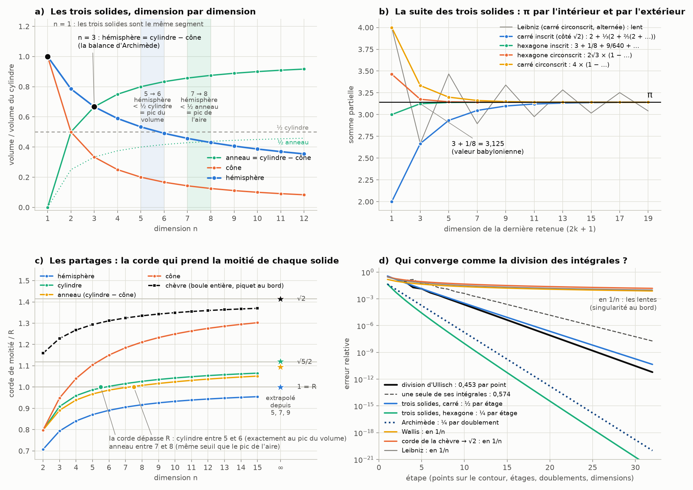

# Partie IV : la suite des trois solides

> La question : trouver la suite qui converge en combinant trois ingrédients. D'abord les trois solides d'Archimède : hémisphère, cylindre et cône. Ensuite les équations qui font passer d'une dimension à l'autre. Enfin les partages en moitiés. Puis repérer les convergences qui ont le plus en commun avec l'erreur de la division des intégrales d'Ullisch. Suite des parties [I](README.md), [II](archimede.md) et [III](pi-dimensions.md).

Tout est recalculé par [`scripts/trois_solides.py`](scripts/trois_solides.py) (≈ 5 s). Les tableaux complets sont dans [`resultats/trois_solides.md`](resultats/trois_solides.md).

**Suite : [Partie V — l'aiguille de Kakeya, l'arbre de Perron et la chèvre](aiguille-kakeya.md).**

## En bref

- **La suite existe, elle est exacte, et elle part du carré de côté √2 :**
  ```math
  \pi = 2 + \frac13\left(2 + \frac25\left(2 + \frac37\left(2 + \frac49\left(2 + \cdots\right)\right)\right)\right)
  ```
  À chaque étage, on monte de deux dimensions. On prend la part de l'anneau d'Archimède (cylindre moins cône) dans le cylindre, et on la partage en deux. Le 2 de départ est l'aire du carré inscrit dans le cercle. C'est exactement la formule de l'algorithme « compte-gouttes » de Rabinowitz et Wagon (1995).
- **Elle marche depuis n'importe quel polygone**, par l'intérieur comme par l'extérieur.
  - Depuis l'hexagone : π = 3 + 1/8 + 9/640 + … Au passage, 3 + 1/8 est la valeur babylonienne.
  - Depuis le dodécagone, dont l'aire vaut exactement 3 : π = 3 + (2 − √3)/2 + (2 − √3)²/10 + …

  Ce sont les vrais cousins de ta suite 3 + √2/10 + √3/100.
- **5 et 7 retrouvent un sens exact, qui ne dépend plus de l'unité.** Dès la dimension 6, l'hémisphère remplit moins de la moitié de son cylindre : c'est le pic du volume des boules. Dès la dimension 8, il remplit moins de la moitié de l'anneau : c'est le pic de leur aire.
- **Les partages convergent vers 1, √5/2 et √2, et le cône rejoint la chèvre en √2.** C'est lent (en 1/n). Mais en extrapolant depuis les dimensions 5, 7 et 9, on retrouve les limites à 0,1 % près (sauf pour l'anneau).
- **Ce qui converge comme la division des intégrales** (0,453 par point) : la suite des trois solides (½ par étage depuis le carré, ¼ depuis l'hexagone) et Archimède (¼ par doublement). C'est la même famille, pour la même raison : tout dépend de la distance à la singularité la plus proche.
- **Le point commun le plus profond**, c'est la façon dont l'erreur disparaît. Dans la division d'Ullisch comme dans la balance d'Archimède, l'erreur d'approximation s'annule exactement dans la comparaison.



---

## 1. Les trois solides en dimension n

On garde la configuration d'Archimède :
- l'hémisphère a pour rayon R ;
- le cylindre qui l'entoure a pour rayon R et pour hauteur R ;
- le cône est inscrit dans ce cylindre, avec son sommet au centre O de la base.

On compare tout au cylindre. $V_n$ est le volume de la boule unité et $W_n = \int_0^\pi \sin^n$ le pas d'une dimension à la suivante (partie III) :

```math
h_n = \frac{\text{hémisphère}}{\text{cylindre}} = \frac{V_n}{2\,V_{n-1}} = \frac{W_n}{2},
\qquad
c_n = \frac{\text{cône}}{\text{cylindre}} = \frac1n,
\qquad
1 - c_n = \frac{\text{anneau}}{\text{cylindre}} .
```

| n | hémisphère $h_n$ | cône $c_n$ | anneau $1 - c_n$ |
|---:|---|---|---|
| 1 | 1 | 1 | 0 |
| 2 | π/4 = 0,785 | 1/2 | 1/2 |
| **3** | **2/3** | 1/3 | **2/3** |
| 4 | 3π/16 = 0,589 | 1/4 | 3/4 |
| 5 | 8/15 = 0,533 | 1/5 | 4/5 |
| 6 | 5π/32 = 0,491 | 1/6 | 5/6 |
| 7 | 16/35 = 0,457 | 1/7 | 6/7 |
| 8 | 35π/256 = 0,430 | 1/8 | 7/8 |

Trois choses à retenir (figure a) :
- **En dimension 1, les trois solides sont le même segment** $[0, R]$, parce que la base est réduite à un point.
- **En dimension 3, et seulement là, l'hémisphère égale l'anneau** (2/3 = 2/3). C'est la balance d'Archimède : hémisphère + cône = cylindre, avec les rapports 1 : 2 : 3 gravés sur sa tombe.
  - Ailleurs, elle est fausse : en 2D, le demi-disque (π/4 du rectangle) dépasse l'anneau (1/2), et dès la 4D il passe en dessous.
  - La raison est l'identité des tranches $\pi(R^2 - z^2) = \pi R^2 - \pi z^2$, qui n'existe qu'en 3D (partie II).
- **La parité de la partie I revient** : en dimension impaire le rapport est une fraction, en dimension paire il contient π.

## 2. Les équations dimensionnelles

Deux équations exactes relient les trois solides d'une dimension à l'autre. Le script les vérifie à 40 chiffres jusqu'à n = 39.

```math
h_n = (1 - c_n)\,h_{n-2}
\qquad\qquad
h_{n-1}\,h_n = \frac{\pi}{2}\,c_n
```

**La première : monter de deux dimensions multiplie la part de l'hémisphère par la part de l'anneau.**
- Partie de la dimension 1, où $h_1 = 1$, elle donne au premier pas $h_3 = (1 - 1/3)\times 1 = 2/3$. **La balance d'Archimède est donc le premier barreau de cette échelle.**
- Ensuite viennent 8/15, 16/35… : que des fractions.
- Partie de la dimension 0 ($h_0 = \pi/2$), elle donne les dimensions paires, toutes multiples de π.

**La seconde fait sortir π.** Le produit des parts de l'hémisphère dans deux dimensions voisines vaut π/2 fois la part du cône. Par exemple, pour n = 3 : (π/4)·(2/3) = (π/2)·(1/3). C'est l'équation $W_{n-1}W_n = 2\pi/n$ de la partie III, réécrite avec les trois solides.

**Les seuils 5 et 7, version trois solides.** Pour des boules et des sphères de rayon 1, $V_n/V_{n-1} = 2h_n$ et $S_n/S_{n-1} = 2h_n/(1 - c_n)$. Donc :

| ce qui croît | condition équivalente | vraie pour | seuil |
|---|---|---|---|
| le volume des boules unités | hémisphère > ½ cylindre | n ≤ 5 | pic du volume en 5 |
| l'aire des sphères unités | hémisphère > ½ anneau | n ≤ 7 | pic de l'aire en 7 |

Dans la partie II, on avait noté que les pics 5 et 7 bougent quand on change d'unité : ils ne valent que pour R = 1. La colonne du milieu, elle, ne bouge pas. Elle compare deux volumes de même dimension, et la hauteur du cylindre grandit avec R. Formulés avec les trois solides, 5 et 7 deviennent donc des seuils absolus :
- **à partir de la dimension 6, l'hémisphère remplit moins de la moitié de son cylindre ;**
- **à partir de la dimension 8, il remplit moins de la moitié de l'anneau d'Archimède.**

## 3. La suite des trois solides

### 3.1 La formule générale

On prend un polygone régulier à N côtés inscrit dans le cercle de rayon 1, avec $s = \sin(\pi/N)$ et $A_N$ son aire. Alors :

```math
\pi = A_N \sum_{k\ge0} h_{2k+1}\, s^{2k}
    = A_N\left(1 + \tfrac23\,s^2\left(1 + \tfrac45\,s^2\left(1 + \tfrac67\,s^2\left(1 + \cdots\right)\right)\right)\right).
```

Voici comment la lire :
1. **On part du polygone d'Archimède.** Son aire $A_N$ est trop petite.
2. **On ajoute une retenue par dimension impaire** : 3, 5, 7… La retenue de la dimension 2k + 1, c'est la part de l'hémisphère dans son cylindre, multipliée par $s^{2k}$.
3. **D'un étage au suivant, on multiplie par la part de l'anneau** (2/3, 4/5, 6/7…) **et par s².** C'est la première équation dimensionnelle.

<details>
<summary>Pourquoi c'est exact (trois lignes)</summary>

La part de l'hémisphère s'écrit avec ses tranches : $h_{2k+1} = \int_0^{\pi/2}\cos^{2k+1}\varphi\,d\varphi$. On somme la série géométrique sous l'intégrale, puis on pose $u = \sin\varphi$ :

```math
\sum_{k\ge0} s^{2k}\cos^{2k+1}\varphi = \frac{\cos\varphi}{1 - s^2\cos^2\varphi},
\qquad
\int_0^{\pi/2}\frac{\cos\varphi\,d\varphi}{1 - s^2\cos^2\varphi} = \frac{\theta}{\sin\theta\cos\theta}
\quad (s = \sin\theta).
```

Avec θ = π/N et $A_N = N\sin\theta\cos\theta$, il reste Nθ = π.
</details>

### 3.2 Depuis le carré : la suite « partagée en deux »

Pour le carré (N = 4), on a s² = sin²45° = ½ et $A_4 = 2$ (le côté vaut √2). La formule devient :

```math
\pi = 2 + \frac13\left(2 + \frac25\left(2 + \frac37\left(2 + \frac49\left(2 + \cdots\right)\right)\right)\right),
\qquad
\frac{k}{2k+1} = \frac12\times\left(1 - \frac{1}{2k+1}\right).
```

La parenthèse $1 - 1/(2k+1)$ est la part de l'anneau dans le cylindre, en dimension 2k + 1. C'est donc littéralement « trois solides + équation dimensionnelle + partage » : chaque étage monte de deux dimensions, prend la part de l'anneau d'Archimède, et la partage en deux.

Le ½ de chaque étage vaut sin²45°, c'est-à-dire le carré du rapport côté/diamètre du carré inscrit : (√2/2)².

| étages | dimension atteinte | valeur | écart à π |
|---:|---:|---|---:|
| 0 | 1 | 2 | −1,14 |
| 1 | 3 | 2,667 | −0,47 |
| 2 | 5 | 2,933 | −0,21 |
| 5 | 11 | 3,1215 | −0,020 |
| 10 | 21 | 3,141106 | −4,9·10⁻⁴ |
| 20 | 41 | 3,14159230 | −3,5·10⁻⁷ |
| 40 | 81 | 3,1415926535896 | −2,5·10⁻¹³ |

Chaque étage divise l'erreur par deux environ. Ça fait un chiffre binaire par étage, ou un chiffre décimal tous les 3,3 étages.

**Ce n'est pas une formule nouvelle**, et c'est plutôt rassurant. Euler l'a obtenue en accélérant la série de Leibniz. Rabinowitz et Wagon (1995) s'en servent pour leur algorithme « compte-gouttes », qui sort les décimales de π une à une avec des nombres entiers. Ce qui est nouveau ici, c'est la lecture : ses fractions 1/3, 2/5, 3/7… sont des demi-anneaux d'Archimède, dimension après dimension.

### 3.3 Les « 3 + retenues » : depuis l'hexagone et le dodécagone

**Depuis l'hexagone.** Son demi-périmètre vaut 3 : c'est la borne d'Archimède. On utilise cette fois la seconde équation dimensionnelle et on obtient la série de l'arc sinus de Newton, prise en ½ :

```math
\pi = 3\sum_{k\ge0}\frac{c_{2k+1}^{\,2}}{h_{2k+1}}\,\frac{1}{4^k}
    = 3 + \frac18 + \frac{9}{640} + \frac{15}{7168} + \frac{35}{98304} + \cdots
```

Chaque terme vaut cône² / (hémisphère × cylindre) en dimension 2k + 1, divisé par $4^k$. En 3D, cela donne 1/6 = 1/(2 × 3), d'où sort la première retenue 3 × 1/6 × 1/4 = 1/8 : ce sont les rapports 1 : 2 : 3 d'Archimède.
- **3 + 1/8 = 3,125 est la valeur qu'on lit sur une tablette paléo-babylonienne trouvée à Suse.** Ça ne veut pas dire que les Babyloniens connaissaient cette série : c'est la même valeur, pas la même méthode.

**Depuis le dodécagone.** Son aire vaut exactement 3. Le « carreau de Kürschák » le montre par un simple découpage. Ici s² = sin²15° = (2 − √3)/4, et :

```math
\pi = 3 + \frac{2-\sqrt3}{2} + \frac{(2-\sqrt3)^2}{10} + \frac{3\,(2-\sqrt3)^3}{140} + \frac{(2-\sqrt3)^4}{210} + \frac{(2-\sqrt3)^5}{924} + \cdots
```

| retenues | 0 | 1 | 2 | 3 | 4 | 5 | 7 |
|---|---|---|---|---|---|---|---|
| valeur | 3 | 3,13397 | 3,14115 | 3,141567 | 3,1415911 | 3,14159255 | 3,1415926532 |
| écart à π | −0,14 | −7,6·10⁻³ | −4,4·10⁻⁴ | −2,6·10⁻⁵ | −1,6·10⁻⁶ | −9,9·10⁻⁸ | −3,9·10⁻¹⁰ |

**C'est le cousin exact de ta suite 3 + √2/10 + √3/100.**
- Il commence aussi par 3, fait intervenir √3 et a un 10 au dénominateur du deuxième terme.
- Mais chaque terme suit une règle : le terme $k$ vaut $3\,h_{2k+1}\,(2-\sqrt3)^k/4^k$, soit $3/\big((2k+1)\binom{2k}{k}\big)$ fois $(2-\sqrt3)^k$.
- Chaque retenue est 15 à 20 fois plus petite que la précédente, soit un peu plus d'un chiffre par terme.

**Et ton « retour par 3² et 2³ » ?** Il a un précédent historique. Le problème 50 du papyrus Rhind (copié par le scribe Ahmès vers −1650) remplace un disque de diamètre 9 = 3² par un carré de côté 8 = 2³. Ça revient à π ≈ 4·(8/9)² = 256/81 = 3,1605. La limite de ta suite 3 + √2/10 + √3/100 + …, soit 3,16099 (partie III), tombe à 5·10⁻⁴ de cette valeur égyptienne. C'est une coïncidence, mais elle fait plaisir.

### 3.4 Tous les polygones, par l'intérieur et par l'extérieur

| polygone | raison s² | départ intérieur (aire) | départ intérieur (demi-périmètre) | départ extérieur | termes pour 10 chiffres |
|---|---|---|---|---|---:|
| triangle | 3/4 | 1,299 | 2,598 | 5,196 | 62 |
| carré | 1/2 | 2 | 2,828 = 2√2 | 4 | 27 |
| pentagone | (3 − φ)/4 = 0,345 | 2,378 | 2,939 | 3,633 | 18 |
| hexagone | 1/4 | 2,598 = 3√3/2 | 3 | 3,464 = 2√3 | 14 |
| octogone | (2 − √2)/4 = 0,146 | 2,828 | 3,061 | 3,314 | 11 |
| dodécagone | (2 − √3)/4 = 0,067 | 3 | 3,106 | 3,215 | 8 |
| 96 côtés | 0,00107 | 3,1394 | 3,14103 | 3,14271 | 4 |

(La dernière colonne compte les termes de la version « demi-périmètre ».)

- **Le nombre d'or s'invite par le pentagone** : sin²36° = (3 − φ)/4.
- **Par l'extérieur**, on part du polygone circonscrit, d'aire $A'_N = N\tan(\pi/N)$, et on retranche des retenues :
  ```math
  \pi = A'_N\Big(1 - \sum_{k\ge1} c_{2k+1}\,h_{2k-1}\,s^{2k}\Big).
  ```
  Cette suite descend vers π pendant que celle de l'intérieur monte. C'est l'entonnoir de la figure b.
- **Archimède plus une seule retenue.** Le polygone à 96 côtés donne 3,14103, à 5,6·10⁻⁴ près. Ajoutez la retenue de la dimension 3, c'est-à-dire le 1/6 de son propre rapport 1 : 2 : 3 : vous tombez à 3,1415924, à 2,7·10⁻⁷ près. C'est le même gain que l'extrapolation de Huygens (1654), qui fait passer l'erreur de 1/N² à 1/N⁴.
- **La version alternée par l'extérieur** utilise t = tan(π/N) et seulement les cônes : $\pi = A'_N\sum(-1)^k c_{2k+1}t^{2k}$.
  - Depuis l'hexagone (t² = 1/3), c'est la série de Madhava (vers 1400), avec laquelle Abraham Sharp a calculé 71 décimales en 1699.
  - Depuis le carré (t² = 1), c'est la série de Leibniz, 1 − 1/3 + 1/5 − …, qui ne gagne qu'un chiffre quand on multiplie le nombre de termes par 10. Le § 5 explique pourquoi.

## 4. Les partages : la corde qui prend la moitié de chaque solide

C'est le principe de la chèvre, mais le piquet est planté en O, le point commun aux trois solides : centre de l'hémisphère, sommet du cône et centre de la base du cylindre. Quelle longueur de corde couvre la moitié du volume de chaque solide (figure c) ?

**Formes closes, tant que la corde reste plus courte que R :**
- hémisphère : $r_n = 2^{-1/n}$, toujours plus court que R ;
- cylindre : $r_n = W_n^{-1/n} = (2h_n)^{-1/n}$ ;
- cône : $r_n = (2n\,W_n\,\sigma_n)^{-1/n}$, où $\sigma_n$ est la part de la sphère située à moins de 45° de l'axe.

Deux cas particuliers :
- **en 2D**, le cylindre, le cône et l'anneau donnent tous la même corde, $\sqrt{2/\pi} = 0{,}7979$. Près de O, chacun se réduit à un secteur angulaire, et le rapport angle/aire vaut π/2 dans les trois cas ;
- **en 3D**, on trouve $2^{-1/3}$ (hémisphère), $(3/4)^{1/3}$ (cylindre), $((2+\sqrt2)/4)^{1/3}$ (cône) et $2^{-1/6}$ (anneau).

| n | hémisphère | cylindre | cône | anneau | chèvre (piquet au bord) |
|---:|---|---|---|---|---|
| 2 | 0,7071 | 0,7979 | 0,7979 | 0,7979 | 1,1587 |
| 3 | 0,7937 | 0,9086 | 0,9486 | 0,8909 | 1,2285 |
| 5 | 0,8706 | 0,9872 | 1,1043 | 0,9677 | 1,2936 |
| 6 | 0,8909 | **1,0034** | 1,1504 | 0,9859 | 1,3115 |
| 7 | 0,9057 | 1,0164 | 1,1847 | 0,9981 | 1,3247 |
| 8 | 0,9170 | 1,0270 | 1,2113 | **1,0079** | 1,3349 |
| 15 | 0,9548 | 1,0654 | 1,3024 | 1,0514 | 1,3699 |
| ∞ | 1 | √5/2 = 1,1180 | √2 | √5/2 | √2 |

- **La corde du cylindre dépasse R exactement entre 5 et 6.** C'est le seuil du pic du volume, et ce n'est pas un hasard. La forme close $W_n^{-1/n}$ reste ≤ 1 tant que $W_n \ge 1$, c'est-à-dire tant que l'hémisphère remplit au moins la moitié du cylindre (§ 2). Le partage du cylindre et le pic du volume sont la même inégalité.
- **La corde de l'anneau dépasse R entre 7 et 8**, au même seuil que le pic de l'aire. Attention, cette fois ce n'est pas la même inégalité : le cône retire un secteur à 45°, ce qui change la condition. C'est une coïncidence de seuils entiers.
- **Les limites ont une raison géométrique simple.** En grande dimension, la masse d'un solide file vers son bord.
  - Hémisphère : sa masse se colle à la sphère, à distance 1.
  - Cylindre et anneau : rayon 1 et mi-hauteur ½, d'où √(1 + ¼) = √5/2.
  - Cône : sa masse file vers le cercle qui borde sa base, à distance √(1² + 1²) = √2.
- **Le cône rejoint donc la chèvre en √2**, et les deux √2 sont des diagonales de carré. Pour le cône, c'est le carré « rayon × hauteur ». Pour la chèvre, c'est celui que forment deux rayons perpendiculaires : en grande dimension, deux directions au hasard sont presque perpendiculaires (partie I).
- **La vitesse est la même pour toutes : en 1/n.** Plus précisément, $r_n \approx L\,(1 - \kappa/n)$, avec les valeurs suivantes.

  | | hémisphère | cylindre | anneau | cône | chèvre |
  |---|---|---|---|---|---|
  | κ | ln 2 | 4/5 | 1 | ln(2 + √2) | ½ |
  | mesuré à n = 2000 | 0,6930 | 0,7990 | 0,9990 | 1,2276 | 0,4997 |

**« Converger à partir de 5 et 7 ».** On peut donner un vrai rôle aux dimensions moyennes, mais il n'a rien de magique. Comme $r_n \approx L - A/n - B/n^2$, trois dimensions suffisent pour éliminer A et B : c'est l'extrapolation de Richardson, le cousin de celle de Huygens.

| | valeur en n = 7 | extrapolé de 5 et 7 | extrapolé de 5, 7 et 9 | vraie limite |
|---|---|---|---|---|
| hémisphère | 0,9057 | 0,9937 | 0,99984 | 1 |
| cylindre | 1,0164 | 1,0896 | 1,1192 | 1,1180 |
| cône | 1,1847 | 1,3858 | 1,4159 | 1,4142 |
| chèvre | 1,3247 | 1,4024 | 1,4126 | 1,4142 |
| anneau | 0,9981 | 1,0741 | 1,0933 | 1,1180 |

Avec les dimensions 5, 7 et 9, on devine la limite à 0,1 % près. Seul l'anneau résiste (2 %) : il met plus de temps à entrer dans son régime asymptotique.

## 5. Ce qui converge comme la division des intégrales

### 5.1 Deux familles

La figure d met toutes les erreurs relatives sur le même graphique. Une « étape », c'est un point de plus sur le contour, un étage de plus, un doublement ou une dimension.

| méthode | erreur à l'étape 8 | à l'étape 32 | type | raison par étape |
|---|---|---|---|---|
| **division d'Ullisch** (par point du contour) | 1,1·10⁻³ | 6,1·10⁻¹² | géométrique | **0,453** |
| une seule de ses deux intégrales | 1,3·10⁻² | 1,9·10⁻⁸ | géométrique | 0,574 |
| **trois solides, depuis le carré** | 1,4·10⁻³ | 4,5·10⁻¹¹ | géométrique | **½** |
| trois solides, depuis le pentagone | 3,1·10⁻⁶ | 3,6·10⁻¹⁸ | géométrique | 0,345 |
| trois solides, depuis l'hexagone | 2,1·10⁻⁷ | 1,0·10⁻²² | géométrique | ¼ |
| Madhava (hexagone, extérieur) | 7,6·10⁻⁶ | 6,9·10⁻¹⁸ | géométrique | 1/3 |
| Archimède (par doublement) | 2,8·10⁻⁶ | 9,9·10⁻²¹ | géométrique | ¼ |
| polygone inscrit (par côté) | 2,6·10⁻² | 1,6·10⁻³ | algébrique | en 1/N² |
| Wallis, 2h²/c (par paire de dimensions) | 2,9·10⁻² | 7,7·10⁻³ | algébrique | en 1/n |
| corde de la chèvre → √2 (par dimension) | 5,6·10⁻² | 1,5·10⁻² | algébrique | en 1/n |
| Leibniz (par terme) | 4,0·10⁻² | 9,9·10⁻³ | algébrique | en 1/n |

Entre les étapes 16 et 32, les raisons mesurées valent 0,453 ; 0,573 ; 0,490 ; 0,325 ; 0,235 ; 0,319 et 0,250. Les séries des trois solides approchent leur raison théorique par en dessous. La cause est un facteur lent : $h_{2k+1}$ décroît comme $1/\sqrt k$.

**La plus proche de la division d'Ullisch est la suite des trois solides partie du carré** : ½ par étage, contre 0,453 par point. Sur la figure d, les deux courbes sont presque parallèles. Mais attention : que 0,453 tombe près de ½ est un hasard. Ce qui est vraiment commun, c'est le mécanisme.

### 5.2 La règle commune : la distance à la singularité

Toutes les méthodes géométriques suivent la règle des séries entières (Cauchy–Hadamard) :

> **raison = (distance du point où l'on évalue) ÷ (distance de la singularité la plus proche)**, à la puissance qui convient.

| méthode | où l'on évalue | singularité la plus proche | raison |
|---|---|---|---|
| division d'Ullisch | cercle de rayon ρ = π/4 autour de 3π/4 | le zéro voisin 4,0903, à d = 1,734 du centre | ρ/d = 0,453 |
| une seule de ses intégrales | même cercle | le pôle β = 1,9057 lui-même, à 0,451 du centre | 0,451/ρ = 0,574 |
| trois solides (arc sinus) | s = sin(π/N) | s = 1 : le polygone s'écrase en un diamètre (N = 2) | s² |
| Madhava, Leibniz (arc tangente) | t = tan(π/N) | t = ±i, deux points **complexes** | t² |

**Leibniz, Wallis et les partages montrent ce qui se passe quand on évalue pile sur la frontière.**
- Leibniz est la série alternée du carré : t = tan 45° = 1, à la même distance de 0 que les singularités ±i. Le carré, si rapide par l'intérieur, devient le pire cas par l'extérieur.
- Wallis et les cordes de partage sont des développements autour de n = ∞. Le paramètre 1/n tend vers 0, justement là où les formules cessent d'être régulières.

Dans tous ces cas, la convergence devient algébrique, en 1/n. La chèvre en dimension n est de ce côté-là, avec $r_n \approx \sqrt2\,(1 - 1/(2n))$.

**Archimède est un cas à part.** Sa convergence est géométrique par doublement (¼), mais chaque doublement double le nombre de côtés. Compté par côté, il retombe en 1/N². Or la division d'Ullisch à N points utilise exactement les N sommets d'un polygone régulier inscrit dans le contour. Même polygone, deux erreurs :
- **1/N²** si l'on remplace le cercle par ses cordes, comme Archimède ;
- **0,453^N** si l'on garde le vrai cercle et qu'on se contente d'échantillonner l'intégrande, comme Ullisch.

C'est toute la différence entre approcher la géométrie et approcher l'intégrale (Trefethen et Weideman 2014).

### 5.3 Le point commun le plus profond : l'erreur qui s'annule dans la comparaison

**Ullisch.** Avec N points, chacune des deux intégrales est fausse d'un même facteur 1/(1 − u^N), avec u = (β − c)/ρ (partie I, § 3.3). Dans la division, ce facteur disparaît exactement. À l'étape 32, il reste 1,9·10⁻⁸ d'erreur sur chaque intégrale, mais seulement 6,1·10⁻¹² sur le quotient. Diviser ne sert pas qu'à trouver β : ça supprime la plus grosse erreur.

**Archimède.** Coupez l'hémisphère, le cylindre et le cône en N tranches. Chaque volume est faux : l'erreur vaut 1,6·10⁻² avec 4 tranches et 4·10⁻⁶ avec 256. Mais la balance « hémisphère = cylindre − cône » tient **exactement**, tranche par tranche, quel que soit N : l'écart est nul à 40 chiffres. La raison est que π(R² − z²) = πR² − πz² pour chaque tranche. C'est ce qui permettait à Archimède de conclure sans savoir calculer chaque volume : la comparaison est exacte même quand les morceaux sont approchés.

Dans les deux cas, l'approximation porte sur ce qu'on compare, pas sur la comparaison elle-même. Et dans les deux cas, il faut la bonne structure :
- pour Ullisch, un seul zéro à l'intérieur du contour ;
- pour Archimède, la dimension 3 (en 4D, les tranches ne s'équilibrent plus).

## 6. Le tri : exact, à nuancer, coïncidence

- **Exact** (démontré, et vérifié à 40 chiffres) :
  - les deux équations dimensionnelles ;
  - la suite des trois solides pour tout polygone, par l'intérieur et par l'extérieur, et ses formes particulières (carré = Euler, Rabinowitz–Wagon ; hexagone = Newton ; dodécagone ; Madhava ; Leibniz) ;
  - les seuils « hémisphère < ½ cylindre dès 6 » et « hémisphère < ½ anneau dès 8 » ;
  - les formes closes des cordes de partage, et le seuil 5 → 6 du cylindre ;
  - l'annulation des erreurs dans la division d'Ullisch et dans la balance d'Archimède.
- **Établi numériquement, avec un argument asymptotique** : les limites 1, √5/2 et √2 des cordes, et les constantes κ.
  - Le développement asymptotique est le mien (concentration de la mesure). Les valeurs mesurées à n = 1000 et 2000 le confirment à 10⁻³ près.
  - Je n'en ai pas écrit de preuve complète : prends-le comme très probable, pas comme démontré.
- **Coïncidences** :
  - le seuil 7 → 8 de la corde de l'anneau (même seuil que le pic de l'aire, mais pas la même inégalité) ;
  - 0,453 si proche de ½ ;
  - le 3 + 1/8 babylonien (même valeur, pas même méthode) ;
  - la limite de ta suite à 5·10⁻⁴ de la valeur égyptienne 256/81.

## Sources

- Archimède, *De la sphère et du cylindre* et *La Méthode* (la balance des tranches).
- I. Newton, *De analysi per aequationes numero terminorum infinitas* (écrit en 1669, publié en 1711) : la série de l'arc sinus.
- S. Rabinowitz et S. Wagon, « A spigot algorithm for the digits of π », *American Mathematical Monthly* 102(3), 195–203 (1995) : la forme 2 + ⅓(2 + ⅖(2 + …)).
- D. H. Lehmer, « Interesting series involving the central binomial coefficient », *American Mathematical Monthly* 92(7), 449–457 (1985) : les séries en $1/\big((2k+1)\binom{2k}{k}\big)$.
- G. L. Alexanderson et K. Seydel, « Kürschák's tile », *The Mathematical Gazette* 62(421), 192–196 (1978) : l'aire 3 du dodécagone inscrit.
- C. Huygens, *De circuli magnitudine inventa* (1654) ; L. F. Richardson et J. A. Gaunt, « The deferred approach to the limit », *Philosophical Transactions of the Royal Society A* 226, 299–361 (1927).
- L. N. Trefethen et J. A. C. Weideman, « The exponentially convergent trapezoidal rule », *SIAM Review* 56(3), 385–458 (2014).
- P. Beckmann, *A History of π* (1971) ; J. Arndt et C. Haenel, *Pi Unleashed*, Springer (2001) : Babylone, papyrus Rhind, Madhava, Sharp, Huygens.
- I. Ullisch, « A Closed-Form Solution to the Geometric Goat Problem », *The Mathematical Intelligencer* 42(3), 12–16 (2020), et son erratum (2023) : voir la partie I.
