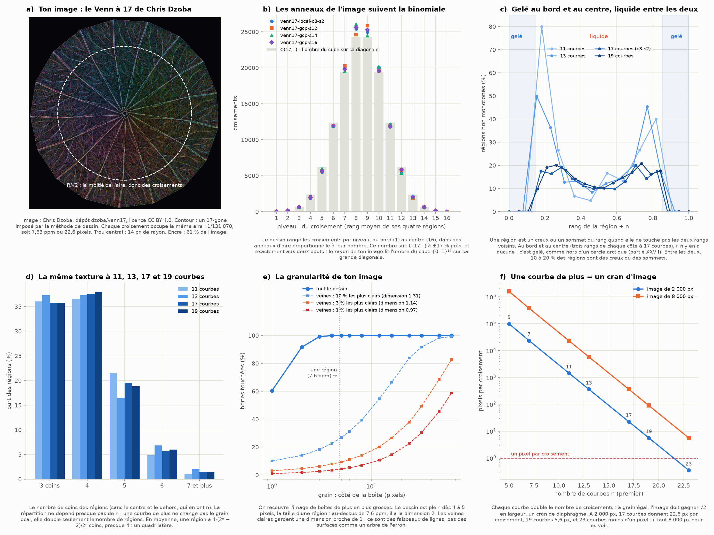
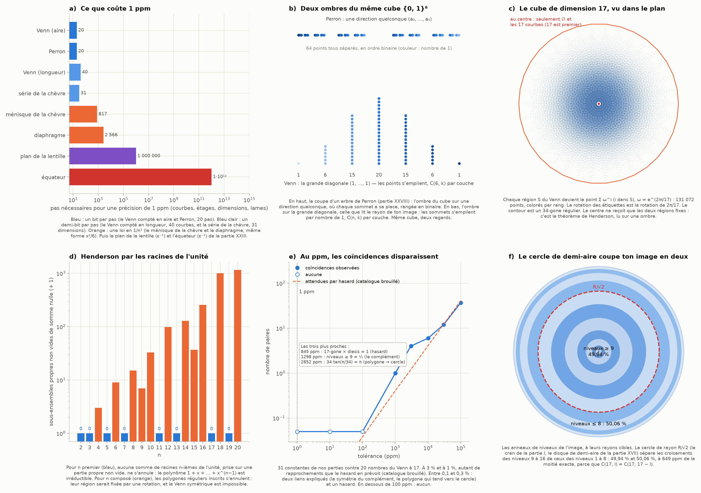

# Partie XXIX : le Venn à 17 au ppm — l'image retrouvée, l'analyse dimensionnelle et deux ombres du même cube

> Ta demande, en réponse à mes deux réserves (je n'avais pas pu confirmer d'où venait ton image, et je n'avais pas de lien en deux dimensions entre un Venn et un arbre de Perron) : « Oui et refaisons avec une analyse dimensionnelle, par ppm avec nos analyses, la granularité, et utilisons ce qu'on a découvert pour déterminer s'il y a des liens avec nos objets. »
>
> Suite de la [partie XXVIII](octaedre-perron-venn.md).

Tout est recalculé par [`scripts/venn_ppm.py`](scripts/venn_ppm.py) (≈ 40 s), à partir du dépôt de Chris Dzoba ([github.com/dzoba/venn17](https://github.com/dzoba/venn17) ; certificats et image sous licence CC BY 4.0). Les tableaux complets sont dans [`resultats/venn_ppm.md`](resultats/venn_ppm.md).

## En bref

- **Ton image est retrouvée.** C'est le dessin qui ouvre le dépôt de Chris Dzoba : un Venn simple et symétrique à 17 courbes, « dessiné à densité de croisements uniforme ». J'ai lu ses fichiers (les « certificats ») et mesuré l'image.
  - Le contour à 17 côtés est imposé par la méthode de dessin, pas par le diagramme.
  - Le dessin se calcule avec 7 710 inconnues, une par forme : c'est le compte de Fermat de la partie XXVIII.
- **Au ppm.**
  - Chaque croisement occupe 1/131 070 de l'aire, soit 7,63 ppm ou 22,6 pixels.
  - Une région moyenne pèse 2⁻¹⁷ = 7,62939453125 ppm : ce sont les chiffres de 5¹⁷ (partie XXVI).
  - Les régions ont de 3 à 11 coins, avec une répartition (36 % de triangles, 38 % de quadrilatères…) qui ne dépend presque pas du nombre de courbes : 11, 13, 17 ou 19.
- **La granularité.**
  - Ton image est pleine dès qu'on la regarde au grain d'une région (4 à 5 pixels, 7,6 ppm d'aire) ; en dessous, ce sont des lignes.
  - Les veines claires ont une dimension proche de 1 : ce sont des faisceaux de lignes.
  - Chaque courbe de plus coûte un cran (√2) de largeur d'image. Les Venn à 23 courbes, annoncés le 6 octobre, demanderaient 8 000 pixels pour garder le grain du 19 à 2 000.
- **L'analyse dimensionnelle.**
  - Pour 1 ppm, il faut 20 courbes à un Venn et 20 étages à un arbre de Perron : un bit par pas, la même marche.
  - La série de la chèvre en demande 31, au même rythme (un demi-bit par pas) que le Venn compté en longueur.
  - Le ménisque de la chèvre (817 dimensions) et le diaphragme (2 566 lames) suivent la même loi en 1/n².
- **Les liens avec nos objets, testés.**
  1. **Perron et ton image sont deux ombres du même cube {0, 1}¹⁷.** Perron le regarde dans une direction quelconque : ses fentes se séparent toutes et fusionnent par moitiés (binaire). Ton image le regarde le long de sa grande diagonale : son rayon suit le nombre d'ensembles, et ses anneaux comptent C(17, l) croisements (binomiale). Même cube, deux regards ; mais les veines ne sont pas des arbres de Perron.
  2. **Le cercle de demi-aire R/√2** (parties I et XVII) coupe ton image en deux moitiés de croisements, à 649 ppm près.
  3. **Gelé et liquide** (partie XXVII). Les trois rangs du bord et les trois du centre sont « gelés » (sans creux ni sommet du rang), le reste est « liquide » (12 % de creux et de sommets).
  4. **Henderson, lu sur une ombre.** Projeté symétriquement dans le plan, le cube de dimension n n'envoie au centre que ∅ et tout si et seulement si n est premier. Pour 17, son contour est un 34-gone : le 34 des aigrettes.
  5. **Au ppm, aucune coïncidence numérique.** Sur 1 240 comparaisons, ce qui reste sous 0,3 % s'explique (deux liens) ou relève du hasard (un cas). Il n'y a rien sous 100 ppm.

---

## 1. Ton image, retrouvée

### 1.1 D'où elle vient (figure 1, panneau a)

- Le dépôt [dzoba/venn17](https://github.com/dzoba/venn17) publie quatre Venn simples et symétriques à 17 courbes, trouvés le 17 septembre 2026, douze à 19 courbes (20 – 23 septembre) et, depuis le 6 octobre, six à 23 courbes. Chaque diagramme est donné par un « certificat » que des programmes vérifient, et une preuve en Lean couvre un exemplaire de chaque taille.
- L'image qui ouvre son README, `venn17-pressure-dark-2000.png`, a exactement ce que tu décrivais : un contour à 17 côtés, des lames en spirale, des filaments ramifiés et un tout petit centre. Sa légende : « drawn at uniform crossing density ».
- Je ne peux pas comparer pixel à pixel avec le fichier que tu m'as envoyé. Mais tout concorde, et je pars de cette image.

### 1.2 Comment elle est dessinée

Le programme de dessin du dépôt (`plotter/plotter_svg.py`) fait trois choses.
1. **Un dessin de Tutte.** Chaque croisement est placé au barycentre de ses quatre voisins, et les 17 croisements qui bordent le dehors sont épinglés sur un 17-gone régulier. **Le contour à 17 côtés est donc un choix de dessin.**
2. **Le calcul passe par les orbites.** Grâce à la symétrie, il ne faut qu'une inconnue par orbite de 17 croisements : 131 070/17 = **7 710 inconnues**. C'est exactement le nombre de « formes » de la partie XXVIII, le compte de Fermat.
3. **Des anneaux à aire égale par croisement.** Les croisements sont rangés par *niveau* : le rang moyen des quatre régions qui les entourent. Le dessin donne à chaque niveau un anneau d'aire proportionnelle à son nombre de croisements : du bord (niveau 1) au centre (niveau 16).

### 1.3 Ce que l'image mesure

- **Le contour.** Ses harmoniques principales sont 17, 34, 51 et 68 : le 17-gone et ses multiples. Il fait 984 px de rayon, pour une aire intérieure de 2 956 870 pixels.
- **La densité.** L'encre (les pixels plus clairs que le fond) couvre 61 % de l'intérieur, de 56 à 63 % selon l'anneau : la densité est bien uniforme.
- **Le trou central** a un rayon de 14,4 px, soit 221 ppm de l'aire.
  - La règle du dessin place les 17 croisements qui l'entourent au rayon √(17/131 070) = 0,0114 R, soit 11,2 px.
  - Le dessin relâche un peu cette cible. Le « tout petit centre » de ton image vient de là : la région qui est dans les 17 ensembles n'a que 17 croisements autour d'elle, et ils n'ont droit qu'à 17 parts d'aire sur 131 070.

---

## 2. Le Venn à 17 au ppm

### 2.1 Les comptes

| | Venn à 17 courbes | en ppm de l'image |
|---|---:|---|
| régions | 131 072 | 7,63 ppm en moyenne |
| croisements | 131 070 (2¹⁷ − 2) | 7,63 ppm chacun, 22,6 pixels |
| arcs | 262 140 | |
| croisements sur chaque courbe | 15 420 | |
| coins d'une région | 3 à 11 (13 pour un autre des quatre) | le centre et le dehors en ont 17 |

- **2⁻¹⁷ = 0,00000762939453125** : les chiffres de 5¹⁷ = 762 939 453 125. C'est le mécanisme de la partie XXVI : 2⁻ʲ s'écrit avec les chiffres de 5ʲ.
- **En moyenne, une région a 4·(2ⁿ − 2)/2ⁿ = 3,99994 coins**, presque un quadrilatère. La raison : chaque croisement est un coin de 4 régions.
- Autour d'un croisement des courbes i et j, les quatre régions sont S, S + i, S + j et S + i + j. Leurs rangs (le nombre d'ensembles) valent donc k, k + 1, k + 1, k + 2 : le niveau du croisement, k + 1, est bien défini.

### 2.2 La texture ne dépend pas du nombre de courbes (panneau d)

| courbes | 3 coins | 4 | 5 | 6 | 7 et plus |
|---:|---|---|---|---|---|
| 11 | 36,0 % | 36,6 % | 21,5 % | 4,8 % | 1,1 % |
| 13 | 37,3 % | 37,3 % | 16,5 % | 6,8 % | 2,1 % |
| 17 (les quatre) | 35,3 – 36,7 % | 36,7 – 38,9 % | 18,4 – 19,5 % | 5,7 – 5,9 % | 1,4 – 1,8 % |
| 19 | 35,7 % | 38,0 % | 18,8 % | 6,0 % | 1,5 % |

**C'est le premier résultat de l'analyse dimensionnelle.** Une courbe de plus ne change pas le grain local : elle double le nombre de régions, et chaque région garde la même forme typique.

### 2.3 Les anneaux suivent la binomiale (panneau b)

- Il y a C(17, l) régions de rang l, et Σ C(17, l) = 2¹⁷ − 2 : en moyenne, un croisement par région.
- Le certificat de l'image en compte N_l au niveau l. Le rapport N_l/C(17, l) va de 0,825 à 1,045, et vaut exactement 1 aux niveaux 1, 2, 15 et 16. Au niveau 8, la binomiale donne 24 310 et le certificat 25 415.
- **Comme chaque anneau a une aire proportionnelle à N_l, le rayon de ton image lit la binomiale.** Or C(17, l) compte les sommets du cube {0, 1}¹⁷ qui ont l coordonnées égales à 1 : c'est l'ombre du cube sur sa grande diagonale (partie XXVIII, § 3.5).

---

## 3. La granularité

### 3.1 Plein au-dessus d'une région, des lignes en dessous (panneau e)

On recouvre l'image de boîtes de plus en plus grosses, et on compte celles qui touchent de l'encre.

| grain | en ppm de l'aire | boîtes touchées |
|---:|---:|---|
| 1 px | 0,34 | 60 % |
| 2 px | 1,35 | 92 % |
| 3 px | 3,04 | 99,2 % |
| 4 px | 5,41 | 99,9 % |
| 5 px | 8,45 | 100 % |

- Une région fait en moyenne 22,6 pixels, soit 4,75 px de côté. **Au-dessus de ce grain (7,6 ppm), ton image est pleine : elle a la dimension 2. En dessous, ce sont des lignes.**
- C'est la granularité des parties XVIII et XXVI. Au grain δ, un ensemble de Kakeya ou un dessin de Venn ne montre que ce que le grain laisse voir.

### 3.2 Les veines sont des lignes

- Les veines sont les traits les plus clairs, là où beaucoup d'arcs passent côte à côte. Leur dimension de comptage de boîtes, entre 3 et 32 pixels, vaut :
  - 0,97 pour le 1 % le plus clair ;
  - 1,14 pour les 3 % les plus clairs ;
  - 1,31 pour les 10 % les plus clairs.
- **Ce sont des faisceaux de lignes qui se ramifient, pas des surfaces.** Un arbre de Perron est le contraire : une surface (dimension 2) dont l'aire s'évanouit lentement.

### 3.3 Une courbe de plus = un cran d'image (panneau f)

| courbes | croisements | pixels par croisement à 2 000 px | à 8 000 px |
|---:|---:|---|---|
| 11 | 2 046 | 1 445 | 23 123 |
| 13 | 8 190 | 361 | 5 777 |
| 17 | 131 070 | 22,6 | 361 |
| 19 | 524 286 | 5,64 | 90,2 |
| 23 | 8 388 606 | 0,35 | 5,64 |

- Chaque courbe double le nombre de croisements. **Pour garder le même grain, l'image doit gagner √2 en largeur : un cran de diaphragme par courbe** (partie I).
- Les Venn à 23 courbes existent depuis le 6 octobre (six certificats de 889 Mo chacun ; le dépôt n'en publie pas encore de dessin). À 2 000 px, ils n'auraient pas un pixel par croisement (0,35) ; à 8 000 px, ils en auraient 5,6, comme le 19 à 2 000.

---

## 4. L'analyse dimensionnelle : ce que coûte 1 ppm (figure 2, panneau a)

On compare nos objets par la **loi** qui relie leur nombre de pas (courbes, étages, dimensions, lames) au grain qu'ils atteignent. C'est l'esprit de l'analyse dimensionnelle des physiciens : des objets de nature différente se comparent par leurs exposants. Le même exposant est un indice de même mécanisme.

| objet | rythme | pour 1 ppm |
|---|---|---|
| Venn, grain compté en aire | 1 bit par courbe | 20 courbes (log₂ 10⁶ = 19,93) |
| Perron, branches de largeur 2⁻ᵏ | 1 bit par étage | 20 étages |
| Venn, grain compté en longueur | ½ bit par courbe | 40 courbes (39,86) |
| la série de la chèvre (partie XXV) | ½ bit par dimension (le facteur √2) | 31 dimensions |
| le ménisque de la chèvre, 2/(3n²) | n ∝ ε^(−1/2) | 817 dimensions |
| le diaphragme à N lames, 2π²/(3N²) | n ∝ ε^(−1/2) | 2 566 lames |
| le plan de la lentille (partie XXIII) | n ∝ ε⁻¹ | 10⁶ dimensions |
| l'équateur (partie I) | n ∝ ε⁻² | 10¹² dimensions |
| Kakeya au grain 1 ppm | 1/aire : + 0,441 par bit | aire entre 0,1008 et 0,2536 (démontré) |

**Ce que ça dit.**
- **Le Venn et Perron sont sur la même marche** : un bit par pas. Un Venn à n courbes et un arbre de Perron à n étages découpent tous deux en 2ⁿ morceaux de 2⁻ⁿ.
- **La série de la chèvre va au rythme du Venn compté en longueur** : un demi-bit par pas, 6,644 pas par décade. C'est le cran de la partie I : √2 en longueur, 2 en aire, et 6,644 crans par décade comme aux parties XXI et XXVII.
- **Le ménisque de la chèvre et le diaphragme** suivent la même loi en 1/n², avec la même forme x²/6 : x = 2/n pour la chèvre, x = 2π/N pour le polygone. Le même exposant, mais je n'ai pas démontré que c'est le même ménisque.
- **2²⁰ = 1 048 576, le « méga » binaire.** 10⁶/2²⁰ = 0,95367431640625 a les chiffres de 5²⁰ (partie XXVI) : un ppm décimal vaut 0,954 « ppm binaire ».

---

## 5. Les liens avec nos objets

### 5.1 Perron et ton image : deux ombres du même cube (figure 2, panneau b)

**Ce qui est partagé exactement.**
- Les deux objets sont le cube {0, 1}ⁿ dessiné : chaque région du Venn, comme chaque branche de Perron, est un sommet du cube, une suite de n chiffres binaires.
- Les deux sont construits en doublant : chaque courbe double les régions, chaque étage double les branches.
- La partie XXVIII a démontré que chaque coupe d'un arbre de Perron est un Venn à une dimension, et elle avait déjà nommé les deux ombres (§ 3.5). Ce qui est nouveau ici, c'est la mesure : on voit laquelle des deux ombres ton image dessine.

**Ce qui les sépare : la direction de l'ombre.**
- **Perron regarde le cube dans une direction quelconque** (a₀, …, a_(k−1)) (partie XXVIII, § 2.4). Les 2ᵏ sommets y restent séparés, rangés dans l'ordre binaire, et fusionnent par moitiés : 2^(k−j) fentes au niveau j, une suite géométrique.
- **Ton image regarde le cube le long de sa grande diagonale.** Le rayon suit le nombre de 1, et les anneaux comptent environ C(17, l) croisements : une binomiale.

**Ce que ça transporte.** Une réponse précise à « les Perron de mon image » : même objet (le cube), deux regards.
- Le regard de Perron sépare tout et fusionne en binaire.
- Le regard du Venn empile par couches.
- **Les veines de ton image ne sont donc pas des arbres de Perron** : elles n'ont ni la loi de comptage binaire ni la dimension 2 (§ 3.2).

**Ce qui reste ouvert.** Un dessin du Venn où la structure binaire de Perron apparaîtrait en deux dimensions. Je n'en connais pas. La question de la partie XXVIII (§ 3.5) reçoit donc une réponse partielle : lu le long d'un rayon, ce dessin a la structure en couches, pas celle de Perron.

### 5.2 Le cercle de demi-aire coupe ton image en deux (figure 2, panneau f)

- Comme C(17, l) = C(17, 17 − l), la binomiale met exactement la moitié des croisements aux niveaux 9 à 16, et l'autre moitié aux niveaux 1 à 8.
- Dans un dessin à aire égale par croisement, la frontière est donc le cercle de rayon R/√2 : le cran de la partie I (« le diaphragme qui laisse passer la moitié de la lumière »), le disque de demi-aire de la partie XVII.
- Le certificat de l'image n'est pas exactement symétrique : il met 49,935 % des croisements dedans, à 649 ppm de la moitié. Les trois autres Venn à 17 courbes sont à +2 853, −3 761 et −1 816 ppm.

### 5.3 Gelé et liquide (figure 1, panneau c)

**La définition.** Une région de rang k est *monotone* quand elle touche une région de rang k − 1 et une de rang k + 1 (Bultena, Grünbaum et Ruskey). Sinon, c'est un creux ou un sommet de la « hauteur » qu'est le rang.

**Ce qu'on mesure.**

| courbes | régions non monotones | creux | sommets | rangs sans aucune (gelés) |
|---:|---:|---:|---:|---|
| 11 | 319 (15,6 %) | 165 | 154 | 0, 1, 10, 11 |
| 13 | 1 222 (14,9 %) | 624 | 598 | 0, 1, 12, 13 |
| 17 (l'image) | 15 742 (12,0 %) | 7 888 | 7 854 | 0, 1, 2, 15, 16, 17 |
| 19 | 68 210 (13,0 %) | 34 010 | 34 200 | 0, 1, 2, 17, 18, 19 |

Mes comptes retrouvent ceux du dépôt (`verify/RESULTS.md` : 319, 1 222, puis 15 742, 16 592, 15 249 et 15 708 pour les quatre Venn à 17 courbes ; 68 210 pour ce Venn à 19) : c'est une vérification indépendante. Pour les Venn à 23 courbes, l'article donne 14 % (52 742 orbites de régions sur 364 722 pour le certificat c25) : la part des régions liquides ne varie pas régulièrement avec n.

**Analogie de structure (même procédé).**
- **Ce qui est partagé.** Le rang est une hauteur qui change de ±1 à chaque traversée de courbe, comme la hauteur des pavages de la partie XXVII.
  - Une région monotone continue la pente : c'est le régime gelé.
  - Un creux ou un sommet la casse : c'est le régime liquide.
- **Ce que ça transporte.** Les Venn de Dzoba ont, comme les pavages au hasard, une couche gelée au bord et au centre et un intérieur liquide. Leurs diagrammes viennent d'ailleurs d'une marche aléatoire (Metropolis), comme nos dominos venaient d'une dynamique de Glauber.
- **Ce qui diffère, mesuré.** La couche gelée garde la même épaisseur (2 ou 3 rangs de chaque côté) de 11 à 19 courbes : elle ne pèse que 0,23 % des régions à 17 courbes, et sa part diminue quand n grandit. Les pavages, eux, gèlent une part fixe de l'aire (21,5 % pour le losange). Il n'y a donc pas de « cercle arctique » macroscopique ici.
- **Ce qui reste ouvert.** Une forme limite pour des Venn symétriques tirés au hasard, quand n grandit.

### 5.4 Henderson, lu sur une ombre ; le 34-gone (figure 2, panneaux c et d)

**L'ombre symétrique.** On envoie chaque région S sur le point Σ_(i∈S) ω^i du plan, avec ω = e^(2iπ/n). La rotation des étiquettes (i → i + 1) devient la rotation de 2π/n.

**Le théorème (démontré ici).** Le centre de cette ombre ne reçoit que ∅ et l'ensemble de toutes les courbes **si et seulement si n est premier**.
- *n premier.* Une partie S de somme nulle ferait de ω une racine du polynôme Σ_(i∈S) x^i, de degré au plus n − 1. Or le polynôme minimal de ω est 1 + x + … + x^(n−1) : il faudrait que S soit tout.
- *n composé, n = p·m.* Les sommets d'un p-gone régulier inscrit, {0, m, 2m, …}, ont une somme nulle.
- Le script compte ces sommes nulles pour n ≤ 20 : 0 pour 2, 3, 5, 7, 11, 13, 17 et 19 ; 2, 8, 14, 6, 32… pour les autres.
- **C'est le théorème de Henderson (partie XXVIII, § 3.1) vu sur une ombre.**
  - Un ensemble que la rotation de m crans laisse en place a un point que la multiplication par ω^m ne bouge pas : ce point est le centre.
  - Pour n premier, le centre ne reçoit que ∅ et tout. La rotation ne fixe donc aucune autre région : elle range les 2ⁿ − 2 régions en orbites de n, d'où n | 2ⁿ − 2 (Fermat, les 7 710 formes de la partie XXVIII) et n | C(n, k), la condition de Henderson.
  - Pour n composé, les polygones réguliers {0, m, 2m, …} sont fixés par une rotation : ils tombent au centre, et C(n, k) n'est plus toujours divisible par n. Le centre reçoit aussi des réunions de polygones qu'aucune rotation ne fixe (pour n = 12, par exemple, un diamètre et un triangle) : de Bruijn (1953) a montré que, quand n n'a que deux facteurs premiers, toutes les sommes nulles sont de ce type.

**Le 34-gone.**
- Le contour de cette ombre est le polygone engendré par les 17 vecteurs ω^i. Comme 17 est impair, ces vecteurs et leurs opposés donnent 34 directions : le contour est un **34-gone régulier** (vérifié : rayons égaux à 10⁻¹⁵ près).
- C'est le 34 des aigrettes et du diaphragme de Perron (partie XXVIII), et c'est l'hexagone pour n = 3 : l'ombre du cube ordinaire le long de sa grande diagonale.
- Pour les sommets de rang k, le carré de la distance au centre vaut en moyenne k(n − k)/(n − 1) (vérifié pour k = 1, 4, 8, 9, 13 et 16). Les rangs moyens sont au loin, ∅ et tout au centre.

### 5.5 Au ppm, les coïncidences disparaissent (figure 2, panneau e)

**La méthode.**
- On prend 31 constantes de nos parties (la corde d'Ullisch, √2, 1/√2, φ, arccos(1/3), le diesis, les 35,10 %, π·ln 2…) et 20 nombres du Venn à 17 (2⁻¹⁷, la part des triangles, cos(2π/17), la lumière du 17-gone…).
- On compare chaque paire directement (b ≈ a) et en inverse (a·b ≈ 1) : 1 240 comparaisons.
- Pour savoir ce que donne le hasard, on brouille les nombres du Venn (chacun multiplié par un facteur aléatoire à ±20 % près, 4 000 tirages) : ils gardent leur répartition, mais perdent toute relation exacte.

| tolérance | observées | attendues par hasard |
|---|---:|---|
| 3 % | 12 | 12,3 |
| 1 % | 6 | 4,1 |
| 0,3 % | 4 | 1,2 |
| 0,1 % | 1 | 0,41 |
| 100 ppm | 0 | 0,038 |
| 1 ppm | 0 | moins de 0,0003 |

**Les plus proches.**
- 845 ppm : la lumière du 17-gone × le diesis 128/125 ≈ 1. C'est un hasard : le compte attendu à 0,1 % est 0,41.
- 1 298 ppm (en relatif ; 649 ppm du total) : la part des niveaux ≥ 9 ≈ ½. C'est expliqué, par la symétrie du complément (§ 5.2).
- 2 852 ppm : 34·tan(π/34) ≈ π. C'est expliqué : le polygone circonscrit tend vers le cercle (partie XXVIII).
- À 1,9 %, la part des triangles (35,8 %) frôle les 35,10 % des ombres égales de l'octaèdre. À ce grain, c'est exactement ce que le hasard produit.

**Ce que ça dit.** À 1 %, les rapprochements sont aussi nombreux que le hasard le prévoit. **Au ppm, il ne reste rien.** Les liens qui tiennent sont des liens de structure (le cube, la binomiale, la parité, le cercle de demi-aire), pas des égalités de nombres. C'est la règle de la partie XVIII (« un chiffre certain par niveau ») appliquée aux rapprochements.

---

## 6. Le tri

**Exact (démontré ici ou classique) :**
- 2⁻¹⁷ = 7,62939453125·10⁻⁶ et les chiffres de 5¹⁷ ; 10⁶/2²⁰ et ceux de 5²⁰ ;
- les comptes d'un Venn simple à n courbes : 2ⁿ − 2 croisements (Euler), 4·(2ⁿ − 2)/2ⁿ coins en moyenne, les rangs k, k + 1, k + 1, k + 2 autour de chaque croisement ;
- Σ C(17, l) = 2¹⁷ − 2 et la moitié exacte de la binomiale de part et d'autre du niveau 8,5 ;
- l'ombre symétrique : son centre ne reçoit que ∅ et tout si et seulement si n est premier (démontré ici), le 34-gone, le carré moyen k(n − k)/(n − 1) ;
- les lois de la partie 4 (bits par pas, lois en 1/n et 1/n²).

**Calculé :**
- dans les certificats : la texture des coins (11, 13, 17 et 19 courbes), les croisements par niveau, les régions non monotones (mes comptes retrouvent ceux du dépôt) ;
- dans l'image : le contour (harmonique 17), le trou central (14,4 px), l'encre (61 %), le remplissage selon le grain, la dimension des veines ;
- le test des coïncidences (1 240 comparaisons, 4 000 tirages brouillés).

**Analogie de structure (même procédé), donc un résultat :**
- **Perron et ton image, deux ombres du même cube.** Ce qui est partagé : le cube {0, 1}ⁿ, dessiné sans répétition et construit en doublant. Ce que ça transporte : les deux lois de comptage (binaire pour Perron, binomiale pour l'image). Ce qui reste ouvert : un dessin du Venn qui montrerait la structure binaire de Perron en deux dimensions.
- **Gelé et liquide.** Ce qui est partagé : une hauteur à pas de ±1, monotone (gelée) ou non (liquide). Ce que ça transporte : des couches gelées au bord et au centre, de 2 à 3 rangs. Ce qui reste ouvert : une forme limite quand n grandit.
- **Une courbe = un cran.** Ce qui est partagé : un doublement par pas. Ce que ça transporte : √2 de largeur d'image par courbe, comme un cran de diaphragme (partie I).
- **Le 34.** Ce qui est partagé : 17 est impair, donc 17 directions et leurs opposées en font 34. Ce que ça transporte : les aigrettes, les éventails de Perron (partie XXVIII) et le contour de l'ombre du cube de dimension 17.

**Mes lectures (corrige-moi si je t'ai mal compris) :**
- **« Analyse dimensionnelle ».** Je l'ai lue de trois façons : les lois qui relient le nombre de pas au grain (§ 4), la dimension du dessin selon le grain (§ 3), et la dimension du cube, n = 17 (§ 5). Si tu pensais à autre chose (des unités physiques, par exemple), dis-le-moi.
- **« Par ppm ».** Je l'ai pris comme unité commune : pour les aires du dessin (7,63 ppm par croisement), pour le grain, et comme seuil pour juger une coïncidence.
- **Ton image.** Je suis parti du rendu du README, qui correspond en tout à ta description. Je ne sais pas lequel des quatre certificats il dessine : j'ai pris celui qui a été vérifié en Lean (c3-s2), et les trois autres donnent les mêmes tendances.
- **Les veines.** Je les lis comme des faisceaux d'arcs que le dessin de Tutte serre les uns contre les autres. Je n'ai pas cherché d'où vient leur ramification dans le diagramme lui-même.

**Ouvert :**
- un dessin du Venn où la structure de Perron apparaîtrait en deux dimensions ;
- l'origine des veines : quelle structure du diagramme le dessin de Tutte rend visible ;
- une forme limite pour des Venn symétriques au hasard, et la stabilité de la texture (36 % de triangles) au-delà de 19 courbes ;
- si le ménisque de la chèvre (x = 2/n) et celui du polygone (x = 2π/N) sont le même ménisque, au-delà du même exposant.

**Pas établi :** que l'espace physique suive ce modèle à 10⁻⁵⁰ m. C'est un postulat (partie XX, § 8).

## Sources

**Les parties reliées**
- [I](README.md) : le cran, le diaphragme qui laisse passer la moitié de la lumière ;
- [XVII](recursion-argent.md) : le disque de demi-aire 1/√2 ;
- [XVIII](pixels-longitudes.md) : le grain, un chiffre certain par niveau ;
- [XXIII](lentilles-boules-grain.md) et [XXV](tranche-aiguilles.md) : les taux de change du grain, la série de la chèvre ;
- [XXIV](tiers-dimension.md) : le ménisque 2/(3n²), démontré ;
- [XXVI](kakeya-miroir.md) : 2⁻ʲ et les chiffres de 5ʲ, Kakeya au grain δ ;
- [XXVII](carte-connexions.md) : les cercles arctiques, gelé et liquide ;
- [XXVIII](octaedre-perron-venn.md) : Henderson, Fermat, les coupes de Perron comme Venn, le 34.

**Littérature et données**
- C. Dzoba, [« Simple symmetric Venn diagrams with 17, 19 and 23 curves »](https://arxiv.org/abs/2609.26546) (arXiv:2609.26546, version du 6 octobre 2026), et le dépôt [dzoba/venn17](https://github.com/dzoba/venn17) : les certificats, le programme de dessin (`plotter/plotter_svg.py`, licence MIT) et l'image `images/venn17-pressure-dark-2000.png` (licence [CC BY 4.0](https://creativecommons.org/licenses/by/4.0/)).
- W. T. Tutte, « How to draw a graph », *Proceedings of the London Mathematical Society* 13, 743–767 (1963) : le dessin par barycentres.
- B. Bultena, B. Grünbaum, F. Ruskey, « Convex drawings of intersecting families of simple closed curves », *Canadian Conference on Computational Geometry* (1999) : les Venn monotones.
- D. W. Henderson, « Venn diagrams for more than four classes », *American Mathematical Monthly* 70, 424–426 (1963) ; J. Griggs, C. E. Killian, C. D. Savage, [« Venn diagrams and symmetric chain decompositions in the Boolean lattice »](https://www.combinatorics.org/ojs/index.php/eljc/article/view/v11i1r2) (2004).
- T. Y. Lam, K. H. Leung, « On vanishing sums of roots of unity », *Journal of Algebra* 224, 91–109 (2000) : les sommes nulles de racines de l'unité.
- N. G. de Bruijn, « On the factorization of cyclic groups », *Indagationes Mathematicae* 15, 370–377 (1953) : pour n = p^a·q^b, les sommes nulles sont des réunions de polygones réguliers.
- F. Ruskey, M. Weston, [« A Survey of Venn Diagrams »](https://www.combinatorics.org/files/Surveys/ds5/VennSymmEJC.html), *Electronic Journal of Combinatorics*, Dynamic Survey DS5.
- Wikipédia : [Venn diagram](https://en.wikipedia.org/wiki/Venn_diagram), [Box counting](https://en.wikipedia.org/wiki/Box_counting), [Tutte embedding](https://en.wikipedia.org/wiki/Tutte_embedding), [Dimensional analysis](https://en.wikipedia.org/wiki/Dimensional_analysis).
