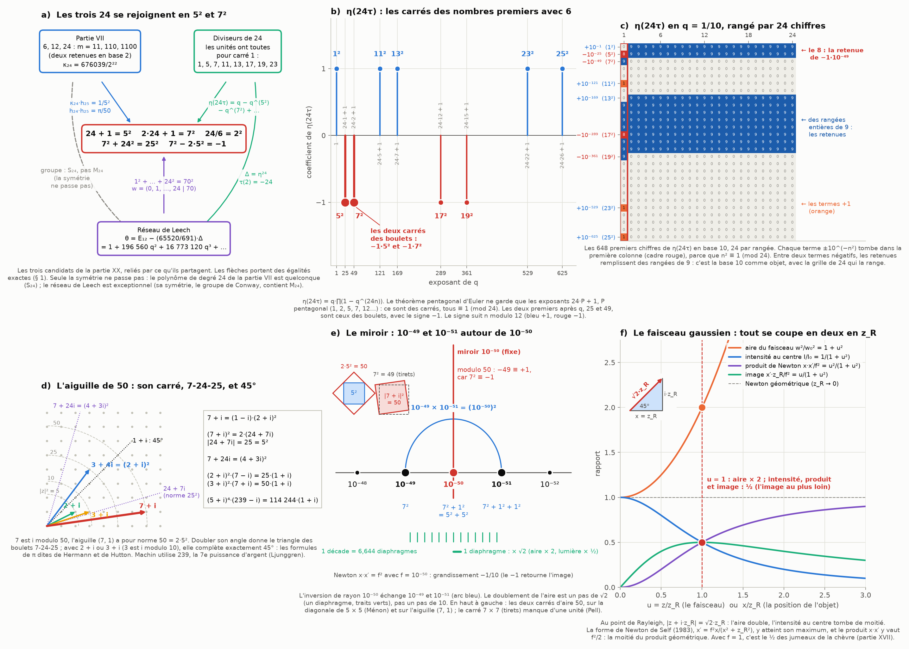
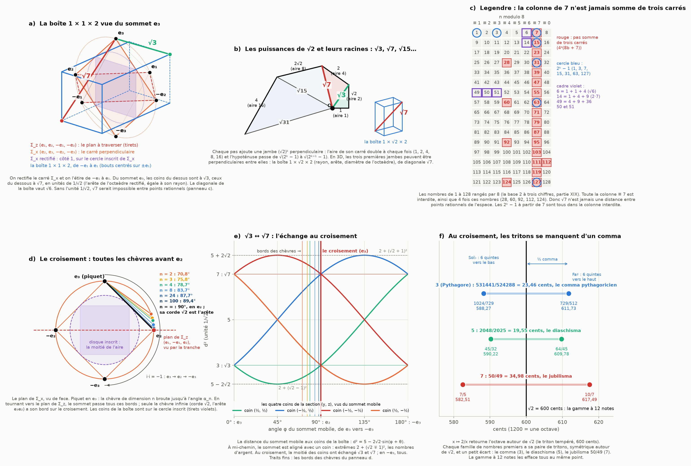

# Partie XXI : les trois 24 se rejoignent en 5² et 7² — le miroir 49-50-51, √7 vu du sommet e₃ et le croisement du plan

> Ta réponse à la partie XX.
> - Pour 24, j'avais vu trois candidats (la partie VII, les diviseurs de 24, le réseau de Leech) sans savoir lequel tu visais : il faut les connecter.
> - Établir 10⁻⁵⁰ comme le reflet inverse du foyer 10⁻⁴⁹ (−1·(7²)), et 10⁻⁵¹ comme le doublement de l'aire, donc la lumière divisée par deux.
> - Connecter encore les puissances et leurs racines : √7 s'obtient dans un parallélépipède 1 × 1 × 2.
> - Les bouts de ce parallélépipède demandent de le construire en rectifiant l'octaèdre par le sommet e₃, sur la face d'un carré perpendiculaire à celui que forment e₁, −e₁ et e₂.
> - Attention à la position de e₃ sur ce carré : il ne peut pas traverser le plan de e₁, −e₁, e₂ sans passer par l'analyse de la chèvre. Le comma, le partage d'aire et le retournement de l'aiguille passent par ce croisement, et par ses cercles inscrit et circonscrit.
>
> Suite de la [partie XX](sphere-faisceaux.md).

Tout est recalculé par [`scripts/vingt_quatre_miroir.py`](scripts/vingt_quatre_miroir.py) (≈ 10 s). Les tableaux complets sont dans [`resultats/vingt_quatre_miroir.md`](resultats/vingt_quatre_miroir.md).

**Suite : [Partie XXII — le carré de neuf points : √2 là où les pas de 10 se précipitent, les chèvres de 1 à √2, et 24 pour la sphère 24D](carre-neuf-points.md).**

## En bref

- **Les trois 24 se rejoignent, par trois carrés : 24 + 1 = 5², 2·24 + 1 = 7², 24/6 = 2².**
  - **Leech.** 1² + 2² + … + 24² = 70², et 24 est le seul nombre après 1 qui fasse ça (Watson, 1918). C'est de là que Conway tire le réseau de Leech.
  - **Les diviseurs de 24.** Les unités modulo 24 ont toutes pour carré 1. Résultat : η(24τ) = q − q²⁵ − q⁴⁹ + q¹²¹ + … n'a que des exposants carrés. Les deux premiers après q sont 5² et 7², avec le signe −1 : c'est ton « −1·(7²) », littéralement.
  - **La partie VII.** κ₂₄·h₂₅ = 1/5² et h₂₄·h₂₅ = π/50 : le 25 des boulets et le 50 du miroir.
  - **Ce qui ne passe pas : la symétrie.** Notre polynôme de degré 24 a le groupe le plus banal (S₂₄), Leech l'un des plus exceptionnels (M₂₄).
- **Le miroir 49-50-51 est exact, de trois façons.**
  - L'inversion : 10⁻⁴⁹ × 10⁻⁵¹ = (10⁻⁵⁰)².
  - Modulo 50 : 7² ≡ −1, donc 7 est un i.
  - Pell : 7² = 2·5² − 1.
  - En prime, l'aiguille de 50, (7, 1), élevée au carré, donne le triangle 7-24-25 des boulets. Avec deux fois l'aiguille de 10, (3, 1), elle fait exactement 45°.
- **Le doublement de l'aire est exact sur un pas de √2, pas sur un pas de 10.**
  - Le Ménon : 50 = 2·5².
  - Le diaphragme.
  - Le faisceau gaussien : au point de Rayleigh, l'aire double, la lumière tombe de moitié, et le produit de Newton aussi (Self, 1983).
  - Une décade de longueur, comme de 10⁻⁵⁰ à 10⁻⁵¹, fait 6,644 doublements.
- **√7 sort bien de ta boîte 1 × 1 × 2.**
  - Construite comme tu le dis et vue du sommet e₃, elle a ses coins à √3 et √7, en unités de 1/√2.
  - Cette unité est obligatoire : √7 n'est jamais la distance de deux points à coordonnées rationnelles (Legendre).
- **e₃ ne peut pas traverser le plan sans passer la chèvre.**
  - En tournant vers e₂, il passe le bord des chèvres de toutes les dimensions. Seule la chèvre infinie a son bord pile au croisement.
  - Au croisement, trois choses arrivent ensemble : √3 et √7 s'échangent ; le disque inscrit a la moitié de l'aire ; le triton √2 sépare les deux chemins de quintes d'un comma.

---

## 1. Les trois 24 : une seule arithmétique

**Le point commun, ce sont trois carrés.** 24 + 1 = 25 = 5², 2·24 + 1 = 49 = 7², 24/6 = 4 = 2². Aucun autre nombre que 0 ne fait les trois à la fois. Chacun de tes trois candidats utilise ces carrés à sa façon.

### Les boulets de Leech

Empile des boulets en pyramide à base carrée : 1 au sommet, puis 4, 9, 16… Le total vaut 1² + 2² + … + n² = n(n + 1)(2n + 1)/6. Lucas a demandé en 1875 quand ce total est lui-même un carré. Pour n = 24 :

1² + 2² + … + 24² = 24·25·49/6 = 2²·5²·7² = 4900 = 70².

- **Pourquoi ça marche.** Les trois facteurs n/6, n + 1 et 2n + 1 sont des carrés en même temps.
- **Pourquoi c'est rare.** Que n + 1 et 2n + 1 soient tous deux des carrés, c'est l'équation de Pell de √2 : n = 0, 24, 840, 28560, 970224… Parmi ceux-là, seul 24 a aussi n/6 carré. Watson a démontré en 1918 qu'il n'y a pas d'autre solution que 1 et 24 (le script le vérifie jusqu'à 200 000).
- **Le lien avec Leech.** Conway (1983) prend le vecteur w = (0, 1, 2, …, 24 | 70) dans un espace à 26 dimensions où la dernière coordonnée compte en négatif. Sa « longueur » vaut 0² + 1² + … + 24² − 70² = 0. Le réseau de Leech sort de ce vecteur nul : ce sont les points perpendiculaires à w, pris modulo w.
- **Le carré qui manque.** Les 24 carrés de côtés 1 à 24 ont ensemble l'aire du carré 70 × 70, mais on ne peut pas les y ranger sans trou. On l'a vérifié par ordinateur, puis démontré sans ordinateur en 2024. Le meilleur rangement envoyé à Martin Gardner laisse vide une aire de 49 : il omet le carré 7 × 7. Encore un −7².

### Le pont : les nombres pentagonaux et η(24τ)

Les nombres pentagonaux sont 1, 2, 5, 7, 12, 15, 22, 26… Pour chacun, 24·P + 1 est un carré :
- 24·1 + 1 = 5² et 24·2 + 1 = 7², les deux carrés des boulets ;
- puis 24·5 + 1 = 11², 24·7 + 1 = 13², et ainsi de suite.

Euler a montré que ce sont exactement les exposants qui survivent quand on développe le produit (1 − x)(1 − x²)(1 − x³)… (le théorème pentagonal). En prenant x = q²⁴ et en multipliant par q, on obtient la fonction η de Dedekind :

η(24τ) = q − q²⁵ − q⁴⁹ + q¹²¹ + q¹⁶⁹ − q²⁸⁹ − q³⁶¹ + q⁵²⁹ + q⁶²⁵ + …

- **Ce que ça veut dire.** Tous les exposants sont des carrés de nombres premiers avec 6, et ils valent tous 1 modulo 24. C'est parce que les unités modulo 24 (1, 5, 7, 11, 13, 17, 19, 23) ont toutes pour carré 1. On l'a vu à la partie XIX : seuls les diviseurs de 24 ont cette propriété.
- **Le signe.** −1 devant 5² et 7², +1 devant 11² et 13², et ainsi de suite selon n modulo 12. Le terme −q⁴⁹ est ton −1·(7²).
- **En base 10** (figure v1, panneau c). Pose q = 1/10. Le terme −q⁴⁹ devient −1·10⁻⁴⁹, et η(24τ) s'écrit 0,0, puis 23 chiffres 9, un 8, 24 chiffres 9, 71 zéros, et un 1 au 121ᵉ chiffre. Rangés par 24 chiffres, tous les termes tombent dans la première colonne, et les retenues remplissent des rangées entières de 9. C'est la base 10 comme objet (partie XIX), rangée par la grille de 24.

### Δ = η²⁴ et le réseau de Leech

Élève η à la puissance 24 : on obtient Δ = q − 24q² + 252q³ − 1472q⁴ + …, la forme modulaire la plus célèbre (ses coefficients sont les τ(n) de Ramanujan). Le nombre de points du réseau de Leech à chaque distance se lit dans E₁₂ − (65520/691)·Δ :

| n | σ₁₁(n) | τ(n) | σ₁₁(n) − τ(n) | points à distance √(2n) |
|---:|---:|---:|---|---:|
| 1 | 1 | 1 | 0 | 0 |
| 2 | 2049 | −24 | 2073 = 3·691 | 196 560 |
| 3 | 177148 | 252 | 176896 = 256·691 | 16 773 120 |

- **Aucun point à distance √2, et 196 560 à distance 2.** C'est le nombre de sphères qui en touchent une dans l'empilement de Leech, le maximum possible en dimension 24.
- **Le −24 de τ(2) vient directement de la puissance 24.** Il faut qu'il soit là pour que 2049 + 24 se divise par 691. C'est la congruence de Ramanujan (1916) : τ(n) ≡ σ₁₁(n) (mod 691).
- **Les boulets et Δ sont deux faces du même objet.** Borcherds (1990) a montré que le vecteur w des boulets est le « vecteur de Weyl » d'une algèbre (le « faux monstre »), dont la formule contient ∏(1 − e^(mw))²⁴, c'est-à-dire Δ.

### La partie VII

- **κ₂₄ = C(24, 12)/2²⁴ = 676039/4194304**, la chance de tirer exactement 12 piles sur 24 lancers. Les dimensions 6, 12 et 24 (m = 11, 110, 1100 en binaire, deux retenues) sont les diviseurs de 24 de la forme 3·2ᵏ.
- **Les réciprocités.** κ₂₄·h₂₅ = 1/25 = 1/5² (partie VII), et h₂₄·h₂₅ = π/50 (partie IV). La paire de dimensions (24, 25) porte le 5² des boulets et le 50 du miroir.

### Ce qui ne passe pas

- **La symétrie.** Le polynôme de degré 24 de la partie VII a pour groupe de Galois S₂₄, le plus général, sans structure particulière.
- **Leech, au contraire,** se construit avec le code de Golay, dont la symétrie est le groupe de Mathieu M₂₄, un objet exceptionnel.
- **La conclusion :** les trois 24 se rejoignent par l'arithmétique (5², 7², les diviseurs, les pentagones), pas par la symétrie. Je le dis pour qu'on ne cherche pas M₂₄ dans la chèvre : il n'y est pas.

## 2. 10⁻⁵⁰, reflet inverse de 10⁻⁴⁹

**L'inversion.** Prends 10⁻⁵⁰ comme unité. Alors 10⁻⁴⁹ vaut 10 et 10⁻⁵¹ vaut 1/10 : x ↦ 1/x les échange, et 10⁻⁵⁰ reste fixe. C'est le miroir (figure v1, panneau e).
- **En optique**, c'est la forme de Newton x·x′ = f² (partie XVII), avec f = 10⁻⁵⁰. Le grandissement vaut −f/x = −1/10 : l'image est retournée (le −1) et dix fois plus petite.
- **Sur les exposants**, c'est la symétrie s ↦ 100 − s autour de 50.

**Ton « −1·(7²) » est exact trois fois.**
1. **Dans η(24τ).** Le terme −q⁴⁹ a pour coefficient −1 et pour exposant 7² (§ 1).
2. **Modulo 50.** 7² = 49 ≡ −1, donc 7 est un i : les deux racines de −1 modulo 50 sont 7 et 43. C'est le théorème de la partie XIX, avec l'aiguille 50 = 7² + 1². Du coup, l'exposant −49 = −1·7² vaut +1 modulo 50 : 10⁻⁴⁹ est exactement un cran au-dessus du miroir.
3. **Pell.** 7² − 2·5² = −1. Le 7 rate le double du carré de 5 d'une seule unité : c'est le couple « côté et diagonale » des Grecs (Théon de Smyrne).

**49, 50, 51 en sommes de carrés.**

| n | sommes de deux carrés | sommes de trois carrés |
|---:|---|---|
| 49 | 0² + 7² | 0² + 0² + 7² ; 2² + 3² + 6² |
| 50 | 1² + 7² ; 5² + 5² | 0² + 1² + 7² ; 0² + 5² + 5² ; 3² + 4² + 5² |
| 51 | — | 1² + 1² + 7² ; 1² + 5² + 5² |

- **Une dimension par cran.** 49, 50, 51 = 7², 7² + 1², 7² + 1² + 1² : l'aiguille (7), puis (7, 1), puis (7, 1, 1).
- **50 est le premier nombre à deux écritures.** C'est le plus petit nombre qui s'écrit de deux façons comme somme de deux carrés non nuls (1² + 7² et 5² + 5²). C'est là que l'aiguille (7, 1) et la diagonale du carré 5 × 5 ont la même longueur.

**L'aiguille de 50** (figure v1, panneau d).
- **Sa forme.** 7 + i = (1 − i)(2 + i)² : c'est l'aiguille 3-4-5 de la partie XIV, tournée de −45° et agrandie de √2.
- **Au carré, elle donne le triangle des boulets.** (7 + i)² = 48 + 14i = 2·(24 + 7i), et 7² + 24² = 25².
  - Le triangle 7-24-25 est celui dont l'hypoténuse, 25 = 5², est elle-même un carré, et dont la jambe vérifie 7² = 2·24 + 1.
  - La partie XIII l'avait croisé sans savoir quoi en faire : avec la corde 6/5, la chèvre touche le bord du pré en (7/25, 24/25).
- **Avec 45°.** (3 + i)²·(7 + i) = 50·(1 + i), donc 2·arctan(1/3) + arctan(1/7) = π/4 (formule dite de Hutton).
  - Or 3 et 7 sont i et −i modulo 10 (partie XIX). Les deux aiguilles de la base 10 se complètent exactement en 45°, la diagonale 1x, 1y.
  - Même chose avec 2 + i : 2·arctan(1/2) − arctan(1/7) = π/4 (dite de Hermann). Les attributions de ces deux formules sont incertaines.
- **Machin (1706)** calcule π avec 4·arctan(1/5) − arctan(1/239). Or 239 + 169√2 = (1 + √2)⁷, la septième puissance d'argent, et 239² + 1 = 2·13⁴. Ljunggren a démontré en 1942 que x² + 1 = 2y⁴ n'a pas d'autre solution que x = 1 et x = 239 : un « cas unique » comme celui des boulets.

## 3. 10⁻⁵¹ : le doublement de l'aire et la lumière divisée par deux

Ici il faut être précis, parce que deux choses se mélangent facilement.

**Ce qui ne marche pas tel quel.** Passer de 10⁻⁵⁰ à 10⁻⁵¹, c'est diviser une longueur par 10, donc une aire par 100. Ça fait 6,644 doublements (log₂ 100), pas un seul. En base 10, un cran d'exposant n'est pas un doublement.

**Ce qui marche exactement : le pas de √2.** Trois lectures, toutes exactes :
1. **Le Ménon (Platon).** Le carré construit sur la diagonale d'un carré a une aire double.
   - Sur le carré 5 × 5, ça donne 50 = 2·5².
   - Le carré 7 × 7 le rate d'une unité (Pell), et l'aiguille (7, 1) ferme exactement l'écart : 7² + 1² = 2·5².
   - De 49 à 51, on ajoute 1² + 1² = 2, l'aire du carré construit sur la diagonale du carré unité.
2. **Le diaphragme.** Fermer d'un cran, c'est diviser le diamètre par √2, donc l'aire et la lumière par 2 (−3,0103 dB). C'est ta « diminution de la lumière par facteur 1/2 », exactement.
3. **Le faisceau gaussien** (figure v1, panneau f). Un faisceau laser a un col, sa partie la plus fine. Son paramètre complexe q = z + i·z_R (le sommet complexe de la partie XIX) a pour module √2·z_R à la distance de Rayleigh z_R. Là :
   - la largeur vaut √2 fois le col : l'aire double ;
   - l'intensité au centre tombe de moitié ;
   - la forme de Newton du faisceau, x′ = f²·x/(x² + z_R²) (Self, 1983), donne x·x′ = f²/2 : le produit de Newton est divisé par deux au même point, celui où l'image est la plus lointaine.

   La raison est la même partout : |x + i·z_R|² = 2x² quand l'angle vaut 45°. Avec f = 1, c'est le produit ½ des jumeaux de la chèvre (partie XVII).

**Ce que je propose pour ton 10⁻⁵¹.**
- Si l'échelle avance en base 10, 10⁻⁵¹ est le reflet de 10⁻⁴⁹ dans le miroir 10⁻⁵⁰, et l'aire y est divisée par 100.
- Si tu veux un doublement exact à chaque cran, l'échelle doit avancer par √2 : c'est l'échelle des diaphragmes, ou celle du faisceau gaussien.
- Les deux lectures sont exactes, mais ce ne sont pas les mêmes crans. Ton modèle doit choisir.

**La même chose en musique** (figure v2, panneau f). x ↦ 2/x retourne l'octave autour de √2, le triton tempéré (600 cents). Chaque famille de nombres premiers a sa paire de tritons, avec un petit écart entre les deux :

| famille | triton bas | triton haut | écart |
|---|---|---|---|
| 3 (Pythagore) | 1024/729 = 588,27 | 729/512 = 611,73 | 531441/524288 = 23,46 cents, le comma pythagoricien |
| 5 | 45/32 = 590,22 | 64/45 = 609,78 | 2048/2025 = 19,55 cents, le diaschisma |
| 7 | 7/5 = 582,51 | 10/7 = 617,49 | 50/49 = 34,98 cents, le jubilisma |

- **Le Ménon en musique.** (10/7)/(7/5) = 50/49 = 2·5²/7² : l'écart des tritons de 7 est exactement le rapport entre l'aire doublée et le carré de 7.
- **La gamme à 12 notes** met les trois paires sur √2 : elle efface les trois écarts au même point.

**Le statut de 10⁻⁵⁰ ne change pas** (partie XX, § 8).
- Je le traite comme un postulat : je le suppose exact et j'en tire les conséquences.
- Les trois lectures ci-dessus sont des mathématiques et de l'optique établies. Leur application à 10⁻⁵⁰ m est ton modèle.
- Ce qui pourrait le tester serait une conséquence à une échelle mesurable, et je n'en ai pas encore.

## 4. √7 dans la boîte 1 × 1 × 2

**La construction, comme tu la décris** (figure v2, panneau a).
- On part de l'octaèdre ±e₁, ±e₂, ±e₃.
- Le carré de e₁, −e₁, e₂ (et −e₂), noté Σ_z, est celui qu'il faudra traverser.
- Le carré perpendiculaire qui porte e₃ est Σ_x, de sommets e₂, e₃, −e₂, −e₃.
- On rectifie Σ_x, c'est-à-dire qu'on le recoupe par les milieux de ses côtés : on obtient un carré de côté 1, posé sur le cercle inscrit de Σ_x.
- On l'étire de −e₁ à e₁ : c'est la boîte 1 × 1 × 2. Ses deux bouts sont des carrés centrés sur ±e₁ : c'est la découpe des extrémités.

**Ce qu'on voit depuis e₃.**
- Les quatre coins du dessus sont à √(3/2), les quatre du dessous à √(7/2).
- En prenant pour unité 1/√2, ça donne **√3 et √7**. Cette unité n'est pas arbitraire :
  - c'est l'arête de l'octaèdre rectifié (le cuboctaèdre), égale à son rayon ;
  - c'est le rayon de la sphère qui passe par les milieux des arêtes de l'octaèdre.
- En demi-unités, le vecteur vers un coin du dessous est (2, 1, 3), et 1² + 2² + 3² = 14 = 2·7. C'est ton segment {1, 2, 3} de la partie XIX, divisé par la diagonale √2.
- La diagonale de la boîte elle-même vaut √6, pas √7.

**Pourquoi l'unité 1/√2 est obligatoire.** 7 n'est pas une somme de trois carrés, ni d'entiers, ni de fractions.
- **La raison.** Si 7 = a² + b² + c² avec des fractions de dénominateur k, alors 7k² est une somme de trois carrés entiers. Mais 7k² est toujours de la forme 4ᵃ(8b + 7), et ces nombres-là ne sont jamais des sommes de trois carrés (Legendre, 1798).
- **Le mécanisme.** Un carré vaut 0, 1 ou 4 modulo 8, et trois de ces restes n'en font jamais 7. Dans la figure v2 (panneau c), toute la colonne ≡ 7 modulo 8 est interdite.
- **La conséquence.** √7 n'est jamais la distance de deux points à coordonnées rationnelles de l'espace. Pour l'obtenir, il faut une mesure irrationnelle :
  - l'unité 1/√2 (ta construction) ;
  - ou une arête √2 : la boîte 1 × √2 × 2 a pour diagonale √(1 + 2 + 4) = √7 ;
  - ou une quatrième dimension : la boîte 1 × 1 × 1 × 2 a pour diagonale √7.

**Les puissances et leurs racines** (figure v2, panneau b). Une boîte de côtés 1, √2, 2, 2√2… (une dimension par côté) a pour diagonale √(2ᵏ − 1) : √1, √3, √7, √15, √31… Les carrés construits sur ses côtés ont pour aires 1, 2, 4, 8 : chacun double le précédent.
- Les deux distances vues de e₃, √3 et √7, sont les deux premières marches de cet escalier après 1 : √(2² − 1) et √(2³ − 1).
- La boîte 1 × √2 × 2 a pour côtés le rayon, l'arête et le diamètre de l'octaèdre.
- 1, 3, 7 = 2ᵏ − 1 sont aussi les nombres d'unités imaginaires des complexes, des quaternions et des octonions (S¹, S³, S⁷, partie XX). À partir de 7, 2ᵏ − 1 tombe toujours dans la colonne interdite de Legendre.
- Et 49 = 2² + 3² + 6² : la boîte 2 × 3 × 6 a une diagonale entière, 7. Le carré 7² est une somme de trois carrés, 7 ne l'est pas.

## 5. Le sommet e₃ et le croisement du plan

**La chèvre avant le croisement** (figure v2, panneau d). Fais tourner e₃ dans le plan de Σ_x, vers −e₃. Il traverse le plan de Σ_z en e₂, un sommet de Σ_z sur son cercle circonscrit. Plante un piquet en e₃ : la chèvre de dimension n broute jusqu'à l'angle α_n, et le sommet passe ces bords un par un avant d'arriver en e₂.

| dimension n | 2 | 3 | 4 | 8 | 24 | 100 | ∞ |
|---|---|---|---|---|---|---|---|
| bord de la chèvre α_n | 70,81° | 75,80° | 78,70° | 83,74° | 87,73° | 89,43° | 90° |
| écart au croisement 90° − α_n | 19,19° | 14,20° | 11,30° | 6,26° | 2,27° | 0,57° | 0 |

- **Seule la chèvre de dimension infinie a son bord pile au croisement** : sa corde vaut √2, l'arête e₃e₂.
- **L'écart se referme comme 1/(n + 1) radian**, et seulement à l'infini, comme le ménisque de la partie XVI.
- **C'est ta phrase, en exact** : on ne traverse pas le plan sans passer la chèvre de toutes les dimensions.

**Les cercles inscrit et circonscrit.** Le sommet mobile est sur le cercle circonscrit de Σ_x, les coins de la boîte sur son cercle inscrit. Le rapport des rayons vaut √2, et donc :
- **le partage d'aire** : le disque inscrit a exactement la moitié de l'aire du disque circonscrit ;
- **les jumeaux** : le cercle inscrit (rayon 1/√2) est celui des positions qui sont leur propre jumeau dans la partie XVII (d = 1/(2d) donne d = 1/√2).

**L'échange √3 ↔ √7** (figure v2, panneau e). Depuis le sommet mobile, la distance à un coin de la boîte vaut d² = 5 − 2√2·sin(φ + θ), en unités de 1/√2 (θ est l'angle du coin dans la section).
- En e₃, en e₂ et en −e₃, d² vaut 3 ou 7 : √3 et √7.
- À mi-chemin (φ = 45°), le sommet est aligné avec un coin. Les distances extrêmes valent alors d² = 2 + (√2 ∓ 1)², avec les nombres d'argent √2 ∓ 1 des contacts de la partie XVII.
- Au croisement, la moitié des coins ont échangé √3 et √7 ; en −e₃, tous.
- **Le retournement de l'aiguille** e₃ → e₂ → −e₃ est i·i = −1 : deux quarts de tour, avec le croisement au milieu (partie XX).

**Le comma au croisement.** Le √2 du croisement est aussi le triton tempéré, le point fixe de x ↦ 2/x sur l'octave (§ 3).
- **Deux chemins qui se ratent.** Six quintes vers le haut mènent à Fa♯ (729/512), six vers le bas à Sol♭ (1024/729). Ils arrivent de part et d'autre de √2 et se ratent d'un comma pythagoricien. Le triton de Pythagore dépasse √2 d'un demi-comma, exactement.
- **Deux écarts qui ne se ferment qu'à la limite.** Le comma ne s'annule jamais, puisqu'une puissance de 3 n'est jamais une puissance de 2. L'écart 90° − α_n non plus, en dimension finie. La gamme à 12 notes ferme le premier en tempérant, la dimension infinie ferme le second.

## 6. Le tri

**Exact (démontré ici ou classique) :**
- 24 + 1 = 5², 2·24 + 1 = 7², 24/6 = 2², et 1² + … + 24² = 70² (Watson : seule solution après 1) ;
- le pont pentagonal 24·P + 1 = (6k − 1)², η(24τ) et ses exposants ≡ 1 (mod 24) ;
- le thêta de Leech E₁₂ − (65520/691)·Δ, la congruence de Ramanujan, les 196 560 voisins ;
- κ₂₄·h₂₅ = 1/25 et h₂₄·h₂₅ = π/50 ;
- 7² ≡ −1 (mod 50), Pell 7² − 2·5² = −1, (7 + i)² = 2·(24 + 7i) ;
- les formules de π à 45° (Hermann, Hutton, Machin) et l'équation de Ljunggren ;
- l'inversion 10⁻⁴⁹ × 10⁻⁵¹ = (10⁻⁵⁰)² et le grandissement −1/10 ;
- le diaphragme, le faisceau gaussien et la forme de Newton de Self ;
- les distances √3 et √7 vues de e₃, la loi d² = 5 − 2√2·sin(φ + θ) ;
- Legendre et l'impossibilité de √7 entre points rationnels ;
- les angles α_n des chèvres et leur limite 90°.

**Calculé :**
- les chiffres de η(24τ) en q = 1/10 ;
- les vérifications par balayage : les boulets jusqu'à 200 000, Ljunggren sur 100 solutions, 7k² jusqu'à k = 200.

**Analogie de structure (même procédé), donc un résultat :**
- **Le √2 du croisement** est à la fois l'arête de la chèvre infinie, le rapport des cercles de Σ_x et le triton tempéré.
  - Ce qui est commun : dans chaque cas, c'est le point fixe d'une inversion (d ↦ 1/(2d) pour les jumeaux, x ↦ 2/x pour l'octave).
  - Ce que ça transporte : deux chemins s'y rejoignent, ou s'y ratent d'un petit écart.
- **Le comma et l'écart 90° − α_n** : deux restes qui ne s'annulent qu'à la limite, en tempérant ou à l'infini.
- **Le ½ du faisceau gaussien au point de Rayleigh et le ½ des jumeaux de la chèvre** : le même |x + i|² = 2x² à 45°.

**Mes lectures (corrige-moi si je t'ai mal compris) :**
- **« 10⁻⁵⁰ reflet inverse du foyer 10⁻⁴⁹ ».** J'ai pris 10⁻⁵⁰ comme miroir fixe, et 10⁻⁴⁹ et 10⁻⁵¹ comme les deux points conjugués. Si tu voulais 10⁻⁴⁹ au centre de l'inversion, dis-le-moi.
- **« 10⁻⁵¹ le doublement de l'aire ».** C'est exact sur un pas de √2, pas sur un pas de 10. Ton modèle doit choisir le cran.
- **« Le carré perpendiculaire ».** J'ai pris Σ_x (e₂, e₃, −e₂, −e₃). Avec Σ_y (e₁, e₃, −e₁, −e₃), on croise en e₁ et la boîte change d'axe, mais les distances restent les mêmes.
- **« √7 dans la boîte 1 × 1 × 2 ».** C'est √7 en unités de 1/√2, depuis e₃. Dans les unités de la boîte, c'est √(7/2).

**Ouvert :**
- un lien démontré entre la chèvre et le réseau de Leech au-delà de l'arithmétique (je n'en ai pas) ;
- un mécanisme qui choisirait le cran (10 ou √2) dans ton modèle physique.

**Pas établi :** que l'espace physique suive ce modèle à 10⁻⁵⁰ m. C'est un postulat cohérent, mais la physique connue ne peut pas le tester (partie XX, § 8).

## Sources

**Les boulets, Leech et η**
- Wikipédia : [Cannonball problem](https://en.wikipedia.org/wiki/Cannonball_problem), [Leech lattice](https://en.wikipedia.org/wiki/Leech_lattice), [II25,1](https://en.wikipedia.org/wiki/II25,1), [Pentagonal number theorem](https://en.wikipedia.org/wiki/Pentagonal_number_theorem), [Dedekind eta function](https://en.wikipedia.org/wiki/Dedekind_eta_function), [Ramanujan tau function](https://en.wikipedia.org/wiki/Ramanujan_tau_function).
- G. N. Watson, « The problem of the square pyramid », *Messenger of Mathematics* 48, 1–22 (1918).
- J. H. Conway, « The automorphism group of the 26-dimensional even unimodular Lorentzian lattice », *Journal of Algebra* 80, 159–163 (1983).
- R. E. Borcherds, « The monster Lie algebra », *Advances in Mathematics* 83, 30–47 (1990). Présentation : P. Goddard, [« The Work of R. E. Borcherds »](https://ar5iv.labs.arxiv.org/html/math/9808136) (1998).
- [arXiv:1412.7606](https://arxiv.org/pdf/1412.7606) (séries thêta et réseau de Leech) ; [OEIS A008408](https://oeis.org/A008408) (le thêta de Leech).
- Le carré 70 × 70 : [« No Tiling of the 70 × 70 Square with Consecutive Squares »](https://drops.dagstuhl.de/entities/document/10.4230/LIPIcs.FUN.2024.28) (FUN 2024).

**Pell, Machin, Ljunggren, Legendre**
- [« Three essays on Machin's type formulas »](https://arxiv.org/pdf/2302.00154) (arXiv:2302.00154) : les formules de Hermann et de Hutton, et leurs attributions.
- Ljunggren : [ProofWiki](https://proofwiki.org/wiki/Solution_of_Ljunggren_Equation) ; [« An Elementary Proof for Ljunggren Equation »](https://arxiv.org/pdf/1705.03011) (arXiv:1705.03011).
- Wikipédia : [Machin-like formula](https://en.wikipedia.org/wiki/Machin-like_formula), [Legendre's three-square theorem](https://en.wikipedia.org/wiki/Legendre%27s_three-square_theorem).

**Optique et musique**
- S. A. Self, « Focusing of spherical Gaussian beams », *Applied Optics* 22(5), 658–661 (1983). Présentation : Edmund Optics, [« Gaussian Beam Propagation »](https://www.edmundoptics.com/resources/application-notes/lasers/gaussian-beam-propagation/).
- Xenharmonic Wiki : [Jubilisma](https://en.xen.wiki/w/Jubilisma), [50/49](https://en.xen.wiki/w/50/49).
- Wikipédia : [Pythagorean comma](https://en.wikipedia.org/wiki/Pythagorean_comma), [Diaschisma](https://en.wikipedia.org/wiki/Diaschisma).

**Les parties précédentes :**
- [IV](trois-solides.md) : h_n et la réciprocité ;
- [VII](nombres-polynomes.md) : κ₂₄, S₂₄ ;
- [XIII](perron-dephasage.md) : le point (7/25, 24/25) ;
- [XIV](aiguille-grille.md) : l'aiguille 3-4-5 ;
- [XVI](menisque-projection.md) : le ménisque ;
- [XVII](recursion-argent.md) : les jumeaux, √2 ∓ 1, l'octaèdre ;
- [XIX](bases-objets.md) : i modulo 10 et 50, les diviseurs de 24 ;
- [XX](sphere-faisceaux.md) : les chèvres de dimension n, le comma, 10⁻⁵⁰ comme postulat.
