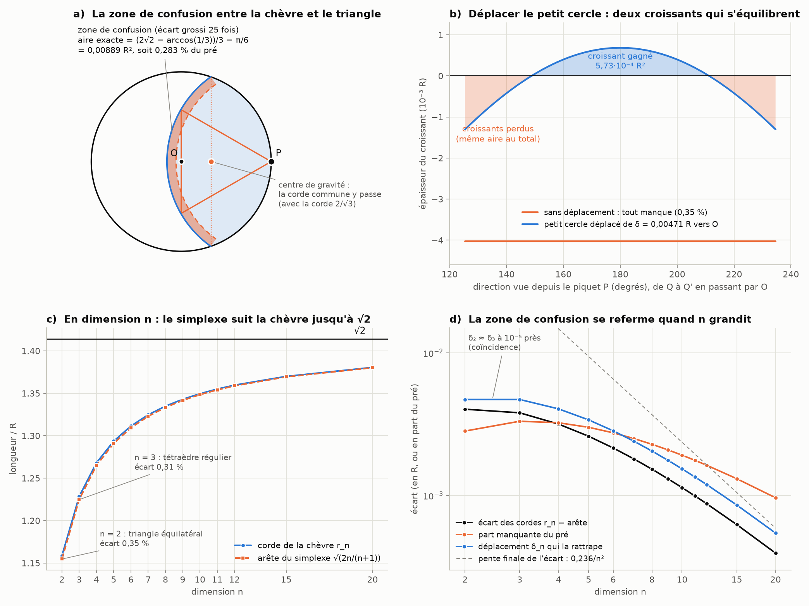

# Partie VI : le ménisque de 0,35 % entre la chèvre et le triangle

> L'idée proposée : l'écart de 0,35 % entre la corde de la chèvre et le côté du triangle équilatéral est exactement là où se crée le ménisque, avec sa zone de confusion. Il faudrait le résoudre par l'aire comprise entre les deux cercles, qui agit sur √2 et le mène vers π − 3, par la chèvre, par les dimensions et par les croissants qu'on obtient en déplaçant le petit cercle. Suite de la [partie V](aiguille-kakeya.md).

Tout est recalculé par [`scripts/zone_confusion.py`](scripts/zone_confusion.py) (≈ 5 s). Les tableaux complets sont dans [`resultats/zone_confusion.md`](resultats/zone_confusion.md).

## En bref

- **La zone de confusion a une aire exacte** :
  ```math
  \frac{2\sqrt2 - \arccos(1/3)}{3} - \frac{\pi}{6} = 0{,}00889\,R^2 ,
  ```
  soit 0,283 % du pré. On y lit √2, π et arccos(1/3), qui est l'angle du tétraèdre régulier : le « triangle » de la dimension suivante.
- **Déplacer le petit cercle résout l'écart exactement.** En rapprochant son centre de O de δ = 0,00471 R, la corde 2/√3 broute exactement la moitié du pré.
  - Il se forme alors trois croissants : un gagné au milieu, deux perdus aux bouts.
  - Leurs aires s'équilibrent exactement : 5,73·10⁻⁴ R² de chaque côté.
- **Ton triangle mène bien à √2, par les dimensions.**
  - En dimension n, le triangle devient le simplexe régulier qui a le piquet pour sommet et R pour hauteur. Son arête, √(2n/(n+1)) R, tend vers √2 R.
  - C'est exactement le terme principal de la corde de la chèvre (partie I).
  - Les 0,35 % sont le premier écart d'une suite qui se referme : 0,31 % en 3D, 0,03 % en dimension 20. Le simplexe et la chèvre arrivent ensemble à √2.
- **Avec la corde du simplexe, les deux sphères se coupent exactement dans le plan qui passe par le centre de gravité du simplexe.** C'est le « plan à R/(n + 1) » de la partie I, qui reçoit enfin une image.
- **Pour π − 3, je ne trouve pas de lien exact.** La part manquante vaut (π − 3)/50 à 0,07 % près. Mais 16 formules tout aussi simples font aussi bien ou mieux : √3/612, par exemple, est huit fois plus proche. Les vraies routes vers π − 3 par les dimensions sont les retenues de la partie IV.
- **Les croissants qui relient √2 et π, c'est Hippocrate.** Sa lunule (vers −440) est un croissant entre deux cercles de rapport √2, dont l'aire vaut exactement celle d'un triangle : le π disparaît. Notre croissant, lui, ne le peut pas (§ 5).



---

## 1. La zone de confusion

Les deux cercles ont le même centre, le piquet P. Le premier a pour rayon la corde de la chèvre, r = 1,15873 R. Le second a pour rayon le côté du triangle, a = 2R/√3 = 1,15470 R. Dans le pré, ils délimitent un croissant très fin, épais de 0,00403 R, qui suit l'arc broutable. C'est ta zone de confusion (figure a, où l'épaisseur est grossie 25 fois).

**Son aire exacte.** Avec la corde 2/√3, tout se calcule à la main.
- La corde commune des deux cercles (celui du pré et celui de rayon a) tombe en x = 1/3, exactement au centre de gravité du triangle. Sa longueur vaut 4√2/3 : **c'est par là qu'entre √2.**
- L'angle en O entre OP et le point d'intersection a pour cosinus 1/3 : **c'est l'angle de 70,53° entre deux faces du tétraèdre régulier.**
- La lentille broutée vaut alors (2π + arccos(1/3) − 2√2)/3 = 1,5619 R², au lieu de π/2 = 1,5708 R².
- La différence est l'aire de la zone : (2√2 − arccos(1/3))/3 − π/6 = 0,0088905 R².

**Une lecture simple.** La zone, c'est l'écart des cordes étalé le long de l'arc broutable. Vu du piquet, cet arc couvre un angle β = 1,906 rad, celui d'Ullisch, et mesure r·β = 2,21 R. Or 0,00403 × 2,21 ≈ 0,0089. La zone pèse 0,283 % du pré, soit 0,566 % de la moitié visée.

## 2. Déplacer le petit cercle : les croissants

On garde la corde 2/√3, mais on rapproche le piquet du centre O (figure b).
- **Le déplacement qui donne exactement la moitié vaut δ = 0,0047121 R.** Au premier ordre, c'est l'aire de la zone divisée par la corde commune : 0,00889 / 1,886 = 0,00471.
- **Les deux cercles se croisent alors en deux points**, (0,0089 ; ±0,6003), dans le pré. Ils découpent la zone en trois croissants :
  - au milieu, du côté de O, le petit cercle déplacé dépasse : c'est le croissant **gagné**, épais d'au plus 0,00068 R ;
  - aux deux bouts, près du bord du pré, le cercle de la chèvre dépasse : ce sont les croissants **perdus**, épais d'au plus 0,0013 R.
- **Les aires s'équilibrent exactement** : 5,73·10⁻⁴ R² gagnés, 5,73·10⁻⁴ R² perdus.
- **La confusion ne disparaît pas, elle se redistribue.** Au départ, un seul croissant uniforme de 0,00889 R² manquait. Après le déplacement, deux croissants de signes opposés, de 5,73·10⁻⁴ R² chacun, se compensent. La zone où les deux cercles ne sont pas d'accord a été divisée par 7,8.

## 3. Toutes les dimensions : le simplexe régulier

**Le triangle se généralise.** En dimension n, on prend le simplexe régulier qui a le piquet P pour sommet et dont la base passe par O, perpendiculairement à PO (hauteur R).
- Son arête vaut $a_n = R\sqrt{2n/(n+1)}$ : 2/√3 R pour le triangle (n = 2), √(3/2) R pour le tétraèdre (n = 3), et √2 R à la limite.
- Dans la partie I, on avait trouvé $r_n^2 = \dfrac{2n}{n+1} + \dfrac{2}{3n^2} + \cdots$ pour la corde de la chèvre.
- **L'arête du simplexe est donc exactement le terme principal de la corde de la chèvre.** L'écart est la correction 2/(3n²), atteinte lentement : n²·(r_n² − a_n²) vaut 0,037 en 2D, 0,44 en dimension 20, 0,61 en dimension 100 et 0,65 en dimension 400.

| n | arête du simplexe | corde de la chèvre | écart | part manquante | déplacement δ_n |
|---:|---|---|---|---|---|
| 2 (triangle) | 1,15470 | 1,15873 | 0,35 % | 0,283 % | 0,004712 |
| 3 (tétraèdre) | 1,22474 | 1,22854 | 0,31 % | 0,332 % | 0,004712 |
| 5 | 1,29099 | 1,29360 | 0,20 % | 0,301 % | 0,003390 |
| 7 | 1,32288 | 1,32468 | 0,14 % | 0,251 % | 0,002401 |
| 10 | 1,34840 | 1,34954 | 0,08 % | 0,192 % | 0,001537 |
| 20 | 1,38013 | 1,38053 | 0,03 % | 0,096 % | 0,000545 |
| ∞ | √2 | √2 | 0 | 0 | 0 |

C'est le sens précis dans lequel tes 0,35 % « agissent sur √2 » : la zone de confusion est la première d'une suite qui se referme, pendant que le simplexe et la chèvre convergent ensemble vers √2 (figures c et d).

**Le centre de gravité.** Avec la corde du simplexe, les sphères du pré et de la corde se coupent sur l'hyperplan x = 1 − n/(n+1) = 1/(n+1). Cet hyperplan passe exactement par le centre de gravité du simplexe : la moyenne de ses sommets, (1 + 0 + … + 0)/(n+1). C'est le « plan d'intersection à R/(n+1) » de la partie I.

**Le retour de la parité.**
- En 3D, la part manquante vaut exactement (59 − 24√6)/64 = 0,0033163 : un nombre algébrique, sans π.
- En 2D, elle contient π et arccos(1/3).

C'est encore la règle de la partie I : les dimensions impaires donnent des polynômes, les paires des équations transcendantes.

**Une proximité étrange.** Le déplacement qui rattrape l'écart vaut 0,0047121107 R en 2D et 0,0047121571 R en 3D. Les deux valeurs coïncident à 10⁻⁵ près, mais elles diffèrent à la sixième décimale : ce n'est donc pas une égalité. Je n'ai pas d'explication à cette proximité, je la signale comme telle.

## 4. Et π − 3 ?

**Ce qu'il faudrait** : une identité exacte entre la zone (ou le déplacement, ou l'écart) et π − 3. Je n'en trouve aucune.

**Ce qu'on observe.** La part manquante (0,0028299) vaut (π − 3)/50 à 0,07 % près, et √2/500 à 0,05 % près. Mais il faut se demander si c'est surprenant. J'ai donc testé toutes les formules de la forme p·C/q, avec p ≤ 10, q ≤ 1000, et douze constantes C (π − 3, √2, √3, √5, φ, e, π, ln 2, γ, ρ, ζ(3), 1).

| quantité | formules à moins de 0,1 % | les meilleures | avec π − 3 |
|---|---:|---|---|
| part manquante, 0,0028299 | 16 | √3/612 (0,008 %), γ/204, √5/790 | (π − 3)/50 (0,068 %) |
| écart des cordes, 0,0040279 | 26 | √3/430 (0,002 %), π/780 | 7(π − 3)/246 (0,028 %) |
| déplacement δ, 0,0047121 | 23 | 2γ/245 (0,003 %) | aucune |
| aire de la zone, 0,0088905 | 33 | φ/182 (0,002 %), ρ/149 | aucune |

**Pourquoi ce test règle la question.** Avec dix mille fractions et une douzaine de constantes, les candidats sont si serrés que n'importe quel nombre en trouve plusieurs à 0,1 % près. Une coïncidence à 0,07 % ne distingue donc pas π − 3 du nombre d'or ou de γ. C'est la même chose que π − 3 ≈ √2/10 dans la partie III.

**Les vraies routes de π − 3 par les dimensions** existent, et elles sont exactes (vérifiées à 20 chiffres) :
- les retenues de l'hexagone (partie IV) : π − 3 = 1/8 + 9/640 + 15/7168 + …, une retenue par dimension impaire ;
- celles du dodécagone : π − 3 = (2 − √3)/2 + (2 − √3)²/10 + … ;
- Nilakantha, réécrit avec les cônes $c_n = 1/n$ de la partie IV : π − 3 = 4(c₂c₃c₄ − c₄c₅c₆ + c₆c₇c₈ − …), soit des produits de trois dimensions consécutives.

## 5. Les croissants qui relient √2 et π : la lunule d'Hippocrate

**Ton intuition a un précédent célèbre.** Vers −440, Hippocrate de Chios trace un triangle rectangle isocèle dans un demi-cercle, puis un petit demi-cercle sur l'un des côtés de l'angle droit. Le croissant compris entre les deux arcs a exactement l'aire d'un triangle, R²/2 : le π disparaît (le script le vérifie). Les rayons des deux cercles sont dans le rapport √2.

**Ces croissants « carrables » sont très rares.**
- Quand les angles des deux arcs sont dans un rapport rationnel, il n'en existe que cinq (rapports 2:1, 3:1, 3:2, 5:1 et 5:3).
- Hippocrate en a trouvé trois. Les deux autres ont été données par Wallenius (1766), puis retrouvées par Clausen (1840).
- Tchebotarev et Dorodnov ont démontré au XXᵉ siècle qu'il n'y en a pas d'autres.

**Le nôtre n'en fait pas partie, et on peut le démontrer.** L'aire de la zone s'écrit 2√2/3 − (arccos(1/3) + π/2)/3.
- arccos(1/3) n'est pas une fraction rationnelle de π : c'est le théorème de Niven, car 1/3 n'est pas l'un des cosinus 0, ±1/2, ±1.
- Mieux : arccos(1/3) + π/2 est le logarithme (au facteur i près) d'un nombre algébrique différent de 1, donc il est transcendant (Lindemann).

L'aire de la zone est donc transcendante. Aucune construction à la règle et au compas ne la transforme en carré, contrairement aux lunules d'Hippocrate. C'est une réponse nette à « résoudre l'écart par l'aire entre les deux cercles » : on peut calculer cette aire exactement (§ 1) et la rattraper exactement en déplaçant le cercle (§ 2), mais elle garde son π.

## 6. Le tri : exact, à nuancer, coïncidence

- **Exact** :
  - l'aire de la zone et sa forme close ;
  - le déplacement δ et l'équilibre des croissants ;
  - les arêtes du simplexe comme terme principal de la corde ;
  - le plan du centre de gravité ;
  - la part manquante algébrique en 3D ;
  - la transcendance de l'aire de la zone ;
  - la lunule d'Hippocrate.
- **Établi numériquement** : la convergence lente de n²(r_n² − a_n²) vers 2/3, et le tableau des déplacements.
- **Coïncidences** : (π − 3)/50 ≈ part manquante, et δ₂ ≈ δ₃.
- **Inexact** : « l'écart mène √2 vers π − 3 ». L'écart mène bien à √2, par les dimensions, mais rien ne le relie exactement à π − 3.

## Sources

- I. Ullisch, *The Mathematical Intelligencer* 42(3), 12–16 (2020), pour la corde de la chèvre et l'angle β ; parties I et IV pour le développement $r_n^2 = 2n/(n+1) + 2/(3n^2) + \cdots$ et les retenues.
- [Lune of Hippocrates](https://en.wikipedia.org/wiki/Lune_of_Hippocrates) (Wikipédia) et [The Five Squarable Lunes](https://mathpages.com/home/kmath171/kmath171.htm) (MathPages).
- M. M. Postnikov, « The problem of squarable lunes », *American Mathematical Monthly* 107(7), 645–651 (2000), traduit du russe par A. Shenitzer : le résultat de Tchebotarev et Dorodnov.
- I. Niven, *Irrational Numbers*, Carus Mathematical Monographs 11 (1956) : les cosinus rationnels des angles rationnels.
- F. Lindemann, « Über die Zahl π », *Mathematische Annalen* 20, 213–225 (1882).
